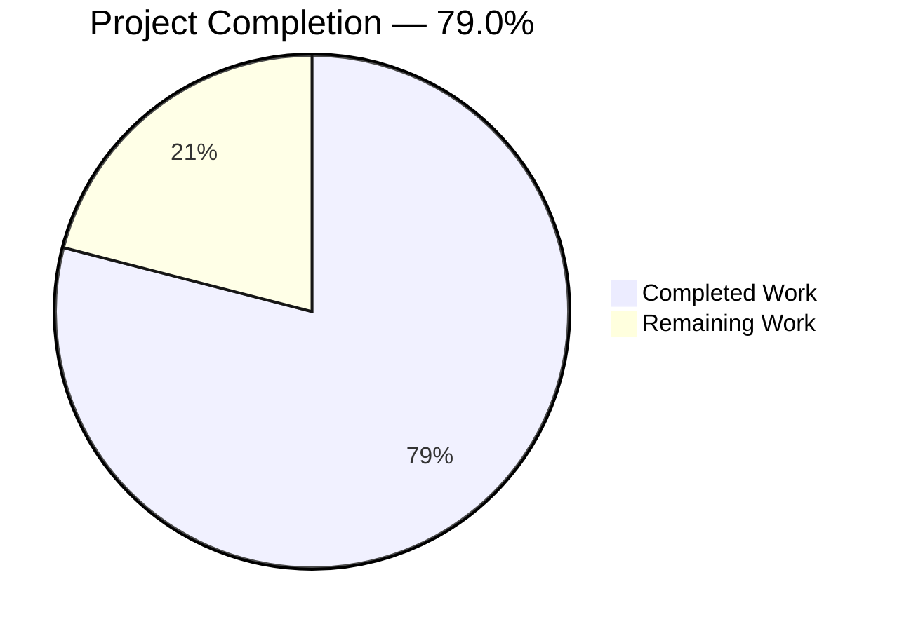
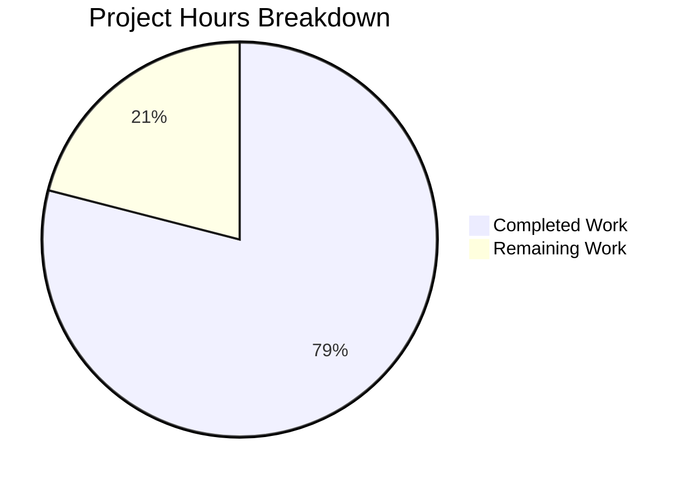
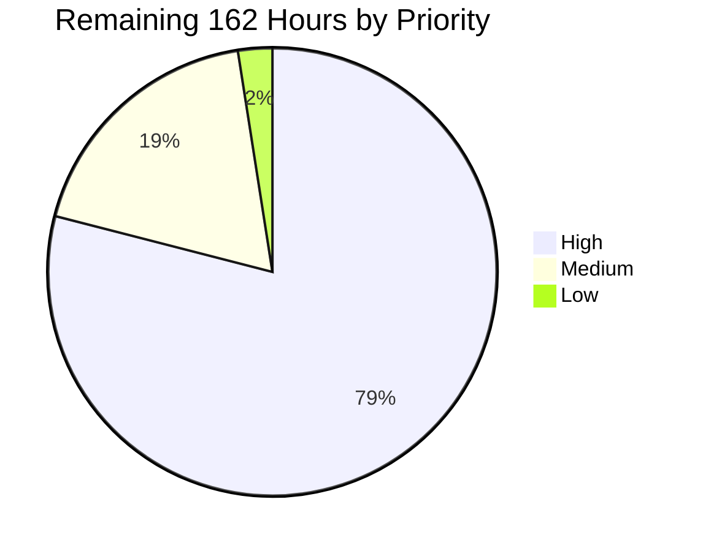
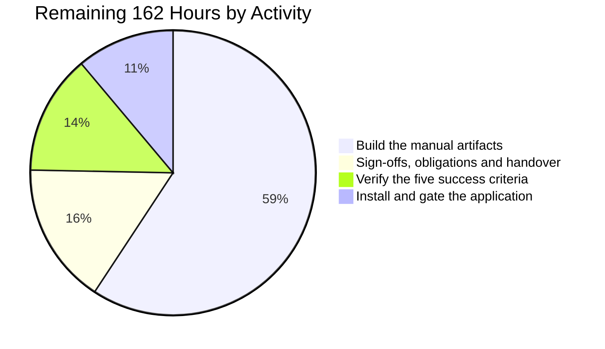
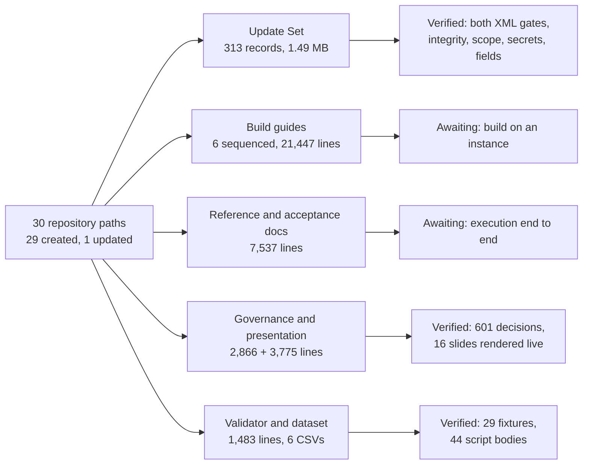

# 1. Executive Summary

## 1.1 Project Overview

The Boston Startup Tracker is now a single ServiceNow scoped application, `x_bst_startuptrk`, replacing a Flask and React stack that could not be built or started. It serves analysts, investors and recruiters who need a curated view of active, institutionally funded companies headquartered in the Boston area, with premium data fields denied by role rather than merely hidden. The delivery is one importable Update Set carrying ten tables, three roles, forty-nine access controls, eight service classes and a thirty-one-operation REST API, plus sequenced build instructions for the two ingestion flows, the five-route Service Portal and the thirty-six-test suite the platform builds through its own interface.

## 1.2 Completion Status



**Chart colours** — Completed Work: Dark Blue `#5B39F3` · Remaining Work: White `#FFFFFF`

| Metric | Value |
|---|---|
| **Total Hours** | **772** |
| Completed Hours (AI + Manual) | **610** (610 AI + 0 Manual) |
| Remaining Hours | **162** |
| **Percent Complete** | **79.0%** |

Completion covers scoped work only: `610 / 772 × 100 = 79.0%`. Every repository artifact is delivered and verified; the remaining 162 hours are instance-side work.

## 1.3 Key Accomplishments

- One importable Update Set of 313 records — both XML gates, integrity, scope, secrets and field census clean.
- Exactly the binding 53 entity columns across ten tables, split 12/6/6/6/8/9/6.
- Seven field read gates on exactly the seven premium fields; denied keys omitted, not nulled.
- Eight service classes, 6,295 lines, each rule with one home; all 44 script bodies parse.
- Thirty-one REST operations over six resources plus a nested sub-resource, all authorisation-gated.
- Ingestion specified end to end; 65 fallback rows process identically on both paths.
- Sixteen slides render live: five diagrams, 63 icons, zero console messages, zero integrity failures.
- Governance complete: 601 contiguous decisions, a bidirectional matrix, five reviewed critical decisions.

## 1.4 Critical Unresolved Issues

| Issue | Impact | Owner | ETA |
|---|---|---|---|
| The target instance is unreachable and cannot be woken from this environment | Blocks every item below it. Every path answers with an identical 5,904-byte hibernation page and never issues an authentication challenge | Instance owner | Immediate |
| The application has never been installed — the Update Set is not committed and the eleven post-commit gates are unevaluated | The runtime half of the delivery carries no evidence; nothing downstream of the import can be accepted (§5.2 DV-1) | Platform / DevOps owner | 1 day after access |
| All 36 automated tests across 10 suites are unexecuted, including the 21 field-by-role access-control assertions | The coverage gate is unevaluable rather than failed; success criterion 2 cannot be signed (§5.2 DV-1) | QA owner | 4 days after install |
| The Service Portal has not been built, so the five routes do not exist on an instance | The route walkthrough, the inclusion-filter confirmation and the premium upsell treatment are unevidenced (§5.2 DV-1) | Front-end owner | 4 days after install |
| No live provider credential exists, and three of six ingested record types have no live read path on any instance | Every ingestion run is labelled fallback validated; criterion 4 accepts the substitute, so this bounds the evidence rather than blocking acceptance (§5.2 DV-2) | Integration owner | 1 day for credentials |
| The presentation library's advisory disposition awaits a countersignature — accepted-by and date-accepted are unsupplied | Acceptance is deliberately blocked until signed (§5.2 DV-7) | Rule owner | 0.5 day |
| Acceptance item B4a, the substituted post-commit table-gate form, needs a named actor and date | Acceptance is incomplete without it, though the gates prove strictly more than the literal form (§5.2 DV-4) | Platform owner | With the gates |
| Three operator obligations are undischarged: staging retention, minimisation and erasure; flow-log retention; an inbound rate-limit rule | Verbatim upstream payloads and person data have no retention or erasure process, and the API has no platform-level rate-limit backstop | Platform / Privacy owner | 1 day after install |

## 1.5 Access Issues

| System/Resource | Type of Access | Issue Description | Resolution Status | Owner |
|---|---|---|---|---|
| ServiceNow instance `dev351809` | Developer-programme identity that owns the instance | The instance is hibernating. Every path — Table API, scoped API, login page, and paths that do not exist — answers HTTP 200 with an identical 5,904-byte page and no authentication challenge, so credentials cannot be negotiated. Waking it requires an email-keyed sign-in at a separate identity provider, which refuses the instance-local administrator name because its identifier field enforces an email form | **OPEN** — blocks all runtime validation | Instance owner |
| ServiceNow instance `dev351809` | Administrator role | Supplied and previously exercised while the instance was awake: reading the remote-update-set table, uploading and previewing the Update Set, and querying the dictionary, the release property and the upgrade history all succeeded | Available once the instance is awake | Provided |
| Crunchbase API | Provider API key | Never supplied. The alias that would hold it does not exist, and the provider accepts the key only as a request header or query parameter | **OPEN** — live acquisition cannot be exercised | Integration owner |
| LinkedIn API | OAuth2 client id, secret and refresh token | Never supplied. Independently of the credential, the provider publishes no generally available read resource for an arbitrary company's people, and its job API is write-only for an organisation's own postings | **OPEN** — bounded by the provider, not only the credential | Integration owner |
| Automated Test Framework | Runner enabled plus a test-designer role | Configured on the instance while it was awake and unverifiable while it sleeps | Re-verification required | Platform owner |

## 1.6 Recommended Next Steps

1. **[High]** Wake or provision an instance, import through commit, and evaluate the eleven post-commit gates. This unblocks everything else. *(18h)*
2. **[High]** Build the manual artifacts in guide order — aliases, both flows, the portal, the staging load, the test suites — and run all 36 tests. *(96h)*
3. **[High]** Work the acceptance checklist criterion by criterion, recording each ingestion run's provenance as fallback. *(22h)*
4. **[Medium]** Close the human acceptances: the library risk disposition, the substituted gate form, the fail-closed rate-limit trade-off, and the dashboard layout exception. *(8h)*
5. **[Medium]** Discharge the three operator obligations and rehearse both rollback branches before the first production import. *(14h)*

# 2. Project Hours Breakdown

## 2.1 Completed Work Detail

| Component | Hours | Description |
|---|---:|---|
| Data model and administrative surface | 42 | Ten tables — seven entity plus the named join, staging and rate-limit-counter tables — carrying the binding 53 entity columns, 111 dictionary and 111 label records, 77 choice values and 13 declared indexes, with ten form sections over 101 elements, ten list views over 55 elements, one related list, and an application menu with nine modules |
| Access control | 26 | Three roles and 49 access controls across five layers — seven table reads, 21 mutations restricted to the administrator role, seven field read gates on the premium fields, twelve supporting-table controls and two endpoint controls — bound by 74 role grants, with all ten tables sealed to external callers |
| Service layer | 88 | Eight Script Includes totalling 6,295 lines of ES5, giving each business rule exactly one home; none client-callable and none elevated |
| Scripted REST API | 46 | One definition and 31 operations over six resources plus the nested executives sub-resource, with the `sysparm_limit`/`sysparm_offset` contract, a `total_count` envelope, the per-field omission gate, and the specified error bodies |
| Rate limiting, derivations and configuration | 30 | A fixed-window counter keyed on a unique window value with atomic increment and fail-closed persistence emitting the exact 429 body; `portfolio_count` as a stored union of two traversal paths; the one-way participating-investor projection; three business rules; two scheduled records; eleven scoped properties with clamped accessors |
| Update Set packaging | 28 | One importable 1.49 MB document of 313 records emitted in reference-dependency order, every record linked to the header and named to the platform's update-name convention, over 692 deterministic 32-hex identifiers |
| Two-level XML validator | 22 | 1,483 lines with a fail-closed parser gate, 29 self-test fixtures, and both gates — outer document shape with header linkage, and nested payload well-formedness with the update-name contract |
| Ingestion specification | 54 | Guides 01–03, 8,548 lines: two named credential aliases, two flows with twenty step scripts, the cadence guard, the source lease, the four cleaning rules and provenance labelling, with no credential material anywhere |
| Fallback dataset and staging load | 16 | A 41-column staging contract, six CSVs carrying 65 rows, and the import guide, with the three-way contract between CSV headers, dictionary columns and the import mapping held exactly |
| Service Portal specification | 46 | Guide 04, 5,544 lines: one portal, one theme with 73 token declarations, five routes and eight widgets, with zero measured literals in widget styling |
| Test specification | 34 | Guide 05, 6,143 lines: ten suites, 36 tests and 511 steps, including the 21 field-by-role access-control cells |
| Deployment and acceptance apparatus | 32 | The runbook, eleven post-commit gates plus two pre-commit checks and four diagnostics, the rollback procedure and failure matrix, and the acceptance checklist mapped one-to-one onto the five success criteria — 3,712 lines |
| Reference documentation and flag register | 32 | Data model, access control, API reference, package index, manual-build index and sample-data contract, plus a register of nineteen flagged requirements and eight design-system gaps |
| Governance record and executive presentation | 46 | A 601-decision log with the four mandated columns, a bidirectional traceability matrix, five risk-ordered critical decisions with named reviewers, and a sixteen-slide self-contained presentation with its canonical theme |
| Verification and hardening | 68 | Direct execution of the delivered scripts against platform stand-ins, the live-versus-fallback equivalence run, the nine pre-delivery gate sweeps, browser validation of the presentation, and the repository navigation update |
| **Total** | **610** | |

## 2.2 Remaining Work Detail

| Category | Hours | Priority |
|---|---:|---|
| Instance provisioning and the import through commit — wake or provision an instance, run the three pre-flight checks, clear the stale retrieved update set, upload, load, re-preview the current 313-record artifact, commit, and record the elapsed preview against the 600-second cap | 10 | High |
| Post-commit acceptance gates — the eleven required gates plus the column-count gate, the four security diagnostics, the two pre-commit checks, and a signature on the substituted table-gate acceptance | 8 | High |
| Criterion 1 — the field-by-field walk of all 53 columns across the seven entity tables against the committed dictionary | 6 | High |
| Criterion 2 and the coverage gate — build ten suites, 36 tests and 511 steps, create three single-role users, execute, and record 21 of 21 field-by-role cells | 32 | High |
| Criterion 3 — exercise the six resources plus the nested sub-resource on the wire: response shape, pagination with `total_count` agreement, and the deterministic 429 with `retry_after` | 8 | High |
| Credential provisioning — supply the provider key and the OAuth2 triple, build both aliases, run the provider-correct authenticated probes, and settle the base-URL activation gate | 8 | High |
| Ingestion flow build and staging load — both flows from guides 02 and 03 including twenty step scripts, the outbound-path branch decision, and the CSV import | 24 | High |
| Criterion 4 — three consecutive cadence-guard-passing runs per flow with zero unhandled errors and each run's provenance recorded | 8 | Medium |
| Criterion 5 — build the portal, theme, five pages and eight widgets, then walk the five routes confirming the five profile tabs, the inclusion filter against a seeded excluded startup, and the premium upsell for the base role | 32 | High |
| Human acceptances and risk sign-offs — countersign the library advisory disposition; accept or close the dashboard layout gap with a written exception; accept the fail-closed rate-limit trade-off, the absence of REST-layer input validation, and the nineteen operations without automated cover | 8 | Medium |
| Operator obligations — staging retention, minimisation and data-subject erasure; flow-execution retention and read access; an inbound platform rate-limit rule on the seven Table API routes | 8 | Medium |
| Documentation consistency pass — align four stale flow-action output statements, correct one method name in the API reference, escape thirteen pipe characters inside inline-code spans across eight documents, and confirm four residual cosmetic items | 4 | Low |
| Post-deployment handover — idempotent re-execution of the import, both rollback branches rehearsed on a disposable instance, and the operational baseline recorded | 6 | Medium |
| **Total** | **162** | |

Remaining work by priority: **High 128h · Medium 30h · Low 4h**.

## 2.3 Estimation Basis and Confidence

Total project hours are `610 completed + 162 remaining = 772`, giving `610 / 772 × 100 = 79.0%` complete. Every completed figure is anchored to an artifact count taken from the delivered bytes — 313 update records, 53 entity columns, 49 access controls, 31 operations, 6,295 lines of service logic, 28,984 lines of build and reference documentation — rather than to elapsed time.

**High confidence** applies to every completed figure and to the bounded procedural remaining tasks: the import sequence, the post-commit gates, the field-by-field walk, the wire verification, credential provisioning, the documentation pass and the handover. Each of these runs against a mechanism that has already been exercised against the platform or against a document whose contents are fully determined.

**Medium confidence** applies to the three guided-build tasks — 36 tests over 511 steps, two flows over twenty step scripts, and eight widgets. Each is transcription of a complete specification into the platform's own interface, so the guides bound the risk, but how readily that interface accepts a transcribed specification is not yet measured.

**Lower confidence** applies to criterion 4's scheduled-run evidence. Three consecutive cadence-guard-passing runs per flow is a scheduling-window dependency rather than an effort estimate, and a hibernating instance stops scheduled jobs altogether.

# 3. Test Results

Every result below was executed and observed. Nothing is inferred, and no count of test files is presented as a count of tests.

| Area / Category | Framework | Tests | Passed | Failed | Coverage | What This Proves |
|---|---|---:|---:|---:|---|---|
| Update Set structural validation | `validate_update_set_xml.py` self-test | 29 | 29 | 0 | 17 byte-prologue + 12 parser-gate fixtures | The validator's own gates behave as specified, including the fail-closed parser gate, before it is trusted on the artifact |
| Update Set two-level well-formedness | `validate_update_set_xml.py` gates G-1 and G-2 | 313 records × 2 gates | all | 0 | 313/313 outer records, 313/313 nested payloads | The single deliverable is parseable by the platform at both levels, every record is linked to its header, and every record names the record its payload carries |
| Nested-escaping negative control | Injected mutation compared against `xmllint` | 1 | 1 | 0 | The dominant hand-authored defect class | A single-escaped ampersand inside a script payload passes `xmllint` as well-formed yet is rejected with a located diagnostic — the two-level design is load-bearing, not belt-and-braces |
| Artifact integrity gates | Independent re-derivation from the delivered bytes | 5 gates | 5 | 0 | Referential integrity, scope containment, secret hygiene, field fidelity, deliverable completeness | 692 unique 32-hex identifiers with no duplicates, one application scope throughout, no credential material anywhere, exactly 53 entity columns split 12/6/6/6/8/9/6, and exactly the 30 intended repository paths changed with the legacy tree untouched |
| Embedded script syntax | `node --check` over bodies extracted from the Update Set | 44 | 44 | 0 | All Script Includes, business rules, the scheduled job, the calculated column and all 31 operation scripts | Nothing the platform will execute carries a syntax error, and no placeholder, stub or deferred-work marker survives |
| Validator source quality | `py_compile`, `ruff check`, CLI contract matrix | 4 checks | 4 | 0 | Compilation, lint, exit codes 0/1/2, diagnostic capping | The one piece of delivered source compiles clean, lints clean, and honours its documented exit-code and reporting contract |
| Documentation and governance integrity | Link, anchor, fence and census sweeps over 20 markdown files | 4 sweeps | 4 | 0 | 1,592 relative links, 1,845 heading anchors, all fences, 3,083 decision references | Every internal reference resolves, so the build guides and the acceptance checklist can be followed without dead ends; the decision record is contiguous from D-001 to D-601 with no dangling reference |
| Executive presentation runtime | Headless Chrome, full sixteen-slide walk | 8 conditions | 8 | 0 | 16 slides, 5 diagrams, 63 icons, network, policy, integrity, idempotence | Every slide carries a visual and no more than four bullets, all five diagrams render with legible labels and no raw source ever painted, all 63 icons resolve, zero emoji, zero console messages, 11 of 11 requests succeeded, zero policy violations, zero integrity failures, and re-visiting a slide leaves it byte-identical |

### Not Covered

The following capabilities are delivered but exercised by no test or runtime check. Each needs a human to test it before release.

- **The ten tables as created objects, and the thirty-six-test suite that would confirm them.** No test has executed anywhere. The suite is fully specified — ten suites, 36 tests, 511 steps — but building and running it requires an instance. Criterion 1's field-by-field walk of all 53 columns and criterion 2's twenty-one field-by-role cells both live here.
- **Access control as evaluated by the platform's own engine.** The 49 controls and the seven field read gates are present, correctly bound and internally consistent, but no request has ever been denied by the platform. Every control carries the administrator override, so a check performed as the instance administrator will display all seven premium fields and appear to prove enforcement that was never tested — the twenty-one cells must run under impersonation by three purpose-created users each holding exactly one scoped role and none of the elevated platform roles.
- **The thirty-one REST operations as HTTP endpoints.** Their logic was exercised by executing the delivered operation scripts directly, which covers request parsing, the pagination arithmetic, the per-field omission gate and the error bodies — but no request has traversed the platform's own routing, authentication or access-control layer. Nineteen of the thirty-one additionally carry no automated regression test even once the suite runs.
- **Both ingestion flows and both credential aliases.** The four cleaning rules, the mapping, the run lease and the diagnostics were exercised against the delivered scripts and process 65 staged rows to 52 accepted and 13 rejected identically on both paths. The flow shells, the trigger firing, the action bindings and alias resolution against real provider credentials were not.
- **The Service Portal on a platform.** All five routes and all eight widgets were driven at runtime against a surrogate compiled from the guide's verbatim templates, stylesheets and theme tokens, which verifies markup and styling faithfully. The widgets' server scripts — the secured reads, the per-field omission gate, the aggregate counts — were never executed, and the portal has never been built on an instance.
- **Platform-triggered behaviour.** The three business rules and two scheduled records firing on their own schedules, the reference cascade-delete on the five mandatory child references and the join table, the unique window-key index rejecting a duplicate insert under real database concurrency, the declared indexes (which exist only after commit), and the default form, list and menu records as rendered.
- **The staging CSV import through the platform's import wizard, and the deployment runbook end to end.** The three-way staging contract was verified by inspection; no import was run, and no commit or rollback has been executed on any instance.
- **Two behaviours with no shipped fixture.** The ambiguous-parent branch of startup resolution has none because no two startups in the dataset share a name, and comma-preservation in an investor name has none because no shipped name contains one. Both were proved by direct execution of the delivered scripts, so the properties hold — but nothing in the dataset exercises them.

# 4. Runtime Validation &amp; UI Verification

✅ **Operational — Update Set load and preview on the platform.** The artifact was uploaded through the platform's multipart import route and reached `loaded` with every customer update linked to its header, then previewed to `state=previewed` with `summary` and `inserted` both equal to the record count, zero updated, zero deleted, zero collisions, **zero error-type and zero warning-type preview problems**, and an execution tracker reporting `Success!` in roughly twenty seconds. The native interface independently corroborated the same state across 297 requests with zero console errors and nothing at or above HTTP 400, and the record's modification stamps were unchanged, proving the read caused no mutation.

⚠ **Partial — pre-commit import assertions.** Both checks were executed verbatim against the platform and passed, one returning a body character-for-character identical to its documented expected result. Their discriminating power was proved with a negative control: a deliberately unlinked import that reproduced the silent-success mode — a clean preview reporting nothing to apply — and both checks correctly failed it. They have not been run against the current 313-record revision.

❌ **Failing — instance reachability, and therefore everything downstream.** The target instance answers every path with an identical 5,904-byte hibernation page, including an authenticated Table API read, the login page and paths that do not exist, and it never issues an authentication challenge. No commit, no gate evaluation, no test execution and no portal walkthrough is possible until it is woken under the developer-programme identity that owns it.

❌ **Never exercised — the commit and the eleven post-commit gates.** Preview is the strongest evidence on record; the commit itself has never run on any instance, so the eleven required gates, the column-count gate and the four security diagnostics are unevaluated.

❌ **Never exercised — the thirty-one REST operations as endpoints.** Their scripts were executed directly, which covers request parsing, pagination arithmetic, the per-field omission gate and the specified error bodies, but no request has ever traversed the platform's routing, authentication or access-control layer.

❌ **Never exercised — field-level access control under the platform's own evaluation.** No request has been denied by the platform. The twenty-one field-by-role assertions must run under impersonated single-role users, because every control carries the administrator override.

❌ **Never exercised — both ingestion flows, both credential aliases and the staging import.** The flow shells, the cadence trigger firing, the action bindings and alias resolution against real provider credentials have not been built. The cleaning rules, the run lease and the diagnostics were exercised against the delivered scripts, processing 65 staged rows to 52 accepted and 13 rejected identically on the live-payload and fallback paths, with an equivalence run reporting no identity discrepancies.

⚠ **Partial — the five Service Portal routes and eight widgets.** All five routes were driven at runtime across 21 navigations against a surrogate built from the guide's verbatim templates, stylesheets and 54 theme tokens, with fixtures in the platform's real serialiser value shapes. Every route rendered with a heading in every state, no horizontal overflow at the 1024-pixel floor, 32 contrast pairs with no failures, zero console errors, and the base role's premium rows **absent from the markup rather than blank**. A hostile-input pass rendered 38 payload-bearing text nodes with zero execution. The portal has never been built on an instance and the widgets' server scripts were not executed.

✅ **Operational — the executive presentation.** Sixteen slides walked end to end in a real browser at 1920×1080: all sixteen carry a non-text visual, no slide exceeds four bullets, all five diagrams render to vector output with no raw source ever painted across 28,095 frame checks, all 63 icons resolve across 28 distinct names, zero emoji in 10,681 characters of rendered text, zero console messages at any level, eleven of eleven requests succeeded, zero content-security-policy violations under a strict deny-by-default policy, and zero subresource-integrity failures. Re-visiting a diagram slide leaves it byte-identical, confirming the render driver is idempotent.

⚠ **Partial — the deployment procedure's own guards.** The pre-flight session block was executed verbatim against the sleeping instance and correctly refused to proceed, because it asserts that a session cookie was established rather than trusting the response status — a failed sign-in on this platform also answers HTTP 200. The corrected upgrade-history query form, the multipart upload route and the AJAX preview trigger were each confirmed against the platform while it was awake; the generic forms in the surrounding environment brief do not work here, returning HTTP 400 and a silently ignored request respectively.

# 5. Compliance &amp; Quality Review

## 5.1 Compliance Matrix

Each row records where the deliverable stands now.

| # | Deliverable | Benchmark | Status | Progress |
|---|---|---|---|---|
| 1 | Data model — 7 entity tables, 53 binding columns, exact types, lengths and mandatory flags, plus the named join, staging and counter tables | Binding field list, no additions or omissions | ✅ PASS | 53/53 columns, 12/6/6/6/8/9/6; 10 tables; 0 documentation mismatches |
| 2 | Access control — 3 roles, layered table and field controls, base role genuinely denied, denied keys omitted not nulled | Field-level denial, no bypass through elevated code | ✅ PASS as delivered · ⚠ unproven on a platform | 49 controls, 74 grants, exactly 7 field gates on exactly the 7 premium fields; 0 of 21 role cells executed |
| 3 | Service layer — every rule with a single home, none client-callable, none elevated | Single source per rule; secured read path only | ✅ PASS | 8 classes, 6,295 lines; 8/8 non-client-callable; 44/44 bodies parse |
| 4 | REST API — 6 resources plus the nested sub-resource, cursor pagination, `total_count` | 31 operations, both authorisation flags on every one | ✅ PASS as delivered · ⚠ never called over HTTP | 31/31 operations require authentication and access-control authorisation |
| 5 | Error contracts — the exact 429 body with a computed retry value, the 500 body, skip-and-continue ingestion | Byte-exact response bodies | ✅ PASS | Bodies asserted against the delivered scripts; a standard retry header additionally carries the same value |
| 6 | Ingestion — 2 named aliases, 2 flows, cadence configurable 6–48 hours, 4 cleaning rules, fallback dataset, provenance labelling | No credential material in flows, inputs, scripts or the artifact | ✅ PASS as specified · ❌ not built | 0 credential literals anywhere; 65 rows → 52 accepted / 13 rejected identically on both paths |
| 7 | Service Portal — 5 routes, 8 widgets, no alternative builder, 1024-pixel floor | Platform component and token vocabulary only | ✅ PASS as specified · ❌ not built | 0 `sp_*` records in the artifact by design; 0 measured literals, 0 sub-medium column classes; 73 theme tokens |
| 8 | Test coverage — 100% of the 7 tables and 6 REST resources with a passing automated test | 10 suites, 36 tests before delivery | ⚠ UNEVALUABLE | Specification complete at 511 steps; 0 of 36 executed |
| 9 | Packaging — one importable Update Set, well-formed at the outer and nested levels | Single file, both levels validated before delivery | ✅ PASS | 313 records, 1.49 MB; both gates PASS; the nested level proved to catch what a single parse cannot |
| 10 | Deployment apparatus — pre-flight, six-step import, post-commit gates, rollback | Empty error-problem set required before commit | ✅ PASS as documented · ❌ never run end to end | Zero error and zero warning preview problems observed; commit and gates unexecuted |
| 11 | Flag obligation — every requirement with no clean platform equivalent flagged, not silently omitted or half-implemented | Explicit register | ✅ PASS, exceeded | 19 flagged requirements and 8 design-system gaps against the ten anticipated |
| 12 | Governance — decision log with four columns, bidirectional traceability at full coverage, five risk-ordered critical decisions, self-contained executive presentation | All three project rules | ✅ PASS · ⚠ one countersignature outstanding | 601 contiguous decisions, 620 matrix rows, 5 entries High/High/High/Medium/Medium with all five reviewer personas, 16 slides verified live |

## 5.2 AAP &amp; Rule Divergences and Gaps

| # | What the AAP/Rule Required | What Was Delivered Instead | Why It Diverged | Impact | Remediation |
|---|---|---|---|---|---|
| DV-1 | Import, preview clean, **commit**, then pass eleven post-commit gates, with all 36 tests passing and all five success criteria verified | The declarative artifact and every build guide; none of the instance-side half executed | The target instance is unreachable and cannot be woken with the credentials supplied | **Release-blocking.** The runtime half of the delivery carries no evidence; nothing downstream of the import can be accepted | Wake or provision an instance, run the runbook end to end, then work the checklist criterion by criterion *(§2.2 rows 1–5, 9, 13)* |
| DV-2 | Live acquisition from both named providers on the configured cadence | The fallback dataset path only; every run labelled fallback validated | No provider credential was ever supplied, **and** one provider publishes no read resource for the three record types concerned | **Release-blocking as evidence.** Criterion 4 explicitly accepts the sample-dataset substitute, so this bounds what may be claimed rather than what may be accepted | Supply both credentials and build both aliases; pursue a provider partner grant if live people and job data are ever required *(§2.2 rows 6–8)* |
| DV-3 | A Basic-authentication alias holding the provider key in its password field | The alias as the encrypted store, with the key read at run time and sent as a provider-specific request header | That provider accepts HTTP Basic in no form at all | Medium. The no-secret-in-flow-or-artifact property is fully preserved; the platform's generic connection test is no longer a valid completion signal | Use the provider-correct authenticated probe as the activation gate, and confirm the base URL against it *(§2.2 row 6)* |
| DV-4 | Seven post-commit gates each performing a successful **read** on one entity table | Seven gates reading each table's dictionary record and asserting its name and three closed access flags | All ten tables are sealed to external callers, so the literal row read would fail against a **correct** build | Low, and strictly stronger. Acceptance is incomplete until a named human signs the substituted form | Sign acceptance item B4a with an actor and a date *(§2.2 row 2)* |
| DV-5 | An unmatched funding stage or round type mapped to `Other` and logged | Logged, with the column **left unwritten**, on the six lists that declare no such member | The choice definitions are declared binding and complete, so storing or adding `Other` would breach the stronger constraint | Low. Two non-mandatory columns can be absent rather than `Other`; nothing is lost silently and no record is rejected | Confirm the reading when the choice assertions run *(§2.2 row 4)* |
| DV-6 | ~43 controls and ~64 grants, a four-column counter table, one scheduled job, no declared indexes, an accepted rate-limit race, and `total_count` by aggregate | 49 controls and 74 grants across five layers, a fifth mandatory unique counter column, two scheduled records, 13 declared indexes, the race **closed**, and `total_count` by secured bounded iteration with a cap flag | Endpoint authorisation otherwise fell to the platform default; per-window uniqueness is unachievable without the key column; the race's real failure was a fail-open; an aggregate does not evaluate access control | Medium. One behaviour needs an explicit human acceptance: a counter-table outage now **refuses** requests rather than admitting them | Accept the fail-closed trade-off and add an inbound platform rate-limit rule as defence in depth *(§2.2 rows 10–11)* |
| DV-7 | The presentation diagram library pinned at a specific version, verbatim | The pin retained against a newer security baseline, with the residual risk disposed of as an explicit acceptance | A project rule fixes the version verbatim and outranks a baseline in this authority model | **Acceptance-blocking.** Scope is one static local file with no input surface, no privileged context and no application data | Countersign the disposition with a name and a date, or amend the rule and re-derive all five integrity digests *(§2.2 row 10)* |
| DV-8 | Seven smaller literal readings across logging destination, log size, write-path validation, page-size configuration, list materialisation, test breadth and design-system purity | Each implemented as described in the paragraph below | Each traces to a platform constraint, a stronger competing requirement, or a component the design system does not publish | Low individually. One is user-visible: the dashboard chart row has a ragged lower edge | Grant a written exception for the layout gap and close the documentation inconsistencies *(§2.2 rows 10, 12)* |

**DV-1 — the instance-side acceptance record is unevaluated.** The Update Set has never been committed, so the eleven post-commit gates, the column-count gate, the four security diagnostics, all 36 automated tests and all five success criteria have never run. The cause is single and external: the instance answers every path — Table API, scoped API, login page, even paths that do not exist — with an identical 5,904-byte page and never issues an authentication challenge, so the supplied credentials cannot be negotiated. Waking it needs the email-keyed developer-programme identity that owns it. This is recorded as unevaluable rather than failed, because a required gate marked failed is answered by a rollback that deletes the scope.

**DV-2 — live acquisition is not evidenced, and for three record types is not achievable.** Two causes compound. The provider key and the OAuth2 triple were never supplied, so neither alias exists. Independently, one provider publishes no generally available resource enumerating an arbitrary company's people, and its job endpoint is a write API for an organisation's own postings — so founders, executives and job postings have no live read path on any instance. That flow's live call is an organisation-identity probe, so a credential alone can never earn the live-validated label; only a partner grant would. Criterion 4 accepts the substitute, so acceptance is not blocked. See `gaps-and-flags.md` F15.

**DV-3 — the specified authentication transport does not exist at the provider.** The plan described the Crunchbase alias as Basic authentication with the key in its password field; that provider authenticates a key header or a query parameter and accepts HTTP Basic in no form. The alias remains the encrypted store, and the flow reads the key at run time and sends the header, so no key reaches a URL, a flow input, a script step or the artifact. The platform's generic connection test composes neither provider's required headers, so it can report green on a chain no provider accepts and is a diagnostic only. See `gaps-and-flags.md` F14, F16 and F17.

**DV-4 — the table gates read metadata because a correct build refuses a row read.** All ten tables are sealed to external callers so that a field-level denial cannot be defeated by query-predicate bisection, by the aggregate interface or by an unsecured cross-scope read. A sealed table answers HTTP 400 to every external caller, so the literal row read the plan specifies would fail against a correctly built application and trigger the scope-deletion rollback. The seven gates therefore read each table's dictionary record and assert its name with three closed access flags, proving strictly more than existence. Because this departs from agreed wording, it is carried as a named, acceptance-blocking human acceptance.

**DV-5 — `Other` is written only where the choice list declares it.** Cleaning rule 3 as worded maps an unmatched funding stage or round type to `Other` and logs it. Six of the eleven delivered choice lists declare no such member, and the choice definitions are declared binding and complete — so storing `Other` would persist a value the dictionary does not declare, and adding the member would breach both that declaration and the field-fidelity gate. The delivered behaviour logs the event naming the column, the value and the outcome, and leaves the column unwritten; both affected columns are non-mandatory, so no record is rejected. Adding the member would restore literal compliance with no code change.

**DV-6 — inventories exceeded, and one accepted risk closed rather than accepted.** The plan's access-control figures are explicit approximations; the delivered set is a closed decomposition of 7 + 21 + 7 + 12 + 2, the additions being endpoint controls, without which endpoint authorisation falls to the platform default, and supporting-table create and delete controls, which otherwise relied on an implicit deny. The counter table gained a fifth mandatory unique column, without which one row per caller, per resource, per window is unachievable at the database. Most consequentially, the fixed-window race the plan explicitly accepted was closed, because its real failure mode was a fail-open that makes the limit optional under exactly the load an attacker would generate.

**DV-7 — the library pin is retained and the residual risk is owned rather than fixed.** The rule governing the executive presentation states the diagram library's version verbatim, and a rule outranks a security baseline here, so re-pinning is the rule owner's act. The in-range advisories are recorded with their ranges independently verified, and none is reachable in the delivered file: a single static local artifact with no input surface, no privileged context and no application data. Every field the delivery could establish is filled; the two human fields read as required and unsupplied, so acceptance is deliberately blocked. The same rule permits loading the third library on demand under the identical pin and digest.

**DV-8 — seven smaller departures, each with a constraint behind it.** The ingestion logger writes the platform application log with a scoped prefix rather than the flow execution log, because a scoped class has no supported API for writing there and the flow-log table is global; the log, skip and continue obligations are unchanged. The decision log carries 601 rows against an estimated 44, because merging them would erase the record the rule exists to create. REST create and update do not route bodies through the cleaning rules. The page-size properties are hard-capped in code because they were the pagination bound's only ceiling. Nineteen operations carry no automated test, because more would breach the count gate.

# 6. Risk Assessment

These are forward-looking: what could still go wrong once the application is installed and running.

| # | Risk | Category | Severity | Probability | Mitigation | Status |
|---|---|---|---|---|---|---|
| K1 | Preview of the 313-record Update Set exceeds the 600-second abort cap, halting the deployment at the preview step — and the single-file requirement forbids splitting the set | Technical | High | Medium | The strongest available evidence is a roughly twenty-second preview of a 309-record revision on a warm instance with a clean scope, so there is apparent headroom. The runbook obliges the operator to record the elapsed preview as observed-against-600 on success as well as on failure, so a first deployment either closes this risk or escalates it | Open, monitored |
| K2 | The rollback deletes the scope record and cascades its tables, roles and flows — the one irreversible operation in the procedure — and is triggered by a commit failure **or any post-commit gate failure**, so a gate that false-fails destroys correct work | Operational | High | Low | Two pre-commit checks establish that the import has something to apply before the commit runs; the seven table gates were re-expressed so they cannot false-fail against a sealed build; a retryable server-error class prevents a momentary edge error from triggering rollback; the failure matrix names the specific conditions that may trigger it | Mitigated by design; rehearsal outstanding |
| K3 | Field-level access control is unproven against the platform's own evaluation engine, and the administrator override makes a naive check worthless — a walkthrough as the instance administrator displays all seven premium fields and appears to prove enforcement that was never tested | Security | High | Medium | The twenty-one field-by-role cells must run under impersonation by three purpose-created users each holding exactly one scoped role and none of the elevated platform roles; the acceptance checklist states this as criterion 2's entry condition, and a spot check confirms a denied field is absent from the response rather than present and empty | Open until the suites run |
| K4 | Live acquisition for three of the six ingested record types is not achievable on any instance, so a stakeholder expecting live people and job data will not get it | Integration | High | High | The sanctioned fallback dataset carries all three record types, every run is labelled fallback validated so a passing result can never be mistaken for validated live integration, and the acceptance criterion explicitly permits the substitute. Only admission to an approved provider partner programme changes this | Flagged and bounded |
| K5 | The delivered provider root is a candidate rather than a confirmed endpoint, and the platform's own connection test cannot validate the wire contract — it can report green on a chain no provider accepts and red on one that works | Integration | Medium | Medium | The generic test is retained as a diagnostic and is explicitly not a completion criterion; live mode activates only on a provider-correct authenticated probe returning success, and correcting the root is an instance configuration change that needs no re-export | Mitigated by procedure |
| K6 | The fail-closed rate-limit policy turns a counter-table outage into a denial of service against the API rather than a bypass of its limit | Technical | Medium | Low | Chosen deliberately, because the alternative fail-open makes the limit optional under exactly the load an attacker would generate. An inbound platform rate-limit rule on the seven Table API routes provides defence in depth, and the trade-off is carried as an explicit human acceptance | Mitigated; acceptance outstanding |
| K7 | Nineteen of the thirty-one REST operations carry no automated regression test, so a change to one of them can ship unnoticed | Technical | Medium | Medium | The shared request-parsing and response-building layer that all thirty-one operations depend on **is** covered, so a defect there fails an existing test. The nineteen belong at an API-testing layer outside the delivered suite, whose size is fixed by the coverage gate | Accepted limit |
| K8 | Verbatim upstream payloads and person data accumulate in the staging table with no retention window, no minimisation and no data-subject erasure path | Security | Medium | Medium | Named as an operator obligation with a defined shape: a retention window, minimisation of the raw payload column, and an erasure path, each an action on an instance by a named role | Open |

# 7. Visual Project Status

### Overall Progress — 79.0% Complete



**Brand colours** — Completed Work: Dark Blue `#5B39F3` · Remaining Work: White `#FFFFFF` · Headings and accents: Violet-Black `#B23AF2` · Highlight: Mint `#A8FDD9`

Total 772 hours. Completed 610. Remaining 162.

### Remaining Work by Priority



### Where the Remaining Effort Sits



The distribution is the assessment in one picture: no remaining hour is spent authoring the application, because the application is authored. Every remaining hour is spent putting it on an instance, building the artifacts the platform generates through its own interface, and proving the five acceptance criteria against it.

### Delivery Composition



# 8. Summary &amp; Recommendations

**What you have.** The Boston Startup Tracker now exists as a complete ServiceNow scoped application in one importable Update Set: ten tables carrying exactly the 53 binding entity columns, three roles governed by 49 access controls across five layers, eight service classes totalling 6,295 lines that give every business rule a single home, a thirty-one-operation REST API over six resources plus the nested executives sub-resource, a fixed-window rate limiter emitting the exact specified 429 body, and eleven scoped properties holding no secret. Around it sit six sequenced build guides for the artifacts the platform generates through its own interface — two credential aliases, two ingestion flows, a five-route Service Portal with eight widgets, a thirty-six-test suite and a staging import — plus a deployment runbook, an acceptance checklist mapped one-to-one onto the five success criteria, a register of nineteen flagged requirements, a 601-decision governance record with a bidirectional traceability matrix, and a sixteen-slide executive summary. The legacy Flask and React tree is byte-identical to where it started, exactly as required.

**What was proved.** The single deliverable passes two-level XML validation over all 313 records and all 313 nested payloads, and the second level is demonstrably load-bearing rather than defensive: a deliberately mis-escaped script payload passes a conventional XML parse and is caught with a located diagnostic. Referential integrity holds across 692 unique identifiers with no duplicates and one application scope throughout; there is no credential material anywhere; the field census is exact; and precisely the thirty intended repository paths changed. All 44 embedded script bodies parse, the validator compiles and lints clean and honours its exit-code contract, and every one of 1,592 internal links and 1,845 anchors resolves so the build guides can be followed without dead ends. The executive presentation was walked end to end in a real browser with zero console messages, zero policy violations and zero integrity failures. On the platform itself, the Update Set was uploaded, loaded with every record linked to its header, and previewed to a completely clean result — zero error problems and zero warning problems — with the native interface independently corroborating the same state, and the two pre-commit checks proved discriminating against a negative control.

**What is missing, stated plainly.** The application has never been installed. The commit has not run, so the eleven post-commit gates are unevaluated; none of the thirty-six automated tests has executed anywhere, so the twenty-one field-by-role access-control assertions that success criterion 2 depends on are outstanding; neither ingestion flow nor either credential alias has been built; the Service Portal does not exist on an instance, so criterion 5's five routes cannot be walked. The cause is a single external one: the target instance answers every path with an identical hibernation page and never issues an authentication challenge, and waking it needs the developer-programme identity that owns it. Two constraints will survive that unblocking and should be understood now. No live provider credential was ever supplied — and independently of that, one provider publishes no read resource for people or third-party job postings, so founders, executives and job postings have no live acquisition path on any instance without a partner grant. Every ingestion run is therefore labelled fallback validated, which the acceptance criterion explicitly permits.

**The critical path.** Eighteen hours put the application on an instance and gate it: wake or provision the instance, clear the stale retrieved update set, run the import through commit against the current 313-record artifact, and evaluate the eleven gates. Ninety-six hours build the manual artifacts in the guides' own dependency order — aliases, both flows, the portal, the staging load, then the test suites last because they exercise everything. Twenty-two hours prove the five criteria. Twenty-six hours close the human acceptances, the three operator obligations, the documentation pass and the rollback rehearsal. Success is measurable rather than impressionistic: eleven of eleven gates passing, thirty-six of thirty-six tests passing, fifty-three of fifty-three columns walked, twenty-one of twenty-one role cells correct under impersonated single-role users, six of six resources returning a paginated envelope and a deterministic 429, three consecutive guard-passing runs per flow with recorded provenance, and five routes rendering with the inclusion filter demonstrably excluding a seeded ineligible startup.

**Production readiness.** At **79.0% complete** — 610 of 772 hours — this is a fully specified, statically verified application that has not yet been proven on a platform, and it should be treated exactly that way. It is ready to deploy to a non-production instance today and should not be considered production-ready until the eleven gates and the thirty-six tests have passed and criterion 2 has been signed under impersonation, because the administrator override means a check performed as the instance administrator proves nothing about field-level enforcement. Two decisions need a named owner before acceptance closes: countersigning the presentation library's risk disposition, and accepting that a rate-limit counter outage now refuses API requests rather than admitting them — a deliberate choice, made because the alternative leaves the limit optional under exactly the load an attacker would generate. Neither is a defect; both are trade-offs the delivery declined to make on someone else's behalf.

# 9. Development Guide

There is no local application to run. The application runs on the ServiceNow platform, and this repository holds the artifact that installs it, the tooling that validates that artifact, the guides that build the rest, and the executive summary. Every command below was executed, and the output shown is the output observed.

## 9.1 System Prerequisites

**Local — validating the artifact and reading the package**

| Requirement | Version used here | Why |
|---|---|---|
| Python 3.9 or later | 3.13.7 | Runs the Update Set validator. It imports the standard library only, so nothing needs installing |
| `xmllint` | libxml 2.14.5 | A convenience outer-document check. **Necessary but not sufficient** — see 9.3 |
| `curl` and `jq` | 8.14.1 and 1.8.1 | Execute the deployment steps and read their JSON responses |
| A modern browser | Chrome 151 | Opens the executive presentation |
| Node 18 or later *(optional)* | 22.23.2 | Only if you want to syntax-check the scripts embedded in the Update Set |
| A virtual environment *(optional)* | pip 26.2.1, ruff 0.16.2, requests 2.32.5, lxml 6.1.1 | Only for linting the validator and scripting the deployment calls |

**Platform — installing and running the application**

- An instance on a release at or above the Yokohama family, with the `admin` role. The instance used here reports `glide-zurich-…patch10-…zip`.
- The Automated Test Framework enabled — `sn_atf.runner.enabled = true` — with a test-designer role, or the thirty-six-test suite cannot be built or run.
- Two provider credentials **only if live acquisition is wanted**: a Crunchbase API key, and a LinkedIn OAuth2 client id, client secret and refresh token. Without them the sanctioned fallback dataset supplies every record type and every run is labelled fallback validated.

## 9.2 Environment Setup

```bash
# From the repository root. No build step, no package installation, no container.
cd servicenow-startup-tracker-poc
ls docs/ update-set/ scripts/ sample-data/
```

The deployment steps read three variables. **The instance URL is not injected — export it yourself.**

```bash
export SERVICENOW_INSTANCE_URL="https://<your-instance>.service-now.com"
export SERVICENOW_USERNAME="admin"
export SERVICENOW_PASSWORD="<from your secret store>"
```

The password is read from standard input by every command in the runbook and never placed in an argument list. **No provider secret belongs in an environment file, a system property, a flow input, a script step or the Update Set** — both provider credentials live only in their Connection & Credential Aliases on the instance.

The optional virtual environment, if you want the linter:

```bash
python3 -m venv venv && source venv/bin/activate
pip install ruff requests
```

## 9.3 Validate the Artifact Before Touching an Instance

Run the validator's own self-test first. It reads no file and parses no document, so it works even where the parser gate would refuse a file:

```bash
python3 servicenow-startup-tracker-poc/scripts/validate_update_set_xml.py --self-test
```

```text
self-test: 17 byte-prologue fixture(s), 17 passed, 0 failed
self-test: 12 parser-gate fixture(s), 12 passed, 0 failed
self-test: this runtime's parser is expat_2.7.1, allocation-tracker entry points present, backported; the gate would admit it
self-test: 29 fixture(s) in total, 29 passed, 0 failed
PASS: self-test
```

Then validate the Update Set itself. With no path argument the script resolves the artifact from its own location:

```bash
python3 servicenow-startup-tracker-poc/scripts/validate_update_set_xml.py
```

```text
  stage 1 gate G-1: outer update-set document (1486627 byte(s))
    root <unload>, 1 header record(s), 313 update record(s)
    313/313 update record(s) carry the header <sys_id> 0755eddb73d2d93cf6b029731ae5026e
    gate G-1 PASS
  stage 2 gate G-2: 313 update record(s) to examine
    313/313 payload(s) well-formed across 313 record(s)
    313/313 update record(s) name the record their payload carries
    gate G-2 PASS
PASS: 1 file(s) validated, gate G-1 and gate G-2 satisfied
```

Exit codes: `0` both gates passed · `1` a validation failure · `2` a usage error, an unreadable path, or a parser-gate refusal, in which case nothing was validated. Code `2` takes precedence. Useful flags: `-q` for the verdict alone, `-v` for one line per payload, `--max-errors N` to cap printed diagnostics while still examining every payload.

**Do not substitute `xmllint` for this.** It checks the outer document only:

```bash
xmllint --noout servicenow-startup-tracker-poc/update-set/x_bst_startuptrk_boston_startup_tracker_update_set.xml
```

A payload whose script body carries a single-escaped ampersand instead of a double-escaped one leaves the outer document perfectly legal — `xmllint` reports it well-formed — while the un-escaped payload inside is not valid XML at all. Injecting exactly that mutation produced a silent `xmllint` pass and a validator failure locating it precisely:

```text
FAIL [G-2] record 228/313 [type=Script Include target_name=AppProperties] payload 1/1:
  nested document is not well-formed: ParseError: not well-formed (invalid token): line 106, column 37
```

The remaining pre-delivery gates — referential integrity, scope containment, secret hygiene, field-list fidelity, deliverable completeness, presentation structure and governance completeness — are enumerated with their queries in `servicenow-startup-tracker-poc/docs/validation-checklist.md` section A.

## 9.4 Deploy to an Instance

Follow `servicenow-startup-tracker-poc/docs/deployment-runbook.md`. It is authoritative because three steps of the generic procedure **do not work on this platform**, and it carries the verified replacements. In outline:

1. **Pre-flight, three checks, abort on any failure.** Establish a session and assert that a session cookie was actually set — a failed sign-in also answers HTTP 200, so never trust the status code. Log whether the scope already exists, which is not an error. Confirm no upgrade is executing, querying `sysparm_query=upgrade_finishedISEMPTY`.
2. **Clear any stale retrieved update set** carrying the delivered header identifier, through the guarded removal procedure.
3. **Upload** the raw XML through the multipart import form. The generic Table-API `POST` with an XML content type returns HTTP 400 on this platform.
4. **Poll to `loaded`**, then assert every record is linked to its header.
5. **Trigger the preview** through the update-set preview AJAX processor and poll the execution tracker. A `PATCH` setting the state to previewing returns HTTP 200 and is silently ignored.
6. **Require an empty error-type problem set.** Log warnings without aborting. Then run the two pre-commit checks — the linked customer-update count must equal the record count, and the completed preview's summary must equal it too. A preview reporting a summary of zero with no problems at all is a silent-success import that would commit nothing.
7. **Commit**, poll to `committed`, and **record the elapsed preview duration against the 600-second cap** whether it succeeded or not.
8. **Run the eleven post-commit gates** plus the column-count gate and the four security diagnostics, from `docs/validation-gates.md`.

## 9.5 Build the Manual Artifacts, In This Order

The order is a dependency order, not a preference. `servicenow-startup-tracker-poc/docs/manual-build-instructions.md` is the index.

```text
01-connection-credential-aliases.md     both aliases, then the provider-correct probes
02-flow-crunchbase-ingestion.md         startups, investors, funding rounds, participation rows
03-flow-linkedin-ingestion.md           founders, executives, job postings
04-service-portal-pages-and-widgets.md  1 portal, 1 theme, 5 pages, 8 widgets
06-staging-table-csv-import.md          the six CSVs into the staging table
05-atf-test-suites.md                   10 suites, 36 tests — last, because it exercises everything
```

## 9.6 Verify

Work `servicenow-startup-tracker-poc/docs/validation-checklist.md` criterion by criterion. Two points decide whether the evidence is worth anything:

- **Create three purpose-built users, each holding exactly one scoped role and none of the elevated platform roles, and impersonate them.** Every access control carries the administrator override, so a walkthrough as the instance administrator displays all seven premium fields and appears to prove enforcement that was never tested.
- **Record each ingestion run's provenance.** A run whose rows came from the fallback dataset is labelled fallback validated however good the credential is, so a passing result can never be mistaken for validated live integration.

## 9.7 Example Usage

The REST base path carries the application namespace, so the logical `/api/v1/` resolves physically to:

```bash
# A paginated list. Six resources: startups, founders, investors, funding-rounds, jobs, news.
curl -s -u "$SERVICENOW_USERNAME:$SERVICENOW_PASSWORD" \
  -H "Accept: application/json" \
  "$SERVICENOW_INSTANCE_URL/api/x_bst_startuptrk/v1/startups?sysparm_limit=20&sysparm_offset=0" | jq .

# Executives for one startup, served as a nested sub-resource rather than a seventh resource.
curl -s -u "$SERVICENOW_USERNAME:$SERVICENOW_PASSWORD" \
  -H "Accept: application/json" \
  "$SERVICENOW_INSTANCE_URL/api/x_bst_startuptrk/v1/founders/<startup_sys_id>/executives" | jq .
```

Every list response carries the result array, `total_count`, and echoes of the limit and offset. A caller holding only the base role receives responses with the seven premium keys **absent**, not present and empty. Over the configured budget the response is exactly:

```json
{"error": "rate_limit_exceeded", "retry_after": 42}
```

The executive presentation is a single self-contained file. Serve it over http rather than opening it from the filesystem, because its libraries carry integrity digests and a strict content-security policy:

```bash
cd blitzy-deck && python3 -m http.server 8951 --bind 127.0.0.1
# then open http://127.0.0.1:8951/boston-startup-tracker-servicenow-executive-summary.html
# observed: HTTP 200, 113631 bytes, text/html
```

## 9.8 Troubleshooting

| Symptom | Cause | Resolution |
|---|---|---|
| Every instance path returns HTTP 200 with an identical ~5.9 KB HTML page, and no authentication challenge is ever issued | The instance is hibernating. The edge answers and the application server never participates, so this is not a credential problem | Sign in at the developer portal with the email-keyed identity that owns the instance and wake it, or provision a fresh instance under an identity you control. Confirm the root returns real platform markup and sets a session cookie before retrying |
| Uploading the Update Set through the Table API returns HTTP 400 | That route does not accept an XML body on this platform | Use the multipart import form route in the runbook's step 3 — the file part must come last |
| Setting the state to previewing returns HTTP 200 but nothing happens | The state transition is silently ignored | Trigger the preview through the AJAX preview processor and poll the execution tracker, as in the runbook's step 5 |
| The upgrade pre-flight aborts every deployment | `state=executing` matches no field on that table, so the condition is dropped and the query returns every row | Query `sysparm_query=upgrade_finishedISEMPTY` instead |
| A deployment failure logs nothing useful from `error_detail` | That column does not exist on the retrieved-update-set table; the field is dropped from the response rather than returned empty | Report the state, the execution tracker's message, and the preview-problem records |
| The preview is clean but reports a summary of zero | A silent-success import: the records loaded but are not linked to their header, so a commit would apply nothing and then every gate would fail and trigger a rollback of a scope that never existed | The two pre-commit checks catch exactly this. Remove the retrieved update set and re-import |
| `node --check` fails anywhere in the repository | The repository-root manifest is not valid JSON — a trailing comment block from line 65 — and Node walks upward to find it. It belongs to the retired stack and is deliberately left untouched | Place a minimal scratch `package.json` beside the extracted scripts and check them there |
| The presentation shows unstyled slides or missing diagrams | It was opened from the filesystem. Integrity-checked CDN assets and a strict content-security policy need an http origin | Serve the `blitzy-deck` directory as in 9.7 |
| A premium field is visible to a base-role user during a walkthrough | The walkthrough is running as the instance administrator, whose override defeats every record-level control | Impersonate a purpose-built user holding exactly one scoped role and none of the elevated platform roles |
| An ingestion run writes fewer columns than expected on the live path | Three binding columns have no counterpart in what the providers publish, and are deliberately left unset rather than filled with a sentinel | Expected behaviour, catalogued in `docs/gaps-and-flags.md`. The fallback dataset carries all three |

# 10. Appendices

## A. Command Reference

| Purpose | Command | Observed result |
|---|---|---|
| Validator self-test | `python3 servicenow-startup-tracker-poc/scripts/validate_update_set_xml.py --self-test` | 29 of 29 fixtures pass, exit 0 |
| Validate the Update Set | `python3 servicenow-startup-tracker-poc/scripts/validate_update_set_xml.py` | Both gates PASS over 313 records, exit 0 |
| Verdict only | `… validate_update_set_xml.py -q` | `PASS: 1 file(s) validated, gate G-1 and gate G-2 satisfied` |
| One line per payload | `… validate_update_set_xml.py -v` | 313 lines naming each record's type, target and nested table |
| Cap printed diagnostics | `… validate_update_set_xml.py --max-errors 5` | Five diagnostics plus a note of how many were suppressed; every payload still examined |
| Outer-document check only | `xmllint --noout servicenow-startup-tracker-poc/update-set/*.xml` | Silent. **Not a substitute for the validator** |
| Compile the validator | `python3 -m py_compile servicenow-startup-tracker-poc/scripts/validate_update_set_xml.py` | Clean |
| Lint the validator | `source venv/bin/activate && ruff check servicenow-startup-tracker-poc/scripts/validate_update_set_xml.py` | `All checks passed!` |
| Shell-check the runbook blocks | `bash -n` over each fenced shell block | 8 blocks, 0 syntax failures |
| Serve the presentation | `cd blitzy-deck && python3 -m http.server 8951 --bind 127.0.0.1` | HTTP 200, 113,631 bytes, `text/html` |
| List the delivered set | `git diff --name-only origin/main...HEAD` | Exactly 30 paths |
| Size the delivered set | `git diff --numstat origin/main...HEAD` | 30 files, 53,000 added, 14 removed |
| Confirm the legacy tree is untouched | `git diff --stat origin/main...HEAD -- src tests documentation config .github scripts package.json pytest.ini` | Empty |

## B. Port Reference

| Port | Used by | Notes |
|---|---|---|
| 443 | The ServiceNow instance | The only network dependency the application itself has |
| 8951 | Local static server for the executive presentation | Any free port works; use `8899 + n` when several people serve it at once. Bind to `127.0.0.1` |
| — | The application | Exposes **no** local port. It runs entirely on the platform; there is no local server, container or database to start |

## C. Key File Locations

| Path | What it is |
|---|---|
| `servicenow-startup-tracker-poc/update-set/x_bst_startuptrk_boston_startup_tracker_update_set.xml` | The single importable Update Set — 313 records, 1.49 MB |
| `servicenow-startup-tracker-poc/scripts/validate_update_set_xml.py` | The two-level XML validator, standard library only |
| `servicenow-startup-tracker-poc/docs/deployment-runbook.md` | Pre-flight, the six-step import, the post-commit gates, rollback and the failure matrix |
| `servicenow-startup-tracker-poc/docs/validation-gates.md` | The eleven post-commit gates, the column-count gate, the two pre-commit checks and the four diagnostics |
| `servicenow-startup-tracker-poc/docs/validation-checklist.md` | The acceptance worksheet: nine pre-delivery gates, the deployment gates, and the five criteria cell by cell |
| `servicenow-startup-tracker-poc/docs/manual-build-instructions.md` | Index and dependency order for the six build guides |
| `servicenow-startup-tracker-poc/docs/manual-build/01…06` | Credential aliases · both ingestion flows · portal and widgets · the test suites · the staging import |
| `servicenow-startup-tracker-poc/docs/data-model.md` | All ten tables, field by field |
| `servicenow-startup-tracker-poc/docs/access-control.md` | Three roles and seven premium fields as a control matrix |
| `servicenow-startup-tracker-poc/docs/api-reference.md` | Six resources plus the nested sub-resource, the pagination contract and the error bodies |
| `servicenow-startup-tracker-poc/docs/gaps-and-flags.md` | Nineteen flagged requirements and eight design-system gaps |
| `servicenow-startup-tracker-poc/sample-data/` | The 41-column staging contract and six CSVs carrying 65 rows |
| `docs/decisions/DECISION_LOG.md` | 601 decisions with alternatives, rationale and risks — the single source of truth for *why* |
| `docs/decisions/TRACEABILITY_MATRIX.md` | The bidirectional map from legacy construct to delivered artifact |
| `docs/review/CRITICAL_DECISIONS.md` | The five highest-risk decisions, risk-ordered, with a named reviewer for each |
| `blitzy-deck/boston-startup-tracker-servicenow-executive-summary.html` | The sixteen-slide executive summary, self-contained |
| `blitzy-deck/references/blitzy-reveal-theme.css` | The canonical presentation theme, mirrored byte-identically inside the deck |
| `src/`, `tests/`, `documentation/`, `config/`, `.github/` | The retired Flask and React tree — reference only, byte-identical to its starting state, not built, run or tested |

## D. Technology Versions

| Component | Version | Where it came from |
|---|---|---|
| ServiceNow platform | Zurich, patch 10 | Read from the instance's release property while it was awake; above the required Yokohama floor |
| Service Portal framework | AngularJS 1.x with Bootstrap 3.3.6 | Ships with the platform; not installable and not pinnable from this repository |
| Python | 3.13.7 | Runs the validator, which imports the standard library only |
| Expat XML parser | 2.7.1 with the allocation-tracker entry points present as a backport | The validator's fail-closed parser gate admits it and reports its state |
| `ruff` · `lxml` · `requests` | 0.16.2 · 6.1.1 · 2.32.5 | Optional, in the virtual environment; none is required by the deliverable |
| Node · npm | 22.23.2 · 11.18.0 | Optional, only to syntax-check the embedded scripts |
| Google Chrome | 151.0.7922.71 | Used to verify the presentation |
| `xmllint` · `jq` · `curl` · `git` | libxml 2.14.5 · 1.8.1 · 8.14.1 · 2.51.0 | Deployment and inspection |
| reveal.js · Mermaid · Lucide | 5.1.0 · 11.4.0 · 0.460.0 | Loaded by the presentation from a CDN with SHA-384 integrity digests |
| Repository manifests | **Unchanged** | No manifest is added, updated or removed; the delivered application has no npm or PyPI identity |

## E. Environment Variable Reference

| Variable | Required for | Notes |
|---|---|---|
| `SERVICENOW_INSTANCE_URL` | Every deployment and verification step | **Not injected — export it yourself.** No trailing slash |
| `SERVICENOW_USERNAME` | Every authenticated call | An account holding the `admin` role |
| `SERVICENOW_PASSWORD` | Every authenticated call | Read from standard input by every command in the runbook, never placed in an argument list |

The eleven scoped application properties hold configuration only and **no secret**: the ingestion cadence in hours (default 24, clamped to 6–48), the source mode, the last run's provenance, the default and maximum page sizes (20 and 50), the rate-limit budget and window, the inclusion location tokens, both provider base URLs, and the logging level. Both provider credentials live only in their Connection & Credential Aliases on the instance — never in a property, a flow input, a script step, an environment file or the Update Set.

## F. Developer Tools Guide

| Tool | Use it for | Note |
|---|---|---|
| `validate_update_set_xml.py` | The single pre-delivery gate on the artifact. Run the self-test, then the file | Its second gate catches the dominant hand-authored defect class, which a conventional XML parse cannot see |
| `docs/validation-checklist.md` | The criterion-by-criterion acceptance worksheet, with per-cell oracles | Two items are unfilled by design and need a named human: the substituted table-gate acceptance, and the presentation library's risk disposition |
| `docs/validation-gates.md` | The post-commit and pre-commit gate queries, ready to execute | The pre-commit pair is what distinguishes a real import from a silent-success one |
| `docs/decisions/DECISION_LOG.md` | Why any choice was made. 601 entries with alternatives and risks | Rationale lives here and nowhere else — code comments state only what an artifact does and which requirement it implements |
| `docs/decisions/TRACEABILITY_MATRIX.md` | Rename impact and requirement coverage in both directions | Renaming a service class breaks every caller; the matrix is the impact list |
| `docs/gaps-and-flags.md` | Whether an absent capability is a defect or a recorded decision | Nineteen flagged requirements, each with its source, the platform position and its disposition |
| A browser | The executive summary | No build step and no local file dependency; serve it over http |

## G. Glossary

| Term | Meaning |
|---|---|
| **Update Set** | The platform's transport for configuration change. One file carries the whole declarative application |
| **Customer update** | One captured record inside an Update Set. This deliverable carries 313, each linked to the set's header |
| **Preview** | The pre-commit scan for collisions, missing dependencies and newer versions. An empty error-type problem set is required before committing |
| **Commit** | Applying the previewed payloads to the target database. The point at which the application begins to exist |
| **Scoped application** | The unit of isolation. Every record in this deliverable belongs to `x_bst_startuptrk`, and nothing outside it is touched |
| **Access control** | A declarative authorisation record. Layered here: table-level reads, administrator-only mutations, and field-level read gates |
| **Field read gate** | The record that denies one column to a role. Seven of them cover the seven premium fields |
| **Secured read** | The record-access path that evaluates access control server-side. Every read in every operation, service class and widget script uses it |
| **Sealed table** | A table closed to external callers, so a field denial cannot be defeated by query-predicate bisection or by an aggregate query |
| **Omitted, not nulled** | A denied field is absent from the response object entirely, rather than present with an empty value |
| **Connection & Credential Alias** | The named indirection that supplies a credential at run time, so no secret appears in a flow, a script or the artifact |
| **Flow Designer flow** | The platform's scheduled automation. Built through the interface, so it ships as a build guide rather than inside the Update Set |
| **Widget** | A Service Portal component with a server script, a client controller and a template. Eight of them build the five routes |
| **Automated Test Framework** | The platform's own test runner. The suites are built on an instance, which is why they are specified rather than shipped |
| **Staging table** | Where an incoming payload lands before transformation, holding both the verbatim payload and a flattened column set for CSV import |
| **Provenance label** | Whether a run's rows came from a live provider call or the fallback dataset. A run is *fallback validated* unless the rows themselves came from a live acquisition |
| **Cadence guard** | The flow's first action, comparing elapsed time since the last successful run against the configurable cadence. A "scheduled run" means an execution that passed this guard |
| **Inclusion criteria** | Active, with a headquarters location containing Boston or Cambridge, case-insensitively. A query filter applied to portal and non-administrative lists, not an access control |
| **Premium field** | One of the seven columns readable only by the administrator and premium roles |
