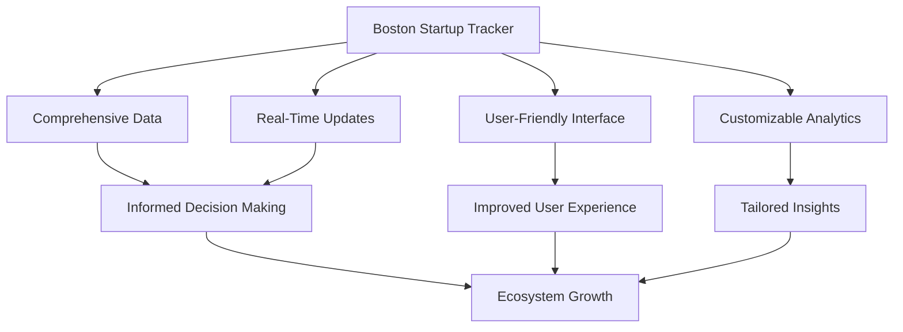
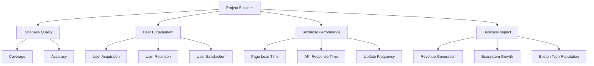
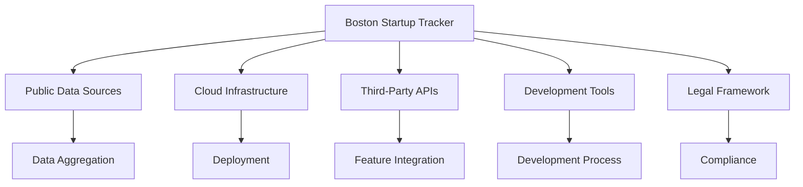
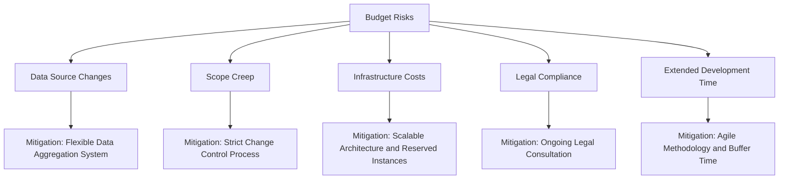
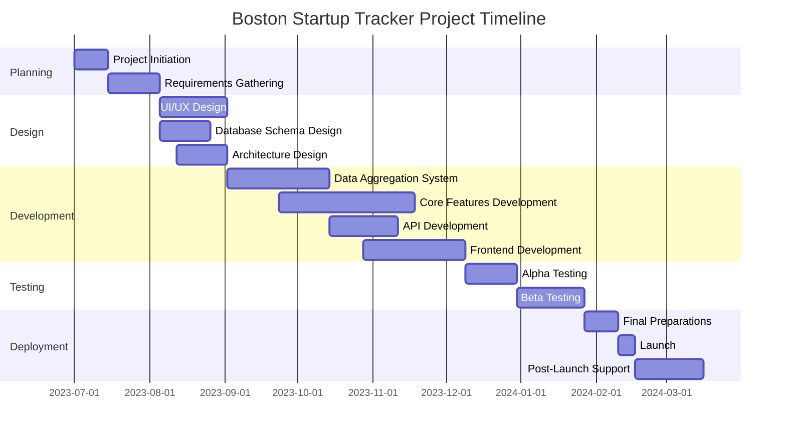
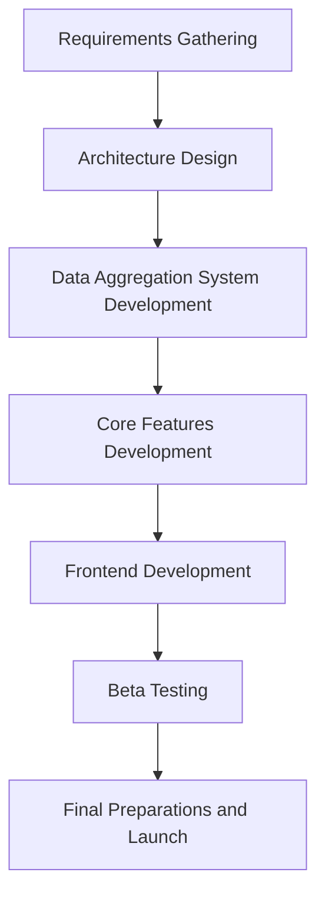

# EXECUTIVE SUMMARY

## PROJECT OVERVIEW

The Boston Startup Tracker is a comprehensive digital platform designed to provide real-time, enriched data on active venture-backed companies headquartered in Boston. This solution addresses the need for a centralized, up-to-date resource that offers insights into the vibrant Boston startup ecosystem. By aggregating and presenting crucial information from various public sources, the tracker will serve as an invaluable tool for investors, job seekers, researchers, and industry analysts.

## OBJECTIVES

1. Create a user-friendly database of Boston-based startups that have raised institutional funding within the past five years.
2. Aggregate and display key company information, including:
   - Company details (name, website, industry, sub-sector)
   - Funding information (total raised, last round, stage, investors)
   - Employee data (total count, local count, growth rate)
   - Leadership team (founders, executives)
   - Current hiring status and available roles
   - Recent news and developments
3. Implement automated data crawling and updating mechanisms to ensure information accuracy and timeliness.
4. Provide a platform for users to easily search, filter, and analyze Boston's startup landscape.

## VALUE PROPOSITION

Our agency offers a unique combination of local Boston ecosystem knowledge, technical expertise in data aggregation and analysis, and a user-centric design approach. This project will deliver:

1. **Unparalleled Data Depth**: By leveraging multiple public sources and implementing advanced data crawling techniques, we'll provide the most comprehensive and up-to-date information on Boston startups.

2. **Customized Solution**: The platform will be tailored specifically to the Boston startup ecosystem, offering relevant insights that generic startup databases cannot match.

3. **Scalable Architecture**: Our solution will be built with scalability in mind, allowing for easy expansion to include additional data points or geographic areas in the future.

4. **Intuitive User Experience**: We'll create an interface that makes it easy for users from various backgrounds to access and interpret the wealth of startup data available.

5. **Continuous Improvement**: Our team will implement feedback mechanisms and analytics to continuously refine and enhance the platform based on user needs and emerging trends in the startup ecosystem.

## PROJECT OBJECTIVES

### BUSINESS GOALS

1. Establish the Boston Startup Tracker as the premier resource for Boston startup ecosystem information
2. Drive engagement and user growth within the target audience (investors, job seekers, researchers, and industry analysts)
3. Generate revenue through premium subscriptions and data licensing
4. Foster connections and collaborations within the Boston startup community
5. Enhance Boston's reputation as a thriving hub for innovation and entrepreneurship

### TECHNICAL GOALS

1. Develop a robust and scalable data aggregation system capable of crawling and updating information from multiple public sources
2. Create a high-performance database optimized for quick retrieval and analysis of startup data
3. Implement an intuitive and responsive user interface accessible across various devices and platforms
4. Integrate advanced search and filtering capabilities to allow users to easily navigate the startup landscape
5. Develop APIs for potential future integrations and data sharing with partner platforms
6. Implement data visualization tools to present complex startup information in easily digestible formats

### SUCCESS CRITERIA

| Metric | Target | Timeframe |
|--------|--------|-----------|
| Database Coverage | 95% of eligible Boston startups | Within 6 months of launch |
| Data Accuracy | 98% accuracy rate | Ongoing |
| User Acquisition | 10,000 registered users | Within 12 months of launch |
| User Retention | 70% monthly active users | By end of year 1 |
| Premium Subscription Conversion | 5% of registered users | By end of year 1 |
| Page Load Time | < 2 seconds for main pages | At launch and ongoing |
| API Response Time | < 500ms for 95% of requests | At launch and ongoing |
| User Satisfaction | 85% positive feedback | Measured quarterly |
| Data Update Frequency | Daily updates for key metrics | At launch and ongoing |

These success criteria will be continuously monitored and evaluated to ensure the Boston Startup Tracker meets its objectives and delivers value to its users and stakeholders. Regular reviews and adjustments will be made based on these metrics to drive continuous improvement and maintain the platform's relevance and effectiveness.

# SCOPE OF WORK

## IN-SCOPE

1. Data Aggregation and Management
   - Develop web crawlers to collect data from public sources
   - Create and maintain a database of Boston-based startups
   - Implement data validation and cleaning processes
   - Set up automated daily updates for key metrics

2. User Interface Development
   - Design and develop a responsive web application
   - Create search and filtering functionality
   - Implement data visualization tools for startup metrics
   - Develop user registration and authentication system

3. API Development
   - Create RESTful API for data access
   - Implement rate limiting and security measures
   - Develop documentation for API usage

4. Core Features
   - Company profiles with all specified data points
   - Investor profiles and portfolio views
   - Job board integration for available roles
   - News aggregation for each startup

5. Analytics and Reporting
   - Develop custom reports and dashboards
   - Implement export functionality for data sets

6. User Management
   - Create user roles (free, premium, admin)
   - Develop a subscription management system

7. Security and Compliance
   - Implement data encryption and secure storage
   - Ensure GDPR and CCPA compliance

8. Testing and Quality Assurance
   - Conduct thorough testing of all features
   - Perform security audits and penetration testing

9. Deployment and Maintenance
   - Set up cloud infrastructure for hosting
   - Implement monitoring and alerting systems
   - Provide ongoing maintenance and support

## OUT-OF-SCOPE

1. Mobile Applications
   - Native iOS or Android apps are not included in this phase

2. Integration with Proprietary Databases
   - Direct integration with paid startup databases (e.g., Crunchbase Pro)

3. Financial Transactions
   - Processing payments for premium subscriptions will be handled by a third-party service

4. Content Creation
   - Writing original content or analysis about startups

5. Legal Services
   - Providing legal advice or due diligence services for investors or startups

6. Event Management
   - Organizing or managing startup events or meetups

7. Direct Messaging System
   - In-platform communication between users

8. Predictive Analytics
   - AI-driven predictions of startup success or failure

9. International Expansion
   - Tracking startups outside of the Boston area

## ASSUMPTIONS

1. Public data sources will remain accessible and maintain their current structure
2. The project team will have continuous access to necessary development tools and environments
3. Stakeholders will be available for regular meetings and timely feedback
4. Third-party APIs and services (e.g., job boards, news aggregators) will remain operational and compatible
5. The legal framework for data collection and usage will not change significantly during development
6. Cloud infrastructure providers will maintain their service levels and pricing structures
7. The Boston startup ecosystem will continue to grow and generate interest from the target audience

## DEPENDENCIES

1. Public Data Sources
   - Availability and consistency of startup information from public websites and databases

2. Cloud Infrastructure
   - Reliability and scalability of chosen cloud service provider

3. Third-Party APIs
   - Stability and documentation of APIs for job boards, news aggregation, and other integrated services

4. Development Tools and Frameworks
   - Compatibility and support for chosen development stack

5. Legal and Regulatory Environment
   - Ongoing compliance with data protection and privacy laws

6. Domain Expertise
   - Access to subject matter experts in the Boston startup ecosystem for validation and insights

7. User Feedback
   - Timely input from beta testers and early adopters for iterative improvements

8. Payment Gateway Integration
   - Setup and reliability of third-party payment processing for premium subscriptions

9. Content Delivery Network (CDN)
   - Performance and global availability for serving static assets and improving load times

10. Database Performance
    - Scalability and query optimization for handling large datasets and concurrent users

## BUDGET AND COST ESTIMATES

### COST BREAKDOWN

| Category | Description | Cost (USD) |
|----------|-------------|------------|
| Labor | Development Team (6 months) | $360,000 |
| | Project Manager (6 months) | $60,000 |
| | UI/UX Designer (3 months) | $45,000 |
| | Data Scientist (4 months) | $80,000 |
| | QA Specialist (3 months) | $36,000 |
| Infrastructure | Cloud Services (AWS, 1 year) | $24,000 |
| | Database Licensing | $5,000 |
| | CDN Services | $3,600 |
| Software | Development Tools and Licenses | $10,000 |
| | Third-party API Subscriptions | $6,000 |
| Security | SSL Certificates | $500 |
| | Security Audit and Penetration Testing | $15,000 |
| Legal | Legal Consultation for Compliance | $10,000 |
| Contingency | 10% of total budget | $65,510 |
| **Total** | | **$720,610** |

### PAYMENT SCHEDULE

| Milestone | Deliverable | Payment (% of Total) | Amount (USD) |
|-----------|-------------|----------------------|--------------|
| Project Kickoff | Signed contract and initial planning documents | 20% | $144,122 |
| Design Approval | Completed UI/UX designs and database schema | 15% | $108,091 |
| Alpha Release | Functional prototype with core features | 25% | $180,152 |
| Beta Release | Feature-complete version for user testing | 20% | $144,122 |
| Project Completion | Final product launch and documentation | 15% | $108,091 |
| Post-Launch Support | 30 days of post-launch support and bug fixes | 5% | $36,032 |

### BUDGET CONSIDERATIONS

1. **Data Source Changes**: The project relies heavily on public data sources. If these sources change their structure or access policies, it could require additional development work.
   - Mitigation: Design a flexible data aggregation system that can adapt to changes with minimal rework.

2. **Scope Creep**: As the project progresses, there may be requests for additional features or data points.
   - Mitigation: Implement a strict change control process and clearly define the MVP (Minimum Viable Product) to avoid unnecessary expansions.

3. **Infrastructure Costs**: As the user base grows, cloud infrastructure costs may increase more rapidly than anticipated.
   - Mitigation: Design a scalable architecture and utilize reserved instances to optimize costs. Regularly review and optimize resource usage.

4. **Legal Compliance**: Changes in data protection laws or regulations may require additional legal consultation and system modifications.
   - Mitigation: Allocate budget for ongoing legal consultation and design the system with privacy and compliance in mind from the start.

5. **Extended Development Time**: Unforeseen technical challenges could extend the development timeline.
   - Mitigation: Use an Agile development methodology to adapt to changes quickly. Include buffer time in the project schedule and budget.

6. **Third-Party API Costs**: If usage of third-party APIs exceeds initial estimates, costs could increase.
   - Mitigation: Implement usage monitoring and set up alerts for approaching limits. Have contingency plans for alternative data sources or features.

7. **Currency Fluctuations**: For any international services or team members, currency exchange rate changes could impact the budget.
   - Mitigation: Consider using forward contracts or setting aside a small buffer for potential exchange rate fluctuations.

8. **Talent Retention**: Losing key team members could result in additional costs for hiring and onboarding replacements.
   - Mitigation: Include competitive compensation and engagement strategies in the budget to retain top talent throughout the project.

By carefully monitoring these potential risk areas and implementing the proposed mitigation strategies, we aim to keep the project within budget while delivering a high-quality Boston Startup Tracker. Regular budget reviews and stakeholder communications will be conducted to ensure transparency and allow for timely adjustments if needed.

## TIMELINE AND MILESTONES

### PROJECT TIMELINE

### KEY MILESTONES

| Milestone | Description | Target Date |
|-----------|-------------|-------------|
| M1: Project Kickoff | Complete project initiation and requirements gathering | 2023-08-05 |
| M2: Design Approval | Finalize UI/UX designs, database schema, and system architecture | 2023-09-02 |
| M3: Data System Completion | Finish development of data aggregation and management system | 2023-10-14 |
| M4: Core Features Completion | Complete development of all core features | 2023-11-18 |
| M5: Alpha Release | Deploy functional prototype with core features for internal testing | 2023-12-09 |
| M6: Beta Release | Launch feature-complete version for user testing | 2023-12-30 |
| M7: Final Launch | Official release of the Boston Startup Tracker | 2024-02-10 |
| M8: Post-Launch Review | Conduct review of system performance and user feedback | 2024-03-16 |

### CRITICAL PATH

The following tasks represent the critical path for the Boston Startup Tracker project:

1. Requirements Gathering
2. Architecture Design
3. Data Aggregation System Development
4. Core Features Development
5. Frontend Development
6. Beta Testing
7. Final Preparations and Launch

These critical path items must be completed on schedule to ensure the project remains on track. Any delays in these tasks will directly impact the project's completion date. To mitigate risks:

1. Allocate additional resources to critical path tasks when necessary
2. Conduct regular progress reviews for these items
3. Implement contingency plans for potential bottlenecks
4. Prioritize issue resolution for critical path tasks
5. Maintain clear communication channels for quick decision-making

By focusing on these critical path elements and closely monitoring their progress, we can ensure the timely delivery of the Boston Startup Tracker while maintaining the flexibility to address challenges as they arise.

# DELIVERABLES

## LIST OF DELIVERABLES

1. Boston Startup Tracker Web Application
   - Responsive web interface
   - User authentication and authorization system
   - Search and filtering functionality
   - Data visualization components
   - Company profile pages
   - Investor profile pages
   - Job board integration
   - News aggregation feature

2. Data Aggregation System
   - Web crawlers for public data sources
   - Data cleaning and validation scripts
   - Automated update mechanisms

3. Database
   - Optimized schema for startup data
   - Data storage solution (e.g., PostgreSQL)

4. API
   - RESTful API for data access
   - API documentation
   - SDK for common programming languages (JavaScript, Python)

5. Infrastructure
   - Cloud deployment configuration (e.g., AWS, Azure)
   - Monitoring and alerting setup
   - Backup and disaster recovery system

6. Documentation
   - System architecture documentation
   - User manual
   - Administrator guide
   - API documentation

7. Training Materials
   - User onboarding guide
   - Video tutorials for key features
   - FAQ document

8. Testing and Quality Assurance
   - Test plans and test cases
   - Bug reports and resolution documentation
   - Performance test results

9. Security
   - Security audit report
   - Penetration testing results
   - Data encryption implementation

10. Analytics Dashboard
    - User engagement metrics
    - System performance analytics
    - Data update frequency reports

## DELIVERY SCHEDULE

| Deliverable | Expected Completion Date |
|-------------|--------------------------|
| System Architecture Documentation | 2023-09-09 |
| Database Schema and Initial Setup | 2023-09-16 |
| Data Aggregation System (Alpha) | 2023-10-14 |
| API (Alpha) | 2023-11-11 |
| Web Application Frontend (Alpha) | 2023-12-09 |
| User Authentication System | 2023-12-16 |
| Data Visualization Components | 2023-12-23 |
| Job Board Integration | 2023-12-30 |
| News Aggregation Feature | 2024-01-06 |
| Search and Filtering Functionality | 2024-01-13 |
| Analytics Dashboard | 2024-01-20 |
| API Documentation | 2024-01-27 |
| User Manual and Administrator Guide | 2024-02-03 |
| Training Materials | 2024-02-03 |
| Security Audit Report | 2024-02-10 |
| Final Deployed Web Application | 2024-02-10 |
| Post-Launch Support Documentation | 2024-03-16 |

## ACCEPTANCE CRITERIA

```mermaid
graph TD
    A[Acceptance Criteria] --> B[Functionality]
    A --> C[Performance]
    A --> D[Security]
    A --> E[Documentation]
    A --> F[User Experience]

    B --> B1[All features work as specified]
    B --> B2[Data accuracy >= 98%]
    B --> B3[API endpoints return correct data]

    C --> C1[Page load time < 2 seconds]
    C --> C2[API response time < 500ms]
    C --> C3[Supports 1000+ concurrent users]

    D --> D1[Passes security audit]
    D --> D2[Complies with GDPR and CCPA]
    D --> D3[Data encryption at rest and in transit]

    E --> E1[Complete and accurate documentation]
    E --> E2[API documentation is comprehensive]
    E --> E3[Training materials cover all features]

    F --> F1[Intuitive navigation]
    F --> F2[Responsive design works on all devices]
    F --> F3[Accessibility standards met]
```

1. Functionality
   - All features listed in the deliverables function as specified
   - Data aggregation system updates information daily with 98% accuracy
   - Search and filtering return relevant results within 1 second
   - API endpoints return correct data in specified format

2. Performance
   - Web application loads within 2 seconds on standard broadband connection
   - API responds to requests within 500ms for 95% of calls
   - System supports at least 1000 concurrent users without performance degradation

3. Security
   - Passes third-party security audit with no critical vulnerabilities
   - Complies with GDPR and CCPA requirements
   - All sensitive data is encrypted at rest and in transit
   - User authentication system prevents unauthorized access

4. Documentation
   - System architecture documentation is complete and accurately reflects the final implementation
   - User manual covers all features and is easily understandable by target users
   - API documentation is comprehensive and includes examples for all endpoints

5. User Experience
   - Web application is intuitive to navigate, as validated by user testing
   - Responsive design functions correctly on desktop, tablet, and mobile devices
   - Data visualizations are clear and provide valuable insights
   - Meets WCAG 2.1 Level AA accessibility standards

6. Data Quality
   - Company profiles contain all specified data points for at least 95% of entries
   - News aggregation feature provides relevant and recent articles for each company
   - Job board integration accurately reflects current openings

7. Integration
   - Third-party integrations (e.g., job boards, news sources) function reliably
   - API can be successfully integrated with sample client applications in JavaScript and Python

8. Scalability
   - Database performance maintains response times with at least 100,000 company records
   - System architecture allows for easy scaling of resources to meet increased demand

9. Maintenance
   - Monitoring systems provide real-time alerts for critical issues
   - Backup and disaster recovery processes successfully tested

10. Training
    - Training materials cover all key features of the system
    - 90% of test users can perform basic tasks after going through the onboarding guide

Each deliverable will be reviewed against these criteria, and formal acceptance will require sign-off from designated project stakeholders. Any deliverable not meeting these criteria will be revised until acceptance is achieved.