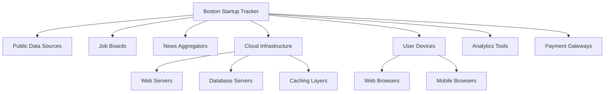
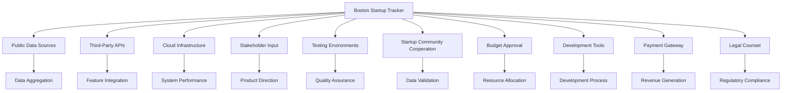
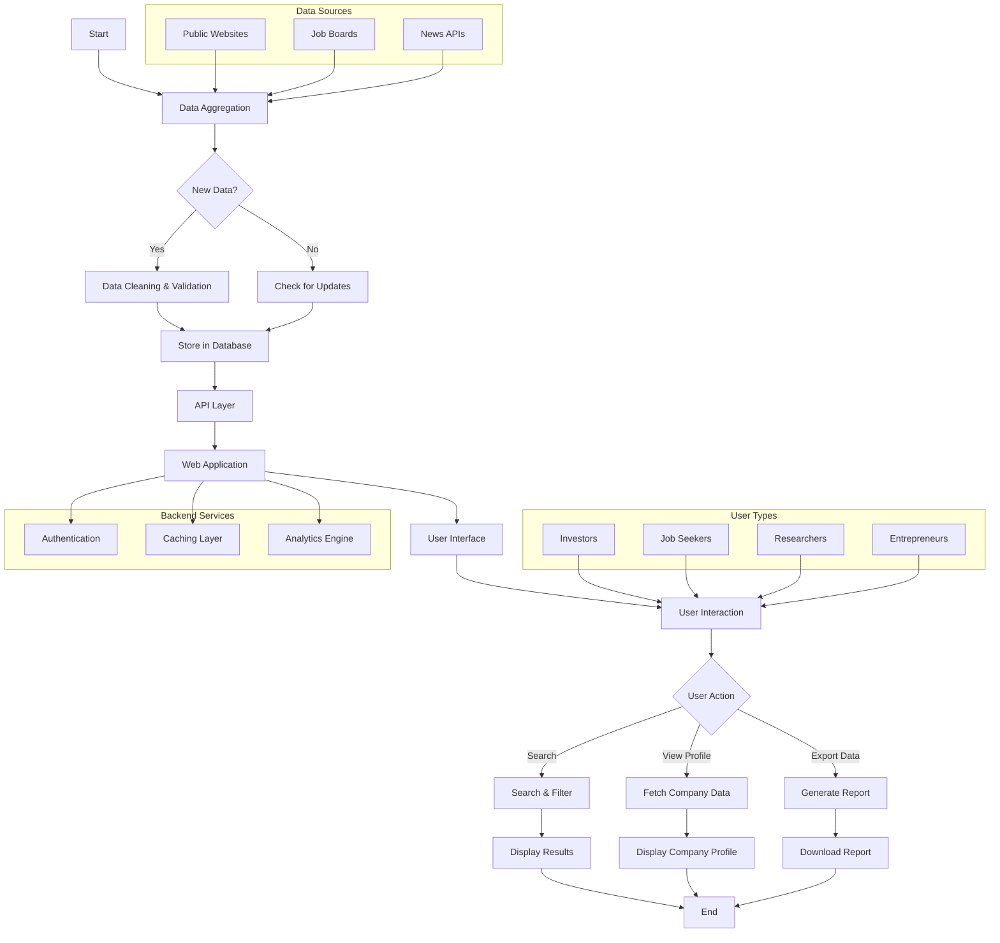
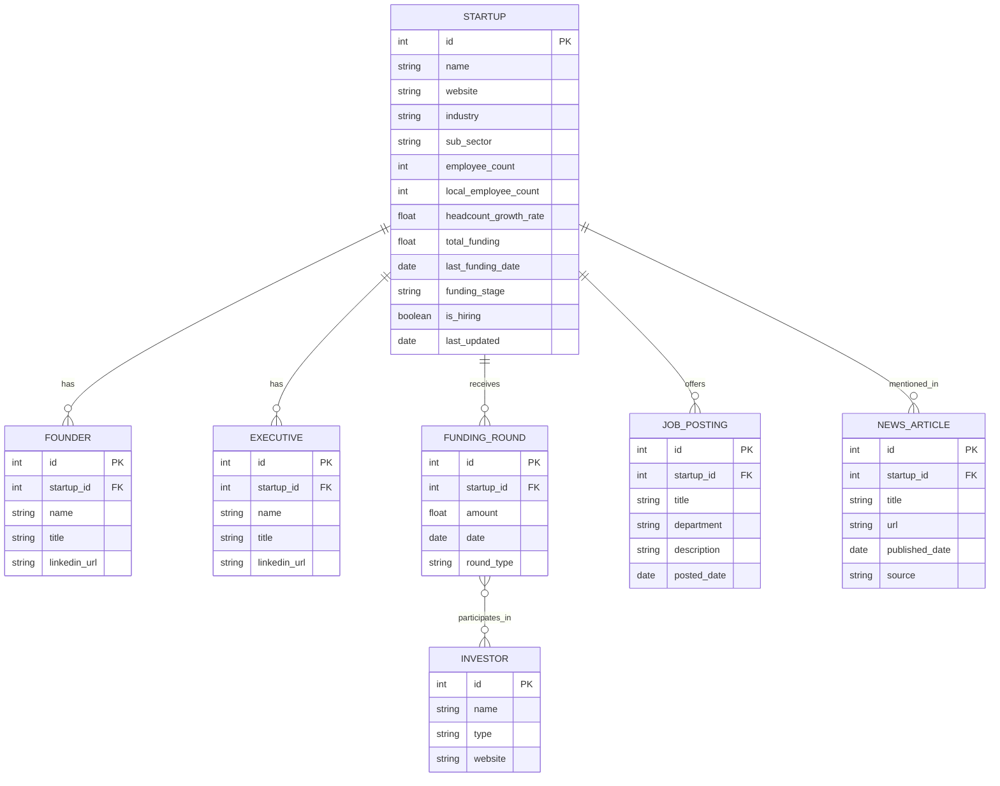
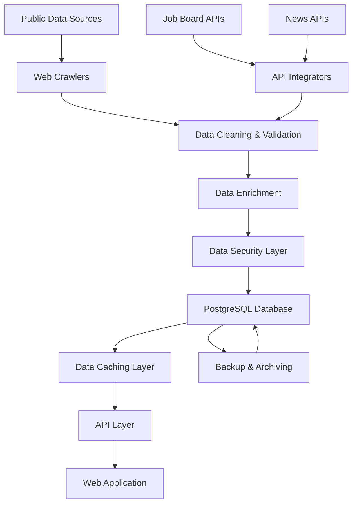
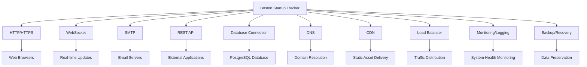

# INTRODUCTION

## PURPOSE

The purpose of this Software Requirements Specification (SRS) document is to provide a comprehensive and detailed description of the Boston Startup Tracker project. This document serves as the primary reference for the development team, project stakeholders, and any third-party contributors involved in the creation and implementation of the Boston Startup Tracker.

This SRS aims to:

1. Clearly define the functional and non-functional requirements of the Boston Startup Tracker.
2. Establish a shared understanding of the project scope, objectives, and deliverables among all stakeholders.
3. Serve as a basis for project planning, cost estimation, and resource allocation.
4. Provide a benchmark for validation and verification throughout the development process.
5. Act as a contractual agreement between the development team and the client.

The intended audience for this document includes:

- Project managers and team leads
- Software developers and engineers
- Quality assurance and testing teams
- UI/UX designers
- Database administrators
- System architects
- Client representatives and key stakeholders
- Potential investors or partners interested in the project's technical details

## SCOPE

The Boston Startup Tracker is a comprehensive web-based platform designed to aggregate, analyze, and present data on venture-backed companies headquartered in Boston. The system aims to provide a centralized, up-to-date resource for investors, job seekers, researchers, and industry analysts to gain insights into the Boston startup ecosystem.

### Goals

1. Create a user-friendly, responsive web application accessible across various devices.
2. Develop a robust data aggregation system to collect and update information from public sources.
3. Implement advanced search and filtering capabilities to navigate the startup landscape easily.
4. Provide detailed company profiles with enriched data points.
5. Offer data visualization tools for better understanding of startup metrics and trends.
6. Ensure data accuracy and timeliness through automated updates and validation processes.

### Benefits

1. Centralized Information: Consolidates data from multiple sources into a single, easy-to-use platform.
2. Time-Saving: Reduces the need for manual research by providing up-to-date, comprehensive startup information.
3. Ecosystem Insights: Offers a bird's-eye view of the Boston startup landscape, facilitating informed decision-making.
4. Job Market Visibility: Helps job seekers identify opportunities within the Boston startup community.
5. Investment Facilitation: Assists investors in discovering and evaluating potential investment opportunities.
6. Economic Impact Analysis: Enables researchers and policymakers to assess the growth and impact of Boston's startup ecosystem.

### Core Functionalities

1. Data Aggregation and Management
   - Web crawlers for collecting data from public sources
   - Database for storing and managing startup information
   - Automated daily updates for key metrics

2. User Interface
   - Responsive web application built with modern frontend frameworks
   - Intuitive search and filtering functionality
   - Interactive data visualizations

3. Company Profiles
   - Detailed information on each startup, including:
     - Company name, website, and industry
     - Funding information (total raised, last round, stage, investors)
     - Employee data (total count, local count, growth rate)
     - Leadership team (founders, executives)
     - Available job openings
     - Recent news and developments

4. API Access
   - RESTful API for programmatic data access
   - Documentation and SDKs for common programming languages

5. User Management
   - User registration and authentication system
   - Role-based access control (free users, premium subscribers, administrators)

6. Analytics and Reporting
   - Custom reports and dashboards
   - Data export functionality

7. Security and Compliance
   - Data encryption and secure storage
   - Compliance with GDPR and CCPA regulations

The Boston Startup Tracker will be developed using cloud infrastructure for scalability and reliability. The system architecture will be designed to handle large datasets and concurrent users while maintaining performance and data integrity. By focusing on these core functionalities and adhering to the defined goals, the Boston Startup Tracker aims to become the premier resource for Boston startup ecosystem information, driving engagement and fostering connections within the community.

# PRODUCT DESCRIPTION

## PRODUCT PERSPECTIVE

The Boston Startup Tracker is a standalone web-based application designed to serve as a comprehensive resource for information on venture-backed companies in the Boston area. While it operates independently, it interacts with various external systems and data sources to provide a holistic view of the startup ecosystem:

1. Public Data Sources: The system integrates with multiple public websites and databases to aggregate startup information.

2. Job Boards: Integration with job posting platforms to display current openings at tracked startups.

3. News Aggregators: Connections to news APIs or RSS feeds to provide up-to-date news about each company.

4. Cloud Infrastructure: Hosted on a scalable cloud platform (e.g., AWS) to ensure reliability and performance.

5. User Devices: Accessible through web browsers on desktops, tablets, and mobile devices.

6. Third-party Analytics Tools: Integration with analytics platforms for tracking user behavior and system performance.

7. Payment Gateways: For processing premium subscription payments (handled by third-party services).



## PRODUCT FUNCTIONS

The Boston Startup Tracker will perform the following main functions:

1. Data Aggregation and Management
   - Crawl public data sources to collect startup information
   - Clean, validate, and store collected data
   - Perform daily updates to maintain data accuracy

2. User Interface and Search
   - Provide a responsive web interface for accessing startup data
   - Offer advanced search and filtering capabilities
   - Display interactive data visualizations

3. Company Profiles
   - Present detailed profiles for each startup, including:
     - Basic information (name, website, industry)
     - Funding details (total raised, last round, investors)
     - Employee data (headcount, growth rate)
     - Leadership team information
   - Show current job openings
   - Display recent news articles

4. User Management
   - Handle user registration and authentication
   - Manage user roles and access levels (free, premium, admin)

5. API Access
   - Provide a RESTful API for programmatic data access
   - Implement rate limiting and access controls

6. Analytics and Reporting
   - Generate custom reports and dashboards
   - Allow data export in various formats

7. Security and Compliance
   - Encrypt sensitive data
   - Ensure compliance with data protection regulations

## USER CHARACTERISTICS

The Boston Startup Tracker is designed to cater to various user groups within the startup ecosystem:

1. Investors
   - Expertise: High level of financial and industry knowledge
   - Needs: Detailed company information, funding history, growth metrics
   - Persona: Sarah, 35, Venture Capitalist at a Boston-based firm

2. Job Seekers
   - Expertise: Varied technical or business backgrounds
   - Needs: Company overviews, current job openings, growth potential
   - Persona: Alex, 28, Software Engineer looking for opportunities in startups

3. Entrepreneurs
   - Expertise: Strong business acumen, varied technical knowledge
   - Needs: Competitor analysis, industry trends, potential investors
   - Persona: Maria, 42, Serial entrepreneur planning her next venture

4. Researchers/Analysts
   - Expertise: Data analysis, industry-specific knowledge
   - Needs: Comprehensive datasets, historical data, trend analysis
   - Persona: Dr. James, 50, Economics professor studying startup ecosystems

5. Industry Professionals
   - Expertise: Specific industry knowledge, business networking
   - Needs: Company overviews, recent news, networking opportunities
   - Persona: Lisa, 39, Sales Director targeting SaaS startups

6. Students
   - Expertise: Limited professional experience, academic background
   - Needs: Basic startup information, internship opportunities, learning resources
   - Persona: Tom, 22, Business major interested in the startup scene

## CONSTRAINTS

1. Technical Constraints
   - Must be compatible with major web browsers (Chrome, Firefox, Safari, Edge)
   - API rate limits imposed by third-party data sources
   - Database performance limitations for large datasets

2. Regulatory Constraints
   - Compliance with GDPR and CCPA data protection regulations
   - Adherence to copyright laws when aggregating public data

3. Business Constraints
   - Budget limitation of $720,610 as outlined in the budget section
   - Project timeline of 6 months for initial launch

4. User Interface Constraints
   - Must be accessible on devices with minimum screen width of 320px
   - Should meet WCAG 2.1 Level AA accessibility standards

5. Data Constraints
   - Limited to startups headquartered in Boston area
   - Focus on companies that have raised institutional money in the past 5 years

6. Security Constraints
   - All user passwords must be hashed and salted
   - API access must be authenticated and rate-limited

7. Performance Constraints
   - Page load times should not exceed 2 seconds
   - System must support at least 1000 concurrent users

8. Legal Constraints
   - Terms of service and privacy policy must be clearly displayed
   - Disclaimer needed for financial information accuracy

## ASSUMPTIONS AND DEPENDENCIES

### Assumptions

1. Public data sources will maintain their current structure and accessibility throughout the project.
2. The Boston startup ecosystem will continue to grow and generate interest from the target audience.
3. Users will have access to modern web browsers and stable internet connections.
4. The legal framework for data collection and usage will not change significantly during development.
5. Cloud infrastructure costs will remain stable and within projected estimates.
6. The project team will have the necessary skills and availability to complete the project on schedule.
7. Stakeholders will be available for timely feedback and decision-making throughout the project.

### Dependencies

1. Availability and reliability of public data sources for startup information.
2. Continued access to and functionality of third-party APIs (job boards, news aggregators).
3. Stability and performance of the chosen cloud infrastructure provider (e.g., AWS).
4. Timely delivery of design assets and content from stakeholders or contracted parties.
5. Availability of testing environments that accurately reflect production conditions.
6. Cooperation from local startup community for beta testing and initial data validation.
7. Timely approval of necessary budgets and resources from project sponsors.
8. Availability of required development tools and licenses throughout the project lifecycle.
9. Successful integration with chosen payment gateway for premium subscriptions.
10. Ongoing legal counsel to ensure compliance with evolving data protection regulations.



These assumptions and dependencies will be regularly reviewed and updated throughout the project lifecycle to ensure they remain valid and to mitigate any risks associated with changes in these factors.

# PROCESS FLOWCHART

The following process flowchart illustrates the main workflows and data flow within the Boston Startup Tracker system:



This flowchart represents the core processes of the Boston Startup Tracker, including:

1. Data Aggregation: The system collects data from various public sources, job boards, and news APIs.

2. Data Processing: New data is cleaned, validated, and stored in the database. Existing data is checked for updates.

3. API Layer: Provides a standardized interface for data access and manipulation.

4. Web Application: The main interface for users to interact with the system.

5. User Interactions: Various actions users can perform, such as searching, viewing company profiles, and exporting data.

6. Backend Services: Supporting services like authentication, caching, and analytics.

The flowchart also shows the different user types (Investors, Job Seekers, Researchers, Entrepreneurs) interacting with the system, emphasizing the diverse user base of the Boston Startup Tracker.

This process flow is designed to ensure efficient data collection, processing, and presentation, while providing a seamless user experience across different user types and actions. The system's architecture allows for scalability and easy integration of additional data sources or features in the future.

Here's a breakdown of the Boston Startup Tracker product into features, maintaining consistency with previous technology and framework choices mentioned in the document:

1. Data Aggregation System

ID: F001
DESCRIPTION: Automated system to collect, clean, and update startup data from various public sources.
PRIORITY: High

| Requirement ID | Requirement Description |
|----------------|--------------------------|
| F001-1 | Develop web crawlers to collect data from specified public sources |
| F001-2 | Implement data cleaning and validation processes |
| F001-3 | Create a scheduler for daily data updates |
| F001-4 | Develop error handling and logging mechanisms |
| F001-5 | Implement data versioning for historical tracking |

2. User Interface

ID: F002
DESCRIPTION: Responsive web application for users to interact with the Boston Startup Tracker.
PRIORITY: High

| Requirement ID | Requirement Description |
|----------------|--------------------------|
| F002-1 | Design and implement a responsive web interface using modern frontend frameworks |
| F002-2 | Create an intuitive navigation system |
| F002-3 | Implement user authentication and authorization |
| F002-4 | Develop a dashboard for quick overview of key metrics |
| F002-5 | Ensure WCAG 2.1 Level AA accessibility compliance |

3. Search and Filtering

ID: F003
DESCRIPTION: Advanced search and filtering capabilities for startup data.
PRIORITY: High

| Requirement ID | Requirement Description |
|----------------|--------------------------|
| F003-1 | Implement full-text search across all startup data |
| F003-2 | Develop filters for industry, funding stage, employee count, and other key metrics |
| F003-3 | Create saved search functionality for registered users |
| F003-4 | Implement auto-suggest feature for search queries |
| F003-5 | Develop sorting options for search results |

4. Company Profiles

ID: F004
DESCRIPTION: Detailed profile pages for each startup with comprehensive information.
PRIORITY: High

| Requirement ID | Requirement Description |
|----------------|--------------------------|
| F004-1 | Create template for company profile pages |
| F004-2 | Display all relevant startup data including funding, employees, and executives |
| F004-3 | Integrate job openings from job board APIs |
| F004-4 | Implement recent news section using news aggregation APIs |
| F004-5 | Develop data visualization components for key metrics |

5. API Access

ID: F005
DESCRIPTION: RESTful API for programmatic access to startup data.
PRIORITY: Medium

| Requirement ID | Requirement Description |
|----------------|--------------------------|
| F005-1 | Design and implement RESTful API endpoints |
| F005-2 | Develop authentication mechanism for API access |
| F005-3 | Implement rate limiting to prevent abuse |
| F005-4 | Create comprehensive API documentation |
| F005-5 | Develop SDKs for common programming languages (JavaScript, Python) |

6. User Management

ID: F006
DESCRIPTION: System to manage user accounts, roles, and subscriptions.
PRIORITY: Medium

| Requirement ID | Requirement Description |
|----------------|--------------------------|
| F006-1 | Implement user registration and authentication system |
| F006-2 | Develop role-based access control (free, premium, admin) |
| F006-3 | Create user profile management interface |
| F006-4 | Implement subscription management system |
| F006-5 | Develop password reset and account recovery mechanisms |

7. Analytics and Reporting

ID: F007
DESCRIPTION: Tools for generating custom reports and analyzing startup data.
PRIORITY: Medium

| Requirement ID | Requirement Description |
|----------------|--------------------------|
| F007-1 | Develop custom report generation tool |
| F007-2 | Create data export functionality in various formats (CSV, JSON) |
| F007-3 | Implement data visualization tools for trend analysis |
| F007-4 | Develop comparative analysis features for startups |
| F007-5 | Create scheduled report delivery system for premium users |

8. Admin Dashboard

ID: F008
DESCRIPTION: Administrative interface for managing the platform and monitoring system health.
PRIORITY: Low

| Requirement ID | Requirement Description |
|----------------|--------------------------|
| F008-1 | Develop interface for managing user accounts and roles |
| F008-2 | Create tools for manually updating or correcting startup data |
| F008-3 | Implement system health monitoring and alerting |
| F008-4 | Develop analytics dashboard for platform usage statistics |
| F008-5 | Create interface for managing API keys and rate limits |

9. Data Visualization

ID: F009
DESCRIPTION: Interactive charts and graphs to visualize startup ecosystem trends.
PRIORITY: Medium

| Requirement ID | Requirement Description |
|----------------|--------------------------|
| F009-1 | Develop interactive charts for funding trends |
| F009-2 | Create industry distribution visualizations |
| F009-3 | Implement growth rate comparisons across startups |
| F009-4 | Develop investor portfolio visualizations |
| F009-5 | Create geographic distribution maps of Boston startups |

10. Notification System

ID: F010
DESCRIPTION: System to alert users about updates to startups they're following or saved searches.
PRIORITY: Low

| Requirement ID | Requirement Description |
|----------------|--------------------------|
| F010-1 | Implement in-app notification system |
| F010-2 | Develop email notification service |
| F010-3 | Create notification preferences management for users |
| F010-4 | Implement real-time updates for followed startups |
| F010-5 | Develop digest emails for weekly or monthly updates |

These features are designed to work together within the cloud-based infrastructure mentioned earlier, utilizing the specified tech stack and adhering to the performance, security, and scalability requirements outlined in the previous sections of the SRS document.

# NON-FUNCTIONAL REQUIREMENTS

## PERFORMANCE

1. Response Time
   - Web pages should load within 2 seconds under normal conditions
   - API responses should be delivered within 500ms for 95% of requests
   - Search queries should return results in less than 1 second

2. Throughput
   - The system should support at least 1000 concurrent users without performance degradation
   - Data aggregation system should process updates for at least 10,000 companies daily

3. Resource Usage
   - Database queries should utilize no more than 80% of available CPU resources during peak loads
   - Memory usage should not exceed 85% of available RAM under normal operating conditions

## SAFETY

1. Data Backup
   - Automated daily backups of all system data
   - Backup data should be stored in a geographically separate location from the primary data center

2. Disaster Recovery
   - A complete system restore should be possible within 4 hours of a catastrophic failure
   - Regular disaster recovery drills should be conducted at least once per quarter

3. Error Handling
   - The system should gracefully handle and log all errors without exposing sensitive information to users
   - Critical errors should trigger immediate notifications to the development and operations teams

4. Data Integrity
   - Implement data validation checks to ensure the accuracy and consistency of stored information
   - Use database transactions to maintain data integrity during complex operations

## SECURITY

1. Authentication
   - Implement multi-factor authentication for user accounts
   - Enforce strong password policies (minimum 12 characters, including uppercase, lowercase, numbers, and special characters)

2. Authorization
   - Implement role-based access control (RBAC) for different user types (free, premium, admin)
   - API access should be restricted by API keys and OAuth 2.0 tokens

3. Data Encryption
   - All data at rest should be encrypted using AES-256 encryption
   - All data in transit should be protected using TLS 1.3 or higher

4. Privacy
   - Implement data anonymization techniques for analytics and reporting features
   - Provide users with the ability to export and delete their personal data in compliance with GDPR and CCPA

5. Security Auditing
   - Conduct regular security audits and penetration testing at least twice a year
   - Implement real-time monitoring and alerting for suspicious activities

## QUALITY

1. Availability
   - The system should maintain 99.9% uptime, excluding scheduled maintenance
   - Scheduled maintenance should not exceed 4 hours per month and should be performed during off-peak hours

2. Maintainability
   - The codebase should adhere to industry-standard coding practices and style guides
   - Implement comprehensive logging and monitoring to facilitate quick issue resolution
   - Maintain up-to-date documentation for all system components and APIs

3. Usability
   - The user interface should be intuitive and require no more than 30 minutes of training for basic operations
   - The system should be compatible with the latest versions of major web browsers (Chrome, Firefox, Safari, Edge)
   - Implement responsive design to ensure usability across desktop, tablet, and mobile devices

4. Scalability
   - The system architecture should support horizontal scaling to handle increased load
   - Database design should efficiently handle growth to at least 1 million company records without significant performance degradation

5. Reliability
   - The system should have a Mean Time Between Failures (MTBF) of at least 720 hours
   - Implement automatic failover mechanisms for critical system components

## COMPLIANCE

1. Legal
   - Comply with all applicable data protection laws, including GDPR and CCPA
   - Implement necessary measures to adhere to intellectual property rights and fair use policies when aggregating public data

2. Regulatory
   - Ensure compliance with SEC regulations regarding the display of financial information
   - Adhere to FTC guidelines on transparency in data collection and usage

3. Standards
   - Follow WCAG 2.1 Level AA standards for web accessibility
   - Implement ISO/IEC 27001 information security management standards
   - Adhere to OWASP Top 10 security practices for web applications

4. Data Retention
   - Implement data retention policies in line with legal requirements and best practices
   - Provide mechanisms for data deletion upon user request or after the specified retention period

5. Reporting
   - Generate compliance reports for internal audits and regulatory inspections
   - Maintain an up-to-date privacy policy and terms of service accessible to all users

```mermaid
graph TD
    A[Non-Functional Requirements] --> B[Performance]
    A --> C[Safety]
    A --> D[Security]
    A --> E[Quality]
    A --> F[Compliance]

    B --> B1[Response Time]
    B --> B2[Throughput]
    B --> B3[Resource Usage]

    C --> C1[Data Backup]
    C --> C2[Disaster Recovery]
    C --> C3[Error Handling]
    C --> C4[Data Integrity]

    D --> D1[Authentication]
    D --> D2[Authorization]
    D --> D3[Data Encryption]
    D --> D4[Privacy]
    D --> D5[Security Auditing]

    E --> E1[Availability]
    E --> E2[Maintainability]
    E --> E3[Usability]
    E --> E4[Scalability]
    E --> E5[Reliability]

    F --> F1[Legal]
    F --> F2[Regulatory]
    F --> F3[Standards]
    F --> F4[Data Retention]
    F --> F5[Reporting]
```



These non-functional requirements are designed to ensure that the Boston Startup Tracker is not only feature-complete but also performs efficiently, securely, and reliably while maintaining compliance with relevant laws and standards. They complement the functional requirements and are crucial for the overall success and user satisfaction of the platform.

# DATA REQUIREMENTS

## DATA MODELS

The Boston Startup Tracker will utilize a relational database model to efficiently store and manage the diverse data points collected for each startup. The following entity-relationship diagram illustrates the core data structure:



This data model allows for efficient querying and relationship management between different entities within the Boston startup ecosystem.

## DATA STORAGE

The Boston Startup Tracker will utilize a robust and scalable data storage solution to ensure data integrity, availability, and performance.

1. Primary Database:
   - PostgreSQL will be used as the primary relational database management system.
   - Hosted on Amazon RDS for managed scaling, backups, and high availability.

2. Data Retention:
   - All startup data will be retained indefinitely to allow for historical analysis.
   - Job postings and news articles will be archived after 1 year to manage database size.

3. Redundancy:
   - Multi-AZ deployment on Amazon RDS to ensure high availability.
   - Read replicas will be implemented to distribute database load and improve read performance.

4. Backup:
   - Automated daily full backups with transaction logs for point-in-time recovery.
   - Backups will be stored in Amazon S3 with versioning enabled.
   - Retention period for backups: 30 days for daily backups, 1 year for monthly backups.

5. Recovery:
   - Automated failover to standby instance in case of primary database failure.
   - Disaster recovery plan with RTO (Recovery Time Objective) of 1 hour and RPO (Recovery Point Objective) of 5 minutes.

6. Scaling:
   - Vertical scaling (increasing instance size) for immediate performance improvements.
   - Horizontal scaling through read replicas for improved read performance.
   - Implementation of connection pooling to manage high numbers of concurrent connections.

7. Caching:
   - Amazon ElastiCache (Redis) will be used to cache frequently accessed data and reduce database load.

8. Data Archiving:
   - Implement a data archiving strategy to move historical data to Amazon S3 for long-term storage and cost optimization.

## DATA PROCESSING

The Boston Startup Tracker will implement a robust data processing pipeline to ensure data accuracy, security, and timely updates.

1. Data Collection:
   - Web crawlers built with Python and Scrapy framework will collect data from public sources.
   - API integrations with job boards and news aggregators for real-time updates.

2. Data Cleaning and Validation:
   - Python scripts utilizing pandas and numpy libraries for data cleaning and normalization.
   - Implementation of data validation rules to ensure data integrity and consistency.

3. Data Enrichment:
   - Integration with third-party APIs for additional data points (e.g., company size verification, funding round details).
   - Natural Language Processing (NLP) techniques to extract relevant information from news articles and job descriptions.

4. Data Security:
   - Encryption of data in transit using TLS 1.3.
   - Encryption of data at rest using AWS KMS (Key Management Service).
   - Implementation of role-based access control (RBAC) for data access.
   - Regular security audits and penetration testing of the data processing pipeline.

5. Data Flow:



6. Real-time Processing:
   - Implementation of Apache Kafka for real-time data streaming and processing of updates.
   - Use of AWS Lambda functions for serverless processing of incoming data updates.

7. Batch Processing:
   - Daily batch jobs for comprehensive data updates and reconciliation.
   - Weekly data quality checks and cleanup processes.

8. Monitoring and Logging:
   - Implementation of ELK stack (Elasticsearch, Logstash, Kibana) for log management and analysis.
   - Real-time monitoring of data processing pipeline using AWS CloudWatch.
   - Alerts and notifications for any data processing errors or anomalies.

9. Data Governance:
   - Implementation of data lineage tracking to maintain transparency in data sources and transformations.
   - Regular data quality assessments and reporting.
   - Compliance checks to ensure adherence to data protection regulations (GDPR, CCPA).

10. Scalability:
    - Design of data processing pipeline to handle increasing data volumes.
    - Use of AWS Auto Scaling groups for data processing servers to manage varying loads.

By implementing these data requirements, the Boston Startup Tracker will ensure efficient, secure, and scalable management of startup data, providing users with accurate and up-to-date information on the Boston startup ecosystem.

# EXTERNAL INTERFACES

## USER INTERFACES

The Boston Startup Tracker will provide a responsive web-based user interface accessible through modern web browsers. The interface will be designed to be intuitive, user-friendly, and consistent across different devices and screen sizes.

Key UI components include:

1. Dashboard
   - Overview of key metrics and recent updates
   - Quick access to frequently used features

2. Search and Filter Interface
   - Advanced search functionality with multiple criteria
   - Dynamic filtering options for refining search results

3. Company Profile Pages
   - Comprehensive display of company information
   - Interactive data visualizations

4. Investor Profile Pages
   - Overview of investor portfolios and activity

5. Job Board
   - Integrated display of current job openings

6. News Feed
   - Aggregated news articles related to startups

7. User Account Management
   - Registration, login, and profile management interfaces

8. Admin Panel
   - Interface for system administration and data management

Placeholder for UI mockups:

```
[Dashboard Mockup]
[Search Interface Mockup]
[Company Profile Mockup]
[Investor Profile Mockup]
[Job Board Mockup]
[News Feed Mockup]
[User Account Mockup]
[Admin Panel Mockup]
```

The UI will be developed using modern frontend frameworks such as React.js, ensuring a responsive and interactive user experience. All interfaces will adhere to WCAG 2.1 Level AA accessibility standards.

## SOFTWARE INTERFACES

The Boston Startup Tracker will interact with various external software systems and components:

1. Database Management System
   - Interface: PostgreSQL database driver
   - Purpose: Store and retrieve startup and user data
   - Data Format: SQL queries and responses

2. Cloud Infrastructure
   - Interface: AWS SDK
   - Purpose: Manage cloud resources and services
   - Data Format: JSON/XML configurations and API calls

3. Job Board APIs
   - Interface: RESTful API
   - Purpose: Fetch current job openings from external job boards
   - Data Format: JSON

4. News Aggregation APIs
   - Interface: RESTful API
   - Purpose: Retrieve recent news articles related to startups
   - Data Format: JSON

5. Payment Gateway
   - Interface: Payment provider's API (e.g., Stripe API)
   - Purpose: Process payments for premium subscriptions
   - Data Format: JSON

6. Email Service
   - Interface: SMTP or Email Service Provider API (e.g., SendGrid)
   - Purpose: Send notifications and alerts to users
   - Data Format: MIME

7. Analytics Platform
   - Interface: Analytics provider's API (e.g., Google Analytics)
   - Purpose: Track user behavior and system performance
   - Data Format: JSON

8. Content Delivery Network (CDN)
   - Interface: CDN provider's API
   - Purpose: Serve static assets and improve load times
   - Data Format: HTTP/HTTPS requests and responses

9. Monitoring and Logging Services
   - Interface: Logging service API (e.g., ELK stack)
   - Purpose: Collect and analyze system logs and metrics
   - Data Format: JSON or custom log formats

## COMMUNICATION INTERFACES

The Boston Startup Tracker will utilize various communication interfaces to interact with external systems and users:

1. HTTP/HTTPS
   - Protocol: HTTP/1.1, HTTP/2
   - Purpose: Primary communication protocol for web application and API requests
   - Security: TLS 1.3 for all HTTPS communications

2. WebSocket
   - Protocol: WebSocket (RFC 6455)
   - Purpose: Real-time updates for dynamic content (e.g., live data updates)
   - Data Format: JSON

3. SMTP
   - Protocol: SMTP (RFC 5321)
   - Purpose: Sending email notifications and alerts
   - Data Format: MIME

4. REST API
   - Protocol: HTTP/HTTPS
   - Purpose: Provide programmatic access to startup data
   - Data Format: JSON
   - Authentication: OAuth 2.0 or API key

5. Database Connection
   - Protocol: PostgreSQL wire protocol
   - Purpose: Communication between application servers and database
   - Security: SSL/TLS encryption for all database connections

6. DNS
   - Protocol: DNS (RFC 1035)
   - Purpose: Domain name resolution
   - Security: DNSSEC for enhanced security

7. Content Delivery Network (CDN)
   - Protocol: HTTP/HTTPS
   - Purpose: Efficient delivery of static assets
   - Security: TLS 1.3 for secure connections

8. Load Balancer
   - Protocol: HTTP/HTTPS
   - Purpose: Distribute incoming traffic across multiple application servers
   - Security: TLS termination at load balancer

9. Monitoring and Logging
   - Protocol: Various (e.g., syslog, SNMP, custom protocols)
   - Purpose: Collect system metrics and logs
   - Data Format: JSON, custom log formats

10. Backup and Recovery
    - Protocol: Various (e.g., rsync, S3 protocol)
    - Purpose: Data backup and disaster recovery processes
    - Security: Encrypted data transfer and storage



All communication interfaces will be designed with security, performance, and scalability in mind, ensuring robust and efficient data exchange between the Boston Startup Tracker and its various external components and users.

# APPENDICES

## GLOSSARY

- **API (Application Programming Interface)**: A set of protocols, routines, and tools for building software applications that specify how software components should interact.

- **CDN (Content Delivery Network)**: A geographically distributed network of proxy servers and their data centers to provide high availability and performance by distributing the service spatially relative to end-users.

- **Crawlers**: Automated programs that systematically browse the internet to collect information.

- **Data Aggregation**: The process of gathering information from multiple sources into a single, comprehensive dataset.

- **Data Enrichment**: The process of enhancing, refining, or improving raw data by combining it with relevant information from other data sources.

- **Elasticsearch**: A distributed, RESTful search and analytics engine capable of addressing a growing number of use cases.

- **Institutional Money**: Funding from large organizations such as pension funds, mutual funds, money managers, insurance companies, investment banks, and endowments.

- **Kibana**: An open-source data visualization plugin for Elasticsearch that provides visualization capabilities on top of the content indexed on an Elasticsearch cluster.

- **Logstash**: A data collection engine with real-time pipelining capabilities.

- **MVP (Minimum Viable Product)**: A product with enough features to attract early-adopter customers and validate a product idea early in the development cycle.

- **PostgreSQL**: An open-source relational database management system emphasizing extensibility and SQL compliance.

- **Redis**: An open-source, in-memory data structure store, used as a database, cache, and message broker.

- **RESTful API**: An API that uses HTTP requests to GET, PUT, POST and DELETE data, adhering to the principles of Representational State Transfer (REST) architecture.

- **SDK (Software Development Kit)**: A collection of software development tools in one installable package.

- **Startup Ecosystem**: The network of organizations, resources, and individuals that contribute to the creation and growth of new companies in a specific location.

- **Venture-backed**: Referring to companies that have received funding from venture capital firms or individual investors.

## ACRONYMS

- **AWS**: Amazon Web Services
- **CCPA**: California Consumer Privacy Act
- **CPU**: Central Processing Unit
- **CSV**: Comma-Separated Values
- **DNS**: Domain Name System
- **DNSSEC**: Domain Name System Security Extensions
- **ELK**: Elasticsearch, Logstash, and Kibana
- **GDPR**: General Data Protection Regulation
- **HTTP**: Hypertext Transfer Protocol
- **HTTPS**: Hypertext Transfer Protocol Secure
- **JSON**: JavaScript Object Notation
- **KMS**: Key Management Service
- **MIME**: Multipurpose Internet Mail Extensions
- **NLP**: Natural Language Processing
- **OWASP**: Open Web Application Security Project
- **RAM**: Random Access Memory
- **RBAC**: Role-Based Access Control
- **RDS**: Relational Database Service
- **RFC**: Request for Comments
- **RPO**: Recovery Point Objective
- **RTO**: Recovery Time Objective
- **S3**: Simple Storage Service
- **SaaS**: Software as a Service
- **SDK**: Software Development Kit
- **SMTP**: Simple Mail Transfer Protocol
- **SNMP**: Simple Network Management Protocol
- **SQL**: Structured Query Language
- **SSL**: Secure Sockets Layer
- **TLS**: Transport Layer Security
- **UI**: User Interface
- **UX**: User Experience
- **WCAG**: Web Content Accessibility Guidelines
- **XML**: Extensible Markup Language

## ADDITIONAL REFERENCES

1. AWS Documentation: https://docs.aws.amazon.com/
   - Comprehensive guide for all AWS services used in the project

2. PostgreSQL Documentation: https://www.postgresql.org/docs/
   - Reference for database design and optimization

3. React.js Documentation: https://reactjs.org/docs/getting-started.html
   - Guide for frontend development using React

4. Python Documentation: https://docs.python.org/3/
   - Reference for backend development and data processing scripts

5. OWASP Top Ten: https://owasp.org/www-project-top-ten/
   - Security best practices for web applications

6. WCAG 2.1 Guidelines: https://www.w3.org/TR/WCAG21/
   - Accessibility standards for web content

7. Elasticsearch Guide: https://www.elastic.co/guide/en/elasticsearch/reference/current/index.html
   - Reference for implementing and optimizing Elasticsearch

8. Redis Documentation: https://redis.io/documentation
   - Guide for implementing caching and real-time features

9. GDPR Official Text: https://gdpr-info.eu/
   - Full text of the General Data Protection Regulation for compliance reference

10. CCPA Official Resource: https://oag.ca.gov/privacy/ccpa
    - California Consumer Privacy Act resources for compliance

11. Agile Manifesto: https://agilemanifesto.org/
    - Principles of Agile software development methodology

12. Stripe API Documentation: https://stripe.com/docs/api
    - Reference for implementing payment processing (if applicable)

13. Google Analytics for Developers: https://developers.google.com/analytics
    - Guide for implementing and using Google Analytics for user behavior tracking

14. Scrapy Documentation: https://docs.scrapy.org/en/latest/
    - Reference for building and maintaining web crawlers

15. Docker Documentation: https://docs.docker.com/
    - Guide for containerization and deployment strategies

These additional references provide in-depth information on the technologies, frameworks, and standards relevant to the Boston Startup Tracker project. They serve as valuable resources for the development team throughout the project lifecycle.