# INTRODUCTION

## SYSTEM OVERVIEW

The Boston Startup Tracker is a comprehensive web-based platform designed to aggregate, analyze, and present data on venture-backed companies headquartered in Boston. This system serves as a centralized resource for investors, job seekers, researchers, and industry analysts to gain insights into the Boston startup ecosystem.

### Key Components

1. Data Aggregation Engine
   - Web crawlers built with Python and Scrapy
   - API integrations with job boards and news aggregators
   - Data cleaning and validation scripts using pandas and numpy

2. Database System
   - PostgreSQL hosted on Amazon RDS
   - Redis for caching frequently accessed data

3. Backend API
   - RESTful API built with Python (Flask or FastAPI)
   - Authentication and authorization middleware

4. Frontend Application
   - React.js-based responsive web application
   - Data visualization components using D3.js or Chart.js

5. Cloud Infrastructure
   - Hosted on Amazon Web Services (AWS)
   - Utilizes services such as EC2, S3, CloudFront, and Lambda

6. Analytics and Monitoring
   - ELK stack (Elasticsearch, Logstash, Kibana) for log management
   - AWS CloudWatch for system monitoring
   - Google Analytics for user behavior tracking

### System Architecture

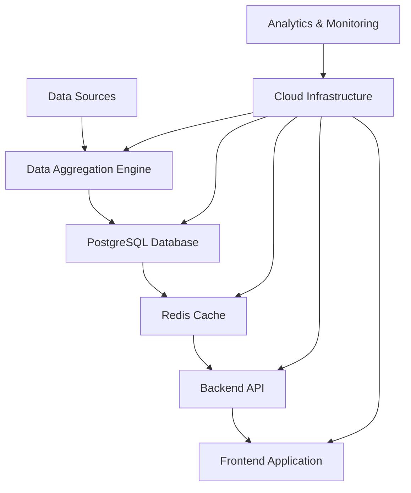

### Key Features

1. Comprehensive startup profiles with enriched data
2. Advanced search and filtering capabilities
3. Real-time updates on funding rounds, job openings, and news
4. Interactive data visualizations and trend analysis tools
5. User account management with role-based access control
6. API access for programmatic data retrieval

### Data Flow

1. Data is collected from various public sources, job boards, and news APIs
2. Collected data is cleaned, validated, and enriched
3. Processed data is stored in the PostgreSQL database
4. Frequently accessed data is cached in Redis for improved performance
5. Backend API serves data to the frontend application and external API consumers
6. Frontend application presents data to users through an intuitive interface
7. User interactions and system events are logged and monitored

### Security Measures

1. Data encryption in transit (TLS 1.3) and at rest (AWS KMS)
2. Multi-factor authentication for user accounts
3. Role-based access control (RBAC) for data access
4. Regular security audits and penetration testing
5. Compliance with GDPR and CCPA regulations

### Scalability and Performance

1. Horizontal scaling through AWS Auto Scaling groups
2. Content Delivery Network (CloudFront) for static asset delivery
3. Database read replicas for improved query performance
4. Caching strategies to reduce database load
5. Asynchronous processing of non-critical tasks using message queues

This system overview provides a high-level description of the Boston Startup Tracker, outlining its key components, architecture, features, and operational characteristics. The platform is designed to be secure, scalable, and performant, capable of handling large volumes of data and user requests while providing valuable insights into the Boston startup ecosystem.

# SYSTEM ARCHITECTURE

## PROGRAMMING LANGUAGES

The Boston Startup Tracker will utilize the following programming languages, each chosen for its specific strengths and suitability for different aspects of the project:

| Language | Purpose | Justification |
|----------|---------|---------------|
| Python | Backend development, data processing, web scraping | - Excellent for data manipulation and analysis<br>- Rich ecosystem of libraries (Flask, Scrapy, pandas)<br>- Rapid development and ease of maintenance |
| JavaScript (ES6+) | Frontend development, server-side rendering | - Industry standard for web development<br>- Supports modern frameworks like React<br>- Enables dynamic and interactive user interfaces |
| SQL | Database queries and management | - Powerful for complex data retrieval and manipulation<br>- Standard language for relational databases (PostgreSQL) |
| HTML5/CSS3 | Frontend structure and styling | - Essential for creating responsive and accessible web interfaces<br>- Supports modern web standards |
| Shell scripting | Deployment and automation scripts | - Efficient for system-level tasks and automation<br>- Integrates well with CI/CD pipelines |

## HIGH-LEVEL ARCHITECTURE DIAGRAM

The following diagram provides an overview of the Boston Startup Tracker's system architecture:

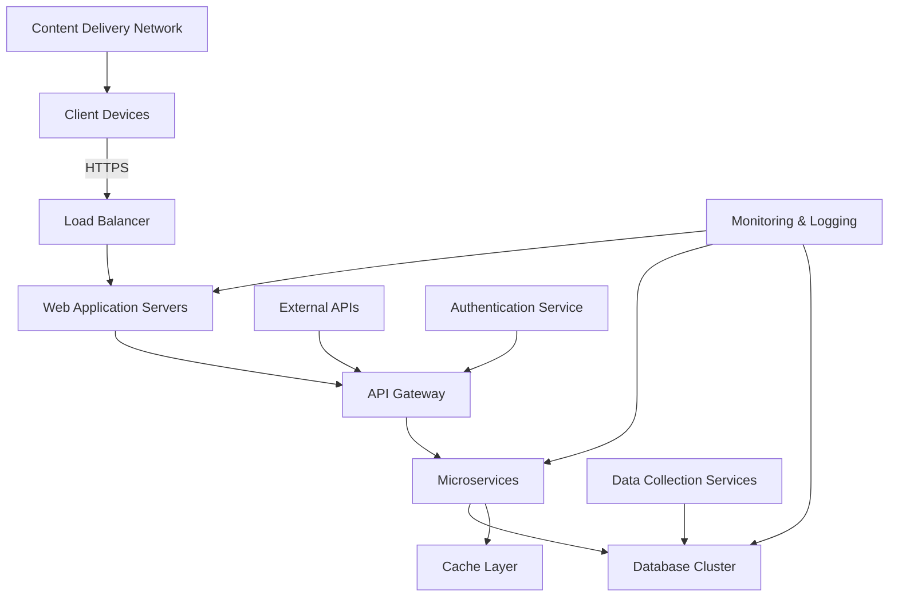

## COMPONENT DIAGRAMS

### Web Application Component

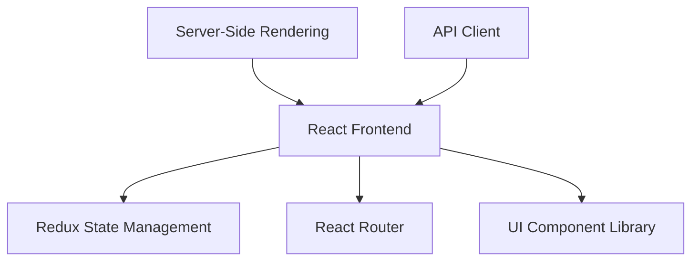

### Backend Services Component

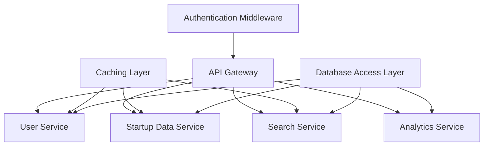

### Data Collection Component

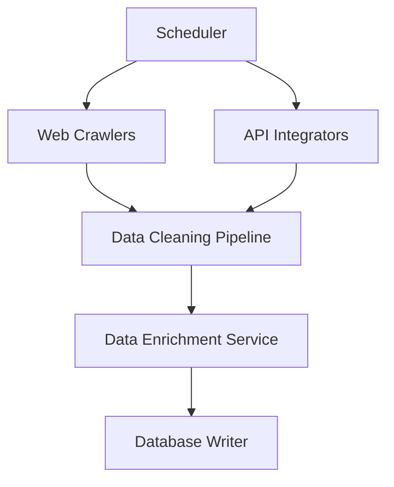

## SEQUENCE DIAGRAMS

### User Search Sequence

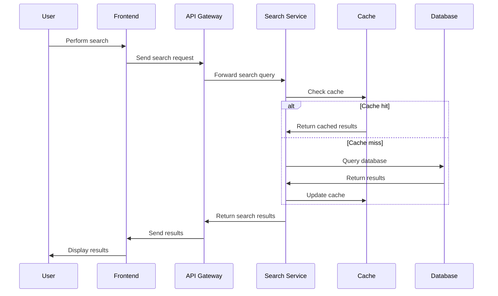

### Data Update Sequence

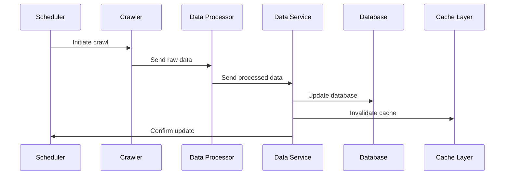

## DATA-FLOW DIAGRAM

The following diagram illustrates how information moves through the Boston Startup Tracker system:

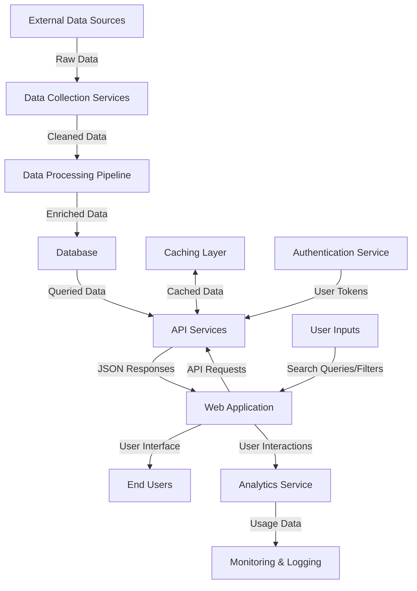

This data flow diagram demonstrates how information is collected from external sources, processed, stored, and ultimately presented to end-users through the web application. It also shows how user interactions feed back into the system for analytics and how caching and authentication services interact with the main data flow to improve performance and security.

# SYSTEM DESIGN

## PROGRAMMING LANGUAGES

The Boston Startup Tracker will utilize the following programming languages, each chosen for its specific strengths and suitability for different aspects of the project:

| Language | Purpose | Justification |
|----------|---------|---------------|
| Python | Backend development, data processing, web scraping | - Excellent for data manipulation and analysis<br>- Rich ecosystem of libraries (Flask, Scrapy, pandas)<br>- Rapid development and ease of maintenance |
| JavaScript (ES6+) | Frontend development, server-side rendering | - Industry standard for web development<br>- Supports modern frameworks like React<br>- Enables dynamic and interactive user interfaces |
| SQL | Database queries and management | - Powerful for complex data retrieval and manipulation<br>- Standard language for relational databases (PostgreSQL) |
| HTML5/CSS3 | Frontend structure and styling | - Essential for creating responsive and accessible web interfaces<br>- Supports modern web standards |
| Shell scripting | Deployment and automation scripts | - Efficient for system-level tasks and automation<br>- Integrates well with CI/CD pipelines |

## DATABASE DESIGN

The Boston Startup Tracker will use PostgreSQL as its primary database management system. The database design will follow a relational model to efficiently store and manage startup data. Here's an overview of the main tables and their relationships:

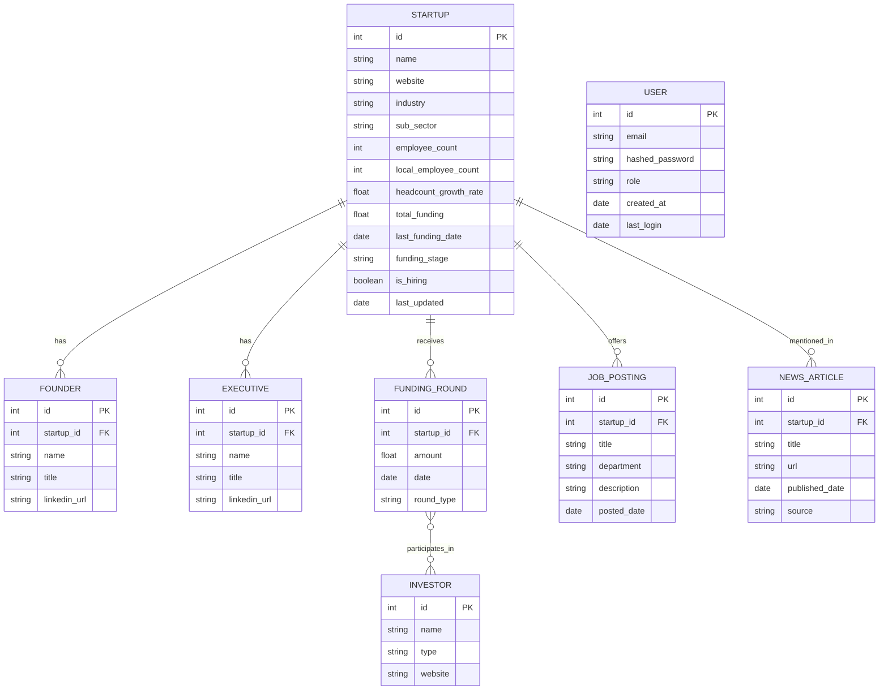

This design allows for efficient querying and relationship management between different entities within the Boston startup ecosystem.

## API DESIGN

The Boston Startup Tracker will implement a RESTful API to facilitate communication between the frontend application and the backend services, as well as to provide data access to external systems. The API will be built using Python Flask and will follow these design principles:

1. Use of standard HTTP methods (GET, POST, PUT, DELETE)
2. Stateless communication
3. Proper use of HTTP status codes
4. JSON for data exchange
5. Versioning to ensure backward compatibility

Here's an overview of the main API endpoints:

| Endpoint | Method | Description |
|----------|--------|-------------|
| `/api/v1/startups` | GET | Retrieve a list of startups (with pagination) |
| `/api/v1/startups/<id>` | GET | Retrieve details of a specific startup |
| `/api/v1/startups/search` | GET | Search startups based on various criteria |
| `/api/v1/investors` | GET | Retrieve a list of investors |
| `/api/v1/investors/<id>` | GET | Retrieve details of a specific investor |
| `/api/v1/jobs` | GET | Retrieve a list of job postings |
| `/api/v1/news` | GET | Retrieve recent news articles |
| `/api/v1/users` | POST | Create a new user account |
| `/api/v1/users/<id>` | GET, PUT | Retrieve or update user information |
| `/api/v1/auth/login` | POST | Authenticate user and receive access token |
| `/api/v1/auth/logout` | POST | Invalidate user's access token |

Authentication will be implemented using JSON Web Tokens (JWT) for secure access to protected endpoints.

## USER INTERFACE DESIGN

The Boston Startup Tracker's user interface will be designed as a responsive web application using React.js. The UI will focus on providing an intuitive and efficient user experience across various devices and screen sizes. Here's an overview of the main components and their layouts:

1. Dashboard
```
+----------------------------------+
|  Header (Logo, Navigation, User) |
+----------------------------------+
|  Quick Stats  |  Recent Updates  |
|---------------|------------------|
|  Trending     |  Featured        |
|  Startups     |  Companies       |
|---------------|------------------|
|  Latest News  |  Job Openings    |
+----------------------------------+
|           Footer                 |
+----------------------------------+
```

2. Search and Filter Interface
```
+----------------------------------+
|  Search Bar                      |
+----------------------------------+
|  Filters  |  Search Results      |
|           |                      |
|  Industry |  - Company Card      |
|  Funding  |  - Company Card      |
|  Size     |  - Company Card      |
|  Location |  ...                 |
|           |                      |
|           |  Pagination          |
+----------------------------------+
```

3. Company Profile Page
```
+----------------------------------+
|  Company Logo  |  Quick Stats    |
|---------------|------------------|
|  About        |  Funding History |
|---------------|------------------|
|  Team         |  Job Openings    |
|---------------|------------------|
|  News         |  Similar         |
|               |  Companies       |
+----------------------------------+
```

4. Investor Profile Page
```
+----------------------------------+
|  Investor Logo  |  Quick Stats   |
|----------------|-----------------|
|  About         |  Portfolio      |
|----------------|-----------------|
|  Recent        |  Investment     |
|  Investments   |  Trends         |
+----------------------------------+
```

The UI will be implemented using a component-based architecture, leveraging React's reusability features. Material-UI or a similar UI component library will be used to ensure consistent styling and responsive design across the application.

Key UI/UX considerations:

1. Responsive design for mobile, tablet, and desktop devices
2. Intuitive navigation with a clear hierarchy of information
3. Data visualizations using D3.js or Chart.js for funding trends, industry breakdowns, etc.
4. Accessibility compliance with WCAG 2.1 Level AA standards
5. Dark mode option for user preference
6. Smooth transitions and loading states for improved perceived performance

By following these design principles and leveraging modern web technologies, the Boston Startup Tracker will provide a user-friendly and efficient interface for exploring the Boston startup ecosystem.

# TECHNOLOGY STACK

## PROGRAMMING LANGUAGES

The Boston Startup Tracker will utilize the following programming languages, each chosen for its specific strengths and suitability for different aspects of the project:

| Language | Purpose | Justification |
|----------|---------|---------------|
| Python | Backend development, data processing, web scraping | - Excellent for data manipulation and analysis<br>- Rich ecosystem of libraries (Flask, Scrapy, pandas)<br>- Rapid development and ease of maintenance |
| JavaScript (ES6+) | Frontend development, server-side rendering | - Industry standard for web development<br>- Supports modern frameworks like React<br>- Enables dynamic and interactive user interfaces |
| SQL | Database queries and management | - Powerful for complex data retrieval and manipulation<br>- Standard language for relational databases (PostgreSQL) |
| HTML5/CSS3 | Frontend structure and styling | - Essential for creating responsive and accessible web interfaces<br>- Supports modern web standards |
| Shell scripting | Deployment and automation scripts | - Efficient for system-level tasks and automation<br>- Integrates well with CI/CD pipelines |

## FRAMEWORKS AND LIBRARIES

The project will leverage the following frameworks and libraries to accelerate development and ensure best practices:

| Framework/Library | Purpose | Justification |
|-------------------|---------|---------------|
| Flask | Backend web framework | - Lightweight and flexible<br>- Easy to integrate with various extensions<br>- Suitable for RESTful API development |
| React | Frontend framework | - Component-based architecture for reusability<br>- Virtual DOM for efficient rendering<br>- Large ecosystem and community support |
| Redux | State management | - Predictable state management for complex applications<br>- Integrates well with React |
| Scrapy | Web scraping framework | - Asynchronous and efficient<br>- Built-in support for handling common scraping scenarios |
| pandas | Data manipulation and analysis | - Powerful data structures for efficient data processing<br>- Integrates well with various data sources |
| NumPy | Numerical computing | - Efficient array operations<br>- Essential for data preprocessing and analysis |
| D3.js | Data visualization | - Flexible and powerful library for creating interactive visualizations<br>- Works well with React for dynamic charts |
| Bootstrap | CSS framework | - Responsive grid system<br>- Pre-built components for rapid UI development |
| Jest | JavaScript testing | - Comprehensive testing framework for React applications<br>- Supports both unit and integration testing |
| Pytest | Python testing | - Feature-rich testing framework for Python<br>- Supports both unit and integration testing |

## DATABASES

The Boston Startup Tracker will employ the following database systems:

| Database | Purpose | Justification |
|----------|---------|---------------|
| PostgreSQL | Primary relational database | - Robust and feature-rich open-source RDBMS<br>- Excellent support for complex queries and data integrity<br>- Scalable and supports large datasets |
| Redis | Caching and session management | - In-memory data structure store for high-performance caching<br>- Supports pub/sub messaging for real-time features<br>- Reduces load on primary database |
| Elasticsearch | Full-text search and analytics | - Powerful search capabilities for startup and job data<br>- Supports complex aggregations for analytics<br>- Scalable for large volumes of text data |

## THIRD-PARTY SERVICES

The system will integrate with the following external services and APIs:

| Service | Purpose | Justification |
|---------|---------|---------------|
| Amazon Web Services (AWS) | Cloud infrastructure and services | - Comprehensive suite of cloud services<br>- Scalable and reliable infrastructure<br>- Wide range of tools for deployment, monitoring, and management |
| Stripe | Payment processing | - Secure and reliable payment gateway<br>- Easy integration for subscription management<br>- Supports multiple payment methods |
| SendGrid | Email delivery | - Reliable email delivery service<br>- Provides templates and analytics<br>- Scalable for high-volume email sending |
| Google Analytics | User behavior tracking | - Comprehensive web analytics platform<br>- Provides insights into user engagement and site performance<br>- Easy integration with web applications |
| GitHub | Version control and CI/CD | - Industry-standard for code collaboration<br>- Integrates well with various CI/CD tools<br>- Provides project management features |
| Sentry | Error tracking and monitoring | - Real-time error tracking and reporting<br>- Supports both frontend and backend error monitoring<br>- Helps in quick identification and resolution of issues |

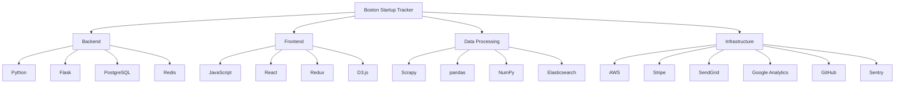

This technology stack is designed to provide a robust, scalable, and maintainable solution for the Boston Startup Tracker. It leverages industry-standard technologies and best practices to ensure efficient development, high performance, and a great user experience.

# SECURITY CONSIDERATIONS

## AUTHENTICATION AND AUTHORIZATION

The Boston Startup Tracker will implement a robust authentication and authorization system to ensure secure access to the platform and its resources.

### Authentication

1. User Authentication:
   - Implement multi-factor authentication (MFA) for all user accounts
   - Use OAuth 2.0 for third-party authentication providers (Google, LinkedIn, etc.)
   - Enforce strong password policies (minimum 12 characters, including uppercase, lowercase, numbers, and special characters)
   - Implement account lockout after multiple failed login attempts

2. API Authentication:
   - Use API keys for external API access
   - Implement JWT (JSON Web Tokens) for stateless authentication

### Authorization

1. Role-Based Access Control (RBAC):
   - Implement the following user roles:
     - Anonymous User
     - Registered User
     - Premium User
     - Administrator

2. Permission Matrix:

| Feature | Anonymous | Registered | Premium | Administrator |
|---------|-----------|------------|---------|---------------|
| View public startup data | ✓ | ✓ | ✓ | ✓ |
| Save searches | ✗ | ✓ | ✓ | ✓ |
| Access detailed company profiles | ✗ | ✗ | ✓ | ✓ |
| Export data | ✗ | ✗ | ✓ | ✓ |
| Manage user accounts | ✗ | ✗ | ✗ | ✓ |
| Access admin dashboard | ✗ | ✗ | ✗ | ✓ |

3. API Access Control:
   - Implement rate limiting based on user roles and API key tiers
   - Use OAuth 2.0 scopes to define fine-grained API access permissions

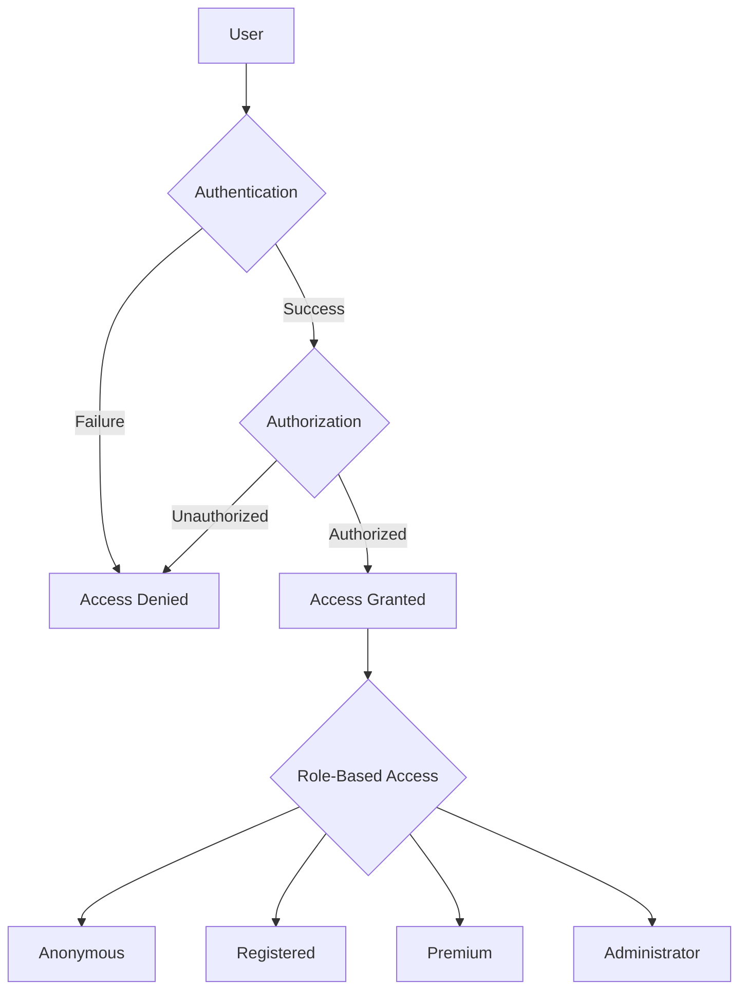

## DATA SECURITY

The Boston Startup Tracker will implement comprehensive data security measures to protect sensitive information throughout its lifecycle.

1. Data Encryption:
   - Implement TLS 1.3 for all data in transit
   - Use AES-256 encryption for data at rest
   - Utilize AWS Key Management Service (KMS) for key management

2. Database Security:
   - Implement database-level encryption
   - Use parameterized queries to prevent SQL injection attacks
   - Regularly update and patch the database management system

3. Data Masking and Anonymization:
   - Implement data masking for sensitive information in non-production environments
   - Use data anonymization techniques for analytics and reporting features

4. Access Controls:
   - Implement least privilege access principles
   - Use AWS Identity and Access Management (IAM) for fine-grained access control to AWS resources

5. Data Backup and Recovery:
   - Implement regular automated backups
   - Use encryption for backup data
   - Regularly test data recovery procedures

6. Secure File Upload:
   - Implement file type and size restrictions
   - Scan uploaded files for malware
   - Store uploaded files in a secure, isolated environment

7. Data Retention and Deletion:
   - Implement data retention policies in compliance with legal requirements
   - Securely delete data when it's no longer needed, using methods like crypto-shredding

## SECURITY PROTOCOLS

The Boston Startup Tracker will adhere to industry-standard security protocols and best practices to maintain a robust security posture.

1. Network Security:
   - Implement Web Application Firewall (WAF) using AWS WAF
   - Use Virtual Private Cloud (VPC) to isolate resources
   - Implement intrusion detection and prevention systems (IDS/IPS)

2. Application Security:
   - Conduct regular security audits and penetration testing
   - Implement Content Security Policy (CSP) headers
   - Use secure cookie flags (HttpOnly, Secure)
   - Implement proper error handling to prevent information leakage

3. Monitoring and Logging:
   - Use AWS CloudWatch for real-time monitoring and alerting
   - Implement centralized logging using ELK stack (Elasticsearch, Logstash, Kibana)
   - Set up alerts for suspicious activities and security events

4. Vulnerability Management:
   - Conduct regular vulnerability scans
   - Implement a patch management process for timely updates
   - Use dependency scanning tools to identify and mitigate vulnerabilities in third-party libraries

5. Incident Response:
   - Develop and maintain an incident response plan
   - Conduct regular incident response drills
   - Implement automated incident detection and response mechanisms

6. Compliance:
   - Ensure compliance with relevant standards and regulations (e.g., GDPR, CCPA)
   - Conduct regular compliance audits
   - Maintain up-to-date documentation of security policies and procedures

7. Secure Development Lifecycle:
   - Implement secure coding practices
   - Conduct code reviews with a focus on security
   - Use static and dynamic application security testing (SAST/DAST) tools

8. Third-Party Security:
   - Conduct security assessments of third-party integrations
   - Implement vendor risk management processes
   - Regularly review and update third-party access permissions

```mermaid
graph TD
    A[Security Protocols] --> B[Network Security]
    A --> C[Application Security]
    A --> D[Monitoring and Logging]
    A --> E[Vulnerability Management]
    A --> F[Incident Response]
    A --> G[Compliance]
    A --> H[Secure Development Lifecycle]
    A --> I[Third-Party Security]

    B --> B1[WAF]
    B --> B2[VPC]
    B --> B3[IDS/IPS]

    C --> C1[Security Audits]
    C --> C2[CSP Headers]
    C --> C3[Secure Cookies]

    D --> D1[CloudWatch]
    D --> D2[ELK Stack]
    D --> D3[Security Alerts]

    E --> E1[Vulnerability Scans]
    E --> E2[Patch Management]
    E --> E3[Dependency Scanning]

    F --> F1[Response Plan]
    F --> F2[Incident Drills]
    F --> F3[Automated Detection]

    G --> G1[GDPR]
    G --> G2[CCPA]
    G --> G3[Audits]

    H --> H1[Secure Coding]
    H --> H2[Code Reviews]
    H --> H3[SAST/DAST]

    I --> I1[Assessments]
    I --> I2[Risk Management]
    I --> I3[Access Reviews]
```

By implementing these comprehensive security measures, the Boston Startup Tracker aims to provide a secure and trustworthy platform for its users while protecting sensitive startup and user data from potential threats and breaches.