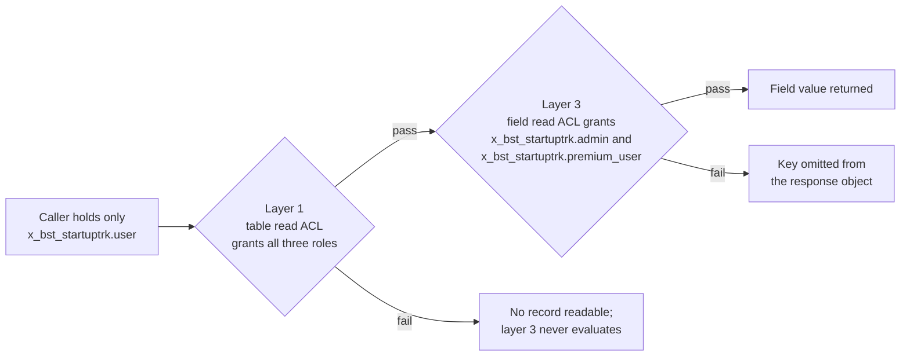

# Access control — `x_bst_startuptrk`

This document is the authorization reference for the ServiceNow scoped application `x_bst_startuptrk`. It states the three roles the application declares, the four layers of access-control records that enforce them, the role-by-field matrix over the seven premium-gated fields, the enforcement rules every calling surface must honour, and the procedure by which the scheme is verified. Every access-control record is enumerated individually: by table, by operation, by field where one applies, and by the roles joined to it.

The Update Set XML at [`../update-set/x_bst_startuptrk_boston_startup_tracker_update_set.xml`](../update-set/x_bst_startuptrk_boston_startup_tracker_update_set.xml) is **authoritative** over this document. Everything below is a transcription of the three `sys_user_role` records, the 43 `sys_security_acl` records and the 66 `sys_security_acl_role` join records that file carries. Where this document and those records disagree about a role name, an ACL name, an operation, a field or a joined role, the records are correct and this document is corrected to match them, never the reverse.

The table names, column names and premium markers used below are the ones established in [`./data-model.md`](./data-model.md). The seven fields marked **P** there are the seven fields gated here, and the two documents carry the same seven names.

This document carries no rationale. Every decision behind this scheme, every alternative considered and every risk it carries is recorded in [`../../docs/decisions/DECISION_LOG.md`](../../docs/decisions/DECISION_LOG.md), which is the single source of truth for "why".

**Reviewer.** This document is the artifact validated by the **Security** reviewer entry in [`../../docs/review/CRITICAL_DECISIONS.md`](../../docs/review/CRITICAL_DECISIONS.md). That reviewer must check one thing above all others: that all twenty-one field-by-role assertions run under impersonated users each holding exactly one scoped role and none of the elevated platform roles. See [Verification procedure](#verification-procedure).

## The three roles

The application declares three roles. Their names are fully qualified and dotted; no underscore form exists.

| Role | Purpose | Capability |
| --- | --- | --- |
| `x_bst_startuptrk.admin` | Administers the application: maintains records on every table, loads the staging dataset and inspects the rate-limit counters. | Read, write, create and delete on all seven entity tables; reads all seven premium fields; sole role with any access to the staging and rate-limit counter tables. |
| `x_bst_startuptrk.premium_user` | Entitled consumer of the full dataset over the portal and the REST API. | Read-only on all seven entity tables; reads all seven premium fields. |
| `x_bst_startuptrk.user` | Base consumer of the non-premium dataset over the portal and the REST API. | Read-only on all seven entity tables; **denied** on all seven premium fields. |

Both non-administrative roles are **read-only**. Neither `x_bst_startuptrk.premium_user` nor `x_bst_startuptrk.user` is joined to any write, create or delete ACL on any table in the application, so neither can insert, modify or remove a record on any surface. The single role that can mutate data is `x_bst_startuptrk.admin`.

The three roles are granted on platform `sys_user` records. **This application declares no custom identity table.** There is no user table, no credential column and no session record inside the `x_bst_startuptrk` scope; identity, authentication and role membership are all platform concerns, and the application reads the caller's effective roles from the platform.

`sys_user` sits **outside** the `x_bst_startuptrk` scope. The application therefore creates no user records and grants no roles as part of the Update Set: the delivered XML contains three `sys_user_role` definitions and zero `sys_user_has_role` assignments. Granting a role to a person is an administrative act performed on the instance after the Update Set commits. The three purpose-built users the field-ACL assertions require are created by Automated Test Framework setup steps at run time, not shipped in the Update Set; see [`./manual-build/05-atf-test-suites.md`](./manual-build/05-atf-test-suites.md). Both points are recorded in [`../../docs/decisions/DECISION_LOG.md`](../../docs/decisions/DECISION_LOG.md).

## The four layers

Forty-three `sys_security_acl` records enforce the scheme, distributed across four layers, with 66 `sys_security_acl_role` records joining roles to them. Every ACL is of type `record`, is active, and carries `admin_overrides` true — the consequence of that last attribute is stated under [Verification procedure](#verification-procedure).

### Layer 1 — table-level read, 7 ACLs

One read ACL per entity table, each joined to **all three** roles. A table-level ACL's name is the table name; the operation distinguishes one ACL from another on the same table.

| # | ACL name | Operation | Roles joined | Joins |
| --- | --- | --- | --- | --- |
| 1 | `x_bst_startuptrk_startup` | `read` | `x_bst_startuptrk.admin`, `x_bst_startuptrk.premium_user`, `x_bst_startuptrk.user` | 3 |
| 2 | `x_bst_startuptrk_founder` | `read` | `x_bst_startuptrk.admin`, `x_bst_startuptrk.premium_user`, `x_bst_startuptrk.user` | 3 |
| 3 | `x_bst_startuptrk_executive` | `read` | `x_bst_startuptrk.admin`, `x_bst_startuptrk.premium_user`, `x_bst_startuptrk.user` | 3 |
| 4 | `x_bst_startuptrk_investor` | `read` | `x_bst_startuptrk.admin`, `x_bst_startuptrk.premium_user`, `x_bst_startuptrk.user` | 3 |
| 5 | `x_bst_startuptrk_fundinground` | `read` | `x_bst_startuptrk.admin`, `x_bst_startuptrk.premium_user`, `x_bst_startuptrk.user` | 3 |
| 6 | `x_bst_startuptrk_jobposting` | `read` | `x_bst_startuptrk.admin`, `x_bst_startuptrk.premium_user`, `x_bst_startuptrk.user` | 3 |
| 7 | `x_bst_startuptrk_newsarticle` | `read` | `x_bst_startuptrk.admin`, `x_bst_startuptrk.premium_user`, `x_bst_startuptrk.user` | 3 |

7 ACLs, 7 × 3 = 21 role joins.

Operational consequence: without these seven ACLs nothing on the seven tables is readable by any role, and the field-level ACLs of layer 3 never evaluate at all.

### Layer 2 — table-level write, create and delete, 21 ACLs

Three operations across seven entity tables. Each of the 21 ACLs is joined to `x_bst_startuptrk.admin` and to no other role. Every cell below is one ACL, identified by its table name and its operation, and names the single role joined to it.

| # | Table | `write` ACL grants | `create` ACL grants | `delete` ACL grants |
| --- | --- | --- | --- | --- |
| 1 | `x_bst_startuptrk_startup` | `x_bst_startuptrk.admin` | `x_bst_startuptrk.admin` | `x_bst_startuptrk.admin` |
| 2 | `x_bst_startuptrk_founder` | `x_bst_startuptrk.admin` | `x_bst_startuptrk.admin` | `x_bst_startuptrk.admin` |
| 3 | `x_bst_startuptrk_executive` | `x_bst_startuptrk.admin` | `x_bst_startuptrk.admin` | `x_bst_startuptrk.admin` |
| 4 | `x_bst_startuptrk_investor` | `x_bst_startuptrk.admin` | `x_bst_startuptrk.admin` | `x_bst_startuptrk.admin` |
| 5 | `x_bst_startuptrk_fundinground` | `x_bst_startuptrk.admin` | `x_bst_startuptrk.admin` | `x_bst_startuptrk.admin` |
| 6 | `x_bst_startuptrk_jobposting` | `x_bst_startuptrk.admin` | `x_bst_startuptrk.admin` | `x_bst_startuptrk.admin` |
| 7 | `x_bst_startuptrk_newsarticle` | `x_bst_startuptrk.admin` | `x_bst_startuptrk.admin` | `x_bst_startuptrk.admin` |

7 tables × 3 operations = 21 ACLs, each with exactly one role join, so 21 role joins.

Operational consequence: a caller holding only `x_bst_startuptrk.premium_user` or only `x_bst_startuptrk.user` is denied every mutation on every entity table, over the REST API and over the portal alike.

### Layer 3 — field-level read, 7 ACLs

This layer is the enforcement point for the seven premium-gated fields. A field-level ACL is named in the platform's `table.field` form, and each of the seven is joined to `x_bst_startuptrk.admin` and `x_bst_startuptrk.premium_user` only.

| # | Table | Field | ACL name | Operation | Roles joined | Joins |
| --- | --- | --- | --- | --- | --- | --- |
| 1 | `x_bst_startuptrk_startup` | `total_funding_usd` | `x_bst_startuptrk_startup.total_funding_usd` | `read` | `x_bst_startuptrk.admin`, `x_bst_startuptrk.premium_user` | 2 |
| 2 | `x_bst_startuptrk_startup` | `institutional_funding_last_5yrs` | `x_bst_startuptrk_startup.institutional_funding_last_5yrs` | `read` | `x_bst_startuptrk.admin`, `x_bst_startuptrk.premium_user` | 2 |
| 3 | `x_bst_startuptrk_founder` | `contact_email` | `x_bst_startuptrk_founder.contact_email` | `read` | `x_bst_startuptrk.admin`, `x_bst_startuptrk.premium_user` | 2 |
| 4 | `x_bst_startuptrk_executive` | `contact_email` | `x_bst_startuptrk_executive.contact_email` | `read` | `x_bst_startuptrk.admin`, `x_bst_startuptrk.premium_user` | 2 |
| 5 | `x_bst_startuptrk_investor` | `aum_usd` | `x_bst_startuptrk_investor.aum_usd` | `read` | `x_bst_startuptrk.admin`, `x_bst_startuptrk.premium_user` | 2 |
| 6 | `x_bst_startuptrk_fundinground` | `amount_usd` | `x_bst_startuptrk_fundinground.amount_usd` | `read` | `x_bst_startuptrk.admin`, `x_bst_startuptrk.premium_user` | 2 |
| 7 | `x_bst_startuptrk_fundinground` | `valuation_usd` | `x_bst_startuptrk_fundinground.valuation_usd` | `read` | `x_bst_startuptrk.admin`, `x_bst_startuptrk.premium_user` | 2 |

7 ACLs, 7 × 2 = 14 role joins. These are exactly the seven fields marked **P** in [`./data-model.md`](./data-model.md); there is no eighth gated field. Two of the seven sit on `x_bst_startuptrk_startup`, two on `x_bst_startuptrk_fundinground`, and one each on `x_bst_startuptrk_founder`, `x_bst_startuptrk_executive` and `x_bst_startuptrk_investor`. `contact_email` is gated on two different tables and is a distinct ACL on each.

No write, create or delete ACL is declared at field level. Mutation is governed entirely by the table-level ACLs of layer 2, which grant `x_bst_startuptrk.admin` alone.

Operational consequence: without these seven ACLs every premium field is readable by every role, because evaluation falls back to the table-level read grant of layer 1.

### Layer 4 — supporting tables, 8 ACLs

Three supporting tables. `x_bst_startuptrk_m2m_round_investor` is readable by all three roles so that the participating investors of a funding round render on the funding-round view and in the REST response. `x_bst_startuptrk_ingest_staging` and `x_bst_startuptrk_rate_limit_counter` are reachable by `x_bst_startuptrk.admin` only, for read as well as for write.

| # | ACL name | Operation | Roles joined | Joins |
| --- | --- | --- | --- | --- |
| 1 | `x_bst_startuptrk_m2m_round_investor` | `read` | `x_bst_startuptrk.admin`, `x_bst_startuptrk.premium_user`, `x_bst_startuptrk.user` | 3 |
| 2 | `x_bst_startuptrk_m2m_round_investor` | `write` | `x_bst_startuptrk.admin` | 1 |
| 3 | `x_bst_startuptrk_m2m_round_investor` | `create` | `x_bst_startuptrk.admin` | 1 |
| 4 | `x_bst_startuptrk_m2m_round_investor` | `delete` | `x_bst_startuptrk.admin` | 1 |
| 5 | `x_bst_startuptrk_ingest_staging` | `read` | `x_bst_startuptrk.admin` | 1 |
| 6 | `x_bst_startuptrk_ingest_staging` | `write` | `x_bst_startuptrk.admin` | 1 |
| 7 | `x_bst_startuptrk_rate_limit_counter` | `read` | `x_bst_startuptrk.admin` | 1 |
| 8 | `x_bst_startuptrk_rate_limit_counter` | `write` | `x_bst_startuptrk.admin` | 1 |

8 ACLs, 3 + 1 + 1 + 1 + 1 + 1 + 1 + 1 = 10 role joins.

The four `x_bst_startuptrk_m2m_round_investor` ACLs mirror the entity-table pattern: read for all three roles, mutation for `x_bst_startuptrk.admin` only. `x_bst_startuptrk_ingest_staging` and `x_bst_startuptrk_rate_limit_counter` each carry a `read` and a `write` ACL and no field-level ACL; neither declares a `create` or a `delete` ACL. No premium field exists on any of the three supporting tables, so layer 3 does not extend to them.

### The evaluation chain

A read of a premium field succeeds only if **both** the table-level read ACL of layer 1 and the field-level read ACL of layer 3 grant the caller. The platform matches ACLs most-specific-first — a table-and-field rule outranks a table-wide rule, which outranks a global rule — and a pass is required at each level in the chain, not merely at the most specific one.

**Both layers are therefore mandatory.** Layer 1 without layer 3 leaves every premium field readable by every role. Layer 3 without layer 1 leaves no record readable at all, and the field-level rules never evaluate.

A non-premium column has no field-level ACL, so its read is decided by layer 1 alone and it is readable by all three roles.

### Roll-up

| Layer | Scope | `sys_security_acl` | `sys_security_acl_role` |
| --- | --- | --- | --- |
| 1 | Table-level read, 7 entity tables | 7 | 21 |
| 2 | Table-level write, create and delete, 7 entity tables | 21 | 21 |
| 3 | Field-level read, 7 premium fields | 7 | 14 |
| 4 | Supporting tables | 8 | 10 |
| | **Total** | **43** | **66** |

ACL arithmetic: 7 + 21 + 7 + 8 = 43.

Role-join arithmetic: 21 + 21 + 14 + 10 = 66.

Every one of the 43 ACLs carries at least one role join, and every join resolves to one of the three `sys_user_role` records. The counts above are the counts in [`../update-set/x_bst_startuptrk_boston_startup_tracker_update_set.xml`](../update-set/x_bst_startuptrk_boston_startup_tracker_update_set.xml).

## The premium field matrix

Seven premium-gated fields across three roles. Twenty-one cells, all populated.

| # | Premium field | `x_bst_startuptrk.admin` | `x_bst_startuptrk.premium_user` | `x_bst_startuptrk.user` |
| --- | --- | --- | --- | --- |
| 1 | `x_bst_startuptrk_startup.total_funding_usd` | Read | Read | **Denied** |
| 2 | `x_bst_startuptrk_startup.institutional_funding_last_5yrs` | Read | Read | **Denied** |
| 3 | `x_bst_startuptrk_founder.contact_email` | Read | Read | **Denied** |
| 4 | `x_bst_startuptrk_executive.contact_email` | Read | Read | **Denied** |
| 5 | `x_bst_startuptrk_investor.aum_usd` | Read | Read | **Denied** |
| 6 | `x_bst_startuptrk_fundinground.amount_usd` | Read | Read | **Denied** |
| 7 | `x_bst_startuptrk_fundinground.valuation_usd` | Read | Read | **Denied** |

`x_bst_startuptrk.admin` reads all seven. `x_bst_startuptrk.premium_user` reads all seven. `x_bst_startuptrk.user` is denied all seven. 7 fields × 3 roles = 21 outcomes.

This matrix is the specification for the 21 Automated Test Framework field-ACL tests: one test per cell, asserting that cell's outcome. The suite and its run-time user creation are in [`./manual-build/05-atf-test-suites.md`](./manual-build/05-atf-test-suites.md), and the pass condition is criterion 2 in [`./validation-checklist.md`](./validation-checklist.md).

### The role difference is at field level only

The other 46 columns across the seven entity tables carry no field-level ACL and are readable by all three roles under the layer-1 grant: 53 columns in total, of which 7 are gated, leaving 46 ungated. The twelve columns of `x_bst_startuptrk_startup` reduce to ten ungated, and the child tables are ungated apart from `contact_email` on `x_bst_startuptrk_founder` and `x_bst_startuptrk_executive`, `aum_usd` on `x_bst_startuptrk_investor`, and `amount_usd` and `valuation_usd` on `x_bst_startuptrk_fundinground`. Column counts are in [`./data-model.md`](./data-model.md).

No record-level restriction exists on any of the seven entity tables. Every role that can read a table can read every row of it, and the role difference is confined to field level.

**Invariant.** Record-level visibility is identical for `x_bst_startuptrk.admin`, `x_bst_startuptrk.premium_user` and `x_bst_startuptrk.user`, which is what makes an aggregate `total_count` correct for every caller; if a record-level restriction is ever added, the aggregate count would over-report for restricted callers and would have to be replaced by a secured count. The pagination envelope that depends on this is documented in [`./api-reference.md`](./api-reference.md).

## Enforcement rules

These rules are normative. They bind the Scripted REST operations, the Script Includes and the Service Portal widget server scripts equally, so the API and the portal cannot disagree about what a role may see.

### Secured read path

Every caller-facing read must use the secured record-access path, `GlideRecordSecure`, and never the unsecured `GlideRecord`. Ordinary record access does not guarantee access-control enforcement on server-side reads; the secured variant does. All 31 REST operations use `GlideRecordSecure`, as does `StartupSearchService`, the single Script Include that builds the startup query for both the `/startups` list operation and the portal search widget. Every widget server script must do the same.

Four server-side maintenance paths read through the unsecured `GlideRecord`, and this is the complete and closed list: `RateLimitService` against the administrator-only `x_bst_startuptrk_rate_limit_counter` table, `InvestorPortfolioService` computing the `portfolio_count` derivation, `IngestionMapper` writing ingested records, and the business rule that recalculates a portfolio count after a funding-round change. None of the four returns record data to a caller, and none reads a premium field on a caller's behalf. Any new unsecured read outside this list is a defect.

### Omitted, not nulled

The secured read path returns an **empty string** for a denied field, not an error. Serialising every column of a secured record without a further check therefore produces a response carrying an empty value for a premium field, which is the nulled behaviour the requirements forbid.

To omit, the serialiser tests each field with an element-level read check and **skips the key entirely** when the check fails. `RestResponseBuilder.serialize()` obtains the element with `getElement()`, evaluates `canRead()` on it, and continues past the field without assigning a key when the evaluation is false. A denied premium field is consequently **absent from** the response object; the key does not appear with a null, an empty string or a placeholder.

This gate lives exactly once, in the `RestResponseBuilder` Script Include, and is used by all 31 REST operations and by every widget server script. A response object built by any other means is not permitted. The absence of the key, in place of a present-and-null key, is the one point at which this document records something other than a literal reading of a field being "hidden"; it is entered in [`../../docs/decisions/DECISION_LOG.md`](../../docs/decisions/DECISION_LOG.md).

### No bypass

No Script Include in this application is client-callable, and none runs with elevated privilege: all eight carry `client_callable` false and `package_private` access. No Script Include may read a premium field through the unsecured path and return it to a caller.

The forbidden anti-pattern, stated so that an implementer recognises it: **a Script Include that reads a premium-gated column with `new GlideRecord()` and hands the value back to a REST operation, a widget or a client script bypasses the field-level ACL entirely, and the ACL will report no denial because it was never consulted.**

### Operation flags

Every Scripted REST operation must require **both** authentication and access-control authorisation. All 31 operations carry `requires_authentication` true and `requires_acl_authorization` true. An operation that requires authentication but skips authorisation defeats the whole scheme regardless of how carefully its script is written, because the platform then performs no ACL evaluation for that operation's reads.

### Premium denial in the portal

Where a read ACL denies a gated field or a gated tab region, the portal renders the reusable `bst-premium-upsell` widget in that position. It does not render a blank, an empty cell or a zero. The widget is embedded by the company profile, the investor profile and the account summary; its markup and option schema are in [`./manual-build/04-service-portal-pages-and-widgets.md`](./manual-build/04-service-portal-pages-and-widgets.md) and are not specified here.

## Verification procedure

Record ACLs carry `admin_overrides` true by default, and all 43 ACLs in this application carry it. The platform administrator role therefore overrides every one of them, and every operator of a personal developer instance holds that role.

Do not verify this scheme as the instance administrator. A manual walkthrough performed under an account holding the platform administrator role displays all seven premium fields and **appears to prove enforcement that has not been tested at all**. Verification performed that way is worthless and must not be recorded as evidence.

Verify as follows.

1. Create three purpose-built users. Each holds **exactly one** of `x_bst_startuptrk.admin`, `x_bst_startuptrk.premium_user` and `x_bst_startuptrk.user`, and **none** of the elevated platform roles — not the platform `admin` role, not the platform `security_admin` role, not the platform `maint` role. Note that the scoped role `x_bst_startuptrk.admin` and the platform administrator role are different roles; the test user holds the scoped one and not the platform one.
2. Impersonate each user in turn. Do not read the fields as yourself.
3. Assert all twenty-one outcomes, the full cross-product of the seven premium fields by the three roles as tabulated in [The premium field matrix](#the-premium-field-matrix): under `x_bst_startuptrk.admin` every field reads, under `x_bst_startuptrk.premium_user` every field reads, and under `x_bst_startuptrk.user` every field is denied.
4. Spot-check omission against nulling. For a caller holding only `x_bst_startuptrk.user`, confirm the denied field's key is **absent from** the response object — not present with an empty string, and not present with a null.
5. Confirm both layers are load-bearing by reading a non-premium column under `x_bst_startuptrk.user` in the same call. It must return a value, which establishes that the layer-1 grant passed and that the denial came from layer 3.

The three users are created by test setup steps at run time; how they are created and torn down is in [`./manual-build/05-atf-test-suites.md`](./manual-build/05-atf-test-suites.md). The pass condition for this procedure is criterion 2 in [`./validation-checklist.md`](./validation-checklist.md). Neither is restated here.

## Legacy provenance

The legacy Flask tree under `src/backend/` is read-only reference. It supplied the role-name spine and nothing else: no ACL, no field gate and no entitlement rule was carried forward, because none existed to carry.

`src/backend/utils/auth.py` performed **authentication only**. The `auth_required` decorator at `src/backend/utils/auth.py:L6-L16` applies `@jwt_required()` and wraps the decorated function in a `try`/`except` that returns `{"error": "Authentication required"}` with status 401 on exception. It performs **no** authorization: it does not read a role, does not compare one and does not deny on one. Every route in the legacy application is decorated with it, including all five startup routes at `src/backend/routes/startup.py`, so an authenticated caller of any role reached every field of every record.

The file records the gap as unfinished work in its own text. `src/backend/utils/auth.py:L36` reads `# TODO: Implement role-based access control`, and `src/backend/utils/auth.py:L42` reads `# TODO: Add additional claims to the token (e.g., user role)`. The access token consequently carried no role claim, so a role check was not merely unwritten — it was not possible.

The role names descend from `src/shared/types.ts:L72-L76`, which declares `enum UserRole { ADMIN = 'ADMIN', USER = 'USER', PREMIUM_USER = 'PREMIUM_USER' }`. Its three members correspond one-to-one with `x_bst_startuptrk.admin`, `x_bst_startuptrk.user` and `x_bst_startuptrk.premium_user`. The legacy `User` model, its route and its service are dropped; platform `sys_user` plus the three roles replace them.

| Legacy construct | Target artifact |
| --- | --- |
| `auth_required` decorator, `src/backend/utils/auth.py:L6-L16` | The 43 `sys_security_acl` records and 66 `sys_security_acl_role` joins enumerated in [The four layers](#the-four-layers) |
| `# TODO: Implement role-based access control`, `src/backend/utils/auth.py:L36` | Layers 1 through 4, and the [Enforcement rules](#enforcement-rules) |
| `# TODO: Add additional claims to the token (e.g., user role)`, `src/backend/utils/auth.py:L42` | Platform role membership on `sys_user`, read by the ACL engine; no application-issued token claim |
| `UserRole` enum, `src/shared/types.ts:L72-L76` | The 3 `sys_user_role` records `x_bst_startuptrk.admin`, `x_bst_startuptrk.premium_user` and `x_bst_startuptrk.user` |
| `src/backend/models/user.py` | **No target artifact** — replaced by platform `sys_user` |
| `src/backend/routes/user.py` | **No target artifact** — replaced by platform identity |
| `src/backend/routes/auth.py` | **No target artifact** — replaced by platform authentication |
| `src/backend/services/user_service.py` | **No target artifact** — replaced by platform identity |
| Role tier list, `documentation/Software Requirements Specifications (SRS).md:L77` | The 3 roles; the SRS's "free users" is the `x_bst_startuptrk.user` role, its "premium subscribers" is `x_bst_startuptrk.premium_user`, and its "administrators" is `x_bst_startuptrk.admin` |

This table is the access-control section of the bidirectional matrix at [`../../docs/decisions/TRACEABILITY_MATRIX.md`](../../docs/decisions/TRACEABILITY_MATRIX.md).

## Related documents

- [`../update-set/x_bst_startuptrk_boston_startup_tracker_update_set.xml`](../update-set/x_bst_startuptrk_boston_startup_tracker_update_set.xml) — the authoritative role, ACL and ACL-role records this document transcribes
- [`./data-model.md`](./data-model.md) — the ten tables field by field, and the seven **P** markers this matrix gates
- [`./api-reference.md`](./api-reference.md) — the six REST resources, the pagination envelope carrying `total_count`, and the error bodies
- [`./validation-gates.md`](./validation-gates.md) — the machine-checkable post-commit gates, including one record for each of the three roles
- [`./validation-checklist.md`](./validation-checklist.md) — the five success criteria; criterion 2 is the pass condition for the matrix above
- [`./manual-build/04-service-portal-pages-and-widgets.md`](./manual-build/04-service-portal-pages-and-widgets.md) — the portal build, including the `bst-premium-upsell` widget
- [`./manual-build/05-atf-test-suites.md`](./manual-build/05-atf-test-suites.md) — the 21 field-ACL tests and the run-time creation of the three impersonated users
- [`./gaps-and-flags.md`](./gaps-and-flags.md) — requirements with no clean platform equivalent, including the administrator-override flag
- [`../../docs/decisions/DECISION_LOG.md`](../../docs/decisions/DECISION_LOG.md) — the single source of truth for every decision, alternative and risk behind this scheme
- [`../../docs/decisions/TRACEABILITY_MATRIX.md`](../../docs/decisions/TRACEABILITY_MATRIX.md) — the bidirectional source-to-target matrix this section feeds
- [`../../docs/review/CRITICAL_DECISIONS.md`](../../docs/review/CRITICAL_DECISIONS.md) — the five highest-risk decisions, including the Security reviewer entry for this document
