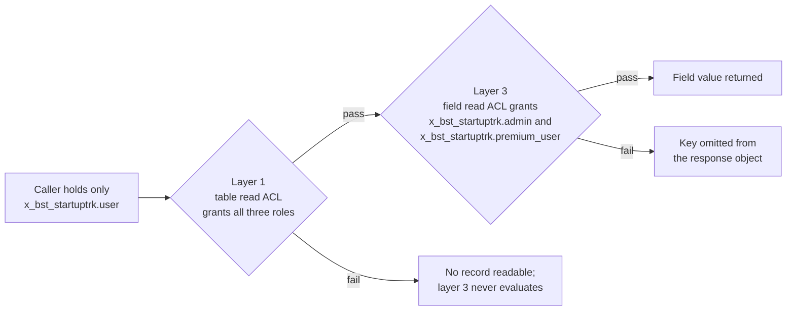

# Access control — `x_bst_startuptrk`

This document is the authorization reference for the ServiceNow scoped application `x_bst_startuptrk`. It states the three roles the application declares, the scope-level table access posture beneath them, the five layers of access-control records that enforce them, the role-by-field matrix over the seven premium-gated fields, the enforcement rules every calling surface must honour, and the procedure by which the scheme is verified. Every access-control record is enumerated individually: by table, by operation, by field where one applies, and by the roles joined to it.

**Authority.** The frozen prompt and the Agent Action Plan are authoritative for all application content, and they govern the Update Set XML and this document alike. The Update Set XML at [`../update-set/x_bst_startuptrk_boston_startup_tracker_update_set.xml`](../update-set/x_bst_startuptrk_boston_startup_tracker_update_set.xml) is the implementation of that specification and the transcription source for everything below: the three `sys_user_role` records, the 49 `sys_security_acl` records and the 74 `sys_security_acl_role` join records it carries. Where this document and those records disagree about a role name, an ACL name, an operation, a field or a joined role, the records are checked against the prompt and the plan first. Where the records match the specification, this document is corrected to them. Where the records depart from it, the records are corrected.

The table names, column names and premium markers used below are the ones established in [`./data-model.md`](./data-model.md). The seven fields marked **P** there are the seven fields gated here, and the two documents carry the same seven names.

This document carries no rationale. Every decision behind this scheme, every alternative considered and every risk it carries is recorded in [`../../docs/decisions/DECISION_LOG.md`](../../docs/decisions/DECISION_LOG.md), which is to be the single source of truth for "why".

## Referenced documents

This document is self-contained. The three roles, the five ACL layers, every ACL and role join, the role-by-field matrix, the enforcement rules and the verification procedure are stated here in full; no statement of the scheme requires reading another file.

**Every document named below is delivered and readable.** Each link resolves to a file in this package, among them the Update Set XML, `./data-model.md`, `./api-reference.md`, `./validation-gates.md` and `../sample-data/README.md`, so a reader can follow any link and read the content the statement around it describes; no link is a forward reference to something still to be written.

**Reviewer.** This document is the artifact validated by the **Security** reviewer entry in [`../../docs/review/CRITICAL_DECISIONS.md`](../../docs/review/CRITICAL_DECISIONS.md). That reviewer must check one thing above all others: that all twenty-one field-by-role assertions run under impersonated users each holding exactly one scoped role and none of the elevated platform roles. That requirement is stated in full under [Verification procedure](#verification-procedure).

## The three roles

The application declares three roles. Their names are fully qualified and dotted; no underscore form exists.

| Role | Purpose | Capability |
| --- | --- | --- |
| `x_bst_startuptrk.admin` | Administers the application: maintains records on every table, loads the staging dataset and inspects the rate-limit counters. | Read, write, create and delete on all seven entity tables and on all three supporting tables; reads all seven premium fields; the only role joined to any access control on `x_bst_startuptrk_ingest_staging` or `x_bst_startuptrk_rate_limit_counter`, for read, write, create and delete alike; the only role permitted to execute a create, update or delete REST operation. |
| `x_bst_startuptrk.premium_user` | Entitled consumer of the full dataset over the portal and the REST API. | Read-only on all seven entity tables; reads all seven premium fields; may execute the 13 read REST operations. |
| `x_bst_startuptrk.user` | Base consumer of the non-premium dataset over the portal and the REST API. | Read-only on all seven entity tables; **denied** on all seven premium fields; may execute the 13 read REST operations. |

Both non-administrative roles are **read-only**. Neither `x_bst_startuptrk.premium_user` nor `x_bst_startuptrk.user` is joined to any write, create or delete ACL on any table in the application, so neither can insert, modify or remove a record on any surface. The single role that can mutate data is `x_bst_startuptrk.admin`.

The three roles are granted on platform `sys_user` records. **This application declares no custom identity table.** There is no user table, no credential column and no session record inside the `x_bst_startuptrk` scope; identity, authentication and role membership are all platform concerns, and the application reads the caller's effective roles from the platform.

`sys_user` sits **outside** the `x_bst_startuptrk` scope. The application creates no user records and grants no roles as part of the Update Set: the delivered XML contains three `sys_user_role` definitions and zero `sys_user_has_role` assignments. Granting a role to a person is an administrative act performed on the instance after the Update Set commits. The three purpose-built users the field-ACL assertions require are created by Automated Test Framework setup steps at run time, and their required role membership is specified under [Verification procedure](#verification-procedure) below. The setup steps themselves are specified in [`./manual-build/05-atf-test-suites.md`](./manual-build/05-atf-test-suites.md). Both points are recorded in [`../../docs/decisions/DECISION_LOG.md`](../../docs/decisions/DECISION_LOG.md).

## The table access posture

Before any access control is evaluated, the platform decides whether a caller's **scope** may touch the table at all. **The ten application tables do not share one posture.** The seven entity tables are reachable and the three supporting tables are sealed, and the difference is deliberate.

**The seven entity tables** — `x_bst_startuptrk_startup`, `_founder`, `_executive`, `_investor`, `_fundinground`, `_jobposting` and `_newsarticle`:

| `sys_db_object` field | Delivered value | Effect |
| --- | --- | --- |
| `access` | `public` | The table is addressable from another application scope, and from the platform Table API, subject to the access controls below. |
| `read_access` | `true` | A cross-scope **read** is permitted to reach the access-control evaluation. It is the record access controls of layers 1 and 3, not the scope switch, that decide the outcome. |
| `ws_access` | `true` | The table **is** served by the platform Table API at `/api/now/table/<table>`, again subject to the same access controls. |
| `create_access`, `update_access`, `delete_access` | `false` | No cross-scope write of any kind. The application's own write path is layer 2, which grants the administrator role only. |
| `alter_access`, `configuration_access`, `client_scripts_access`, `actions_access` | `false` | Cross-scope schema changes, configuration, client scripts and actions are denied. |

**The three supporting tables** — `x_bst_startuptrk_m2m_round_investor`, `x_bst_startuptrk_ingest_staging` and `x_bst_startuptrk_rate_limit_counter`:

| `sys_db_object` field | Delivered value | Effect |
| --- | --- | --- |
| `access` | `package_private` | Reachable from the `x_bst_startuptrk` scope only. A script in the Global scope or in any other scoped application cannot read, write or alter it, whatever roles its caller holds. |
| `read_access`, `create_access`, `update_access`, `delete_access` | `false` | Every cross-scope record operation is denied, so the posture is explicit and survives a later change of `access`. |
| `alter_access`, `configuration_access`, `client_scripts_access`, `actions_access` | `false` | Denied. |
| `ws_access` | `false` | **Not** served by the platform Table API. |

**Why the entity tables are open and the supporting tables are not.** Enforcement for the entity tables lives in the access controls, not in the scope switch: exposure over the Table API is governed by the very same layer-1 table read control and layer-3 field read controls that govern the Scripted REST API, so a base-role caller reading `x_bst_startuptrk_startup` over `/api/now/table/` is denied `total_funding_usd` exactly as it is denied it over `/api/x_bst_startuptrk/v1/startups`. That is what makes a post-commit gate that reads the application's own tables a **test of the access-control design** rather than a test of a blocking switch. The three supporting tables carry no premium field and serve no caller: the join table is read through `InvestorPortfolioService`, and the staging and counter tables are internal machinery, so nothing outside the scope has any business addressing them and they are sealed.

**What the open posture does *not* concede.** Cross-scope and Table API **writes** are refused on every one of the ten tables, so no route bypasses layer 2's administrator-only grant. And the entity tables' exposure is not a second route that skips the per-field gate: the field-level read controls of layer 3 are evaluated on the Table API path too, which is precisely the property the seven table gates in [`./validation-gates.md`](./validation-gates.md) exercise. What the Table API path does skip is the application's own rate limiter, which is application-level accounting on the Scripted REST API rather than an access control — recorded as such in [`./api-reference.md`](./api-reference.md).

**Two controls in this document govern the application's own endpoint and not the Table API route**, and that is stated here so no reader over-reads the matrix: the two `REST_Endpoint` execution controls of layer 5 and the in-script role guard apply to the Scripted REST API. On the Table API route their work is done by the **table-level read controls**, which admit only the three scoped roles — so "only the three application roles may read this data" holds on both routes. The application's fixed-window rate limiter likewise governs its own endpoint only; the compensating operator-owned control for the Table API route is stated in [`./gaps-and-flags.md`](./gaps-and-flags.md).
**Why the three supporting tables stay sealed.** Unsecured server-side record access does not consult access controls, so a table left `public` can be read row by row by a script in another scope with no control evaluated at all. That is tolerable on the entity tables, whose contents the three scoped roles are entitled to read under the matrix below, and it is not tolerable on `x_bst_startuptrk_ingest_staging`, which holds verbatim upstream payloads and unvalidated personal data, nor on the m2m and rate-limit tables, which are internal machinery. Those three are `package_private` with every capability flag `false`.
The consequence for deployment is that the eleven required post-commit gates are exactly the reads AAP section 0.11.2 specifies — one authenticated `sysparm_limit=1` request per entity table. [`./validation-gates.md`](./validation-gates.md) carries them, and records the posture itself as the non-normative diagnostics `GATE-SEC-01` and `GATE-SEC-02`. The posture decision and its residual risks are recorded in [`../../docs/decisions/DECISION_LOG.md`](../../docs/decisions/DECISION_LOG.md).

## The five layers

Forty-nine `sys_security_acl` records enforce the scheme, distributed across five layers, with 74 `sys_security_acl_role` records joining roles to them. Forty-seven are of type `record` and two are of type `REST_Endpoint`; every one is active and carries `admin_overrides` true — the consequence of that last attribute is stated under [Verification procedure](#verification-procedure).

### Layer 1 — table-level read, 7 ACLs

One read ACL per entity table, each joined to **all three** roles. A table-level ACL's name is the table name; the operation distinguishes one ACL from another on the same table.

| # | ACL name | Operation | Roles joined | Joins |
| --- | --- | --- | --- | --- |
| 1 | `x_bst_startuptrk_startup` | `read` | `x_bst_startuptrk.admin`, `x_bst_startuptrk.premium_user`, `x_bst_startuptrk.user` | 3 |
| 2 | `x_bst_startuptrk_founder` | `read` | `x_bst_startuptrk.admin`, `x_bst_startuptrk.premium_user`, `x_bst_startuptrk.user` | 3 |
| 3 | `x_bst_startuptrk_executive` | `read` | `x_bst_startuptrk.admin`, `x_bst_startuptrk.premium_user`, `x_bst_startuptrk.user` | 3 |
| 4 | `x_bst_startuptrk_investor` | `read` | `x_bst_startuptrk.admin`, `x_bst_startuptrk.premium_user`, `x_bst_startuptrk.user` | 3 |
| 5 | `x_bst_startuptrk_fundinground` | `read` | `x_bst_startuptrk.admin`, `x_bst_startuptrk.premium_user`, `x_bst_startuptrk.user` | 3 |
| 6 | `x_bst_startuptrk_jobposting` | `read` | `x_bst_startuptrk.admin`, `x_bst_startuptrk.premium_user`, `x_bst_startuptrk.user` | 3 |
| 7 | `x_bst_startuptrk_newsarticle` | `read` | `x_bst_startuptrk.admin`, `x_bst_startuptrk.premium_user`, `x_bst_startuptrk.user` | 3 |

7 ACLs, 7 × 3 = 21 role joins.

Operational consequence: without these seven ACLs nothing on the seven tables is readable by any role, and the field-level ACLs of layer 3 never evaluate at all.

### Layer 2 — table-level write, create and delete, 21 ACLs

Three operations across seven entity tables. Each of the 21 ACLs is joined to `x_bst_startuptrk.admin` and to no other role. Every cell below is one ACL, identified by its table name and its operation, and names the single role joined to it.

| # | Table | `write` ACL grants | `create` ACL grants | `delete` ACL grants |
| --- | --- | --- | --- | --- |
| 1 | `x_bst_startuptrk_startup` | `x_bst_startuptrk.admin` | `x_bst_startuptrk.admin` | `x_bst_startuptrk.admin` |
| 2 | `x_bst_startuptrk_founder` | `x_bst_startuptrk.admin` | `x_bst_startuptrk.admin` | `x_bst_startuptrk.admin` |
| 3 | `x_bst_startuptrk_executive` | `x_bst_startuptrk.admin` | `x_bst_startuptrk.admin` | `x_bst_startuptrk.admin` |
| 4 | `x_bst_startuptrk_investor` | `x_bst_startuptrk.admin` | `x_bst_startuptrk.admin` | `x_bst_startuptrk.admin` |
| 5 | `x_bst_startuptrk_fundinground` | `x_bst_startuptrk.admin` | `x_bst_startuptrk.admin` | `x_bst_startuptrk.admin` |
| 6 | `x_bst_startuptrk_jobposting` | `x_bst_startuptrk.admin` | `x_bst_startuptrk.admin` | `x_bst_startuptrk.admin` |
| 7 | `x_bst_startuptrk_newsarticle` | `x_bst_startuptrk.admin` | `x_bst_startuptrk.admin` | `x_bst_startuptrk.admin` |

7 tables × 3 operations = 21 ACLs, each with exactly one role join, so 21 role joins.

Operational consequence: a caller holding only `x_bst_startuptrk.premium_user` or only `x_bst_startuptrk.user` is denied every mutation on every entity table, over the REST API and over the portal alike.

### Layer 3 — field-level read, 7 ACLs

This layer is the enforcement point for the seven premium-gated fields. A field-level ACL is named in the platform's `table.field` form, and each of the seven is joined to `x_bst_startuptrk.admin` and `x_bst_startuptrk.premium_user` only.

| # | Table | Field | ACL name | Operation | Roles joined | Joins |
| --- | --- | --- | --- | --- | --- | --- |
| 1 | `x_bst_startuptrk_startup` | `total_funding_usd` | `x_bst_startuptrk_startup.total_funding_usd` | `read` | `x_bst_startuptrk.admin`, `x_bst_startuptrk.premium_user` | 2 |
| 2 | `x_bst_startuptrk_startup` | `institutional_funding_last_5yrs` | `x_bst_startuptrk_startup.institutional_funding_last_5yrs` | `read` | `x_bst_startuptrk.admin`, `x_bst_startuptrk.premium_user` | 2 |
| 3 | `x_bst_startuptrk_founder` | `contact_email` | `x_bst_startuptrk_founder.contact_email` | `read` | `x_bst_startuptrk.admin`, `x_bst_startuptrk.premium_user` | 2 |
| 4 | `x_bst_startuptrk_executive` | `contact_email` | `x_bst_startuptrk_executive.contact_email` | `read` | `x_bst_startuptrk.admin`, `x_bst_startuptrk.premium_user` | 2 |
| 5 | `x_bst_startuptrk_investor` | `aum_usd` | `x_bst_startuptrk_investor.aum_usd` | `read` | `x_bst_startuptrk.admin`, `x_bst_startuptrk.premium_user` | 2 |
| 6 | `x_bst_startuptrk_fundinground` | `amount_usd` | `x_bst_startuptrk_fundinground.amount_usd` | `read` | `x_bst_startuptrk.admin`, `x_bst_startuptrk.premium_user` | 2 |
| 7 | `x_bst_startuptrk_fundinground` | `valuation_usd` | `x_bst_startuptrk_fundinground.valuation_usd` | `read` | `x_bst_startuptrk.admin`, `x_bst_startuptrk.premium_user` | 2 |

7 ACLs, 7 × 2 = 14 role joins. These are exactly the seven fields marked **P** in [`./data-model.md`](./data-model.md); there is no eighth gated field. Two of the seven sit on `x_bst_startuptrk_startup`, two on `x_bst_startuptrk_fundinground`, and one each on `x_bst_startuptrk_founder`, `x_bst_startuptrk_executive` and `x_bst_startuptrk_investor`. `contact_email` is gated on two different tables and is a distinct ACL on each.

No write, create or delete ACL is declared at field level. Mutation is governed entirely by the table-level ACLs of layer 2, which grant `x_bst_startuptrk.admin` alone.

Operational consequence: without these seven ACLs every premium field is readable by every role, because evaluation falls back to the table-level read grant of layer 1.

### Layer 4 — supporting tables, 12 ACLs

Three supporting tables. `x_bst_startuptrk_m2m_round_investor` is readable by all three roles so that the participating investors of a funding round render on the funding-round view and in the REST response. `x_bst_startuptrk_ingest_staging` and `x_bst_startuptrk_rate_limit_counter` are reachable by `x_bst_startuptrk.admin` only, and by that role for every one of the four operations.

| # | ACL name | Operation | Roles joined | Joins |
| --- | --- | --- | --- | --- |
| 1 | `x_bst_startuptrk_m2m_round_investor` | `read` | `x_bst_startuptrk.admin`, `x_bst_startuptrk.premium_user`, `x_bst_startuptrk.user` | 3 |
| 2 | `x_bst_startuptrk_m2m_round_investor` | `write` | `x_bst_startuptrk.admin` | 1 |
| 3 | `x_bst_startuptrk_m2m_round_investor` | `create` | `x_bst_startuptrk.admin` | 1 |
| 4 | `x_bst_startuptrk_m2m_round_investor` | `delete` | `x_bst_startuptrk.admin` | 1 |
| 5 | `x_bst_startuptrk_ingest_staging` | `read` | `x_bst_startuptrk.admin` | 1 |
| 6 | `x_bst_startuptrk_ingest_staging` | `write` | `x_bst_startuptrk.admin` | 1 |
| 7 | `x_bst_startuptrk_ingest_staging` | `create` | `x_bst_startuptrk.admin` | 1 |
| 8 | `x_bst_startuptrk_ingest_staging` | `delete` | `x_bst_startuptrk.admin` | 1 |
| 9 | `x_bst_startuptrk_rate_limit_counter` | `read` | `x_bst_startuptrk.admin` | 1 |
| 10 | `x_bst_startuptrk_rate_limit_counter` | `write` | `x_bst_startuptrk.admin` | 1 |
| 11 | `x_bst_startuptrk_rate_limit_counter` | `create` | `x_bst_startuptrk.admin` | 1 |
| 12 | `x_bst_startuptrk_rate_limit_counter` | `delete` | `x_bst_startuptrk.admin` | 1 |

12 ACLs, 3 + 1 + 1 + 1 + (1 + 1 + 1 + 1) + (1 + 1 + 1 + 1) = 14 role joins.

Every one of the three supporting tables carries the **complete** set of four operations: `read`, `write`, `create` and `delete`. The four `x_bst_startuptrk_m2m_round_investor` controls mirror the entity-table pattern — read for all three roles, mutation for `x_bst_startuptrk.admin` only. `x_bst_startuptrk_ingest_staging` and `x_bst_startuptrk_rate_limit_counter` grant all four operations to `x_bst_startuptrk.admin` and to no other role.

The `create` and `delete` controls on the two internal tables are stated explicitly rather than left to the instance's default-deny behaviour. An operation with no matching access control is denied only while the instance property that governs the default remains set that way; a shipped application must not depend on an instance-global setting it does not own, because the same Update Set may be imported onto an instance configured differently. Default-deny remains as defence in depth beneath these twelve controls, not as the only thing standing between a caller and the staging table.

No premium field exists on any of the three supporting tables, so layer 3 does not extend to them.

The `write` grant on `x_bst_startuptrk_m2m_round_investor` lets an administrator **re-point** an existing link row, not only create or delete one. The **Recalculate investor portfolio on round investor link** business rule is update-aware: it fires on insert, update and delete, and on an update it recalculates the `portfolio_count` of both the previous and the new `investor` and refreshes the derived `participating_investors` projection on both the previous and the new `funding_round`. The derivation and its triggers are in [`./data-model.md`](./data-model.md).

### Layer 5 — REST endpoint execution, 2 ACLs

Two `REST_Endpoint` access controls, both with operation `execute`, govern who may invoke the Scripted REST API at all. Layers 1 to 4 decide what a caller may see once an operation runs; layer 5 decides whether the operation runs.

| # | ACL name | Type | Operation | Roles joined | Joins |
| --- | --- | --- | --- | --- | --- |
| 1 | `Boston Startup Tracker API read` | `REST_Endpoint` | `execute` | `x_bst_startuptrk.admin`, `x_bst_startuptrk.premium_user`, `x_bst_startuptrk.user` | 3 |
| 2 | `Boston Startup Tracker API write` | `REST_Endpoint` | `execute` | `x_bst_startuptrk.admin` | 1 |

2 ACLs, 3 + 1 = 4 role joins.

They are bound to the API by the `enforce_acl` list field, which holds access-control identifiers:

| Bound on | Record count | Bound control |
| --- | --- | --- |
| `sys_ws_definition` "Boston Startup Tracker API" | 1 | `Boston Startup Tracker API read` |
| `sys_ws_operation` records with `http_method` `GET` | 13 | `Boston Startup Tracker API read` |
| `sys_ws_operation` records with `http_method` `POST`, `PUT` or `DELETE` | 18 | `Boston Startup Tracker API write` |

The definition-level binding applies the read control to every call, and the operation-level binding then applies the appropriate control, so a mutation requires both. `x_bst_startuptrk.admin` satisfies the read control as well, since it is one of the three roles joined to it.

Without layer 5 a newly created Scripted REST API falls back to the platform's own default REST access control. That default denies the external-user role but is **not** a scoped-role control: any authenticated internal user satisfies it. Layer 5 is what makes "only the three application roles may call this API" true rather than assumed.

Layer 5 is reinforced in code so that enforcement does not depend on platform access-control evaluation alone. Every one of the 31 operation scripts calls a shared guard immediately after the rate limiter: `RestResponseBuilder.rejectUnauthorisedRead()` on the 13 read operations, which refuses a caller holding none of the three roles with `HTTP 403` and body `{"error": "Caller holds no Boston Startup Tracker role"}`; and `RestResponseBuilder.rejectUnauthorisedWrite()` on the 18 mutations, which refuses a caller without `x_bst_startuptrk.admin` with `HTTP 403` and body `{"error": "Caller holds no Boston Startup Tracker administrator role"}`. The declarative control and the coded guard express the same rule, so the two cannot disagree.

Both controls are confirmed by inspecting the two `sys_security_acl` records of type `REST_Endpoint` in the delivered Update Set; no post-commit gate reads them.

### The evaluation chain

A read of a premium field succeeds only if **both** the table-level read ACL of layer 1 and the field-level read ACL of layer 3 grant the caller. The platform matches ACLs most-specific-first — a table-and-field rule outranks a table-wide rule, which outranks a global rule — and a pass is required at each level in the chain, not merely at the most specific one.

**Both layers are therefore mandatory.** Layer 1 without layer 3 leaves every premium field readable by every role. Layer 3 without layer 1 leaves no record readable at all, and the field-level rules never evaluate.

A non-premium column has no field-level ACL, so its read is decided by layer 1 alone and it is readable by all three roles.

### Roll-up

| Layer | Scope | `sys_security_acl` | `sys_security_acl_role` |
| --- | --- | --- | --- |
| 1 | Table-level read, 7 entity tables | 7 | 21 |
| 2 | Table-level write, create and delete, 7 entity tables | 21 | 21 |
| 3 | Field-level read, 7 premium fields | 7 | 14 |
| 4 | Supporting tables, all four operations on each of the 3 | 12 | 14 |
| 5 | REST endpoint execution | 2 | 4 |
| | **Total** | **49** | **74** |

ACL arithmetic: 7 + 21 + 7 + 12 + 2 = 49, of which 47 are type `record` and 2 are type `REST_Endpoint`.

Role-join arithmetic: 21 + 21 + 14 + 14 + 4 = 74.

Every one of the 49 access controls carries at least one role join, and every join resolves to one of the three `sys_user_role` records. The counts above are the counts in [`../update-set/x_bst_startuptrk_boston_startup_tracker_update_set.xml`](../update-set/x_bst_startuptrk_boston_startup_tracker_update_set.xml).

## The premium field matrix

Seven premium-gated fields across three roles. Twenty-one cells, all populated.

| # | Premium field | `x_bst_startuptrk.admin` | `x_bst_startuptrk.premium_user` | `x_bst_startuptrk.user` |
| --- | --- | --- | --- | --- |
| 1 | `x_bst_startuptrk_startup.total_funding_usd` | Read | Read | **Denied** |
| 2 | `x_bst_startuptrk_startup.institutional_funding_last_5yrs` | Read | Read | **Denied** |
| 3 | `x_bst_startuptrk_founder.contact_email` | Read | Read | **Denied** |
| 4 | `x_bst_startuptrk_executive.contact_email` | Read | Read | **Denied** |
| 5 | `x_bst_startuptrk_investor.aum_usd` | Read | Read | **Denied** |
| 6 | `x_bst_startuptrk_fundinground.amount_usd` | Read | Read | **Denied** |
| 7 | `x_bst_startuptrk_fundinground.valuation_usd` | Read | Read | **Denied** |

`x_bst_startuptrk.admin` reads all seven. `x_bst_startuptrk.premium_user` reads all seven. `x_bst_startuptrk.user` is denied all seven. 7 fields × 3 roles = 21 outcomes.

This matrix is the specification for the 21 Automated Test Framework field-ACL tests: one test per cell, asserting that cell's outcome. The suite and its run-time user creation are built per [`./manual-build/05-atf-test-suites.md`](./manual-build/05-atf-test-suites.md), and the pass condition is prompt section 10.0 criterion 2, whose evidence is collected by section 2b of [`./validation-checklist.md`](./validation-checklist.md). The **metadata** half of the same fact — that all seven controls committed **with their role joins** — is confirmed by inspecting `sys_security_acl_role` for the seven field controls: exactly 14 join records, naming only `x_bst_startuptrk.admin` and `x_bst_startuptrk.premium_user`. That inspection is part of the criterion-2 evidence in [`./validation-checklist.md`](./validation-checklist.md) rather than a post-commit gate. A missing join is not a partial denial: the platform falls back to the table-level read grant and the field becomes readable by the base role.

### The role difference is at field level only

The other 46 columns across the seven entity tables carry no field-level ACL and are readable by all three roles under the layer-1 grant: 53 columns in total, of which 7 are gated, leaving 46 ungated. The twelve columns of `x_bst_startuptrk_startup` reduce to ten ungated, and the child tables are ungated apart from `contact_email` on `x_bst_startuptrk_founder` and `x_bst_startuptrk_executive`, `aum_usd` on `x_bst_startuptrk_investor`, and `amount_usd` and `valuation_usd` on `x_bst_startuptrk_fundinground`. Column counts are in [`./data-model.md`](./data-model.md).

No record-level restriction exists on any of the seven entity tables. Every role that can read a table can read every row of it, and the role difference is confined to field level.

**Invariant.** Record-level visibility is identical for `x_bst_startuptrk.admin`, `x_bst_startuptrk.premium_user` and `x_bst_startuptrk.user`, so every role that can read a table sees the same rows.

**`total_count` depends on that invariant, and the dependency is load-bearing.** `RestResponseBuilder.countState()` first calls `hasAnyAppRole()`, which is three `gs.hasRole()` tests against `x_bst_startuptrk.admin`, `x_bst_startuptrk.premium_user` and `x_bst_startuptrk.user`; a caller holding none of the three is answered `403` through `rejectDeniedCount()` rather than `200` with a total of zero. Having established that the caller holds a role the layer-1 read control grants, it then takes a single `GlideAggregate` `COUNT` over the same conditions the result set applies. That yields an **exact** total at any magnitude, in one database operation, with no ceiling and therefore no truncation — which is what the pagination contract in [`./api-reference.md`](./api-reference.md) requires.

**Why the gate is a role test and not a secured-read probe.** An earlier form of this check opened a `GlideRecordSecure` on the table and called `canRead()` before counting. That is not a supported way to ask whether a caller may read a table: `canRead()` on a secured record answers for the **record the object is currently positioned on**, so on an un-queried, unpositioned object its answer is not a table-level right and is not guaranteed to be meaningful. A gate whose answer is inconclusive is worse than no gate, because it reads as one. The role test is exact, needs no query, and is correct **because** of the closed-role invariant stated immediately above: layer 1 grants table read to all three roles and to no other role, so "holds one of the three roles" and "may read this table" are the same statement. If a future change removes a role from a layer-1 grant, or adds a record-level restriction, this gate must be revisited together with the aggregate count — both are recorded as consequences of the same invariant.

An aggregate does not evaluate row-level access, and it does not need to **while this invariant holds**: every role that can read the table can read every row, so the aggregate count and a per-caller count are the same number. **The moment a record-level restriction is added to any of the seven entity tables, that stops being true** — the aggregate would over-report for a restricted caller — and `countState()` would have to be replaced by a secured count, accepting either an iteration cost proportional to the row count or a ceiling that makes the total a floor. Nothing else in the API changes; the contract does. This is recorded here, in [`./api-reference.md`](./api-reference.md) and in [`../../docs/decisions/DECISION_LOG.md`](../../docs/decisions/DECISION_LOG.md) so that a future access-control change cannot break the pagination contract silently.

The inclusion criteria are a **query filter and not an access control**, so they do not bear on this invariant — but they must be applied identically to the result set and to the count, or `total_count` disagrees with the page contents. One query plan is handed to both, which is what makes that true by construction.

## Enforcement rules

These rules are normative. They bind the Scripted REST operations, the Script Includes and the Service Portal widget server scripts equally, so the API and the portal cannot disagree about what a role may see.

### Secured read path

Every caller-facing read must use the secured record-access path, `GlideRecordSecure`, and never the unsecured `GlideRecord`. Ordinary record access does not guarantee access-control enforcement on server-side reads; the secured variant does. **All 31 REST operations read through it, and no REST operation opens an unsecured `GlideRecord` at all.** Every widget server script must do the same.

**Thirty of the 31 open the secured record themselves; one reaches it through a delegate, and an audit needs to know which.** `Startup list` constructs no record of its own: it builds a query plan and hands it to `StartupSearchService`, which opens the `GlideRecordSecure` over `x_bst_startuptrk_startup` and returns the rows. The read is secured either way — that Script Include is the single builder of the startup query for both the `/startups` list operation and the portal search widget, which is what keeps the inclusion criteria identical on the two surfaces — but a reviewer who audits this rule by searching each operation script for the class name will find 30 matches and one operation with none. That one is `Startup list`, and it is compliant. Audit it by following the delegate:

| What to search | Expected result |
| --- | --- |
| `GlideRecordSecure` in each of the 31 operation scripts | 30 operations match; `Startup list` does not |
| `new GlideRecord(` in each of the 31 operation scripts | **No operation matches.** A single match is a defect |
| `GlideRecordSecure` in `StartupSearchService` | Matches, in `search()` — the read `Startup list` delegates to |

Four server-side maintenance paths read through the unsecured `GlideRecord`, and this is the complete and closed list:
Five server-side paths read through the unsecured `GlideRecord` or through `GlideAggregate`, and this is the complete and closed list:

| # | Path | Reads | Returns record data to a caller |
| --- | --- | --- | --- |
| 1 | `RateLimitService` | `x_bst_startuptrk_rate_limit_counter`, administrator-only | No — only a boolean decision and a retry interval |
| 2 | `InvestorPortfolioService` | `x_bst_startuptrk_fundinground` and the m2m table, to derive `portfolio_count` and to answer `participantsForRounds()` | No — the derived integer, which is then stored, and investor references the caller then reads through the secured path |
| 3 | `IngestionMapper` | the staging table and the entity tables it writes | No — it runs inside a flow, not a request |
| 4 | the business rules that recalculate a portfolio count | as `InvestorPortfolioService` | No |
| 5 | `RestResponseBuilder.countState()` and `countWith()` | a `GlideAggregate` `COUNT` over the table under test, **only after** the `hasAnyAppRole()` gate has passed | No — a row count and nothing else. **No field value, no `sys_id` and no record is returned from the aggregate.** |

None of the five returns a field value to a caller, and none reads a premium field on a caller's behalf. Any new unsecured read outside this list is a defect.

**Counting is bounded by a narrower rule, not by a blanket prohibition.** The rule is:

> **An aggregate query may produce a caller-facing value only when that value depends on no field the caller can be denied, and the table it reads carries no record-level access control.**

A blanket "no aggregate may produce a caller-facing value" would be the wrong rule here, and stating it would be worse than useless: it is not what the requirements impose, it cannot be satisfied without turning every count into a per-row scan, and a reader who believed it would have no way to tell a legitimate count from a leak. The two conditions above are what actually make an aggregate safe, and they are checkable.

Both hold for every count this application returns. A count depends on no field value — only on which rows match — and the field-level ACLs of this application deny **fields**, never rows. And no record-level access control exists on any of the eight tables a caller-facing count reads, so the row set an aggregate sees is exactly the row set the caller may read.

`RestResponseBuilder.countState()`, `countWith()` and `countByGroup()` are therefore the three aggregate paths that legitimately produce caller-facing values: the `total_count` of every list response, and the grouped counts behind the dashboard charts. Each opens the table through `GlideRecordSecure` and answers zero before aggregating if the caller fails the table-level read check, so a caller who may not read the table learns nothing about its size.

The remaining aggregate queries are maintenance and derivation counts inside paths 1, 2 and 5 of the table above — the rate-limit window counts in `RateLimitService` and the distinct-startup counts behind `portfolio_count` in `InvestorPortfolioService`. Neither returns record data to a caller and neither reads a premium field.
**Counting is the fifth path, and its access gate is what makes it permissible.** `total_count` is one `GlideAggregate` `COUNT`, taken **behind** a `hasAnyAppRole()` check: a caller holding none of the three scoped roles is answered `403`, not a number. An aggregate does not evaluate row-level access, and it does not need to, because record-level visibility is identical for all three roles — the invariant recorded under [The role difference is at field level only](#the-role-difference-is-at-field-level-only). What an aggregate returns is a count of rows and nothing else, so it cannot leak a field value; what it could leak is the **size** of a set the caller may not read, and the role gate is what closes that. Aggregate queries appear in four places in the delivered Update Set: `RestResponseBuilder.countState()` and `countWith()`, `RateLimitService._countClosed()` and `_observed()` on the administrator-only counter table, and `InvestorPortfolioService._startupsForInvestor()` deriving `portfolio_count`. **None of them reads a premium field, and none returns record data.**

### Omitted, not nulled

The secured read path returns an **empty string** for a denied field, not an error. Serialising every column of a secured record without a further check therefore produces a response carrying an empty value for a premium field, which is the nulled behaviour the requirements forbid.

To omit, the serialiser tests each field with an element-level read check and **skips the key entirely** when the check fails. `RestResponseBuilder.serialize()` obtains the element with `getElement()`, evaluates `canRead()` on it, and continues past the field without assigning a key when the evaluation is false. A denied premium field is consequently **absent from** the response object; the key does not appear with a null, an empty string or a placeholder.

This gate lives exactly once, in the `RestResponseBuilder` Script Include, and is used by all 31 REST operations. Every widget server script must use it too. A response object built by any other means is not permitted. The absence of the key, in place of a present-and-null key, is the one point at which this document records something other than a literal reading of a field being "hidden"; that reading is recorded at `D-025` in [`../../docs/decisions/DECISION_LOG.md`](../../docs/decisions/DECISION_LOG.md).

### No bypass

No Script Include in this application is client-callable, and none runs with elevated privilege: all eight — `AppProperties`, `RestQueryHelper`, `RestResponseBuilder`, `RateLimitService`, `StartupSearchService`, `InvestorPortfolioService`, `IngestionLogger` and `IngestionMapper` — carry `client_callable` false, `mobile_callable` false, `sandbox_callable` false and `package_private` access. Eight is the whole inventory, matching Agent Action Plan section 0.4.5. No Script Include may read a premium field through the unsecured path and return it to a caller.

The forbidden anti-pattern: **a Script Include that reads a premium-gated column with `new GlideRecord()` and hands the value back to a REST operation, a widget or a client script bypasses the field-level ACL entirely, and the ACL will report no denial because it was never consulted.**

### Operation flags

Every Scripted REST operation must require **both** authentication and access-control authorisation, and must name the access control that authorisation consults. All 31 operations carry `requires_authentication` true, `requires_acl_authorization` true, `requires_snc_internal_role` false, and an `enforce_acl` binding to the layer-5 control appropriate to their method. An operation that requires authentication but skips authorisation defeats the whole scheme regardless of how carefully its script is written, because the platform then performs no access-control evaluation for that operation's reads. An operation that requires authorisation but names no control is almost as weak, because evaluation falls back to the platform's default REST control, which any authenticated internal user satisfies.

### Premium denial in the portal

Where a read ACL denies a gated field or a gated tab region, the portal must render the reusable `bst-premium-upsell` widget in that position, and must not render a blank, an empty cell or a zero. The widget must be embedded by the company profile, the investor profile and the account summary; its markup and option schema are specified in [`./manual-build/04-service-portal-pages-and-widgets.md`](./manual-build/04-service-portal-pages-and-widgets.md) and are not restated here.

## Verification procedure

Access controls carry `admin_overrides` true by default, and all 49 in this application carry it. The platform administrator role therefore overrides every one of them, and every operator of a personal developer instance holds that role.

Do not verify this scheme as the instance administrator. A manual walkthrough performed under an account holding the platform administrator role displays all seven premium fields and **appears to prove enforcement that has not been tested at all**. Verification performed that way is worthless and must not be recorded as evidence.

Verify as follows.

1. Create three purpose-built users. Each holds **exactly one** of `x_bst_startuptrk.admin`, `x_bst_startuptrk.premium_user` and `x_bst_startuptrk.user`, and **none** of the elevated platform roles — not the platform `admin` role, not the platform `security_admin` role, not the platform `maint` role. Note that the scoped role `x_bst_startuptrk.admin` and the platform administrator role are different roles; the test user holds the scoped one and not the platform one.
2. Impersonate each user in turn. Do not read the fields as yourself.
3. Assert all twenty-one outcomes, the full cross-product of the seven premium fields by the three roles as tabulated in [The premium field matrix](#the-premium-field-matrix): under `x_bst_startuptrk.admin` every field reads, under `x_bst_startuptrk.premium_user` every field reads, and under `x_bst_startuptrk.user` every field is denied.
4. Spot-check omission against nulling. For a caller holding only `x_bst_startuptrk.user`, confirm the denied field's key is **absent from** the response object — not present with an empty string, and not present with a null.
5. Confirm both layers are load-bearing by reading a non-premium column under `x_bst_startuptrk.user` in the same call. It must return a value, which establishes that the layer-1 grant passed and that the denial came from layer 3.
6. **Assert the denial on the Table API route as well as on the Scripted REST route.** The seven entity tables are delivered `public` with `ws_access` true, so `GET /api/now/table/x_bst_startuptrk_startup` is a second live path to the same rows. Under `x_bst_startuptrk.user`, `total_funding_usd` must be **absent from** every returned record on that path too. It is the same layer-3 control on both routes, so a denial on one and a value on the other would mean the field control did not commit. This assertion is what makes the open posture safe rather than merely intended.
7. **Assert that no write reaches either table over the Table API.** Under `x_bst_startuptrk.premium_user`, a `POST` or `PATCH` to `/api/now/table/x_bst_startuptrk_startup` must be refused: layer 2 grants write, create and delete to `x_bst_startuptrk.admin` alone, and `create_access`, `update_access` and `delete_access` are `false` on the dictionary record.

The three users are created by test setup steps at run time; how they are created and torn down is specified in [`./manual-build/05-atf-test-suites.md`](./manual-build/05-atf-test-suites.md). The pass condition for this procedure is prompt section 10.0 criterion 2, whose evidence record is to be kept in [`./validation-checklist.md`](./validation-checklist.md).

## Legacy provenance

The three roles, the five ACL layers and the seven premium fields are defined by **prompt section 2.0** and by nothing else. The legacy Flask tree under `src/backend/` is read-only historical reference and is **not** a design authority for this scheme: no role definition, ACL, field gate or entitlement rule was taken from it, because none existed to take. This section exists to make the migration traceable in reverse — from each legacy construct to the target artifact that replaced it — and nothing in it may be read as a source of target requirements.

`src/backend/utils/auth.py` performed **authentication only**. The `auth_required` decorator at `src/backend/utils/auth.py:L6-L16` applies `@jwt_required()` and wraps the decorated function in a `try`/`except` that returns `{"error": "Authentication required"}` with status 401 on exception. It performs **no** authorization: it does not read a role, does not compare one and does not deny on one.

Twenty-four of the legacy application's twenty-nine routes are decorated with it: all five routes of each of `src/backend/routes/startup.py`, `investor.py`, `job.py` and `news.py`, and four of the five routes of `user.py`. Five are not: the four routes of `src/backend/routes/auth.py` — `/login` carries no decorator and `/refresh`, `/logout` and `/change-password` carry `@jwt_required` directly — and the user-create route at `src/backend/routes/user.py:L49-L50`, which carries none.

The conclusion holds on every decorated route, which is every data-bearing CRUD route in the application: an authenticated caller of any role reached every field of every record, because the decorator that guarded those routes never consulted a role.

The file records the gap as unfinished work in its own text. `src/backend/utils/auth.py:L36` reads `# TODO: Implement role-based access control`, and `src/backend/utils/auth.py:L42` reads `# TODO: Add additional claims to the token (e.g., user role)`. The access token consequently carried no role claim, so a role check was not merely unwritten — it was not possible.

The three scoped role names are the ones **prompt section 2.0 specifies**: `x_bst_startuptrk.admin`, `x_bst_startuptrk.user` and `x_bst_startuptrk.premium_user`. They are transcribed from that requirement, not derived from the legacy tree.

For reverse traceability only: `src/shared/types.ts:L72-L76` declares `enum UserRole { ADMIN = 'ADMIN', USER = 'USER', PREMIUM_USER = 'PREMIUM_USER' }`, whose three members happen to correspond one-to-one with the three prompt-defined roles. The correspondence is a coincidence of naming and confers no authority: the prompt's names govern. The legacy `User` model, its route and its service are dropped; platform `sys_user` plus the three roles replace them.

| Legacy construct | Target artifact |
| --- | --- |
| `auth_required` decorator, `src/backend/utils/auth.py:L6-L16` | The 49 `sys_security_acl` records and 74 `sys_security_acl_role` joins enumerated in [The five layers](#the-five-layers) |
| `# TODO: Implement role-based access control`, `src/backend/utils/auth.py:L36` | Layers 1 through 5, the [table access posture](#the-table-access-posture), and the [Enforcement rules](#enforcement-rules) |
| `# TODO: Add additional claims to the token (e.g., user role)`, `src/backend/utils/auth.py:L42` | Platform role membership on `sys_user`, read by the ACL engine; no application-issued token claim |
| `UserRole` enum, `src/shared/types.ts:L72-L76` | The 3 prompt-defined `sys_user_role` records `x_bst_startuptrk.admin`, `x_bst_startuptrk.premium_user` and `x_bst_startuptrk.user` — a reverse-traceability correspondence, not a naming source |
| `src/backend/models/user.py` | **No target artifact** — replaced by platform `sys_user` |
| `src/backend/routes/user.py` | **No target artifact** — replaced by platform identity |
| `src/backend/routes/auth.py` | **No target artifact** — replaced by platform authentication |
| `src/backend/services/user_service.py` | **No target artifact** — replaced by platform identity |
| Role tier list, `documentation/Software Requirements Specifications (SRS).md:L77` | The 3 roles; the SRS's "free users" is the `x_bst_startuptrk.user` role, its "premium subscribers" is `x_bst_startuptrk.premium_user`, and its "administrators" is `x_bst_startuptrk.admin` |

This table is the access-control section of the bidirectional matrix at [`../../docs/decisions/TRACEABILITY_MATRIX.md`](../../docs/decisions/TRACEABILITY_MATRIX.md).

## Related documents

- [`../update-set/x_bst_startuptrk_boston_startup_tracker_update_set.xml`](../update-set/x_bst_startuptrk_boston_startup_tracker_update_set.xml) — the authoritative role, ACL and ACL-role records this document transcribes
- [`./data-model.md`](./data-model.md) — the ten tables field by field, and the seven **P** markers this matrix gates
- [`./api-reference.md`](./api-reference.md) — the six REST resources, the pagination envelope carrying `total_count`, and the error bodies
- [`./validation-gates.md`](./validation-gates.md) — the eleven machine-checkable post-commit gates: a Table API read on each of the seven entity tables, one record for each of the three roles, and the scope record
- [`./validation-checklist.md`](./validation-checklist.md) — the five success criteria; criterion 2 is the pass condition for the matrix above
- [`./manual-build/04-service-portal-pages-and-widgets.md`](./manual-build/04-service-portal-pages-and-widgets.md) — the portal build, including the `bst-premium-upsell` widget
- [`./manual-build/05-atf-test-suites.md`](./manual-build/05-atf-test-suites.md) — the 21 field-ACL tests and the run-time creation of the three impersonated users
- [`./gaps-and-flags.md`](./gaps-and-flags.md) — requirements with no clean platform equivalent, including the administrator-override flag
- [`../../docs/decisions/DECISION_LOG.md`](../../docs/decisions/DECISION_LOG.md) — the single source of truth for every decision, alternative and risk behind this scheme
- [`../../docs/decisions/TRACEABILITY_MATRIX.md`](../../docs/decisions/TRACEABILITY_MATRIX.md) — the bidirectional source-to-target matrix this section feeds
- [`../../docs/review/CRITICAL_DECISIONS.md`](../../docs/review/CRITICAL_DECISIONS.md) — the five highest-risk decisions, including the Security reviewer entry for this document
