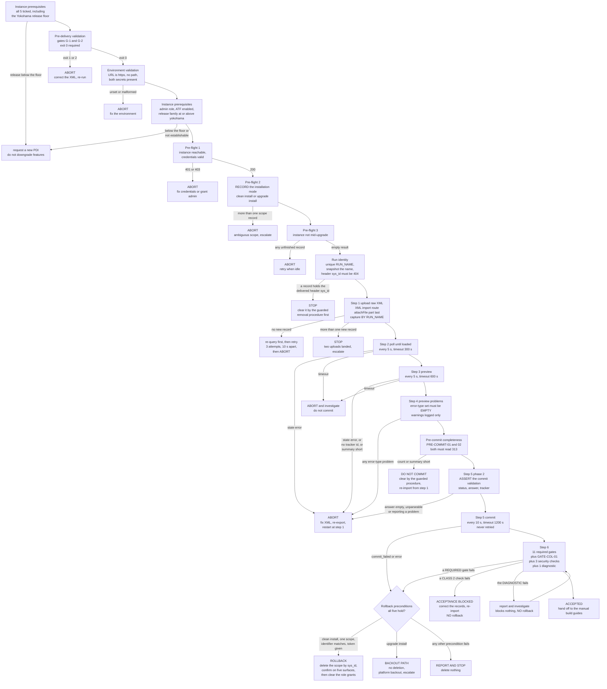

# Deployment runbook — `x_bst_startuptrk`

This runbook takes the delivered Update Set XML at [`../update-set/x_bst_startuptrk_boston_startup_tracker_update_set.xml`](../update-set/x_bst_startuptrk_boston_startup_tracker_update_set.xml) from this repository onto the ServiceNow Personal Developer Instance at `https://dev351809.service-now.com`, installing the scoped application `x_bst_startuptrk` version 1.0.0. It covers the pre-delivery validation run against the file on disk, **three** pre-flight checks against the instance, a six-step import sequence, the eleven post-commit gates, the handoff to the manual build work, the rollback, and a complete failure-handling matrix.

An operator holding the deployment credentials runs this document end to end. Every request shape, poll interval, timeout, abort condition and retry count is stated here. Four files are required alongside it: [`../update-set/x_bst_startuptrk_boston_startup_tracker_update_set.xml`](../update-set/x_bst_startuptrk_boston_startup_tracker_update_set.xml) is the artifact being deployed, [`../scripts/validate_update_set_xml.py`](../scripts/validate_update_set_xml.py) is the pre-delivery validator this runbook runs before the upload, [`./validation-gates.md`](./validation-gates.md) supplies the post-commit assertions of step 6, and [`./manual-build-instructions.md`](./manual-build-instructions.md) supplies the work that follows a successful commit.

## Referenced documents

**Every document named below is delivered and readable.** Each link resolves to a file in this package, including the three files this runbook depends on directly — `../update-set/x_bst_startuptrk_boston_startup_tracker_update_set.xml`, `../scripts/validate_update_set_xml.py` and `./validation-gates.md` — so a reader can follow any link and read the content the statement around it describes; no link is a forward reference to something still to be written.

This document carries procedure only — steps, request shapes, poll intervals, timeouts, assertions, abort conditions and retry counts. Every decision behind that procedure is recorded in [`../../docs/decisions/DECISION_LOG.md`](../../docs/decisions/DECISION_LOG.md), which is the single source of truth for "why".

**Review.** This runbook is the artifact validated by entry 2 of [`../../docs/review/CRITICAL_DECISIONS.md`](../../docs/review/CRITICAL_DECISIONS.md), reviewer persona **DevOps**, risk level **High**. That reviewer checks three things: that the rollback is triggered only by the failure conditions documented under [Rollback](#rollback), that the branch it takes is the one `START_STATE` selects so an installation this run did not create is never deleted, and that the polling intervals and timeouts stated here match the deployment environment's definition.

## Authority and credential handling

The deployment environment is authoritative for the mechanics below. The application-specific identifiers — the scope name, the table names, the role names and the deliverable paths — are this application's.

| Value | Source | Value for the target instance |
| --- | --- | --- |
| `SERVICENOW_INSTANCE_URL` | environment variable, **exported by the operator** | `https://dev351809.service-now.com` |
| `SERVICENOW_USERNAME` | environment secret | supplied by the environment |
| `SERVICENOW_PASSWORD` | environment secret | supplied by the environment |

Export the two operator-set values first, in the shell that runs the whole procedure:

```bash
export SERVICENOW_INSTANCE_URL=https://dev351809.service-now.com
export CLONE_INDEX=000
```

`SERVICENOW_USERNAME` and `SERVICENOW_PASSWORD` are already in the environment and are **never** exported, echoed or written by any step of this runbook.

Authentication is HTTP Basic on every request in this runbook:

```text
Authorization: Basic base64({SERVICENOW_USERNAME}:{SERVICENOW_PASSWORD})
Accept: application/json
```

All three values are read from the environment at the moment of the request. **No credential value is printed, echoed, logged or written down** — not into a terminal transcript, not into the deployment log of this document, not into a defect report, and not into any file of this package. Where a request or a log row needs to name a credential, it names the variable.

Every request below shows only the method, the URL and the headers that differ from the block above. The `Authorization` and `Accept` headers are present on all of them.

### Environment validation — run this first

`SERVICENOW_INSTANCE_URL` is **not** injected by the deployment environment; only the two credential secrets are. It is exported by the operator, and it is validated before any request is issued, because an unset or malformed value produces a request against the wrong host — or against no host — and every diagnostic downstream then describes the wrong problem.

```bash
set -u
export SERVICENOW_INSTANCE_URL="https://dev351809.service-now.com"

fail() { printf 'environment validation failed: %s\n' "$1" >&2; exit 1; }

[ -n "${SERVICENOW_INSTANCE_URL:-}" ] || fail 'SERVICENOW_INSTANCE_URL is unset or empty'
case "$SERVICENOW_INSTANCE_URL" in
  https://*.service-now.com) : ;;
  http://*) fail 'SERVICENOW_INSTANCE_URL must use https, not http' ;;
  # This arm catches a path and a trailing slash alike: the pattern above anchors
  # on the .com ending, so neither form reaches it. There is deliberately no
  # separate trailing-slash arm - it could never be entered. See the note below.
  *) fail 'SERVICENOW_INSTANCE_URL must be https://<instance>.service-now.com with no path or trailing slash' ;;
esac
[ -n "${SERVICENOW_USERNAME:-}" ] || fail 'SERVICENOW_USERNAME is unset or empty'
[ -n "${SERVICENOW_PASSWORD:-}" ] || fail 'SERVICENOW_PASSWORD is unset or empty'

# Report PRESENCE only. Not the value, and not the length: a length narrows a
# brute-force space and buys nothing the boolean does not already give.
printf 'instance %s, user %s, password present: yes (neither value nor length shown)\n' \
  "$SERVICENOW_INSTANCE_URL" "$SERVICENOW_USERNAME"
```

**Four conditions, all of which must hold before pre-flight 1 runs.** The URL is set and non-empty; it is `https` — never `http`, because Basic credentials on a cleartext connection are disclosed on the wire; it names a host with no path and no trailing slash, so every `{SERVICENOW_INSTANCE_URL}/api/...` in this document concatenates correctly; and both credential variables are set and non-empty. **The third condition is enforced by one arm, and that is deliberate.** `https://*.service-now.com` anchors on the `.com` ending, so `https://dev351809.service-now.com/` and `https://dev351809.service-now.com/nav_to.do` both fail to match it and both fall to the catch-all, which names a path and a trailing slash together. A dedicated trailing-slash arm placed after that `case` could never be entered, so **do not add one** — it would read as a live check while testing nothing. **The password is never printed, and neither is its length.** The line above reports a **boolean**: the variable is set and non-empty, or the block has already aborted. A character count is not a value, but it is not nothing either — it removes every candidate of a different length from an offline guessing attack, and it distinguishes one operator's credential from another's in a shared transcript. The boolean carries the whole of the diagnostic information the operator needs, which is why the length is not reported here or anywhere else in this runbook.

**Failure is fatal and is not retried.** A malformed `SERVICENOW_INSTANCE_URL` or a missing secret is an operator configuration error, not a transient condition. Correct the environment and start again from this block.

### Session lifecycle for the three form-based routes

Three requests in this runbook are not Table API calls and cannot use Basic authentication alone: the upload at step 1 and the two processor calls at steps 3 and 5. All three require an authenticated **session cookie** and the session's **CSRF token**, `sysparm_ck`. One session serves all three, and its whole lifecycle is defined here rather than assumed.

```bash
# Create the jar inside the working tree, readable only by this user, and guarantee its removal.
jar="$(mktemp "${PWD}/.sn-session.XXXXXXXX")"
chmod 600 "$jar"
cleanup() { [ -f "$jar" ] && rm -f "$jar"; }
trap cleanup EXIT HUP INT TERM

curl_opts="--silent --show-error --connect-timeout 10 --max-time 120 \
           --cookie-jar $jar --cookie $jar"

# 1. Authenticate. The password is read from STDIN, never placed in argv: the field
#    spelling is user_password@- with no '=' before the '@', which makes curl read the
#    value from stdin and still URL-encode it. printf is a shell built-in and forks no
#    process, so the value appears in no argument list at any point. See
#    "Pass the password on stdin" under step 1 for the verification of this form.
login_status="$(printf '%s' "$SERVICENOW_PASSWORD" |
  curl $curl_opts --output /dev/null --write-out '%{http_code}' \
  --data-urlencode "user_name=${SERVICENOW_USERNAME}" \
  --data-urlencode "user_password@-" \
  --data "sysparm_login_with_sso=false" \
  "${SERVICENOW_INSTANCE_URL}/login.do")"

# 2. Assert the session, not the response. A failed login also answers 200.
grep -q 'glide_user_session\|glide_session_store' "$jar" \
  || { printf 'login did not establish a session (status %s)\n' "$login_status" >&2; exit 1; }

# 3. Read the CSRF token from a page the session is entitled to.
ck="$(curl $curl_opts \
  "${SERVICENOW_INSTANCE_URL}/upload.do?sysparm_referring_url=sys_remote_update_set_list.do&sysparm_target=sys_remote_update_set" \
  | grep -o "sysparm_ck[^0-9a-f]*[0-9a-f]\{32,\}" | grep -o '[0-9a-f]\{32,\}' | head -1)"

# 4. Assert the token before any request depends on it.
[ -n "$ck" ] || { printf 'sysparm_ck was not present in the upload form\n' >&2; exit 1; }
# Presence again, not length. The token is a bearer value for this session.
printf 'session established, CSRF token acquired: yes (neither value nor length shown)\n'
```

**Six rules govern the session, and each of them prevents a specific failure this runbook would otherwise produce.**

| # | Rule | What it prevents |
| --- | --- | --- |
| 1 | **One jar, created with `0600` permissions inside the working tree, used by every authenticated request.** Both `--cookie-jar` and `--cookie` name it, so each response updates it and each request presents it. | A second `curl` invocation without the jar is an **anonymous** request. The platform answers it with the login page and `HTTP 200`, so the step appears to succeed and the sequence proceeds against work that was never done. |
| 2 | **Assert the session from the jar, not from the login status.** `POST /login.do` answers `HTTP 200` for a failed login as readily as for a successful one, because it returns the login page again. | Proceeding with an unauthenticated session and misreading every subsequent `HTTP 200` as success. |
| 3 | **Assert `sysparm_ck` is non-empty before it is used.** | An empty token is submitted as `sysparm_ck=`, which the platform rejects as a CSRF failure — reported as a generic error that reads like a malformed request rather than a missing session. |
| 4 | **Never print the password, the cookie jar's contents or the token — and never their lengths either.** Report **presence** as a boolean, never a value and never a character count, and never `cat` the jar. A session cookie is a bearer credential for the duration of the session: a transcript carrying it is a transcript carrying admin access, and a transcript carrying its length is a transcript that has narrowed the search for it. | Credential disclosure through a shared terminal transcript, a CI log or a defect report. |
| 5 | **Remove the jar on every exit path.** The `trap` covers success, failure and interruption. | A live admin session cookie left on disk after the deployment finishes. |
| 6 | **Re-establish the session, do not reuse a stale one, if any authenticated request answers with the login page.** Sessions expire; the platform's expiry is not this document's to predict. Re-run the block above and reissue the request. | Silent no-ops during the long preview and commit polls, whose elapsed time can exceed the session lifetime. |

The session is required for step 1, step 3 and step 5 only. Every other request in this runbook — every pre-flight, every poll, every gate — is a Table API call authenticated by the `Authorization` header alone and needs no session, no jar and no token.


**Four further rules bind the session.**

- **Never print or copy the jar.** It holds a live session credential. Do not `cat` it, do not include it in the deployment log, and do not pass `-v`, `--trace` or `--trace-ascii` on any request that carries it.
- **Let the trap delete it.** The `trap` above removes the jar on every exit path, so no explicit `rm -f "$jar"` is written at the end of the sequence and none is needed if a step aborts.
- **Re-read `sysparm_ck` after any re-login.** If the session is lost mid-sequence, log in again and read a fresh token; do not reuse the previous one.
- **The Table API reads of steps 2, 4 and 6 and of the pre-flight checks use Basic authentication and need no jar.** They may share it harmlessly, but they do not depend on it.

### Run identity — one unique name per deployment

**The instance is shared.** Other deployments, other agents working in parallel and unrelated applications all create records on it. A step that finds "the most recently created update set named `Boston Startup Tracker 1.0.0`" can therefore capture a record it did not upload, and every subsequent step — the preview, the commit, and above all the rollback — would then act on someone else's work.

Every deployment therefore establishes a **unique run identity** before it uploads anything, and the identity is carried in the update set's `name`:

```bash
# CLONE_INDEX distinguishes parallel workers; the UTC nonce distinguishes successive runs.
: "${CLONE_INDEX:=000}"
RUN_NONCE="$(date -u +%Y%m%dT%H%M%SZ)"
RUN_NAME="Boston Startup Tracker 1.0.0 [run ${CLONE_INDEX}-${RUN_NONCE}]"
printf 'run identity: %s\n' "$RUN_NAME"
```

| Rule | Detail |
| --- | --- |
| **Set the name in the XML before upload.** | The `<name>` element of the single `<sys_remote_update_set>` header record carries `{RUN_NAME}`. Edit that one element in a working copy of the file; do not edit any `<sys_update_xml>` record, and do not edit the delivered file in the repository. |
| **Snapshot before, compare after.** | Before the upload, record the `sys_id` set of every `sys_remote_update_set` record whose `name` is `{RUN_NAME}` — normally empty. After the upload, query the same name again and require **exactly one** record that was not in the snapshot. That record's `sys_id` is `{ruset_sys_id}`. |
| **Never order by creation date to identify the record.** | `ORDERBYDESCsys_created_on` over a shared name returns whichever record was created most recently by anyone. On a shared instance that is a different record from the one this run uploaded, often enough to matter. |
| **Carry `{RUN_NAME}` into every guarded operation.** | The pre-commit cleanup procedure and the rollback both require the record's `name` to equal `{RUN_NAME}` before they delete anything. That equality is the ownership proof. |
| **Record both values in the deployment log.** | `{RUN_NAME}` and `{ruset_sys_id}`, written down before step 2 begins. A deployment that cannot state both does not run the cleanup procedure and does not run the rollback. |
| **Clear the delivered header identifier before uploading.** | The run identity isolates by `name`; **the platform keys the load on the `sys_id` carried inside the file.** Run the check below before step 1 and require its result empty. Renaming the header does not change that identifier, so two clones uploading these bytes collide on it however distinct their names are. |

**The delivered header identifier — a pre-upload check, after the three [pre-flight checks](#pre-flight-checks) and before step 1.**

It runs in that position deliberately. It is a Table API read, so it needs [Pre-flight 1](#pre-flight-1--instance-reachable-and-credentials-valid) to have established that the instance answers with JSON: on a hibernating instance every path returns `HTTP 200` with `text/html`, and this check would read that as neither a `404` nor a record. Pre-flight 1 aborts before it is reached, which is the correct outcome — so if this check ever sees an HTML body, the abort was skipped and the sequence is out of order.

The `<sys_remote_update_set>` header of the delivered file carries a fixed identifier in **both** its `<sys_id>` and its `<remote_sys_id>`, and all 313 `<sys_update_xml>` records carry that same value in `<remote_update_set>`:

```text
DELIVERED_HEADER_SYS_ID=0755eddb73d2d93cf6b029731ae5026e
```

It is fixed deliberately — it is what links every customer update to its header, and what gate `G-1` asserts when it reports `313/313 update record(s) carry the header <sys_id>`. **Do not edit it, and do not randomise it:** a header whose identifier no longer matches the 313 `<remote_update_set>` values loads a header with nothing attached to it, and `PRE-COMMIT-01` would then read a count of `0`.

Because it is fixed, a load is **not** a create when a record already holds it. The platform matches the incoming identifier to the existing row and **updates** that row — taking the incoming `<name>`, so the pre-existing record is renamed to `{RUN_NAME}` and then satisfies the "exactly one record under this name" assertion of step 1 while still carrying an earlier build's customer updates and state. Check for it explicitly rather than relying on the name:

```text
GET {SERVICENOW_INSTANCE_URL}/api/now/table/sys_remote_update_set/{DELIVERED_HEADER_SYS_ID}?sysparm_fields=sys_id,name,state,summary,application_scope,commit_date,sys_created_on
```

| Observed | Action |
| --- | --- |
| `HTTP 404` | No record holds the identifier. **Proceed to step 1.** This is the expected result on a clean instance. |
| `HTTP 200` and the record's `state` is `committed` | **Stop.** These bytes, or an earlier build of them, are already committed on this instance. Record the `state`, `summary`, `commit_date` and `sys_created_on`, and decide the installation mode from [Pre-flight 2](#pre-flight-2--starting-state-of-the-scope) before any re-import. Do not upload over a committed record. |
| `HTTP 200` and the record's `state` is anything else — `loaded`, `previewing`, `previewed`, `committing` or `error` | **Stop and clear it first.** An uncommitted retrieved update set is holding the identifier this upload needs. Remove it by [Removing a failed retrieved update set](./validation-gates.md#removing-a-failed-retrieved-update-set) — that procedure acts on this one identifier and nothing else — then re-run the check and require `HTTP 404`. Where the record's ownership cannot be proven, **do not delete it**: report its six fields and refer the cleanup to an instance administrator. |
| `HTTP 200` and `application_scope` is not `x_bst_startuptrk` | **Stop** and refer the record to an instance administrator. An unrelated application holds the identifier, and neither deleting it nor loading over it is this deployment's decision. |

Record the check's status in the deployment log alongside `{RUN_NAME}`. A `summary` that names a record count other than the one the validator reported is the clearest signal that the record predates these bytes — the QA run of 2026-08-09 found exactly that on the target instance, a `previewed` record carrying `summary=309` from an earlier build.

**Parallel clones must serialise.** `CLONE_INDEX` makes `{RUN_NAME}` unique and does nothing for the identifier, so two clones uploading this file are contending for one row: whichever loads second updates the first one's header and takes its 313 customer updates with it. Only one deployment of this file may hold the load-preview-commit window at a time; a second waits for the first to reach `committed`, or to be cleared by the procedure above.

### Retry policy — by operation, not by status

A single "retry any server error once" rule is safe for a read and unsafe for a write: reissuing an upload creates a second update set, and reissuing a commit applies records twice. The policy is therefore stated per operation class, and **an operation-specific rule always takes precedence over the general rule below it.**

**"Retryable server error" throughout this runbook means any of `HTTP 500`, `HTTP 502`, `HTTP 503` or `HTTP 504`** — the same class [`./validation-gates.md`](./validation-gates.md#transient-error-retry-rule) defines for the gates. It is four statuses rather than one because requests reach the platform through an edge that answers in its own right: the QA run of 2026-08-09 measured that edge returning `502 Bad Gateway` on between 21.7 % and 25.0 % of requests issued in parallel, and a policy that treated only `500` as transient would abort a healthy deployment on a momentary edge error. **A `200` carrying HTML instead of JSON is not in the class and is never retried** — that is a hibernating or unauthenticated instance, which no wait resolves.

| Operation class | Operations | Policy |
| --- | --- | --- |
| **Idempotent reads** | Every pre-flight, every poll, both preview-problem reads, both pre-commit checks, every gate | Retry on a **retryable server error** — `HTTP 500`, `502`, `503` or `504` — **exactly once** after 30 seconds, reissuing the identical request. Evaluate on the retry's response. No status outside that class is retried: `400`, `401`, `403` and `404` are evaluated on the first response. A poll that answers a retryable server error counts as one poll attempt and does not reset the step's timeout. |
| **Non-idempotent — upload** | Step 1, `POST /sys_upload.do` | **Never blind-retry.** On any failure, first re-query by `{RUN_NAME}`. If exactly one record now exists, the upload **succeeded** despite the error: capture `{ruset_sys_id}` and continue to step 2. If none exists, retry the upload — at most **3 attempts** in total, 10 seconds apart. If more than one exists, **stop**: two uploads landed, and the duplicate must be removed by an administrator before the deployment continues. |
| **Non-idempotent — preview** | Step 3, `POST /xmlhttp.do` preview | **Never blind-retry.** On any failure, read the update set's `state`. `previewing` or `previewed` means the preview started: continue polling. Only `loaded` means it did not start, and only then reissue the trigger, at most once. |
| **Non-idempotent — commit** | Step 5, `POST /xmlhttp.do` commit | **Never retry under any circumstance.** On any failure, read the `state`. `committing` or `committed` means the commit is under way or done: continue polling. Anything else is a commit failure, handled by the [failure-handling matrix](#failure-handling-matrix). Reissuing a commit against a partially committed update set is not recoverable by this runbook. |
| **Non-idempotent — delete** | The pre-commit cleanup, and the rollback | **Never retry.** On any failure, re-read the target by its exact `sys_id`. `HTTP 404` means the delete succeeded. Any other response means it did not, and the outcome is reported rather than reattempted — a delete that is retried against a shifting instance state is how the wrong record gets removed. |

**The general rule, which every row above overrides where it applies:** a retryable server error anywhere else is retried once after 30 seconds, and a second one is final.

- **Every form body is `application/x-www-form-urlencoded` and every value is percent-encoded** before it is sent. The values carry characters that are otherwise structural. `sysparm_referring_url=sys_remote_update_set_list.do` is safe as written, but a password containing `&`, `=`, `+`, `%` or a space silently truncates or corrupts the login body — and the failure presents as `HTTP 200` with an unauthenticated session, which then fails at the token read for a reason that points nowhere near the password. Encode `user_name` and `user_password` without exception.
- **The multipart upload at step 1 is `multipart/form-data`, not URL-encoded**, and it is the only request that is. Mixing the two encodings on one request produces a body the platform parses as empty.
- **Close the session at the end of the deployment.** An open administrator session on a shared instance outlives the deployment that needed it.

## Deliverable artifacts

| Artifact | Path | Detail |
| --- | --- | --- |
| Update Set XML | [`../update-set/x_bst_startuptrk_boston_startup_tracker_update_set.xml`](../update-set/x_bst_startuptrk_boston_startup_tracker_update_set.xml) | One `<unload>` document holding one `<sys_remote_update_set>` header record followed by roughly 250 to 350 `<sys_update_xml>` update records. As delivered it carries **313** update records across about 1.4 MB. |
| Scoped application it installs | installed on the instance | Scope `x_bst_startuptrk`, version `1.0.0`, vendor prefix `x_bst`. The header record declares `application_scope` `x_bst_startuptrk` and `application_version` `1.0.0`. |
| Pre-delivery validator | [`../scripts/validate_update_set_xml.py`](../scripts/validate_update_set_xml.py) | Two-level XML well-formedness validator covering gates G-1 and G-2. Python standard library only. |
| Post-commit gates | [`./validation-gates.md`](./validation-gates.md) | The assertions run at step 6. |

## Instance prerequisites

Every item must be established and recorded before the pre-flight checks run; tick all five. Four of the five are pass-or-abort. The fifth — the alias readiness path — is established by **determining and recording which of its two valid paths applies**, and neither outcome aborts the deployment. A prerequisite is a property of the instance rather than of the artifact, which is why each is established here and none of them is a post-commit gate: a gate failure rolls the application back, and removing the application cannot correct a condition the application did not create.

- [ ] **The operating account holds the `admin` role.** Remote-update-set access requires it, as do the `sys_user_role` and `sys_scope` reads the post-commit gates issue and the seven entity-table reads those gates make on behalf of a role-holding account.
- [ ] **The instance release is at or above the Yokohama floor**, so Flow Designer, ATF, Service Portal and Connection & Credential Aliases are all generally available. Establish the release before the pre-flight checks by reading the `glide.war` property, and record the value in the [deployment log](#deployment-log):

      ```text
      GET {SERVICENOW_INSTANCE_URL}/api/now/table/sys_properties?sysparm_query=name=glide.war&sysparm_fields=value
      ```

      Require `HTTP 200` and a non-empty `value` naming the release and patch level. If the release predates that floor, **request a new Personal Developer Instance rather than downgrading feature usage.** **Do not** read `glide.buildname` or `glide.buildtag`: neither property exists on the instance, so the query returns an empty `result` array and the release cannot be established from it. The requirement is `REQ-RB-08` of [Requirements carried to the deployment runbook](./validation-gates.md#requirements-carried-to-the-deployment-runbook).

      **This one read establishes two things, and both are compared.** The family token answers the feature floor — [Establishing the release floor](#establishing-the-release-floor). The **patch level in the same value** answers the security baseline — [Establishing the security patch baseline](#establishing-the-security-patch-baseline) — which is a separate comparison against a separate table, and reading the value without making it is what turns a check into an assumption.
- [ ] **The instance refuses XML entity resolution.** Read both properties and require `glide.stax.allow_entity_resolution` to be `false` and `glide.stax.whitelist_enabled` to be `true`:

      ```text
      GET {SERVICENOW_INSTANCE_URL}/api/now/table/sys_properties?sysparm_query=nameINglide.stax.allow_entity_resolution,glide.stax.whitelist_enabled&sysparm_fields=name,value
      ```

      Require `HTTP 200` and exactly 2 records carrying those two values. **An absent property is a failure, not a pass by omission.** Correct the property on the instance and re-read before proceeding. These properties live in the Global scope, and prompt section 6.0 forbids the scoped application from modifying anything outside `x_bst_startuptrk`, so the Update Set deliberately does not ship them. The application closes the same vector independently — its Scripted REST API declares `application/json` for both `consumes` and `produces` on the definition and on all 31 operations, and every body-bearing operation refuses a request that does not declare `application/json` with `HTTP 415` before the body is read — so this prerequisite is defence in depth over that. The companion allowlist property `glide.xml.entity.whitelist` is not checked because its value is instance-specific.
- [ ] **ATF execution is enabled and a test-designer role is held.** Enable the ATF runner property on the instance and hold the test-designer role. Without this, every suite in guide 05 — [`./manual-build/05-atf-test-suites.md`](./manual-build/05-atf-test-suites.md), indexed by [`./manual-build-instructions.md`](./manual-build-instructions.md) — is unrunnable, and the coverage gate cannot be evaluated at all.
- [ ] **The readiness path for the two Connection & Credential Aliases has been determined and recorded** — `x_bst_startuptrk.crunchbase_api` and `x_bst_startuptrk.linkedin_oauth`. This is the one prerequisite in this list that is **not** a hard gate: both of its outcomes are valid and neither aborts the deployment. On **Path A** the aliases exist with credentials provisioned by their owner, and this deployment verifies and binds them. On **Path B** they do not, and [`./manual-build/01-connection-credential-aliases.md`](./manual-build/01-connection-credential-aliases.md) creates the alias, connection and credential metadata records with every secret-bearing field empty, forces `x_bst_startuptrk.ingestion.source_mode` to `fallback`, and labels every ingestion result `fallback validated`. **The observed condition on the target instance is Path B.** On either path this deployment **never creates a secret**, and no secret value is written into the Update Set XML, into a flow input, into a script step or into this runbook.

### Establishing the release floor

**Reading the release is not the same as establishing it.** A check that records `glide.war` and proceeds regardless has asserted nothing: a pre-Yokohama instance passes it exactly as a current one does, and the first evidence of the shortfall is then a Flow Designer feature that is absent halfway through guide 02. The comparison below is therefore mechanical and has an abort branch.

```text
GET {SERVICENOW_INSTANCE_URL}/api/now/table/sys_properties?sysparm_query=name=glide.war&sysparm_fields=value
```

**Read `glide.war`.** Its value is of the form `glide-<family>-<date>__patch<n>-<date>`, for example `glide-zurich-06-25-2025__patch10-...`. **Do not** read `glide.buildname` or `glide.buildtag`: neither property exists on the instance, so the query returns an empty `result` array and the release cannot be established from it. That is `REQ-RB-08` of [Requirements carried to the deployment runbook](./validation-gates.md#requirements-carried-to-the-deployment-runbook).

**Extract the family token** — the segment between the first and second hyphens after `glide`. For the value above, `zurich`.

**Compare it against the ordered release list.** ServiceNow names releases after cities in alphabetical order and ships two families per year, so the ordering is the alphabetical ordering of the family names within the modern series:

| # | Family | Relative to the floor |
| --- | --- | --- |
| … | any family alphabetically **before** `yokohama` in the modern series — `washingtondc`, `xanadu` and earlier | **Below the floor.** Abort. |
| 1 | `yokohama` | **At the floor.** Pass. |
| 2 | `zurich` | Above the floor. Pass. |
| 3 | `australia` | Above the floor. Pass. |
| 4+ | any family after `australia` | Above the floor. Pass. Alphabetical ordering restarts after `zurich`, so a family name earlier in the alphabet than `zurich` is **not** thereby an earlier release — see the caution below. |

**Pass condition.** `HTTP 200`, a non-empty `value`, and a family token that this table places at or above `yokohama`. Record the full `glide.war` value and the extracted family token in the deployment log.

**On failure — and this is an abort, not a note.**

| Observed | Action |
| --- | --- |
| A family the table places **below** the floor | **Abort the deployment.** Request a new Personal Developer Instance rather than downgrading feature usage. A freshly provisioned instance is far above the floor. |
| Empty `result`, or a `value` that does not parse into a family token | **Abort.** The release could not be established, and an unestablished release is not a passing one. Read the release from the instance's own statistics page, confirm it against the published release notes, and record which release it is before continuing. |
| `HTTP 401` or `HTTP 403` | A failure of pre-flight 1, which has already passed. Restart from [Environment validation](#environment-validation--run-this-first). |

**One caution on the ordering.** The alphabet restarted after `zurich`, so `australia` is **later** than `zurich` despite sorting earlier. Any family name not listed in the table above is therefore not to be judged by sorting it: establish its position from the published release notes and record the finding. Where the position cannot be established, treat it as below the floor and abort — the cost of a needless new instance is trivial beside the cost of discovering the shortfall in guide 02.

### Establishing the security patch baseline

**The release read above already returns the patch level; this is the comparison that uses it.** The feature floor and the security baseline are different questions with different answers: an instance can sit far above the Yokohama feature floor and still be below the patch level at which a known, actively exploited platform vulnerability was fixed. A runbook that extracts the family token and discards the patch number has answered the first question and left the second one open while appearing to have closed it.

**The advisory this comparison exists for.** `CVE-2026-6875`, vendor advisory `KB3137947`, disclosed 2026-07-13: an unauthenticated sandbox escape in the platform's script execution reachable through a pre-authentication endpoint, CVSS 4.0 `9.5`, with exploitation reported in the wild within days of disclosure. It is a **platform** defect, not an application one — nothing in `x_bst_startuptrk` introduces it and nothing in `x_bst_startuptrk` can remediate it, because the fix is a platform patch and prompt section 6.0 forbids this application from modifying anything outside its own scope. What this deployment can do is **refuse to install onto an instance that is below the fixed level**, and record the level it observed.

**Extract the patch number** from the same `glide.war` value read above. Its form is `glide-<family>-<date>__patch<n><suffix>-<date>`, so for `glide-zurich-06-25-2025__patch10-...` the family token is `zurich` and the patch number is `10`.

**Compare against the fixed level for that family.** The vendor states the fixed releases per family; the pass rule below is the mechanical form of them.

| Family | Fixed at | Pass rule |
| --- | --- | --- |
| `zurich` | Patch 7b **or** Patch 9 | Patch number **9 or above**; **or** patch 7 with the `b` hot fix applied. **Patch 8 does not pass** — it is above 7b's number and below 9, and neither of the two fixed lines covers it. |
| `yokohama` | Patch 12 Hot Fix 1b **or** Patch 13 | Patch number **13 or above**; **or** patch 12 with hot fix `1b` applied. |
| `australia` | Patch 2 | Patch number **2 or above**. |
| `brazil` | Early availability or general availability | Any. The family shipped with the fix. |
| any other family | Not stated here | **Do not infer it.** Read the fixed level from advisory `KB3137947` for that family and record which level the advisory stated, then apply it. An unestablished baseline is not a passing one. |

**Pass condition.** The family and patch number extracted from `glide.war` satisfy the pass rule for that family. Record the full `glide.war` value, the family token, the patch number and the rule applied in the [deployment log](#deployment-log) — all four, because the value alone does not show which comparison was made against it.

**On failure.**

| Observed | Action |
| --- | --- |
| A patch level **below** the family's fixed level | **Abort the deployment. Nothing is uploaded.** A Personal Developer Instance is ServiceNow-hosted, and the vendor patched hosted instances on 2026-07-13, so an instance below the fixed level is an anomaly rather than a routine state: report it, request a freshly provisioned instance, and do not proceed on the current one. Installing an application onto an instance with a known unauthenticated code-execution path would place this application's data behind a boundary that does not hold, and no access control this application ships is meaningful on such an instance — the 49 ACLs and the secured read path are enforced by the platform whose sandbox is the thing in question. |
| A `value` that yields a family token but **no parsable patch number** | **Abort.** The baseline could not be established. Read the release and patch level from the instance's own statistics page, confirm it against advisory `KB3137947`, and record which level it is before continuing. |
| A family not listed above | Establish the fixed level for that family from the advisory, record it, then apply the comparison. Do not pass the check by absence of a row. |

**Two things this check deliberately does not do.**

It does **not** apply the vendor's interim mitigations. The published stop-gaps for this advisory include setting `glide.script.use.sandbox` to true, which the vendor documents as a **one-way change that cannot be undone**, along with several `glide.*` escaping and sanitisation properties. All of them live in the Global scope, all are outside `x_bst_startuptrk`, and one of them is irreversible on the instance — so this runbook reads a patch level and aborts rather than reconfiguring an instance it does not own. Where an operator judges a mitigation necessary, that is an instance-owner decision taken outside this deployment and recorded outside this artifact.

It does **not** claim the application is exposed or unexposed by anything it ships. The application's own posture against the class of defect the advisory belongs to is a separate, already-satisfied matter: all 8 Script Includes are `client_callable = false` and `access = package_private`, none runs elevated, no script in the scope evaluates caller-supplied text, and the authorization boundary is 49 ACLs read through `GlideRecordSecure`. That posture is stated in [`./access-control.md`](./access-control.md) and verified by the ATF suites; it is not a mitigation for a platform sandbox escape and is not offered as one.

## Pre-delivery validation — gates G-1 and G-2

Run the validator against the file on disk before anything touches the instance.

```text
python3 servicenow-startup-tracker-poc/scripts/validate_update_set_xml.py [PATH ...]
```

With no `PATH`, the sibling Update Set `update-set/x_bst_startuptrk_boston_startup_tracker_update_set.xml` is resolved relative to the script's own location, so the command needs no argument to validate the delivered artifact.

| Flag | Effect |
| --- | --- |
| `-q`, `--quiet` | Suppress the per-stage progress lines; emit only failures and the final verdict. |
| `-v`, `--verbose` | Emit one line per payload with its ordinal, `type`, `target_name` and nested `table`. |
| `--max-errors N` | Write at most N gate G-2 failure diagnostics, noting how many were suppressed. Every payload is examined either way and the reported counts stay complete. `0`, the default, means unlimited. |

`-q` and `-v` are mutually exclusive. Three further flags bound the parser's work on untrusted input and stay at their defaults for the delivered artifact: `--max-bytes N`, `--max-payloads N` and `--max-payload-bytes N`.

**A fourth defence has no flag, deliberately.** Before any path is opened the validator gates the runtime XML parser itself, and **there is no option to override it**. Expat releases below `2.7.2` lack the defence against disproportionate memory allocation, and a document far below every ceiling above can exhaust memory on an unmitigated parser — so a flag that switched the gate off would reintroduce exactly the exposure the ceilings exist to bound. Two routes satisfy the gate:

| Route | Condition | Why it is accepted |
| --- | --- | --- |
| Upstream | The reported Expat version is at or above **`2.7.2`**. | That is the release in which the allocation defence reached the upstream tree. |
| Backport | The version is **`2.7.1`** and both `XML_SetAllocTrackerActivationThreshold` and `XML_SetAllocTrackerMaximumAmplification` resolve in the loaded library. | Distributions ship the defence as a patch on `2.7.1` **without moving the version string**, so a version test alone would refuse a correctly patched runtime. The two entry points are the defence's observable signature. |

The gate is **fail-closed**: an Expat below `2.7.1`, a version that cannot be established, a library that cannot be probed, and the entry points appearing on a base below `2.7.1` are all **refused** rather than assumed about. A refusal exits `2`, opens no path and parses nothing.

The first progress line names the state the gate observed, so the deployment log records it without a separate command:

```text
Validating <path> (parser expat_2.7.1, allocation-tracker entry points present, backported)
```

Record that parenthesis in the deployment log. `release carries the allocation-tracker defence upstream` and `allocation-tracker entry points present, backported` are the two states that proceed; any other text means the run was refused.

The report is two stages on stdout, each labelled by the gate it covers:

- **stage 1, gate G-1 — the outer update-set document.** The byte prologue, XML well-formedness, and the document shape: root `<unload>`, exactly one `<sys_remote_update_set>` header record, at least one `<sys_update_xml>` update record.
- **stage 2, gate G-2 — the nested per-record payloads.** The text of every `<payload>` un-escaped and parsed as an independent document whose root is `<record_update>` carrying a non-empty `table` attribute.

Progress lines and the terminal verdict are written to stdout; failure detail is written to stderr. On the delivered artifact stage 1 reports the root, the header count and the update-record count, and stage 2 reports how many payloads were well-formed out of how many examined.

| Exit code | Meaning |
| --- | --- |
| `0` | Both levels well-formed and all structural assertions pass. |
| `1` | Validation failure at either level. |
| `2` | Usage error; a path that is missing, not a regular file, or unreadable; **or a parser gate refusal**, in which case no path was opened and no file was validated. Code `2` takes precedence over code `1`. |

**A non-zero exit blocks the deployment, and the two non-zero codes have different remedies.** Exit `1` is a statement about the file: correct the XML and re-run until it exits `0`. Exit `2` is a statement about the invocation or the runtime: correct the path, or — for a parser gate refusal — follow [When the parser gate refuses](#when-the-parser-gate-refuses), which does **not** involve editing the XML. In neither case upload a file that failed validation, and do not proceed to the pre-flight checks. **Distinguish the two non-zero codes before acting:** code `1` is a statement about the file and is fixed by correcting the XML; code `2` from a parser gate refusal is a statement about the **runtime** and is fixed by running the validator on a patched Python, not by touching the Update Set. Correcting XML in response to a gate refusal changes a file that was never shown to be wrong.

The validator imports only the Python standard library, so there is nothing to install. It probes the parser library through `ctypes`, also standard library; where `ctypes` is unavailable the gate refuses rather than proceeding unprobed.

### When the parser gate refuses

**A refusal is a statement about the runtime, not about the file, and the gate has no override** — `D-351` rejected an `--allow-unpatched-parser` escape hatch on the ground that an override that exists is an override that gets used, and that the exposure it would reopen is realised *during* the parse it precedes. So the fallback is a procedure, not a flag. Run it in order, and stop at the first step that succeeds.

| # | Step | What it establishes | What to record |
| --- | --- | --- | --- |
| 1 | Run `python3 servicenow-startup-tracker-poc/scripts/validate_update_set_xml.py --self-test` | The gate **parses nothing**, so this runs on any runtime, including the one just refused. It reports this runtime's Expat version and mitigation state and exercises the gate's own 29 fixtures. | The self-test verdict line and the parser state it names. This is the evidence of *what* was refused. |
| 2 | Re-run the validator on a runtime that satisfies the gate — an Expat at or above `2.7.2`, or `2.7.1` with the allocation-tracker defence backported. A newer distribution, a container image carrying one, or another host all qualify. Confirm the runtime with `--self-test` **before** the validation run. | **The only route that produces gate G-1 and G-2 evidence.** | The parenthesis on the first progress line — `(parser <version>, <mitigation state>)` — and the two-stage verdict. |
| 3 | If no such runtime can be reached, **stop.** Gates G-1 and G-2 stay **unrecorded**, and delivery is blocked. | That the deliverable has not been validated, which is a different state from having been validated and failed. | The refusal line, the step 1 self-test output, and a named decision to obtain a runtime or to hold delivery. |

**No substitute is accepted at step 3, and the reason is not procedural.** Not a parse by eye, not another XML tool on the same runtime, and not an assumption carried from a previous run on a different file. A parse by eye is not evidence of well-formedness at either level — the escaping defect this validator exists to catch is invisible to a single outer parse, which is the whole point of gate G-2. Another tool on the same runtime realises exactly the exposure the gate refuses: a document far below every byte, payload and record ceiling can exhaust memory through allocation amplification before any verdict exists. And an earlier run is evidence about the file it read, not about this one.

**Do not edit the Update Set in response to a refusal.** Nothing was read and nothing was validated, so there is no finding to correct. [Section G-1 of `./validation-checklist.md`](./validation-checklist.md#g-1--outer-update-set-well-formedness) fails the item as a **runtime** defect for this reason, and recording a corrected XML file against a gate refusal would be recording a fix to something never shown to be broken.

Gates G-1 and G-2 are the whole of this validator's scope. The remaining pre-delivery gates — G-3 referential integrity, G-4 scope containment, G-5 secret hygiene, G-6 field-list fidelity, G-7 deliverable completeness, G-8 deck structure and G-9 governance completeness — are established elsewhere. A file that exits `0` here is not thereby certified against them.

**What gate G-1's prologue check establishes, stated exactly.** It establishes three things about the bytes the upload will post: no byte-order mark precedes the content; the file begins at offset `0` with an XML declaration proper — the literal `<?xml` followed by whitespace and a `version` pseudo-attribute, so a processing instruction such as `<?xml-stylesheet ...?>` is refused rather than accepted as a declaration; and no content, whitespace included, precedes it. Those three are asserted by the validator and are what the upload depends on.

**Confirm the check itself works, before trusting what it reports.** The validator carries the prologue fixtures that pin it in both directions and reads nothing from disk:

```bash
python3 servicenow-startup-tracker-poc/scripts/validate_update_set_xml.py --self-test
```

It must report all four of these lines, then exit `0`:

```text
self-test: 17 byte-prologue fixture(s), 17 passed, 0 failed
self-test: 12 parser-gate fixture(s), 12 passed, 0 failed
self-test: this runtime's parser is <state>; the gate would admit it -- <reason>
self-test: 29 fixture(s) in total, 29 passed, 0 failed
PASS: self-test
```

Four of the seventeen prologue fixtures are forms that must be **accepted** and thirteen are forms that must be **refused** — among them `<?xml-stylesheet href="s.xsl"?>`, `<?xmlfoo?>` and `<?xmlversion="1.0"?>`, each of which carries no declaration at all and each of which a naive prefix test accepts. Four of the twelve parser-gate fixtures are runtimes that must be **admitted** and eight are runtimes that must be **refused**, including a version that cannot be established and a library that cannot be probed — which is what pins the gate as fail-closed rather than merely strict. The third line is the one to read for this runtime: it must say the gate **would admit** it. Record all four lines in the deployment log beside the validator's exit code. A check that has only ever been run against a file that passes has not been shown to reject anything, and a gate that has only ever been run on a patched runtime has not been shown to refuse one.

`--self-test` parses no document and reads nothing from disk, so it runs — and must be run — even on a runtime the gate would refuse a file on. That is how an operator distinguishes a broken validator from an unpatched parser.

**An independent confirmation, run once before the upload.** The prologue is the one file property whose failure the platform reports as a generic import error rather than as a parse error, so it is confirmed directly rather than inferred from an exit code:

```bash
head -c 64 servicenow-startup-tracker-poc/update-set/x_bst_startuptrk_boston_startup_tracker_update_set.xml | od -c | head -2
```

The first bytes must be `<`, `?`, `x`, `m`, `l`, then a space — **not** `357 273 277`, which is a UTF-8 byte-order mark, and **not** `-`, which would make the leading construct `<?xml-stylesheet` rather than a declaration. Record the observed first six bytes in the deployment log beside the validator's exit code. A validator exit of `0` and this observation together establish the prologue; neither alone is quoted as establishing it.

## Deployment overview



## Pre-flight checks

**Three checks, matching the deployment environment's own definition.** All three run before step 1, and all three run after the [environment validation](#environment-validation--run-this-first) block and the five [instance prerequisites](#instance-prerequisites) — including the release floor, which is established there rather than here because it is a property of the instance rather than a state this deployment can change.

A failure of check 1 or check 3 aborts the deployment. **Check 2 has no failure condition and never aborts** — but it is not decoration either: it records the installation mode, and that record is what later permits or forbids the rollback.

### Pre-flight 1 — instance reachable and credentials valid

**Asserted.** The instance answers, and the credentials authenticate an account that can read the remote-update-set table.

```text
GET {SERVICENOW_INSTANCE_URL}/api/now/table/sys_remote_update_set?sysparm_limit=1
```

**Pass condition — all four must hold. A status of `HTTP 200` on its own is not a pass.**

1. The status is `HTTP 200`.
2. The `Content-Type` response header is `application/json` — a `text/html` content type fails the check whatever the status.
3. The body parses as JSON.
4. The parsed body carries a top-level `result` member. The array itself may be empty; only its presence is tested.

Check every one of the four, in that order, and record which one failed.

**What was observed on this instance.** A hibernated or logged-out instance answers `HTTP 200` with an HTML page — a hibernation notice, a login form or a redirect landing page — and not Table API JSON. On this instance, at the time of writing, exactly that was observed: `HTTP 200` with `Content-Type: text/html` and hibernation content in the body. All four checks are therefore required, not the status alone.

**Hibernation covers the whole instance, including the scoped API.** Every path answers the same page, not only the Table API: `/api/now/table/sys_remote_update_set`, `/api/now/table/sys_scope`, `/api/now/table/sys_user_role`, each of the seven application tables, `/api/x_bst_startuptrk/v1/startups`, `/login.do` and `/stats.do` were all observed returning a byte-identical `5904`-byte HTML body. The content type stays `text/html` even when `Accept: application/json` is negotiated explicitly, and the `Server` response header reads `snow_adc` — the edge answering because no application node is running. No path reports the condition as an error status, which is exactly why check 1 tests the content type and the body rather than the status.

**Waking it needs a different credential from the one this runbook uses.** The wake path the hibernation page itself offers, `https://developer.servicenow.com/dev.do#!/home?wu=true`, is the developer portal's *unauthenticated* home rather than a sign-in form; signing in from there arrives at `https://signon.servicenow.com/x_snc_sso_auth.do?pageId=login`, which asks for a **ServiceNow ID** — the email-keyed developer-portal account that owns the instance. `SERVICENOW_USERNAME` and `SERVICENOW_PASSWORD` are the instance's own administrator credential and do not satisfy it. That gate is identifier-first and its single field is labelled **Email**, so an instance-style user name such as `admin` cannot be submitted at all: the **Next** control stays **disabled** for the whole attempt — no password field is ever presented, **no error text is displayed**, and the field acquires no `aria-invalid` — because the control is enabled only for an identifier carrying an `@` and a dotted domain. The refusal is therefore silent rather than announced, and nothing is transmitted; the developer-portal wake endpoints answer `HTTP 401` to the same credential, and `GET /api/snc/devportal/instance/wakeup` answers `HTTP 401` with `User is not authenticated`. An operator holding only the two environment secrets therefore cannot wake this instance and must escalate to the ServiceNow ID that owns it. Until it is awake every step below is un-runnable, and so is all ATF execution — which is what leaves the coverage gate in [`validation-checklist.md`](./validation-checklist.md) unevaluable rather than failed.

**How to tell when it is awake, without spending a credential.** "Wake it, wait 2 minutes and restart the pre-flight checks" leaves the retry gated on a timer, and a timer answers the wrong question. Three signals answer the right one, all of them credential-free, and any one of them is sufficient to justify restarting the checks. Re-run the four-part check above only once one of them holds.

| # | Probe | Asleep | Awake |
| --- | --- | --- | --- |
| 1 | `GET /api/now/table/sys_remote_update_set?sysparm_limit=1` with **no** `Authorization` header | `HTTP 200`, `Content-Type: text/html`, no `WWW-Authenticate` | **`HTTP 401` carrying a `WWW-Authenticate` header.** A live instance must challenge an unauthenticated Table API call. This is the single most decisive probe, and it needs no credential at all. |
| 2 | Any response header set from the instance | No `X-Transaction-Id`; `Server: snow_adc` | **`X-Transaction-Id` present.** Every real application node emits it; the edge does not. |
| 3 | `GET` a path that **cannot** exist, for example `/this-path-cannot-exist-<nonce>.xyz` | `HTTP 200` with the same `5904`-byte hibernation body | **`HTTP 404`**, or a redirect to the login page. The edge answers every unknown path with the hibernation page; a live instance does not. |

**Probe 3 is worth stating because it is the strongest discriminator and the easiest to get wrong in the other direction.** The edge is **not** returning HTML for literally everything: the hibernation page's own assets are served correctly, and a request for `/gilroy-bold-webfont.woff2` returns `HTTP 200` with `Content-Type: font/woff2` and a body whose first four bytes are `wOF2`. What the edge hosts is a small purpose-built static site — one HTML page and its fonts — and it answers **every other path**, application, API and nonexistent alike, with that one page. So the correct reading of a `200` here is not "the server is broken" but "no application node is running", and the correct probe is one whose *live* answer is an error rather than a success.

**Record the probe used and its observed values in the deployment log**, not merely the conclusion. A retry justified by a timer and a retry justified by an observed `401` look identical in a log that records only the restart.

#### The instance can be unavailable in a second, different way, and it was

**A hibernated instance answers `HTTP 200` with a page. An instance with no application node behind a healthy edge answers a server error with nothing.** Both are "the request never reached the application tier", both must abort the pre-flight, and neither is a statement about the delivered package — but they are detected differently, so both are stated.

**What was observed on this instance on 2026-08-11.** Every path answered `HTTP 502 Bad Gateway` with a byte-identical **153**-byte `text/html` body, SHA-256 `ea52f7bee5ea0e80b0f7f0b7388ab454bf6856d8865d5cefbe170976da22f54e`, and `Server: snow_adc`. The paths measured were `/`, `/login.do`, `/stats.do`, `/bst?id=bst_home`, `/api/now/table/sys_remote_update_set`, `/api/now/table/sys_upgrade_history`, `/api/now/table/sys_atf_test_suite_result` and `/api/x_bst_startuptrk/v1/startups`; a valid administrator credential presented over HTTP Basic changed nothing, and neither did negotiating `Accept: application/json`. `dev351809.service-now.com` resolved to `148.139.190.205` and the TLS handshake completed with a clean verification result, so the transport and the edge were healthy. Six repetitions at 30-second intervals answered identically. The 5,904-byte hibernation page of the previous condition was **not** served, which is what distinguishes the two forms.

**Both conditions were observed on this instance on the same day, and it transitioned between them while this package was being finalised.** Later on **2026-08-11** the instance stopped answering `HTTP 502` and returned to the hibernation form: `/`, `/login.do`, `/stats.do`, `/api/now/table/sys_remote_update_set`, `/api/now/table/sys_upgrade_history`, `/api/now/table/sys_scope` and `/api/now/table/sys_user_role` each answered `HTTP 200` with the byte-identical **5904**-byte hibernation page, with a valid administrator credential presented over HTTP Basic and `Accept: application/json` negotiated on every one. `POST /login.do` carrying that credential answered the same page rather than a session. The wake path the page offers, `/?wu=true`, answered the same page, and four polls at 30-second intervals over two minutes did not change it. `https://developer.servicenow.com/dev.do` was reachable at `HTTP 200` throughout, so the escalation route above is available to whoever holds the ServiceNow ID.

**The operational consequence is the rule, not the recorded state.** An instance that has been observed in both conditions on one day cannot be relied on to be in either at the time anyone reads this. **Establish the condition by probe at the moment of use** — the four-part check above, then the three credential-free signals if it is asleep — and record the observed values. Do not carry a condition forward from this document, from [`./validation-gates.md`](./validation-gates.md) or from [`./validation-checklist.md`](./validation-checklist.md) as though it were current; each of those records what was observed when it was written, and each says so. Both forms abort the pre-flight and both leave the live half of the acceptance record **unevaluable**, so the distinction changes the escalation — a hibernated instance needs a sign-in by its owning ServiceNow ID, an instance with no application node needs repair or replacement — and not the acceptance outcome.

| Signal | Hibernated | No application node | Live |
| --- | --- | --- | --- |
| Status on every path | `HTTP 200` | **the same retryable status on every path** | path-appropriate: `401` unauthenticated, `200` with JSON authenticated, `404` for a nonexistent path |
| Body | one **5904**-byte HTML page | one small HTML error page — **153** bytes here | the requested representation |
| `Server` header | `snow_adc` | `snow_adc` | the application node |
| `X-Transaction-Id` | absent | absent | **present** |
| A path that cannot exist | the same page under `200` | **the same error page under the same status** | `HTTP 404` or a login redirect |

**The control probe is the whole test.** A `502` on one request is transport noise and is retried; a `502` that answers `/this-path-cannot-exist-<nonce>.xyz` identically, and keeps answering after six attempts, is an unavailable instance. Record the status, the body length, the body digest, the `Server` header and the number of attempts — never a credential.

**Waking is not the remedy here, and neither is retrying.** Hibernation is cleared by a sign-in the two environment secrets cannot perform; this condition is not cleared by signing in at all. The instance must be repaired or replaced by the **ServiceNow ID that owns it**, after which the whole deployment sequence restarts from pre-flight 1. An operator holding only `SERVICENOW_USERNAME` and `SERVICENOW_PASSWORD` has no action available beyond escalation, and **must not** substitute a different instance without recording the substitution, because every gate and every acceptance record in this package names the instance it was measured on.

**What it does to the acceptance record, precisely.** Every live gate, every ATF suite and all five success criteria become **unevaluable** — not passed, and not failed. The pre-delivery gates of [`./validation-checklist.md`](./validation-checklist.md) are local to the repository and are unaffected; the live half is recorded as unevaluable with this condition as its evidence. Recording a live gate as failed on this evidence would be as wrong as recording it as passed, and it is more dangerous: a required gate marked failed is answered by the [rollback](#rollback), which deletes a scope. [`./validation-gates.md`](./validation-gates.md#a-server-error-that-never-clears) carries the same rule for the gate run itself.

**On failure.** **Abort.** Do not proceed to check 2.

| Observed | Action |
| --- | --- |
| `HTTP 200` with a non-JSON `Content-Type`, an unparseable body, or no top-level `result` — a hibernation page, a login form or a redirect | Abort. The instance is asleep, or the session was not authenticated. Wake the instance at the developer portal, wait 2 minutes, and restart the pre-flight checks. Record the observed `Content-Type` and the first 200 characters of the body; **never** record a credential. |
| `HTTP 401` | Abort. The credentials are invalid. Correct `SERVICENOW_USERNAME` and `SERVICENOW_PASSWORD` in the environment and restart the pre-flight checks. |
| `HTTP 403` | Abort. The account cannot read `sys_remote_update_set`. Grant the `admin` role and restart the pre-flight checks. |
| `HTTP 302` or any other redirect | Abort. The request was not authenticated. Do not follow the redirect and do not treat a followed redirect's `HTTP 200` as a pass. |
| A retryable server error — `HTTP 500`, `502`, `503` or `504` | Wait 30 seconds and reissue the identical request exactly once. If the retry does not satisfy all four conditions above, abort. |
| Connection timeout or DNS failure | Abort. The instance is hibernated or unreachable. Wake it, wait 2 minutes, and restart the pre-flight checks. |

### Pre-flight 2 — starting state of the scope

**Asserted.** Nothing. This check **records the installation mode**, and the [rollback](#rollback) is permitted or forbidden by what it records. It is the single most consequential non-asserting step in this runbook: a rollback deletes a scope, and whether deleting this scope destroys only what this deployment installed depends entirely on whether the scope existed beforehand.

```text
GET {SERVICENOW_INSTANCE_URL}/api/now/table/sys_scope?sysparm_query=scope=x_bst_startuptrk&sysparm_fields=sys_id,scope,name,version,sys_created_on
```

**Action.** Record the installation mode in the deployment log and proceed in every case.

| Observed | Installation mode to record | Consequence for the rollback |
| --- | --- | --- |
| `result` array **empty** | `clean install` | The rollback of [Rollback](#rollback) is **permitted**, because deleting the scope destroys only what this deployment created. |
| `result` array holds **exactly one** record | `upgrade install`, together with that record's `sys_id`, `version` and `sys_created_on` | **The rollback is FORBIDDEN.** The scope pre-dates this deployment and may carry data, manually built flows, portal records and ATF suites that this deployment did not create and cannot restore. Use the [update-set backout path](#branch-b--backout-for-an-upgrade-install-start_stateexisting) instead. |
| `result` array holds **more than one** record | `ambiguous scope`, with every `sys_id` returned | **Abort the deployment** and refer the instance to an administrator. Two records claiming the same scope is an instance defect, and neither the commit nor any recovery path can be reasoned about until it is resolved. This is the one condition under which check 2 does stop the deployment. |

**An existing scope is not an error.** The commit updates existing records, and step 4 surfaces any genuine conflict as a preview problem. What an existing scope changes is not whether to proceed but **what recovery is available if the deployment fails later** — which is precisely why the mode is recorded here rather than inferred at rollback time, when the pre-existing state is no longer observable.

A read that returns `HTTP 401`, `HTTP 403` or a connection failure here is a failure of check 1, which has already passed, and is handled by restarting the pre-flight checks.

**An existing scope is not an error, but it changes the deployment materially.** The commit updates existing records, and step 4 surfaces any genuine conflict as a preview problem.

**Upgrade precondition — `START_STATE=existing` only.** Before proceeding to check 3, confirm and record **both** of the following. If either is unavailable, **abort**: an upgrade whose failure cannot be backed out has no safe remedy, and Branch B is a containment procedure, not a restore.

- [ ] The installed application's data has a **current backup or export** taken by its owner, or the owner has recorded in writing that the data is expendable. `x_bst_startuptrk` holds up to ten tables of application data that no step of this runbook can reconstruct.
- [ ] The identity of the currently committed update set for the installed version is recorded, so Branch B has a set to back out.

**This check never aborts on its own read.** A read that returns `HTTP 401`, `HTTP 403` or a connection failure here is a failure of check 1, which has already passed, and is handled by restarting the pre-flight checks. What can abort at this point is the upgrade precondition above, and only when `START_STATE` is `existing`.

### Pre-flight 3 — instance not mid-upgrade

**Asserted.** No instance upgrade is executing.

```text
GET {SERVICENOW_INSTANCE_URL}/api/now/table/sys_upgrade_history?sysparm_limit=1&sysparm_query=upgrade_finishedISEMPTY
```

The query selects only upgrade rows that have not finished, so an empty result means the instance is idle.

**Pass condition.** `HTTP 200` and an **empty** `result` array.

**On failure.** **Abort.** An upgrade is in progress. Retry the whole deployment when the instance is idle.

**Do not** issue this check as `sysparm_query=state=executing`. `sys_upgrade_history` carries no `state` field, so the platform drops the condition and returns the instance's entire upgrade history — which this check reads as an upgrade in progress and aborts every deployment. The requirement is `REQ-RB-01` of [Requirements carried to the deployment runbook](./validation-gates.md#requirements-carried-to-the-deployment-runbook).

Once all three checks have run, and checks 1 and 3 have passed, proceed to step 1. The installation mode recorded by check 2 travels with the deployment.

## Import sequence

Six steps, run in order. Each step states its action, its request, its polling interval, its timeout, its success assertion and its failure action. The failure matrix cites these step numbers. The request forms below are the ones required by [Requirements carried to the deployment runbook](./validation-gates.md#requirements-carried-to-the-deployment-runbook); each place where a plausible alternative does not work on this instance says so and names the row.

`{ruset_sys_id}` below is the remote update set record identifier captured at step 1. Steps 2 through 5 all address that one record, and each of them re-addresses it by that identifier rather than by any query that could resolve to a different record.

`{record_count}` below is the number of `<sys_update_xml>` elements in the uploaded file — **313** for the Update Set delivered with this package, the count [`../scripts/validate_update_set_xml.py`](../scripts/validate_update_set_xml.py) reports as it validates the file. It is the same number on every deployment of a given file.

### One session for the whole sequence

Steps 1, 3 and 5 share one authenticated session and one cookie jar, established once and torn down by a trap. The construction, the four rules that bind it and the assertion that the session is real are specified at [Session lifecycle for the three form-based routes](#session-lifecycle-for-the-three-form-based-routes); nothing about it is restated here. The Table API reads of steps 2, 4 and 6 and of the pre-flight checks use Basic authentication and need no jar.

### Step 1 — upload the Update Set XML

**Action.** Upload the raw XML file through the platform's XML import route.

**First, establish the run identity and the session.** Both are defined once above and are not restated here: set `{RUN_NAME}` per [Run identity](#run-identity--one-unique-name-per-deployment) and write it into the `<name>` element of the single `<sys_remote_update_set>` header record of a working copy of the XML; then establish the session and acquire `sysparm_ck` per [Session lifecycle for the three form-based routes](#session-lifecycle-for-the-three-form-based-routes). The same cookie jar and the same token serve steps 1, 3 and 5.

**Second, clear the delivered header identifier.** Run the pre-upload check under [Run identity](#run-identity--one-unique-name-per-deployment) and require `HTTP 404` before uploading anything. It is not covered by the name snapshot below: the identifier is fixed in the file, so a record already holding it is **updated** by the load and renamed to `{RUN_NAME}`, at which point the snapshot below would report success against an earlier build's record.

**Third, snapshot the name.** Before uploading, record which records already carry `{RUN_NAME}` — on a correctly generated run identity, none:

```text
GET {SERVICENOW_INSTANCE_URL}/api/now/table/sys_remote_update_set?sysparm_query=name={RUN_NAME}&sysparm_fields=sys_id&sysparm_limit=10
```

Record the `sys_id` set returned as `{pre_upload_ids}`. **If it is not empty, stop**: the run identity is not unique, which means either the nonce was reused or another party is using the same name. Regenerate `{RUN_NAME}` and snapshot again.

**Encode each field with a real form encoder; never concatenate the values into the body.** A password containing `&`, `+`, `%` or `=` changes how the body parses when it is pasted in raw: `&` starts a new field, `+` decodes to a space, `%` begins an escape, and `=` splits a name from a value. The login then fails, or worse authenticates with a silently different password.

**Pass the password on stdin, never as a command-line argument.** An argv value is readable by anything that can list the process table for as long as the request runs, so a `--data-urlencode "user_password=$SERVICENOW_PASSWORD"` form would expose the credential by a mechanism outside this runbook's control. `curl`'s `@-` suffix reads the field's value from stdin and still URL-encodes it, and `printf` is a shell built-in that forks no process of its own, so the value never appears in any argument list. **This is the only login form this runbook uses**: the session block under [Session lifecycle](#session-lifecycle-for-the-three-form-based-routes) is the same construction with the shared `curl_opts` and the status capture, and there is no second form anywhere in this document. Use it exactly as written:

**There is exactly one normative login procedure in this runbook**, the numbered block under [Session lifecycle for the three form-based routes](#session-lifecycle-for-the-three-form-based-routes), and it already uses this form. Do not compose a second one here: run that block, then continue with the upload below on the session it established. What follows is the reasoning that block's item 1 implements.

Note the field spelling: `user_password@-`, with **no** `=` before the `@`. `--data-urlencode "name@filename"` reads the value from that file and encodes it, and `-` is stdin; writing `user_password=@-` would instead send the two literal characters `@-` as the password. The mechanism was verified against `curl` 8.14.1 with a password containing `&`, `=`, `+`, `%`, `"` and a backslash, which produced a correctly encoded body and no argv exposure. The choice is recorded at `D-121` in [`../../docs/decisions/DECISION_LOG.md`](../../docs/decisions/DECISION_LOG.md).

**Never export the password into the environment of an unrelated process, never echo it, and never write it to a file.** It is read once, from the variable, into the pipe above.

**Never make this request verbose and never capture its body.** `-v`, `--trace` and `--trace-ascii` all write the credential-bearing body to the transcript. Send the response to `/dev/null` as above, and assert the login from the presence of the session cookie in the jar rather than from the response body.

```text
GET {SERVICENOW_INSTANCE_URL}/upload.do?sysparm_referring_url=sys_remote_update_set_list.do&sysparm_target=sys_remote_update_set
```

**Fourth, post the file** on the established session:

```text
POST {SERVICENOW_INSTANCE_URL}/sys_upload.do
Content-Type: multipart/form-data

sysparm_ck={the token read above}
sysparm_upload_prefix=
sysparm_referring_url=sys_remote_update_set_list.do
sysparm_target=sys_remote_update_set
attachFile=<the raw bytes of ../update-set/x_bst_startuptrk_boston_startup_tracker_update_set.xml>
```

**Order the parts exactly as shown, with `attachFile` last.** Any order placing `attachFile` before the other parts returns `HTTP 200` while importing nothing, so the sequence would proceed against an update set that does not exist. The requirement is `REQ-RB-03` of [Requirements carried to the deployment runbook](./validation-gates.md#requirements-carried-to-the-deployment-runbook).

The file part is the file's bytes, unmodified and unwrapped. The upload depends on three file-level properties of that artifact, all three of which gate G-1 has already established:

1. It is **one single XML document**.
2. The **XML declaration is first**.
3. There is **no byte-order mark and no stray leading content** before the declaration.

**Success assertion.** Confirm the upload from the retrieved update set record, not from an attachment, and identify it **by the run identity** rather than by recency:

**Success assertion.** Confirm the upload from the retrieved update set record, not from an attachment. **The record must be located by a run-unique identity, not by the shipped name alone.**

The XML header record carries `<name>Boston Startup Tracker 1.0.0</name>`, and that name is **not unique on a shared instance**: a parallel clone, or a re-run of this clone, produces a second record with the identical name, and a newest-first read on the name alone can select the wrong one. Correlate on the name **together with** `{upload_started_at}`:

```text
GET {SERVICENOW_INSTANCE_URL}/api/now/table/sys_remote_update_set?sysparm_query=name={RUN_NAME}&sysparm_fields=sys_id,name,state&sysparm_limit=10
```

`HTTP 200`, and **exactly one** record whose `sys_id` is not in `{pre_upload_ids}` and whose `state` is `loaded` or `loading`. Capture that `sys_id` as `{ruset_sys_id}` and record it, together with `{RUN_NAME}`, in the deployment log; every subsequent step, the whole of step 4, the pre-commit cleanup and the rollback address that identifier and no other.

| Observed | Action |
| --- | --- |
| Exactly one new record | Capture `{ruset_sys_id}`. Proceed to step 2. |
| **Zero** new records | The upload did not land. Handle under the upload row of the [retry policy](#retry-policy--by-operation-not-by-status). |
| **More than one** new record | **Stop.** Two uploads landed under the same run identity. Do not proceed and do not guess which to keep: report both `sys_id` values and refer the duplicate removal to an instance administrator. |

**Do not** identify the record with `sysparm_query=ORDERBYDESCsys_created_on^name=Boston Startup Tracker 1.0.0`. The instance is shared, that name is a constant, and the most recently created record carrying it may belong to another deployment or another agent working in parallel — after which the preview, the commit and above all the rollback would all act on someone else's work. [Run identity](#run-identity--one-unique-name-per-deployment) exists to make that impossible.

**Do not** select the update set with `ORDERBYDESCsys_created_on` and `sysparm_limit=1`. The name is not unique, so the newest record carrying it can belong to a retry of this run or to a parallel clone, and the sequence would then preview and commit another run's file. The requirement is `REQ-RB-04` of [Requirements carried to the deployment runbook](./validation-gates.md#requirements-carried-to-the-deployment-runbook).

| Observed at step 1c | Action |
| --- | --- |
| Exactly one identifier outside `{existing_ids}`, with the asserted `name`, `application_scope` and `state` | Capture it as `{ruset_sys_id}` and proceed to step 2. |
| No identifier outside `{existing_ids}` | The upload created nothing. Treat as a failed upload and retry per the rule below. |
| More than one identifier outside `{existing_ids}` | Another deployment of the same file completed concurrently. **Abort.** Report every identifier observed, serialise the deployments, and restart from step 1a. Do not guess which record is this run's. |
| An identifier whose `application_scope` is not `x_bst_startuptrk` | **Abort.** The record does not belong to this artifact. Report it and restart from step 1a. |

**Do not** wait for a `sys_attachment` record for the uploaded file. The XML import consumes the upload and retains no attachment row against `sys_remote_update_set`, so a step that waits for one waits indefinitely. The requirement is `REQ-RB-09` of [Requirements carried to the deployment runbook](./validation-gates.md#requirements-carried-to-the-deployment-runbook).

**Do not** upload by `POST /api/now/table/sys_remote_update_set` with `Content-Type: application/xml`. The Table API does not accept an update-set payload and returns `HTTP 400`. The requirement is `REQ-RB-02` of the same table.

**On a failed upload.** Follow the **upload** row of the [retry policy](#retry-policy--by-operation-not-by-status), which is more specific than the general retryable-server-error rule and takes precedence over it: re-query by `{RUN_NAME}` first, because an upload that errored may nonetheless have landed. Retry only when no new record exists, at most **3 attempts with 10-second backoff**. If the third attempt still yields no record, **abort**. If more than one record exists, **stop** rather than retry.

**On a failed upload.** Retry the whole three-request upload — login, token read, file post, then the success assertion — up to **3 attempts in total, with a 10-second wait between attempts**. If the third attempt still does not yield exactly one retrievable record, **abort**.

**This policy governs every upload failure at step 1, including a retryable server error.** The general retryable-server-error rule of the [failure-handling matrix](#failure-handling-matrix) — one retry after 30 seconds — applies to every other step and every gate, and **does not** apply here. Step 1's policy takes precedence, so an `HTTP 500` or `HTTP 502` on the upload is attempt 1 of 3 with a 10-second wait, not a 30-second single retry, and the two are never combined. Read a fresh `sysparm_ck` on every attempt: the token from a failed attempt may already be spent.

**Polling.** None. This step is a single sequence of requests per attempt.

### Step 2 — poll until loaded

**Action.** Poll the remote update set until the load completes, reading the content fields alongside the status so an empty import is distinguishable from a complete one.

```text
GET {SERVICENOW_INSTANCE_URL}/api/now/table/sys_remote_update_set/{ruset_sys_id}?sysparm_fields=state,summary,inserted,updated,deleted,collisions
```

**Polling interval.** Every **5 s**.

**Timeout.** **300 s** (300 seconds).

| Observed `state` | Action |
| --- | --- |
| `loading` | Continue polling. |
| `loaded` | Proceed to step 3. |
| `error` | **Abort.** Report `state` and the preview-problem records for this identifier. Fix the XML, re-export, and restart from step 1a. |

**Do not** request or report `error_detail`. `sys_remote_update_set` has no `error_detail` column, so the platform drops it from the response and a step that logs it logs nothing on every failure it handles. Report `state`, and at step 3 the execution tracker's `message`, instead. The requirements are `REQ-RB-06` and `REQ-RB-07` of [Requirements carried to the deployment runbook](./validation-gates.md#requirements-carried-to-the-deployment-runbook).

**On the timeout elapsing without reaching `loaded`.** Abort and investigate. Do not trigger the preview, and do not commit.

### Step 3 — trigger the preview and poll until previewed

**Action.** Trigger the preview through the platform's preview processor, then poll until the preview completes.

```text
POST {SERVICENOW_INSTANCE_URL}/xmlhttp.do
Content-Type: application/x-www-form-urlencoded

sysparm_processor=UpdateSetPreviewAjax&sysparm_scope=global&sysparm_ajax_processor_function=preview&sysparm_ajax_processor_sys_id={ruset_sys_id}&sysparm_ck={the session token}
```

**Assert the processor response before polling anything.** Require `HTTP 200`, and require the response body to parse and to carry a non-empty `answer`. On this instance the `answer` is an **execution-tracker `sys_id`**: require it to be a 32-character lowercase hexadecimal value and capture it as `{tracker_sys_id}`; its `message` is what a preview failure is reported from.

**Abort before the first poll** if the status is not `HTTP 200`, if the body does not parse, if `answer` is absent or empty, or if `answer` is not a 32-character hexadecimal value. A preview that was never started leaves the record at `loaded`, so polling without an established tracker identifier polls a preview that does not exist and can only end in the timeout. Report the status, the `answer` observed and `{ruset_sys_id}`, then restart from step 1a.

**Poll the tracker, and read the update set second.** The tracker is the record that knows whether the work is running, finished or dead; the update set's `state` is the outcome the work produces. Polling only the update set cannot distinguish *still previewing* from *the preview process died leaving the state unchanged*, and both look identical for the whole 600 s before the timeout reports the wrong cause.

```text
GET {SERVICENOW_INSTANCE_URL}/api/now/table/sys_execution_tracker/{tracker_sys_id}?sysparm_fields=state,percent_complete,message,result,sys_updated_on
```

```text
GET {SERVICENOW_INSTANCE_URL}/api/now/table/sys_remote_update_set/{ruset_sys_id}?sysparm_fields=state,summary,inserted,updated,deleted,collisions
```

**Polling interval.** Every **5 s**, both reads on each pass, the tracker first.

**Timeout.** **600 s** (600 seconds).

**The tracker's states are the loop's control, and they are terminal or they are not.** Treat exactly these as terminal and everything else as still running:

| Tracker `state` | Terminal | Action |
| --- | --- | --- |
| `pending` | no | Continue polling. The work is queued and has not started. |
| `running` | no | Continue polling. **Record `percent_complete` on each pass** — it is the only signal that distinguishes slow progress from no progress on a set this size. |
| `success` | **yes** | The preview finished. Read the update set's `state` on the same pass and require `previewed` before proceeding to step 4. |
| `cancelled` | **yes** | **Abort.** The preview was cancelled, by an operator or by the platform. Report the tracker's `message`. |
| `failed` | **yes** | **Abort.** Report the tracker's `message` **and** its `result`, then the preview-problem records. Fix the XML, re-export, and restart from step 1. |
| any other value | **yes** | **Abort.** An unrecognised state is not a state to wait in. Report it verbatim with the tracker's `message`. |

**Record the tracker's `message` on every terminal outcome, including `success`.** It is the platform's own account of what the preview did, it is the only place a preview failure is explained, and it is not reachable from the update set record. A deployment log entry for step 3 that carries no tracker message is incomplete evidence — see [Deployment log](#deployment-log).

**No progress for 120 s is a failure, not patience.** If the tracker stays `running` with an unchanged `percent_complete` and an unchanged `sys_updated_on` across **24 consecutive passes**, abort and report the last observed values. A preview that has stopped advancing will not resume, and waiting out the remaining timeout only delays the same conclusion.

The update set's own states remain the outcome assertion:

| Observed update set `state` | Action |
| --- | --- |
| `previewing` | Continue polling, provided the tracker is `pending` or `running`. |
| `previewed` | Proceed to step 4, provided the tracker reached `success`. |
| `error` | **Abort.** Report `state` together with the `message` and `result` of the execution tracker `{tracker_sys_id}` and the preview-problem records. Fix the XML, re-export, and restart from step 1. |
| `previewing` while the tracker is terminal | **Abort.** The preview process ended without moving the record. This is the case that polling the update set alone cannot see. Report both states and the tracker's `message`. |

**Completeness assertion on reaching `previewed`.** Require `summary` to equal `{record_count}`, that is `313`. This is why the poll reads the content fields and not `state` alone: an Update Set whose customer updates did not attach to its header reaches `previewed` and then `committed` while applying no record at all, the platform reports success, the scope is never created, and all eleven post-commit gates then fail against an application that was never installed. `summary` is the field that distinguishes the two outcomes, and it is read before anything is committed.

A `summary` of `0` means the preview found nothing to apply. A `summary` below `{record_count}` means it found only part of the file. **On either, abort: do not commit.** Report `state`, `summary`, `inserted`, `updated`, `deleted` and `collisions`, delete the retrieved update set `{ruset_sys_id}`, correct the Update Set XML, and restart from step 1a. Nothing has been committed at this point, so there is no scope and no rollback.

The `inserted`, `updated` and `deleted` split beneath `summary` is recorded as evidence rather than asserted. On a clean install `inserted` equals `summary` with `updated` and `deleted` at `0`; re-importing the same file over records that already exist reports the same `summary` with the total distributed across `inserted` and `updated` instead, so asserting the split would fail a legitimate re-deployment. `collisions` is `0` on a clean instance, and a non-zero value is surfaced by step 4.

**Do not** trigger the preview by `PATCH /api/now/table/sys_remote_update_set/{ruset_sys_id}` with body `{"state":"previewing"}`. That request returns `HTTP 200` and is ignored, so the sequence would poll a preview that was never started. The requirement is `REQ-RB-05` of [Requirements carried to the deployment runbook](./validation-gates.md#requirements-carried-to-the-deployment-runbook).

**On the timeout elapsing without reaching `previewed`.** Abort and investigate. Do not commit a partially previewed set.

**Operational note.** The delivered set carries **313** update records, which makes the preview the longest step in this sequence. Expect it to approach the 600 s timeout. Slowness here is not failure — poll to the timeout before declaring one.

**Record the elapsed preview duration on success, not only on timeout.** On reaching `previewed`, record the wall-clock seconds from the step 3 trigger to the pass that observed it, and the number of passes taken, in the step 3 row of the [Deployment log](#deployment-log), stated against the budget as `observed s / 600 s`. The budget spread across `{record_count}` records — **313** — is **1.92 s per record**, and that figure is a prediction: **no deployment of this Update Set has been executed, so the preview duration is the one timing in this runbook that has never been observed.** The first deployment is what turns it into a measurement, and only if the number is written down. Record it whatever it is — a preview that finishes in 40 s is as much a result as one that finishes in 590 s, and the second is what tells the next operator to split the set before a timeout is reached rather than after.

### Step 4 — check the preview problems

**Action.** Fetch the preview problems for this record. Two reads: error-type first, then warning-type.

```text
GET {SERVICENOW_INSTANCE_URL}/api/now/table/sys_update_preview_problem?sysparm_query=remote_update_set={ruset_sys_id}^type=error
```

**Success assertion.** The `result` array is **EMPTY**.

**On any error-type problem.** **Abort.** Log every problem's `description`. Fix the source, re-export, and restart from step 1a. Do not commit a set that previewed with an error-type problem.

The most common cause is a dangling record identifier: a reference from one record to another whose identifier does not resolve surfaces here as an error-type problem.

Then fetch the warnings:

```text
GET {SERVICENOW_INSTANCE_URL}/api/now/table/sys_update_preview_problem?sysparm_query=remote_update_set={ruset_sys_id}^type=warning
```

**Warnings are logged and do not abort.** Record each warning's `description` in the deployment log and proceed to step 5.

**Polling.** None. Each read is a single request.

### Pre-commit import completeness — `PRE-COMMIT-01` and `PRE-COMMIT-02`

Two checks run here, after the preview-problem step and **before** the commit. They are **not** a seventh step and **not** gates; they are preconditions of the eleven required post-commit gates, defined in [Pre-commit import completeness](./validation-gates.md#pre-commit-import-completeness), which this sequence is required to carry.

They exist because an Update Set whose customer updates did not attach to its header commits without applying any record: the platform reports success, the scope is never created, and every post-commit gate then fails and would otherwise initiate a rollback of an application that was never installed.

`{record_count}` is the number of `<sys_update_xml>` elements in the uploaded file — **313** for the Update Set delivered with this package, the count [`../scripts/validate_update_set_xml.py`](../scripts/validate_update_set_xml.py) reports at gate G-2.

```text
GET {SERVICENOW_INSTANCE_URL}/api/now/stats/sys_update_xml?sysparm_query=remote_update_set={ruset_sys_id}&sysparm_count=true
```

`PRE-COMMIT-01` passes on `HTTP 200` with a `count` equal to `{record_count}`, that is `313`.

```text
GET {SERVICENOW_INSTANCE_URL}/api/now/table/sys_remote_update_set/{ruset_sys_id}?sysparm_fields=state,summary,inserted,updated,deleted,collisions
```

`PRE-COMMIT-02` passes on `HTTP 200` with `state` exactly `previewed` and `summary` equal to `313`.

**On failure of either check.** **Do not commit.** Neither check initiates the rollback: nothing has been committed and no scope exists, so there is nothing to roll back.

Report every field value observed. A `summary` of `0` means the preview found nothing to apply; a `summary` below `313` means it found only part of the file; a `state` other than `previewed` means the check was read before the preview completed, so re-read it once the preview finishes.

Then clear the failed import and re-import from step 1. **Clearing it is a deletion, so it runs the guarded procedure and nothing else:** [Removing a failed retrieved update set](./validation-gates.md#removing-a-failed-retrieved-update-set). That procedure acts on `{ruset_sys_id}` alone, requires the record's `name` to equal `{RUN_NAME}` before it deletes anything, deletes only the header record and never issues a request against `sys_update_xml`, and **stops and refers the cleanup to an instance administrator wherever ownership cannot be proven.** Never delete a retrieved update set by name, by state, by creation date or by any other query: the instance is shared, and a query-based deletion can remove another deployment's work.

**Polling.** None. Each check is a single request.

### Step 5 — commit

**Action.** Commit through the platform's update set commit processor in three phases: **validate**, then **assert the validation result**, then commit and poll. The validation phase is not a formality — it is the last point at which this deployment can stop without having applied anything, so its result is asserted rather than assumed.

**Phase 1 — validate.** On the session established at [Session lifecycle](#session-lifecycle-for-the-three-form-based-routes), using the same cookie jar and the same `sysparm_ck`:

**Action.** Commit through the platform's update set commit processor: validate the commit, then run it, then poll until the commit completes. Both processor calls carry the **same session jar and `sysparm_ck`** as step 1.

> **RUNTIME-UNVERIFIED — VALIDATE THIS STEP BEFORE USING IT ON A DEPLOYMENT YOU CARE ABOUT.**
>
> The two `UpdateSetCommitAjaxProcessor` requests below are an **internal, undocumented processor contract**, inferred from the platform's own behaviour rather than from a published API, and **they have not been executed end to end on the target instance**. Steps 1 through 4 have; this one has not. The processor name, the `sysparm_type` function names, the parameter names, the response shape and whether the response returns an execution tracker are all therefore unconfirmed.
>
> **Before the first real deployment, QA must validate this step on a throwaway update set** — a scratch set carrying one trivial record, loaded and previewed by steps 1 to 4, then committed by the sequence below — and confirm four things: that the `validateCommitRemoteUpdateSet` call returns without an error, that the `commitRemoteUpdateSet` call is accepted, what the `answer` member of each response actually contains, and that the record reaches `state=committed`. Record the observed contract in the deployment log and correct this step if it differs.
>
> **Prefer a supported mechanism if the instance offers one.** If the instance exposes a documented commit endpoint or a scriptable commit path in its release, use it and record the substitution; the polling, the timeouts and the failure actions below apply unchanged whichever mechanism performs the commit. The `PATCH` alternative is **not** such a mechanism — it is confirmed not to work, as noted below.

```text
POST {SERVICENOW_INSTANCE_URL}/xmlhttp.do
Content-Type: application/x-www-form-urlencoded

sysparm_processor=com.glide.update.UpdateSetCommitAjaxProcessor&sysparm_scope=global&sysparm_type=validateCommitRemoteUpdateSet&sysparm_remote_updateset_sys_id={ruset_sys_id}&sysparm_ck={the session token}
```

**Phase 2 — assert the validation result before committing.** The processor answers with an XML document whose root element carries an `answer` attribute, or a child `answer` element, holding the processor's result. Four assertions, all of which must hold:

| # | Assertion | On failure |
| --- | --- | --- |
| 1 | The HTTP status is exactly `200`. | An `HTTP 401` or a response body that is the login page means the session expired mid-deployment: re-establish it per rule 6 of [Session lifecycle](#session-lifecycle-for-the-three-form-based-routes) and reissue **the validation only**. Any other status: **abort without committing.** |
| 2 | The response body parses as XML and yields an `answer` value. | **Abort without committing.** An unparseable body means the processor did not run — commonly a CSRF rejection from an empty or stale `sysparm_ck`. Re-establish the session, reissue the validation, and abort if it recurs. |
| 3 | The `answer` value is **non-empty** and does **not** report a validation problem. Treat any answer naming an error, a conflict, a collision, a missing dependency or a required manual step as a validation failure. | **Abort without committing.** Report the full `answer` value and the six-field read of the update set. Resolve on the source instance, re-export, and restart from step 1 after clearing the failed import by the guarded procedure. |
| 4 | Where the `answer` is an execution-tracker `sys_id` — a 32-character hexadecimal string — the tracker reaches a **terminal, successful** state before the commit is issued. Poll `GET {SERVICENOW_INSTANCE_URL}/api/now/table/sys_execution_tracker/{answer}?sysparm_fields=state,percent_complete,message` every **5 s** to a **120 s** timeout. `state` `Successful` proceeds; `Failed` or `Cancelled` aborts; the timeout elapsing aborts. | **Abort without committing.** Report the tracker's `state` and `message`. |

**Record the validation outcome in the deployment log before phase 3 begins.** A deployment that cannot state what the validation answered does not proceed to the commit.

**Phase 3 — commit.** Only with all four assertions satisfied:

```text
POST {SERVICENOW_INSTANCE_URL}/xmlhttp.do
Content-Type: application/x-www-form-urlencoded

sysparm_processor=com.glide.update.UpdateSetCommitAjaxProcessor&sysparm_scope=global&sysparm_type=commitRemoteUpdateSet&sysparm_remote_updateset_sys_id={ruset_sys_id}&sysparm_ck={the session token}
```

**Assert the commit response, and establish what is to be polled, before the first poll.** Require `HTTP 200`, require the body to parse, and require a non-empty `answer`. Then establish the poll target from it:

| `answer` observed | What is polled |
| --- | --- |
| A 32-character lowercase hexadecimal value | It is an execution-tracker `sys_id`. Capture it as `{commit_tracker_sys_id}`, record it in the deployment log, and poll the update set's `state` as below while reading that tracker's `message` for any failure detail. |
| Any other non-empty value | Record it verbatim as the processor's verdict and poll the update set's `state` as below. **The record must leave `previewed` within two poll intervals**, that is within 20 s; if it has not, the commit was not started. **Abort and investigate**; do not keep polling to the timeout, and do not re-issue the commit against a record whose state is unknown. |
| Absent or empty, or a status other than `HTTP 200`, or a body that does not parse | **Abort without polling.** The commit was not accepted. Report the status, the body observed and `{ruset_sys_id}`. Nothing has been committed, so there is no rollback; re-establish the session and restart from step 1a. |

Then poll:

```text
GET {SERVICENOW_INSTANCE_URL}/api/now/table/sys_execution_tracker/{commit_tracker_sys_id}?sysparm_fields=state,percent_complete,message,result,sys_updated_on
```

```text
GET {SERVICENOW_INSTANCE_URL}/api/now/table/sys_remote_update_set/{ruset_sys_id}?sysparm_fields=state,summary,inserted,updated,deleted,collisions
```

**Polling interval.** Every **10 s**, both reads on each pass, the tracker first.

**Timeout.** **1200 s** (1200 seconds).

**No-progress bound.** The commit is the one step where a stall must not be cut short quickly: it is applying `{record_count}` records — **313** for the Update Set delivered with this package — and a long pause is normal. Abort on **no change to `percent_complete` and `sys_updated_on` across 30 consecutive passes** — 300 s — and report the last observed values.

| Observed update set `state` | Action |
| --- | --- |
| `committing` | Continue polling, provided the tracker is `pending` or `running`. |
| `committed` | Proceed to step 6. |
| `commit_failed` | Report `state`, `inserted`, `updated`, `deleted`, `collisions` and the tracker's `message` and `result`. **Execute the [rollback](#rollback).** |
| `error` | Report `state`, `inserted`, `updated`, `deleted`, `collisions` and the tracker's `message` and `result`. **Execute the [rollback](#rollback).** |
| `committing` while the tracker is terminal | **Abort and treat as a commit failure.** The commit process ended without completing the record, so the instance may hold a partially applied set. Report both states and the tracker's `message`, then **execute the rollback the install mode selects**. |

**Do not** commit by `PATCH /api/now/table/sys_remote_update_set/{ruset_sys_id}` with a `state` body, and **do not** report `error_detail`; neither works on this instance, for the reasons given at steps 1, 3 and 2 respectively.

**Never retry the commit request.** It is the one non-idempotent operation with no recovery path in this runbook, and the [retry policy](#retry-policy--by-operation-not-by-status) states it explicitly: on any error from the commit POST, read the `state` rather than reissuing. `committing` or `committed` means the commit is under way or complete — continue polling. Anything else is a commit failure, handled below.

**On the timeout elapsing without reaching `committed`.** Abort and investigate. Do not run the post-commit gates against a set whose commit did not complete, and do not reissue the commit.

### Step 6 — post-commit gates

**Action.** Run the **eleven required** gates defined in [`./validation-gates.md`](./validation-gates.md), then run and record the **four further checks** that sit beside them in two separately counted classes — the **acceptance-required** `GATE-COL-01` and the **three acceptance-required security checks** `GATE-SEC-01` to `GATE-SEC-03` — together with the **one external instance observation**. That document is authoritative for every gate's target, query, expected result and pass condition. They are not restated here.

**The eleven required gates are the acceptance contract**, in the count and the composition AAP section 0.11.2 and the deployment environment define — eleven gates, seven of them per entity table — but the seven table gates are **expressed as scoped `sys_db_object` reads rather than as row reads**, because `D-310` seals all ten application tables against every external route. That departure from the AAP's literal text is accepted by name in [section B4a of `./validation-checklist.md`](./validation-checklist.md#b4a--the-substituted-table-gate-form-acceptance-blocking), which is acceptance-blocking and unfilled on delivery: record the actor and the date there as part of this step, not afterwards.

| Gate group | Count | Gate identifiers |
| --- | --- | --- |
| Entity table gates — one scoped `sys_db_object` read per entity table, asserting the table name together with `access` `package_private`, `read_access` `false` and `ws_access` `false` | 7 | `GATE-TBL-01` through `GATE-TBL-07` |
| Role record gates — one per role | 3 | `GATE-ROLE-01` through `GATE-ROLE-03` |
| Scope record gate | 1 | `GATE-SCOPE-01` |
| **Required total** | **11** | |

**Success assertion.** All eleven required gates pass — **`11 of 11`**. There is no partial pass, and no required gate may be skipped, deferred or waived.

**`GATE-SCOPE-01` is where the rollback's identifier is captured.** Record the `sys_id` that gate returns in the deployment log. The rollback deletes that exact identifier and nothing else, and only under the conditions [Rollback](#rollback) states.

**Two further check classes are run at step 6, and they do not carry the same weight.** [`./validation-gates.md`](./validation-gates.md#three-classes-of-check-and-what-each-one-blocks) defines both. **`GATE-COL-01` — the 53-column count — is acceptance-required and non-rollback**: a failure **blocks acceptance**, because success criterion 1 depends on it, but it never triggers the rollback, because the tables and roles committed correctly and the defect lives in the Update Set. Correct the Update Set and re-import. **`GATE-SEC-01` through `GATE-SEC-03` — the scope-containment, write-capability and REST-control checks — are acceptance-required and non-rollback on the same terms**: each names an exposure rather than a preference, so a failure blocks acceptance, and the remedy is to correct the delivered records and re-import — or, uniquely to these three, for the platform owner to record written acceptance of the named exposure. **`GATE-SEC-04` — the secured-read check — is the one non-normative diagnostic**: run it, record its result, investigate any discrepancy, and report it with the deployment. It is the only check at step 6 that is not an HTTP request but a background script a human runs in the platform UI, which is why no pipeline can assert on it and why it decides nothing. Neither class triggers the rollback.

**The five further checks, in the two classes just defined. Four of them block acceptance — `GATE-COL-01` and the three `GATE-SEC` access-posture checks — and none of the five triggers the rollback:**

| Check | Class | Assertion | On failure |
| --- | --- | --- | --- |
| `GATE-COL-01` | **2 — acceptance-required, non-rollback** | The seven entity tables carry exactly 53 columns between them. | Report the count observed and the per-table split. **Acceptance is blocked** until the Update Set is corrected and re-imported, and criterion 1 is not recorded as met while it is failing. **No rollback**: a shortfall with all eleven required gates passing is corrected by re-exporting and re-importing, not by destroying an installation whose tables and roles committed correctly. |
| `GATE-SEC-01` | **2 — acceptance-required, non-rollback** | All ten application tables are reachable from the `x_bst_startuptrk` scope only. | Report the names observed and investigate. **Acceptance is blocked** — a table outside the scope's reach exposes raw staged payloads over an external route — until the delivered records are corrected and re-imported, or the platform owner records written acceptance of the named exposure. **No rollback.** |
| `GATE-SEC-02` | **2 — acceptance-required, non-rollback** | No application table permits any cross-scope write, configuration or schema operation. | Report the tables missing from the result. **Acceptance is blocked** and the application is **not put into use**: correct the dictionary records, re-export and re-import, or record the platform owner's written acceptance of the exposure. **No rollback.** |
| `GATE-SEC-03` | **2 — acceptance-required, non-rollback** | Both `REST_Endpoint` access controls committed. | Report and correct before the API is exposed — without both controls the endpoints carry no authorisation. **Acceptance is blocked** until they are corrected and re-imported, or the exposure is accepted in writing by the platform owner. **No rollback.** |
| `GATE-SEC-04` | 3 — non-normative diagnostic | Each of the seven entity tables resolves and is readable through the ACL-respecting path. It is a background script run in the `x_bst_startuptrk` scope, not an HTTP request, which is why it decides nothing. | Report the seven log lines. A `can_read=false` means no caller can read that table and every list response will answer `403` — correct the table-level read control before the API is exposed. **No rollback**, and acceptance is not blocked. |

**One external instance observation, which is not a gate at all.** The Global-scope XML entity-resolution properties, under [Instance prerequisite for XML entity resolution](./validation-gates.md#instance-prerequisite-for-xml-entity-resolution). This application cannot set them, cannot test them into compliance, and cannot be rolled back to fix them — deleting this scope would not change a Global property by one byte. **Record the two values read and, where the reading is not the hardened configuration, report it to the platform owner as a finding against the instance.** No reading of it fails the deployment.

**Transient-error retry rule.** This rule applies to every gate and every check, in all three classes, each of which is an idempotent read and follows the idempotent-read row of the [retry policy](#retry-policy--by-operation-not-by-status). A check that returns a **retryable server error** — `HTTP 500`, `502`, `503` or `504` — is retried **exactly once, after waiting 30 seconds**, reissuing the identical request, and is then evaluated on the retry's response: a retry that satisfies the pass condition is a pass and is recorded as such; a second retryable server error, or any other status that does not satisfy the pass condition, is final. Nothing is retried more than once, and no status outside that class is retried — `HTTP 400`, `HTTP 401`, `HTTP 403` and `HTTP 404` are evaluated on their first response and fail immediately.

**On a required-gate failure.** Report the failing gate **by its identifier**, together with the HTTP status and the response body observed, then **execute the [rollback](#rollback)** on the branch `START_STATE` selected — but only if every condition that rollback places on itself holds. Where they do not, **report the failure and stop**; do not delete. The failing gate is always reported before any deletion is initiated.

**On a `GATE-COL-01` failure.** Report the count observed and the per-table split, and **stop without rolling back**. The deployment stays in place and **acceptance is blocked**: correct the Update Set so the seven entity tables carry exactly the 53 binding columns, re-import, and do not record criterion 1 as met until the check passes.

**On a `GATE-SEC-01`, `GATE-SEC-02` or `GATE-SEC-03` failure.** Report it, act on its own row above, and **never roll back**. None of the three can destroy an installation and none holds up a manual-build guide, but each **does** block acceptance and each **does** stop the application being put into use until the delivered posture is corrected and re-imported or the platform owner records written acceptance of the named exposure. **All three are treated alike**, because none is milder than the others: `GATE-SEC-01` failing exposes raw staged payloads over an external route, `GATE-SEC-02` failing permits a cross-scope write, and `GATE-SEC-03` failing leaves the endpoints with no authorisation at all.

**On a `GATE-SEC-04` failure.** Report the seven log lines, act on its own row above, and **never roll back**. It blocks neither acceptance nor any manual-build guide — but a `can_read=false` still means no caller can read that table, so correct the table-level read control before the API is exposed.

Record one row per required gate and one per further check in the evidence record of [`./validation-gates.md`](./validation-gates.md), and record no credential value in any field of it.

## After the gates pass

With all eleven required gates passing, the **declarative half** of the deliverable is installed: the ten tables, their columns and choices, the three roles, the access controls, the service layer, the REST definition and its operations, the properties, the business rules, the scheduled job, the views and the application menu are all committed on the instance. The manual build work begins now.

### What is not installed, and what the gates deliberately do not test

**Read this before reporting the deployment as complete.** Every artifact the platform generates through its own interface is **absent at this point**, and the gates are silent about all of it by design — there is nothing yet for a gate to read, so a full pass of the gate set is not evidence that any of the following exists. The counts below are the counts in the delivered Update Set, and each is exactly zero.

| Absent immediately after the commit | Records in the Update Set | Built by | What is consequently untrue of this instance |
| --- | --- | --- | --- |
| The portal, its theme, the five pages and the eight widgets — `sp_portal`, `sp_theme`, `sp_page`, `sp_widget`, `sp_container`, `sp_row`, `sp_rectangle` and `sp_instance` | **0 of each of the eight types** | Guide **04** | **None of the five Service Portal routes exists.** `/bst` resolves to nothing, there is no Home / Search, Company Profile, Investor Profile, Dashboard / Trends or Account Management page, and **success criterion 5 cannot be walked, evidenced or recorded as met**. |
| The two Connection & Credential Aliases, `x_bst_startuptrk.crunchbase_api` and `x_bst_startuptrk.linkedin_oauth` | **0** | Guide **01** | Neither flow has a credential to bind by name, so neither can make a source call. |
| The two Flow Designer ingestion flows | **0** | Guides **02** and **03** | Nothing ingests on any cadence, no run-summary record is ever written, and **success criterion 4 cannot be measured**. |
| The ten ATF suites and their thirty-six tests | **0** | Guide **05** | The coverage gate of prompt section 9.0 cannot be evaluated, and **criteria 1, 2 and 3 have no test evidence** beyond what the gates themselves establish. |
| Any row in `x_bst_startuptrk_ingest_staging` | The table commits empty | Guide **06** | The fallback branch of both flows has nothing to claim, so a fallback-labelled run would ingest zero records. |

**Why the split exists, and why it is not a defect.** Only tables carrying the `update_synch` attribute are captured into `sys_update_xml`, and adding that attribute to a table that lacks it out of the box is unsupported. The record types above are precisely the classes the platform builds through its own interface and does not make portable, which is why prompt section 11.0 requires **step-by-step manual build instructions** for them rather than expecting them in the file. AAP section 0.4.2 records the same split and names the same five artifact classes.

**The one sentence not to mis-read.** *The deliverable is installed* means the declarative half is installed. **Acceptance requires both halves**: the acceptance decision is satisfied only when the fifteen acceptance-blocking checks of [`./validation-gates.md`](./validation-gates.md#gate-roll-up) pass **and** the five success criteria of [`./validation-checklist.md`](./validation-checklist.md) are met, and three of those five — criteria 3, 4 and 5 — cannot even be attempted until the guides below have been followed. Do not record the portal, the flows or the tests as delivered on the strength of a committed Update Set, and do not report criterion 5 as blocked or failing on the ground that `/bst` does not load: at this point it is **not yet built**, which is the expected state.

**What is installed is not the whole application, and the gap is deliberate.** Nothing that the platform builds through its own interface is in the Update Set: the two credential aliases, the two ingestion flows, the portal with its theme, five pages and eight widgets, the ten ATF suites, and the staging-table CSV load are all absent, because only tables carrying the `update_synch` dictionary attribute are captured into `sys_update_xml` and those artifact classes sit on tables that do not carry it. So at this moment the instance has **no portal, no flows and no tests** — `sp_portal`, `sp_page`, `sp_widget` and `sp_theme` all hold zero records for this scope. Two of the five success criteria in [`../docs/validation-checklist.md`](../docs/validation-checklist.md) cannot be attempted yet: criterion 4 needs the flows from guides 02 and 03, and criterion 5 needs the portal from guide 04. Do not report the deployment as satisfying them on the strength of the eleven gates, none of which reads a portal, flow or test record.

Hand off to [`./manual-build-instructions.md`](./manual-build-instructions.md) and follow its guides in this order:

1. Guide **01** — Connection & Credential Aliases.
2. Guides **02** and **03** — the Crunchbase and LinkedIn ingestion flows.
3. Guide **04** — the Service Portal pages and widgets.
4. Guide **06** — the staging-table CSV import.
5. Guide **05** — the ATF test suites.
6. [`./validation-checklist.md`](./validation-checklist.md) — the five success criteria.

That index is authoritative for each guide's contents and for the dependencies between them. The guides are not restated here.

---

## What counts as a scheduled run

Success criterion 4 is measured over three consecutive **scheduled runs** of each ingestion flow, and the flows are triggered hourly while their cadence is configurable between 6 and 48 hours. The two must not be confused when the evidence is read.

A **scheduled run** is a flow execution that passed the flow's cadence guard and went on to do work. An execution that started, found the configured cadence had not yet elapsed and exited without ingesting is a **no-op**: it is not a scheduled run, it does not count towards the three consecutive runs, and it is not evidence of anything.

Distinguish the two in the flow execution log by the first action after the trigger. A no-op records the cadence-guard comparison and then an early exit, and writes neither durable run state nor a run-summary record. A scheduled run passes the guard, proceeds to the source call or the fallback read, and writes both.

**Read each run's provenance from the durable run state, not from the log.** The scoped property `x_bst_startuptrk.ingestion.last_run_provenance` holds **one entry per source system, semicolon-separated**, each entry serialised as:

```text
<source>=<provenance>|<state>|<stamp>|<run>
```

so a property holding both flows' markers reads, for example, `crunchbase=fallback|succeeded|2026-08-09 04:15:22|crunchbase-20260809041500-3f9c1a7b2d4e5f60;linkedin=fallback|running|2026-08-09 05:02:10|linkedin-20260809050200-a1b2c3d4e5f60718`. The four members are the provenance (`live` or `fallback`), the state (`running` or `succeeded`), the completion timestamp, and the run identifier. **An entry whose four members are not all present is ignored rather than half-read**, and a legacy value of the bare text `live` or `fallback` is recognised as carrying no per-source marker at all.

Read it through `AppProperties`, from a background script with the scope selector set to **Boston Startup Tracker**:

```javascript
var props = new AppProperties();

// The whole marker set, one member per source system, each null when that source
// has no entry: { crunchbase: {...}, linkedin: {...}, legacy: '' }.
var markers = props.readRunMarkers();

// The provenance and completion stamp of one source's last SUCCEEDED run. Both answer
// an empty string while that run is still `running`, which is what distinguishes a
// finished run from one in flight.
gs.info('crunchbase provenance=' + props.getRunProvenance('crunchbase') +
        ' completed=' + props.getLastSuccessAt('crunchbase'));
gs.info('linkedin provenance='   + props.getRunProvenance('linkedin') +
        ' completed='            + props.getLastSuccessAt('linkedin'));
```

There is no `IngestionLogger.readRunState()`; the logger writes events and counters, and the run state belongs to `AppProperties`. Read the markers immediately after each counted run, because each source's entry holds only that source's most recent run. That property is also what the cadence guard reads, so it survives log pruning and the logging severity threshold; the run-summary record carries the same provenance as readable evidence, and where the two disagree the property governs. Record each run's provenance as `live` or `fallback`. Per-record skips arising from the four cleaning rules are expected behaviour, not unhandled errors, and are counted separately. The staging-side definition and the provenance contract are in [`../sample-data/README.md`](../sample-data/README.md).

## Rollback

> **WARNING — READ [Which branch applies](#which-branch-applies) BEFORE ISSUING ANY REQUEST IN THIS SECTION.**
>
> **It deletes the `x_bst_startuptrk` scope and cascades its tables, roles and flows. There is no undo, and no step of this runbook restores what it removes.**
>
> **It is permitted on a proven clean install only.** On an instance where the scope already existed before this deployment began, the rollback is **forbidden** and the [backout path](#branch-b--backout-for-an-upgrade-install-start_stateexisting) is used instead — because deleting a pre-existing scope destroys data, flows, portal records and ATF suites that this deployment did not create and cannot restore.

Read this whole section before issuing the first request in it.

> **THIS SECTION APPLIES TO A CLEAN INSTALL ONLY.**
>
> **If pre-flight 2 recorded `upgrade over an existing scope`, do not run these steps.** They would destroy data this deployment did not create. Use [Rollback for an upgrade over an existing scope](#branch-b--backout-for-an-upgrade-install-start_stateexisting) instead. The install mode recorded at pre-flight 2 is what decides which of the two applies, which is why that check is a gate and not a note.

### Trigger conditions

The rollback runs on **exactly two** conditions:

1. **Commit failure at step 5** — the remote update set reached `commit_failed` or `error` while committing.
2. **A required post-commit gate failure at step 6** — one of the eleven.

**No other condition triggers the rollback.** A pre-flight failure, an upload failure at step 1, a load error at step 2, a preview error at step 3, an error-type preview problem at step 4, a pre-commit completeness failure, a load or preview timeout, a `GATE-COL-01` failure, and **every class 3 security-check failure** all resolve without it — each is handled as its own row of the [failure-handling matrix](#failure-handling-matrix). Report the specific failure that triggered the rollback before the first request below.

### Preconditions — all five, before any deletion

A trigger condition makes the rollback *applicable*. These five preconditions make it *permitted*. **If any one of them does not hold, the rollback does not run**: report the observed state and follow the row of the table beneath them.

| # | Precondition | How it is established |
| --- | --- | --- |
| 1 | **The installation mode recorded at pre-flight 2 is `clean install`.** | Read it from the deployment log, where [Pre-flight 2](#pre-flight-2--starting-state-of-the-scope) wrote it before anything was uploaded. It cannot be re-derived now: after a commit, a scope exists either way, and nothing observable distinguishes one this deployment created from one it updated. |
| 2 | **Exactly one `sys_scope` record for `x_bst_startuptrk` exists now.** | The read at step A1 below. Zero and more-than-one are both stop conditions. |
| 3 | **That record's `sys_id` equals the one `GATE-SCOPE-01` returned during this run.** | Compare against the value recorded at [step 6](#step-6--post-commit-gates). Where `GATE-SCOPE-01` itself was the failing gate and returned no record, precondition 2 has already stopped the rollback. |
| 4 | **The trigger condition is one of the two above, and it has been reported.** | The report is written before the deletion, not after. |
| 5 | **A current-run confirmation token is supplied by the operator**, naming this run and this scope identifier: `ROLLBACK {RUN_NAME} {scope_sys_id}`. | Typed by the operator at the moment of the rollback, reproducing `{RUN_NAME}` from step 1 and `{scope_sys_id}` from step R1. This is deliberately not automatable: it is the point at which a human confirms that the identifier about to be deleted is the one this run created. A token that does not reproduce both values exactly **stops the rollback.** |

| Precondition that fails | What to do instead |
| --- | --- |
| 1 — the mode is `upgrade install` | **Do not delete the scope.** Use the [backout path](#branch-b--backout-for-an-upgrade-install-start_stateexisting). |
| 1 — the mode was never recorded | **Do not delete the scope.** An unrecorded mode is not a clean install; it is an unknown one. Report that the rollback could not be authorised and refer the recovery to an instance administrator. |
| 2 — **zero** scope records | There is nothing to roll back. Record that fact in the deployment log and **stop**. Do not search for the scope by any other query. |
| 2 — **more than one** scope record | **Stop and escalate.** Report every `sys_id` returned. Deleting one of several records claiming the same scope may destroy the wrong one, and which is which cannot be established from here. |
| 3 — the identifier differs | **Stop and escalate.** The scope record present now is not the one this run observed, which means another party changed the scope during this deployment. Report both identifiers. |
| 4 — no trigger condition, or none reported | **Do not delete.** The rollback is not applicable. |
| 5 — no token, or a token that does not match | **Do not delete.** Re-read the preconditions and, if the deletion is still intended, supply the token correctly. |

### Which branch applies

**The two vocabularies name the same two outcomes.** Pre-flight 2 records the installation mode as `clean install` or `upgrade install`; the same fact is carried in the deployment log as `START_STATE` `clean` or `existing`. `clean install` selects **Branch A**, the scope deletion, and it is the only branch that deletes anything. `upgrade install`, and any run whose mode was never recorded, selects **Branch B**, the platform backout.

`START_STATE`, recorded at [Pre-flight 2](#pre-flight-2--starting-state-of-the-scope), decides the branch. It is read here and never re-derived: the scope exists at this point in **both** cases, so a fresh `sys_scope` read cannot tell the two apart. If `START_STATE` was not recorded, treat the run as `existing` and take **Branch B** — the branch that destroys nothing.

| `START_STATE` | Situation | Branch | What it does |
| --- | --- | --- | --- |
| `clean` | The scope did not exist before this run. Everything inside it was created by this commit. | **[Branch A — scope deletion](#branch-a--scope-deletion-start_stateclean)** | Deletes the scope and confirms the cascade. |
| `existing` | The scope existed before this run. This run was an upgrade over an installation it did not create. | **[Branch B — back the committed set out](#branch-b--backout-for-an-upgrade-install-start_stateexisting)** | Backs this run's update set out, verifies the installation, and escalates. **Deletes nothing.** |

### Branch A — scope deletion (`START_STATE=clean`)

Applies **only** when pre-flight 2 recorded `clean`.

**Step A1 — retrieve the scope record.**

```text
GET {SERVICENOW_INSTANCE_URL}/api/now/table/sys_scope?sysparm_query=scope=x_bst_startuptrk&sysparm_fields=sys_id,scope,name,version,sys_created_on
```

| Observed | Action |
| --- | --- |
| **Exactly one** record | Capture its `sys_id` as `{scope_sys_id}`, then evaluate precondition 3 against the value `GATE-SCOPE-01` returned. |
| **Zero** records | Nothing to roll back. Record and **stop**. |
| **More than one** record | **Stop and escalate**, reporting every `sys_id`. |

**Never write `result[0].sys_id` without checking the array length first.** Taking the first element of an unchecked array is how a rollback deletes a record it was never entitled to touch.

**Step A2 — confirm the five preconditions, in writing.** Record in the deployment log, before the deletion: the installation mode from pre-flight 2; the scope record count from R1; `{scope_sys_id}` and the `GATE-SCOPE-01` identifier side by side; the trigger condition and the report already made; and the confirmation token. **This is a step, not a formality** — it is the last point at which the deletion can be reconsidered.

**Step A3 — confirm the branch one last time.** Re-read `START_STATE` from the deployment log and confirm it is `clean`. This is the last point before an irreversible request; a mismatch here means Branch B applies and this branch must not proceed.

**Step A0 — establish what the cascade will take with it.** Run this before step A2 and record every row in the deployment log. It resolves the one question the cascade's blast radius depends on and that no prose can answer for an arbitrary instance: which of the credential-bearing records are inside the scope.

```text
GET {SERVICENOW_INSTANCE_URL}/api/now/table/sys_alias?sysparm_query=nameSTARTSWITHx_bst_startuptrk.&sysparm_fields=name,sys_scope,sys_id
GET {SERVICENOW_INSTANCE_URL}/api/now/table/sys_connection?sysparm_query=sys_scope.scope=x_bst_startuptrk&sysparm_fields=name,sys_scope,credential,sys_id
GET {SERVICENOW_INSTANCE_URL}/api/now/table/discovery_credentials?sysparm_query=sys_scope.scope=x_bst_startuptrk&sysparm_fields=name,type,sys_scope,sys_id
```

| Observed | What Branch A will do | Action before proceeding |
| --- | --- | --- |
| A record's `sys_scope` resolves to `x_bst_startuptrk` | The cascade **destroys** it, and a credential record destroyed this way destroys the encrypted value it holds. | Record the record's name and `sys_id`. Confirm with the credential owner that re-provisioning is acceptable, and confirm the value can be re-supplied, **before** step A3. If it cannot, Branch A is not authorised: escalate. |
| A record's `sys_scope` resolves to any other scope, including Global | The cascade leaves it in place. | Record it as surviving. It is then a dangling alias once the application is gone, and is removed by hand only on the credential owner's instruction. |
| No record is returned by a query | Nothing of that class exists to destroy. | Record the empty result. |

**No value is read, printed or logged by this step.** The three requests select name, type, scope and identifier fields only; no request in this runbook reads a credential attribute.

**Step A2 — confirm the branch one last time.** Re-read `START_STATE` from the deployment log and confirm it is `clean`. This is the last point before an irreversible request; a mismatch here means Branch B applies and this branch must not proceed.

**Step A3 — delete the scope record.**

```text
DELETE {SERVICENOW_INSTANCE_URL}/api/now/table/sys_scope/{scope_sys_id}
```

Assert `HTTP 204`. On a clean instance this **cascades the application's tables, roles and flows**.

**Never delete by query.** `DELETE` against a query rather than a `sys_id` can match more than the intended record. **Never retry the delete**: on any non-`204` response, re-read the record by its `sys_id` — `HTTP 404` means the deletion succeeded — and report anything else rather than reissuing, per the delete row of the [retry policy](#retry-policy--by-operation-not-by-status).

**Step A5 — confirm the removal, on five surfaces.** One check is not enough: a cascade can remove a table definition while leaving a role, remove the scope while leaving tables behind, or remove the three roles while leaving every grant that pointed at them. Assert all four.

| # | Check | Request | Assertion |
| --- | --- | --- | --- |
| 1 | No table definitions remain. | `GET {SERVICENOW_INSTANCE_URL}/api/now/table/sys_db_object?sysparm_query=nameSTARTSWITHx_bst_startuptrk_&sysparm_fields=name&sysparm_limit=50` | `HTTP 200` with an **empty** `result` array. Any name returned means the cascade did not complete: record the names and escalate. |
| 2 | No dictionary record for any of the ten tables survives. | `GET {SERVICENOW_INSTANCE_URL}/api/now/table/sys_dictionary?sysparm_query=nameSTARTSWITHx_bst_startuptrk_&sysparm_fields=name,element&sysparm_limit=200` | `HTTP 200` with an **empty** `result` array. Any record returned names a table or column that survived the cascade: record the `name` and `element` values and escalate. **A row read is not usable as this check.** All ten tables are delivered `ws_access` `false`, so `GET /api/now/table/x_bst_startuptrk_startup` returns `HTTP 400` `Invalid table` **both before and after** the rollback — the status does not change, and a check built on it would pass against an installation that is still fully present. Check 1 and this check read metadata for exactly that reason. |
| 3 | The three roles are gone. | `GET {SERVICENOW_INSTANCE_URL}/api/now/table/sys_user_role?sysparm_query=nameSTARTSWITHx_bst_startuptrk.&sysparm_fields=name` | `HTTP 200` with an **empty** `result` array. A surviving role is a dangling grant: record it and remove it by hand. |
| 4 | The scope record is gone. | `GET {SERVICENOW_INSTANCE_URL}/api/now/table/sys_scope?sysparm_query=scope=x_bst_startuptrk&sysparm_fields=sys_id` | `HTTP 200` with an **empty** `result` array. |
| 5 | **No user still holds one of the three application roles.** | `GET {SERVICENOW_INSTANCE_URL}/api/now/table/sys_user_has_role?sysparm_query=roleIN2628c956f9c80c23bcdf652eb2e41cec,ab589794d8f6b8de89b0716efcdc7f0f,47685e1edeb6c649bd3248e82bd3a582&sysparm_fields=sys_id,user,role&sysparm_limit=1000` | `HTTP 200`. **An empty `result` array passes.** A non-empty array does **not** fail the rollback — it is the expected outcome wherever an administrator granted a role — but it **does** make **step A6** mandatory before any re-deployment. Record every `sys_id`, `user` and `role` returned. |

Record all five outcomes in the deployment log. **A rollback whose confirmation checks do not all pass is an incomplete rollback**, and the instance is not clean: escalate before any re-deployment, because a partial cascade leaves a state that a fresh import will not reliably repair.

**Step A6 — remove the dangling role grants, and prove the count is zero.**

**Run this whenever check 5 of step A5 returned a non-empty array.** Deleting the scope removes the three `sys_user_role` records; it does **not** remove the `sys_user_has_role` rows that pointed at them, because those rows live in the platform's own tables and outside the application scope. Each surviving row is a grant naming a role that no longer exists — harmless while the scope is absent, and **not** harmless the moment it returns.

**Why this is a blocking step rather than housekeeping.** The three role `sys_id`s are **deterministic**: they are fixed values in the delivered Update Set, so a re-deployment recreates the three roles carrying the identical identifiers.

| Role | `sys_id` in every deployment of this package |
| --- | --- |
| `x_bst_startuptrk.admin` | `2628c956f9c80c23bcdf652eb2e41cec` |
| `x_bst_startuptrk.user` | `ab589794d8f6b8de89b0716efcdc7f0f` |
| `x_bst_startuptrk.premium_user` | `47685e1edeb6c649bd3248e82bd3a582` |

A surviving grant therefore **re-attaches silently** on re-deployment and hands its holder the privilege it names — an administrator grant most of all — without anyone granting it a second time and without any record of the decision. That is a privilege-escalation path created by an incomplete rollback, so the count must reach **zero** before the next import, not before the next audit.

**Step A6.1 — snapshot before deleting anything.** Re-issue check 5's read and record the full result set in the deployment log: every `sys_id`, the `user` it names and the `role` it names, together with the count. This snapshot is the only record of who held what, and re-granting after a successful re-deployment is a **deliberate, separately authorised act** that reads from it.

```text
GET {SERVICENOW_INSTANCE_URL}/api/now/table/sys_user_has_role?sysparm_query=roleIN2628c956f9c80c23bcdf652eb2e41cec,ab589794d8f6b8de89b0716efcdc7f0f,47685e1edeb6c649bd3248e82bd3a582&sysparm_fields=sys_id,user,role&sysparm_limit=1000
```

**Record the count. If it exceeds 1000, page with `sysparm_offset` until a page returns fewer than 1000 rows**, and snapshot every page; a truncated snapshot is worse than none, because the rows it omitted are the ones nobody will look for.

**Step A6.2 — delete each row by `sys_id`, one request each.**

```text
DELETE {SERVICENOW_INSTANCE_URL}/api/now/table/sys_user_has_role/{grant_sys_id}
```

Assert `HTTP 204` on each. **Never delete by query**: a query-shaped delete against `sys_user_has_role` can match a grant for a role this package never created, and a mistaken deletion here removes someone's unrelated platform access. Iterate the snapshot from A6.1 and delete only the identifiers it recorded. On any non-`204`, re-read that row by its `sys_id`, record what the read returned, and **do not retry blindly**.

**Step A6.3 — prove zero, and record it.** Re-issue the A6.1 read.

| Observed | Action |
| --- | --- |
| **Empty** `result` array | Pass. Record `0` in the deployment log against step A6, alongside the A6.1 count, so the log shows both the number removed and the zero that followed. |
| Any row | **Stop. Do not re-deploy.** Report each surviving `sys_id`, its `user` and its `role`, and escalate. A partial removal is the dangerous state: the rows that remain are the ones that will re-attach. |

**Re-deployment is blocked until step A6.3 records zero.** Add this to the pre-flight of the next run as an explicit read: on any instance where this rollback has been performed, pre-flight 1 is followed by the A6.1 read, and a non-empty result stops the deployment before the upload. A rollback that reached A5 but not A6.3 is an **incomplete rollback**, and the instance is not clean.

**Checks 1 and 4 are the decisive pair.** They read `sys_db_object` and `sys_scope` metadata, so an empty result from each is unambiguous evidence that the definition and the scope no longer exist. Check 2 reads the tables themselves and can only ever corroborate: a denial status proves nothing on its own, which is why an inconclusive `403` there is resolved by check 1 rather than reported as success.

#### What Branch A destroys

- **All ten application tables**, and **all application data held in them**. The data is destroyed along with the tables.
- **The three roles** `x_bst_startuptrk.admin`, `x_bst_startuptrk.user` and `x_bst_startuptrk.premium_user`.
- **Every artifact inside the scope**, whether it arrived in the Update Set or was built by hand afterwards — manually built flows, portal and theme records, widgets and ATF suites all live in the same scope and are destroyed with it. Rebuilding them means running guides 01 through 06 again in full. This is the concrete reason precondition 1 exists: on an `upgrade install` those artifacts belong to a previous deployment, and destroying them is not a rollback of this one.

#### What Branch A does not do

- It does **not** remove `sys_user` role assignments made by an administrator. Those records live outside the application scope, so a user granted `x_bst_startuptrk.premium_user` retains a now-dangling assignment. Check 3 of step R4 detects the roles' removal; the assignments themselves are removed by hand.
- It does **not** create or reveal any credential value, in any branch.
- **Whether it removes the two Connection & Credential Aliases and their stored credentials is decided by the `sys_scope` each of those records carries, and that is established by step A0 before the deletion runs — not assumed here.** [`../docs/manual-build/01-connection-credential-aliases.md`](./manual-build/01-connection-credential-aliases.md) builds the alias, connection and credential records **inside** the `x_bst_startuptrk` scope, so on an instance built by that guide they are in-scope artifacts and the cascade destroys them together with their encrypted values, exactly as it destroys every other in-scope artifact above. An alias pre-provisioned by the platform owner in another scope is outside the cascade and survives. The two cases are not reconciled by prose: step A0 reads the scope of each record and the answer is recorded in the deployment log.
- It does **not** revert instance-level configuration that no step of this runbook set — including the ATF runner property and the Global-scope XML entity-resolution properties, which are the platform owner's and are neither set nor gated by this delivery.
- It does **not** remove the retrieved update set record. That record is removed only by the guarded procedure at [Removing a failed retrieved update set](./validation-gates.md#removing-a-failed-retrieved-update-set), and only where its ownership is provable.

### Branch B — backout for an upgrade install (`START_STATE=existing`)

**Used whenever the installation mode recorded at pre-flight 2 is `upgrade install` — equivalently `START_STATE=existing` — and whenever `START_STATE` is unknown.** The scope pre-dates this deployment, so deleting it would destroy artifacts and data this run did not create. **Do not delete the scope. Do not issue `DELETE /api/now/table/sys_scope/...` under any circumstances on this branch.**

**This branch restores the previous build without destroying the installation.** Its trigger conditions are Branch A’s two: a commit failure at step 5, or a failure of one of the eleven required post-commit gates at step 6.


**What this path deliberately does not do.** It does not delete the scope, it does not delete the retrieved update set, and it does not delete any application table or role. Every one of those actions would destroy state this deployment did not create.

#### Branch B step by step


**Step U1 — record what the commit did before undoing any of it.**

```text
GET {SERVICENOW_INSTANCE_URL}/api/now/table/sys_remote_update_set/{ruset_sys_id}?sysparm_fields=state,summary,inserted,updated,deleted,collisions
```

Record all six values. **`error_detail` is not requested, because `sys_remote_update_set` has no such column** — the same rule stated at [step 2](#step-2--poll-until-loaded) and [step 5](#step-5--commit). Where a commit failed, its detail is read from the execution tracker and the commit output records named there, not from this row. The `updated` count is the one that matters here: it is how many existing records this commit overwrote, and therefore the size of the change being reversed.

**Step U2 — back out the committed update set.**

Back-out is performed from the platform interface, not the Table API: open **System Update Sets > Retrieved Update Sets**, open the retrieved set by the name recorded at step 1, and use **Back Out**. The platform reverses each customer update it committed, restoring the previous version of every record the set replaced and removing the records it inserted.

Record the outcome the back-out reports. **Do not delete the scope**, and do not delete the retrieved update set until the back-out has completed and been recorded — the retrieved set is what the back-out reads.

**Step U3 — verify the previous build is back.**

```text
GET {SERVICENOW_INSTANCE_URL}/api/now/table/sys_scope?sysparm_query=scope=x_bst_startuptrk&sysparm_fields=version
```

Assert `HTTP 200`, one record, and a `version` equal to the value recorded at pre-flight 2. A `version` still reading the new build means the back-out did not reverse the application record; escalate rather than proceeding.

**Step U4 — verify the data survived.**

Confirm the row count of each of the ten application tables against the counts recorded in the pre-flight 2 export. **Use one count method for all ten**: the application's own list views, or a background script inside the scope. The Table API is not that method, because it does not reach all ten — the **seven entity tables** are deliberately served by it, which is what `GATE-TBL-01` through `GATE-TBL-07` read, while the **three support tables** `x_bst_startuptrk_m2m_round_investor`, `x_bst_startuptrk_ingest_staging` and `x_bst_startuptrk_rate_limit_counter` are sealed to it. A method valid for seven of ten cannot verify ten.

Assert every count is **unchanged**. Back-out reverses metadata records, not application data — so an unchanged count is the expected result and any shortfall means something other than the back-out removed rows.

**Step U5 — restore from the export only if U4 found a shortfall.**

Import the affected table's export taken at pre-flight 2, and re-verify its row count. **This is the step the pre-flight 2 export requirement exists for**, and it is why proceeding over an existing scope without one is refused: without the export there is no U5, and a shortfall at U4 is then unrecoverable.

**Step U6 — escalate. Do not improvise.** Where the back-out cannot restore the prior state, escalate rather than improvise. Report `{RUN_NAME}`, `{ruset_sys_id}`, the six-field read from U1, the failing gate or commit state, and the back-out report, and record that a named owner has accepted the recovery.

#### What each branch does and does not do


| | Scope deletion — clean install | Back-out and restore — upgrade |
| --- | --- | --- |
| Application tables | **Destroyed** | Preserved |
| Application data | **Destroyed** | Preserved; restored from the export if U4 found a shortfall |
| The three roles | **Destroyed** | Preserved |
| Manually built flows, portal records and ATF suites in the scope | **Destroyed** — guides 01 to 06 must be run again | Preserved |
| Records this commit inserted | Destroyed with the scope | Removed by the back-out |
| Records this commit overwrote | Destroyed with the scope | **Restored to their previous version** by the back-out |
| Reversible | **No** | Yes, in the sense that the previous build is restored |
| Requires the pre-flight 2 export | No | **Yes**, for step U5 |

Neither rollback removes `sys_user` role assignments, credential values held in the two aliases, or instance-level configuration that no step of this runbook set. Those statements under [What the rollback does not do](#what-each-branch-does-and-does-not-do) apply to both paths.

#### What Branch B does not delete

Branch B deletes nothing. Scope deletion would remove the ten tables and everything in them, plus every manually built flow, portal record and ATF suite in the scope, so it is confined to Branch A and a confirmed clean install. Two rules follow and both are normative: pre-flight 2 requires a backup or an expendability statement **before** an upgrade begins, and an unknown `START_STATE` resolves to **Branch B**. The branch choice, its alternatives and its residual risks are recorded at `D-194`, and the irreversibility of the deletion at `D-076`.

## Failure-handling matrix

Every abort, retry and rollback path in this runbook appears below as its own row. No condition is left to be handled by analogy.

**Precedence.** Where a row below and the [retry policy](#retry-policy--by-operation-not-by-status) both address a condition, the **operation-specific rule wins**. The generic retryable-server-error row at the foot of this table is the fallback for operations that no more specific rule covers; it never overrides the upload, preview, commit or delete rules, none of which permits a blind retry.

| Condition | Step | Action | Escalation |
| --- | --- | --- | --- |
| Validator exits `1` — validation failure at gate G-1 or gate G-2 | Pre-delivery validation | **Abort.** Correct the XML and re-run the validator until it exits `0`. Do not upload. | Report the gate and the stderr diagnostic. Nothing has touched the instance. |
| Validator exits `2` — usage error, or a missing, non-regular or unreadable path | Pre-delivery validation | **Abort.** Correct the invocation or the path and re-run. Do not upload. | Report the path and the `ERROR [IO]` line. Nothing has touched the instance. |
| Validator exits `2` — **parser gate refusal**, printing `REFUSED: parser gate, no file was validated` | Pre-delivery validation | **Abort, and do not edit the Update Set** — nothing was read, so there is no finding to correct. Follow [When the parser gate refuses](#when-the-parser-gate-refuses) in order: `--self-test`, then a conforming runtime, and if none can be reached leave gates G-1 and G-2 **unrecorded** with delivery blocked. | Report the refusal reason, this runtime's `--self-test` output and the step reached. Nothing has touched the instance, and no substitute validation is accepted. |
| `SERVICENOW_INSTANCE_URL` unset, `http`, or carrying a path or trailing slash | Environment validation | **Abort.** Export the value correctly and start again from the environment-validation block. Not retried: this is an operator configuration error, not a transient condition. | Report which of the four conditions failed. Never report a credential value. |
| `SERVICENOW_USERNAME` or `SERVICENOW_PASSWORD` unset or empty | Environment validation | **Abort.** Supply the secret and start again. | Report which variable was unset. Never report its value. |
| Login did not establish a session — no session cookie in the jar after `POST /login.do` | Session establishment | **Abort.** The credentials were rejected, or single sign-on intercepted the form login. Do not proceed: an anonymous session answers `HTTP 200` and every later step would appear to succeed while doing nothing. | Report the login status code and that no session cookie was set. Never report a credential value or the jar's contents. |
| `sysparm_ck` absent or empty in the upload form | Session establishment | **Abort.** Re-establish the session once; abort if it recurs. An empty token is submitted as `sysparm_ck=` and rejected as a CSRF failure, which reads like a malformed request. | Report that the token was absent. Never report the token value. |
| Session expired mid-deployment — an authenticated route answers with the login page | Step 1, 3 or 5 | **Re-establish the session** per rule 6 of the session lifecycle and reissue **that request only**. Never reissue a commit on this path: read the `state` instead. | Report the step and that the session was renewed. |
| Release below the Yokohama floor, a release that cannot be established, or either XML entity-resolution property absent or wrong | Instance prerequisites | **Abort.** Request a new Personal Developer Instance rather than downgrading feature usage; correct the property on the instance and re-read it for the parser configuration. An unestablished release is not a passing one. Nothing is uploaded. | Report the `glide.war` value and the family token extracted, or the reason neither could be read, and the property names and values observed. No rollback: nothing was committed. |
| Ambiguous scope — more than one `sys_scope` record for `x_bst_startuptrk` | Pre-flight 2 | **Abort** and refer the instance to an administrator. Neither the commit nor any recovery path can be reasoned about while two records claim one scope. | Report every `sys_id` returned. |
| Run identity not unique — the pre-upload snapshot for `{RUN_NAME}` is non-empty | Step 1 | **Stop before uploading.** Regenerate `{RUN_NAME}` and snapshot again. | Report the colliding `sys_id` values. |
| Ambiguous upload — more than one update set record matches the step 1 success assertion, whether outside `{existing_ids}` or under `{RUN_NAME}`, or one whose `application_scope` is not `x_bst_startuptrk` | Step 1 | **Stop.** Do not proceed and do not guess which record is this run's. Delete every matching record other than the one kept, per [Removing a failed retrieved update set](./validation-gates.md#removing-a-failed-retrieved-update-set), and re-run the assertion until exactly one matches. Do not preview until it does. | Report every matching `sys_id` with its `name`, `application_scope`, `state` and `sys_created_on`, and which was kept; refer the duplicate removal to an instance administrator where it cannot be proved. Nothing was committed. |
| Commit validation failed — non-`200`, an unparseable body, an empty or problem-reporting `answer`, or a tracker that failed or timed out | Step 5 phase 2 | **Abort without committing.** Resolve on the source instance, re-export, clear the failed import by the guarded procedure, and restart from step 1. | Report the full `answer` value, or the tracker's `state` and `message`, together with the six-field read. Nothing was committed, so no rollback. |
| Authentication failure — `HTTP 401` | Pre-flight 1 | **Abort.** Correct `SERVICENOW_USERNAME` and `SERVICENOW_PASSWORD` in the environment; restart the pre-flight checks. | Report that the credentials were rejected. Never report a credential value. |
| Authorisation failure — `HTTP 403` | Pre-flight 1 | **Abort.** Grant the `admin` role to the operating account; restart the pre-flight checks. | Report the account name and the table that was refused. |
| Instance unreachable — connection timeout or DNS failure | Pre-flight 1 | **Abort.** Wake the instance, wait 2 minutes, restart the pre-flight checks. | Report the instance URL and the transport error. |
| Instance mid-upgrade — any executing upgrade record | Pre-flight 3 | **Abort.** Retry the whole deployment when the instance is idle. | Report the upgrade record returned. |
| Failed upload — no new update set record outside the pre-upload baseline | Step 1 | **Re-query by `{RUN_NAME}` first**; an upload that errored may still have landed. Only where no new record exists, **retry up to 3 attempts with a 10-second backoff**. If the third attempt still yields no record, **abort**. Never blind-retry. | Report the status and body of the final attempt, and the query result that established no record exists. Nothing was loaded. |
| Session or form token refused — a web-route request answered as unauthorised or stale | Step 1, 3 or 5 | **Re-establish the session and re-read `sysparm_ck` over it**, then reissue the request. Do not reuse a token read over a different session. | Report which request was refused and that the session was re-established. Never report a token or a cookie value. |
| Load error — `state=error` | Step 2 | **Fix and re-export.** Restart from step 1. | Report `state` and the preview-problem records. No rollback: nothing was committed. |
| Preview error — `state=error` | Step 3 | **Fix and re-export.** Restart from step 1. | Report `state`, the execution tracker's `message` and the preview-problem records. No rollback: nothing was committed. |
| Any error-type preview problem | Step 4 | **Fix and re-export.** Restart from step 1. Do not commit. | Report every problem's `description`. A dangling record identifier is the most common cause. |
| Preview not started — the preview processor returned a non-`200` status, an unparsable body, or an `answer` that is absent, empty or not a 32-character hexadecimal tracker identifier | Step 3 | **Abort before the first poll.** Restart from step 1a. | Report the status, the `answer` observed and `{ruset_sys_id}`. No rollback: nothing was committed. |
| Warning-type preview problem | Step 4 | **Log and proceed.** Warnings do not abort. | Record each `description` in the deployment log. |
| Load timeout exceeded — `300 s` elapsed without `loaded` | Step 2 | **Abort and investigate.** Do not trigger the preview. | Report the last observed `state` and the elapsed time. No rollback. |
| Preview timeout exceeded — `600 s` elapsed without `previewed` | Step 3 | **Abort and investigate. Do not commit a partially previewed set.** | Report the last observed `state` and the elapsed time. No rollback. |
| Commit timeout exceeded — `1200 s` elapsed without `committed` | Step 5 | **Abort and investigate.** Do not run the post-commit gates. | Report the last observed `state` and the elapsed time. Escalate before any rollback or re-deployment. |
| Import incomplete — `PRE-COMMIT-01` count below `313` | Pre-commit | **Do not commit.** Remove the retrieved update set and re-import from step 1. | Report the observed count against `313`. No rollback: nothing was committed. |
| Preview applied nothing — `PRE-COMMIT-02` `summary` below `313` | Pre-commit | **Do not commit.** Remove the retrieved update set and re-import from step 1. | Report `state`, `summary`, `inserted`, `updated`, `deleted` and `collisions`. No rollback: nothing was committed. |
| Commit failure — `state=commit_failed` or `state=error` | Step 5 | **Execute the [rollback](#rollback)** on the branch [`START_STATE`](#which-branch-applies) selects: Branch A when `clean`, Branch B when `existing` or unknown. | Report the specific state observed, with `summary`, `inserted`, `updated`, `deleted` and `collisions`, and report `START_STATE` and the branch taken, before the rollback. |
| Mandatory post-commit gate failure — any of the eleven | Step 6 | **Execute the [rollback](#rollback)** on the branch `START_STATE` selects, and **report which specific gate failed**. | Report the gate identifier, the HTTP status and the response body, plus `START_STATE` and the branch taken, before the rollback. |
| **`GATE-COL-01` failure — the 53-column count** | Step 6 | **Do not roll back.** The deployment stays in place and **acceptance is blocked**: record the observed count and the per-table split, correct the Update Set so the seven entity tables carry exactly the 53 binding columns, and re-import. Deleting the scope would discard seven correctly committed tables and three correctly committed roles to fix a defect that lives in the source file. | Report `GATE-COL-01`, the observed count against the expected `53`, the per-table split, and that acceptance is blocked pending a corrected re-import. |
| Access-posture check failure — `GATE-SEC-01`, `GATE-SEC-02` or `GATE-SEC-03` | Step 6 | **Do not roll back and do not abort.** The deployment stays in place and **acceptance is blocked**. Do not put the application into use while one is failing. | Report which of the three failed and the observed value against the expected one, then either correct the delivered records and re-import, or record the platform owner's written acceptance of the named exposure. |
| Non-normative diagnostic failure — `GATE-SEC-04` | Step 6 | **Do not roll back and do not abort.** Record the result, investigate the discrepancy, and report it with the deployment. This check is non-normative and blocks nothing; a `can_read=false` is still corrected before the API is exposed. | Report the check identifier, the observed value against the expected value, and the investigation outcome. |
| Upgrade precondition unmet — `START_STATE=existing` with no backup or expendability statement, or no identified committed set to back out | Pre-flight 2 | **Abort.** Nothing has touched the instance. Obtain the backup or the written statement from the application owner, or deploy to a clean instance instead. | Report which of the two preconditions was unmet, and the installed `version` observed. |
| Back-out incomplete on Branch B — the platform reports records it could not reverse | Rollback Branch B step B2 | **Stop and escalate.** Do not delete the scope and do not retry the commit. | Report every record the back-out could not reverse, together with the step B3 gate results. |
| Cascade incomplete on Branch A — an `x_bst_startuptrk_` table still resolves after step A4 | Rollback Branch A step A5 | **Stop.** Do not re-deploy. | Report the table names still returned, and escalate. |
| Dangling role grants remain on Branch A — step A6 finds `sys_user_has_role` rows for any of the three application roles and cannot bring the count to zero | Rollback Branch A step A6 | **Stop. Do not re-deploy.** A re-deployment recreates the three roles with the **same deterministic `sys_id`s**, so every surviving grant silently re-attaches to the new role and hands its holder the application privilege it names. | Report each surviving `sys_id`, its `user` and its `role`, and escalate. |
| Commit not accepted — the validate or commit processor returned a non-`200` status, an unparsable body, an absent or empty `answer`, or a verdict reporting a blocking problem | Step 5 | **Abort without polling.** Re-establish the session and restart from step 1a. | Report the status, the body observed and `{ruset_sys_id}`. No rollback: nothing was committed. |
| Commit not started — the record has not left `previewed` within two poll intervals of a commit whose `answer` was not a tracker identifier | Step 5 | **Abort and investigate.** Do not re-issue the commit against a record whose state is unknown. | Report the `answer` verbatim, the last observed `state` and `{ruset_sys_id}`. Escalate before any re-deployment. |
| Post-commit gate failure — any of the eleven gates, without exception | Step 6 | **Execute the [rollback](#rollback)** and **report which specific gate failed**. | Report the gate identifier, the HTTP status and the response body, before the rollback. |
| Retryable server error that **does not clear** — the same status on every path including a path that cannot exist, surviving six attempts at 30-second intervals | Any step, any gate | **Abort and escalate to the instance owner.** Mark the gate run **not evaluated** rather than failed, and **do not initiate the rollback**: no commit has been shown to fail, and the rollback deletes a scope. See [The instance can be unavailable in a second, different way](#the-instance-can-be-unavailable-in-a-second-different-way-and-it-was) and [`./validation-gates.md`](./validation-gates.md#a-server-error-that-never-clears). | Report the status, the body length, the body digest, the `Server` header, the attempt count and the control-probe result. This was the observed condition on 2026-08-11. |
| Retryable server error — `HTTP 500`, `502`, `503` or `504` at any step or any gate | Any step, any gate | **Retry once after 30 seconds**, reissuing the identical request. If the retry does not succeed, **abort**. A gate is retried at most once; a second retryable server error is final as a retry, and is then classified by the row above rather than recorded as a gate failure. | Report both responses, each with the status observed. No status outside the class is retried, and a `200` carrying HTML rather than JSON is not retried at all. |

## Deployment log

Record one row per step per run. This log is the evidence a deployment took the documented path, and [`./validation-checklist.md`](./validation-checklist.md) cites it as such.

| Timestamp (UTC) | Step | Outcome | Record identifier | Operator |
| --- | --- | --- | --- | --- |
| | Environment validation | | instance URL, username; **no password value** | |
| | Instance prerequisites | | the `glide.war` value and the family token extracted | |
| | Pre-delivery validation | | validator exit code, and the update-record count reported | |
| | Pre-flight 1 | | — | |
| | Pre-flight 2 | | **`clean install`, `upgrade install` or `ambiguous scope`** — and for an upgrade, the pre-existing `sys_id`, `version` and `sys_created_on` | |
| | Pre-flight 3 | | — | |
| | Run identity | | `{RUN_NAME}`, and the pre-upload snapshot result | |
| | Step 1 upload | | `{ruset_sys_id}`, captured by `{RUN_NAME}` | |
| | Session established | | `session established`, `form token read` — **never their values** | |
| | Step 2 load | | `{ruset_sys_id}` | |
| | Step 3 preview | | `{ruset_sys_id}`, `{tracker_sys_id}`, the tracker's terminal `state`, its `message`, `summary` against `313`, and the **elapsed preview duration in seconds against the 600 s budget** with the pass count | |
| | Step 4 preview problems | | error-type count, warning-type count | |
| | `PRE-COMMIT-01` | | attached customer-update count against `313` | |
| | `PRE-COMMIT-02` | | `state` and `summary` against `313` | |
| | Step 5 phase 2 commit validation | | the `answer` value, or the tracker `state` and `message` | |
| | Step 5 commit | | `{ruset_sys_id}` | |
| | Step 6 required gates | | **`11 of 11`** or the failing gate identifier, and the `sys_id` `GATE-SCOPE-01` returned | |
| | Step 6 `GATE-COL-01` | | the 53-column count and the per-table split; blocks acceptance, never rolls back | |
| | Step 6 `GATE-SEC-01` to `GATE-SEC-03` | | each check's outcome, and any written acceptance recorded; blocks acceptance, never rolls back | |
| | Step 6 `GATE-SEC-04` | | the seven log lines; non-normative, blocks nothing, never rolls back | |
| | Step 6 instance observation | | both `glide.stax.*` values, and the owner notified where not hardened | |
| | Rollback preconditions, if reached | | installation mode, scope count, both identifiers, trigger, token supplied | |
| | Rollback, if run | | `{scope_sys_id}`, all five step A5 confirmations, and the step A6 grant snapshot with its post-removal zero | |
| | Backout, if run instead | | `{ruset_sys_id}`, the six-field read, and the administrator's backout report | |

Record the time of the request in **Timestamp (UTC)** in `YYYY-MM-DD HH:MM:SS` form. Record `pass`, `fail` or `not run` in **Outcome**, and for a failure the HTTP status and the response body. Record the operator's account name in **Operator**. **Record no credential value in any field** — no password, no session cookie and no `sysparm_ck` value; where a row must refer to one, it names the variable.

**Three rows are load-bearing beyond their own step.** The pre-flight 2 installation mode is what permits or forbids the rollback, and it cannot be re-derived after the commit. The run identity is what proves ownership of the retrieved update set before anything is deleted. The `sys_id` from `GATE-SCOPE-01` is the only identifier the rollback is permitted to delete. **A deployment that has not recorded all three does not run the rollback and does not run the cleanup procedure.**

## Legacy provenance

This runbook replaces the repository's retired deployment path. The facts below are recorded for the traceability matrix in [`../../docs/decisions/TRACEABILITY_MATRIX.md`](../../docs/decisions/TRACEABILITY_MATRIX.md).

`scripts/deploy_production.sh` supplied the procedural shape that survives:

| Legacy construct | Location | Surviving counterpart |
| --- | --- | --- |
| Prerequisite check function verifying privileges, required tooling and the presence of required secrets | `check_prerequisites`, L20-L44 | [Instance prerequisites](#instance-prerequisites) and the three [pre-flight checks](#pre-flight-checks). Secrets are checked for presence, never for value, in both. |
| Build-and-deploy stage | `build_and_deploy`, L89-L102 | The six-step [import sequence](#import-sequence). |
| Post-deploy check stage returning non-zero on failure | `post_deploy_checks`, L105-L127 | [Step 6](#step-6--post-commit-gates), delegating to the eleven required gates of [`./validation-gates.md`](./validation-gates.md). |
| Rollback invoked on that failure | main flow, L150-L163 | The [rollback](#rollback), triggered by commit failure at step 5 or a post-commit gate failure at step 6. |
| Timestamped run log | `LOG_FILE` and `log_message`, L12-L17 | The [deployment log](#deployment-log). |

Not carried forward:

- Docker image builds and every `docker-compose` invocation.
- The `pg_dump` database backup, in `scripts/deploy_production.sh` and in `scripts/backup_database.sh`.
- The git clone-and-reset that fetched the deployable tree.
- The `curl` health check against a local port.
- The stray `manage.py` migration and test invocations, which name a framework this repository never used.

`.github/workflows/cd.yml` is the retired continuous-deployment path: DockerHub login, a backend and a frontend image build-and-push, and an SSH deploy action at L46 running `docker-compose pull` and `up -d` on a remote host. The repository's CI and CD workflows are **deliberately not modified** by this work, so the pre-delivery validator is invoked directly as documented under [Pre-delivery validation](#pre-delivery-validation--gates-g-1-and-g-2) rather than wired into a workflow.

## Related documents

- [`../update-set/x_bst_startuptrk_boston_startup_tracker_update_set.xml`](../update-set/x_bst_startuptrk_boston_startup_tracker_update_set.xml) — the artifact this runbook deploys
- [`../scripts/validate_update_set_xml.py`](../scripts/validate_update_set_xml.py) — the pre-delivery validator run before step 1
- [`./validation-gates.md`](./validation-gates.md) — the eleven required post-commit gates run at step 6, the four acceptance-required checks beside them — `GATE-COL-01` and `GATE-SEC-01` to `GATE-SEC-03` — the one non-normative diagnostic `GATE-SEC-04`, and the one external instance observation
- [`./data-model.md`](./data-model.md) — the ten tables the commit installs
- [`./access-control.md`](./access-control.md) — the three roles, and the table-level read access controls the seven entity-table gates read through
- [`./api-reference.md`](./api-reference.md) — the REST definition and operations the commit installs
- [`./manual-build-instructions.md`](./manual-build-instructions.md) — the index for the manual build work that follows a successful commit
- [`./validation-checklist.md`](./validation-checklist.md) — the five success criteria, citing this runbook's deployment log as evidence
- [`./gaps-and-flags.md`](./gaps-and-flags.md) — every requirement with no clean platform equivalent
- [`../../docs/decisions/DECISION_LOG.md`](../../docs/decisions/DECISION_LOG.md) — the single source of truth for every decision behind this procedure
- [`../../docs/decisions/TRACEABILITY_MATRIX.md`](../../docs/decisions/TRACEABILITY_MATRIX.md) — the bidirectional mapping this runbook's provenance section feeds
- [`../../docs/review/CRITICAL_DECISIONS.md`](../../docs/review/CRITICAL_DECISIONS.md) — the review artifact whose entry 2 validates this runbook
