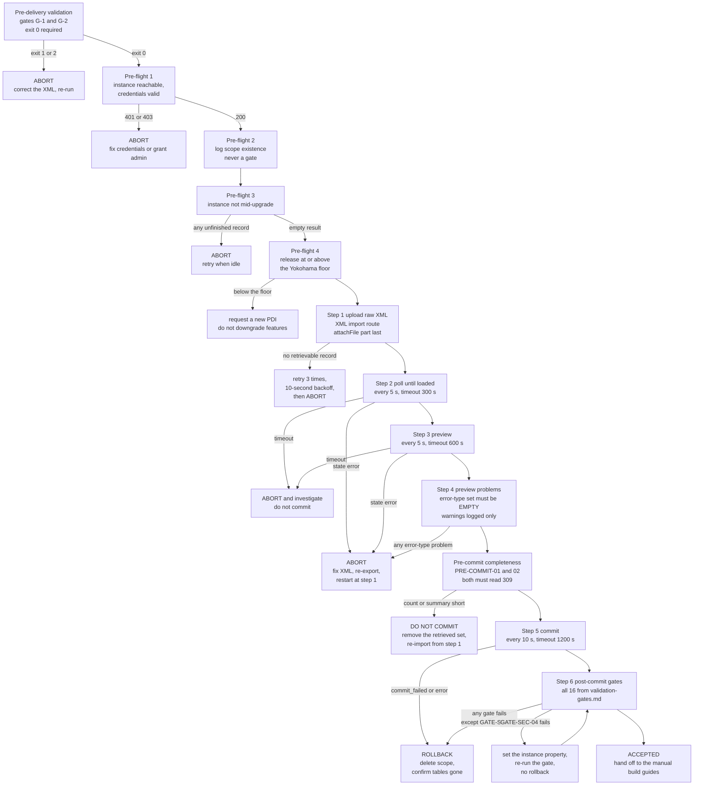

# Deployment runbook — `x_bst_startuptrk`

This runbook takes the delivered Update Set XML at [`../update-set/x_bst_startuptrk_boston_startup_tracker_update_set.xml`](../update-set/x_bst_startuptrk_boston_startup_tracker_update_set.xml) from this repository onto the ServiceNow Personal Developer Instance at `https://dev351809.service-now.com`, installing the scoped application `x_bst_startuptrk` version 1.0.0. It covers the pre-delivery validation run against the file on disk, three pre-flight checks against the instance, a six-step import sequence, the post-commit gates, the handoff to the manual build work, the rollback, and a complete failure-handling matrix.

An operator holding the deployment credentials runs this document end to end. Running the deployment requires no file other than these two: [`./validation-gates.md`](./validation-gates.md) supplies the post-commit assertions of step 6, and [`./manual-build-instructions.md` (planned)](./manual-build-instructions.md) supplies the work that follows a successful commit. Every request shape, poll interval, timeout, abort condition and retry count is stated here.

## Referenced documents

Some documents named below are **planned artifacts of this package**. Every link to one carries the marker **(planned)** in its link text. A statement about a planned document describes what that document is required to contain; it is not a claim that the content can be read from it today. The delivered files this runbook depends on are `../update-set/x_bst_startuptrk_boston_startup_tracker_update_set.xml`, `../scripts/validate_update_set_xml.py` and `./validation-gates.md`.

This document carries procedure only — steps, request shapes, poll intervals, timeouts, assertions, abort conditions and retry counts. Every decision behind that procedure is recorded in [`../../docs/decisions/DECISION_LOG.md` (planned)](../../docs/decisions/DECISION_LOG.md), which is the single source of truth for "why".

**Review.** This runbook is the artifact validated by entry 2 of [`../../docs/review/CRITICAL_DECISIONS.md` (planned)](../../docs/review/CRITICAL_DECISIONS.md), reviewer persona **DevOps**, risk level **High**. That reviewer checks two things: that the rollback is triggered only by the failure conditions documented under [Rollback](#rollback), and that the polling intervals and timeouts stated here match the deployment environment's definition.

## Authority and credential handling

The deployment environment is authoritative for the mechanics below. The application-specific identifiers — the scope name, the table names, the role names and the deliverable paths — are this application's.

| Value | Source |
| --- | --- |
| `SERVICENOW_INSTANCE_URL` | `https://dev351809.service-now.com` |
| `SERVICENOW_USERNAME` | environment secret |
| `SERVICENOW_PASSWORD` | environment secret |

Authentication is HTTP Basic on every request in this runbook:

```text
Authorization: Basic base64({SERVICENOW_USERNAME}:{SERVICENOW_PASSWORD})
Accept: application/json
```

All three values are read from the environment at the moment of the request. **No credential value is printed, echoed, logged or written down** — not into a terminal transcript, not into the deployment log of this document, not into a defect report, and not into any file of this package. Where a request or a log row needs to name a credential, it names the variable.

Every request below shows only the method, the URL and the headers that differ from the block above. The `Authorization` and `Accept` headers are present on all of them.

## Deliverable artifacts

| Artifact | Path | Detail |
| --- | --- | --- |
| Update Set XML | [`../update-set/x_bst_startuptrk_boston_startup_tracker_update_set.xml`](../update-set/x_bst_startuptrk_boston_startup_tracker_update_set.xml) | One `<unload>` document holding one `<sys_remote_update_set>` header record followed by roughly 250 to 350 `<sys_update_xml>` update records. As delivered it carries 309 update records across about 1.3 MB. |
| Scoped application it installs | installed on the instance | Scope `x_bst_startuptrk`, version `1.0.0`, vendor prefix `x_bst`. The header record declares `application_scope` `x_bst_startuptrk` and `application_version` `1.0.0`. |
| Pre-delivery validator | [`../scripts/validate_update_set_xml.py`](../scripts/validate_update_set_xml.py) | Two-level XML well-formedness validator covering gates G-1 and G-2. Python standard library only. |
| Post-commit gates | [`./validation-gates.md`](./validation-gates.md) | The assertions run at step 6. |

## Instance prerequisites

Every item is a hard prerequisite. Tick all four before running the pre-flight checks.

- [ ] **The operating account holds the `admin` role.** Remote-update-set access requires it, as do the `sys_db_object`, `sys_dictionary`, `sys_user_role`, `sys_scope`, `sys_security_acl` and `sys_properties` reads that the post-commit gates issue.
- [ ] **The instance release is at or above the Yokohama floor**, so Flow Designer, ATF, Service Portal and Connection & Credential Aliases are all generally available. Confirm the release at deploy time with [Pre-flight 4](#pre-flight-4--release-at-or-above-the-yokohama-floor), which reads the `glide.war` property. If the release predates that floor, **request a new Personal Developer Instance rather than downgrading feature usage.**
- [ ] **ATF execution is enabled and a test-designer role is held.** Enable the ATF runner property on the instance and hold the test-designer role. Without this, every suite in guide 05 — [`./manual-build/05-atf-test-suites.md` (planned)](./manual-build/05-atf-test-suites.md), indexed by [`./manual-build-instructions.md` (planned)](./manual-build-instructions.md) — is unrunnable, and the coverage gate cannot be evaluated at all.
- [ ] **The two Connection & Credential Aliases already hold live Crunchbase and LinkedIn credentials** — `x_bst_startuptrk.crunchbase_api` and `x_bst_startuptrk.linkedin_oauth`. This deployment **verifies and binds** them, per [`./manual-build/01-connection-credential-aliases.md` (planned)](./manual-build/01-connection-credential-aliases.md). It never creates a secret, and no secret value is written into the Update Set XML, into a flow input, into a script step or into this runbook.

## Pre-delivery validation — gates G-1 and G-2

Run the validator against the file on disk before anything touches the instance.

```text
python3 servicenow-startup-tracker-poc/scripts/validate_update_set_xml.py [PATH ...]
```

With no `PATH`, the sibling Update Set `update-set/x_bst_startuptrk_boston_startup_tracker_update_set.xml` is resolved relative to the script's own location, so the command needs no argument to validate the delivered artifact.

| Flag | Effect |
| --- | --- |
| `-q`, `--quiet` | Suppress the per-stage progress lines; emit only failures and the final verdict. |
| `-v`, `--verbose` | Emit one line per payload with its ordinal, `type`, `target_name` and nested `table`. |
| `--max-errors N` | Write at most N gate G-2 failure diagnostics, noting how many were suppressed. Every payload is examined either way and the reported counts stay complete. `0`, the default, means unlimited. |

`-q` and `-v` are mutually exclusive. Three further flags bound the parser's work on untrusted input and stay at their defaults for the delivered artifact: `--max-bytes N`, `--max-payloads N` and `--max-payload-bytes N`.

The report is two stages on stdout, each labelled by the gate it covers:

- **stage 1, gate G-1 — the outer update-set document.** The byte prologue, XML well-formedness, and the document shape: root `<unload>`, exactly one `<sys_remote_update_set>` header record, at least one `<sys_update_xml>` update record.
- **stage 2, gate G-2 — the nested per-record payloads.** The text of every `<payload>` un-escaped and parsed as an independent document whose root is `<record_update>` carrying a non-empty `table` attribute.

Progress lines and the terminal verdict are written to stdout; failure detail is written to stderr. On the delivered artifact stage 1 reports the root, the header count and the update-record count, and stage 2 reports how many payloads were well-formed out of how many examined.

| Exit code | Meaning |
| --- | --- |
| `0` | Both levels well-formed and all structural assertions pass. |
| `1` | Validation failure at either level. |
| `2` | Usage error, or a path that is missing, not a regular file, or unreadable. Code `2` takes precedence over code `1`. |

**A non-zero exit blocks the deployment.** Correct the XML and re-run the validator until it exits `0`. Do not upload a file that failed validation, and do not proceed to the pre-flight checks.

The validator imports only the Python standard library, so there is nothing to install.

Gates G-1 and G-2 are the whole of this validator's scope. The remaining pre-delivery gates — G-3 referential integrity, G-4 scope containment, G-5 secret hygiene, G-6 field-list fidelity, G-7 deliverable completeness, G-8 deck structure and G-9 governance completeness — are established elsewhere. A file that exits `0` here is not thereby certified against them.

## Deployment overview



## Pre-flight checks

Four checks. All four run before step 1. A failure of check 1, check 3 or check 4 aborts the deployment; check 2 is a log entry and never a gate.

### Pre-flight 1 — instance reachable and credentials valid

**Asserted.** The instance answers, and the credentials authenticate an account that can read the remote-update-set table.

```text
GET {SERVICENOW_INSTANCE_URL}/api/now/table/sys_remote_update_set?sysparm_limit=1
```

**Pass condition.** `HTTP 200`. The `result` array may be empty; only the status is tested.

**On failure.** **Abort.** Do not proceed to check 2.

| Observed | Action |
| --- | --- |
| `HTTP 401` | Abort. The credentials are invalid. Correct `SERVICENOW_USERNAME` and `SERVICENOW_PASSWORD` in the environment and restart the pre-flight checks. |
| `HTTP 403` | Abort. The account cannot read `sys_remote_update_set`. Grant the `admin` role and restart the pre-flight checks. |
| `HTTP 500` | Wait 30 seconds and reissue the identical request exactly once. If the retry is not `HTTP 200`, abort. |
| Connection timeout or DNS failure | Abort. The instance is hibernated or unreachable. Wake it, wait 2 minutes, and restart the pre-flight checks. |

### Pre-flight 2 — scope existence logged

**Asserted.** Nothing. This check records the starting state of the scope.

```text
GET {SERVICENOW_INSTANCE_URL}/api/now/table/sys_scope?sysparm_query=scope=x_bst_startuptrk
```

**Action.** Log the outcome and proceed in both cases.

| Observed | Record in the log | Then |
| --- | --- | --- |
| `result` array empty | `clean install` | Proceed to check 3. |
| `result` array holds a record | `existing scope`, with the `version` value returned | Proceed to check 3. |

**An existing scope is not an error.** The commit updates existing records, and step 4 surfaces any genuine conflict as a preview problem. **Never treat this check as a gate**: it has no failure condition and it never aborts the deployment. A read that returns `HTTP 401`, `HTTP 403` or a connection failure here is a failure of check 1, which has already passed, and is handled by restarting the pre-flight checks.

### Pre-flight 3 — instance not mid-upgrade

**Asserted.** No instance upgrade is executing.

```text
GET {SERVICENOW_INSTANCE_URL}/api/now/table/sys_upgrade_history?sysparm_limit=1&sysparm_query=upgrade_finishedISEMPTY
```

The query selects only upgrade rows that have not finished, so an empty result means the instance is idle.

**Pass condition.** `HTTP 200` and an **empty** `result` array.

**On failure.** **Abort.** An upgrade is in progress. Retry the whole deployment when the instance is idle.

**Do not** issue this check as `sysparm_query=state=executing`. `sys_upgrade_history` carries no `state` field, so the platform drops the condition and returns the instance's entire upgrade history — which this check reads as an upgrade in progress and aborts every deployment. The requirement is row 1 of [Requirements carried to the deployment runbook](./validation-gates.md#requirements-carried-to-the-deployment-runbook).

### Pre-flight 4 — release at or above the Yokohama floor

**Asserted.** The instance release is at or above Yokohama, so Flow Designer, ATF, Service Portal and Connection & Credential Aliases are all generally available.

```text
GET {SERVICENOW_INSTANCE_URL}/api/now/table/sys_properties?sysparm_query=name=glide.war&sysparm_fields=value
```

**Pass condition.** `HTTP 200` and a non-empty `value` naming the release and patch level. Record the value in the deployment log.

**On failure.** If the release predates the Yokohama floor, **request a new Personal Developer Instance rather than downgrading feature usage.**

**Do not** read `glide.buildname` or `glide.buildtag`. Neither property exists on the instance, so the query returns an empty `result` array and the release cannot be established from it. The requirement is row 7 of [Requirements carried to the deployment runbook](./validation-gates.md#requirements-carried-to-the-deployment-runbook).

Once all four checks have run, and checks 1, 3 and 4 have passed, proceed to step 1.

## Import sequence

Six steps, run in order, with the two pre-commit completeness checks sitting between step 4 and step 5 without being a step of their own. Each step states its action, its request, its polling interval, its timeout, its success assertion and its failure action. The failure matrix cites these step numbers. The request forms below are the ones required by [Requirements carried to the deployment runbook](./validation-gates.md#requirements-carried-to-the-deployment-runbook); each place where a plausible alternative does not work on this instance says so and names the row.

`{ruset_sys_id}` below is the remote update set record identifier captured at step 1. Steps 2 through 5 all address that one record.

### Step 1 — upload the Update Set XML

**Action.** Upload the raw XML file through the platform's XML import route. Three requests: establish a session, read the form token, then post the file.

```text
POST {SERVICENOW_INSTANCE_URL}/login.do
Content-Type: application/x-www-form-urlencoded

user_name={SERVICENOW_USERNAME}&user_password={SERVICENOW_PASSWORD}&sysparm_login_with_sso=false
```

```text
GET {SERVICENOW_INSTANCE_URL}/upload.do?sysparm_referring_url=sys_remote_update_set_list.do&sysparm_target=sys_remote_update_set
```

Read `sysparm_ck` from the returned form, then post the file:

```text
POST {SERVICENOW_INSTANCE_URL}/sys_upload.do
Content-Type: multipart/form-data

sysparm_ck={the token read above}
sysparm_upload_prefix=
sysparm_referring_url=sys_remote_update_set_list.do
sysparm_target=sys_remote_update_set
attachFile=<the raw bytes of ../update-set/x_bst_startuptrk_boston_startup_tracker_update_set.xml>
```

**Order the parts exactly as shown, with `attachFile` last.** Any order placing `attachFile` before the other parts returns `HTTP 200` while importing nothing, so the sequence would proceed against an update set that does not exist. The requirement is row 3 of [Requirements carried to the deployment runbook](./validation-gates.md#requirements-carried-to-the-deployment-runbook).

The file part is the file's bytes, unmodified and unwrapped. The upload depends on three file-level properties of that artifact, all three of which gate G-1 has already established:

1. It is **one single XML document**.
2. The **XML declaration is first**.
3. There is **no byte-order mark and no stray leading content** before the declaration.

**Success assertion.** Confirm the upload from the retrieved update set record, not from an attachment:

```text
GET {SERVICENOW_INSTANCE_URL}/api/now/table/sys_remote_update_set?sysparm_limit=1&sysparm_query=ORDERBYDESCsys_created_on^name=Boston Startup Tracker 1.0.0&sysparm_fields=sys_id,name,state
```

`HTTP 200` and one record whose `state` is `loaded` or `loading`. Capture its `sys_id` as `{ruset_sys_id}` and record it in the deployment log; every subsequent step and the whole of step 4 addresses that identifier.

**Do not** wait for a `sys_attachment` record for the uploaded file. The XML import consumes the upload and retains no attachment row against `sys_remote_update_set`, so a step that waits for one waits indefinitely. The requirement is row 8 of [Requirements carried to the deployment runbook](./validation-gates.md#requirements-carried-to-the-deployment-runbook).

**Do not** upload by `POST /api/now/table/sys_remote_update_set` with `Content-Type: application/xml`. The Table API does not accept an update-set payload and returns `HTTP 400`. The requirement is row 2 of the same table.

**On a failed upload.** Retry the upload up to **3 attempts with 10-second backoff** between them. If the third attempt still does not yield a retrievable record, **abort**.

**Polling.** None. This step is a single sequence of requests per attempt.

### Step 2 — poll until loaded

**Action.** Poll the remote update set until the load completes, reading the content fields alongside the status so an empty import is distinguishable from a complete one.

```text
GET {SERVICENOW_INSTANCE_URL}/api/now/table/sys_remote_update_set/{ruset_sys_id}?sysparm_fields=state,summary,inserted,updated,deleted,collisions
```

**Polling interval.** Every **5 s**.

**Timeout.** **300 s** (300 seconds).

| Observed `state` | Action |
| --- | --- |
| `loading` | Continue polling. |
| `loaded` | Proceed to step 3. |
| `error` | **Abort.** Report `state` and the preview-problem records for this identifier. Fix the XML, re-export, and restart from step 1. |

**Do not** request or report `error_detail`. `sys_remote_update_set` has no `error_detail` column, so the platform drops it from the response and a step that logs it logs nothing on every failure it handles. Report `state`, and at step 3 the execution tracker's `message`, instead. The requirements are rows 5 and 6 of [Requirements carried to the deployment runbook](./validation-gates.md#requirements-carried-to-the-deployment-runbook).

**On the timeout elapsing without reaching `loaded`.** Abort and investigate. Do not trigger the preview, and do not commit.

### Step 3 — trigger the preview and poll until previewed

**Action.** Trigger the preview through the platform's preview processor, then poll until the preview completes.

```text
POST {SERVICENOW_INSTANCE_URL}/xmlhttp.do
Content-Type: application/x-www-form-urlencoded

sysparm_processor=UpdateSetPreviewAjax&sysparm_scope=global&sysparm_ajax_processor_function=preview&sysparm_ajax_processor_sys_id={ruset_sys_id}&sysparm_ck={the session token}
```

The response `answer` is an **execution-tracker `sys_id`**. Capture it as `{tracker_sys_id}`; its `message` is what a preview failure is reported from. Then poll the update set:

```text
GET {SERVICENOW_INSTANCE_URL}/api/now/table/sys_remote_update_set/{ruset_sys_id}?sysparm_fields=state,summary,inserted,updated,deleted,collisions
```

**Polling interval.** Every **5 s**.

**Timeout.** **600 s** (600 seconds).

| Observed `state` | Action |
| --- | --- |
| `previewing` | Continue polling. |
| `previewed` | Proceed to step 4. |
| `error` | **Abort.** Report `state` together with the `message` of the execution tracker `{tracker_sys_id}` and the preview-problem records. Fix the XML, re-export, and restart from step 1. |

**Do not** trigger the preview by `PATCH /api/now/table/sys_remote_update_set/{ruset_sys_id}` with body `{"state":"previewing"}`. That request returns `HTTP 200` and is ignored, so the sequence would poll a preview that was never started. The requirement is row 4 of [Requirements carried to the deployment runbook](./validation-gates.md#requirements-carried-to-the-deployment-runbook).

**On the timeout elapsing without reaching `previewed`.** Abort and investigate. Do not commit a partially previewed set.

**Operational note.** The delivered set carries **309** update records, which makes the preview the longest step in this sequence. Expect it to approach the 600 s timeout. Slowness here is not failure — poll to the timeout before declaring one.

### Step 4 — check the preview problems

**Action.** Fetch the preview problems for this record. Two reads: error-type first, then warning-type.

```text
GET {SERVICENOW_INSTANCE_URL}/api/now/table/sys_update_preview_problem?sysparm_query=remote_update_set={ruset_sys_id}^type=error
```

**Success assertion.** The `result` array is **EMPTY**.

**On any error-type problem.** **Abort.** Log every problem's `description`. Fix the source, re-export, and restart from step 1. Do not commit a set that previewed with an error-type problem.

The most common cause is a dangling record identifier: a reference from one record to another whose identifier does not resolve surfaces here as an error-type problem.

Then fetch the warnings:

```text
GET {SERVICENOW_INSTANCE_URL}/api/now/table/sys_update_preview_problem?sysparm_query=remote_update_set={ruset_sys_id}^type=warning
```

**Warnings are logged and do not abort.** Record each warning's `description` in the deployment log and proceed to step 5.

**Polling.** None. Each read is a single request.

### Pre-commit import completeness — `PRE-COMMIT-01` and `PRE-COMMIT-02`

Two checks run here, after the preview-problem step and **before** the commit. They are **not** a seventh step and **not** among the sixteen post-commit gates; they are preconditions of them, defined in [Pre-commit import completeness](./validation-gates.md#pre-commit-import-completeness), which this sequence is required to carry.

They exist because an Update Set whose customer updates did not attach to its header commits without applying any record: the platform reports success, the scope is never created, and all sixteen gates then return an empty `result` array and initiate a rollback of an application that was never installed.

`{record_count}` is the number of `<sys_update_xml>` elements in the uploaded file — **309** for the Update Set delivered with this package, the count [`../scripts/validate_update_set_xml.py`](../scripts/validate_update_set_xml.py) reports at gate G-2.

```text
GET {SERVICENOW_INSTANCE_URL}/api/now/stats/sys_update_xml?sysparm_query=remote_update_set={ruset_sys_id}&sysparm_count=true
```

`PRE-COMMIT-01` passes on `HTTP 200` with a `count` equal to `{record_count}`, that is `309`.

```text
GET {SERVICENOW_INSTANCE_URL}/api/now/table/sys_remote_update_set/{ruset_sys_id}?sysparm_fields=state,summary,inserted,updated,deleted,collisions
```

`PRE-COMMIT-02` passes on `HTTP 200` with `state` exactly `previewed` and `summary` equal to `309`.

**On failure of either check.** **Do not commit.** Neither check initiates the rollback: nothing has been committed and no scope exists, so there is nothing to roll back. Remove the retrieved update set and re-import from step 1. Report every field value observed. A `summary` of `0` means the preview found nothing to apply; a `summary` below `309` means it found only part of the file; a `state` other than `previewed` means the check was read before the preview completed, so re-read it once the preview finishes.

**Polling.** None. Each check is a single request.

### Step 5 — commit

**Action.** Commit through the platform's update set commit processor: validate the commit, then run it, then poll until the commit completes.

```text
POST {SERVICENOW_INSTANCE_URL}/xmlhttp.do
Content-Type: application/x-www-form-urlencoded

sysparm_processor=com.glide.update.UpdateSetCommitAjaxProcessor&sysparm_scope=global&sysparm_type=validateCommitRemoteUpdateSet&sysparm_remote_updateset_sys_id={ruset_sys_id}&sysparm_ck={the session token}
```

With validation clear, run the commit:

```text
POST {SERVICENOW_INSTANCE_URL}/xmlhttp.do
Content-Type: application/x-www-form-urlencoded

sysparm_processor=com.glide.update.UpdateSetCommitAjaxProcessor&sysparm_scope=global&sysparm_type=commitRemoteUpdateSet&sysparm_remote_updateset_sys_id={ruset_sys_id}&sysparm_ck={the session token}
```

Then poll:

```text
GET {SERVICENOW_INSTANCE_URL}/api/now/table/sys_remote_update_set/{ruset_sys_id}?sysparm_fields=state,summary,inserted,updated,deleted,collisions
```

**Polling interval.** Every **10 s**.

**Timeout.** **1200 s** (1200 seconds).

| Observed `state` | Action |
| --- | --- |
| `committing` | Continue polling. |
| `committed` | Proceed to step 6. |
| `commit_failed` | Report `state`, `inserted`, `updated`, `deleted` and `collisions`. **Execute the [rollback](#rollback).** |
| `error` | Report `state`, `inserted`, `updated`, `deleted` and `collisions`. **Execute the [rollback](#rollback).** |

**Do not** commit by `PATCH /api/now/table/sys_remote_update_set/{ruset_sys_id}` with a `state` body, and **do not** report `error_detail`; neither works on this instance, for the reasons given at steps 1, 3 and 2 respectively.

**On the timeout elapsing without reaching `committed`.** Abort and investigate. Do not run the post-commit gates against a set whose commit did not complete.

### Step 6 — post-commit gates

**Action.** Run **all sixteen** gates defined in [`./validation-gates.md`](./validation-gates.md). That document is authoritative for every gate's target, query, expected result and pass condition. The gates are not restated here.

The sixteen are:

| Gate group | Count | Gate identifiers |
| --- | --- | --- |
| Entity table gates — one per entity table | 7 | `GATE-TBL-01` through `GATE-TBL-07` |
| Entity column count | 1 | `GATE-COL-01` |
| Role record gates — one per role | 3 | `GATE-ROLE-01` through `GATE-ROLE-03` |
| Scope record gate | 1 | `GATE-SCOPE-01` |
| Security posture gates | 4 | `GATE-SEC-01` through `GATE-SEC-04` |

The eleven-gate core of the deployment environment's definition — the **seven entity-table gates**, the **three role-record gates** and the **one scope-record gate** — is the subset `GATE-TBL-01` through `GATE-TBL-07`, `GATE-ROLE-01` through `GATE-ROLE-03`, and `GATE-SCOPE-01`. `GATE-COL-01` and `GATE-SEC-01` through `GATE-SEC-04` are the five additional gates the delivered gate set defines. All sixteen are required. That gate set, and the form the seven entity-table gates take, are recorded in [`../../docs/decisions/DECISION_LOG.md` (planned)](../../docs/decisions/DECISION_LOG.md).

**Success assertion.** All sixteen gates pass. There is no partial pass, no gate is advisory, and no gate may be skipped, deferred or waived.

**Transient-error retry rule.** This rule applies to every one of the sixteen gates. A gate that returns `HTTP 500` is retried **exactly once, after waiting 30 seconds**, reissuing the identical request. The gate is then evaluated on the retry's response: a retry that satisfies the pass condition is a pass and is recorded as such; a second `HTTP 500`, or any other status that does not satisfy the pass condition, is final. No gate is retried more than once, and no status other than `HTTP 500` is retried — `HTTP 400`, `HTTP 401` and `HTTP 403` are evaluated on their first response and fail immediately.

**On any gate failure.** Report the failing gate **by its identifier**, together with the HTTP status and the response body observed, then **execute the [rollback](#rollback)**. The failing gate is reported before the rollback is initiated.

**The one exception.** `GATE-SEC-04` tests instance configuration that this Update Set does not create. Its failure does **not** roll back: set the named instance property to the value that gate requires, re-run `GATE-SEC-04`, and proceed once it passes. Every other gate failure rolls back.

Record one row per gate in the evidence record of [`./validation-gates.md`](./validation-gates.md), and record no credential value in any field of it.

## After the gates pass

With all sixteen gates passing, the declarative deliverable is installed: the ten tables, their columns and choices, the three roles, the access controls, the service layer, the REST definition and its operations, the properties, the business rules, the scheduled job, the views and the application menu are all committed on the instance. The manual build work begins now.

Hand off to [`./manual-build-instructions.md` (planned)](./manual-build-instructions.md) and follow its guides in this order:

1. Guide **01** — Connection & Credential Aliases.
2. Guides **02** and **03** — the Crunchbase and LinkedIn ingestion flows.
3. Guide **04** — the Service Portal pages and widgets.
4. Guide **06** — the staging-table CSV import.
5. Guide **05** — the ATF test suites.
6. [`./validation-checklist.md` (planned)](./validation-checklist.md) — the five success criteria.

That index is authoritative for each guide's contents and for the dependencies between them. The guides are not restated here.

---

## What counts as a scheduled run

Success criterion 4 is measured over three consecutive **scheduled runs** of each ingestion flow, and the flows are triggered hourly while their cadence is configurable between 6 and 48 hours. The two must not be confused when the evidence is read.

A **scheduled run** is a flow execution that passed the flow's cadence guard and went on to do work. An execution that started, found the configured cadence had not yet elapsed and exited without ingesting is a **no-op**: it is not a scheduled run, it does not count towards the three consecutive runs, and it is not evidence of anything.

Distinguish the two in the flow execution log by the first action after the trigger. A no-op records the cadence-guard comparison and then an early exit, and writes no run-summary record. A scheduled run passes the guard, proceeds to the source call or the fallback read, and writes a run-summary record carrying its provenance.

Read the evidence from the run-summary records only, and record each run's provenance as `live` or `fallback`. Per-record skips arising from the four cleaning rules are expected behaviour, not unhandled errors, and are counted separately. The staging-side definition and the provenance contract are in [`../sample-data/README.md`](../sample-data/README.md).

## Rollback

> **WARNING — THIS IS THE ONE IRREVERSIBLE OPERATION IN THIS DELIVERY.**
>
> **It deletes the `x_bst_startuptrk` scope and cascades its tables, roles and flows. There is no undo, and no step of this runbook restores what it removes.**

Read this whole section before issuing the first request in it.

### Trigger conditions

The rollback runs on **exactly two** conditions:

1. **Commit failure at step 5** — the remote update set reached `commit_failed` or `error` while committing.
2. **Any post-commit gate failure at step 6** — with the single exception of `GATE-SEC-04`, whose remedy is to set the instance property and re-run the gate.

**No other condition triggers the rollback.** A pre-flight failure, an upload failure at step 1, a load error at step 2, a preview error at step 3, an error-type preview problem at step 4, a load or preview timeout, and a `GATE-SEC-04` failure all resolve without it — each is handled as its own row of the [failure-handling matrix](#failure-handling-matrix). Report the specific failure that triggered the rollback before the first request below.

### Steps

**Step R1 — retrieve the scope record.**

```text
GET {SERVICENOW_INSTANCE_URL}/api/now/table/sys_scope?sysparm_query=scope=x_bst_startuptrk
```

Capture `result[0].sys_id` as `{scope_sys_id}`. This is the same record `GATE-SCOPE-01` tests. If the `result` array is empty there is nothing to roll back: record that fact in the deployment log and stop.

**Step R2 — delete the scope record.**

```text
DELETE {SERVICENOW_INSTANCE_URL}/api/now/table/sys_scope/{scope_sys_id}
```

Assert `HTTP 204`. On a clean instance this **cascades the application's tables, roles and flows**.

**Step R3 — confirm the tables are gone.**

```text
GET {SERVICENOW_INSTANCE_URL}/api/now/table/sys_db_object?sysparm_query=nameSTARTSWITHx_bst_startuptrk_&sysparm_fields=name
```

Assert `HTTP 200` with an **empty** `result` array. This metadata read is the confirmation: an empty array means no `x_bst_startuptrk_` table definition remains. If any table definition is still returned, the cascade did not complete — record the table names in the deployment log and escalate before any re-deployment.

Do not confirm by reading an application table directly. The native Table API is disabled on all ten application tables, so `GET /api/now/table/x_bst_startuptrk_startup` returns `HTTP 400`, `HTTP 403` or `HTTP 404` — depending on the instance — whether the table still exists or not, and cannot distinguish the two. Use the `sys_db_object` read above.

### What the rollback destroys

- **All ten application tables**, and **all application data held in them**. The data is destroyed along with the tables.
- **The three roles** `x_bst_startuptrk.admin`, `x_bst_startuptrk.user` and `x_bst_startuptrk.premium_user`.
- **Every artifact inside the scope**, whether it arrived in the Update Set or was built by hand afterwards. On an instance that is not clean — one carrying manually built flows, portal records or ATF suites from a previous run — those artifacts are destroyed too, since they live in the same scope. Rebuilding them means running guides 01 through 06 again in full.

### What the rollback does not do

- It does **not** remove `sys_user` role assignments made by an administrator. Those records live outside the application scope, so a user granted `x_bst_startuptrk.premium_user` retains a now-dangling assignment. Remove such assignments by hand if the scope is not going to be re-installed.
- It does **not** remove the two Connection & Credential Aliases' stored credentials, and it does not create or reveal any credential value.
- It does **not** revert instance-level configuration that no step of this runbook set — including the ATF runner property and the XML entity-resolution properties that `GATE-SEC-04` tests.

## Failure-handling matrix

Every abort, retry and rollback path in this runbook appears below as its own row. No condition is left to be handled by analogy.

| Condition | Step | Action | Escalation |
| --- | --- | --- | --- |
| Validator exits `1` — validation failure at gate G-1 or gate G-2 | Pre-delivery validation | **Abort.** Correct the XML and re-run the validator until it exits `0`. Do not upload. | Report the gate and the stderr diagnostic. Nothing has touched the instance. |
| Validator exits `2` — usage error, or a missing, non-regular or unreadable path | Pre-delivery validation | **Abort.** Correct the invocation or the path and re-run. Do not upload. | Report the path and the `ERROR [IO]` line. Nothing has touched the instance. |
| Authentication failure — `HTTP 401` | Pre-flight 1 | **Abort.** Correct `SERVICENOW_USERNAME` and `SERVICENOW_PASSWORD` in the environment; restart the pre-flight checks. | Report that the credentials were rejected. Never report a credential value. |
| Authorisation failure — `HTTP 403` | Pre-flight 1 | **Abort.** Grant the `admin` role to the operating account; restart the pre-flight checks. | Report the account name and the table that was refused. |
| Instance unreachable — connection timeout or DNS failure | Pre-flight 1 | **Abort.** Wake the instance, wait 2 minutes, restart the pre-flight checks. | Report the instance URL and the transport error. |
| Instance mid-upgrade — any executing upgrade record | Pre-flight 3 | **Abort.** Retry the whole deployment when the instance is idle. | Report the upgrade record returned. |
| Failed upload — no retrievable update set record | Step 1 | **Retry 3 times with a 10-second backoff.** If the third attempt still does not yield a retrievable record, **abort**. | Report the status and body of the final attempt. Nothing was loaded. |
| Load error — `state=error` | Step 2 | **Fix and re-export.** Restart from step 1. | Report `state` and the preview-problem records. No rollback: nothing was committed. |
| Preview error — `state=error` | Step 3 | **Fix and re-export.** Restart from step 1. | Report `state`, the execution tracker's `message` and the preview-problem records. No rollback: nothing was committed. |
| Any error-type preview problem | Step 4 | **Fix and re-export.** Restart from step 1. Do not commit. | Report every problem's `description`. A dangling record identifier is the most common cause. |
| Warning-type preview problem | Step 4 | **Log and proceed.** Warnings do not abort. | Record each `description` in the deployment log. |
| Load timeout exceeded — `300 s` elapsed without `loaded` | Step 2 | **Abort and investigate.** Do not trigger the preview. | Report the last observed `state` and the elapsed time. No rollback. |
| Preview timeout exceeded — `600 s` elapsed without `previewed` | Step 3 | **Abort and investigate. Do not commit a partially previewed set.** | Report the last observed `state` and the elapsed time. No rollback. |
| Commit timeout exceeded — `1200 s` elapsed without `committed` | Step 5 | **Abort and investigate.** Do not run the post-commit gates. | Report the last observed `state` and the elapsed time. Escalate before any rollback or re-deployment. |
| Import incomplete — `PRE-COMMIT-01` count below `309` | Pre-commit | **Do not commit.** Remove the retrieved update set and re-import from step 1. | Report the observed count against `309`. No rollback: nothing was committed. |
| Preview applied nothing — `PRE-COMMIT-02` `summary` below `309` | Pre-commit | **Do not commit.** Remove the retrieved update set and re-import from step 1. | Report `state`, `summary`, `inserted`, `updated`, `deleted` and `collisions`. No rollback: nothing was committed. |
| Commit failure — `state=commit_failed` or `state=error` | Step 5 | **Execute the [rollback](#rollback).** | Report the specific state observed, with `summary`, `inserted`, `updated`, `deleted` and `collisions`, before the rollback. |
| Post-commit gate failure — any gate other than `GATE-SEC-04` | Step 6 | **Execute the [rollback](#rollback)** and **report which specific gate failed**. | Report the gate identifier, the HTTP status and the response body, before the rollback. |
| `GATE-SEC-04` failure | Step 6 | **Do not roll back.** Set the named instance property to the required value and re-run `GATE-SEC-04`. Proceed once it passes. | Report the property name and the value observed. Both values are recorded in the evidence record. |
| Server error — `HTTP 500` at any step or any gate | Any step, any gate | **Retry once after 30 seconds**, reissuing the identical request. If the retry does not succeed, **abort**. A gate is retried at most once; a second `HTTP 500` is final. | Report both responses. No status other than `HTTP 500` is retried. |
| Rollback cascade incomplete — an `x_bst_startuptrk_` table still resolves after step R3 | Rollback step R3 | **Stop.** Do not re-deploy. | Report the table names still returned, and escalate. |

## Deployment log

Record one row per step per run. This log is the evidence a deployment took the documented path, and [`./validation-checklist.md` (planned)](./validation-checklist.md) cites it as such.

| Timestamp (UTC) | Step | Outcome | Record identifier | Operator |
| --- | --- | --- | --- | --- |
| | Pre-delivery validation | | validator exit code | |
| | Pre-flight 1 | | — | |
| | Pre-flight 2 | | `clean install` or `existing scope`, with the version | |
| | Pre-flight 3 | | — | |
| | Pre-flight 4 | | the `glide.war` value observed | |
| | Step 1 upload | | `{ruset_sys_id}` | |
| | Step 2 load | | `{ruset_sys_id}` | |
| | Step 3 preview | | `{ruset_sys_id}` and `{tracker_sys_id}` | |
| | Step 4 preview problems | | error-type count, warning-type count | |
| | `PRE-COMMIT-01` | | attached customer-update count against `309` | |
| | `PRE-COMMIT-02` | | `state` and `summary` against `309` | |
| | Step 5 commit | | `{ruset_sys_id}` | |
| | Step 6 gates | | `16 of 16` or the failing gate identifier | |
| | Rollback, if run | | `{scope_sys_id}` | |

Record the time of the request in **Timestamp (UTC)** in `YYYY-MM-DD HH:MM:SS` form. Record `pass`, `fail` or `not run` in **Outcome**, and for a failure the HTTP status and the response body. Record the operator's account name in **Operator**. **Record no credential value in any field.**

## Legacy provenance

This runbook replaces the repository's retired deployment path. The facts below are recorded for the traceability matrix in [`../../docs/decisions/TRACEABILITY_MATRIX.md` (planned)](../../docs/decisions/TRACEABILITY_MATRIX.md).

`scripts/deploy_production.sh` supplied the procedural shape that survives:

| Legacy construct | Location | Surviving counterpart |
| --- | --- | --- |
| Prerequisite check function verifying privileges, required tooling and the presence of required secrets | `check_prerequisites`, L20-L44 | [Instance prerequisites](#instance-prerequisites) and the three [pre-flight checks](#pre-flight-checks). Secrets are checked for presence, never for value, in both. |
| Build-and-deploy stage | `build_and_deploy`, L89-L102 | The six-step [import sequence](#import-sequence). |
| Post-deploy check stage returning non-zero on failure | `post_deploy_checks`, L105-L127 | [Step 6](#step-6--post-commit-gates), delegating to the sixteen gates of [`./validation-gates.md`](./validation-gates.md). |
| Rollback invoked on that failure | main flow, L150-L163 | The [rollback](#rollback), triggered by commit failure at step 5 or a post-commit gate failure at step 6. |
| Timestamped run log | `LOG_FILE` and `log_message`, L12-L17 | The [deployment log](#deployment-log). |

Not carried forward:

- Docker image builds and every `docker-compose` invocation.
- The `pg_dump` database backup, in `scripts/deploy_production.sh` and in `scripts/backup_database.sh`.
- The git clone-and-reset that fetched the deployable tree.
- The `curl` health check against a local port.
- The stray `manage.py` migration and test invocations, which name a framework this repository never used.

`.github/workflows/cd.yml` is the retired continuous-deployment path: DockerHub login, a backend and a frontend image build-and-push, and an SSH deploy action at L46 running `docker-compose pull` and `up -d` on a remote host. The repository's CI and CD workflows are **deliberately not modified** by this work, so the pre-delivery validator is invoked directly as documented under [Pre-delivery validation](#pre-delivery-validation--gates-g-1-and-g-2) rather than wired into a workflow.

## Related documents

Delivered with this package:

- [`../update-set/x_bst_startuptrk_boston_startup_tracker_update_set.xml`](../update-set/x_bst_startuptrk_boston_startup_tracker_update_set.xml) — the artifact this runbook deploys
- [`../scripts/validate_update_set_xml.py`](../scripts/validate_update_set_xml.py) — the pre-delivery validator run before step 1
- [`./validation-gates.md`](./validation-gates.md) — the sixteen post-commit gates run at step 6, and their evidence record
- [`./data-model.md`](./data-model.md) — the ten tables the commit installs
- [`./access-control.md`](./access-control.md) — the three roles and the access posture the security gates verify
- [`./api-reference.md`](./api-reference.md) — the REST definition and operations the commit installs

Planned artifacts of this package:

- [`./manual-build-instructions.md` (planned)](./manual-build-instructions.md) — the index for the manual build work that follows a successful commit
- [`./validation-checklist.md` (planned)](./validation-checklist.md) — the five success criteria, citing this runbook's deployment log as evidence
- [`./gaps-and-flags.md` (planned)](./gaps-and-flags.md) — every requirement with no clean platform equivalent
- [`../../docs/decisions/DECISION_LOG.md` (planned)](../../docs/decisions/DECISION_LOG.md) — the single source of truth for every decision behind this procedure
- [`../../docs/decisions/TRACEABILITY_MATRIX.md` (planned)](../../docs/decisions/TRACEABILITY_MATRIX.md) — the bidirectional mapping this runbook's provenance section feeds
- [`../../docs/review/CRITICAL_DECISIONS.md` (planned)](../../docs/review/CRITICAL_DECISIONS.md) — the review artifact whose entry 2 validates this runbook
