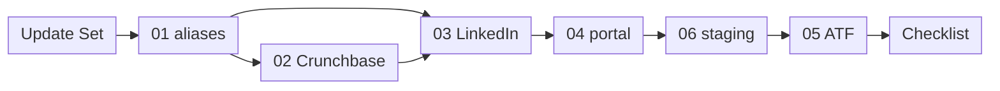

# Manual build instructions — `x_bst_startuptrk`

This document is the index for the six manual-build guides of the ServiceNow scoped application `x_bst_startuptrk`. It states which artifacts each guide builds, how many of each, what each guide depends on, and the order in which an operator works through them. It is a registry: it locates work and sequences it. It contains no build steps. Every screen, every field, every value and every click path lives in the guide that owns the artifact, and each of the six guides is executable on its own.

The artifacts indexed here are the ones that are **not** in the Update Set XML. Everything expressible as declarative metadata — the scoped application, the ten tables, the choices, the three roles, the access-control records, the Script Includes, the REST definition and its operations, the system properties, the business rules, the scheduled job, the form and list views, and the application menu — ships in the single Update Set at [`../update-set/x_bst_startuptrk_boston_startup_tracker_update_set.xml`](../update-set/x_bst_startuptrk_boston_startup_tracker_update_set.xml) and is imported, previewed and committed before any guide below begins.

**Authority.** This document is authoritative for two things across the package: the **execution order** of the six guides, and the **split rule** that decides which artifacts ship as Update Set XML and which are built by hand. Each guide repeats both locally so that it can be run without this file; where a guide and this index disagree about the order, this index governs. The execution order stated here matches the deploy order declared in [`../README.md`](../README.md). Every identifier below — alias name, portal URL suffix, page name, widget name, table name, file name — matches the guide that owns it character for character. No variant spelling is valid.

This document carries **no rationale**. It states the inventory, the dependencies and the order as fact and instruction. Every decision behind the split, the guide boundaries and the ordering, every alternative considered and every risk each carries is recorded in [`../../docs/decisions/DECISION_LOG.md`](../../docs/decisions/DECISION_LOG.md), which is the single source of truth for "why".

## The split rule

Only tables carrying the update-synch attribute are captured into `sys_update_xml` records, and adding that attribute to a table that lacks it out of the box is unsupported. The tables behind the artifact classes below do not carry it, so those artifacts cannot travel in an update set and are built through the platform's own interface instead. The delivered Update Set therefore contains zero records of each class, and the six guides supply them.

| Artifact class | Guide | Records absent from the Update Set by consequence |
| --- | --- | --- |
| Connection & Credential Aliases, with their connection, credential and OAuth records | 01 | Alias, connection, credential and OAuth registry records — and, with them, all credential material |
| Flow Designer flows | 02, 03 | Flow, action, trigger and flow-logic records |
| The Service Portal, its theme, its pages and its widgets | 04 | `sp_portal`, `sp_theme`, `sp_page` and `sp_widget` records |
| Automated Test Framework suites, tests and steps | 05 | `sys_atf_test`, `sys_atf_step`, `sys_atf_test_suite` and `sys_atf_test_suite_test` records |
| The staging-table CSV load: data sources, import set tables and transform maps | 06 | `sys_data_source`, `sys_transform_map` and `sys_transform_entry` records |

## Preconditions common to every guide

Every guide below assumes the Update Set has already been **imported**, has **previewed with an empty error-type problem set**, has **committed**, and that **all eleven post-commit gates of the core set have passed** — the seven entity-table gates, the three role-record gates and the one scope-record gate.

The import, preview and commit route, with its polling intervals, timeouts and failure handling, is specified in [`./deployment-runbook.md`](./deployment-runbook.md). The gates are specified in [`./validation-gates.md`](./validation-gates.md), which defines sixteen: the **eleven-gate core** is `GATE-TBL-01` through `GATE-TBL-07`, `GATE-ROLE-01` through `GATE-ROLE-03` and `GATE-SCOPE-01`; the remaining five are `GATE-COL-01` and `GATE-SEC-01` through `GATE-SEC-04`. All sixteen are required, and the eleven are named separately so that a partial gate run is visible as such. No guide starts before every gate reports `pass`.

Two further conditions are instance state rather than package content, and each blocks a specific guide:

- **The two Connection & Credential Aliases must already hold live credentials provisioned on the instance.** Guide 01 **verifies and binds existing aliases**; it does not create secrets. While either alias is unprovisioned, every ingestion run reads the fallback dataset and every result is labelled fallback-validated. See [`./manual-build/01-connection-credential-aliases.md`](./manual-build/01-connection-credential-aliases.md) and [`../sample-data/README.md`](../sample-data/README.md).
- **ATF execution must be enabled on the instance and an appropriate test-designer role held.** Without both, every suite in guide 05 is unrunnable: no test produces a result and the coverage gate cannot be evaluated at all. [`./deployment-runbook.md`](./deployment-runbook.md) asserts this before the Update Set is imported. See [`./manual-build/05-atf-test-suites.md`](./manual-build/05-atf-test-suites.md).

## The six guides

The rows are in execution order. The **Order** column is the execution step; the guide number is the numeric prefix of the filename beside it.

| Order | Guide | Artifacts built | Count | Depends on |
| --- | --- | --- | --- | --- |
| **1** | [`01-connection-credential-aliases.md`](./manual-build/01-connection-credential-aliases.md) | The two Connection & Credential Aliases the ingestion flows authenticate through: `x_bst_startuptrk.crunchbase_api`, a Basic Auth alias whose credential carries the Crunchbase API key in its password field, and `x_bst_startuptrk.linkedin_oauth`, an OAuth 2.0 alias carrying a client identifier, a client secret and a refresh token. This guide **verifies and binds existing aliases rather than creating secrets**, because the live credentials are provisioned on the instance by their owner beforehand. | **2** aliases | The committed Update Set |
| **2** | [`02-flow-crunchbase-ingestion.md`](./manual-build/02-flow-crunchbase-ingestion.md) | One Flow Designer scheduled flow, targeting Startup, Investor, FundingRound and the m2m participant rows. | **1** flow | Guide 01 — the flow's REST step binds `x_bst_startuptrk.crunchbase_api` **by name** |
| **3** | [`03-flow-linkedin-ingestion.md`](./manual-build/03-flow-linkedin-ingestion.md) | One Flow Designer scheduled flow, targeting Founder, Executive and JobPosting, sharing guide 02's Startup upsert path so both flows resolve company identity through the same deduplication key. | **1** flow | Guide 01 — binds `x_bst_startuptrk.linkedin_oauth` **by name**; guide 02, which owns the shared Startup upsert path |
| **4** | [`04-service-portal-pages-and-widgets.md`](./manual-build/04-service-portal-pages-and-widgets.md) | 1 portal, URL suffix `bst`; 1 theme; 5 pages — `bst_home`, `bst_company`, `bst_investor`, `bst_dashboard`, `bst_account`; and 8 widgets — `bst-startup-search`, `bst-startup-results`, `bst-company-profile`, `bst-investor-profile`, `bst-trends-kpi`, `bst-trends-charts`, `bst-account-summary`, `bst-premium-upsell`. | **1** portal + **1** theme + **5** pages + **8** widgets | The committed Update Set — the Script Includes the widget server scripts call |
| **5** | [`06-staging-table-csv-import.md`](./manual-build/06-staging-table-csv-import.md) | The Data Import Wizard load of the six CSV files in [`../sample-data/`](../sample-data/) into the single staging table `x_bst_startuptrk_ingest_staging`. | **6** CSVs into **1** staging table | The committed Update Set — the staging table's dictionary columns |
| **6** | [`05-atf-test-suites.md`](./manual-build/05-atf-test-suites.md) | 10 Automated Test Framework suites containing 36 tests: 7 table-CRUD suites, 21 field-ACL tests, 6 REST tests and 2 ingestion-flow tests. The arithmetic is 7 + 21 + 6 + 2 = 36. | **10** suites / **36** tests | Guides 01, 02, 03, 04 and 06, plus ATF execution enabled |

Across the six guides the manual build produces, in total: **2** Connection & Credential Aliases, **2** Flow Designer scheduled flows, **1** portal, **1** theme, **5** pages, **8** widgets, **6** CSV files loaded into **1** staging table, and **10** Automated Test Framework suites containing **36** tests. Nothing in the manual build is outside that list, and no item on it is built anywhere else.

### The guides are numbered by artifact class, and the execution order is not the filename order

The six filenames are numbered by artifact class. The execution order places **guide 06 before guide 05**. That is the single point at which the numeric sequence and the execution sequence differ, and it is the only one: steps 1 through 4 are guides 01 through 04, step 5 is guide **06**, and step 6 — the last — is guide **05**.

Do not work the guides in filename order. Running guide 05 before guide 06 leaves the two ingestion-flow tests with no staging rows to act on: the flows read the staging table on their fallback branch, and an empty table cannot demonstrate the cleaning rules.

## Ordering constraints

The order above is fixed by four dependencies. Each is mechanical.

1. **Aliases before flows.** Guide 01 completes before guides 02 and 03. The flows reference their aliases **by name**, and a name mismatch fails at run time rather than at build time, so guides 02 and 03 each require a successful connection test before the flow is saved.
2. **Staging import before any fallback exercise.** Guide 06 completes before the fallback path of guides 02 and 03 is exercised, and before guide 05's two ingestion-flow tests run. The fallback path reads `x_bst_startuptrk_ingest_staging`, and an empty table cannot demonstrate the cleaning rules. Guides 02 and 03 are built before guide 06 and their fallback branch returns a row count of zero until guide 06 has run; both guides require that branch to be re-run afterwards.
3. **Pages and widgets before the portal walkthrough.** Guide 04 completes before the five-route walkthrough that supplies the evidence for prompt section 10.0 criterion 5.
4. **ATF last.** Guide 05 runs after every other guide, because its suites exercise the tables, the access-control records, the REST resources and both flows.

This order matches the deploy order declared in [`../README.md`](../README.md): validate the XML, then import, preview and commit per [`./deployment-runbook.md`](./deployment-runbook.md), then guide 01, then guides 02 and 03, then guide 04, then guide 06, then guide 05.

The step that follows guide 05 is [`./validation-checklist.md`](./validation-checklist.md), which maps the evidence one-to-one onto the five success criteria of prompt section 10.0.

## Cross-cutting contracts

These contracts span more than one guide. Each is an instruction; the detail belongs to the document named against it.

- **Alias binding by name.** The two alias names are `x_bst_startuptrk.crunchbase_api` and `x_bst_startuptrk.linkedin_oauth`. Guides 02 and 03 use those exact strings. A name mismatch fails at run time rather than at build time. See [`./manual-build/01-connection-credential-aliases.md`](./manual-build/01-connection-credential-aliases.md).
- **The three-way staging contract.** The CSV header rows under [`../sample-data/`](../sample-data/), the staging table's dictionary columns in the Update Set, and guide 06's field mapping are three legs of one contract. Changing any one leg breaks the fallback path silently. See [`../sample-data/README.md`](../sample-data/README.md), [`./data-model.md`](./data-model.md) and [`./manual-build/06-staging-table-csv-import.md`](./manual-build/06-staging-table-csv-import.md).
- **Secured reads in widget server scripts.** Every widget server script uses the secured read path and the per-field omission gate, so the portal cannot expose a premium field the API would deny. See [`./access-control.md`](./access-control.md) and [`./manual-build/04-service-portal-pages-and-widgets.md`](./manual-build/04-service-portal-pages-and-widgets.md).
- **Impersonation for every access-control check.** No access-control verification is performed as the instance administrator. Every check runs under an impersonated user holding exactly one scoped role and none of the elevated platform roles. See [`./access-control.md`](./access-control.md) and [`./manual-build/05-atf-test-suites.md`](./manual-build/05-atf-test-suites.md).
- **Provenance labelling.** Every ingestion result is labelled live-validated or fallback-validated, so a passing result can never be mistaken for validated live integration. See [`./manual-build/02-flow-crunchbase-ingestion.md`](./manual-build/02-flow-crunchbase-ingestion.md), [`./manual-build/03-flow-linkedin-ingestion.md`](./manual-build/03-flow-linkedin-ingestion.md), [`./manual-build/05-atf-test-suites.md`](./manual-build/05-atf-test-suites.md) and [`./validation-checklist.md`](./validation-checklist.md).
- **Icon system.** The portal uses the platform glyph font. The executive deck uses Lucide. The two systems are separate and are not mixed: no widget references Lucide, and no platform glyph appears in the deck. See [`./manual-build/04-service-portal-pages-and-widgets.md`](./manual-build/04-service-portal-pages-and-widgets.md) and [`./gaps-and-flags.md`](./gaps-and-flags.md).
- **Zero secrets.** No credential value appears in any guide, in any flow input, in any script step, or in the Update Set XML. Guide 01 verifies and binds; it never records a secret.

## Referenced documents

| Document | What it supplies to this index |
| --- | --- |
| [`./manual-build/01-connection-credential-aliases.md`](./manual-build/01-connection-credential-aliases.md) | Step 1. The two Connection & Credential Aliases, and the connection test each flow depends on. |
| [`./manual-build/02-flow-crunchbase-ingestion.md`](./manual-build/02-flow-crunchbase-ingestion.md) | Step 2. The Crunchbase ingestion flow, and the shared Startup upsert path guide 03 resolves against. |
| [`./manual-build/03-flow-linkedin-ingestion.md`](./manual-build/03-flow-linkedin-ingestion.md) | Step 3. The LinkedIn ingestion flow. |
| [`./manual-build/04-service-portal-pages-and-widgets.md`](./manual-build/04-service-portal-pages-and-widgets.md) | Step 4. The portal, the theme, the five pages and the eight widgets. |
| [`./manual-build/06-staging-table-csv-import.md`](./manual-build/06-staging-table-csv-import.md) | Step 5. The load of the six CSVs into the one staging table. |
| [`./manual-build/05-atf-test-suites.md`](./manual-build/05-atf-test-suites.md) | Step 6, last. The ten suites, the thirty-six tests and the ATF execution prerequisite. |
| [`./deployment-runbook.md`](./deployment-runbook.md) | The import, preview and commit route that precedes guide 01, and the pre-import assertion of the ATF prerequisite. |
| [`./validation-gates.md`](./validation-gates.md) | The sixteen post-commit gates, and the eleven-gate core within them. |
| [`./validation-checklist.md`](./validation-checklist.md) | The step that follows guide 05, mapped one-to-one onto the five success criteria. |
| [`./data-model.md`](./data-model.md) | The ten tables field by field, including the staging table leg of the three-way staging contract. |
| [`./access-control.md`](./access-control.md) | The three roles, the seven premium fields, the secured read path and the impersonation requirement. |
| [`./api-reference.md`](./api-reference.md) | The six REST resources, the nested sub-resource and the system-property inventory the flows and widgets read. |
| [`./gaps-and-flags.md`](./gaps-and-flags.md) | The requirements with no clean platform equivalent, including the icon-system split. |
| [`../README.md`](../README.md) | The package index and the authoritative deploy order this execution order matches. |
| [`../sample-data/README.md`](../sample-data/README.md) | The CSV header rows and the fallback-only posture of the dataset. |
| [`../update-set/x_bst_startuptrk_boston_startup_tracker_update_set.xml`](../update-set/x_bst_startuptrk_boston_startup_tracker_update_set.xml) | The declarative metadata that commits before any guide begins. |
| [`../scripts/validate_update_set_xml.py`](../scripts/validate_update_set_xml.py) | The two-level XML validation that precedes the import. |
| [`../../docs/decisions/DECISION_LOG.md`](../../docs/decisions/DECISION_LOG.md) | The single source of truth for every "why" behind the split, the guide boundaries and this order. |
