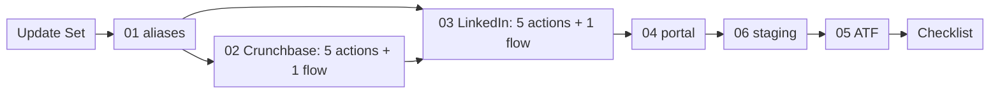

# Manual build instructions — `x_bst_startuptrk`

This document is the index for the six manual-build guides of the ServiceNow scoped application `x_bst_startuptrk`. It states which artifacts each guide builds, how many of each, what each guide depends on, and the order in which an operator works through them. It is a registry: it locates work and sequences it. It contains no build steps. Every screen, every field, every value and every click path lives in the guide that owns the artifact, and each of the six guides is executable on its own.

The artifacts indexed here are the ones that are **not** in the Update Set XML. Everything expressible as declarative metadata — the scoped application, the ten tables, the choices, the three roles, the 49 access-control records with their 74 role joins, the **eight** Script Includes, the one REST definition with its **31** operations, the **eleven** system properties, the **three** business rules, the **one** scheduled job, the form and list views, and the application menu — ships in the single Update Set at [`../update-set/x_bst_startuptrk_boston_startup_tracker_update_set.xml`](../update-set/x_bst_startuptrk_boston_startup_tracker_update_set.xml) and is imported, previewed and committed before any guide below begins.

**Authority.** This document is authoritative for two things across the package: the **execution order** of the six guides, and the **split rule** that decides which artifacts ship as Update Set XML and which are built by hand. Each guide repeats both locally so that it can be run without this file; where a guide and this index disagree about the order, this index governs. The execution order stated here matches the deploy order declared in [`../README.md`](../README.md). Every identifier below — alias name, portal URL suffix, page name, widget name, table name, file name — matches the guide that owns it character for character. No variant spelling is valid.

This document carries **no rationale**. It states the inventory, the dependencies and the order as fact and instruction. Every decision behind the split, the guide boundaries and the ordering, every alternative considered and every risk each carries is recorded in [`../../docs/decisions/DECISION_LOG.md`](../../docs/decisions/DECISION_LOG.md), which is the single source of truth for "why".

## The split rule

Only tables carrying the update-synch attribute are captured into `sys_update_xml` records, and adding that attribute to a table that lacks it out of the box is unsupported. The tables behind the artifact classes below do not carry it, so those artifacts cannot travel in an update set and are built through the platform's own interface instead. The delivered Update Set therefore contains zero records of each class, and the six guides supply them.

| Artifact class | Guide | Records absent from the Update Set by consequence |
| --- | --- | --- |
| Connection & Credential Aliases, with their connection, credential and OAuth records | 01 | Alias, connection, credential and OAuth registry records — and, with them, all credential material |
| Flow Designer **custom actions** and the scheduled **flows** that call them | 02, 03 | `sys_hub_action_type_definition`, `sys_hub_action_instance`, `sys_hub_action_input`, `sys_hub_action_output`, `sys_hub_flow`, trigger and flow-logic records |
| The Service Portal, its theme, its pages and its widgets | 04 | `sp_portal`, `sp_theme`, `sp_page` and `sp_widget` records |
| Automated Test Framework suites, tests and steps | 05 | `sys_atf_test`, `sys_atf_step`, `sys_atf_test_suite` and `sys_atf_test_suite_test` records |
| The staging-table CSV load: data sources, import set tables and transform maps | 06 | `sys_data_source`, `sys_transform_map` and `sys_transform_entry` records |

## Preconditions common to every guide

Every guide below assumes the Update Set has already been **imported**, has **previewed with an empty error-type problem set**, has **committed**, and that **all eleven required post-commit gates have passed** — the seven entity-table reads, the three role-record gates and the one scope-record gate. Those eleven are the **common** entry condition, required by every guide below without exception. **No guide below is held up by a `GATE-SEC` check**: `GATE-SEC-01` through `GATE-SEC-03` are run on every deployment and cited by some guides for what their recorded posture explains, and while each of the three **blocks acceptance of the delivery**, none is a condition of any guide's own work. **`GATE-COL-01` also blocks acceptance**, and two guides do add it to their own preconditions: [`./manual-build/01-connection-credential-aliases.md`](./manual-build/01-connection-credential-aliases.md) at its precondition 5 and [`./manual-build/05-atf-test-suites.md`](./manual-build/05-atf-test-suites.md) at its precondition 7, the latter because its table suites assert every one of the 53 columns the check counts. [`./manual-build/04-service-portal-pages-and-widgets.md`](./manual-build/04-service-portal-pages-and-widgets.md) states expressly that it does not, and guides 02, 03 and 06 do not require it either.

The import, preview and commit route — three pre-flight checks, six steps, and its polling intervals, timeouts and failure handling — is specified in [`./deployment-runbook.md`](./deployment-runbook.md). The gates are specified in [`./validation-gates.md`](./validation-gates.md), which defines **eleven**: `GATE-TBL-01` through `GATE-TBL-07`, `GATE-ROLE-01` through `GATE-ROLE-03`, and `GATE-SCOPE-01`. **All eleven are required. There is no partial pass, no waiver and no exempt gate, and every gate failure initiates the rollback.** No guide starts before every one of the eleven reports `pass`.

One further condition is instance state rather than package content, and it blocks exactly one guide. **The credential aliases are not that condition** — see [Two routes, and neither is blocked on a credential](#two-routes-and-neither-is-blocked-on-a-credential) immediately below.

- **The provisioning state of each Connection & Credential Alias must be known and recorded, and neither readiness path blocks a guide.** Guide 01 works in two record classes. It **builds** the four **definition** records — two `sys_alias` records and two `http_connection` records — which carry an alias name, a connection URL and a credential binding and **no secret value of any kind**. It **confirms but never creates** the **credential** records that hold the Crunchbase API key and the LinkedIn client identifier, client secret and refresh token; those are provisioned by their owner, outside this delivery. On **Path A** the live credentials are already provisioned: guide 01 verifies and binds the existing records, both connection tests must report `pass`, and guides 02 and 03 may exercise the live path. On **Path B** they are not: guide 01 creates the alias, connection and credential metadata records with every secret-bearing field left empty, records both connection-test outcomes as `not applicable — no credential provisioned`, sets `x_bst_startuptrk.ingestion.source_mode` to `fallback`, and guides 02 and 03 are built, published, activated and validated in full on the strength of the metadata records and the name propagation. **The observed condition on the target instance is Path B**: neither alias exists and no credential material has been supplied. Every ingestion result produced on Path B is labelled `fallback validated` and never `live validated`. The paths are specified in full under [Readiness paths](./manual-build/01-connection-credential-aliases.md#readiness-paths--live-and-sanctioned-fallback); the dataset and the labelling rule are in [`../sample-data/README.md`](../sample-data/README.md).
- **The credential posture of the two Connection & Credential Aliases must be established and recorded.** Guide 01 **verifies and binds existing aliases**; it does not create secrets. **Neither posture blocks a guide from being built.** What the posture decides is the *label* an ingestion run can carry: in the unprovisioned posture every run reads the fallback dataset and every result is labelled `fallback validated`. [Credential posture](./manual-build/01-connection-credential-aliases.md#credential-posture) is the single factual statement of readiness for this package; this index does not restate it. Note separately that **`LinkedIn Ingestion` can only ever be `fallback validated`, in any posture**, because LinkedIn publishes no read API for that flow's three record types — see [`./manual-build/03-flow-linkedin-ingestion.md`](./manual-build/03-flow-linkedin-ingestion.md) and [`./gaps-and-flags.md`](./gaps-and-flags.md). See also [`../sample-data/README.md`](../sample-data/README.md).
- **ATF execution must be enabled on the instance and an appropriate test-designer role held.** Without both, every suite in guide 05 is unrunnable: no test produces a result and the coverage gate cannot be evaluated at all. [`./deployment-runbook.md`](./deployment-runbook.md) asserts this before the Update Set is imported. See [`./manual-build/05-atf-test-suites.md`](./manual-build/05-atf-test-suites.md).

### Two routes, and neither is blocked on a credential

**An unprovisioned Connection & Credential Alias does not block guide 01, guide 02, guide 03 or guide 05.** Guides 02 and 03 each publish two construction routes, and guide 01's Step 4 records which route each source takes. Both routes produce a complete run with a run summary, a provenance marker and the evidence success criterion 4 of [`./validation-checklist.md`](./validation-checklist.md) reads. Neither is a degraded mode.

| Route | Selected when | What is built | What is not built |
| --- | --- | --- | --- |
| **Live-first** | Guide 01 recorded `pass` for that source — and, for LinkedIn, its product contract is also recorded | Every step of the guide, including step 3's outbound call and step 4's fallback on failure | — |
| **Forced fallback** | Guide 01 recorded `fail` or `n/a` for that source, or LinkedIn's product contract is not recorded | Every step **except step 3**, with `x_bst_startuptrk.ingestion.source_mode` set to `fallback` and step 4 wired as the first data step | **Step 3 in full.** No outbound call, no alias reference, no credential resolution |

Three consequences bind the whole package, and each is stated in the guide that owns it:

1. **Guide 01 always completes**, whatever the alias state. Its output is a **recorded route per source**, not a green connection test. A source whose alias is absent is recorded `n/a — unprovisioned, fallback only` with its reason, and the build proceeds.
2. **LinkedIn carries a second gate that Crunchbase does not.** LinkedIn publishes no general-purpose company-people or company-jobs read API, so its live route additionally requires a named approved product with its paths, scopes, grant type, API version header, retention terms and rate limits recorded in guide 01's [product-contract gate](./manual-build/01-connection-credential-aliases.md#step-20--the-product-contract-gate-which-decides-whether-step-2-runs-at-all). Without that record there is no path to call and no permitted retention for what a call would return.
3. **Every result of a forced-fallback run is labelled `fallback validated`, never `live validated`.** Criterion 4 explicitly accepts the sample-dataset substitute on exactly that condition.

**The posture of both aliases and of the LinkedIn product contract on the target instance is recorded once, in [guide 01's recorded posture for this delivery](./manual-build/01-connection-credential-aliases.md#the-recorded-posture-for-this-delivery), and is not restated here. While it reads unprovisioned, both flows ship on the forced-fallback route.** Both blockers are recorded in [`./gaps-and-flags.md`](./gaps-and-flags.md), and the fallback dataset the route consumes is documented in [`../sample-data/README.md`](../sample-data/README.md). **Switching to live later does not require rebuilding either flow**: step 3 is added, step 4's input is repointed at it, and `source_mode` is set back to `live`.

## The six guides

The rows are in execution order. The **Order** column is the execution step; the guide number is the numeric prefix of the filename beside it.

| Order | Guide | Artifacts built | Count | Depends on |
| --- | --- | --- | --- | --- |
| **1** | [`01-connection-credential-aliases.md`](./manual-build/01-connection-credential-aliases.md) | The two Connection & Credential Aliases the ingestion actions authenticate through, identified by their generated API IDs: `x_bst_startuptrk.crunchbase_api`, a Basic Auth alias whose credential **stores** the Crunchbase API key in its password field for **transport as the `X-cb-user-key` request header** — query-parameter transport is forbidden — and `x_bst_startuptrk.linkedin_oauth`, an OAuth 2.0 alias carrying a client identifier, a client secret and a refresh token. This guide **builds the four definition records — two aliases and two connections, none of which holds a secret — and confirms rather than creates the credential records**, so it **never creates a secret** on either readiness path. On Path A it verifies and binds records whose credentials the owner has already provisioned; on Path B — the observed condition on the target instance — it creates the alias, connection and credential metadata records with every secret-bearing field left empty and forces the sanctioned fallback. | **4** definition records built (**2** aliases + **2** connections); **2** credential sets pending their owner | The committed Update Set |
| **2** | [`02-flow-crunchbase-ingestion.md`](./manual-build/02-flow-crunchbase-ingestion.md) | **Seven published custom actions** — `Cadence Guard`, `Resolve Source Mode`, `Fetch Crunchbase Payload`, `Ingest Crunchbase Batch`, `Confirm Crunchbase Writes`, `Reconcile Batch Counters` and `Publish Run Evidence` — and **one** Flow Designer scheduled flow holding **seven action calls and one `If` block, eight builder elements in total**: `Cadence Guard` at position 1 outside the `If`, then the `If` on its verdict with the remaining six action calls inside it. **All seven actions are mandatory and all seven are called**; there is no published-but-unwired action and no diagnostic-only action. Targets Startup, Investor, FundingRound and the m2m participant rows. The REST and Script steps live inside the actions; the flow holds only action calls and flow logic. | **7** actions + **1** flow | Guide 01 — `Fetch Crunchbase Payload` resolves `x_bst_startuptrk.crunchbase_api` **by its API ID** |
| **3** | [`03-flow-linkedin-ingestion.md`](./manual-build/03-flow-linkedin-ingestion.md) | **Seven published custom actions** — the same skeleton with a LinkedIn suffix on each internal name — and **one** Flow Designer scheduled flow with the same topology: **seven action calls and one `If` block, eight builder elements**, the cadence guard outside the `If` and the remaining six action calls inside it, every one of the seven called. Targets Founder, Executive and JobPosting, sharing guide 02's Startup upsert path so both builds resolve company identity through the same deduplication key. **Live LinkedIn ingestion is declared unavailable** pending an endpoint-contract declaration by the credential owner; the build is complete and validated in `fallback` mode. | **7** actions + **1** flow | Guide 01 — resolves `x_bst_startuptrk.linkedin_oauth` **by its API ID**; guide 02, which owns the shared Startup upsert path and the Action Designer procedure |
| **4** | [`04-service-portal-pages-and-widgets.md`](./manual-build/04-service-portal-pages-and-widgets.md) | 1 portal, URL suffix `bst`; 1 theme; 5 pages — `bst_home`, `bst_company`, `bst_investor`, `bst_dashboard`, `bst_account`; and 8 widgets — `bst-startup-search`, `bst-startup-results`, `bst-company-profile`, `bst-investor-profile`, `bst-trends-kpi`, `bst-trends-charts`, `bst-account-summary`, `bst-premium-upsell`. | **1** portal + **1** theme + **5** pages + **8** widgets | The committed Update Set — the Script Includes the widget server scripts call |
| **5** | [`06-staging-table-csv-import.md`](./manual-build/06-staging-table-csv-import.md) | The Data Import Wizard load of the six CSV files in [`../sample-data/`](../sample-data/) into the single staging table `x_bst_startuptrk_ingest_staging`. | **6** CSVs into **1** staging table | The committed Update Set — the staging table's dictionary columns |
| **6** | [`05-atf-test-suites.md`](./manual-build/05-atf-test-suites.md) | **Exactly 10** Automated Test Framework suites containing 36 tests: 7 table-CRUD suites, 21 field-ACL tests, 6 REST tests and 2 ingestion-flow tests. The arithmetic is 7 + 21 + 6 + 2 = 36, and **no parent, master or aggregating suite is built** — the ten are run as an ordered batch by hand. The two flow tests cover the ingestion orchestrator's entry point plus the flow and action wiring; **neither executes a flow**, because the framework ships no step configuration that starts one and `D-314` records why no script step is made to do it either. | **10** suites / **36** tests / **0** parent suites | Guides 01, 02, 03 and 04, plus ATF execution enabled. It **seeds its own staging fixtures** and does not consume guide 06's rows |

Across the six guides the manual build produces, in total: **4** Connection & Credential Alias definition records — **2** aliases and **2** connections, no secret value among them — **14** published Flow Designer custom actions (seven per source), **2** Flow Designer scheduled flows (each **seven action calls and one `If`**), **1** portal, **1** theme, **5** pages, **8** widgets, **6** CSV files loaded into **1** staging table, and **10** Automated Test Framework suites containing **36** tests. Nothing in the manual build is outside that list, and no item on it is built anywhere else.

**Two items are outstanding rather than built**, and neither is counted above: the Crunchbase credential record and the LinkedIn credential set. Guide 01 confirms them if they exist and records them as pending if they do not; their provisioning is an action by the credential owner, outside this delivery. While they are absent both aliases sit in guide 01's Branch A and `x_bst_startuptrk.ingestion.source_mode` reads `fallback` at sign-off; the recorded state is [guide 01's posture record](./manual-build/01-connection-credential-aliases.md#the-recorded-posture-for-this-delivery).

### The guides are numbered by artifact class, and the execution order is not the filename order

The six filenames are numbered by artifact class. The execution order places **guide 06 before guide 05**. That is the single point at which the numeric sequence and the execution sequence differ, and it is the only one: steps 1 through 4 are guides 01 through 04, step 5 is guide **06**, and step 6 — the last — is guide **05**.

Do not work the guides in filename order. **Guide 05's tests do not read guide 06's rows.** Guide 05's two ingestion-flow tests seed **their own** staging rows under a run token minted per execution and assert exact row-for-row counts against them; the construction is recorded at `D-112`. What guide 06 must precede is everything in the table below, and nothing else.

| What needs guide 06's rows | What it needs them for |
| --- | --- |
| The **data-bearing pass** of guides 02 and 03 | Each guide requires two manual runs, and only the second — over a loaded staging table — is evidence. Its exact expected counters are derived from these files' designed defects. |
| **Success criterion 4** in [`./validation-checklist.md`](./validation-checklist.md) | Three consecutive guard-passing scheduled runs per flow need real pending rows to ingest, and their run-summary records are the durable provenance evidence. |
| The **portal walkthrough** of guide 04, and criterion 5 | Entity records to render across the five routes. |

The two paths cannot collide in either direction. Guide 06's rows are advanced to `processed` by its transform step, and `IngestionMapper.ingestStaging()` reads only rows in state `pending`, so a later test run cannot pick them up; and a test's own rows are created and rolled back inside its transaction, so they never reach guide 06's reconciliation. Guide 05 still runs last under constraint 4 of [Ordering constraints](#ordering-constraints) — its suites exercise everything the five preceding guides build — and guide 06 still precedes it: guide 06 settles the instance into the state the acceptance evidence is gathered from.

## Ordering constraints

The order above is fixed by four dependencies. Each is mechanical.

1. **Aliases before actions and flows.** Guide 01 completes before guides 02 and 03. Their actions reference the aliases **by API ID**, and a mismatch fails at run time rather than at build time. A successful connection test is required before a flow is **executed against the live source**; it is not required to build, publish, activate or validate one in `fallback` mode, so an alias on guide 01's Path B does not block either guide. Guide 01 is also where **each source's route is recorded** — live-first, or forced fallback where the alias or the LinkedIn product contract is absent — and a flow cannot be built until its route is known.
2. **Staging import before any fallback exercise.** Guide 06 completes before the **data-bearing pass** of guides 02 and 03, before the counted scheduled runs of success criterion 4, and before guide 04's portal walkthrough. The fallback path reads `x_bst_startuptrk_ingest_staging` and selects only rows in state `pending`, so a table that was never loaded and a table a previous run already settled are equally empty, and neither can demonstrate a cleaning rule. Guides 02 and 03 are **built** before guide 06 and their wiring pass returns a row count of zero until it has run; both guides require the data-bearing pass afterwards, and each counted criterion 4 run needs its own reload with a recorded non-zero pending count. **Fallback is the delivered ingestion mode, so this dependency sits on the acceptance path rather than on a contingency path.** It is **not** a dependency of guide 05's ingestion tests, which seed their own rows.
3. **Pages and widgets before the portal walkthrough.** Guide 04 completes before the five-route walkthrough that supplies the evidence for prompt section 10.0 criterion 5.
4. **ATF last.** Guide 05 runs after every other guide. Its suites exercise the tables, the access-control records, the REST resources and both flows, none of which exists until the preceding guides have run.

This order matches the deploy order declared in [`../README.md`](../README.md): validate the XML, then import, preview and commit per [`./deployment-runbook.md`](./deployment-runbook.md), then guide 01, then guides 02 and 03, then guide 04, then guide 06, then guide 05.

The step that follows guide 05 is [`./validation-checklist.md`](./validation-checklist.md), which maps the evidence one-to-one onto the five success criteria of prompt section 10.0.

## Cross-cutting contracts

These contracts span more than one guide. Each is an instruction; the detail belongs to the document named against it.

- **Alias binding by API ID.** The two generated API IDs are `x_bst_startuptrk.crunchbase_api` and `x_bst_startuptrk.linkedin_oauth`; the editable alias **Names** are the unprefixed `crunchbase_api` and `linkedin_oauth`. Guides 02 and 03 use the API IDs, exactly as written, and pass the resolved alias record's `sys_id` — not the API ID — to `getConnectionInfo()`. A mismatch fails at run time rather than at build time. See [`./manual-build/01-connection-credential-aliases.md`](./manual-build/01-connection-credential-aliases.md).
- **Bounded outbound calls, and no in-call retry.** Every outbound call in guides 02 and 03 sets an explicit per-call timeout — 30 seconds in guide 02, 15 in guide 03 — and is made **exactly once**. There is no retry loop, no backoff and no `Retry-After` honouring inside either step: a `429`, a `5xx` or a transport failure is classified into that step's closed code set, recorded in the bounded call log, and ends the read. Every call is counted against budgets the action declares in its own script rather than as a system property — `MAX_CALLS` is 200 in guide 02 and 2 in guide 03's probe — alongside a page ceiling, a row ceiling, a serialised-size ceiling and a wall-clock ceiling. No step relies on an instance default, because that would make the moment a run gives up a property of the instance rather than of the build.
- **Recovery is the next trigger, not a retry.** A run that ends unhealthy does **not** stamp its completion marker, so the cadence gate is never advanced and the hourly trigger re-runs that source within the hour. Retrying inside the step would hold a synchronous transaction open across its own sleeps and would make the total attempt count per window unknowable; leaving the marker unstamped achieves the retry at the level where it is already observable, in the flow execution log. Both flow guides state this under their `An unhealthy source retries every hour` heading, and it is why `connection_retries` is `0` on both connection records.
- **One orchestrator call per execution.** In both flows, steps 5 through 8 are performed by exactly one `IngestionMapper.ingest()` or `ingestStaging()` call, made once after the discovery loop. Calling it per record, or building the four phases as four flow steps, fragments the run summary the criterion-4 evidence is read from. See [`./manual-build/02-flow-crunchbase-ingestion.md`](./manual-build/02-flow-crunchbase-ingestion.md#88--one-ingestion-call-site-and-the-two-entry-points-it-may-use) and [`./manual-build/03-flow-linkedin-ingestion.md`](./manual-build/03-flow-linkedin-ingestion.md#88--one-ingestion-call-site-and-the-two-entry-points-it-may-use).
- **Person data stays out of flow execution history.** Guide 03 declares no response-body output and accumulates its batch in a local array, because Flow Designer retains every step's output values where the retention and minimisation policy of [`./data-model.md`](./data-model.md#staging-and-counter-data-retention--an-operator-owned-procedure) cannot reach them. Guide 02 is unaffected: an organisation payload is not person data. See [`./manual-build/03-flow-linkedin-ingestion.md`](./manual-build/03-flow-linkedin-ingestion.md#37--the-script-step-path).
- **Execution-unique run identifiers.** Both flows mint `<source>-<yyyyMMddHHmmss>-<suffix>`, the suffix taken from the flow execution context. A timestamp alone has one-second resolution, so two executions starting in the same second would share an identifier and their run summaries would overwrite each other's meaning.
- **The three-way staging contract.** The CSV header rows under [`../sample-data/`](../sample-data/), the staging table's dictionary columns in the Update Set, and guide 06's field mapping are three legs of one contract. Changing any one leg breaks the fallback path silently. See [`../sample-data/README.md`](../sample-data/README.md), [`./data-model.md`](./data-model.md) and [`./manual-build/06-staging-table-csv-import.md`](./manual-build/06-staging-table-csv-import.md).
- **The mandatory ingestion orchestrator.** Each flow calls one orchestrator action that performs cleaning, upsert, logging and the run summary on a **single** `IngestionLogger` instance. The per-phase alternative is diagnostic only and produces a run summary of zeros, which is not valid acceptance evidence. See [`./manual-build/02-flow-crunchbase-ingestion.md`](./manual-build/02-flow-crunchbase-ingestion.md) and [`./manual-build/03-flow-linkedin-ingestion.md`](./manual-build/03-flow-linkedin-ingestion.md).
- **Secured reads in widget server scripts.** Every widget server script uses the secured read path and the per-field omission gate, so the portal cannot expose a premium field the API would deny. See [`./access-control.md`](./access-control.md) and [`./manual-build/04-service-portal-pages-and-widgets.md`](./manual-build/04-service-portal-pages-and-widgets.md).
- **Impersonation for every access-control check.** No access-control verification is performed as the instance administrator. Every check runs under an impersonated user holding exactly one scoped role and none of the elevated platform roles. See [`./access-control.md`](./access-control.md) and [`./manual-build/05-atf-test-suites.md`](./manual-build/05-atf-test-suites.md).
- **Provenance labelling.** Every ingestion result is labelled `live validated` or `fallback validated` — those exact two-word forms, unhyphenated — so a passing result can never be mistaken for validated live integration. On this delivery every result is `fallback validated`. See [`./manual-build/02-flow-crunchbase-ingestion.md`](./manual-build/02-flow-crunchbase-ingestion.md), [`./manual-build/03-flow-linkedin-ingestion.md`](./manual-build/03-flow-linkedin-ingestion.md), [`./manual-build/05-atf-test-suites.md`](./manual-build/05-atf-test-suites.md) and [`./validation-checklist.md`](./validation-checklist.md).
- **Icon system.** The portal uses the platform glyph font. The executive deck uses Lucide. The two systems are separate and are not mixed: no widget references Lucide, and no platform glyph appears in the deck. See [`./manual-build/04-service-portal-pages-and-widgets.md`](./manual-build/04-service-portal-pages-and-widgets.md) and [`./gaps-and-flags.md`](./gaps-and-flags.md).
- **Zero secrets.** No credential value appears in any guide, in any flow input, in any action input or output, in any step field, in any script literal, or in the Update Set XML. Guide 01 builds the definition records, which hold none; it confirms the credential records where they exist and, on the unprovisioned readiness path only, builds the credential **record** with every secret-bearing field left empty. It never records a secret and never builds LinkedIn's OAuth provider, profile or token records. Where a credential must reach a request, it is read inline from the resolved connection info and handed straight to the request — guide 02's live step passes the Crunchbase key directly to `setRequestHeader('X-cb-user-key', …)` without assigning it to a variable, and **no step anywhere in this package puts a credential in a query parameter**.

## Referenced documents

| Document | What it supplies to this index |
| --- | --- |
| [`./manual-build/01-connection-credential-aliases.md`](./manual-build/01-connection-credential-aliases.md) | Step 1. The two Connection & Credential Aliases, the LinkedIn product-contract gate, the connection test each flow depends on, and the **recorded route per source** that decides how guides 02 and 03 are built. |
| [`./manual-build/02-flow-crunchbase-ingestion.md`](./manual-build/02-flow-crunchbase-ingestion.md) | Step 2. The five Crunchbase custom actions, its scheduled flow, the Action Designer procedure both flow guides follow, and the shared Startup upsert path guide 03 resolves against. |
| [`./manual-build/03-flow-linkedin-ingestion.md`](./manual-build/03-flow-linkedin-ingestion.md) | Step 3. The five LinkedIn custom actions, its scheduled flow, its declared-contract resource set, and the endpoint-contract declaration live LinkedIn ingestion is gated on. |
| [`./manual-build/04-service-portal-pages-and-widgets.md`](./manual-build/04-service-portal-pages-and-widgets.md) | Step 4. The portal, the theme, the five pages and the eight widgets. |
| [`./manual-build/06-staging-table-csv-import.md`](./manual-build/06-staging-table-csv-import.md) | Step 5. The load of the six CSVs into the one staging table. |
| [`./manual-build/05-atf-test-suites.md`](./manual-build/05-atf-test-suites.md) | Step 6, last. The ten suites, the thirty-six tests and the ATF execution prerequisite. |
| [`./deployment-runbook.md`](./deployment-runbook.md) | The import, preview and commit route that precedes guide 01, and the pre-import assertion of the ATF prerequisite. |
| [`./validation-gates.md`](./validation-gates.md) | The eleven required post-commit gates, the one further acceptance-required check `GATE-COL-01`, the four non-normative diagnostics `GATE-SEC-01` to `GATE-SEC-04`, and the one external instance prerequisite. Twelve checks block acceptance, eleven of them also trigger rollback, and the four diagnostics block nothing. |
| [`./validation-checklist.md`](./validation-checklist.md) | The step that follows guide 05, mapped one-to-one onto the five success criteria. |
| [`./data-model.md`](./data-model.md) | The ten tables field by field, including the staging table leg of the three-way staging contract. |
| [`./access-control.md`](./access-control.md) | The three roles, the seven premium fields, the secured read path and the impersonation requirement. |
| [`./api-reference.md`](./api-reference.md) | The six REST resources, the nested sub-resource and the system-property inventory the flows and widgets read. |
| [`./gaps-and-flags.md`](./gaps-and-flags.md) | The requirements with no clean platform equivalent, including the icon-system split. |
| [`../README.md`](../README.md) | The package index and the authoritative deploy order this execution order matches. |
| [`../sample-data/README.md`](../sample-data/README.md) | The CSV header rows, the two provider payload contracts the `raw_payload` column follows, and the fallback-only posture of the dataset. |
| [`../update-set/x_bst_startuptrk_boston_startup_tracker_update_set.xml`](../update-set/x_bst_startuptrk_boston_startup_tracker_update_set.xml) | The declarative metadata that commits before any guide begins. |
| [`../scripts/validate_update_set_xml.py`](../scripts/validate_update_set_xml.py) | The two-level XML validation that precedes the import. |
| [`../../docs/decisions/DECISION_LOG.md`](../../docs/decisions/DECISION_LOG.md) | The single source of truth for every "why" behind the split, the guide boundaries and this order. |
