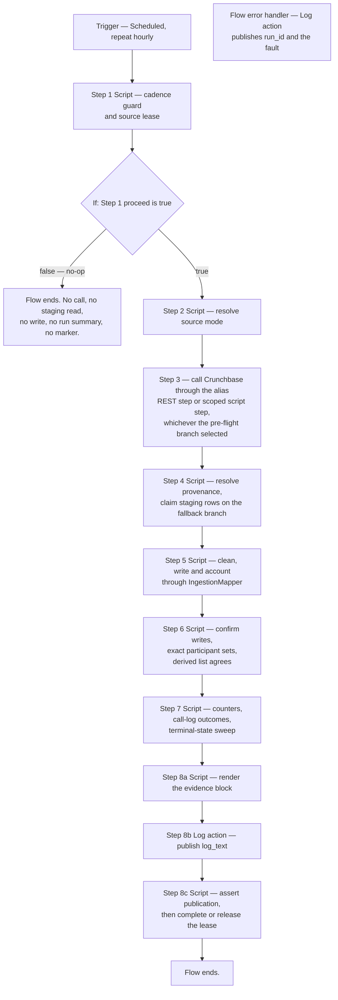

# Manual build 02 — Crunchbase ingestion flow — `x_bst_startuptrk`

This guide builds the Crunchbase ingestion flow of the ServiceNow scoped application `x_bst_startuptrk` by hand, on the instance, in Flow Designer. It specifies **one** scheduled flow built from **eight** numbered steps, and for each step it states the step type, every input to set, every data pill consumed, every output produced and the branch behaviour on each outcome. It also states, for each of the three live provider passes, the endpoint, the request body, the pagination cursor, the per-call error capture and the typed envelope the pass emits. It also states the trigger configuration, the activation procedure, the single manual run that confirms each step, how to read the flow execution log, and the completion criteria to satisfy before this guide is signed off.

**Authority.** The frozen prompt and the Agent Action Plan are authoritative for all application content. The Update Set XML at [`../../update-set/x_bst_startuptrk_boston_startup_tracker_update_set.xml`](../../update-set/x_bst_startuptrk_boston_startup_tracker_update_set.xml) is the authoritative source for every table name, column name, choice value, Script Include class name, method name and system-property key cited below; the identifiers used here match those records character for character, and the same identifiers appear in [`../data-model.md`](../data-model.md) and [`../api-reference.md`](../api-reference.md). No variant spelling of any identifier is valid. Where this guide and those records disagree, the records are checked against the prompt and the plan first; where the records match the specification, this guide is corrected to them.

This document carries **no rationale**. It states what to build and how to build it. Every decision behind this flow, every alternative considered and every risk it carries is recorded in [`../../../docs/decisions/DECISION_LOG.md`](../../../docs/decisions/DECISION_LOG.md), which is the single source of truth for "why". Five points in this guide depart from a literal reading of the requirements. Each is stated below as a build mechanic and cross-referenced to that log. None is argued here.

| # | Departure | Stated in |
| --- | --- | --- |
| 1 | An hourly trigger paired with an elapsed-time guard, in place of a trigger interval read from a property. | [1.1](#11--what-the-guard-compares), [The trigger](#the-trigger) |
| 2 | The split that assigns Startup, Investor and FundingRound to Crunchbase while Founder, Executive and JobPosting go to LinkedIn. | [6.1](#61--the-tables-this-flow-writes) |
| 3 | Step 3's outbound arm is selected by a **build-time pre-flight**, and the scoped script step is the fallback arm taken only when the generic Flow Designer REST step cannot supply the provider's header without a literal. | [3.1](#31--the-outbound-path-pre-flight-branch) |
| 4 | Cleaning rule 3's `Other` mapping is not applied to four choice columns whose binding lists declare no `Other` member. The deviation is logged, counted and flagged rather than resolved. | [5.4](#54--the-no-other-conflict-and-why-it-is-flagged-rather-than-resolved) |
| 5 | Three columns cannot be filled from the live provider at all, and one schema shape cannot represent what the provider reports. | [3.2](#32--the-three-passes) |

Operational warnings **are** in scope for this guide and are marked as such. The four warnings under [Operational warnings](#operational-warnings) are load-bearing and must not be skipped: two describe failures that surface at run time rather than at build time, one describes a retry loop that is visible only in the execution detail, and the fourth describes a failure that is entirely silent.

## Referenced documents

This guide is executable on its own. All eight steps, every property read, every table written, every cleaning rule, every log write, the trigger, the activation and the verification are stated here in full. An operator needs no other file to build the flow.

**Every document linked from this guide is delivered and readable**, so no link is a forward reference; each one is an in-scope artifact of this deliverable package. Nothing in this guide depends on reading another document first, with the single exception recorded in precondition 7.

| Document | What this guide takes from it |
| --- | --- |
| [`01-connection-credential-aliases.md`](01-connection-credential-aliases.md) | The alias name `x_bst_startuptrk.crunchbase_api` this flow binds to, [the provider wire contract](01-connection-credential-aliases.md#the-provider-wire-contract) that decides how step 3 authenticates, and [the credential posture](01-connection-credential-aliases.md#credential-posture) that decides how this flow's results may be labelled. |
| [`03-flow-linkedin-ingestion.md`](03-flow-linkedin-ingestion.md) | The companion flow. It is the same eight-step skeleton; steps 1, 2, 4, 5, 6, 7 and 8 are the same in both guides. **Step 3 differs materially**, because LinkedIn's `Authorization` header is platform-assembled and its live read surface is far narrower than Crunchbase's. |
| [`06-staging-table-csv-import.md`](06-staging-table-csv-import.md) | The load that puts rows into `x_bst_startuptrk_ingest_staging`, which step 4 reads. |
| [`05-atf-test-suites.md`](05-atf-test-suites.md) | The Automated Test Framework test that exercises this flow, and the `fallback validated` / `live validated` result label. |
| [`../manual-build-instructions.md`](../manual-build-instructions.md) | The split rule for the package as a whole: which artifacts ship as Update Set XML and which are built by hand. |
| [`../data-model.md`](../data-model.md) | The tables, columns, choice values, cascade rules and the `Investor.portfolio_count` derivation. |
| [`../access-control.md`](../access-control.md) | The role and ACL posture of the tables this flow writes. |
| [`../validation-checklist.md`](../validation-checklist.md) | Success criterion 4, which reads the run-summary evidence step 8 publishes. |
| [`../validation-gates.md`](../validation-gates.md) | The eleven post-commit gates of precondition 4. |
| [`../deployment-runbook.md`](../deployment-runbook.md) | The definition of a scheduled run, under [What counts as a scheduled run](../deployment-runbook.md#what-counts-as-a-scheduled-run). |
| [`../gaps-and-flags.md`](../gaps-and-flags.md) | The requirements with no clean platform equivalent, including the runtime-configurable schedule interval, the flagged cleaning-rule-3 conflict and the columns the live provider cannot supply. |
| [`../../update-set/x_bst_startuptrk_boston_startup_tracker_update_set.xml`](../../update-set/x_bst_startuptrk_boston_startup_tracker_update_set.xml) | **Authoritative** for every identifier this guide cites. |
| [`../../sample-data/README.md`](../../sample-data/README.md) | The column contract of the fallback dataset step 4 reads. |
| [`../../../docs/decisions/DECISION_LOG.md`](../../../docs/decisions/DECISION_LOG.md) | The single destination for every "why". |

## Position in the build order

This is **guide 02 of six**, and it is **step 2** of the execution order below. It runs immediately after guide 01, because this flow binds guide 01's alias **by name**. The order is stated in full in [`../manual-build-instructions.md`](../manual-build-instructions.md); it is repeated here so this guide can be run without it. The execution order is not the filename order: guide **06** runs before guide **05**.

| Step | Guide | What it builds, and what it depends on |
| --- | --- | --- |
| 1 | [`01-connection-credential-aliases.md`](01-connection-credential-aliases.md) | The two Connection & Credential Aliases the ingestion flows bind to by name. Nothing downstream can authenticate without them. |
| **2** | **This guide** | **The Crunchbase ingestion flow, which references `x_bst_startuptrk.crunchbase_api` by name.** |
| 3 | [`03-flow-linkedin-ingestion.md`](03-flow-linkedin-ingestion.md) | The LinkedIn ingestion flow, which references `x_bst_startuptrk.linkedin_oauth` by name. The identical skeleton. |
| 4 | [`04-service-portal-pages-and-widgets.md`](04-service-portal-pages-and-widgets.md) | The portal, theme, five pages and eight widgets. |
| 5 | [`06-staging-table-csv-import.md`](06-staging-table-csv-import.md) | The staging-table CSV load. |
| 6 | [`05-atf-test-suites.md`](05-atf-test-suites.md) | The Automated Test Framework suites, **last**, because they exercise everything the five preceding guides build. |

Guide **03** follows this one and is built from the same skeleton. A reader comparing the two guides must find **no discrepancy** in steps 1, 2, 4, 5, 7 and 8, which means:

- **Steps 1, 2, 7 and 8 are identical**, word for word in substance. The cadence guard, the source-mode resolution, the log-skip-continue contract and the run summary carry the same mechanics, the same properties and the same log events in both guides.
- **Steps 4 and 5 are identical in semantics**, with the source-system token substituted: guide 03 filters the staging table on `linkedin` rather than `crunchbase` and passes that token to the mapper, and the per-source translation table of pass one is the LinkedIn one. The three fallback triggers, the staging query shape, the four cleaning rules and the no-`Other` behaviour do not differ at all.
- **Only steps 3 and 6 differ substantively**: step 3 names a different alias and base URL and calls different resources, and step 6 writes `x_bst_startuptrk_founder`, `x_bst_startuptrk_executive` and `x_bst_startuptrk_jobposting` instead of this guide's four tables.

The staging load of step 5 in the order above sits **after** this guide, which means the fallback branch of [Step 4](#step-4--fall-back-to-the-staging-table) will find no rows until guide 06 has run. That is expected. Build the flow now and re-run the fallback branch after guide 06.

## Preconditions

Do not begin this guide until every item below holds.

| # | Precondition | How to confirm |
| --- | --- | --- |
| 1 | The Update Set has been uploaded and has reached the `loaded` state. | The `sys_remote_update_set` record shows `state` `loaded`. |
| 2 | The preview has completed with an **empty error-type problem set**. | A read of `sys_update_preview_problem` filtered to this remote update set and `type=error` returns an empty `result` array. Warnings are logged and do not block. |
| 3 | The Update Set has **committed**. | The `sys_remote_update_set` record shows `state` `committed`. |
| 4 | **All eleven post-commit gates have passed.** | Run every gate in [`../validation-gates.md`](../validation-gates.md) and record `pass` for all eleven in that document's evidence record. The aggregate pass condition is 11 of 11; there is no partial pass. |
| 5 | The eleven are the seven entity-table gates `GATE-TBL-01` through `GATE-TBL-07`, the three role-record gates `GATE-ROLE-01` through `GATE-ROLE-03`, and the one scope-record gate `GATE-SCOPE-01`. | Each table gate is a bounded read that returns `HTTP 200`; an empty `result` array is a pass. Any failure triggers the rollback of [`../deployment-runbook.md`](../deployment-runbook.md), with no exception. |
| 6 | **Guide 01 is complete and the credential posture is recorded.** | [`01-connection-credential-aliases.md`](01-connection-credential-aliases.md) has been run to completion and its [Step 0](01-connection-credential-aliases.md#step-0--establish-the-credential-posture) posture row for `x_bst_startuptrk.crunchbase_api` is recorded. **Either posture satisfies this precondition** — see [Credential posture](01-connection-credential-aliases.md#credential-posture), which separates the build gate from the live-validation gate. Copy the alias name from the propagation table of [Step 4](01-connection-credential-aliases.md#step-4--propagate-both-alias-names-into-guides-02-and-03) rather than typing it; see [Operational warnings](#operational-warnings). |
| 7 | The four Script Includes this flow calls into are on the instance. | `sys_script_include` carries `AppProperties`, `IngestionMapper`, `IngestionLogger` and `InvestorPortfolioService`, all in the `x_bst_startuptrk` scope. |
| 8 | The four scoped system properties this flow reads or writes are on the instance. | `sys_properties` carries `x_bst_startuptrk.ingestion.cadence_hours`, `x_bst_startuptrk.ingestion.source_mode`, `x_bst_startuptrk.ingestion.last_run_provenance` and `x_bst_startuptrk.crunchbase.base_url`. **`x_bst_startuptrk.ingestion.last_run_provenance` is the flow's durable cadence marker and its source lease in one**: it carries one entry per source system, it ships empty, and this source's entry is claimed by step 1 and settled by step `8c`. `x_bst_startuptrk.crunchbase.base_url` is the endpoint authority and carries no run state. Its format is stated in [The source lease](#the-source-lease). |
| 9 | The four tables this flow writes are on the instance. | `x_bst_startuptrk_startup`, `x_bst_startuptrk_investor`, `x_bst_startuptrk_fundinground` and `x_bst_startuptrk_m2m_round_investor` all open in the list view. Gates `GATE-TBL-01`, `GATE-TBL-04` and `GATE-TBL-05` cover three of the four. |
| 10 | The staging table this flow reads on the fallback branch is on the instance. | `x_bst_startuptrk_ingest_staging` opens in the list view. It ships with `ws_access` **false**, so confirm it in the list view and not over the Table API. |
| 11 | The three business rules that maintain the derived columns are on the instance and **active**. | `sys_script` carries `Trim and validate startup`, `Recalculate investor portfolio on funding round` and `Recalculate investor portfolio on round investor link`, all `active` true, all in the `x_bst_startuptrk` scope. |
| 12 | You are working in the `x_bst_startuptrk` application scope. | The application picker reads **Boston Startup Tracker**. Every record this guide creates must carry that scope. |
| 13 | You hold a role that can create and publish a flow. | You can open Flow Designer, create a flow in the `x_bst_startuptrk` scope, and see the **Activate** control on a saved flow. |

### What is not captured into the Update Set

Only tables carrying the update-synch attribute are captured into `sys_update_xml` records, and adding that attribute to a table that lacks it out of the box is unsupported. The Flow Designer tables are outside the captured set, so this flow is built through the platform interface instead — which is why the delivered Update Set contains **zero** flow records. [`../manual-build-instructions.md`](../manual-build-instructions.md) owns the split rule for the package as a whole.

## Platform constraint

**IntegrationHub spokes are forbidden.** Prompt section 4.0 binds this absolutely. Do **not** install, activate, reference or open any spoke content set, and do not use a spoke action anywhere in this flow. A generic REST step is not a spoke, and neither is a scoped script step. Both of the outbound paths in [3.1](#31--the-outbound-path-pre-flight-branch) reference the alias established in guide 01 **by name** and neither installs spoke content.

**No credential material appears anywhere in this flow.** Not in the flow record, not in a flow input, not in a step input, not in a script step, not in a test payload, and not in the Update Set. The alias is referenced by name and the platform resolves the secret at run time. Guide 01 holds the credential records; this guide never reads their values and never prints them.

**The outbound path is decided by a build-time pre-flight branch, and the generic Flow Designer REST step is the primary path.** The Agent Action Plan makes the REST step primary and the scoped script step its entitlement fallback, and it requires this guide to document the branch and then follow one arm of it. [3.1](#31--the-outbound-path-pre-flight-branch) states the two checks that decide, what each arm builds, and what must be recorded before the flow is activated. Do not build both arms.

**Crunchbase authenticates with an `X-cb-user-key` request header and does not accept HTTP Basic authentication.** The alias's credential record is of type `Basic Auth`, which is the platform class that stores a password rather than the protocol Crunchbase speaks; the key sits in that record's Password field. This is stated once and in full in [The provider wire contract](01-connection-credential-aliases.md#the-provider-wire-contract). Whether the primary REST-step arm can carry that header without a literal secret is exactly what the pre-flight branch establishes.

**The base URL is not activated until guide 01's authenticated probe has passed.** `x_bst_startuptrk.crunchbase.base_url` ships as `https://api.crunchbase.com/api/v4`. Crunchbase publishes its current v4 surface under a `/v4/data` prefix as well, and the entitled root differs by licence, so the shipped value is a default rather than an established fact. Guide 01 [Step 3.1](01-connection-credential-aliases.md#step-31--probe-crunchbase-with-the-provider-correct-header) is the authenticated provider-correct probe that establishes it, and its outcome is a **hard activation gate**: see [Activation](#activation). If the probe reaches the provider under a different root, correct the non-secret property and the alias's connection record to that root and re-probe before activating. Neither value is a secret and neither is edited inside this flow.

## Which route to build

**This flow is built either way, and one of two routes is selected by what guide 01 recorded for Crunchbase.** Neither route is a degraded mode; both produce a complete run with a run summary, a provenance marker and criterion-4 evidence.

| Guide 01 recorded | Route | What you build | What you do **not** build |
| --- | --- | --- | --- |
| `pass` | **Live-first** | Every step of this guide, including step 3's REST or script call and step 4's fallback on failure | — |
| `fail`, or `n/a — unprovisioned, fallback only` | **Forced fallback** | Steps 1, 2, 4, 5, 6, 7 and 8 exactly as written | **Step 3 in full.** No REST step, no script call, no alias reference, no credential resolution |

### The forced-fallback route, in five instructions

1. **Set the property.** `x_bst_startuptrk.ingestion.source_mode` to `fallback`. Step 2 reads it and resolves the provenance to `fallback` before anything else happens.
2. **Omit step 3 entirely.** Do not add the REST step. Do not add the script step. Do not type the alias name anywhere in the flow. There is nothing to resolve and nothing that can fail.
3. **Wire step 4 as the first data step.** Its `live_ok` input is a literal `false` rather than a data pill from step 3, and its `provenance` output is `fallback`. Everything downstream is unchanged: step 4 reads the staging table, step 5 cleans, step 6 writes, step 7 logs, step 8 summarises.
4. **Load the staging table first.** The route's input is the pending rows loaded by [`06-staging-table-csv-import.md`](06-staging-table-csv-import.md). A forced-fallback run over an empty staging table is a valid run that ingests nothing, which is not the evidence criterion 4 needs.
5. **Label every result `fallback validated`.** Never `live validated`, whatever the run appears to show. Success criterion 4 of [`../validation-checklist.md`](../validation-checklist.md) explicitly accepts the sample-dataset substitute on exactly this condition.

### Switching to live later, without rebuilding

When the alias is provisioned and tests green, the flow does **not** need rebuilding. Add step 3 on whichever path [3b](#31--the-outbound-path-pre-flight-branch) selects, repoint step 4's `live_ok` and `response_body` inputs at its outputs, and set `source_mode` back to `live`, which is the value the branch rule then requires. `source_mode` is **one shared setting for both flows**, so the branch rule reaches `live` only when **both** aliases are provisioned with a passing connection test; see [`06-staging-table-csv-import.md#restoring-source_mode-is-readiness-determined-not-a-return-to-live`](06-staging-table-csv-import.md#restoring-source_mode-is-readiness-determined-not-a-return-to-live). The cadence guard, the mapper call, the write step, the log step and the summary step are untouched. **That is why the fallback route is documented as a first-class construction path rather than as a fork**: the live call is an addition to a working flow, not a precondition of building one.

### Capture rule for this artifact class

Only tables carrying the update-synch attribute are captured into `sys_update_xml` records, and adding that attribute to a table that lacks it out of the box is unsupported. The Flow Designer and Action Designer tables are outside the captured set, so the actions and the flow are built through the platform interface. The delivered Update Set therefore contains **zero** flow records and **zero** action records. [`../manual-build-instructions.md`](../manual-build-instructions.md) owns the split rule for the package as a whole, and the decision is recorded at `D-074`.


## What this guide builds

One record, containing eight steps.

| Artifact | Count | Table | Notes |
| --- | --- | --- | --- |
| Scheduled flow | 1 | `sys_hub_flow` | Built in Flow Designer, in the `x_bst_startuptrk` scope. |
| Flow trigger | 1 | Scheduled, **repeat hourly** | See [The trigger](#the-trigger). The hourly repeat is deliberate and is paired with the guard of step 1. |
| Flow steps | 8 | — | Numbered 1 to 8 below. Step 8 is built as three consecutive parts — `8a` a Script step that renders, `8b` the Log action, `8c` a Script step that asserts and completes the run. **Every step from 2 to 8c sits inside the single `If` block controlled by step 1.** [The flow graph](#the-flow-graph) is the one authoritative statement of the structure. |
| Log action | 1 | Utilities → Log | Part `8b`. It is what puts the ingestion events into the flow execution log; see [8.5](#85--publishing-the-events-to-the-flow-execution-log). |
| Flow error handler | 1 | Utilities → Log | One handler on the flow, for a platform fault no step catches. See [The flow graph](#the-flow-graph). |

The flow reads **six** system properties — `ingestion.cadence_hours`, `ingestion.source_mode`, `ingestion.last_run_provenance`, `crunchbase.base_url`, `inclusion.location_tokens` and `logging.level` — and writes exactly **one** of them, `ingestion.last_run_provenance`, reads and writes **one** staging table, writes **four** entity and join tables, calls **four** Script Includes, and emits **thirty-three** distinct kinds of log record — eleven `IngestionLogger` events, nine step lines it writes itself, and thirteen further step lines that appear only on a failure path. Each is enumerated in its own step, and they are inventoried together in [7.2](#72--every-log-record-this-flow-can-write), which also states the difference between the application log and the flow execution log.

### The flow graph

**This is the single authoritative statement of the flow's structure.** Where any other sentence in this guide appears to place a step differently, this graph governs.



Three structural rules follow from that graph, and each is enforced in the step that owns it.

| # | Rule | What follows from it |
| --- | --- | --- |
| 1 | **No step from 2 to 8c throws.** Each wraps its own body and records a failure in its own `step_error` output rather than raising. | Control therefore always reaches `8a`, `8b` and `8c`, so the evidence is published on a failed batch without needing a step outside the `If`. Placement outside the block would additionally make `8a` run on the roughly twenty-three no-op executions of every day, publishing an empty evidence block each time. |
| 2 | **A no-op publishes nothing at all.** When the guard sets `proceed` `false` the flow ends immediately after the `If`. | [1.5](#15--the-early-exit) states the same thing, and it is how a no-op is told apart from a scheduled run in the execution detail: a no-op carries exactly one log line, the guard's. |
| 3 | **The flow carries one error handler**, a single Log action publishing the run identifier and the platform fault. | It exists for a fault no step can catch — a transaction cancellation or a scripting engine failure. It is not part of the control flow and no step depends on it. |

## The flow record

Create the flow first, with no steps, then add the steps in order.

1. Set the application picker to **Boston Startup Tracker**.
2. Open **Flow Designer**, then **New**, then **Flow**.
3. Set the fields below.

| Field | Value | Notes |
| --- | --- | --- |
| **Flow name** | `Crunchbase Ingestion` | The internal name derives from this. Guide 03 uses `LinkedIn Ingestion`. |
| **Application** | `Boston Startup Tracker` | The `x_bst_startuptrk` scope. Confirm this before saving; a flow created in Global cannot be moved into the scope afterwards. |
| **Description** | `Ingests Crunchbase organisation and funding-round data into x_bst_startuptrk_startup, x_bst_startuptrk_investor, x_bst_startuptrk_fundinground and x_bst_startuptrk_m2m_round_investor on the configured cadence. Implements prompt section 4.0 scheduled ingestion.` | The description convention across this package is a **pointer**: it states what the artifact does and which requirement it implements. It never states why. |
| **Run As** | **System User** | A scheduled flow has no initiating user. This setting also governs whether the alias resolves; see [Operational warnings](#operational-warnings). |
| **Protection** | `None` | |
| **Run With Roles** | leave empty | The flow must not acquire roles beyond its run-as identity. |

4. Save the flow. Do not activate it yet — activation is [its own step](#activation), after all eight steps are built and one manual run has passed.

### The run identifier

Every step of this flow carries a **run identifier**, minted once by step 1 and passed as a data pill into steps 4, 5, 6, 7 and 8. Its format is the source-system token, a hyphen, a fourteen-digit timestamp, a hyphen, then **sixteen hexadecimal characters taken from a fresh platform GUID**:

```text
crunchbase-20260807143000-4f2c1ab97e6d8035
```

**The GUID suffix is not decorative and the timestamp alone is not sufficient.** A fourteen-digit timestamp has one-second resolution, so two executions that start within the same second mint the identical identifier — which a retried execution, a manual test run beside a scheduled one, or two clones sharing an instance can all produce. Every per-record log line, every staging-row claim and the run-completion marker are keyed on this value, so a collision merges two runs' evidence into one indistinguishable set and lets one run settle the other's claimed rows. The GUID suffix makes the identifier unique per execution regardless of timing.

The **prefix is equally load-bearing**: `IngestionLogger.sourceOfRun()` falls back to the text before the first hyphen when a caller names no source, and `AppProperties` accepts only `crunchbase` and `linkedin` as source tokens. Guide 03 mints `linkedin-<yyyyMMddHHmmss>-<16 hex>` by the same rule. Do not shorten the identifier, do not omit the prefix, do not drop the GUID suffix, and do not reuse an identifier across executions.

`AppProperties._runToken()` accepts word characters, dots and hyphens up to 64 characters and strips everything else, so this form passes through the run-state marker unaltered. Strip the hyphens out of the GUID before appending it; a raw `gs.generateGUID()` is 32 characters with no separators on this platform, and taking its first 16 keeps the identifier inside the token budget with room to spare.

### The source lease

**Two concurrent executions of this flow must not ingest the same source at the same time.** They would claim each other's staging rows, interleave their entity writes, and each settle the other's run-completion marker. Nothing in a scheduled trigger prevents it: an execution that overruns its hour is still running when the next hourly trigger fires, and a manual test run can start beside a scheduled one at any moment.

Step 1 therefore takes a **named lease on the source** before the flow does any work, through `AppProperties.acquireRunLease('crunchbase', run_id)`. The lease is a genuine compare-and-set on the single run-state property `x_bst_startuptrk.ingestion.last_run_provenance`: the method reads the property's current value, and writes the new marker set with **one guarded conditional update** whose condition is that the property still carries the value it read. Of two executions reaching the method with the same prior value, exactly one changes it and the other matches nothing. The value is then read back **from the property record** rather than through the cached property API, and the method reports whether the run identifier that came back is this run's. The result also carries an `atomic` member: `false` means the guarded write applied nothing and the property API was used instead — logged at warn — which is the one condition under which two runs could both proceed.

| Lease outcome | `acquireRunLease` returns | What step 1 does |
| --- | --- | --- |
| No marker, or a marker already held by this run | `ok` `true` | Proceed. This execution owns the source. |
| A `running` marker held by another run, younger than the cadence | `ok` `false` with `holder` naming it | **Do not proceed.** Record the holder and end as a no-op. The other run is still working. |
| A `running` marker held by another run, older than the cadence | `ok` `true` — the stale claim is taken over | Proceed. A run interrupted by a platform fault cannot block the source forever. |
| A `succeeded` marker from an earlier completed run | `ok` `true` | Proceed. The cadence guard has already decided the interval elapsed. |
| Another run won the guarded update | `ok` `false`, `reason` `another run took this source` | **Do not proceed.** Record the holder and end as a no-op. |
| The claim could not be written at all | `ok` `false` with the reason | **Do not proceed.** Record the reason and end as a no-op. |
| The claim was written but not atomically | `ok` `true`, `atomic` `false` | Proceed, and **record `atomic` in the run evidence**. The property record was not writable through the record API on this instance, so exclusion rests on the cadence guard alone for this run. |

**The lease is released exactly once, by step `8c`.** A healthy run calls `IngestionLogger.markRunComplete()`, which turns the `running` marker into the `succeeded` marker the cadence guard reads. A run that is not healthy calls `AppProperties.releaseRunLease()`, which drops the claim without recording a success, so the next hourly trigger may retry immediately. [8.6](#86--part-8c--assert-publication-then-complete-or-release-the-lease) states both paths. A run that dies hard leaves a `running` marker, which the cadence-aged takeover above clears.

**The completion is refused unless this run still holds the source, and that is why the lease is not optional.** `AppProperties.completeRun(source, run, provenance)` — the call behind `IngestionLogger.markRunComplete()` — reads the run-state marker back before it writes, and refuses with `this run does not hold this source` when the marker names a different run, or with `another run took this source` when the marker changed between its write and its read-back. Three consequences follow, and each is a build rule rather than a caution:

| Condition | What `completeRun` does | What the flow must therefore do |
| --- | --- | --- |
| Step 1 acquired the lease and no other run intervened | Writes the `succeeded` marker and reads it back | Nothing further. This is the normal path. |
| Step 1 never acquired the lease — the `If` was bypassed, the guard's `proceed` was ignored, or the action was reordered | **Refuses.** No marker is written | Never call `markRunComplete()` on a run that did not acquire the lease. A build that reorders step `8c` before step 1, or that runs the ingestion outside the `If`, produces `run_completion_refused` on every execution and never advances the cadence. |
| A stale claim was taken over by a later run while this one was still working | **Refuses**, naming the run that took it | Accept the refusal. `8c` marks the run unhealthy with `completion_refused` and releases nothing, because the source no longer belongs to this run. |

**A refusal is never silent and never partial.** It writes `run_completion_refused` at `error` with the reason, `8c` sets `healthy` `false`, the cadence marker is left as it was, and the next hourly trigger re-runs the source. What it does **not** do is stamp a `succeeded` marker for work another run owns — which is the outcome the read-back exists to prevent, because a marker written by the wrong run advances the cadence gate for a window in which nothing was ingested.

**The lease is taken after the cadence check, never before.** With the shipped 24-hour cadence roughly twenty-three of every twenty-four executions are no-ops, and a lease taken before the cadence check would have every one of them write the run-state property.

## The action records

Build all seven actions **before** creating the flow. A flow cannot reference an unpublished action, and an action's inputs and outputs are not offered to a flow until it is published.

### The Action Designer procedure, applied to every action

Run these eleven items once per action. They are identical for all seven; only the name, the inputs, the outputs and the steps differ.

1. Set the application picker to **Boston Startup Tracker**, so the action is created in the `x_bst_startuptrk` scope. An action created in Global cannot be moved into the scope afterwards.
2. Open **Flow Designer**, then **New**, then **Action**.
3. Set **Action name** to the name in [The seven actions, and the steps each one implements](#the-seven-actions-and-the-steps-each-one-implements). The **Internal name** is generated from it; confirm it matches the internal name in the table and do not type over it.
4. Set **Application** to **Boston Startup Tracker**. Set **Description** to a statement of what the action does and which requirement it implements, never why — for A1, `Compares elapsed time since the last Crunchbase run summary against x_bst_startuptrk.ingestion.cadence_hours, takes the source lease and mints the run identifier. Implements prompt section 4.0 configurable cadence.`, and for each of the others the same form naming that action's steps.
5. Set **Protection** to `None`, and leave **Accessible from** at the scoped default. Do **not** set **Run With Roles**: the action must not acquire a role beyond the identity the flow runs as.
6. Open the **Inputs** section and add each declared input with its exact name, type and mandatory flag. Input names are referenced from the step scripts as `inputs.<name>`, so a spelling variance is a run-time failure.
7. Add the steps in the order [The seven actions, and the steps each one implements](#the-seven-actions-and-the-steps-each-one-implements) gives. The step type is stated per step. A Script step is **Script** under **Utilities**; a REST step is **REST** under **Integration**; the Log step of A7 is **Log** under **Utilities**.
8. Open the **Outputs** section and add each declared output with its exact name and type. Output names are assigned in the step scripts as `outputs.<name>`.
9. In each Script step, map every action input the script reads onto the step's own input pills, and map every action output onto the step's declared output variables. **An output that is not declared on the action is not visible to the flow**, whatever the script assigns to it.
10. Save, then click **Publish**. An action in the `Draft` state is invisible to Flow Designer. Confirm the action's state reads `Published` before leaving it.
11. Record the action's name, internal name and published state in the [Build verification](#build-verification) table.

### The seven actions, and the steps each one implements

**Every numbered step of this guide lives in exactly one action, and every value a later action consumes is a declared output of an earlier one.** That is the whole rule, and it is what makes the flow assemblable from published actions with no step on the flow itself.

| # | Action name | Internal name | Step types it contains | Numbered sections it implements |
| --- | --- | --- | --- | --- |
| **A1** | `Cadence Guard` | `cadence_guard` | 1 Script | [Step 1](#step-1--cadence-guard) |
| **A2** | `Resolve Source Mode` | `resolve_source_mode` | 1 Script | [Step 2](#step-2--resolve-the-source-mode) |
| **A3** | `Fetch Crunchbase Payload` | `fetch_crunchbase_payload` | **2 steps**: the live-call step — a Script step in the delivered variant, a REST step in the variant of [3a](#the-generic-rest-step-is-not-buildable-for-this-source) — followed by 1 Script step | [Step 3](#step-3--call-crunchbase-through-the-alias) is its first step, [Step 4](#step-4--fall-back-to-the-staging-table) its second |
| **A4** | `Ingest Crunchbase Batch` | `ingest_crunchbase_batch` | 1 Script | [Step 5](#step-5--clean-write-and-account-for-every-record-through-ingestionmapper) |
| **A5** | `Confirm Crunchbase Writes` | `confirm_crunchbase_writes` | 1 Script | [Step 6](#step-6--confirm-the-writes-the-participant-rows-and-the-derived-columns) |
| **A6** | `Reconcile Batch Counters` | `reconcile_batch_counters` | 1 Script | [Step 7](#step-7--log-skip-the-record-continue-the-run) |
| **A7** | `Publish Run Evidence` | `publish_run_evidence` | **3 steps**: 1 Script, then 1 **Log** action step, then 1 Script | [Step 8](#step-8--publish-the-run-evidence-and-close-the-run), as its three parts `8a`, `8b` and `8c` |

**All seven are mandatory and all seven are called by the flow.** There is no published-but-unwired action, and no diagnostic action.

### Each action's inputs and outputs are its steps' inputs and outputs

**An action declares exactly the inputs and outputs its steps declare, with the same names and the same types.** Those declarations are stated once, in the numbered step that owns them, and are not restated here — restating them is how the two drifted apart in an earlier build. Read each action's signature from the section named in the table below, and declare on the action every output variable that section lists.

| Direction | Name | Type | Mandatory | Meaning |
| --- | --- | --- | --- | --- |
| Input | `run_id` | String | Yes | From A1's `run_id`. |
| Output | `source_mode` | String | — | `live` or `fallback`. |
| Output | `attempt_live` | True/False | — | `true` when `source_mode` is `live`. A3 reads it to decide whether to attempt the outbound call. |

Contains one Script step, specified in [2.4](#24--the-step-script). **Error handling:** an unreadable or unrecognised property value resolves to `fallback`, which is the safe direction: it degrades to the sample dataset rather than attempting an unauthenticated live call.

### A3 — `Fetch Crunchbase Payload`

**Description:** `Fetches Crunchbase organisation and funding-round payloads through the x_bst_startuptrk.crunchbase_api alias, and falls back to x_bst_startuptrk_ingest_staging on an authentication failure, a timeout or a malformed response. Implements prompt section 4.0 live-with-fallback acquisition.`

**The base URL is not an action input.** The property `x_bst_startuptrk.crunchbase.base_url` is the **single endpoint authority**, read through `AppProperties.getCrunchbaseBaseUrl()`, so no URL is carried on the flow. The alias's connection record must carry the **same** value — the platform requires a URL on a connection record — and that record is the property's required mirror, not a second authority. Precondition 8 confirms the property is present, and criterion 4 of [`01-connection-credential-aliases.md`](01-connection-credential-aliases.md) confirms the two are equal.

| Direction | Name | Type | Mandatory | Meaning |
| --- | --- | --- | --- | --- |
| Input | `run_id` | String | Yes | From A1's `run_id`. |
| Input | `source_mode` | String | Yes | From A2's `source_mode`. |
| Output | `provenance` | String | — | `live` or `fallback`. The value A4 stamps on every record and on the run summary. |
| Output | `rows` | String | — | The row set as a JSON array string, and **the row set A4 ingests on both branches**: the typed live envelopes of [Step 3](#step-3--call-crunchbase-through-the-alias) on the live branch, and one `{ record_type, staging_id }` envelope per **claimed** staging row on the fallback branch. |
| Output | `row_count` | Integer | — | The number of rows in `rows`. |
| Output | `staged_ids` | String | — | A JSON array of the `sys_id` values of the staging rows this run **claimed**, in the order read. Empty array string on the live branch. Step 7 sweeps it. |
| Output | `claimed_count` | Integer | — | How many staging rows this run claimed, so a corrupted `staged_ids` string is detectable rather than silently empty. |
| Output | `fallback_reason` | String | — | Empty on the live branch; otherwise `auth_failure`, `timeout`, `malformed_response` or `source_mode`. |
| Output | `step_error` | String | — | Empty on success. Set when the live row pill could not be parsed, which is a failure of this step rather than of the provider. |

Contains **two** steps, in this order:

| # | Step | Specified in | Produces |
| --- | --- | --- | --- |
| **A1** | [1.2](#12--step-inputs) — none | [1.3](#13--step-outputs) | 7 |
| **A2** | [2.2](#22--step-inputs) | [2.3](#23--step-outputs) | 2 |
| **A3** | [3.3](#33--step-inputs) for its first step and [4.2](#42--step-inputs) for its second; the action's own inputs are `run_id` and `source_mode` | [3.4](#34--step-outputs) **and** [4.3](#43--step-outputs) | 11 + 7 = 18 |
| **A4** | [5.1](#51--step-inputs) | [5.2](#52--step-outputs) | 15 |
| **A5** | [6.6](#66--step-inputs) | [6.7](#67--step-outputs) | 10 |
| **A6** | [7.6](#76--step-inputs) | [7.7](#77--step-outputs) | 14 |
| **A7** | [8.3](#83--part-8a--the-step-inputs-and-outputs) for `8a` and [8.6](#86--part-8c--assert-publication-then-complete-or-release-the-lease) for `8c` | [8.3](#83--part-8a--the-step-inputs-and-outputs) **and** [8.6](#86--part-8c--assert-publication-then-complete-or-release-the-lease) | 8 + 7 = 15 |

The variant of step 1 is chosen by the pre-flight check of [3b](#31--the-outbound-path-pre-flight-branch); step 2 is identical in both variants, which is why the published action signature does not change with the variant. **Error handling:** every failure mode is caught inside the action and converted into a `fallback_reason` plus a `provenance` of `fallback`. The action never throws, because an ingestion run must degrade rather than halt.

### A4 — `Ingest Crunchbase Batch`

**Description:** `Cleans, deduplicates, upserts and links one Crunchbase batch through IngestionMapper on a single IngestionLogger instance, and writes the run summary and provenance marker. Implements prompt section 4.0 cleaning rules and section 8.0 skip-and-continue error handling.`

| Direction | Name | Type | Mandatory | Meaning |
| --- | --- | --- | --- | --- |
| Input | `run_id` | String | Yes | From A1's `run_id`. |
| Input | `provenance` | String | Yes | From A3's `provenance`. |
| Input | `rows` | String | No | From A3's `rows`. Ingested on **both** branches: the typed live envelopes on the live branch, the claimed staging envelopes on the fallback branch. |
| Output | `processed` | Integer | — | Records written. |
| Output | `rejected` | Integer | — | Records rejected for a missing mandatory field. |
| Output | `skipped` | Integer | — | Records skipped after a per-record error. |
| Output | `duplicates` | Integer | — | Records collapsed by the deduplication rule. |
| Output | `unmatched` | Integer | — | Choice values normalised to `Other`. |
| Output | `recorded` | True/False | — | `true` when the run summary was written. |

Contains one Script step, specified in [8.8](#88--one-ingestion-call-site-and-the-two-entry-points-it-may-use). **Error handling:** the orchestrator applies the skip-the-record-and-continue-the-run contract of [7.1](#71--the-contract-every-step-must-honour) per record, and wraps the whole batch so that a batch-level fault still writes a run summary carrying the counters accumulated up to that point.

### A5 — `Reconcile Batch Counters`

**Description:** `Sums per-phase ingestion counters into run totals and writes one reconciliation line. Diagnostic action; not called by the delivered flow. Implements prompt section 8.0 flow-execution-log reporting.`

| Direction | Name | Type | Mandatory | Meaning |
| --- | --- | --- | --- | --- |
| Input | `run_id` | String | Yes | The run identifier to correlate on. |
| Input | `row_count` | Integer | No | Incoming rows, from A3's `row_count`. |
| Input | `accepted_count` | Integer | No | From the cleaning phase. |
| Input | `rejected_count` | Integer | No | From the cleaning phase. |
| Input | `duplicate_count` | Integer | No | From the cleaning phase. |
| Input | `written_count` | Integer | No | From the upsert phase. |
| Input | `skipped_count` | Integer | No | From the upsert phase. |
| Output | `processed` | Integer | — | Records written. |
| Output | `rejected` | Integer | — | Rule-4, refusal and over-length rejections. |
| Output | `skipped` | Integer | — | Operational skips. |
| Output | `duplicates` | Integer | — | Rule-2 within-batch duplicates. |
| Output | `unmatched` | Integer | — | Rule-3 values that matched no choice member. |
| Output | `reconciled` | True/False | — | `true` when every incoming row is accounted for. |

Contains one Script step, specified in [7.7](#78--the-step-script). **Error handling:** the script performs integer coercion only and cannot fail on a missing input; an absent pill coerces to `0`.

**Published, and not called by the delivered flow.** The delivered flow calls A1, A2, A3 and A4; A5 is called only by the diagnostic variant of [8.8](#88--one-ingestion-call-site-and-the-two-entry-points-it-may-use), in which the four ingestion phases are separate actions and their counters must be summed. Publish it with the others so that variant is assemblable without editing the delivered flow, and do **not** add it to the delivered flow. `D-102` carries the decision.

1. **A3 and A7 each publish the union of their two or three steps' outputs.** A3 carries step 3's eleven and step 4's seven, because step 7 consumes `call_log`, `failed_calls`, `truncated` and `budget_hit` from step 3 while step 5 consumes `rows` and `provenance` from step 4 — both sets have to leave the action. A7 carries `8a`'s eight and `8c`'s seven. Where the two steps of an action both declare a name — `rows` and `row_count` appear in both [3.4](#34--step-outputs) and [4.3](#43--step-outputs) — **the later step's value is the one the action publishes**, because step 4 resolves the provenance and rewrites both for the branch actually taken.
2. **An output the script assigns but the action does not declare is invisible**, to the flow and to the ATF suite. After publishing each action, open the flow's data panel and confirm every output in the table above appears under it.
3. **Nothing is declared that no script assigns.** Each step's `### x.y — Step outputs` table is the authority in both directions.

### Assembling the flow from the published actions

The flow contains **eight builder elements and nothing else**: seven action calls and one `If` block. There is no REST step, no Script step and no Log step on the flow itself — every one of those lives inside an action. Position 1 sits outside the `If`; positions 3 to 8 sit inside it.

| Position | Flow item | What to add | Inputs to map |
| --- | --- | --- | --- |
| 1 | **Action** | **Action** → `Cadence Guard` (A1). | `source_system` = the literal `crunchbase`. |
| 2 | **Flow logic** | **If**, with the condition **A1 → `proceed`** `is` `true`. Positions 3 to 8 sit **inside** this block. | — |
| 3 | **Action**, inside the `If` | **Action** → `Resolve Source Mode` (A2). | `run_id` = **A1 → `run_id`**. |
| 4 | **Action**, inside the `If` | **Action** → `Fetch Crunchbase Payload` (A3). | `run_id` = **A1 → `run_id`**; `source_mode` = **A2 → `source_mode`**. |
| 5 | **Action**, inside the `If` | **Action** → `Ingest Crunchbase Batch` (A4). | `run_id` = **A1 → `run_id`**; `provenance` = **A3 → `provenance`**; `rows` = **A3 → `rows`**. |
| 6 | **Action**, inside the `If` | **Action** → `Confirm Crunchbase Writes` (A5). | `run_id` = **A1 → `run_id`**; and every pill [6.6](#66--step-inputs) names, from A4. |
| 7 | **Action**, inside the `If` | **Action** → `Reconcile Batch Counters` (A6). | `run_id` = **A1 → `run_id`**; and every pill [7.6](#76--step-inputs) names, from A3 and A4. |
| 8 | **Action**, inside the `If` | **Action** → `Publish Run Evidence` (A7). | `run_id` = **A1 → `run_id`**; and every pill [8.3](#83--part-8a--the-step-inputs-and-outputs) and [8.6](#86--part-8c--assert-publication-then-complete-or-release-the-lease) name, from A3, A4, A5 and A6. |

Three rules govern the mapping, and each is a build step:

1. **Map data pills; never retype a value.** Pick each pill from the data panel. A typed literal in place of a pill compiles and then carries a stale or empty value at run time.
2. **`source_system` at position 1 is the only literal on the flow.** Everything else is a pill from an earlier action's output.
3. **If an action's output does not appear in the data panel, the action is not published.** Return to item 10 of [The Action Designer procedure, applied to every action](#the-action-designer-procedure-applied-to-every-action) and publish it; do not work around it by adding a step to the flow.

`Fetch Crunchbase Payload` through `Publish Run Evidence` all run unconditionally inside the `If`. None needs a further condition: A3 resolves its own live-or-fallback branch internally and always emits a `provenance`, and each later action acts on whatever it receives and records a fault in its own `step_error` rather than raising.

## Step 1 — Cadence guard

**Step type:** Script (Utilities → Script), followed by one `If` flow-logic block.

This is the **first action after the trigger** and it runs on every execution, including the many that do no work. It decides whether this execution is a scheduled run or a no-op.

### 1.1 — What the guard compares

The guard compares the **elapsed time since the last run summary this flow wrote** against the cadence, in hours.

The cadence is the scoped property `x_bst_startuptrk.ingestion.cadence_hours`. Its shipped value is **24**. It is **clamped to the range 6 to 48**. The clamp is owned by the `AppProperties` Script Include, which exposes it as `AppProperties.getCadenceHours()`. **Do not re-implement the clamp in the flow.** Read the value through that method and use whatever it returns: a stored value below 6 returns 6, a stored value above 48 returns 48, and a stored value that is absent or not an integer returns the default of 24. Changing the cadence at run time is done by editing that one property and nothing else — no flow edit, no re-publish.

The last-run marker is the **`crunchbase` entry of the single run-state property `x_bst_startuptrk.ingestion.last_run_provenance`**, read through `AppProperties.getLastSuccessAt('crunchbase')`. That method returns the entry's timestamp in `yyyy-MM-dd HH:mm:ss` form **only when the entry's state is `succeeded`**, and the empty string otherwise — so a source that has never completed a run, and a source whose only marker is an in-flight `running` claim, both read as no marker at all. Step `8c` turns the claim into the `succeeded` entry, and only on a healthy run. A no-op writes nothing, so consecutive no-ops never move the marker forward.

The property holds one entry per source system, in the form `source=provenance|state|stamp|run`, entries joined by a semicolon. `AppProperties` owns the format completely — `readRunMarkers()`, `acquireRunLease()`, `completeRun()` and `releaseRunLease()` are the only readers and writers, and the property is written only when the serialised value actually changes. **Do not parse or write that property from the flow.** One property carrying both sources still keeps their cadences independent, because every accessor is keyed on the source token: guide 03 reads and writes the `linkedin` entry of the same property and the two never overlap.

**The marker is a property, not a log record.** The property is durable, is unaffected by `x_bst_startuptrk.logging.level`, and is not subject to log rotation, so the cadence guard reads the same value whatever the log severity threshold and whatever has been pruned. **Nothing in this flow reads the application log to establish cadence or provenance.**

### 1.2 — Step inputs

None. The guard takes no data pill; it reads two scoped properties and nothing else.

### 1.3 — Step outputs

Declare seven output variables on the step.

| Output variable | Type | Meaning |
| --- | --- | --- |
| `run_id` | String | The run identifier for this execution, in the format given above. Consumed by steps 4, 5, 6, 7 and 8. |
| `cadence_hours` | Integer | The clamped cadence, as returned by `AppProperties.getCadenceHours()`. Recorded in the log line so the operator can see which value was in force. |
| `hours_elapsed` | Integer | Whole hours since the last completed run of this source. `-1` when no `succeeded` marker is on record. |
| `lease_ok` | True/False | `true` when this execution holds the source lease. Consumed by step `8c`, which releases the lease only if this run took it. |
| `lease_holder` | String | The run identifier holding the lease when this run could not take it. Empty when the lease was taken. |
| `outcome` | String | One of `proceed`, `no_op` or `lease_held_elsewhere`. The single value that says why this execution did or did not work. |
| `proceed` | True/False | `true` when this execution is a scheduled run that holds the lease. `false` for both a cadence no-op and a lease refusal. |

### 1.4 — The guard script

Set the script body to the following. It calls `AppProperties` by bare class name, which is correct inside the `x_bst_startuptrk` scope; the fully qualified form is `x_bst_startuptrk.AppProperties`.

```javascript
(function execute(inputs, outputs) {

    var SOURCE = 'crunchbase';
    var props = new AppProperties();
    var cadence = props.getCadenceHours();          // clamped 6..48, default 24

    var stamp = new GlideDateTime();
    var digits = stamp.getValue().replace(/[^0-9]/g, '').substring(0, 14);
    var unique = String(gs.generateGUID()).replace(/-/g, '').substring(0, 16);
    outputs.run_id = SOURCE + '-' + digits + '-' + unique;
    outputs.cadence_hours = cadence;
    outputs.hours_elapsed = -1;
    outputs.lease_ok = false;
    outputs.lease_holder = '';
    outputs.outcome = 'no_op';
    outputs.proceed = false;

    // Marker for this source, stamped by step 8c only on a healthy run. An
    // in-flight claim reads as no marker, so it never satisfies the cadence.
    var marker = props.getLastSuccessAt(SOURCE);
    var elapsed = true;

    if (marker) {
        var last = new GlideDateTime(marker);
        var elapsedMs = new GlideDateTime().getNumericValue() - last.getNumericValue();
        var whole = Math.floor(elapsedMs / 3600000);
        outputs.hours_elapsed = whole;
        elapsed = (whole >= cadence);
    }

    if (!elapsed) {
        gs.info('[x_bst_startuptrk.ingestion] event="cadence_guard" run="' +
            outputs.run_id + '" cadence_hours="' + cadence +
            '" hours_elapsed="' + outputs.hours_elapsed + '" outcome="no_op"');
        return;
    }

    // The cadence has elapsed. Take the source lease before doing any work.
    var lease = props.acquireRunLease(SOURCE, outputs.run_id);
    outputs.lease_ok = (lease.ok === true);
    outputs.lease_holder = lease.ok ? '' : String(lease.holder || '');

    if (!outputs.lease_ok) {
        outputs.outcome = 'lease_held_elsewhere';
        gs.warn('[x_bst_startuptrk.ingestion] event="cadence_guard" run="' +
            outputs.run_id + '" cadence_hours="' + cadence +
            '" hours_elapsed="' + outputs.hours_elapsed +
            '" outcome="lease_held_elsewhere" holder="' + outputs.lease_holder +
            '" reason="' + String(lease.reason || '') + '"');
        return;
    }

    outputs.outcome = 'proceed';
    outputs.proceed = true;

    gs.info('[x_bst_startuptrk.ingestion] event="cadence_guard" run="' +
        outputs.run_id + '" cadence_hours="' + cadence +
        '" hours_elapsed="' +
        (outputs.hours_elapsed === -1 ? 'none' : outputs.hours_elapsed) +
        '" outcome="proceed" lease="held"');

})(inputs, outputs);
```

**`hours_elapsed` reads `-1` on the first run of a source and on a run that follows an interrupted one**, because both leave no `succeeded` marker. The log line prints `none` in that case so the two are not read as a negative interval.

### 1.5 — The early exit

Add one **`If`** flow-logic block immediately after the guard. Set its condition to the guard's `proceed` output **is** `true`. **Every step from 2 to `8c` sits inside that block**, exactly as [the flow graph](#the-flow-graph) shows.

When `proceed` is `false` the flow reaches its end having done no work: it makes no outbound call, reads no staging row, claims no staging row, writes no entity record, writes no run summary, publishes no evidence block and takes no lease it must release. That is the intended behaviour and it is not an error. It covers both reasons the guard can refuse — the cadence has not elapsed, and another execution holds the source lease — and the guard's `outcome` output says which.

### 1.6 — The hourly trigger interval

A Flow Designer scheduled trigger takes a fixed interval and **cannot read a system property at run time**. The trigger is therefore set to repeat **hourly**, and this guard supplies the configurable cadence. The mechanic is stated here; the decision is recorded in [`../../../docs/decisions/DECISION_LOG.md`](../../../docs/decisions/DECISION_LOG.md), and the requirement is listed as having no clean platform equivalent in [`../gaps-and-flags.md`](../gaps-and-flags.md).

### 1.7 — What a scheduled run is

This definition is hard, and the acceptance evidence depends on it.

> A **scheduled run** is a flow execution that passed this guard and went on to do work. An execution that started, found the configured cadence had not yet elapsed and exited without ingesting is a **no-op**: it is not a scheduled run, it does not count towards the three consecutive runs, and it is not evidence of anything.

With the shipped cadence of 24 hours and an hourly trigger, roughly twenty-three of every twenty-four executions are no-ops. Those executions **must never appear** in the acceptance evidence for criterion 4 in [`../validation-checklist.md`](../validation-checklist.md). Collect evidence only from executions that passed this guard. The same definition is stated in [`../deployment-runbook.md`](../deployment-runbook.md#what-counts-as-a-scheduled-run) and in [`../../sample-data/README.md`](../../sample-data/README.md), and how to tell the two apart in the log is under [Reading the flow execution log](#reading-the-flow-execution-log).

## Step 2 — Resolve the source mode

**Step type:** Script (Utilities → Script).

### 2.1 — What it reads

One property: `x_bst_startuptrk.ingestion.source_mode`. It is a choice-list property whose only valid values are `live` and `fallback`, and its shipped value is **`live`**. Read it through `AppProperties.getSourceMode()`, which returns `live` for any value it does not recognise.

**It is one property, and the LinkedIn flow reads the same one.** There is no per-flow source mode and no flow input carries one, so setting this property for this flow sets it for [`03-flow-linkedin-ingestion.md`](03-flow-linkedin-ingestion.md) in the same act and the next execution of both takes the branch it names. Two consequences bind every procedure in this guide that touches it: **live-first applies only while the property reads `live`** — in `fallback` mode the `If` around step 3 is false and no outbound call is attempted at all — and **a temporary change captures the observed value and restores that value**, because the end state is branch-determined rather than a return to `live`. The rule, its branch table and the value required on this instance are in [`06-staging-table-csv-import.md#restoring-source_mode-is-readiness-determined-not-a-return-to-live`](06-staging-table-csv-import.md#restoring-source_mode-is-readiness-determined-not-a-return-to-live), which is the single normative statement; `D-111` carries the decision.

### 2.2 — Step inputs

| Input | Value |
| --- | --- |
| `run_id` | Data pill: **Step 1 → run_id**. |

### 2.3 — Step outputs

| Output variable | Type | Meaning |
| --- | --- | --- |
| `source_mode` | String | `live` or `fallback`. |
| `attempt_live` | True/False | `true` when `source_mode` is `live`. Controls the `If` block around step 3. |

### 2.4 — The step script

```javascript
(function execute(inputs, outputs) {

    var mode = new AppProperties().getSourceMode();   // 'live' | 'fallback'

    outputs.source_mode = mode;
    outputs.attempt_live = (mode === 'live');

    gs.info('[x_bst_startuptrk.ingestion] event="source_mode" run="' +
        inputs.run_id + '" mode="' + mode + '"');

})(inputs, outputs);
```

### 2.5 — What each value does

| Value | Behaviour |
| --- | --- |
| `live` | **The default, and what every real run attempts first.** The flow proceeds to step 3 and calls Crunchbase through the alias. If that call fails in one of the three ways listed in [Step 4](#step-4--fall-back-to-the-staging-table), the flow falls back to the staging table for that run. |
| `fallback` | The flow **skips the live attempt altogether** and goes straight to the staging read of step 4. Set this value to make a test deterministic without touching a credential. **Capture the value you observed before you change it, and restore that value afterwards** — not an unconditional `live`; the end state is branch-determined, per [`06-staging-table-csv-import.md#restoring-source_mode-is-readiness-determined-not-a-return-to-live`](06-staging-table-csv-import.md#restoring-source_mode-is-readiness-determined-not-a-return-to-live). |

Setting the property to `fallback` is the procedure [`../../sample-data/README.md`](../../sample-data/README.md) refers to as forcing the fallback path, and it is how the flow test in [`05-atf-test-suites.md`](05-atf-test-suites.md) reaches a repeatable result. The difference between `live` and `fallback` is only whether the live call is attempted: a run left on `live` also reads the staging dataset whenever the live call fails.

**Restoring `live` is readiness-determined, and it is not a step to take after a test.** The property's **final state on this delivery is `fallback`**, because both aliases are on Path B and neither partner credential is provisioned — guide 01's [Readiness paths](01-connection-credential-aliases.md#readiness-paths--live-and-sanctioned-fallback) records that, and criterion B5 of that guide requires it. Set the property to `live` only once the source's credential is provisioned **and** its probe has read `code=ok` at status `200`. Until then, leaving it on `live` makes the flow fail its live attempt on every hourly execution that passes the cadence guard and report each one as a flow fault; see [A flow left on `live` in the unprovisioned posture fails every hour and reports it as a flow fault](#a-flow-left-on-live-in-the-unprovisioned-posture-fails-every-hour-and-reports-it-as-a-flow-fault).

Wrap step 3 in an **`If`** block whose condition is step 2's `attempt_live` output **is** `true`. Steps 4 through 8 sit outside that inner block and run on both paths.

## Step 3 — Call Crunchbase through the alias

**Step type:** Script (Utilities → Script). **One step, three passes, one typed envelope out.**

This step references the alias `x_bst_startuptrk.crunchbase_api` **by name**, uses no IntegrationHub spoke, and puts no key, secret, token or password into the flow, a step input, a script body or the Update Set. It resolves the credential at run time and hands it straight to the request.

### 3.1 — The outbound path pre-flight branch

**One arm is built, and for Crunchbase the arm is already determined: the scoped script step.** The generic Flow Designer REST step is the arm the Agent Action Plan's two conditions describe, and the second condition — that the provider's credential-bearing header can be supplied by the connection — **cannot hold for Crunchbase**, because the platform resolves a credential only into the standard authentication headers and never into a custom header of the builder's choosing. The determined answer is set out in [Why the generic REST step is not buildable for this source](#the-generic-rest-step-is-not-buildable-for-this-source), and `D-045` and `D-321` carry the decision. Run both checks anyway and record both answers: P1 is instance state a reviewer needs, and P2's answer is what makes the selection auditable rather than asserted. **Build exactly one arm, and for this source it is Arm B.**

Run both checks before adding step 3, and record both answers in the [Build verification](#build-verification) table.

| Check | How to run it | Outcome |
| --- | --- | --- |
| **P1 — is the generic REST step available?** | Open the flow, add an action, and look for the generic **REST** step in the action palette. It is an IntegrationHub-entitled step on many instances and is simply absent from the palette when the instance is not entitled. | Present, or absent. |
| **P2 — can the connection supply the `X-cb-user-key` header without a literal secret?** | On the alias's connection record, confirm whether the instance offers a request-header or connection-attribute facility that resolves **with the connection** at run time and can carry the credential's Password value. Guide 01 [Step 1.3](01-connection-credential-aliases.md#step-13--build-or-confirm-the-connection-record-fields) is where that record is inspected. | Yes, or no. |

| P1 | P2 | Arm to build | What the pair establishes |
| --- | --- | --- | --- |
| Present | Yes | **Arm A — generic REST step.** | Both AAP conditions would hold: the step exists and the provider's key-bearing header is supplied by the connection, so the secret never enters the flow. **This row cannot be reached for Crunchbase** — see the determined answer below — and is retained because the same matrix governs the LinkedIn flow, where it can be reached. |
| Present | No | **Arm B — scoped script step.** | The step exists but cannot carry this provider's credential-bearing header without a literal, and prompt section 4.0 forbids the literal. |
| Absent | either | **Arm B — scoped script step.** | The instance lacks the entitlement for the step. This is precisely the entitlement fallback the Agent Action Plan defines. |

**Both arms honour every constraint that matters.** Neither is a spoke, neither installs spoke content, both reference the alias by its generated **API ID** `x_bst_startuptrk.crunchbase_api`, and neither puts a key, secret or token into the flow record, a flow input, a step input, a script body or the Update Set. The arms differ only in which platform facility carries the request.

Why the header question decides it, rather than the authentication type: [The provider wire contract](01-connection-credential-aliases.md#the-provider-wire-contract) establishes that **Crunchbase authenticates with an `X-cb-user-key` request header and does not accept HTTP Basic authentication at all.** The alias's `Basic Auth` credential record is the platform class that stores a password, and the key sits in its Password field — which is exactly what the Agent Action Plan specifies. What the REST step does with that credential is assemble the platform's own Basic `Authorization` header, which this provider rejects. So Arm A is usable only when the connection itself carries the `X-cb-user-key` header, because the REST step's own **Request headers** field takes literals and data pills and a secret may be neither.

| Approach | Reaches Crunchbase | Keeps the secret out of the flow | Verdict |
| --- | --- | --- | --- |
| **Arm A** — REST step, **Use Connection Alias**, with the connection supplying `X-cb-user-key` | **Yes** | **Yes.** The header value is resolved with the connection; the flow holds only the alias name. | **Not selectable for this source.** It would be the arm if P2 were yes; for Crunchbase P2 is `no` by the platform's own credential-resolution behaviour, so this row never fires here. It is the arm the LinkedIn flow can select. |
| REST step, **Use Connection Alias**, relying on the platform's Basic `Authorization` header | **No.** The provider rejects it. | Yes | Unusable for this provider. |
| REST step with `X-cb-user-key` typed into **Request headers** | Yes | **No.** The key would be a literal in the flow record and captured wherever the flow is exported. | **Forbidden** by prompt section 4.0 and by [Platform constraint](#platform-constraint). |
| REST step with the key passed in as a flow input | Yes | **No.** Prompt section 4.0 forbids credential material in flow inputs by name. | **Forbidden.** |
| **Arm B** — scoped script step resolving the alias by its API ID and composing the header | **Yes** | **Yes.** The key is read from the alias inside the step and handed straight to the request; it is never assigned to a named variable that outlives the call, never logged and never emitted as an output. | **Fallback.** Build when P1 is absent, or when P2 is no. |

#### Arm A — the generic REST step, which this source cannot select

**Do not build this arm for Crunchbase.** It is specified here because P1 must still be answered and recorded, because the LinkedIn flow can select it, and because a later provider contract could make it selectable — not because a builder chooses between the two. The determined answer for this source is in [Why the generic REST step is not buildable for this source](#the-generic-rest-step-is-not-buildable-for-this-source), immediately below.

Build one **REST** step per pass, three in total, in the order of [3.2](#32--the-three-passes). Each carries the same configuration except its path and body.

| Field | Value |
| --- | --- |
| **Connection type** | **Use Connection Alias** |
| **Connection alias** | `x_bst_startuptrk.crunchbase_api` — selected by name, never by `sys_id` typed in |
| **Method** | `POST` |
| **Resource path** | `/searches/organizations`, `/searches/funding_rounds`, `/searches/organizations` for passes 1, 2 and 3 |
| **Request headers** | `Content-Type: application/json` and `Accept: application/json` only. **No credential-bearing header is typed here.** |
| **Request body** | The JSON body of [The Crunchbase search request body](#the-crunchbase-search-request-body), with the pass's own `field_ids` and `query` |
| **HTTP timeout** | `30` seconds |

Arm A needs one **Script** step after the three REST steps to do what the script arm does inline: unwrap each response body, drive the keyset cursor, apply the budgets of [3.6](#36--the-budgets-that-bound-this-step), build the typed envelopes of [The typed row envelope](#the-typed-row-envelope), and emit the same output variables listed in [3.4](#34--step-outputs). **A single REST step reads one page.** Pagination and the identifier batching of passes 2 and 3 are loops, and Flow Designer expresses them with a **For Each** over the batch list containing the REST step — so Arm A is three REST steps inside two `For Each` blocks plus one Script step, against Arm B's one Script step. Every budget, envelope, error code and output in the rest of this section applies unchanged to both arms; only the transport differs.

#### The generic REST step is not buildable for this source

**For Crunchbase, do not build a Flow Designer REST step. Build the scoped variant of [3c](#arm-b--the-scoped-script-step), which is the delivered path.** The transport constraint is stated here so no builder attempts the REST step and then reports its failure as a defect. `D-045` carries the decision, its alternatives and the requirement it reconciles.

The constraint, as three facts:

1. Crunchbase v4 authenticates an **`X-cb-user-key` request header**, or the same key as a `user_key` query parameter. Guide 01 separates *storing* the key — the encrypted **Password** field of a Basic-authentication credential — from *transporting* it by either of those two routes.
2. A Flow Designer REST step sets a custom request header, or a query parameter, from a literal or from a data pill only.
3. The platform resolves a credential into the request's **standard** authentication headers — Basic authentication becomes an `Authorization` header — and **never** into a custom header of the builder's choosing or into the query string, so the key is available as neither a literal nor a pill.

Every way of forcing the REST step to carry the key therefore fails, and each failure mode is one a builder can otherwise reach by accident:

| Approach with the REST step | Outcome |
| --- | --- |
| Bind the connection alias and send no `user_key`. | The request reaches Crunchbase unauthenticated and returns `401`. |
| Set `user_key` as a query parameter from a literal. | The key is written into a step field and into the flow record. **Forbidden** by prompt section 4.0, which bars credential material from any flow input or step. |
| Set `user_key` from a data pill fed by an earlier action. | The key becomes an action output and a flow variable, visible in every execution detail. **Forbidden** by the same rule. |
| Set `X-cb-user-key` as a request header, from a literal or from a pill. | Identical outcome to the two rows above by the identical route: a literal writes the key into a step field, and a pill makes it a flow variable. **Forbidden** by the same rule. The alias populates `Authorization`, never this header. |

**What [3c](#arm-b--the-scoped-script-step) builds instead:** a script step inside the scope that resolves the connection and credential at run time **by the alias's API ID** and executes the call through the scoped outbound REST message API. That path references the alias by name, uses no spoke, and keeps every secret out of the flow and the Update Set.

**The LinkedIn flow of [`03-flow-linkedin-ingestion.md`](03-flow-linkedin-ingestion.md) is not constrained the same way**, because OAuth 2.0 is carried in an `Authorization` header that the REST step's connection alias populates natively. Guide 03 states which variant it delivers.

For reference, the fields a REST step **would** take, if a later Crunchbase contract moves the key into a header the alias can populate:

| Field | Value | Notes |
| --- | --- | --- |
| **Connection type** | **Use Connection Alias** | Not an inline connection. An inline connection would require the endpoint and credential to be typed into the step, which this build forbids. |
| **Connection Alias** | `x_bst_startuptrk.crunchbase_api` | The generated **API ID**, copied from guide 01, never retyped. Watch the two separators: a dot after the scope and an underscore inside the alias name. |
| **Base URL** | **from the property, via `AppProperties.getCrunchbaseBaseUrl()`** | The **property `x_bst_startuptrk.crunchbase.base_url` is the single endpoint authority.** Set the step's base URL from it — read the value once in step 1 and carry it on a data pill, or resolve it in the script path below. The alias's connection record carries the same host because the platform requires a URL on a connection, and that field is a **required mirror** of the property, checked for equality in [guide 01](01-connection-credential-aliases.md). **Never take the base URL from the connection record**: it is the mirror, not the source. |
| **HTTP method** | `GET` | All three calls are reads. |
| **Resource path** | one of the two shapes in [3a.2](#32--the-three-passes) | Set per call. |
| **Query parameters** | none available for the credential | The reason is the table above. |
| **Request headers** | `Accept: application/json` | |
| **Request body** | empty | |
| **Connection timeout / Retry policy** | leave at the step defaults | A timeout is one of the three fallback triggers in step 4. |

Do not build this. It is recorded so the transport constraint is checkable rather than asserted.


#### Arm B — the scoped script step

One Script step, given in full in [3.7](#37--the-step-script-arm-b). It resolves the alias **API ID** to one `sys_alias` record, obtains the connection, composes the `X-cb-user-key` header from the credential at the moment of the call, and paginates within the budgets.

**Record which arm was built, and why, in [Build verification](#build-verification).** The decision, its alternatives and the consequence of each are recorded in [`../../../docs/decisions/DECISION_LOG.md`](../../../docs/decisions/DECISION_LOG.md); the requirement is not flagged as unimplementable, because both arms satisfy it.

Guide 03 runs the same branch with a different P2: LinkedIn's `Authorization` header **is** platform-assembled from an OAuth 2.0 credential and its two additional headers carry no secret, so P2 is yes there whenever P1 is present. [`03-flow-linkedin-ingestion.md`](03-flow-linkedin-ingestion.md) states it.

### 3.2 — The three passes

The step makes three logical passes, in this order, because each depends on identifiers the previous one produced. **Each pass paginates to exhaustion and captures its own per-call errors.** All paths are relative to the base URL the alias's connection record carries, which is the value of `x_bst_startuptrk.crunchbase.base_url` and reads `https://api.crunchbase.com/api/v4`.

| # | Pass | Method and path | Emits | Depends on |
| --- | --- | --- | --- | --- |
| 1 | **Organisations** | `POST /searches/organizations` | `record_type` `startup` | Nothing. This is the entry point. |
| 2 | **Funding rounds** | `POST /searches/funding_rounds` | `record_type` `funding_round` | The organisation UUIDs pass 1 collected. |
| 3 | **Investors** | `POST /searches/organizations` | `record_type` `investor` | The lead-investor and investor UUIDs pass 2 collected. |

**Pass 3 reuses the organisations endpoint deliberately**: Crunchbase models an investor as an organisation, so an investor is retrieved by the same search filtered to the identifiers pass 2 found rather than by a separate resource.

The `m2m_round_investor` participant rows are **not a fourth pass**. They are derived from each funding-round row's investor identifier list, carried inside that row's `data`, and written by `IngestionMapper.upsert()` in step 6. Nothing calls the provider for them.

**Three of this application's record types are absent from this table, and that is not an omission.** `founder`, `executive` and `job_posting` are LinkedIn record types, and LinkedIn publishes no public read API for any of them; guide 03 states the flag and routes them to the fallback dataset. `news_article` is ingested by neither flow, per prompt section 1.7.

#### The Crunchbase search request body

Every search request carries a JSON body. The shape is the same for all three passes; only `field_ids` and `query` differ.

```json
{
  "field_ids": ["identifier", "short_description", "location_identifiers"],
  "query": [
    {
      "type": "predicate",
      "field_id": "location_identifiers",
      "operator_id": "includes",
      "values": ["boston-massachusetts-united-states"]
    }
  ],
  "order": [{ "field_id": "identifier", "sort": "asc" }],
  "limit": 100
}
```

| Member | Purpose | Constraint |
| --- | --- | --- |
| `field_ids` | The columns the provider returns. | Request only the fields the mapper consumes. A wider list costs response size and nothing else. |
| `query` | An array of predicate objects, combined with logical AND. | Each predicate carries `type`, `field_id`, `operator_id` and `values`. |
| `order` | The sort. | **Mandatory for keyset pagination**, and must be stable. Sorting on `identifier` ascending is stable; sorting on a mutable field is not, and an unstable sort makes `after_id` skip or repeat rows. |
| `limit` | Page size. | The provider's default is 50 and its maximum is 1000. This build uses **100**, which keeps each response small enough to parse without pressure while holding the page count down. |
| `after_id` | The keyset cursor. | **Absent on the first page.** On every later page it is the `uuid` of the last row of the previous page. This is a keyset cursor, not an offset: there is no page number and no total count. |

**Pagination terminates when a page returns fewer rows than `limit`, or when it returns none.** There is no `total` member to compare against and no `has_more` flag; the short page *is* the end signal. A `MAX_PAGES` ceiling of 50 bounds the loop so a provider-side pagination fault cannot spin the flow indefinitely; hitting the ceiling is recorded as a truncation in the call log rather than passed off as a complete read.

#### The per-pass queries

| Pass | `field_ids` | `query` predicates |
| --- | --- | --- |
| 1 Organisations | `identifier`, `short_description`, `website_url`, `founded_on`, `location_identifiers`, `categories`, `last_funding_type`, `funding_total`, `num_employees_enum`, `operating_status`, `image_url` | `location_identifiers` `includes` the Boston-area location identifiers; `operating_status` `includes` `active`; `last_funding_at` `gte` the date five years before today |
| 2 Funding rounds | `identifier`, `funded_organization_identifier`, `investment_type`, `money_raised`, `announced_on`, `lead_investor_identifiers`, `investor_identifiers`, `post_money_valuation` | `funded_organization_identifier` `includes` the organisation UUIDs of pass 1, in batches of 100 |
| 3 Investors | `identifier`, `website_url`, `categories`, `investor_type`, `location_identifiers` | `uuid` `includes` the investor UUIDs of pass 2, in batches of 100 |

The Boston-area narrowing and the five-year window express the same inclusion signals the portal and API apply, but **they are not the same values**, and conflating the two is a mistake worth naming.

| | This application's inclusion criteria | Pass 1's provider-side narrowing |
| --- | --- | --- |
| Where the values live | The property `x_bst_startuptrk.inclusion.location_tokens`, read by `AppProperties.getInclusionLocationTokens()`, which returns `['Boston', 'Cambridge, MA']`. | A `LOCATIONS` constant in the step, holding Crunchbase location **permalinks** such as `boston-massachusetts-united-states` and `cambridge-massachusetts-united-states`. |
| What they are | Case-insensitive **substrings** matched against `headquarters_location` with a `CONTAINS` query. | Opaque provider identifiers matched by an `includes` predicate. A substring is not a valid value for that predicate. |
| Who enforces | `StartupSearchService` for reads and `IngestionMapper` for writes. **Authoritative.** | Crunchbase. **A narrowing hint only.** |

**The provider-side filter is an optimisation, not the enforcement point.** Its only job is to keep the response small. A row the provider returns that does not meet this application's criteria is still handled correctly, because `IngestionMapper` re-checks on this side; and a Boston-area company the provider's own location tagging misses is a provider data gap, not a defect in this flow. Confirm the permalinks against the provider's location vocabulary before the first live run and record them; they are non-secret provider vocabulary, in the same class as the endpoint paths, and they belong in the step rather than in a property because changing them without also changing the predicate would silently narrow the read to nothing.

**Passes 2 and 3 batch their identifier lists.** A single `includes` predicate carrying thousands of UUIDs exceeds what the provider accepts, so each pass slices its identifier list into batches of 100 and paginates within each batch. That is why the call log records a batch index as well as a page index.

### 3.3 — Step inputs

| Input | Type | Value |
| --- | --- | --- |
| `run_id` | String | Data pill: **Step 1 → run_id**. Carried through so every log line and every call-log entry correlates to this execution. |

No other input exists, and in particular **no credential, no endpoint and no header value is passed in as an input.**

### 3.4 — Step outputs

Declare **eleven** output variables. Step 4 consumes `rows`, `row_count`, `live_ok`, `status_code`, `error_code`, `truncated`, `budget_hit` and `failed_calls`; step 7 consumes `call_log`, `failed_calls`, `truncated` and `budget_hit`. `envelope_ok` and `pages_read` are reported in step 3's own log line and in the execution detail and are consumed by no later step — `live_ok` carries the same fact `envelope_ok` does, and step 4 reads that one.

| Output variable | Type | Meaning |
| --- | --- | --- |
| `rows` | String | A JSON array of **typed row envelopes**, bounded by the budgets of [3.6](#36--the-budgets-that-bound-this-step). Empty array `[]` on failure. This is the only channel by which provider data leaves this step, and nothing downstream logs or publishes it. |
| `row_count` | Integer | The length of that array. |
| `envelope_ok` | True/False | `true` when **every call this step attempted** completed with a 2xx status and a body that parsed, and no budget was exceeded. **It says nothing about how many rows came back.** |
| `live_ok` | True/False | The live-path decision step 4 reads. It equals `envelope_ok`. **A successful call that legitimately returned no rows sets it `true`.** |
| `truncated` | True/False | `true` when any budget of [3.6](#36--the-budgets-that-bound-this-step) stopped the read before the provider was exhausted. A truncated read is not a complete read: it clears `envelope_ok`. |
| `budget_hit` | String | The name of the first budget that was reached — one of `pages`, `batches`, `calls`, `rows`, `bytes`, `elapsed` — or empty. |
| `status_code` | Integer | The status of the **first** non-2xx response, or the status of the last successful response when every call succeeded. `0` when no request completed. |
| `error_code` | String | The **closed code** of the first failure. One of the values in [3.6](#36--the-budgets-that-bound-this-step)'s error-code table, or empty when every call succeeded. **No provider text appears in it.** |
| `failed_calls` | Integer | How many individual HTTP calls failed across all three passes. |
| `pages_read` | Integer | How many pages were read successfully across all three passes. |
| `call_log` | String | A JSON array of one bounded entry per HTTP call: pass, batch, page, status, row count, closed error code and a redacted bounded detail. Step 7 consumes it; see [7.9](#79--the-call-log-is-read-not-just-carried). |

**`live_ok` no longer requires rows, and that is a correction rather than a relaxation.** A Crunchbase search that legitimately matches nothing — a genuinely empty result on a narrow query, or a day on which no new funding round was announced — returns `HTTP 200` with an empty `entities` array. Treating that as a live failure sent the run down the fallback branch and overwrote a correct empty live read with **stale sample rows**, then labelled the run `fallback` in the criterion-4 evidence. Row cardinality and transport success are now separate facts: `envelope_ok` reports whether the provider was reached and understood, `row_count` reports how much came back, and step 4 falls back only on the former.

**A partial read is still a failure, and a truncated read is too.** `envelope_ok` is `false` when any single call failed, so pass 1 succeeding and pass 2 failing halfway still falls back rather than writing a knowingly incomplete funding history. It is also `false` when a budget stopped the read, because a truncated read is indistinguishable from a complete one once the rows are in hand. `failed_calls`, `budget_hit` and `call_log` preserve exactly what did and did not arrive.

#### The typed row envelope

**Every row this step emits carries its own record type, and its provider payload in a named member.** Nothing downstream infers either: `IngestionMapper.prepareOne()` reads `record_type` and rejects a row whose type is not one this source may supply, and `IngestionMapper.mapRow()` dispatches on which payload member is present.

```json
{
  "record_type": "startup",
  "source": { "identifier": { "uuid": "…", "value": "Acme Robotics" }, "…": "…" }
}
```

| Member | Type | Required | Meaning |
| --- | --- | --- | --- |
| `record_type` | String | **Yes** | One of `startup`, `funding_round`, `investor`. It is set by the pass that produced the row and is never derived downstream. `IngestionMapper.SOURCE_TYPES` allows exactly these three for `crunchbase` and rejects anything else. |
| `source` | Object | **Yes** | **The provider row exactly as returned**, unflattened and un-rekeyed. The member is named `source` because that is the member `IngestionMapper.mapRow()` routes to `mapLiveRecord()`, which is the path that applies the provider field aliases and the source-value translation tables. |

**The member name matters, and two nearby names mean different things.** `mapRow()` tests three members in a fixed order, and picking the wrong one silently sends the row down the wrong transformation path.

| Member present | Path taken | Correct for |
| --- | --- | --- |
| `staging_id` | `mapStagingRow()` | A fallback row read from `x_bst_startuptrk_ingest_staging`. Step 4 produces these. |
| `data` | `mapSuppliedRow()` | A row **already flattened to this application's own column names**. A test fixture, not a provider payload. |
| `source` | `mapLiveRecord()` | **A raw provider payload.** This is what step 3 emits. |

Passing a Crunchbase payload as `data` would run it through `mapSuppliedRow()`, which looks for column names such as `headquarters_location` that a provider payload does not carry, so every field would come back absent and every row would be rejected for missing mandatory fields. Emit `source`.

**The source *system* is not repeated on each row.** It travels once, as the second argument of `mapper.ingest(runId, sourceSystem, provenance, rows)`, which step 5 supplies as the literal `crunchbase`. That is what selects the `crunchbase.*` alias and translation tables for every row in the batch.

`IngestionMapper.expandRows()` consumes this envelope directly and orders the rows so a referenced record is written before its referrer — startups, then investors, then funding rounds — regardless of the order the passes produced them in. **Do not pre-parse, pre-flatten or re-key `source` in the flow**: the mapper owns every transformation, and a flow-side transformation is a second place for the cleaning rules to live.

#### Which provider fields reach which columns

The mapper's `LIVE_ALIASES` table maps provider field names onto this application's columns, and its `_flatten` helper reduces a provider object to a scalar by taking its `name`, `value_usd`, `value`, `localizedName` or `text` member — preferring `value_usd` so a money object yields its US-dollar amount rather than its local-currency amount. The `field_ids` each pass requests are exactly the fields this table consumes; requesting more costs response size and fills nothing.

| Pass | Provider field | Column it fills | How |
| --- | --- | --- | --- |
| 1 | `identifier` | `startup.name` | Flattened to its `value` member. |
| 1 | `short_description` | `startup.description` | Direct. |
| 1 | `categories`, `category_groups` | `startup.industry` | Flattened, then translated through the Crunchbase category-group table. |
| 1 | `founded_on` | `startup.founded_year` | Flattened to its `value` member, then the year is taken. |
| 1 | `location_identifiers` | `startup.headquarters_location` | Flattened as a location list, joined with `, `. |
| 1 | `website_url` | `startup.website` | Direct, then validated as an `https` URL. |
| 1 | `image_url` | `startup.logo_url` | Direct, then validated as an `https` URL. |
| 1 | `last_funding_type` | `startup.funding_stage` | Translated through the Crunchbase funding-type table. |
| 1 | `funding_total` | `startup.total_funding_usd` | Flattened to its `value_usd` member. |
| 1 | `operating_status` | `startup.active` | Translated: `active` and `operating` to `true`, `closed` and `delisted` to `false`. |
| 1 | `num_employees_enum` | `startup.employee_count_range` | Translated through the Crunchbase headcount-band table. |
| 2 | `funded_organization_identifier` | `fundinground.startup` | Flattened to its `value` member, then resolved to a Startup record by name. |
| 2 | `investment_type` | `fundinground.round_type` | Translated through the Crunchbase funding-type table. |
| 2 | `money_raised` | `fundinground.amount_usd` | Flattened to its `value_usd` member. |
| 2 | `announced_on` | `fundinground.round_date` | Flattened to its `value` member. |
| 2 | `lead_investor_identifiers` | `fundinground.lead_investor` | Flattened, then resolved to an Investor record by name. |
| 2 | `investor_identifiers` | the `m2m_round_investor` rows | Flattened to a comma-delimited name list, resolved one investor at a time. |
| 2 | `post_money_valuation` | `fundinground.valuation_usd` | Flattened to its `value_usd` member. |
| 3 | `identifier` | `investor.name` | Flattened to its `value` member. |
| 3 | `investor_type` | `investor.type` | Translated through the Crunchbase investor-type table. |
| 3 | `categories` | `investor.focus_areas` | Flattened, then translated per member through the category-group table. |
| 3 | `website_url` | `investor.website` | Direct, then validated as an `https` URL. |

**Three columns cannot be filled from the live path, and the flow does not pretend otherwise.**

| Column | What the provider publishes for it | Consequence |
| --- | --- | --- |
| `startup.institutional_funding_last_5yrs` | Crunchbase exposes no field for it. The five-year window is expressed as a *query predicate* in pass 1, not as a returned value. | Left unset by the live path. It is set on the fallback path, where the sample dataset carries it as a column. |
| `investor.aum_usd` | Crunchbase v4 publishes no assets-under-management field. | Left unset by the live path. It is set on the fallback path, where the sample dataset carries it as a column, so a fallback-sourced investor has it and a live-sourced one never does. Recorded in [`../gaps-and-flags.md`](../gaps-and-flags.md). |
| `fundinground.source_url` | The funding-round search response carries no public round URL. `permalink` is a slug, not an `https` URL, and the boundary validation of [5.7](#57--url-and-address-validation-at-the-ingestion-boundary) would refuse it. | Left unset by the live path rather than filled with a value that is not a URL. It is set on the fallback path, where the sample dataset carries a real `https` locator per round. Not requested in `field_ids`. |

**One representable-shape limitation is worth stating plainly.** The schema carries a single `lead_investor` reference, while Crunchbase can report several lead investors on one round. Where it reports more than one, `lead_investor_identifiers` flattens to a comma-joined list, no Investor record matches that string, and the reference is left unset with an unresolved-reference log line. **No wrong lead is stored**, and the participating-investor rows still capture every named investor including the leads. This is a schema limitation rather than a mapping defect, and it is flagged in [`../gaps-and-flags.md`](../gaps-and-flags.md).

### 3.5 — Resolving the alias correctly (Arm B only)

`ConnectionInfoProvider.getConnectionInfo()` takes the **`sys_id` of the alias record**, not the alias's dotted API ID. Passing the API ID returns `null`, and because the method answers `null` rather than raising, a flow given the name fails as though the alias did not exist — and reports it as a connectivity fault rather than the programming fault it is.

The step therefore resolves the alias **API ID** — the dotted value the platform generates in `sys_alias.id`, never the editable `name` column, which holds the unprefixed label to exactly one `sys_alias` record first — `alias.addQuery('id', ALIAS)`, because `ALIAS` holds the dotted value and querying `name` with it matches nothing — and asserts singularity before going further.

**The identifier the query must match is the alias's API ID, held in the `sys_alias.id` column — the dotted, scope-prefixed form `x_bst_startuptrk.<alias>`.** It is **not** `sys_alias.name`, which holds the unprefixed label. A query that matches the dotted value against `name` returns zero rows on a correctly built alias, so the step reports `alias_unresolved` and falls back on every run while the alias is present and healthy. Guide 01's [Three identifiers, and which is which](01-connection-credential-aliases.md#three-identifiers-and-which-is-which) is the authority for the three identifiers and their columns.

| Rows found for the API ID | Interpretation | Behaviour |
| --- | --- | --- |
| Exactly `1` | The alias resolves. | Pass its `sys_id` to `getConnectionInfo()`. |
| `0` | The alias is absent or misnamed. | **Fail closed** with `alias_unresolved`. Do not construct a request. |
| More than `1` | A duplicate API-ID condition. | **Fail closed** with `alias_ambiguous`. Do not guess which one; guide 01's [Step 0](01-connection-credential-aliases.md#step-0--establish-the-credential-posture) covers the escalation. |

Both failures are typed, are recorded in the call log, and drive step 4's fallback rather than aborting the run. The alias API ID is read from a single `ALIAS` constant so it appears exactly once in the step.

Arm A does not need this resolution: the REST step's **Connection alias** field binds the alias by name and the platform resolves it. An Arm A instance that cannot resolve the alias fails the REST step, and the Script step that follows it records `alias_unresolved` by the same rule.

### 3.5a — The provider origin allowlist, and why the endpoint is fixed first

**The endpoint is fixed before any credential is attached to a request, and it is fixed from an allowlist rather than from configuration.** A credential travels to whatever host the endpoint names. Two values on the instance name a host — the system property ``x_bst_startuptrk.crunchbase.base_url`` and the alias's connection record's **Connection URL** — and both are editable by an administrator. If either can steer the request, then editing one row sends the Crunchbase API key to a host of the editor's choosing, and the platform will do it willingly because the alias, the connection and the credential all still resolve.

`AppProperties` closes that path. It carries a **provider origin allowlist**, and every base-URL read passes through it:

| Member | What it does |
| --- | --- |
| `providerBaseUrl(sourceSystem)` | Returns the URL to call. The configured property value when the allowlist accepts it, and the **pinned origin** ``https://api.crunchbase.com/api/v4`` when it does not. It cannot return anything else, so a refused value degrades to the real provider rather than to an attacker's host. |
| `providerBaseUrlState(sourceSystem)` | Returns `{ allowed, reason, effective, origin }` — the same decision, with the reason exposed so the step can report it. |

The allowlist accepts a value only when **all** of these hold. Each failure has its own closed `reason`, and none of them ever prints the refused value.

| Requirement | `reason` when it fails |
| --- | --- |
| The source system is one this application ingests | `unknown_source` |
| The value is not empty | `empty` |
| The value parses as an absolute URL | `malformed` |
| The scheme is `https` | `scheme_not_https` |
| The authority carries no `user:password@` prefix | `userinfo_present` |
| The port is the scheme default | `port_not_default` |
| The host is exactly ``api.crunchbase.com`` | `host_not_allowed` |
| The path is exactly ``/api/v4`` | `path_not_allowed` |

**Why the reason is reported and the value is not.** A base URL is a place a credential can hide: `?user_key=…` in a query string is a credential in a URL. A step that logged the refused value in order to explain itself would publish the very thing the refusal exists to protect. The closed reason says what was wrong; the pinned origin says what was called instead; neither discloses what was configured.

**The connection record is a mirror, not an authority.** This step reads `connection_url` only to compare it against the property, and logs `connection_url_divergent` when the two differ. The property is what the request uses. [`01-connection-credential-aliases.md`](01-connection-credential-aliases.md#step-13--build-or-confirm-the-connection-record-fields) is where the two are brought into line at build time; this check is what detects a later edit to one of them.

**The pinned origin is code, not configuration. `PROVIDER_ORIGINS` is a member of the `AppProperties` Script Include and travels in the Update Set, so changing it is a scoped code change that goes through an update set like any other — not a property edit an operator can make at run time.**

### 3.6 — The budgets that bound this step

**This step performs synchronous outbound work inside one transaction, and every dimension of that work is explicitly bounded.** Without budgets a provider that paginates without ever returning a short page, or a query that matches a hundred thousand organisations, would hold the transaction open until the platform cancels it — and the cancellation would arrive with no evidence of how far the run got. Each budget below is a named constant at the top of the step, and reaching any one of them stops the read, records the budget name in `budget_hit`, sets `truncated` `true` and therefore clears `envelope_ok`.

| Constant | Value | Bounds | Reached when |
| --- | --- | --- | --- |
| `MAX_PAGES` | `50` | Pages within one pass or one batch. | The provider keeps returning full pages. |
| `MAX_BATCHES` | `20` | Identifier batches within passes 2 and 3. | Pass 1 found more than 2000 organisations. |
| `MAX_CALLS` | `200` | Total HTTP calls across all three passes. | The combination of pages and batches grows past the ceiling. |
| `MAX_ROWS` | `5000` | Total typed envelopes collected. | The provider returns more rows than one run may carry. |
| `MAX_ROWS_BYTES` | `4000000` | The serialised length of the `rows` output. | The rows are individually large even when few. |
| `MAX_ELAPSED_MS` | `240000` | Wall-clock time inside this step. | The provider is slow rather than large. |

**`MAX_ROWS` and `MAX_ROWS_BYTES` together are what keep the corpus out of an unbounded flow variable.** The typed envelopes travel from this step to step 5 in the `rows` String, and that String is now capped in both row count and serialised length: the step stops collecting at the cap rather than serialising whatever arrived. `MAX_ELAPSED_MS` and `MAX_CALLS` bound the blocking, so the step yields before the platform cancels the transaction and the run's evidence survives. The residual limitation is stated plainly: this is a bounded synchronous read, not a durable asynchronous one, and a corpus larger than the budget is read across successive runs rather than in one. The alternative — durable asynchronous subflows staging each page — and the reason it was not built for a prototype are recorded in [`../../../docs/decisions/DECISION_LOG.md`](../../../docs/decisions/DECISION_LOG.md).

**Every failure is recorded as a closed code, never as provider text.** A provider error message can echo the request, and a request that was constructed from a credential can echo the credential; a message can also be arbitrarily long. The step therefore maps every failure onto one of these codes and carries at most a bounded, redacted detail alongside it.

| `error_code` | Meaning | Detail carried |
| --- | --- | --- |
| `alias_unresolved` | The alias **API ID** matched no `sys_alias` record. | None. |
| `alias_ambiguous` | The alias **API ID** matched more than one record. | The number of matches. |
| `connection_unresolved` | The alias resolved but yielded no connection, **or** the endpoint it yielded is not approved. | `endpoint_untrusted: the base-URL property is not an https api.crunchbase.com root`, or `endpoint_untrusted: the connection URL does not equal the base-URL property`. Neither detail carries a URL. Nothing else carries a detail. |
| `transport` | The call did not complete — a timeout, a DNS failure or a TLS failure. | The transport error, redacted and capped at `DETAIL_LIMIT`. |
| `http_status` | The call completed with a non-2xx status. | The status code only. |
| `malformed` | The body did not parse, or carried no `entities` member where one was required. | A closed token naming the shape fault, or the exception class name. The exception message is not recorded. |
| `cursor_missing` | A full page carried no `uuid` on its last row, so the keyset cursor could not advance. | None. |
| `budget_reached` | A budget of the table above stopped the read. | The budget name. |

`DETAIL_LIMIT` is **120** characters, and it is the `limit` argument the step passes.

**There is exactly one sanitiser in this application, and every diagnostic in this package passes through it.** It is `AppProperties.safeText(value, limit)`, a method of the Script Include that ships in the Update Set, and every probe script and every flow script calls it rather than carrying a copy of it. It replaces control, zero-width and bidirectional-override characters; redacts web tokens, credential-shaped assignments such as `key=`, `token=`, `secret=`, `password=` and `authorization=`, bare authentication scheme words together with the value that follows them, addresses, locators, runs of 28 or more opaque characters and quoted runs of 24 or more; turns a double quote into a single quote so a value cannot break a quoted field; collapses whitespace; and caps the result at the limit it is given, appending `...(truncated)` so a truncation is visible rather than silent. The delivered pattern set and its order are in the `SANITISERS` member of that Script Include, which is the one place they exist.

The step therefore calls `SAFE.safeText(detail, DETAIL_LIMIT)`, where `SAFE` is one `AppProperties` instance, so a provider that echoes a request cannot leak it through the call log, and the redaction cannot drift from the one guide 01's probes and guide 03's step apply.

### 3.7 — The step script (Arm B)

```javascript
(function execute(inputs, outputs) {

    var ALIAS = 'x_bst_startuptrk.crunchbase_api';
    // Crunchbase location permalinks. Provider vocabulary, NOT the inclusion
    // tokens of x_bst_startuptrk.inclusion.location_tokens. See 3.2.
    var LOCATIONS = ['boston-massachusetts-united-states',
                     'cambridge-massachusetts-united-states'];
    var PAGE_SIZE = 100;
    var BATCH_SIZE = 100;
    var TIMEOUT_MS = 30000;
    // Budgets. See 3.6. Reaching any one of them truncates the read.
    var MAX_PAGES = 50;
    var MAX_BATCHES = 20;
    var MAX_CALLS = 200;
    var MAX_ROWS = 5000;
    var MAX_ROWS_BYTES = 4000000;
    var MAX_ELAPSED_MS = 240000;
    var DETAIL_LIMIT = 120;

    var startedAt = new Date().getTime();
    var rows = [];
    var calls = [];
    var pagesRead = 0;
    var failedCalls = 0;
    var callsMade = 0;
    var firstStatus = 0;
    var firstCode = '';
    var envelopeOk = true;
    var truncated = false;
    var budgetHit = '';

    outputs.rows = '[]';
    outputs.row_count = 0;
    outputs.envelope_ok = false;
    outputs.live_ok = false;
    outputs.truncated = false;
    outputs.budget_hit = '';
    outputs.status_code = 0;
    outputs.error_code = '';
    outputs.failed_calls = 0;
    outputs.pages_read = 0;
    outputs.call_log = '[]';

    // The one application sanitiser. Applied to every detail before it is recorded. See 3.6.
    var SAFE = new AppProperties();

    // Classifies a transport failure into one closed reason, so no provider, platform or
    // exception message text is ever recorded as a detail.
    function faultReason(text) {
        var value = String(text === null || text === undefined ? '' : text).toLowerCase();
        if (value.indexOf('time') !== -1) {
            return 'reason=timeout';
        }
        if (value.indexOf('unknown host') !== -1 || value.indexOf('unknownhost') !== -1) {
            return 'reason=dns';
        }
        if (value.indexOf('ssl') !== -1 || value.indexOf('tls') !== -1
                || value.indexOf('certificate') !== -1) {
            return 'reason=tls';
        }
        if (value.indexOf('connect') !== -1 || value.indexOf('refused') !== -1
                || value.indexOf('reset') !== -1) {
            return 'reason=connect';
        }
        return 'reason=other';
    }

    function note(pass, batch, page, status, count, code, detail) {
        calls.push({
            pass: pass, batch: batch, page: page, status: status, rows: count,
            code: code || '', detail: code ? SAFE.safeText(detail, DETAIL_LIMIT) : ''
        });
        if (code) {
            failedCalls = failedCalls + 1;
            envelopeOk = false;
            if (!firstCode) {
                firstCode = code;
                firstStatus = status;
            }
        } else {
            pagesRead = pagesRead + 1;
            if (!firstCode) {
                firstStatus = status;
            }
        }
    }

    // Records the first budget reached and marks the read incomplete. See 3.6.
    function budget(name, pass, batch, page) {
        if (!budgetHit) {
            budgetHit = name;
        }
        truncated = true;
        envelopeOk = false;
        note(pass, batch, page, 0, 0, 'budget_reached', name);
        return true;
    }

    function budgetReached(pass, batch, page) {
        if (callsMade >= MAX_CALLS) {
            return budget('calls', pass, batch, page);
        }
        if (rows.length >= MAX_ROWS) {
            return budget('rows', pass, batch, page);
        }
        if ((new Date().getTime() - startedAt) >= MAX_ELAPSED_MS) {
            return budget('elapsed', pass, batch, page);
        }
        return false;
    }

    // ---- Resolve the alias by its API ID to exactly one sys_id, then to its connection. ----
    var alias = new GlideRecord('sys_alias');
    // The scoped API ID lives in `id`; `name` holds the unprefixed label, so querying
    // `name` with a dotted value matches nothing and the probe would report
    // `alias_unresolved` for a reason that is not the alias state. Guide 01's
    // "Three identifiers" table is authoritative.
    alias.addQuery('id', ALIAS);
    alias.query();
    var aliasRows = alias.getRowCount();
    if (aliasRows !== 1) {
        note('alias', 0, 0, 0, 0,
             aliasRows === 0 ? 'alias_unresolved' : 'alias_ambiguous',
             aliasRows === 0 ? '' : 'matches=' + aliasRows);
        outputs.error_code = firstCode;
        outputs.failed_calls = failedCalls;
        outputs.call_log = JSON.stringify(calls);
        return;
    }
    alias.next();

    var info = new sn_cc.ConnectionInfoProvider()
        .getConnectionInfo(alias.getUniqueValue());
    if (!info) {
        note('alias', 0, 0, 0, 0, 'connection_unresolved', '');
        outputs.error_code = firstCode;
        outputs.failed_calls = failedCalls;
        outputs.call_log = JSON.stringify(calls);
        return;
    }

    // ---- The endpoint is fixed BEFORE any credential is attached to a request. ----
    // providerBaseUrl() classifies the configured property against the provider origin
    // allowlist and returns the pinned origin when it is refused, so the header below can
    // only ever travel to an allowed origin. The connection record's URL is a mirror of
    // that property, never the authority. See 3.5a.
    var props = new AppProperties();
    var base = props.getCrunchbaseBaseUrl();
    var endpoint = props.providerBaseUrlState('crunchbase');
    var configured = String(info.getAttribute('connection_url') || '');
    if (!endpoint.allowed) {
        // The refused value is never printed: a base URL can carry a key in its query
        // string. Only the closed reason and the origin actually used are reported.
        gs.warn('[x_bst_startuptrk.ingestion] event="endpoint_refused" run="' +
            inputs.run_id + '" source="crunchbase" reason="' + endpoint.reason +
            '" outcome="calling the pinned origin ' + endpoint.origin + ' instead"');
    }
    if (configured !== '' && configured !== base) {
        gs.warn('[x_bst_startuptrk.ingestion] event="connection_url_divergent" run="' +
            inputs.run_id + '" source="crunchbase" outcome="the connection record does' +
            ' not mirror the base-URL property; the property is authoritative and was' +
            ' used. Correct the connection record per guide 01 step 1.3"');
    }

    function approvedEndpoint(value) {
        var text = trimSlash(value);
        if (text.indexOf(APPROVED_ROOT) !== 0) {
            return '';
        }
        // No credentials, no port, no userinfo and no query on the base.
        if (/[@?#\s]/.test(text)) {
            return '';
        }
        return text;
    }

    var declared = approvedEndpoint(new AppProperties().getCrunchbaseBaseUrl());
    var connected = approvedEndpoint(info.getAttribute('connection_url'));
    if (declared === '') {
        note('alias', 0, 0, 0, 0, 'connection_unresolved',
             'endpoint_untrusted: the base-URL property is not an https ' +
             APPROVED_HOST + ' root');
        outputs.error_code = firstCode;
        outputs.failed_calls = failedCalls;
        outputs.call_log = JSON.stringify(calls);
        return;
    }
    if (connected !== declared) {
        note('alias', 0, 0, 0, 0, 'connection_unresolved',
             'endpoint_untrusted: the connection URL does not equal the base-URL' +
             ' property');
        outputs.error_code = firstCode;
        outputs.failed_calls = failedCalls;
        outputs.call_log = JSON.stringify(calls);
        return;
    }
    var base = declared;

    // ---- One paginated search, bounded by every budget of 3.6. ----
    function search(pass, batch, path, fieldIds, query) {
        var collected = [];
        var afterId = '';
        for (var page = 1; page <= MAX_PAGES; page++) {
            if (budgetReached(pass, batch, page)) {
                return collected;
            }
            var body = {
                field_ids: fieldIds,
                query: query,
                order: [{ field_id: 'identifier', sort: 'asc' }],
                limit: PAGE_SIZE
            };
            if (afterId) {
                body.after_id = afterId;
            }

            var status = 0;
            var entities = null;
            callsMade = callsMade + 1;
            try {
                var request = new sn_ws.RESTMessageV2();
                request.setHttpMethod('post');
                request.setEndpoint(base + path);
                // The key is read from the alias and handed straight to the header.
                request.setRequestHeader('X-cb-user-key',
                    info.getCredentialAttribute('password'));
                request.setRequestHeader('Content-Type', 'application/json');
                request.setRequestHeader('Accept', 'application/json');
                request.setRequestBody(JSON.stringify(body));
                request.setHttpTimeout(TIMEOUT_MS);

                var response = request.execute();
                status = parseInt(response.getStatusCode(), 10) || 0;

                if (response.haveError()) {
                    note(pass, batch, page, status, 0, 'transport',
                         faultReason(response.getErrorMessage()));
                    return collected;
                }
                if (status < 200 || status >= 300) {
                    note(pass, batch, page, status, 0, 'http_status',
                         'status=' + status);
                    return collected;
                }

                var parsed = JSON.parse(response.getBody() || '{}');
                if (!parsed || typeof parsed !== 'object') {
                    note(pass, batch, page, status, 0, 'malformed', 'not_an_object');
                    return collected;
                }
                entities = parsed.entities;
                if (entities === undefined || entities === null) {
                    // A search response must carry the member, even when empty.
                    note(pass, batch, page, status, 0, 'malformed',
                         'entities_absent');
                    return collected;
                }
                if (!Array.isArray(entities)) {
                    note(pass, batch, page, status, 0, 'malformed',
                         'entities_not_an_array');
                    return collected;
                }
            } catch (e) {
                note(pass, batch, page, status, 0, 'malformed', e.name || 'Error');
                return collected;
            }

            // An empty page is a successful, complete read of nothing. See 3.4.
            if (!entities.length) {
                note(pass, batch, page, status, 0, '', '');
                return collected;
            }

            for (var i = 0; i < entities.length; i++) {
                if (rows.length + collected.length >= MAX_ROWS) {
                    budget('rows', pass, batch, page);
                    return collected;
                }
                collected.push(entities[i]);
            }
            note(pass, batch, page, status, entities.length, '', '');

            if (entities.length < PAGE_SIZE) {
                return collected;                     // short page ends the pass
            }
            afterId = entities[entities.length - 1].uuid || '';
            if (!afterId) {
                note(pass, batch, page, status, 0, 'cursor_missing', '');
                return collected;
            }
            if (page === MAX_PAGES) {
                budget('pages', pass, batch, page);
            }
        }
        return collected;
    }

    // Emits one typed envelope per provider row. The payload goes in `source`,
    // which is the member IngestionMapper routes to mapLiveRecord(). See 3.4.
    function emit(recordType, entities) {
        for (var i = 0; i < entities.length; i++) {
            if (rows.length >= MAX_ROWS) {
                budget('rows', recordType, 0, 0);
                return;
            }
            rows.push({
                record_type: recordType,
                source: entities[i].properties || entities[i]
            });
        }
    }

    function batches(ids) {
        var out = [];
        for (var i = 0; i < ids.length; i += BATCH_SIZE) {
            out.push(ids.slice(i, i + BATCH_SIZE));
        }
        if (out.length > MAX_BATCHES) {
            budget('batches', 'batching', out.length, 0);
            out = out.slice(0, MAX_BATCHES);
        }
        return out;
    }

    // ---- Pass 1: Boston organisations funded in the last five years. ----
    var fundedSince = new GlideDateTime();
    fundedSince.addYearsUTC(-5);

    var organisations = search('organizations', 0, '/searches/organizations',
        ['identifier', 'short_description', 'website_url', 'founded_on',
         'location_identifiers', 'categories', 'last_funding_type',
         'funding_total', 'num_employees_enum', 'operating_status', 'image_url'],
        [
            { type: 'predicate', field_id: 'location_identifiers',
              operator_id: 'includes', values: LOCATIONS },
            { type: 'predicate', field_id: 'operating_status',
              operator_id: 'includes', values: ['active'] },
            { type: 'predicate', field_id: 'last_funding_at',
              operator_id: 'gte', values: [fundedSince.getDate().getValue()] }
        ]);
    emit('startup', organisations);

    var organisationIds = [];
    for (var o = 0; o < organisations.length; o++) {
        if (organisations[o].uuid) {
            organisationIds.push(organisations[o].uuid);
        }
    }

    // ---- Pass 2: funding rounds of those organisations, batched. ----
    var roundEntities = [];
    var orgBatches = batches(organisationIds);
    for (var b = 0; b < orgBatches.length; b++) {
        if (budgetReached('funding_rounds', b + 1, 0)) {
            break;
        }
        var found = search('funding_rounds', b + 1, '/searches/funding_rounds',
            ['identifier', 'funded_organization_identifier', 'investment_type',
             'money_raised', 'announced_on', 'lead_investor_identifiers',
             'investor_identifiers', 'post_money_valuation'],
            [{ type: 'predicate', field_id: 'funded_organization_identifier',
               operator_id: 'includes', values: orgBatches[b] }]);
        for (var f = 0; f < found.length; f++) {
            roundEntities.push(found[f]);
        }
    }
    emit('funding_round', roundEntities);

    // ---- Pass 3: the investors those rounds name, batched and de-duplicated. ----
    var investorIds = [];
    var seenInvestor = {};
    for (var r = 0; r < roundEntities.length; r++) {
        var props2 = roundEntities[r].properties || roundEntities[r];
        var lists = [props2.lead_investor_identifiers, props2.investor_identifiers];
        for (var l = 0; l < lists.length; l++) {
            var list = lists[l];
            if (!list || !list.length) {
                continue;
            }
            for (var k = 0; k < list.length; k++) {
                var uuid = list[k] ? list[k].uuid : '';
                if (uuid && !seenInvestor[uuid]) {
                    seenInvestor[uuid] = true;
                    investorIds.push(uuid);
                }
            }
        }
    }

    var investorEntities = [];
    var investorBatches = batches(investorIds);
    for (var ib = 0; ib < investorBatches.length; ib++) {
        if (budgetReached('investors', ib + 1, 0)) {
            break;
        }
        var got = search('investors', ib + 1, '/searches/organizations',
            ['identifier', 'website_url', 'categories', 'investor_type',
             'location_identifiers'],
            [{ type: 'predicate', field_id: 'uuid',
               operator_id: 'includes', values: investorBatches[ib] }]);
        for (var g = 0; g < got.length; g++) {
            investorEntities.push(got[g]);
        }
    }
    emit('investor', investorEntities);

    // ---- One typed envelope out, inside the serialised byte budget. ----
    var serialised = JSON.stringify(rows);
    while (serialised.length > MAX_ROWS_BYTES && rows.length) {
        rows.pop();
        budget('bytes', 'serialisation', 0, 0);
        serialised = JSON.stringify(rows);
    }

    outputs.rows = serialised;
    outputs.row_count = rows.length;
    outputs.status_code = firstStatus;
    outputs.error_code = firstCode;
    outputs.failed_calls = failedCalls;
    outputs.pages_read = pagesRead;
    outputs.truncated = truncated;
    outputs.budget_hit = budgetHit;
    outputs.call_log = JSON.stringify(calls);
    // Transport and envelope success only. Row cardinality is row_count. See 3.4.
    outputs.envelope_ok = envelopeOk;
    outputs.live_ok = envelopeOk;

    gs.info('[x_bst_startuptrk.ingestion] event="live_call" run="' + inputs.run_id +
        '" source="crunchbase" pages="' + pagesRead + '" calls="' + callsMade +
        '" rows="' + rows.length + '" failed_calls="' + failedCalls +
        '" truncated="' + truncated + '" budget_hit="' + (budgetHit || 'none') +
        '" error_code="' + (firstCode || 'none') +
        '" envelope_ok="' + envelopeOk + '"');

})(inputs, outputs);
```

**The `while` loop that enforces `MAX_ROWS_BYTES` pops from the tail rather than re-slicing**, so the rows that survive are the ones read first — pass 1's organisations before pass 3's investors. Every pop records the `bytes` budget, so a serialisation-bound truncation is as visible in the call log as a page-bound one, and `budget_hit` names it.

### 3.8 — What the script does and does not put in the log

| Value | In an output variable | In a log line | Note |
| --- | --- | --- | --- |
| The API key | **Never** | **Never** | Read from the alias inside `search()` and passed directly to `setRequestHeader`. It is not assigned to a named variable, not returned, and not printed. In Arm A it is never in the flow at all: the connection carries it. |
| The endpoint | No | No | A search body carries the query; the URL carries no key and no filter, so there is nothing sensitive in it, and it is still not logged. |
| The request body | No | No | It contains provider field names and the Boston location tokens. Not secret, and not logged, because it is large. |
| The response body | Only inside `rows`, as `source` | **Never** | Provider data reaches step 5 through the envelope and nothing else. It is bounded by `MAX_ROWS` and `MAX_ROWS_BYTES`, and no step logs, renders or publishes it. |
| A provider error message | **Never** | **Never** | Only a **closed code** leaves this step, in `error_code` and in each call-log entry's `code`. The provider's own text is passed through `AppProperties.safeText()` and capped at `DETAIL_LIMIT` before it is recorded as a `detail`, so a message that echoes the request cannot leak it. |
| A failure status code | In `status_code`, and per call in the call log | Yes, through step 7 | A bare integer. |

**`envelope_ok` is deliberately strict about transport and deliberately silent about cardinality.** It is `false` when any single call failed **or** when a budget truncated the read, and `true` otherwise — including when the provider legitimately returned no rows. Step 4 falls back on `envelope_ok` `false` and never on an empty result, so a correct empty live read is recorded as a `live` run with `row_count` zero rather than being overwritten with stale sample data. `failed_calls`, `truncated`, `budget_hit` and `call_log` preserve exactly what did and did not arrive, so a partial or truncated read is diagnosable rather than merely discarded.

## Step 4 — Fall back to the staging table

**Step type:** Script (Utilities → Script).

This step decides the run's **provenance** and produces the row set the rest of the flow works on. It runs on both paths and always produces a provenance value.

### 4.1 — The fallback triggers

The flow falls back when the live attempt failed to **reach and understand** the provider, and in no other case. The decision is made on step 3's `live_ok`, which equals `envelope_ok`.

| # | Trigger | How it is detected | Which step 3 output carries it |
| --- | --- | --- | --- |
| 1 | **Authentication failure** | The status code is `401` or `403`. Any other non-2xx status is a failed call and falls back by the same route. | `status_code`, with `error_code` reading `http_status` |
| 2 | **Timeout or transport failure** | A call did not complete. | `error_code` reading `transport`, with `status_code` `0` |
| 3 | **Malformed response** | A body did not parse, was not an object, or carried no `entities` member where one was required. | `error_code` reading `malformed` |
| 4 | **A budget truncated the read** | A budget of [3.6](#36--the-budgets-that-bound-this-step) stopped the read before the provider was exhausted, so what was collected is not a complete picture. | `truncated` `true`, with `budget_hit` naming the budget and `error_code` reading `budget_reached` |

Three further conditions reach the same branch, each with its own closed code rather than as a generic failure.

| Condition | `error_code` | Meaning |
| --- | --- | --- |
| The alias **API ID** matched no `sys_alias` record | `alias_unresolved` | The alias is absent or misnamed. Guide 01's [Step 0](01-connection-credential-aliases.md#step-0--establish-the-credential-posture) posture will read `unprovisioned`. |
| The alias **API ID** matched more than one | `alias_ambiguous` | A duplicate-name condition. |
| The alias resolved but had no active connection | `connection_unresolved` | The connection record is missing or inactive. |

**An empty live result is not a fallback trigger, and this is the correction that matters most in this step.** A search that legitimately matches nothing returns `HTTP 200` with an empty `entities` array, and step 3 records that as a successful, complete read of nothing: `envelope_ok` `true`, `row_count` `0`. This step then resolves provenance `live` with an empty row set, and the run is recorded as a clean live run that ingested nothing. Treating it as a failure would replace a correct empty live read with **stale rows from the sample dataset** and would label the run `fallback` in the criterion-4 evidence — a false statement about where the data came from. `no_rows` is therefore no longer a fallback reason and does not appear in `fallback_reason`.

On any fallback trigger: **log it with its closed code, set the provenance to `fallback`, and read `x_bst_startuptrk_ingest_staging` instead of the live payload.** The run continues; a failed live call never halts the flow.

When step 2 resolved `source_mode` to `fallback`, the live attempt is skipped entirely and the provenance is `fallback` from the outset. There is no failure to log in that case.

### 4.2 — Step inputs

| Input | Type | Value |
| --- | --- | --- |
| `run_id` | String | Data pill: **Step 1 → run_id**. |
| `attempt_live` | True/False | Data pill: **Step 2 → attempt_live**. |
| `live_ok` | True/False | Data pill: **Step 3 → live_ok**. Leave empty when step 3 did not run. |
| `live_rows` | String | Data pill: **Step 3 → rows**. The typed envelope array step 3 built. |
| `live_row_count` | Integer | Data pill: **Step 3 → row_count**. |
| `status_code` | Integer | Data pill: **Step 3 → status_code**. |
| `error_code` | String | Data pill: **Step 3 → error_code**. The closed code, never provider text. |
| `truncated` | True/False | Data pill: **Step 3 → truncated**. |
| `budget_hit` | String | Data pill: **Step 3 → budget_hit**. |
| `failed_calls` | Integer | Data pill: **Step 3 → failed_calls**. |

**Bind every pill explicitly.** An unbound pill arrives as the empty string, which this step reads as "step 3 did not run" — so a mis-bound pill on a live run silently becomes a fallback run with no failure logged.

### 4.3 — Step outputs

| Output variable | Type | Meaning |
| --- | --- | --- |
| `provenance` | String | `live` or `fallback`. Nothing else is valid: `IngestionLogger.writeRunSummary()` in step 5 refuses any other value, returns `summary_logged` `false`, and part `8c` then reports the run unhealthy with the `summary_refused` fault token. |
| `rows` | String | The row set to ingest, as a JSON array of typed envelopes. Empty array when there is nothing to do. |
| `row_count` | Integer | The number of rows in `rows`. |
| `staged_ids` | String | A JSON array of the `sys_id` values of the staging rows this run **claimed** under its run lease, in the order read. Empty array on a live run. Step 7 uses it to stamp a terminal state on every claimed row even when the run fails partway. |
| `claimed_count` | Integer | How many staging rows this run claimed. Step 7 compares it against what it recovers, so a corrupted `staged_ids` string is detectable rather than silently empty. |
| `fallback_reason` | String | Empty on a live run. On a fallback run, the reason the live path was not used: one of `forced`, `alias_unresolved`, `alias_ambiguous`, `connection_unresolved`, `http_status`, `transport`, `malformed`, `budget_reached`. **`no_rows` is not a member of that set**; see [4.1](#41--the-fallback-triggers). |
| `step_error` | String | Empty on success. Set when the live envelope could not be parsed, which is a failure of this step rather than of the provider. |

#### The staging-row claim

**Every staging row this step reads is claimed before it is emitted, and the claim is a lease on `import_run` rather than a state change.** The lease value is the reserved prefix `run:` followed by this run's identifier. The claim writes it and reads it back; a row already carrying **another** run's lease is left alone, and a row whose read-back names another run is dropped from the batch. `import_state` stays `pending` for the whole time the row is held. Only claimed rows enter `rows` and `staged_ids`.

| Property of the claim | Value |
| --- | --- |
| What it writes | `import_run` = `run:` + `run_id`. **`import_state` is not written by the claim** |
| What it reads back | `import_run`, on the same record, before the row is emitted |
| Which rows it considers | `source_system` = `crunchbase` **and** `import_state` = `pending` |
| Which of those it skips | Any row whose `import_run` already carries a `run:` lease naming another run |
| What settles it | `IngestionMapper.writeStagingState()` on the normal path, and step 7's sweep for any row the batch never reached |

**`import_state` carries exactly four values** — `pending`, `processed`, `rejected` and `error` — and the Update Set ships no fifth. [`../data-model.md`](../data-model.md) lists all four and specifies the lease under [The `import_run` run lease](../data-model.md#the-import_run-run-lease). `IngestionMapper` owns the mechanism: `leaseValue(runId)` composes the value, `leaseHolder(importRun)` reads the run a value names — the empty string for a CSV batch token — and `claimStagingRows(runId, sourceSystem)` performs exactly the loop this step performs, for a caller that is not a flow.

Three things follow, and each closes a failure this flow could otherwise reach.

1. **Two runs cannot ingest the same row.** The guarded update is what makes this a fact rather than a race. The source lease of [The source lease](#the-source-lease) already makes concurrent runs of this source impossible; the claim is defence in depth, and it is what makes the guarantee hold for a manual invocation that bypasses the trigger.
2. **A row is never read twice within a run.** The lease is read back before the row is emitted, and any row already carrying another run's `run:` lease is skipped, so a second pass over the `pending` query cannot pick this run's rows up again.
3. **A run that dies hard leaves its rows visible.** They stay `pending` carrying the `run:` lease of the run that abandoned them, which is exactly the diagnostic an operator needs. Return them to the queue by clearing `import_run` in the list view; [`06-staging-table-csv-import.md`](06-staging-table-csv-import.md) states the procedure. **They are not re-read automatically**, because the lease naming another run is what a later run skips on, and a row that killed one run will kill the next.

`import_state` carries exactly four members in the shipped choice list — `pending`, `processed`, `rejected` and `error` — and the claim adds no fifth, which is why it lives in `import_run`. [`../data-model.md`](../data-model.md) lists all four.

### 4.4 — The staging query

On the fallback branch **this step** reads `x_bst_startuptrk_ingest_staging` with exactly these conditions, which are also the conditions `IngestionMapper.ingestStaging()` applies — the two agree deliberately, so a row selected here is a row that method would have selected. The flow does not call that method: it claims the rows it reads and hands them to `IngestionMapper.ingest()`, which is why the claim and the ingestion cannot disagree about which rows belong to this run. See [8.8](#88--one-ingestion-call-site-and-the-two-entry-points-it-may-use).

| Condition | Value | Notes |
| --- | --- | --- |
| `source_system` | `crunchbase` | Lower-cased before the query is added. This is what keeps the two flows from reading each other's rows. |
| `import_state` | `pending` | Rows already `processed`, `rejected` or `error` are never re-read. A `pending` row carrying another run's `run:` lease is returned by the query and skipped in the loop. |
| `import_run` | not a query condition | The query does not filter on it; the loop reads it to decide whether another run holds the row, and this step **writes** it as the claim. See [The staging-row claim](#the-staging-row-claim). |
| order | `orderBy('sys_id')` | Deterministic ordering, which is what makes the batch-level deduplication of step 5 reproducible. |

**`record_type` is not a query condition.** The query returns every pending Crunchbase row and the mapper **reads `record_type` off each row**. The restriction to this flow's three record types is enforced inside the mapper by its source-to-type map, which allows `startup`, `investor` and `funding_round` for `crunchbase` and rejects anything else on that source. Do not add a `record_type` filter to the query.

The staging table ships with `ws_access` **false**. Read it with `GlideRecord` from the script step, and inspect it by eye in the **list view** — not over the Table API.

**[`06-staging-table-csv-import.md`](06-staging-table-csv-import.md) must have loaded that table for this branch to yield rows.** Until it has run, the fallback branch completes correctly with a row count of zero. The column contract of the loaded rows is in [`../../sample-data/README.md`](../../sample-data/README.md).

### 4.5 — The fallback row envelope

**A fallback row must carry its own `record_type` and its `staging_id`.** This is the single most consequential correction in this step, because the shape a staging read produces and the shape `IngestionMapper.prepareOne()` requires are not the same shape.

`IngestionMapper.mapStagingRow(runId, staging)` returns `{ data, invalid }` — the *mapped field values* of one staging record. It deliberately carries **no** `record_type` and **no** `staging_id`, because it is the mapping helper, not the envelope builder. Pushing its return value straight into the row array produces a row with no `record_type`, and `prepareOne()` then rejects **every fallback row** with `crunchbase does not supply record type undefined`. The sanctioned fallback path yields nothing at all, and it does so while reporting a clean run with a zero processed count.

The step therefore builds the envelope itself, from the staging record:

```json
{
  "record_type": "startup",
  "staging_id": "6b1f…c2a4"
}
```

| Member | Type | Required | Source | What reads it |
| --- | --- | --- | --- | --- |
| `record_type` | String | **Yes** | The staging row's `record_type` column. | `prepareOne()` checks it against `SOURCE_TYPES.crunchbase` before doing anything else. |
| `staging_id` | String | **Yes** | The staging row's `sys_id`. | Two things need it. `mapRow()` dispatches on its presence to `mapStagingRow()`, which is the correct transformation path for a staged row. And `writeStagingState()` needs it to stamp the outcome back onto the row, which is what makes per-record evidence possible at all. |

**`mapStagingRow` is not called by this step.** The mapper calls it, from `mapRow()`, once it has the envelope. Calling it here as well would map every row twice and would discard the `record_type` the envelope exists to carry.

Rows whose `record_type` is empty, or is not one of this source's three types, are **still emitted with whatever `record_type` the row carries**, and the mapper rejects them. That is deliberate rather than lax: `prepareOne()` already refuses a type this source may not supply, `rejectRecord()` counts the rejection, and `writeStagingState()` stamps the row `rejected` with the reason. Filtering them out here instead would leave them at `pending` to be re-read on every future run, and duplicating the type check in the flow would put the same policy in two places. **The flow builds envelopes; the mapper decides what is acceptable.**

### 4.6 — Every claimed staging row reaches a terminal state

A staging row moves from `pending` to `processed`, `rejected` or `error`. **A row that is read and then left at `pending` is re-read by the next run**, which is how a poison row becomes a permanent duplicate source. Two guarantees prevent it.

| Guarantee | Where it is enforced |
| --- | --- |
| Every row this step claims is recorded in `staged_ids`, in read order. | This step. |
| Every identifier in `staged_ids` carries a terminal state by the time the run ends, whether the run succeeded, failed partway, or threw. | Step 7's sweep, which runs in the flow's error branch as well as its success branch. See [7.5](#75--the-terminal-state-sweep). |

The mapper stamps the normal outcomes itself, inside `ingest()`, and does so in a `finally` so a per-record exception still leaves a state behind. Step 7's sweep is the backstop for the rows the mapper never reached — because the flow failed before step 5, or between steps — and it stamps those `error` with a reason naming the run.

### 4.7 — The step script

```javascript
(function execute(inputs, outputs) {

    var SOURCE = 'crunchbase';
    var rows = [];
    var stagedIds = [];
    var provenance = 'fallback';
    var reason = '';

    outputs.provenance = 'fallback';
    outputs.rows = '[]';
    outputs.row_count = 0;
    outputs.staged_ids = '[]';
    outputs.claimed_count = 0;
    outputs.fallback_reason = '';
    outputs.step_error = '';

    var attempted = (inputs.attempt_live === true || inputs.attempt_live === 'true');
    var envelopeOk = (inputs.live_ok === true || inputs.live_ok === 'true');
    var truncated = (inputs.truncated === true || inputs.truncated === 'true');

    if (!attempted) {
        reason = 'forced';
    } else if (envelopeOk && !truncated) {
        // The provider was reached and understood. Row count is irrelevant to the
        // provenance decision: an empty result is a complete live read. See 4.1.
        try {
            var parsed = JSON.parse(inputs.live_rows || '[]');
            if (!parsed || !Array.isArray(parsed)) {
                throw new Error('not_an_array');
            }
            rows = parsed;
            provenance = 'live';
        } catch (e) {
            // Step 3 said the envelope was sound, so an unparseable pill is this
            // flow's fault, not the provider's. Do not label it a provider failure.
            outputs.step_error = 'the live row pill is not a parseable JSON array';
            reason = 'malformed';
            gs.error('[x_bst_startuptrk.ingestion] event="live_pill_unreadable" run="' +
                inputs.run_id + '" source="' + SOURCE + '" outcome="' +
                outputs.step_error + '"');
        }
    } else {
        var code = String(inputs.error_code || '');
        var known = ['alias_unresolved', 'alias_ambiguous', 'connection_unresolved',
                     'transport', 'malformed', 'budget_reached', 'http_status'];
        reason = '';
        for (var c = 0; c < known.length; c++) {
            if (code === known[c]) {
                reason = code;
            }
        }
        if (!reason) {
            reason = truncated ? 'budget_reached' : 'http_status';
        }
    }

    if (provenance === 'fallback' && reason !== 'forced') {
        // A step line, not an IngestionLogger event: the mapper resets that
        // logger's events and counters when step 5 calls ingest(). See 7.4.
        gs.warn('[x_bst_startuptrk.ingestion] event="live_call_failed" run="' +
            inputs.run_id + '" source="' + SOURCE + '" reason="' + reason +
            '" status="' + (parseInt(inputs.status_code, 10) || 0) +
            '" failed_calls="' + (parseInt(inputs.failed_calls, 10) || 0) +
            '" truncated="' + truncated +
            '" budget_hit="' + String(inputs.budget_hit || 'none') +
            '" outcome="reading the staging table instead"');
    }

    if (provenance === 'fallback') {
        var staging = new GlideRecord('x_bst_startuptrk_ingest_staging');
        staging.addQuery('source_system', SOURCE);
        staging.addQuery('import_state', 'pending');
        staging.orderBy('sys_id');
        staging.query();

        // The lease value: the reserved prefix plus this run. See 4.3.
        var LEASE = 'run:';
        var mine = LEASE + inputs.run_id;

        while (staging.next()) {
            var stagingId = staging.getUniqueValue();
            var recordType = String(staging.getValue('record_type') || '');

            // A pending row already leased by ANOTHER run was abandoned there. Leave
            // it alone: it is a diagnostic, and re-reading it would re-run whatever
            // killed that run. Only import_run distinguishes the two. See 4.3.
            var held = String(staging.getValue('import_run') || '');
            if (held.indexOf(LEASE) === 0 && held !== mine) {
                gs.warn('[x_bst_startuptrk.ingestion] event="claim_held_elsewhere" run="' +
                    inputs.run_id + '" staging="staging:' + stagingId + '"');
                continue;
            }

            // Claim the row, then read the claim back. A row whose claim does not
            // come back carrying this run belongs to another run. import_state is NOT
            // written here: it stays pending until the row is settled. See 4.3.
            staging.setValue('import_run', mine);
            if (!staging.update()) {
                gs.warn('[x_bst_startuptrk.ingestion] event="claim_refused" run="' +
                    inputs.run_id + '" staging="staging:' + stagingId + '"');
                continue;
            }
            var check = new GlideRecord('x_bst_startuptrk_ingest_staging');
            if (!check.get(stagingId)) {
                continue;
            }
            if (String(check.getValue('import_run')) !== mine) {
                gs.warn('[x_bst_startuptrk.ingestion] event="claim_lost" run="' +
                    inputs.run_id + '" staging="staging:' + stagingId +
                    '" outcome="another run holds this row; skipped"');
                continue;
            }

            stagedIds.push(stagingId);
            // The envelope, NOT mapStagingRow's return value. See 4.5.
            rows.push({ record_type: recordType, staging_id: stagingId });
        }
    }

    outputs.provenance = provenance;
    outputs.rows = JSON.stringify(rows);
    outputs.row_count = rows.length;
    outputs.staged_ids = JSON.stringify(stagedIds);
    outputs.claimed_count = stagedIds.length;
    outputs.fallback_reason = (provenance === 'fallback') ? reason : '';

    gs.info('[x_bst_startuptrk.ingestion] event="source_resolved" run="' +
        inputs.run_id + '" provenance="' + provenance +
        '" rows="' + rows.length + '" claimed="' + stagedIds.length +
        '" reason="' + (outputs.fallback_reason || 'none') + '"');

})(inputs, outputs);
```

**`claimed_count` is emitted alongside `staged_ids` deliberately.** Step 7 recovers the claimed set from the staging table rather than trusting the string, and it compares what it recovers against this integer; a mismatch is reported rather than absorbed. [7.5](#75--the-terminal-state-sweep) states the recovery.

**`unwrapLive()` is not called here.** Step 3 already unwrapped the provider pages, because it had to in order to collect the identifiers each pass hands the next. Calling it again on an already-unwrapped array would return the array's first element and discard the rest. `unwrapLive()` remains the right helper for a flow whose live step emits one whole response body per call, which is not the shape this flow produces.

## Step 5 — Clean, write and account for every record through `IngestionMapper`

**Step type:** Script (Utilities → Script). **One step, one logger, one accounted batch.**

Every record, on both the live and the fallback path, passes through the `IngestionMapper` Script Include. The four cleaning rules live there and **nowhere else**, which is what keeps this flow and the LinkedIn flow from diverging. Do not re-implement any rule in the flow.

This step calls **`IngestionMapper.ingest(runId, sourceSystem, provenance, rows)`**, which is the delivered orchestrator. It performs the whole batch — expand, prepare, de-duplicate, resolve references, write, link participants, stamp staging state — on **one** `IngestionLogger` instance, and writes the run summary in a `finally` so a summary exists even when the batch fails partway. [5.5](#55--one-logger-per-run-and-why-that-decides-the-build) explains why that single-instance property is the reason this is one step rather than three.

### 5.1 — Step inputs

| Input | Type | Value |
| --- | --- | --- |
| `run_id` | String | Data pill: **Step 1 → run_id**. |
| `rows` | String | Data pill: **Step 4 → rows**. |
| `provenance` | String | Data pill: **Step 4 → provenance**. `ingest()` needs it because it writes the run summary itself. |

### 5.2 — Step outputs

| Output variable | Type | Meaning |
| --- | --- | --- |
| `entries` | String | A **redacted projection** of every entry the batch produced, as a JSON array. Step 6 reads it. See [5.9](#59--the-entry-projection-carries-no-record-values). |
| `events` | String | The structured events `IngestionLogger.drainEvents()` returned, as a JSON array. **Step 8's Log action writes these to the flow execution log.** See [8.5](#85--publishing-the-events-to-the-flow-execution-log). |
| `accepted_count` | Integer | Records written. `counters().processed`. |
| `rejected_count` | Integer | Records rejected by rule 4, by a refused or over-length value, or by an unresolvable reference. `counters().rejected`. |
| `skipped_count` | Integer | Operational skips — a write that would not complete, a join row that would not insert. `counters().skipped`. |
| `duplicate_count` | Integer | Records rejected by rule 2 as a within-batch duplicate. `counters().duplicates`. |
| `unmatched_count` | Integer | `choice_unmatched` events raised on this batch, taken **directly** from `counters().unmatched` and never derived by subtraction. |
| `deviation_count` | Integer | Of those, how many were the flagged rule-3 deviation of [5.4](#54--the-no-other-conflict-and-why-it-is-flagged-rather-than-resolved). `counters().rule3_deviations`. |
| `links_written` | Integer | Participant rows inserted, summed from each entry's `links.linked`. |
| `links_failed` | Integer | Participant rows that would not insert, summed from each entry's `links.failed`. |
| `summary_logged` | True/False | The summary's `logged` member: whether `writeRunSummary()` accepted the provenance and recorded the `run_summary` event. `false` means the provenance value was not `live` or `fallback` and the summary was refused. |
| `events_dropped` | Integer | The summary's `events_dropped` member: how many events the logger's buffer ceiling discarded. **Any value above zero is required-data loss and fails the run's health**; see [8.4](#84--what-can-go-wrong-silently-and-the-outputs-that-catch-it). |
| `provenance` | String | The provenance the summary was written under, echoed back so step 8 asserts the value that was actually used rather than the value that was intended. |
| `parse_ok` | True/False | `false` when the incoming row array could not be parsed. See [5.8](#58--the-batch-parse-is-guarded). |
| `step_error` | String | Empty on success. On a failure, a **closed code**, an opaque diagnostic reference and the caught text's length — never the caught text. See [5.10](#510--a-thrown-orchestrator-reports-a-code-not-its-message). |

**This step writes no property and stamps no marker.** `IngestionLogger.writeRunSummary()` records the `run_summary` event and returns the counters; it does **not** touch `x_bst_startuptrk.ingestion.last_run_provenance`. The run-completion marker is stamped by `IngestionLogger.markRunComplete()`, which step `8c` calls **after** the evidence has been published and every health check has passed. [8.6](#86--part-8c--assert-publication-then-complete-or-release-the-lease) states why the order matters: a marker stamped here would advance the cadence for a run whose evidence never reached the flow execution log, and the next twenty-three hourly executions would then no-op on the strength of a run nobody can audit.

**Every counter above is read from the logger that did the work.** None is computed by subtracting one step's output from another's, which is the arithmetic that made the earlier separate-step build report an `unmatched` figure that was really "accepted minus written".

### 5.3 — The four cleaning rules

These are applied in the order below, which is the order the delivered `IngestionMapper.clean()` and the batch pass in the orchestrator apply them.

**Rule 1 — trim whitespace on all string fields.** `IngestionMapper.trimStrings()` applies `trim()` to every string-typed value on the record before anything else looks at it.

**Rule 2 — deduplicate incoming Startup records on `name` + `headquarters_location`, case-insensitively.** `IngestionMapper.startupKey()` forms the key as the lower-cased name, a pipe, then the lower-cased headquarters location. `IngestionMapper.dedupeBatch()` applies it at **batch scope**, after each record has been prepared and before any reference is resolved: the first occurrence of a key is accepted, and every later occurrence in the same batch is rejected, logged by `IngestionLogger.duplicateRecord()` with the reason text `duplicate startup in the same batch`, and settled on its staging row with the controlled outcome code `duplicate_in_batch` — the reason text reaches the run log, and `error_message` carries the code and an opaque reference only. The rule applies to the `startup` record type only.

This is the **shared deduplication key**. [`03-flow-linkedin-ingestion.md`](03-flow-linkedin-ingestion.md) resolves company identity through the same key, which is what lets a founder ingested from LinkedIn attach to a startup ingested from Crunchbase.

**Rule 3 — normalise `funding_stage` and `round_type` to the enumerated choice values, mapping unmatched values to `Other` and logging them.** This is two passes in sequence, and both live in the mapper.

*Pass one, source-vocabulary translation.* A live Crunchbase payload states its values in Crunchbase's own code vocabulary — `series_b`, `private_equity`, `c_00051_c_00200`, `Science and Engineering` — not in the target choice values. `IngestionMapper` carries a translation table per source system and field, keyed on the lower-cased source code, and applies it **first**. A known code becomes its target value. An unknown code passes through untouched to pass two. A code known to have no target member at all — `debt_financing`, `grant`, `initial_coin_offering` and their siblings — resolves to nothing and is logged as a recognised source code with no target member, left unwritten. The Crunchbase side of that table covers `funding_stage` and `round_type` from the funding-type vocabulary, `industry` and `focus_areas` from the category-group vocabulary, `employee_count_range` from the head-count bucket codes, `active` from the operating-status codes, and `type` from the investor-type codes.

*Pass two, `IngestionMapper.normaliseChoice()`.* An exact match against the choice list is stored as supplied. A case-insensitive match is stored with the choice list's **own** spelling. A value that matches nothing is stored as `Other` **where the list declares an `Other` member**, and where the list declares none the field is **left unwritten** and the event is additionally counted as a **flagged deviation from rule 3**. Either way `IngestionLogger.unmatchedChoice()` records a `choice_unmatched` event naming the column, the supplied value, which outcome applied, and a `deviation` member that is `true` only in the second case. The deviation count is reported separately as `rule3_deviations` in the run summary.

A recognised source code that pass one resolves to no target member — `debt_financing`, `grant`, `initial_coin_offering` and their siblings — takes **the same** rule-3 outcome as an unrecognised value: `Other` where the list declares one, and the flagged deviation where it does not. It is not a third, silent case.

"Left unwritten" is precise and is not the same as "emptied": the mapper removes the field from the record it is about to write, so on an **insert** the column is simply empty, while on an **update** whatever the column already stores survives untouched.

**No value outside a column's choice list is ever stored.** The complete outcome table for the choice columns this flow writes, and the reason the second case is a flagged deviation rather than a design choice, is in [5.4](#54--the-no-other-conflict-and-why-it-is-flagged-rather-than-resolved).

**Rule 4 — reject records missing mandatory fields rather than inserting partial rows.** `IngestionMapper.missingMandatory()` checks the record type's mandatory set and, when anything is absent, rejects the whole record with the reason `missing mandatory` followed by the field names, logged by `IngestionLogger.rejectRecord()`. Nothing partial is ever inserted. The mandatory sets for this flow's three record types are:

| Record type | Mandatory fields |
| --- | --- |
| `startup` | `name`, `headquarters_location`, `active` |
| `investor` | `name` |
| `funding_round` | `startup`, `round_date` |

Two further refusals sit alongside rule 4 in the same pass and reject by the same route: a value that does not match its declared type on a **mandatory** column is refused rather than repaired, and a value longer than its column's maximum length is rejected rather than truncated.

**There is no old-to-new mapping table for the legacy enumerations, and none is to be invented.** The choice lists of this application are replacements, not translations, of the legacy ones. Pass one above translates the **source system's** vocabulary, which is a different thing entirely.

### 5.4 — The no-`Other` conflict, and why it is flagged rather than resolved

**Two binding requirements collide here, and the collision cannot be resolved in code.**

| Requirement | What it says | Where |
| --- | --- | --- |
| Cleaning rule 3 | An unmatched `funding_stage` or `round_type` value is **mapped to `Other`** and logged. | Prompt section 4.0 |
| The field definitions | The choice list of every column is **binding and complete**: "do not add, omit, or infer additional fields" or values. | Prompt section 1.0 |

`funding_stage` declares `Pre-Seed`, `Seed`, `Series A`, `Series B`, `Series C+`, `Growth`, `Public` and `Acquired`. `round_type` declares the same eight. **Neither declares `Other`** — and rule 3 names both columns explicitly. Satisfying rule 3 literally would mean adding a value to a frozen enumeration, which is a specification change no implementation may make on its own authority.

**The delivered behaviour, and the reason it is the right one:**

| Choice column | Declares `Other` | Outcome for an unmatched value | Counted as a rule-3 deviation |
| --- | --- | --- | --- |
| `x_bst_startuptrk_startup.industry` | Yes | Stored as `Other`, logged. **Rule 3 satisfied.** | No |
| `x_bst_startuptrk_investor.focus_areas` | Yes | Each unmatched token becomes `Other`, then the tokens are de-duplicated, logged. **Rule 3 satisfied.** | No |
| `x_bst_startuptrk_startup.funding_stage` | **No** | **Left unwritten**, logged with `outcome` naming the conflict. | **Yes** |
| `x_bst_startuptrk_fundinground.round_type` | **No** | **Left unwritten**, logged with `outcome` naming the conflict. | **Yes** |
| `x_bst_startuptrk_startup.employee_count_range` | **No** | **Left unwritten**, logged with `outcome` naming the conflict. | **Yes** |
| `x_bst_startuptrk_investor.type` | **No** | **Left unwritten**, logged with `outcome` naming the conflict. | **Yes** |

Where the list declares no `Other`, the `choice_unmatched` event carries `deviation="true"` and an `outcome` reading:

```text
left unwritten: the prompt 1.0 choice list declares no Other member (flagged deviation from cleaning rule 3)
```

and the run summary reports the total as **`rule3_deviations`**. That count is the observable, greppable evidence that rule 3 was not fully satisfiable on this run — which is the whole point. **The deviation is not silent, and it is not presented as compliance.** It is recorded in [`../gaps-and-flags.md`](../gaps-and-flags.md) and in [`../../../docs/decisions/DECISION_LOG.md`](../../../docs/decisions/DECISION_LOG.md), and [`../../../docs/decisions/TRACEABILITY_MATRIX.md`](../../../docs/decisions/TRACEABILITY_MATRIX.md) records cleaning rule 3 as **partially** satisfied rather than met.

**Do not add an `Other` member to any of the four lists that lack one to make the count go away.** Doing so would breach prompt section 1.0 and would replace a visible, counted deviation with an invisible specification change. Resolving the conflict properly requires a human decision on which of the two requirements yields; until that decision is taken, the count is the correct output. The choice records in the Update Set are exactly the values those definitions declare, and [`../data-model.md`](../data-model.md) is authoritative for all of them.

`x_bst_startuptrk_investor.type` is the case an operator is most likely to misread. Its list declares exactly `VC`, `Angel`, `PE`, `Corporate` and `Accelerator`. An unmatched investor type is therefore left unwritten and counted — **but the record itself survives and is still written**, because `type` is not a mandatory column and rejection is reserved for a record missing a mandatory field.

### 5.5 — One logger per run, and why that decides the build

`IngestionLogger` holds its counters and its event buffer as **instance state**. A script step that constructs `new IngestionLogger()` starts from zero, and `IngestionMapper.ingest()` calls `reset()` on the logger it is given before it begins. Three consequences follow, and together they decide the shape of this step.

| Consequence | Effect if the batch is split across steps |
| --- | --- |
| Each step's `new IngestionLogger()` counts only that step's own work. | Step 6 cannot see what step 5 counted, and step 7 has to sum step **outputs** rather than read counters — a second accounting path that can disagree with the first. |
| `writeRunSummary()` reports the counters of the instance it is called on. | A summary written from a fresh instance carries **zeros** for `processed`, `rejected`, `skipped`, `duplicates`, `unmatched` and `rule3_deviations`, while still carrying a correct `run` and `provenance`. The run looks clean and empty, which is indistinguishable from a run that genuinely did nothing. |
| `drainEvents()` returns and clears the buffer of the instance it is called on. | Events recorded on one step's instance are unreachable from another's, so the flow execution log can only ever receive a fragment. |

**Therefore: one logger instance performs the whole batch, and this step is where it lives.** `ingest()` does the work on that instance, its `finally` writes the summary from that instance's accumulated counters, and `drainEvents()` on the same instance yields the complete event set for step 8's Log action.

**This is the acceptance path.** A build that splits cleaning and writing across separate steps, each with its own logger, is not acceptable for the criterion-4 evidence of [`../validation-checklist.md`](../validation-checklist.md), because its run summary cannot carry the counters that evidence is read from. If you want each phase's figures visible separately in the execution detail, read them from **this step's outputs** — they are all declared in [5.2](#52--step-outputs) — rather than by splitting the batch.

### 5.6 — The step script

```javascript
(function execute(inputs, outputs) {

    outputs.entries = '[]';
    outputs.events = '[]';
    outputs.accepted_count = 0;
    outputs.rejected_count = 0;
    outputs.skipped_count = 0;
    outputs.duplicate_count = 0;
    outputs.unmatched_count = 0;
    outputs.deviation_count = 0;
    outputs.links_written = 0;
    outputs.links_failed = 0;
    outputs.summary_logged = false;
    outputs.events_dropped = 0;
    outputs.provenance = '';
    outputs.parse_ok = false;
    outputs.step_error = '';

    var incoming = null;
    try {
        incoming = JSON.parse(inputs.rows || '[]');
    } catch (parseError) {
        outputs.step_error = 'the row batch is not parseable JSON';
        gs.error('[x_bst_startuptrk.ingestion] event="batch_unreadable" run="' +
            inputs.run_id + '" source="crunchbase" outcome="' +
            outputs.step_error + '"');
        return;                    // Step 7 sweeps the claimed staging rows.
    }
    outputs.parse_ok = true;

    // ONE logger for the whole batch. See 5.5.
    var logger = new IngestionLogger();
    var mapper = new IngestionMapper();
    mapper.useLogger(logger);

    var outcome = null;
    try {
        // Expand, prepare, de-duplicate, resolve, write, link, stamp staging
        // state, and write the run summary in a finally. All on one logger.
        outcome = mapper.ingest(inputs.run_id, 'crunchbase',
            inputs.provenance, incoming);
    } catch (ingestError) {
        // A closed code and an opaque diagnostic reference, never the caught text. An
        // exception message is upstream text of unknown content: it can quote the request
        // that produced it. The text reaches the application log only through safeText,
        // and reaches no flow output at all. See 5.10.
        var props = new AppProperties();
        var caught = String(ingestError && ingestError.message !== undefined &&
            ingestError.message !== null ? ingestError.message : ingestError);
        var diagnostic = props.fingerprint(caught);
        outputs.step_error = 'unexpected_fault (diagnostic ' + diagnostic + ', ' +
            caught.length + ' characters, text withheld)';
        gs.error('[x_bst_startuptrk.ingestion] event="batch_failed" run="' +
            inputs.run_id + '" source="crunchbase" code="unexpected_fault"' +
            ' diagnostic="' + diagnostic + '" characters="' + caught.length +
            '" detail="' + props.safeText(caught, 400) + '"');
    }

    var counts = logger.counters();
    outputs.accepted_count = counts.processed;
    outputs.rejected_count = counts.rejected;
    outputs.skipped_count = counts.skipped;
    outputs.duplicate_count = counts.duplicates;
    outputs.unmatched_count = counts.unmatched;
    outputs.deviation_count = counts.rule3_deviations;

    if (outcome) {
        // A redacted projection only. No record value leaves this step. See 5.9.
        var projected = [];
        var e = 0;
        for (e = 0; e < outcome.entries.length; e++) {
            var entry = outcome.entries[e];
            var links = entry.links || { linked: 0, removed: 0, kept: 0,
                                         failed: 0, reconciled: false };
            outputs.links_written = outputs.links_written + links.linked;
            outputs.links_failed = outputs.links_failed + links.failed;
            projected.push({
                record_type: String(entry.record_type || ''),
                state: String(entry.state || ''),
                identifier: String(entry.identifier || ''),
                staging_id: String(entry.staging_id || ''),
                sys_id: String(entry.sys_id || ''),
                duplicate: entry.duplicate === true,
                reason: String(entry.reason || '').substring(0, 200),
                participants: entry.record_type === 'funding_round'
                    ? (entry.participants || []) : [],
                links: {
                    linked: links.linked, removed: links.removed,
                    kept: links.kept, failed: links.failed,
                    reconciled: links.reconciled === true
                }
            });
        }
        outputs.entries = JSON.stringify(projected);
        if (outcome.summary) {
            outputs.summary_logged = outcome.summary.logged === true;
            outputs.events_dropped =
                parseInt(outcome.summary.events_dropped, 10) || 0;
            outputs.provenance = String(outcome.summary.provenance || '');
        }
    }

    // Drained LAST, so the run_summary event ingest() wrote is included.
    outputs.events = JSON.stringify(logger.drainEvents());

    gs.info('[x_bst_startuptrk.ingestion] event="batch_ingested" run="' +
        inputs.run_id + '" processed="' + counts.processed +
        '" rejected="' + counts.rejected +
        '" skipped="' + counts.skipped +
        '" duplicates="' + counts.duplicates +
        '" unmatched="' + counts.unmatched +
        '" rule3_deviations="' + counts.rule3_deviations +
        '" links="' + outputs.links_written +
        '" links_failed="' + outputs.links_failed +
        '" summary_logged="' + outputs.summary_logged +
        '" events_dropped="' + outputs.events_dropped + '"');

})(inputs, outputs);
```

**`drainEvents()` is called after the counters are read and after `ingest()` has returned**, in that order and for a reason: `ingest()`'s `finally` writes the `run_summary` event, so draining earlier would publish every event *except* the summary — the one record the criterion-4 evidence is read from.

### 5.9 — The entry projection carries no record values

**`outputs.entries` is a projection, not the mapper's own entries.** `IngestionMapper` returns each entry with a `data` member holding the whole cleaned record, and for a Startup that includes `total_funding_usd` and `institutional_funding_last_5yrs`, for a Founder or Executive `contact_email`, and for a Funding round `amount_usd` and `valuation_usd` — the seven premium-gated fields of prompt section 2.0, plus every other column. A flow variable is persisted with the flow's execution context and is readable by anyone who can open that context, so emitting `data` would put premium values and personal data on a surface the field-level access controls do not reach.

This step therefore copies exactly the members step 6 and step 7 need, and no others.

| Member | Type | What it carries, and what reads it |
| --- | --- | --- |
| `record_type` | String | Closed vocabulary. Step 6 counts by type. |
| `state` | String | One of `processed`, `rejected`, `error`. Step 6 counts written entries. |
| `identifier` | String | The logger's **opaque** row reference — a staging row `sys_id` or a per-run arrival ordinal. Derived from nothing the row carries. |
| `staging_id` | String | A platform `sys_id`. Step 7's sweep needs it. |
| `sys_id` | String | The written record's platform identifier. Step 6 reads the round back with it. |
| `duplicate` | True/False | A rule-2 outcome flag. |
| `reason` | String | The mapper's own failure text, capped at 200 characters. It is built from closed vocabulary and opaque references only — no natural key and no field value appears in it. |
| `participants` | Array | Investor `sys_id` values, for a funding round only. Platform identifiers, not names. Step 6 compares them as an exact set; see [6.9](#69--participation-is-reconciled-as-an-exact-set). |
| `links` | Object | Five integers and one boolean. |

**`data` is absent, and no member of it is copied.** Step 6 and step 7 need identity and outcome, never content; the content is already in the entity tables, where the access controls govern it.

### 5.7 — URL and address validation at the ingestion boundary

**Nine columns carry a URL or an email address, and every one of them is validated here rather than trusted.** `IngestionMapper.TARGET_FIELDS` declares each with a `kind`, and `coerceField()` delegates to `RestQueryHelper.isHttpsUrl()` and `RestQueryHelper.isEmailAddress()` — the **same** two predicates the REST layer applies to an inbound request body, so a value the API would reject cannot enter through ingestion instead.

| Column | `kind` | Accepted | Refused |
| --- | --- | --- | --- |
| `startup.website`, `startup.logo_url`, `investor.website`, `founder.linkedin_url`, `executive.linkedin_url`, `fundinground.source_url`, `jobposting.url` | `url` | An absolute `https://` URL with a host, no whitespace and no control characters, at most 255 characters. | An `http://` URL, a scheme-relative or relative reference, a `javascript:` or `data:` URI, a bare slug or hostname, anything over 255 characters. |
| `founder.contact_email`, `executive.contact_email` | `email` | A single address with one `@`, a non-empty local part, a dotted domain and no whitespace, at most 254 characters — then truncated to the column's own 100-character maximum only if it fits. | Multiple addresses, a display-name form such as `Name <a@b.com>`, a missing domain dot, anything over the column length. |

A refused value is **not** stored, **not** repaired and **not** truncated into shape. `IngestionLogger.invalidEncoding()` records a `value_undecodable` event naming the column and the reason, and **the value itself is replaced with `(redacted)`** rather than printed — the offending text is exactly the text that must not reach a log record. **None of the nine columns is mandatory**, so the record is still written without that field — which is the correct outcome: a startup with a broken website is still a startup, and storing `javascript:alert(1)` in a column the portal renders as a link is not.

The one interaction worth knowing: `https` is required, not merely preferred. A provider that returns `http://example.com` has that value refused rather than upgraded, because silently rewriting a URL is a transformation the mapper has no authority to make.

### 5.8 — The batch parse is guarded

`inputs.rows` arrives as a string. `JSON.parse` on it can throw for three reasons that all have the same effect if unguarded — the pill was not bound, step 4 returned an error, or the payload was truncated — and an unguarded throw ends the flow **before** step 8, so no run summary is written and the run leaves no evidence that it happened at all.

The script therefore parses inside a `try`, and on failure it sets `parse_ok` `false`, writes a `batch_unreadable` line and returns cleanly so the remaining steps still run. Step 7 then sweeps the staging rows step 4 claimed to a terminal state, and step 8 still publishes what evidence exists — with zero counters and a recorded failure, which is the honest record of what happened.

**Four guards, four different failure scopes.** The outer two are in this step; the inner two are inside `ingest()`.

| Guard | Where | Scope | On failure |
| --- | --- | --- | --- |
| The parse `try` | This step | The whole batch | `parse_ok` `false`, `step_error` set, zero counters, the run continues to steps 6, 7 and 8. |
| The `ingest()` `try` | This step | The whole batch | `step_error` set. The summary is still written, because `ingest()`'s own `finally` wrote it before the exception left the method. |
| The per-row guard in `_prepareGuarded()` | `IngestionMapper` | One row | The row is rejected with a reason, `rejectRecord` counts it, and the batch continues with the next row. |
| The per-entry guard in `_applyEntry()` | `IngestionMapper` | One record's write | The entry is marked `error`, `skipRecord` counts it, its staging row is stamped, and the batch continues. |

The property all four preserve is the same one: **the run reaches step 8 and leaves a run summary behind**, whatever went wrong. A run that failed and left no summary is indistinguishable from a run that never happened.

### 5.10 — A thrown orchestrator reports a code, not its message

**No caught exception text is ever assigned to a flow output, a step output, a staging column or a flow variable.** An exception message is upstream text of unknown content and unknown length: `ingest()` calls the provider mapping, the dictionary, the reference resolver and the record write, so a message can quote the row that produced it, and a row assembled from a provider response can quote the provider's response. Once that text is on a flow output it is in the flow execution history, which no retention sweep and no erasure request can reach.

`step_error` therefore carries three things and nothing else:

| Part | Example | What it is |
| --- | --- | --- |
| The closed code | `unexpected_fault` | A member of `IngestionMapper.FAULT_CODES`, which is the closed vocabulary shipped in the Update Set: `batch_expand_failed`, `batch_dedupe_failed`, `row_prepare_failed`, `record_write_failed`, `staging_state_write_failed` and `unexpected_fault`. A code the set does not contain resolves to `unexpected_fault`. |
| An opaque diagnostic reference | `diagnostic 3f9a1c04` | `AppProperties.fingerprint()` of the caught text: eight hexadecimal characters, stable, non-reversible. Two runs that failed the same way carry the same reference, which is what makes them recognisably the same fault. |
| The caught text's length | `412 characters, text withheld` | Enough to see that the text was long, and not enough to disclose any of it. |

**The caught text itself reaches exactly one place: the application log, through `AppProperties.safeText(caught, 400)`.** That is the same sanitiser every other diagnostic in this package passes through, and the same construction `IngestionMapper._fault()` uses for the four per-row and per-batch faults it raises inside `ingest()` — so a fault raised inside the mapper and a fault raised by this step read alike in the log and are correlated by the same kind of reference.

**Do not widen this.** A build that writes `ingestError.message` into `step_error` puts provider and record text into the flow execution history on every failure, and a debug flag that turns raw text back on is a flag that will be left on.

## Step 6 — Confirm the writes, the participant rows and the derived columns

**Step type:** Script (Utilities → Script).

**This step writes no entity record.** Step 5's `ingest()` already inserted or updated every accepted record, linked every participant row, and stamped every staging row. This step reads back what that produced, confirms the derived columns are consistent with it, and reports the figures the acceptance evidence needs. Keeping the write in exactly one place is what stops the same record being written twice and the same participant row being linked twice.

### 6.1 — The tables this flow writes

Exhaustively, this flow writes **four** tables and no others.

| # | Table | What this flow writes to it |
| --- | --- | --- |
| 1 | `x_bst_startuptrk_startup` | Startup records from the Crunchbase organisation payload. |
| 2 | `x_bst_startuptrk_investor` | Investor records from the Crunchbase organisation payload. |
| 3 | `x_bst_startuptrk_fundinground` | Funding-round records from the Crunchbase funding-rounds payload, including the `lead_investor` reference. |
| 4 | `x_bst_startuptrk_m2m_round_investor` | One **participant row** per participating investor per funding round. |

**This flow does not write `x_bst_startuptrk_newsarticle`.** Automated NewsArticle ingestion is out of scope: no flow ingests it, there is no NewsArticle sample CSV, and the staging table's `record_type` choice list contains no `news_article` member. NewsArticle records are created by manual entry or by a REST write only. The exclusion is recorded in [`../gaps-and-flags.md`](../gaps-and-flags.md).

Nor does this flow write `x_bst_startuptrk_founder`, `x_bst_startuptrk_executive` or `x_bst_startuptrk_jobposting`. Those three belong to [`03-flow-linkedin-ingestion.md`](03-flow-linkedin-ingestion.md). The split is stated here as a build mechanic; the decision is recorded in [`../../../docs/decisions/DECISION_LOG.md`](../../../docs/decisions/DECISION_LOG.md).

### 6.2 — The upsert key per entity

**Every record type this flow writes has a natural key, and every write is an upsert on it.** Replaying the same batch updates the same records rather than inserting a second copy.

| Entity | Natural key | Lookup | Behaviour |
| --- | --- | --- | --- |
| **Startup** | `name` + `headquarters_location`, case-insensitively — the same key as cleaning rule 2. | `IngestionMapper.findExistingStartup()` | Exactly one match updates it. No match inserts. **More than one match is an ambiguity failure**: the record is not written, and the reason logged ends `is ambiguous`. |
| **Investor** | `name` only, with no location component. | `IngestionMapper.findExistingInvestor()` | Exactly one match updates it. No match inserts. More than one match is an ambiguity failure. |
| **FundingRound** | **`source_url` when the round carries one, falling back to `startup` + `round_date` when it does not**. `round_type` is deliberately **not** in the key: it is an updatable attribute, so keying on it would make a corrected round stage insert a second round instead of updating the first. On the live path `source_url` is never populated — Crunchbase v4 does not publish it — so the second alternative governs there; on the fallback path the staged `source_url` governs. | `IngestionMapper.findExistingByKey('funding_round', data)` | Exactly one match updates it. No match inserts. More than one match is an ambiguity failure. The fallback key exists because the flagged rule-3 deviation of [5.4](#54--the-no-other-conflict-and-why-it-is-flagged-rather-than-resolved) can leave `round_type` unwritten, and a key containing an empty component would otherwise match every round of that startup on that date. |
| **Participant row** | `funding_round` + `investor`. | `IngestionMapper.linkParticipants()` reads the existing rows for that round first. | Only missing pairs are inserted. A failed insert calls `IngestionLogger.skipRecord()` with the record type `round_investor_link` and the reason `join row insert failed`. |

`IngestionMapper.IDENTITY_KEYS` declares the keys for the record types with no name-based lookup, and each is a **list** of candidate keys tried in order:

| Record type | Candidate keys, in order |
| --- | --- |
| `funding_round` | `source_url`, then `startup` + `round_date` |
| `founder`, `executive` | `startup` + `name` |
| `job_posting` | `startup` + `url`, then `startup` + `title` + `posted_date` |

**Every candidate key applies the same exactly-one-match policy** as the two name lookups: one match updates, no match inserts, more than one match refuses to write and logs an ambiguity. A key whose components are not all present is skipped rather than queried, so a partial key never matches the wrong record.

**Replay is therefore idempotent on both paths.** On the fallback path the `import_state` transition already prevented a re-read — a row that has been processed is no longer `pending`. On the live path the natural keys do the work: re-running the flow against the same provider data updates the same records and inserts nothing new. The ATF flow test of [`05-atf-test-suites.md`](05-atf-test-suites.md) asserts exactly this by running the same batch twice and comparing table counts.

Two limits are worth stating rather than discovering.

| Limit | Consequence |
| --- | --- |
| A startup that legitimately renames itself, or whose `headquarters_location` string changes, presents as a **new** record on the next run. | The old record remains. This is inherent to a natural key over mutable text, and the provider exposes no stable identifier this schema stores. Recorded in [`../gaps-and-flags.md`](../gaps-and-flags.md). |
| Two genuinely different rounds of the same startup announced on the same date **with the same round type** collapse to one. | The second updates the first. The provider reports this rarely; when it does, the funding total for that date is the later row's. |

### 6.3 — Lead investor versus participating investors

These are two different mechanisms and both must be written.

- **`lead_investor` is a first-class reference column on `x_bst_startuptrk_fundinground`.** It holds exactly one investor and is set directly on the funding-round record.
- **Participating investors are materialised as rows of `x_bst_startuptrk_m2m_round_investor`.** That join table is authoritative for participation. Each row carries a mandatory `funding_round` reference and a mandatory `investor` reference, both cascading on delete.
- **`participating_investors` on the funding round is a **calculated** read-only column, not a stored one.** Do not write it, and do not expect a write to it to be visible: the dictionary entry carries `virtual` true, `read_only` true and a calculation that calls `InvestorPortfolioService.participantList()`, which derives the value from `x_bst_startuptrk_m2m_round_investor` on every read. Nothing refreshes it because nothing stores it, so it cannot drift from the join table — the join table is the single store. The mapper's write allowlist excludes it, so an attempt to set it from an ingestion path is dropped rather than applied. A round linking more than **121** investors renders a value cut at a whole identifier and logs a warning; the join table still holds every row.

An investor that both led a round and participated in it appears in both places. That is correct, and the `portfolio_count` derivation counts the company once regardless; see [`../data-model.md`](../data-model.md).

### 6.4 — Business rules must run

**Every write this step makes must run business rules.** Two of the three business rules maintain the derived `x_bst_startuptrk_investor.portfolio_count` column through `InvestorPortfolioService`:

| Business rule | Table | When |
| --- | --- | --- |
| `Recalculate investor portfolio on funding round` | `x_bst_startuptrk_fundinground` | After insert, update and delete. On an update it recalculates **both** the previous and the new `lead_investor`, and handles a change to the round's `startup`. |
| `Recalculate investor portfolio on round investor link` | `x_bst_startuptrk_m2m_round_investor` | After insert, update and delete. It recalculates the linked investor's `portfolio_count` and nothing else: the join table is the only store of participation, and `participating_investors` is derived from it on read. |
| `Trim and validate startup` | `x_bst_startuptrk_startup` | Before insert and update. |

Use ordinary `GlideRecord` `insert()` and `update()`. **No write this flow's own steps make calls `setWorkflow(false)`, and no import path this flow uses disables business rules.** Every Startup, Investor and FundingRound write on this path runs its rules. If business rules are suppressed on a write to `x_bst_startuptrk_fundinground` or `x_bst_startuptrk_m2m_round_investor` without a paired convergence, `portfolio_count` silently drifts — see [Operational warnings](#operational-warnings).

**One family of writes in the application does call `setWorkflow(false)`, and none of them is a flow write.** `IngestionMapper.linkParticipants()` suppresses the join table's business rule on every participant row it inserts or deletes, so a round linking twelve investors does not recalculate twelve times; the batch then closes with **one** explicit convergence step that recalculates the portfolio count of every investor added, removed or leading, exactly once each. That convergence is not optional and its failure is not silent: `linkParticipants()` reports `converged` and `recalculated` on its result, and a batch that did not converge marks the round **partial** rather than processed. The suppression is scoped to the join table's own rows; the entity writes this flow makes — Startup, Investor and FundingRound — all run business rules normally, which is what maintains `portfolio_count` on a lead-investor change and trims and validates a Startup. The assertion to make when verifying this flow is therefore precise: **no write this flow's own steps make suppresses business rules**, and the suppression inside `linkParticipants()` is paired with a convergence step that is asserted. The decision is recorded at `D-185` in [`../../../docs/decisions/DECISION_LOG.md`](../../../docs/decisions/DECISION_LOG.md).

After any **bulk** load, invoke `InvestorPortfolioService.recalculateAll()` from a background script. It reads the graph in two passes and writes only the investors whose stored count differs, so it costs nothing on an already-correct table and returns the number of investors it wrote.

### 6.5 — Participant rows are linked in exactly one layer

**`IngestionMapper.upsert()` links the participant rows itself**, for a `funding_round` entry whose resolved participants list is non-empty, and it returns the counts on its result as `links: { linked, failed }`. `_applyEntry()` carries those counts onto the entry, so step 5's `entries` output already holds them and step 5's `links_written` and `links_failed` outputs already sum them.

**Do not call `linkParticipants()` again from this step.** A second call is not harmless-but-redundant: it re-reads the round's existing rows, finds the pairs the first call inserted, inserts nothing, and returns `linked: 0` — so a flow that reports the second call's figure reports **zero participant rows written on every run**, while a flow that adds the two figures double-counts a number that is only correct once. Either way the reported figure is wrong, and the join table is fine.

| Layer | Links participant rows | Reports the counts |
| --- | --- | --- |
| `IngestionMapper.upsert()` | **Yes.** This is the only place. | Returns `links: { linked, failed }`. |
| `IngestionMapper._applyEntry()` | No. | Copies `links` onto the entry. |
| Step 5 | No. | Sums every entry's `links` into `links_written` and `links_failed`. |
| **Step 6** | **No.** | Reads step 5's figures and confirms them against the join table. |

### 6.6 — Step inputs

| Input | Type | Value |
| --- | --- | --- |
| `run_id` | String | Data pill: **Step 1 → run_id**. |
| `entries` | String | Data pill: **Step 5 → entries**. |
| `links_written` | Integer | Data pill: **Step 5 → links_written**. |
| `links_failed` | Integer | Data pill: **Step 5 → links_failed**. |

### 6.7 — Step outputs

| Output variable | Type | Meaning |
| --- | --- | --- |
| `written_count` | Integer | Entries whose state is `processed`, counted from `entries`. |
| `by_type` | String | A JSON object of written counts per record type, for the execution detail. |
| `rounds_checked` | Integer | Funding rounds this run wrote and read back. |
| `links_confirmed` | Integer | Participant join rows present across those rounds. Reported, not asserted. |
| `links_exact` | True/False | `true` when **every** round's join set matches the set this run resolved, exactly, and the round's calculated `participating_investors` value agrees with that join set. This is the assertion. See [6.9](#69--participation-is-reconciled-as-an-exact-set). |
| `rounds_mismatched` | Integer | Rounds whose sets did not match exactly. |
| `mismatch_detail` | String | A JSON array of at most ten mismatches, each naming the round `sys_id`, the mismatch class, and the counts on each side. Platform identifiers only. |
| `projection_refreshed` | Integer | Funding rounds whose calculated `participating_investors` value equals their join set exactly. The name is historical: nothing is refreshed, because the column is derived on read. A round that does not agree means the calculation did not evaluate, or the round exceeds the 121-identifier render capacity. |
| `entries_parse_ok` | True/False | `false` when the entry projection could not be parsed. Fails the run's health. |
| `step_error` | String | Empty on success. |

### 6.9 — Participation is reconciled as an exact set

**Counting is not reconciling, and this step compares sets.** Three sets exist for every funding round this run wrote, and all three must be equal:

| Set | Where it comes from | What it means |
| --- | --- | --- |
| **Resolved** | The entry projection's `participants` member — the investor `sys_id` values `IngestionMapper.resolveParticipants()` resolved from the incoming row. | What the source asserted, after reference resolution. |
| **Joined** | `InvestorPortfolioService.participantsForRounds()`, reading `x_bst_startuptrk_m2m_round_investor`. | What the authoritative join table holds. |
| **Derived** | The round's own `participating_investors` column, read back. | What the calculated column renders from the join table at read time. |

An earlier build compared **counts** and asserted only that `links_confirmed` was at least `links_written`. Three real faults slip through that test, and each of them leaves the application quietly wrong rather than visibly broken.

| Fault | What the count test sees | What the set test sees |
| --- | --- | --- |
| One participant is missing and one extra one is present | The counts match. **Pass.** | Two different sets. **Fail**, class `joined_differs`. |
| A participant is linked to the wrong round, and another round is short by one | Both counts still add up across the run. **Pass.** | Both rounds' sets differ. **Fail** on both. |
| The calculated column does not render the join set — the calculation did not evaluate, or the round exceeds the 121-identifier render capacity | The value is counted, not compared. **Pass** whenever the lengths agree. | The derived set differs from the joined set. **Fail**, class `projection_differs`. |

The assertion is therefore set equality, in both directions, on both comparisons, per round. `links_exact` is `true` only when every round passes both. **The two comparisons are not redundant even though the column is derived from the join table.** The joined-versus-resolved comparison tests the ingestion; the derived-versus-joined comparison tests that the calculation evaluates and renders completely, which is exactly what the render capacity and a calculation failure can break.

**One case is deliberately not a failure.** When `IngestionMapper.linkParticipants()` reports `reconciled` `false` for a round — which happens when the incoming record named a participant whose name did not resolve, so the mapper added links without deleting any — the joined set is legitimately a **superset** of the resolved set. For those rounds the assertion relaxes to *resolved is a subset of joined*, and `projection_differs` is still asserted exactly. The mapper's own warning already records the incompleteness, and failing here as well would report the same provider data gap twice.

### 6.8 — The step script

```javascript
(function execute(inputs, outputs) {

    var MISMATCH_LIMIT = 10;

    outputs.written_count = 0;
    outputs.by_type = '{}';
    outputs.rounds_checked = 0;
    outputs.links_confirmed = 0;
    outputs.links_exact = false;
    outputs.rounds_mismatched = 0;
    outputs.mismatch_detail = '[]';
    outputs.projection_refreshed = 0;
    outputs.entries_parse_ok = false;
    outputs.step_error = '';

    var entries = [];
    try {
        entries = JSON.parse(inputs.entries || '[]');
        if (!Array.isArray(entries)) {
            throw new Error('not_an_array');
        }
    } catch (parseError) {
        outputs.step_error = 'the entry projection is not a parseable JSON array';
        gs.error('[x_bst_startuptrk.ingestion] event="entries_unreadable" run="' +
            inputs.run_id + '" outcome="' + outputs.step_error + '"');
        return;
    }
    outputs.entries_parse_ok = true;

    // Returns a set object from an array of identifiers, ignoring blanks.
    function toSet(values) {
        var set = {};
        var i = 0;
        var list = values || [];
        for (i = 0; i < list.length; i++) {
            var id = String(list[i] || '');
            if (id !== '') {
                set[id] = true;
            }
        }
        return set;
    }

    function size(set) {
        var n = 0;
        var key = '';
        for (key in set) {
            if (set.hasOwnProperty(key)) {
                n = n + 1;
            }
        }
        return n;
    }

    // True when every member of `subset` is a member of `superset`.
    function contains(superset, subset) {
        var key = '';
        for (key in subset) {
            if (subset.hasOwnProperty(key)) {
                if (!superset[key]) {
                    return false;
                }
            }
        }
        return true;
    }

    function equal(left, right) {
        return contains(left, right) && contains(right, left);
    }

    var byType = {};
    var roundIds = [];
    var resolvedByRound = {};
    var reconciledByRound = {};
    var i = 0;
    for (i = 0; i < entries.length; i++) {
        var entry = entries[i];
        if (entry.state !== 'processed') {
            continue;
        }
        outputs.written_count = outputs.written_count + 1;
        var type = String(entry.record_type || 'unknown');
        byType[type] = (byType[type] || 0) + 1;
        if (type === 'funding_round' && entry.sys_id) {
            roundIds.push(entry.sys_id);
            resolvedByRound[entry.sys_id] = toSet(entry.participants);
            reconciledByRound[entry.sys_id] =
                !!(entry.links && entry.links.reconciled === true);
        }
    }
    outputs.by_type = JSON.stringify(byType);

    var mismatches = [];
    outputs.links_exact = true;

    if (roundIds.length) {
        // The join table is authoritative for participation; read it back.
        var linked = new InvestorPortfolioService().participantsForRounds(roundIds);

        var round = new GlideRecord('x_bst_startuptrk_fundinground');
        round.addQuery('sys_id', 'IN', roundIds.join(','));
        round.query();
        while (round.next()) {
            var roundId = round.getUniqueValue();
            outputs.rounds_checked = outputs.rounds_checked + 1;

            var joinedEntries = linked[roundId] || [];
            var joinedIds = [];
            var j = 0;
            for (j = 0; j < joinedEntries.length; j++) {
                joinedIds.push(joinedEntries[j].value);
            }
            var joined = toSet(joinedIds);
            outputs.links_confirmed = outputs.links_confirmed + size(joined);

            var stored = String(round.getValue('participating_investors') || '');
            var projected = toSet(stored ? stored.split(',') : []);
            var resolved = resolvedByRound[roundId] || {};
            var wasReconciled = reconciledByRound[roundId] === true;

            // The calculated column must render the join set exactly, always.
            var projectionOk = equal(projected, joined);
            if (projectionOk) {
                outputs.projection_refreshed = outputs.projection_refreshed + 1;
            }

            // The join set must equal the resolved set when the mapper reconciled
            // exactly, and must contain it when it could only add. See 6.9.
            var joinOk = wasReconciled
                ? equal(joined, resolved)
                : contains(joined, resolved);

            if (!projectionOk || !joinOk) {
                outputs.links_exact = false;
                outputs.rounds_mismatched = outputs.rounds_mismatched + 1;
                if (mismatches.length < MISMATCH_LIMIT) {
                    mismatches.push({
                        round: roundId,
                        mismatch: (!joinOk ? 'joined_differs' : '') +
                                  (!joinOk && !projectionOk ? '+' : '') +
                                  (!projectionOk ? 'projection_differs' : ''),
                        reconciled: wasReconciled,
                        resolved: size(resolved),
                        joined: size(joined),
                        projected: size(projected)
                    });
                }
            }
        }
    }

    outputs.mismatch_detail = JSON.stringify(mismatches);

    gs.info('[x_bst_startuptrk.ingestion] event="writes_confirmed" run="' +
        inputs.run_id + '" written="' + outputs.written_count +
        '" by_type="' + outputs.by_type +
        '" rounds_checked="' + outputs.rounds_checked +
        '" links_reported="' + (parseInt(inputs.links_written, 10) || 0) +
        '" links_confirmed="' + outputs.links_confirmed +
        '" links_failed="' + (parseInt(inputs.links_failed, 10) || 0) +
        '" links_exact="' + outputs.links_exact +
        '" rounds_mismatched="' + outputs.rounds_mismatched +
        '" projection_refreshed="' + outputs.projection_refreshed + '"');

    if (!outputs.links_exact) {
        gs.error('[x_bst_startuptrk.ingestion] event="participation_mismatch" run="' +
            inputs.run_id + '" rounds_mismatched="' + outputs.rounds_mismatched +
            '" detail="' + outputs.mismatch_detail + '"');
    }

})(inputs, outputs);
```

**`mismatch_detail` carries platform identifiers and integers only** — a round `sys_id`, the mismatch class, and the size of each of the three sets. No investor name and no field value appears in it, so the diagnostic is publishable on the same terms as the rest of the evidence.

**`links_confirmed` is reported, not asserted.** A round that already carried participant rows from an earlier run reports `linked: 0` on this run — correctly, because nothing was inserted — while the read-back still counts those rows, so the two integers are not comparable. `links_exact` is the assertion, and it compares sets.

## Step 7 — Log, skip the record, continue the run

**Step type:** Script (Utilities → Script), plus the `try`/`catch` contract applied to steps 5, 6 and 8.

This is the error-handling contract of the whole flow: **log the failure, skip the affected record, continue the run.** A scheduled run is never halted by a bad record. The semantics are implemented once, in the `IngestionLogger` Script Include; the flow **calls** it and does not re-implement it.

### 7.1 — The contract every step must honour

- Each of steps 3 through 8 wraps its work in `try`/`catch`, exactly as shown in their scripts.
- A caught failure calls the matching `IngestionLogger` method, or writes a step line, and then **continues**.
- No step re-raises. Nothing in this flow throws out of a step.
- A whole-batch failure — an unparseable `rows` payload, for instance — still reaches steps 7 and 8, so the run is accounted for and every claimed staging row is settled.
- **The per-record semantics are implemented once**, inside `IngestionMapper`, in `_prepareGuarded()` and `_applyEntry()`. The flow calls them and does not re-implement them.

### 7.2 — Every log record this flow can write

**Two surfaces, and they are not interchangeable.** Getting this distinction wrong is what makes criterion 4's evidence unreadable.

| Surface | Table | Written by | Read by |
| --- | --- | --- | --- |
| **The application log** | `syslog` | `IngestionLogger._emit()` through `gs.info` / `gs.warn` / `gs.error`, and the flow's own step lines through the same calls. | An operator filtering `syslog` on the `[x_bst_startuptrk.ingestion]` prefix. Subject to `x_bst_startuptrk.logging.level` and to log retention. |
| **The flow execution log** | `sys_flow_log`, reachable from the flow's own execution detail | **Step 8's Log action**, and nothing else. It writes the events `IngestionLogger.drainEvents()` returned. | An operator opening the flow execution in Flow Designer. Not subject to the logging-level threshold, and retained with the execution. |

Prompt section 8.0 requires ingestion failures to be logged **to the flow execution log**. `IngestionLogger` alone does not satisfy that: it writes to the application log and *buffers* the same events for retrieval. **The buffer is only published if something drains it and writes it out** — which is what step 8's Log action of [8.5](#85--publishing-the-events-to-the-flow-execution-log) exists to do. A build without that action logs to `syslog` only, and the flow execution shows a clean run with no detail.

#### The `IngestionLogger` events

**Eleven** event kinds, at the severity shown. Every one appears on **both** surfaces: in `syslog` when the severity meets the threshold, and in the flow execution log unconditionally.

| Method called | Event name | Severity | Counter incremented |
| --- | --- | --- | --- |
| `info()` | `info` | info | — |
| `warn()` | `warning` | warn | — |
| `skipRecord()` | `record_skipped` | **error** | `skipped` |
| `rejectRecord()` | `record_rejected` | warn | `rejected` |
| `duplicateRecord()` | `record_duplicate` | warn | `duplicates` |
| `unmatchedChoice()` | `choice_unmatched` | warn | `unmatched`, and `rule3_deviations` when its `deviation` member is `true` |
| `invalidEncoding()` | `value_undecodable` | warn | — |
| `writeRunSummary()`, valid provenance | `run_summary` | info | — |
| `writeRunSummary()`, invalid provenance | `run_summary_provenance_invalid` | **error** | — |
| `markRunComplete()`, marker written | `run_completed` | info | — |
| `markRunComplete()`, refused | `run_completion_refused` | **error** | — |

The `run_summary` event carries `provenance`, `source_system`, `processed`, `rejected`, `skipped`, `duplicates`, `unmatched`, `rule3_deviations` and `events_dropped`. **It carries no marker outcome, because `writeRunSummary()` writes no property.** The completion marker of [1.1](#11--what-the-guard-compares) is stamped by `markRunComplete()`, called only from part `8c` and only on a healthy run, and it reports its own outcome in the separate `run_completed` event. **A run with neither `run_completed` nor `run_completion_refused` was not healthy and step 1's guard will not advance**, so the flow retries on the next hourly trigger — which is the intended direction; see [8.6](#86--part-8c--assert-publication-then-complete-or-release-the-lease).

#### The step lines the flow writes itself

Nine lines, one or two per step that produces them. All are prefixed `[x_bst_startuptrk.ingestion]` and go to the application log only.

| Step | Event name | Severity | Members carried |
| --- | --- | --- | --- |
| 1 | `cadence_guard` | info | `run`, `cadence_hours`, `hours_elapsed`, `outcome` — where `outcome` is `proceed` or `no_op`. |
| 2 | `source_mode` | info | `run`, `mode`. |
| 3 | `live_call` | info | `run`, `source`, `pages`, `rows`, `failed_calls`, `live_ok`. |
| 4 | `live_call_failed` | **warn** | `run`, `source`, `reason`, `status`, `failed_calls`, `outcome`. Written only on a fallback caused by a failure, not on a forced fallback. |
| 4 | `source_resolved` | info | `run`, `provenance`, `rows`, `staged`, `reason`. |
| 5 | `batch_ingested` | info | `run`, `processed`, `rejected`, `skipped`, `duplicates`, `unmatched`, `rule3_deviations`, `links`, `summary_logged`, `events_dropped`. |
| 6 | `writes_confirmed` | info | `run`, `written`, `by_type`, `rounds_checked`, `links_reported`, `links_confirmed`, `links_failed`, `links_exact`, `rounds_mismatched`, `projection_refreshed`. |
| 7 | `batch_reconciled` | info | `run`, `incoming`, `processed`, `rejected`, `skipped`, `duplicates`, `unmatched`, `rule3_deviations`, `settled`, `swept`, `claim_parse_ok`, `claim_shortfall`, `call_failures`, `call_log_ok`, `reconciled`. |
| 8c | `run_closed` | info | `run`, `source`, `published`, `healthy`, `faults`, `marker_stamped`, `marker_verified`, `stamp`, `lease_released`. **The last line of every guard-passing execution.** |

**Thirteen** further event names exist only on a failure path, grouped into eight rows below.

| Step | Event name | Severity | When |
| --- | --- | --- | --- |
| 5 | `batch_unreadable` | error | The incoming row array would not parse. |
| 5 | `batch_failed` | error | `ingest()` raised. |
| 6 | `entries_unreadable` | error | The entry projection would not parse. |
| 6 | `participation_mismatch` | error | A round's join set or projection set is not the set this run resolved. |
| 7 | `claim_pill_unreadable`, `claim_shortfall`, `call_log_unreadable`, `call_log_disagrees` | error | The four reconciliation faults of [7.8](#78--the-step-script) and [7.9](#79--the-call-log-is-read-not-just-carried). |
| 8a | `events_unreadable`, `run_summary_absent` | error | The evidence could not be assembled; see [8.4](#84--what-can-go-wrong-silently-and-the-outputs-that-catch-it). |
| 8a | `evidence_truncated` | warn | Events were left out of the published block. |
| 8c | `run_incomplete` | error | The run is not healthy. It names the faults and whether the lease was released. |

**Only `8b`'s Log action reaches the flow execution log.** Every line above goes to the application log; the `run_summary` event and the events around it reach the flow execution log through the Log action of [8.5](#85--publishing-the-events-to-the-flow-execution-log), and nowhere else.

`IngestionLogger` scrubs person and free-text values out of every event it records, so a record is identified by an opaque reference rather than by name, address or URL. **Do not add your own `gs.log` calls carrying record values** to work around that, and do not add step lines beyond those listed — the `run` member is the only correlation key any of them needs.

### 7.3 — Cleaning-rule outcomes are expected behaviour, not errors

This distinction is what makes the criterion-4 evidence readable.

- A record **rejected** by rule 4 for a missing mandatory field, **rejected** for a refused or over-length value, **rejected** for an unresolvable reference, or **rejected** by rule 2 as a within-batch duplicate, is the cleaning rules working as specified. It increments `rejected` or `duplicates`. **It is not an unhandled error and does not count as one.**
- A value **left unwritten** by rule 3 increments `unmatched`, and additionally `rule3_deviations` where the choice list declares no `Other`. **Neither is an error**, and the record it belongs to is still written. `rule3_deviations` is a *specification-conflict* count, not a failure count; see [5.4](#54--the-no-other-conflict-and-why-it-is-flagged-rather-than-resolved).
- A URL or address **refused** by the boundary validation of [5.7](#57--url-and-address-validation-at-the-ingestion-boundary) raises a `value_undecodable` event and increments no counter. The record is still written without that field. **Not an error.**
- A record **skipped** by `skipRecord()` is an operational failure — a write that would not complete, a join row that would not insert. It increments `skipped` and is emitted at **error** severity. **This is the counter criterion 4 is read against.**

Criterion 4 requires **zero unhandled errors** across three consecutive scheduled runs. A run whose `rejected`, `duplicates`, `unmatched` and `rule3_deviations` counters are non-zero while `skipped` is zero and nothing escaped a `try`/`catch` still satisfies that criterion. Report every counter separately and never fold them together.

### 7.4 — The counters come from the logger, never from arithmetic

`IngestionLogger` holds its counters as instance state and step 5 owns the one instance that does the work, as [5.5](#55--one-logger-per-run-and-why-that-decides-the-build) sets out. **This step therefore reads step 5's counter outputs and adds nothing up.**

The rule is worth stating as a prohibition, because the arithmetic looks plausible and is wrong:

| Figure | Correct source | An incorrect derivation, and what it actually measures |
| --- | --- | --- |
| `processed` | `counters().processed`, via step 5's `accepted_count`. | — |
| `rejected` | `counters().rejected`. | — |
| `skipped` | `counters().skipped`. | — |
| `duplicates` | `counters().duplicates`. | — |
| `unmatched` | `counters().unmatched`. | `accepted_count - processed` measures **accepted records that were not written**, which is a write-failure count. It is unrelated to how many choice values matched nothing, and on a healthy run it is zero while `unmatched` may be large. |
| `rule3_deviations` | `counters().rule3_deviations`. | No derivation exists. It is a strict subset of `unmatched` and cannot be recovered from any other figure. |

**A run summary whose counters are all zero on a batch that did work is a build fault, not a quiet run.** It means the summary was written from a logger instance that did not perform the batch. Check that step 5 is the single ingest step and that its `provenance` pill is bound.

### 7.5 — The terminal-state sweep

Every staging row step 4 claimed must carry `processed`, `rejected` or `error` by the time the run ends. `IngestionMapper._applyEntry()` stamps the rows the batch reached, in a `try` of its own, so a per-record exception still leaves a state behind. **This sweep is the backstop for the rows the batch never reached** — because the parse failed, because `ingest()` threw before the loop, or because the flow failed between steps.

A row left at `pending` still carrying this run's lease is stranded: the next run skips it because the lease names another run, and no run settles it. That is the failure mode this sweep exists to close.

| Row state when the sweep runs | Action |
| --- | --- |
| `processed`, `rejected` or `error` | Left alone. Counted as `settled`. |
| Still `pending` and carrying this run's `run:` lease — claimed by this run and never reached | Stamped `error` carrying `code=run_abandoned ref=staging:<sys_id>`, so the next run does not re-read it. **The run identifier is not written to the column**: it is already on the row's `import_run`, and the sweep's own `row_abandoned` log line names the run, the row and the state it was in. Counted as `swept`. |
| Still `pending` and carrying **no** lease, or another run's | The same treatment and the same code. A row this run's batch reached should carry this run's lease, so an unleased row inside the swept set is itself a fault; it is swept and counted, and the `row_abandoned` log line carries `was="unleased"` so the two cases stay distinguishable. |

The sweep runs on **every** execution that passed the cadence guard, including a failed one, which is why it is its own step rather than a branch of step 5.

#### The claimed set is recovered from the database, not from the pill

**`staged_ids` is a convenience, not the source of truth.** An earlier build parsed it and, on a parse failure, silently continued with an empty claimed set — so a corrupted or truncated pill produced a run that reported `settled` `0`, `swept` `0` and `reconciled` `true` while leaving every claimed row `pending` under a dead lease for nobody to find. Two independent recoveries close that.

| # | Recovery | How |
| --- | --- | --- |
| 1 | **Parse `staged_ids`, and report a parse failure rather than absorb it.** | On failure set `claim_parse_ok` `false` and log a diagnostic naming the run. The run's health then fails; see [8.4](#84--what-can-go-wrong-silently-and-the-outputs-that-catch-it). |
| 2 | **Query the durable claim regardless.** | `import_run` equals this run's identifier. That is written by step 4's claim, on the row, in the database, so it survives any pill corruption. The union of the parsed set and the queried set is what the sweep operates on. |

The recovered set is compared against step 4's `claimed_count`. A shortfall means a row this run claimed can no longer be found by either route, which is reported as `claim_shortfall` and fails the run's health.

### 7.6 — Step inputs

| Input | Type | Value |
| --- | --- | --- |
| `run_id` | String | Data pill: **Step 1 → run_id**. |
| `row_count` | Integer | Data pill: **Step 4 → row_count**. |
| `staged_ids` | String | Data pill: **Step 4 → staged_ids**. |
| `claimed_count` | Integer | Data pill: **Step 4 → claimed_count**. |
| `call_log` | String | Data pill: **Step 3 → call_log**. **Bind this pill.** [7.9](#79--the-call-log-is-read-not-just-carried) states what this step does with it and what is lost when it is left unbound. |
| `failed_calls` | Integer | Data pill: **Step 3 → failed_calls**. |
| `truncated` | True/False | Data pill: **Step 3 → truncated**. |
| `budget_hit` | String | Data pill: **Step 3 → budget_hit**. |
| `accepted_count` | Integer | Data pill: **Step 5 → accepted_count**. |
| `rejected_count` | Integer | Data pill: **Step 5 → rejected_count**. |
| `skipped_count` | Integer | Data pill: **Step 5 → skipped_count**. |
| `duplicate_count` | Integer | Data pill: **Step 5 → duplicate_count**. |
| `unmatched_count` | Integer | Data pill: **Step 5 → unmatched_count**. |
| `deviation_count` | Integer | Data pill: **Step 5 → deviation_count**. |

### 7.7 — Step outputs

| Output variable | Type | Meaning |
| --- | --- | --- |
| `processed` | Integer | Records written. |
| `rejected` | Integer | Rule-4, refusal, over-length and unresolvable-reference rejections. |
| `skipped` | Integer | Operational skips. **The criterion-4 figure.** |
| `duplicates` | Integer | Rule-2 within-batch duplicates. |
| `unmatched` | Integer | Rule-3 values that matched no choice member. |
| `rule3_deviations` | Integer | Of those, the flagged deviations. |
| `settled` | Integer | Claimed staging rows that already carried a terminal state. |
| `swept` | Integer | Claimed staging rows this sweep had to stamp `error`. |
| `claim_parse_ok` | True/False | `false` when `staged_ids` was not a parseable JSON array. The sweep still runs, from the durable claim. |
| `claim_shortfall` | Integer | Claimed rows step 4 reported that neither recovery could find. Any value above zero is a fault. |
| `call_failures` | Integer | Failing entries counted from `call_log`. Compared against step 3's `failed_calls`. |
| `call_log_ok` | True/False | `true` when `call_log` parsed **and** its failing-entry count agrees with `failed_calls`. `false` when the pill was unbound, unparseable, or disagrees. |
| `call_failure_codes` | String | A JSON object of closed error code to count, taken from `call_log`. The whole per-call error surface, in one publishable value. |
| `reconciled` | True/False | `true` when every incoming row is accounted for, every claimed staging row is settled or swept, the claimed set had no shortfall, and the call log agrees with step 3. |

### 7.8 — The step script

```javascript
(function execute(inputs, outputs) {

    var STAGING = 'x_bst_startuptrk_ingest_staging';
    var toInt = function (value) { return parseInt(value, 10) || 0; };

    // Read from the logger that did the work. Never derived. See 7.4.
    outputs.processed = toInt(inputs.accepted_count);
    outputs.rejected = toInt(inputs.rejected_count);
    outputs.skipped = toInt(inputs.skipped_count);
    outputs.duplicates = toInt(inputs.duplicate_count);
    outputs.unmatched = toInt(inputs.unmatched_count);
    outputs.rule3_deviations = toInt(inputs.deviation_count);
    outputs.settled = 0;
    outputs.swept = 0;
    outputs.claim_parse_ok = false;
    outputs.claim_shortfall = 0;
    outputs.call_failures = 0;
    outputs.call_log_ok = false;
    outputs.call_failure_codes = '{}';
    outputs.reconciled = false;

    // ---- Recovery 1: the pill. A parse failure is reported, not absorbed. ----
    var claimed = {};
    var claimedFromPill = 0;
    try {
        var parsed = JSON.parse(inputs.staged_ids || '[]');
        if (!Array.isArray(parsed)) {
            throw new Error('not_an_array');
        }
        for (var i = 0; i < parsed.length; i++) {
            var id = String(parsed[i] || '');
            if (id !== '') {
                claimed[id] = true;
                claimedFromPill = claimedFromPill + 1;
            }
        }
        outputs.claim_parse_ok = true;
    } catch (parseError) {
        gs.error('[x_bst_startuptrk.ingestion] event="claim_pill_unreadable" run="' +
            inputs.run_id + '" outcome="staged_ids is not a parseable JSON array;' +
            ' recovering the claim from the staging table"');
    }

    // ---- Recovery 2: the durable claim on the row itself. ----
    var durable = new GlideRecord(STAGING);
    durable.addQuery('import_run', inputs.run_id);
    durable.query();
    while (durable.next()) {
        claimed[durable.getUniqueValue()] = true;
    }

    var claimedIds = [];
    var key = '';
    for (key in claimed) {
        if (claimed.hasOwnProperty(key)) {
            claimedIds.push(key);
        }
    }

    // ---- The sweep. Every claimed row leaves this step in a terminal state. ----
    if (claimedIds.length) {
        var staging = new GlideRecord(STAGING);
        staging.addQuery('sys_id', 'IN', claimedIds.join(','));
        staging.query();
        var seen = 0;
        while (staging.next()) {
            seen = seen + 1;
            var state = String(staging.getValue('import_state'));
            if (state !== 'pending') {
                outputs.settled = outputs.settled + 1;
                continue;
            }
            staging.setValue('import_state', 'error');
            // The controlled vocabulary only. The run identifier, the row and the
            // reason live in the log line below, never in the column. See 7.5.
            staging.setValue('error_message',
                'code=run_abandoned ref=staging:' + staging.getUniqueValue());
            if (staging.update()) {
                outputs.swept = outputs.swept + 1;
                gs.warn('[x_bst_startuptrk.ingestion] event="row_abandoned" run="' +
                    inputs.run_id + '" staging="' + staging.getUniqueValue() +
                    '" was="' + state + '"');
            }
        }
        outputs.claim_shortfall = claimedIds.length - seen;
    }

    var reportedClaims = toInt(inputs.claimed_count);
    if (reportedClaims > claimedIds.length) {
        outputs.claim_shortfall =
            outputs.claim_shortfall + (reportedClaims - claimedIds.length);
    }
    if (outputs.claim_shortfall !== 0) {
        gs.error('[x_bst_startuptrk.ingestion] event="claim_shortfall" run="' +
            inputs.run_id + '" reported="' + reportedClaims +
            '" recovered="' + claimedIds.length +
            '" shortfall="' + outputs.claim_shortfall + '"');
    }

    // ---- The call log. Read it, count it, agree with step 3. See 7.9. ----
    var codes = {};
    try {
        var log = JSON.parse(inputs.call_log || '[]');
        if (!Array.isArray(log)) {
            throw new Error('not_an_array');
        }
        for (var c = 0; c < log.length; c++) {
            var code = String((log[c] || {}).code || '');
            if (code === '') {
                continue;
            }
            outputs.call_failures = outputs.call_failures + 1;
            codes[code] = (codes[code] || 0) + 1;
        }
        outputs.call_log_ok =
            (outputs.call_failures === toInt(inputs.failed_calls));
        if (!outputs.call_log_ok) {
            gs.error('[x_bst_startuptrk.ingestion] event="call_log_disagrees" run="' +
                inputs.run_id + '" entries_failing="' + outputs.call_failures +
                '" failed_calls="' + toInt(inputs.failed_calls) + '"');
        }
    } catch (logError) {
        gs.error('[x_bst_startuptrk.ingestion] event="call_log_unreadable" run="' +
            inputs.run_id + '" outcome="the call_log pill is unbound or not a' +
            ' parseable JSON array"');
    }
    outputs.call_failure_codes = JSON.stringify(codes);

    if (outputs.call_failures !== 0) {
        gs.warn('[x_bst_startuptrk.ingestion] event="call_failures" run="' +
            inputs.run_id + '" source="crunchbase" failures="' +
            outputs.call_failures + '" codes="' + outputs.call_failure_codes +
            '" truncated="' + (inputs.truncated === true) +
            '" budget_hit="' + String(inputs.budget_hit || 'none') + '"');
    }

    var incoming = toInt(inputs.row_count);
    var accounted = outputs.processed + outputs.rejected +
                    outputs.skipped + outputs.duplicates;

    outputs.reconciled = (accounted === incoming) &&
        (outputs.settled + outputs.swept === claimedIds.length) &&
        (outputs.claim_shortfall === 0) &&
        (outputs.call_log_ok === true);

    gs.info('[x_bst_startuptrk.ingestion] event="batch_reconciled" run="' +
        inputs.run_id + '" incoming="' + incoming +
        '" processed="' + outputs.processed +
        '" rejected="' + outputs.rejected +
        '" skipped="' + outputs.skipped +
        '" duplicates="' + outputs.duplicates +
        '" unmatched="' + outputs.unmatched +
        '" rule3_deviations="' + outputs.rule3_deviations +
        '" settled="' + outputs.settled +
        '" swept="' + outputs.swept +
        '" claim_parse_ok="' + outputs.claim_parse_ok +
        '" claim_shortfall="' + outputs.claim_shortfall +
        '" call_failures="' + outputs.call_failures +
        '" call_log_ok="' + outputs.call_log_ok +
        '" reconciled="' + outputs.reconciled + '"');

})(inputs, outputs);
```

**`unmatched` and `rule3_deviations` are deliberately absent from the reconciliation arithmetic.** They count *values*, not *records*, and a single record can raise several. Adding them to `accounted` would make a perfectly reconciled run report as unreconciled. `reconciled` false means a row genuinely went missing, a claimed staging row is neither settled nor swept, a claimed row could not be found at all, or the call log disagrees with the step that wrote it — every one of them a real fault worth investigating.

### 7.9 — The call log is read, not just carried

Step 3 records one entry per HTTP call, and every failing entry carries a **closed error code** and a bounded, redacted detail. That is the per-call error capture prompt section 8.0 requires, and it is worth nothing if nobody reads it.

An earlier build listed `call_log` as an input of this step and then never bound the pill or parsed the string. The consequence was specific: a run in which nine of ten pages failed reported `failed_calls` as an integer in step 3's own log line and **published no per-call detail at all**, so the operator could see that something failed and never which pass, which batch, which page, or with what class of error.

This step therefore does three things with it, and each has an output.

| # | What it does | Output | What it catches |
| --- | --- | --- | --- |
| 1 | Parses the array and counts the entries carrying a code. | `call_failures` | A pill that is unbound or corrupt: the parse fails, `call_log_ok` goes `false`, and the failure is logged with the run identifier. |
| 2 | Tallies the codes into an object of code to count. | `call_failure_codes` | The whole error surface of the run in one publishable value — `{"http_status":9}` says something very different from `{"transport":1,"malformed":8}`. |
| 3 | Compares its own failing count against step 3's `failed_calls`. | `call_log_ok` | A wiring fault: the two figures come from the same step by different routes, so a disagreement means one of the pills is bound to the wrong output. |

`call_log_ok` is a member of `reconciled`, and `reconciled` is a member of the run's health, so an unbound `call_log` pill now **fails the run** rather than passing silently. Every value published from the call log is a closed code or an integer; the redacted details stay in the pill and are read from the execution context when an operator needs them.

## Step 8 — Publish the run evidence and close the run

**Step type:** three consecutive parts — `8a` a **Script** step, `8b` a **Log** action (Utilities → Log), `8c` a **Script** step. All three sit inside step 1's `If` block; [The flow graph](#the-flow-graph) is authoritative for the placement.

Step 5 recorded the `run_summary` event into the logger's buffer and returned the counters. **It wrote no property, stamped no marker and published nothing.** Two things are therefore outstanding when control reaches here, and they must happen in this order: the evidence has to reach the flow execution log, and only then may the run be recorded as complete and the source lease given up.

This is the surface criterion 4 in [`../validation-checklist.md`](../validation-checklist.md) reads for each of the **three consecutive guard-passing runs** it requires. It runs on every guard-passing execution, on both the live and the fallback path, and on a failed one.

### 8.1 — The three parts, and what each sets

| Part | What it does | What it sets |
| --- | --- | --- |
| `8a` | Renders the evidence block, the `run_summary` event **first**, before any other event. | `rendered`, never `published`. It reports parse loss and required-data truncation as their own outputs. |
| `8b` | Publishes the rendered block through the Log action. | Nothing. |
| `8c` | Runs the health check, then calls `IngestionLogger.markRunComplete()`. | `published`, and only once every health check has passed. It fails the run's health check on either of `8a`'s loss outputs. |

Step 5 writes no property at all; the completion marker is stamped from `8c` alone.

**The ordering is the mechanism.** Flow Designer runs the three parts in sequence and does not run a step whose predecessor failed. `8c` executing at all is therefore the platform's own guarantee that `8b` completed. Two consequences follow and both are safe directions: a failed Log action leaves `8c` unexecuted, so no completion marker is stamped and the run is retried; and a `running` claim left behind that way is cleared by the cadence-aged takeover of [The source lease](#the-source-lease). The split and the three faults of the single-step build it replaced are recorded at `D-281`, `D-282` and `D-283`.

### 8.2 — What step 5 already wrote, and what it deliberately did not

`IngestionLogger.writeRunSummary(run_id, provenance, source_system)`, called from `ingest()`'s `finally`, does exactly two things. **This step repeats neither** — calling `writeRunSummary()` again from a fresh logger would write a second summary carrying zero counters, which is precisely the defect [7.4](#74--the-counters-come-from-the-logger-never-from-arithmetic) warns about.

1. It validates the provenance against the only two valid values, `live` and `fallback`. **Any other value is refused**: the method records a `run_summary_provenance_invalid` event at **error** severity, returns a summary whose `logged` member is `false`, and writes nothing else. There is no third value and no default.
2. On a valid provenance it records the `run_summary` event at **info** severity carrying `provenance`, `source_system`, `processed`, `rejected`, `skipped`, `duplicates`, `unmatched`, `rule3_deviations` and `events_dropped`, and returns the summary with `logged` `true`.

**It writes no system property.** The completion marker step 1's guard reads is written by `IngestionLogger.markRunComplete()`, and that method is called from exactly one place in the whole flow: part `8c`. A marker written inside `writeRunSummary()` would advance the cadence at the moment the counters are totalled, several steps before anyone knows whether the run is fit to count; `D-281` records the separation.

**One property write happens per run, at most.** `markRunComplete()` turns this source's `running` marker in `x_bst_startuptrk.ingestion.last_run_provenance` into a `succeeded` marker carrying the provenance and the completion stamp. Nothing else in this flow writes a property. [1.1](#11--what-the-guard-compares) records why the cadence marker is a property rather than a log record, and [The source lease](#the-source-lease) records the marker format.

### 8.3 — Part `8a` — the step inputs and outputs

Every input is a data pill. Bind them; do not retype a value.

| Input | Type | Value |
| --- | --- | --- |
| `run_id` | String | **Step 1 → run_id**. |
| `provenance` | String | **Step 5 → provenance** — the provenance the summary was actually written under, not step 4's intent. |
| `fallback_reason` | String | **Step 4 → fallback_reason**. |
| `events` | String | **Step 5 → events**. |
| `summary_logged` | True/False | **Step 5 → summary_logged**. |
| `events_dropped` | Integer | **Step 5 → events_dropped**. |
| `skipped` | Integer | **Step 7 → skipped**. |
| `reconciled` | True/False | **Step 7 → reconciled**. |

| Output variable | Type | Meaning |
| --- | --- | --- |
| `log_text` | String | The rendered evidence block `8b` writes. |
| `event_count` | Integer | How many events the `events` pill carried. |
| `events_rendered` | Integer | How many of them reached `log_text`. |
| `events_omitted` | Integer | How many the block ceiling left out. **Any value above zero is required-data truncation.** |
| `events_parsed` | True/False | `false` when `events` was unbound or not a parseable JSON array. |
| `summary_present` | True/False | `true` when the drained event set carried a `run_summary` event. **The single most important output of this part** — without it criterion 4 has nothing to read. |
| `evidence_complete` | True/False | `true` when the events parsed, the summary is present, nothing was omitted and the block is within the ceiling. |
| `rendered` | True/False | `true` when a non-empty block was produced. **Not `published`** — see [8.1](#81--the-three-parts-and-what-each-sets). |

### 8.4 — What can go wrong silently, and the outputs that catch it

Each row is a failure that leaves a working-looking execution behind. Each has an output, and every output in the table is a member of `8c`'s health predicate.

| Symptom | What it means | Which output reveals it |
| --- | --- | --- |
| The `events` pill is unbound, or step 5 returned a truncated payload | `JSON.parse` throws. The earlier build absorbed this and published an empty block, so the execution looked clean and carried no evidence at all. | `events_parsed` `false` |
| The block carries the header line and nothing else | Same cause as above, or step 5 drained the buffer before `ingest()` wrote the summary. | `summary_present` `false` |
| A long run's evidence exceeds the block ceiling | The events that did not fit are omitted. The mandatory summary is never among them, because it is rendered first. | `events_omitted` above zero, `evidence_complete` `false` |
| The logger's event buffer overflowed during the batch | Events were discarded before they ever reached this step, so no renderer can recover them. | `events_dropped` above zero, from step 5 |
| `writeRunSummary()` refused the provenance | The value was neither `live` nor `fallback`, so no summary event exists to publish. | `summary_logged` `false`, from step 5 |
| A write or a join row would not complete | An operational skip. Distinct from a cleaning-rule rejection, which is expected behaviour; [7.3](#73--cleaning-rule-outcomes-are-expected-behaviour-not-errors) draws the line. | `skipped` above zero, from step 7 |
| The Log action failed | `8c` never runs, so nothing reports `published` `true` and no marker is stamped. | The absence of `8c` in the execution detail |

`8c` folds all of them into one boolean. **A run whose `healthy` output is `false` must not be counted as one of criterion 4's three**, and it stamps no completion marker, so the source is retried on the next hourly trigger.

### 8.5 — Publishing the events to the flow execution log

Prompt section 8.0 requires ingestion failures to reach the **flow execution log**. `IngestionLogger` writes to the application log and *buffers* the same events; publication needs an action. Build both parts.

**Part one — `8a`, the Script step that renders the evidence block.**

```javascript
(function execute(inputs, outputs) {

    var BLOCK_LIMIT = 4000;
    var SUMMARY_EVENT = 'run_summary';
    var toInt = function (value) { return parseInt(value, 10) || 0; };

    outputs.log_text = '';
    outputs.event_count = 0;
    outputs.events_rendered = 0;
    outputs.events_omitted = 0;
    outputs.events_parsed = false;
    outputs.summary_present = false;
    outputs.evidence_complete = false;
    outputs.rendered = false;

    var render = function (event) {
        var parts = [];
        var key = '';
        for (key in event) {
            if (Object.prototype.hasOwnProperty.call(event, key)) {
                parts.push(key + '="' + event[key] + '"');
            }
        }
        return '  ' + parts.join(' ');
    };

    var events = [];
    try {
        var parsed = JSON.parse(inputs.events || '[]');
        if (!Array.isArray(parsed)) {
            throw new Error('not_an_array');
        }
        events = parsed;
        outputs.events_parsed = true;
    } catch (parseError) {
        gs.error('[x_bst_startuptrk.ingestion] event="events_unreadable" run="' +
            inputs.run_id + '" outcome="the events pill is unbound or is not a' +
            ' parseable JSON array; the evidence block carries its header only"');
    }
    outputs.event_count = events.length;

    // Header, then the mandatory run summary, then everything else. Truncation can
    // only ever remove a member of the third group. Implements prompt 8.0 evidence.
    var text = 'run=' + inputs.run_id +
        ' source=crunchbase provenance=' + inputs.provenance +
        ' fallback_reason=' + (inputs.fallback_reason || 'none') +
        ' summary_logged=' + (inputs.summary_logged === true) +
        ' events_dropped=' + toInt(inputs.events_dropped) +
        ' skipped=' + toInt(inputs.skipped) +
        ' reconciled=' + (inputs.reconciled === true) +
        ' events=' + events.length;

    var mandatory = [];
    var remainder = [];
    var i = 0;
    for (i = 0; i < events.length; i++) {
        var event = events[i] || {};
        if (String(event.event) === SUMMARY_EVENT) {
            outputs.summary_present = true;
            mandatory.push(render(event));
        } else {
            remainder.push(render(event));
        }
    }

    for (i = 0; i < mandatory.length; i++) {
        text = text + '\n' + mandatory[i];
        outputs.events_rendered = outputs.events_rendered + 1;
    }

    var overrun = (text.length > BLOCK_LIMIT);
    for (i = 0; i < remainder.length; i++) {
        if (overrun || text.length + 1 + remainder[i].length > BLOCK_LIMIT) {
            break;
        }
        text = text + '\n' + remainder[i];
        outputs.events_rendered = outputs.events_rendered + 1;
    }

    outputs.events_omitted = events.length - outputs.events_rendered;
    if (outputs.events_omitted > 0) {
        text = text + '\n  omitted="' + outputs.events_omitted +
            '" reason="evidence block ceiling of ' + BLOCK_LIMIT + ' characters"';
    }

    outputs.log_text = text;
    outputs.rendered = (text.length > 0);
    outputs.evidence_complete = (outputs.events_parsed === true) &&
        (outputs.summary_present === true) &&
        (outputs.events_omitted === 0) &&
        (overrun === false);

    if (!outputs.summary_present) {
        gs.error('[x_bst_startuptrk.ingestion] event="run_summary_absent" run="' +
            inputs.run_id + '" outcome="the drained event set carries no run_summary' +
            ' event; criterion 4 has nothing to read for this run"');
    }
    if (outputs.events_omitted > 0) {
        gs.warn('[x_bst_startuptrk.ingestion] event="evidence_truncated" run="' +
            inputs.run_id + '" rendered="' + outputs.events_rendered +
            '" omitted="' + outputs.events_omitted + '"');
    }

})(inputs, outputs);
```

**The mandatory summary is rendered before the loop that can run out of room.** That single ordering is what makes the block safe to truncate: the header and the `run_summary` line are written unconditionally, and only the remaining events compete for what is left of the ceiling. When something is left out the block says so, in its own `omitted=` line, and `events_omitted` carries the figure into the health predicate rather than leaving it to be inferred from a trailing ellipsis.

**Each event renders as its own `key="value"` line**, built from the members the event carries and in the order `IngestionLogger` recorded them — `severity`, `source`, `run`, `event`, then the event's own detail members. That is the same shape the application log carries for the same event, so a value read from the flow execution log and a value read from `syslog` are byte-identical and can be compared directly:

```text
run=crunchbase-20260807143000-4f2b91cd77ae0163 source=crunchbase provenance=fallback fallback_reason=forced summary_logged=true events_dropped=0 skipped=0 reconciled=true events=7
  severity="info" source="x_bst_startuptrk.ingestion" run="crunchbase-20260807143000-4f2b91cd77ae0163" event="run_summary" provenance="fallback" source_system="crunchbase" processed="12" rejected="1" skipped="0" duplicates="2" unmatched="1" rule3_deviations="1" events_dropped="0"
  severity="warn" source="x_bst_startuptrk.ingestion" run="crunchbase-20260807143000-4f2b91cd77ae0163" event="choice_unmatched" record_type="funding_round" field="round_type" value="Series Q" outcome="left unwritten: the prompt 1.0 choice list declares no Other member (flagged deviation from cleaning rule 3)" deviation="true"
```

**Render the event's own members; do not read a `line` member off it.** `drainEvents()` returns the structured entries, which carry no pre-rendered `line`. A renderer that reads one publishes the severity and the event name with an empty detail, which looks like a working Log action and carries none of the evidence prompt section 8.0 requires. The detail's presence is asserted by **this guide's own manual run** — the execution detail of the first data-bearing run must show the `run=` header with the `run_summary` event on the line directly beneath it — because no Automated Test Framework test starts a flow and so none can read a flow execution's published block; see [`05-atf-test-suites.md`](05-atf-test-suites.md#what-half-a-cannot-assert-and-where-that-evidence-lives-instead).

**Part two — `8b`, the Log action itself.**

| Field | Value |
| --- | --- |
| **Action** | **Log**, from the **Utilities** category. |
| **Level** | `Info`. |
| **Message** | Data pill: **Step 8a → log_text**. Bind the pill; do not retype the text. |

Place it immediately after `8a` and immediately before `8c`, **inside** step 1's `If` block. The block placement is deliberate: a no-op execution must publish nothing at all, and [The flow graph](#the-flow-graph) explains why placing it outside would publish an empty evidence block on each of the roughly twenty-three no-op executions a day.

**Verify the publication, do not assume it.** After the manual run of [Verification — one manual run](#verification--one-manual-run), open the flow's execution detail and confirm the Log action's output carries the `run=` header line and the `run_summary` event. If it shows the Log action ran with an empty message, the `log_text` pill is not bound — which is the one wiring mistake that leaves the application log complete and the flow execution log empty.

### 8.6 — Part `8c` — assert publication, then complete or release the lease

This part exists to make two claims that no earlier part is in a position to make: that the evidence was published, and that the run is fit to be recorded as a success.

**Step inputs.** All are data pills.

| Input | Type | Value |
| --- | --- | --- |
| `run_id` | String | **Step 1 → run_id**. |
| `provenance` | String | **Step 5 → provenance**. |
| `log_text` | String | **Step 8a → log_text** — the same value `8b` was handed. |
| `rendered` | True/False | **Step 8a → rendered**. |
| `events_parsed` | True/False | **Step 8a → events_parsed**. |
| `summary_present` | True/False | **Step 8a → summary_present**. |
| `evidence_complete` | True/False | **Step 8a → evidence_complete**. |
| `parse_ok` | True/False | **Step 5 → parse_ok**. |
| `summary_logged` | True/False | **Step 5 → summary_logged**. |
| `events_dropped` | Integer | **Step 5 → events_dropped**. |
| `links_exact` | True/False | **Step 6 → links_exact**. |
| `entries_parse_ok` | True/False | **Step 6 → entries_parse_ok**. |
| `skipped` | Integer | **Step 7 → skipped**. |
| `claim_parse_ok` | True/False | **Step 7 → claim_parse_ok**. |
| `call_log_ok` | True/False | **Step 7 → call_log_ok**. |
| `reconciled` | True/False | **Step 7 → reconciled**. |

**Step outputs.**

| Output variable | Type | Meaning |
| --- | --- | --- |
| `published` | True/False | `true` when `8b` completed **and** the text it was handed carries the header line and the `run_summary` event. |
| `healthy` | True/False | `true` only when every member of the predicate below holds. **The criterion-4 gate.** |
| `unhealthy_reason` | String | A comma-separated list of closed fault tokens, empty when `healthy`. |
| `marker_stamped` | True/False | `true` when the completion marker was written. `false` on every unhealthy run, by design. |
| `marker_verified` | True/False | `true` when the marker read back with the provenance and stamp just written. |
| `completion_stamp` | String | The timestamp the marker carries, which is what step 1's guard compares on the next execution. |
| `lease_released` | True/False | `true` when an unhealthy run gave its source claim back, so the next hourly trigger may retry immediately. |

**The health predicate.** Twelve members, every one of them a fault that a passing-looking execution could otherwise hide. Each maps to a closed token in `unhealthy_reason`. Two further tokens, `completion_refused` and `completion_unverified`, can only be raised after the predicate has already passed; the script below states when.

| Token | Member | Source |
| --- | --- | --- |
| `publication` | The evidence reached `8b` and carries the header and the summary. | This part |
| `event_parse` | `events_parsed` | `8a` |
| `evidence_incomplete` | `evidence_complete` — no omission, no overrun, summary present | `8a` |
| `batch_parse` | `parse_ok` | Step 5 |
| `summary_refused` | `summary_logged` | Step 5 |
| `events_dropped` | `events_dropped` is `0` | Step 5 |
| `entry_parse` | `entries_parse_ok` | Step 6 |
| `participation_mismatch` | `links_exact` | Step 6 |
| `operational_skips` | `skipped` is `0` | Step 7 |
| `claim_parse` | `claim_parse_ok` | Step 7 |
| `call_log` | `call_log_ok` | Step 7 |
| `reconciliation` | `reconciled` | Step 7 |

**`skipped` being zero is a health requirement, and rejections are not.** The distinction is the one [7.3](#73--cleaning-rule-outcomes-are-expected-behaviour-not-errors) draws. A record rejected by cleaning rule 4, or by a refused or over-length value, is the prompt's specified behaviour working correctly, and a run with rejections is healthy. An *operational* skip is a write the platform would not complete or a join row that would not insert — a genuine fault, and a run carrying one is not fit to count towards criterion 4.

**The script.**

```javascript
(function execute(inputs, outputs) {

    var SOURCE = 'crunchbase';
    var toInt = function (value) { return parseInt(value, 10) || 0; };

    outputs.published = false;
    outputs.healthy = false;
    outputs.unhealthy_reason = '';
    outputs.marker_stamped = false;
    outputs.marker_verified = false;
    outputs.completion_stamp = '';
    outputs.lease_released = false;

    // Flow Designer runs this step only after 8b completed. The content check
    // confirms what 8b was handed. Implements prompt 8.0 evidence publication.
    var text = String(inputs.log_text || '');
    outputs.published = (inputs.rendered === true) &&
        (text.indexOf('run=' + inputs.run_id) === 0) &&
        (text.indexOf('event="run_summary"') !== -1);

    var faults = [];
    if (!outputs.published) { faults.push('publication'); }
    if (inputs.events_parsed !== true) { faults.push('event_parse'); }
    if (inputs.evidence_complete !== true) { faults.push('evidence_incomplete'); }
    if (inputs.parse_ok !== true) { faults.push('batch_parse'); }
    if (inputs.summary_logged !== true) { faults.push('summary_refused'); }
    if (toInt(inputs.events_dropped) !== 0) { faults.push('events_dropped'); }
    if (inputs.entries_parse_ok !== true) { faults.push('entry_parse'); }
    if (inputs.links_exact !== true) { faults.push('participation_mismatch'); }
    if (toInt(inputs.skipped) !== 0) { faults.push('operational_skips'); }
    if (inputs.claim_parse_ok !== true) { faults.push('claim_parse'); }
    if (inputs.call_log_ok !== true) { faults.push('call_log'); }
    if (inputs.reconciled !== true) { faults.push('reconciliation'); }

    outputs.healthy = (faults.length === 0);

    var logger = new IngestionLogger();
    logger.useRun(inputs.run_id);

    if (outputs.healthy) {
        var completed = logger.markRunComplete(inputs.run_id, inputs.provenance, SOURCE);
        outputs.marker_stamped = (completed.ok === true);
        outputs.marker_verified = (completed.verified === true);
        outputs.completion_stamp = String(completed.stamp || '');
        if (!outputs.marker_stamped) {
            outputs.healthy = false;
            faults.push('completion_refused');
        } else if (!outputs.marker_verified) {
            outputs.healthy = false;
            faults.push('completion_unverified');
        }
    }

    if (!outputs.healthy) {
        outputs.lease_released =
            new AppProperties().releaseRunLease(SOURCE, inputs.run_id) === true;
    }

    outputs.unhealthy_reason = faults.join(',');

    if (!outputs.healthy) {
        gs.error('[x_bst_startuptrk.ingestion] event="run_incomplete" run="' +
            inputs.run_id + '" source="' + SOURCE +
            '" faults="' + outputs.unhealthy_reason +
            '" lease_released="' + outputs.lease_released +
            '" outcome="no completion marker was stamped; the next hourly trigger' +
            ' may retry this source immediately"');
    }

    gs.info('[x_bst_startuptrk.ingestion] event="run_closed" run="' + inputs.run_id +
        '" source="' + SOURCE +
        '" published="' + outputs.published +
        '" healthy="' + outputs.healthy +
        '" faults="' + (outputs.unhealthy_reason || 'none') +
        '" marker_stamped="' + outputs.marker_stamped +
        '" marker_verified="' + outputs.marker_verified +
        '" stamp="' + outputs.completion_stamp +
        '" lease_released="' + outputs.lease_released + '"');

})(inputs, outputs);
```

**A `completion_refused` or `completion_unverified` fault turns a healthy run unhealthy after the fact**, and the lease is then released rather than left held. That is the only path on which the predicate is evaluated twice, and it is deliberate: `markRunComplete()` can refuse — an unknown provenance, or a lease this run no longer holds — and a run whose completion was refused has not completed.

**The marker and the lease are mutually exclusive, and exactly one of them happens.** A healthy run turns its `running` marker into a `succeeded` marker, which is what advances the cadence. An unhealthy run drops the claim without recording a success, so the next hourly trigger may take the source again immediately. Neither path leaves a claim behind; a run that dies before `8c` does, and the cadence-aged takeover of [The source lease](#the-source-lease) clears it.

**A source with a persistent fault therefore retries every hour, and that is intended.** The `run_incomplete` line names the faults each time, so the condition is visible rather than silent. See [Operational warnings](#operational-warnings) for the two ways to stop the retry loop while the underlying fault is investigated.

### 8.7 — This is not the same evidence surface as the ATF label

There are **two** provenance surfaces in this package and they must never be confused.

| Surface | Written by | Survives? | Read by |
| --- | --- | --- | --- |
| **Scheduled-run provenance** | `8c`'s `markRunComplete()` on a real scheduled execution, with the `run_summary` event `8b` published as its detail. | **Yes.** It is outside any test transaction. | Criterion 4. |
| **ATF result label** | The test setup step in [`05-atf-test-suites.md`](05-atf-test-suites.md), which labels the result `fallback validated` or `live validated`. | **No.** The Automated Test Framework rolls back the data a test creates, so a marker or property written inside a test does not persist. | The test report. |

Criterion 4 therefore reads **this** flow's published run summary and not the test label. Record the provenance of each of the three consecutive scheduled runs from the `run_summary` event of that run. Criterion 4 explicitly accepts the sample-dataset substitute, so three clean `fallback` runs satisfy it — **provided the mode is recorded for each one, and provided each run's `healthy` output is `true`.**

**Which provenance a run resolves to depends on the credential posture recorded in guide 01's [Step 0](01-connection-credential-aliases.md#step-0--establish-the-credential-posture).** In the unprovisioned posture every run of this flow resolves to `fallback`, and every result must be labelled accordingly. [Credential posture](01-connection-credential-aliases.md#credential-posture) is the one factual statement of readiness for this package; do not restate it here or infer it from anything else.

### 8.8 — One ingestion call site, and the two entry points it may use

**Step 5 is the only place in this flow that calls `IngestionMapper`, and its script in [5.6](#56--the-step-script) is the only ingestion call site.** Steps 6, 7 and 8 read what step 5 published and write no entity record. Nothing in the flow calls the mapper twice, and no action wraps steps 5 through 8 into one call — that construction was tried and removed, because `8b` is a **Log** action step and steps 6, 7, `8a` and `8c` each declare their own inputs and outputs, so folding them into one script would discard the sweep of [7.5](#75--the-terminal-state-sweep), the published evidence of [8.5](#85--publishing-the-events-to-the-flow-execution-log) and the completion marker of [8.6](#86--part-8c--assert-publication-then-complete-or-release-the-lease). `D-102` carries the decision.

`IngestionMapper` exposes two batch entry points, and the delivered flow uses the first:

| Method | Use |
| --- | --- |
| `IngestionMapper.ingest(runId, sourceSystem, provenance, rows)` | **The method A4 calls, on every branch.** Cleans, deduplicates at batch scope, resolves references, upserts, links participants, stamps staging state, and finishes by calling `IngestionLogger.writeRunSummary()` in a `finally`, so the summary is written even on a thrown exit. |
| `IngestionMapper.ingestStaging(runId, sourceSystem, importRun, provenance)` | **Not called by this flow.** It runs its own staging query — `source_system`, `import_state` `pending`, optionally `import_run` — and then does everything `ingest()` does. Because A3 has already written this run's `run:` lease onto every row it claimed, this method would re-select the very same rows if A4 called it after the claim, and would ingest them a second time. It is the entry point for an **unclaimed** invocation: an operator running the fallback by hand from a background script, and the ATF ingestion test. |

**A4 therefore has one ingestion call, not two.** The branch that used to exist here was the defect: it claimed rows in A3 and then asked `ingestStaging()` for `pending` rows, so the fallback path ingested zero rows on every run while reporting a clean summary. The row set A3 publishes is the row set A4 ingests, on both branches, which is the single row-ownership model this flow uses end to end.

Because both run on the **one** `IngestionLogger` instance A4 constructs, the run summary carries the complete batch counters — which is the property [7.4](#74--the-counters-come-from-the-logger-never-from-arithmetic) shows the per-phase alternative cannot have. **Phases 5, 6, 7 and 8 all still happen**, each still observable in the log through the events of [7.2](#72--every-log-record-this-flow-can-write), and every statement in those four sections still applies exactly as written.

#### The A4 script

**A4's script step is the one specified at [5.6](#56--the-step-script), and there is no second version of it.** That script performs the whole batch on one `IngestionLogger` instance and assigns the fifteen step outputs declared at [5.2](#52--step-outputs). Transcribe it there; nothing is repeated here, because two copies of one script are two things to keep in step.

    var SOURCE = 'crunchbase';

    outputs.processed = 0;
    outputs.rejected = 0;
    outputs.skipped = 0;
    outputs.duplicates = 0;
    outputs.unmatched = 0;
    outputs.recorded = false;

    // ONE logger for the whole batch. See [7.4](#74--the-counters-come-from-the-logger-never-from-arithmetic).
    var logger = new IngestionLogger();
    var mapper = new IngestionMapper();
    mapper.useLogger(logger);

    // A3 emits the row set for BOTH branches: the typed live envelopes on the live branch,
    // and one { record_type, staging_id } envelope per row it CLAIMED on the fallback
    // branch. ingestStaging() is NOT called here: it runs its own pending query and would
    // re-select the very rows A3 has already leased to this run.
    var rows = [];
    try {
        var parsed = JSON.parse(inputs.rows || '[]');
        if (parsed && Array.isArray(parsed)) {
            rows = parsed;
        }
    } catch (parseError) {
        gs.error('[x_bst_startuptrk.ingestion] event="batch_unreadable" run="' +
            inputs.run_id + '" source="' + SOURCE + '" outcome="the row batch is not' +
            ' parseable JSON; step 7 sweeps every claimed staging row"');
    }

    // ---- Exactly A4's six declared outputs, and nothing else. ----
    // An output the script assigns but the action does not declare is invisible to the
    // flow and to the ATF suite, so seven assignments an earlier revision made here
    // have been removed rather than left as dead code: `partial`, `errors`,
    // `links_written`, `links_removed`, `succeeded`, `cadence_recorded` and
    // `cadence_success`. Five of them also read members `IngestionMapper.ingest()`
    // does not return — it answers exactly { run, source_system, accepted, rejected,
    // entries, summary } — so they evaluated to undefined or to a constant false.
    // Where that information is needed it is already published elsewhere: the
    // per-record participation diff is on each entry and in the run_summary event, and
    // the cadence marker is written and verified by 8c, whose `marker_stamped` and
    // `marker_verified` outputs are the assertion for it.
    var outcome = null;
    try {
        // Expand, prepare, de-duplicate, resolve, write, link, stamp staging state, and
        // write the run summary in a finally. All on the one logger above.
        outcome = mapper.ingest(inputs.run_id, SOURCE, inputs.provenance, rows);
    } catch (ingestError) {
        // A closed code and an opaque diagnostic reference. The caught text never reaches
        // a flow output; it reaches the application log only through safeText.
        var props = new AppProperties();
        var caught = String(ingestError && ingestError.message !== undefined &&
            ingestError.message !== null ? ingestError.message : ingestError);
        gs.error('[x_bst_startuptrk.ingestion] event="batch_failed" run="' +
            inputs.run_id + '" source="' + SOURCE + '" code="unexpected_fault"' +
            ' diagnostic="' + props.fingerprint(caught) + '" characters="' +
            caught.length + '" detail="' + props.safeText(caught, 400) + '"');
    }

    // Every counter is read from the logger that did the work, never by arithmetic.
    var counts = logger.counters();
    outputs.processed = counts.processed;
    outputs.rejected = counts.rejected;
    outputs.skipped = counts.skipped;
    outputs.duplicates = counts.duplicates;
    outputs.unmatched = counts.unmatched;
    // writeRunSummary() reports the emission of the run_summary event as `logged`. It
    // writes no property, so there is no `recorded` member on the summary to read;
    // markRunComplete(), called by 8c, is the write that moves the provenance marker.
    outputs.recorded = (outcome && outcome.summary &&
                        outcome.summary.logged === true);

**Read no member off a return value that does not carry it.** The two objects this script reads are exact: `IngestionLogger.counters()` answers `run`, `processed`, `rejected`, `skipped`, `duplicates`, `unmatched` and `rule3_deviations`; and the summary `writeRunSummary()` returns is those seven plus `source_system`, `provenance`, `events_dropped` and `logged`. The batch outcome `ingest()` returns carries `run`, `source_system`, `accepted`, `succeeded`, `rejected`, `partial`, `errors`, `links`, `links_removed`, `entries` and `summary` — `partial` counting the rows written whose declared relationships did not all reach the database, which [6.9](#69--participation-is-reconciled-as-an-exact-set) explains. Anything not in those three lists does not exist, and reading it publishes `undefined`.

#### The diagnostic variant, and the rule that governs it

The alternative is to publish the four phases as four further actions — cleaning, upsert, reconciliation (A5) and run summary — and call them in sequence inside the `If`. **It is a diagnostic construction only.**

| | **A4, the delivered orchestrator** | **The per-phase diagnostic variant** |
| --- | --- | --- |
| `ingest(runId, sourceSystem, provenance, rows)` | **Step 5, on both branches.** | Cleans, deduplicates at batch scope, resolves references, upserts, links participants, stamps staging state on every row that carries a `staging_id`, and finishes by calling `IngestionLogger.writeRunSummary()` in a `finally`. |
| `ingestStaging(runId, sourceSystem, importRun, provenance)` | **Not the flow.** The manual and ATF entry point. | Applies the staging query itself for the rows carrying `importRun` — the run lease of [4.3](#43--step-outputs) — then does everything `ingest()` does. |

**The fallback branch does not use `ingestStaging()`, and that is deliberate.** Step 4 has already claimed the rows and already knows their identifiers, so it hands step 5 the `{ record_type, staging_id }` envelopes and step 5 calls `ingest()` with them. Calling `ingestStaging()` from step 5 as well would re-query the table and ingest the batch a second time.

**One logger serves the whole batch.** Step 5 constructs the single `IngestionLogger`, injects it with `useLogger()`, reads `counters()` off it after `ingest()` returns and drains its events last, which is the property [5.5](#55--one-logger-per-run-and-why-that-decides-the-build) establishes and [7.4](#74--the-counters-come-from-the-logger-never-from-arithmetic) depends on. Steps 6, 7 and 8 construct no logger and recompute no counter.

**What `ingest()` returns, exactly.** The batch outcome is `{ run, source_system, accepted, rejected, entries, summary }` and has **no other member**. Its `summary` is what `writeRunSummary()` returned: `{ run, processed, rejected, skipped, duplicates, unmatched, rule3_deviations, source_system, provenance, events_dropped, logged }`. There is **no `partial`, no `errors`, no `links`, no `links_removed`, no `succeeded`, no `recorded` and no `last_success`** on either object — a script reading any of those reads `undefined`, and an output derived from it publishes `false` or an empty value on every run. Step 5's script reads `outcome.summary.logged`, `outcome.summary.events_dropped` and `outcome.summary.provenance`, and nothing else off the summary.

**The cadence marker is not written here.** `writeRunSummary()` writes no property. The marker is written once per run, by part `8c`, through `IngestionLogger.markRunComplete()`, and only when all twelve members of the health predicate of [8.6](#86--part-8c--assert-publication-then-complete-or-release-the-lease) hold. A run whose summary was written but whose evidence did not publish therefore leaves the cadence where it was.

**A run summary of all zeros on a batch that did work is a build fault**, not a quiet run: it means the summary was written from a logger instance other than the one the mapper wrote through. [7.4](#74--the-counters-come-from-the-logger-never-from-arithmetic) states the check, and [Build verification](#build-verification) fails on it.

## The trigger

Add the trigger last, after all eight steps are built.

1. Open the flow and click the **trigger** area at the top.
2. Choose the **Scheduled** trigger type.
3. Set the fields below.

| Field | Value | Notes |
| --- | --- | --- |
| **Run** | `Repeat` | Not `Daily`, not `Weekly`, not `Once`. |
| **Repeat interval** | `0` days, `1` hour, `0` minutes | **Hourly.** This is deliberate. |
| **Starting on** | any time on or after today | Pick a whole hour so the executions are easy to find in the log. |
| **Time zone** | the instance default | The guard compares elapsed hours, so the zone does not affect the cadence. |

4. Click **Done**.

The hourly repeat is **not** the ingestion cadence. The ingestion cadence is the property `x_bst_startuptrk.ingestion.cadence_hours`, enforced by the guard of step 1. With the shipped cadence of 24 hours, the flow executes roughly twenty-four times a day and does work roughly once. **Every one of those executions must exit before doing any work unless it passes the guard** — that is what step 1's `If` block guarantees, and it is why the runbook defines a scheduled run as a guard-passing execution.

To change the cadence, edit the property. Do not edit the trigger, and do not edit the guard.

## Activation

1. Confirm every precondition in [Preconditions](#preconditions) still holds, including precondition 6 — **guide 01 complete and the credential posture recorded**, in either posture.
2. Confirm the flow matches [The flow graph](#the-flow-graph) exactly: eight numbered steps, with step 8 built as the three parts `8a`, `8b` and `8c`, and **every one of them from step 2 to `8c` inside the single `If` block** controlled by step 1's `proceed` output.
3. Confirm step 3 is the arm the pre-flight branch of [3.1](#31--the-outbound-path-pre-flight-branch) selected, and **record which arm was built** in the build-verification record below. Exactly one arm is present; there is no runtime branch between them.
4. Confirm `x_bst_startuptrk.crunchbase.base_url` passed the **authenticated activation probe** of [3.1](#31--the-outbound-path-pre-flight-branch). An unprobed or failing base URL is a hard block on activating in the `live` source mode; it is not a warning.
5. Confirm the Log action `8b` of [8.5](#85--publishing-the-events-to-the-flow-execution-log) sits between `8a` and `8c`, with its **Message** bound to `8a`'s `log_text` pill.
6. Run the manual verification below **before** activating.
7. Click **Activate**.

**Activation in the `fallback` source mode does not depend on the credential posture.** In the unprovisioned posture set `x_bst_startuptrk.ingestion.source_mode` to `fallback` before activating, so every execution takes a deterministic path rather than failing a live call first. **Activating in the `live` mode does depend on it**, through step 4 above. See [Operational warnings](#operational-warnings).

## Verification — one manual run

Run the flow once by hand and confirm each step in turn. In Flow Designer use **Test**, then open the execution detail from the link the test returns.

Before the run, force a deterministic path so the result is repeatable:

1. Set `x_bst_startuptrk.ingestion.source_mode` to **`fallback`**. This skips the live attempt.
2. Confirm `x_bst_startuptrk.logging.level` is **`info`** or `debug`, or the run summary line will not be written and step 1's guard will lose its marker.
3. Confirm [`06-staging-table-csv-import.md`](06-staging-table-csv-import.md) has loaded the staging table, so step 4 has rows to return. If it has not, the run still passes with a row count of zero, but steps 5 through 7 have nothing to demonstrate.

Then check each step against the table below.

| Step | What to confirm in the execution detail |
| --- | --- |
| 1 | `run_id` begins `crunchbase-`. `cadence_hours` is between 6 and 48. `proceed` is `true`. A `cadence_guard` line appears in the log. |
| 2 | `source_mode` is `fallback` and `attempt_live` is `false`. |
| 3 | **Skipped**, because it sits inside the `If attempt_live` block. Step 3 is always present — it is the first half of action **A3** — but it does not execute on the fallback path. |
| 4 | `provenance` is `fallback`. `row_count` matches the number of `pending` rows on `x_bst_startuptrk_ingest_staging` with `source_system` `crunchbase`. A `source_resolved` line appears. |
| 5 | `parse_ok` is `true`. `accepted_count` plus `rejected_count` plus `duplicate_count` plus `skipped_count` accounts for every incoming row. **`accepted_count` is greater than zero and the counters are not all zero** — an all-zero set on a non-empty batch is the build fault of [7.4](#74--the-counters-come-from-the-logger-never-from-arithmetic). `summary_logged` is `true`, `events_dropped` is `0`, and `provenance` reads `fallback`. **No property has been written yet.** A `batch_ingested` line appears. Any unmatched choice value has produced a `choice_unmatched` line, and a `round_type` or `investor.type` value that matched nothing has raised `rule3_deviations`. |
| 6 | `written_count` is greater than zero. Open `x_bst_startuptrk_startup`, `x_bst_startuptrk_investor` and `x_bst_startuptrk_fundinground` and confirm the records exist. Open `x_bst_startuptrk_m2m_round_investor` and confirm the participant rows exist. **`links_exact` is `true` and `rounds_mismatched` is `0`** — the exact-set assertion of [6.9](#69--participation-is-reconciled-as-an-exact-set), not a count comparison. `entries_parse_ok` is `true`. Confirm `x_bst_startuptrk_investor.portfolio_count` is non-zero for an investor that led or joined a round — that proves the business rules ran. A `writes_confirmed` line appears. |
| 7 | Every counter is reported separately, never folded together. `swept` is `0` and `settled` equals the staging rows step 4 claimed. `claim_parse_ok` is `true`, `claim_shortfall` is `0` and `call_log_ok` is `true`. A `batch_reconciled` line appears and `reconciled` is `true`. |
| 8a | `events_parsed` is `true`, **`summary_present` is `true`**, `events_omitted` is `0`, `evidence_complete` is `true`, and `rendered` is `true`. There is no output named `published` on this part. |
| 8b | The Log action ran. **Open the flow execution detail and confirm its message carries the `run=` header line and, on the line directly beneath it, `event="run_summary"`** — an empty message means the `log_text` pill is not bound, and a header with no summary beneath it means `8a`'s `events` pill is not bound. |
| 8c | `published` is `true`, **`healthy` is `true`**, `unhealthy_reason` is empty, `marker_stamped` and `marker_verified` are both `true`, `completion_stamp` carries a timestamp and `lease_released` is `false`. Read `x_bst_startuptrk.ingestion.last_run_provenance`: it now carries a `crunchbase=fallback\|succeeded\|<stamp>\|<run>` entry. A `run_closed` line appears and is the run's last. |

Then replay the batch to confirm idempotence: reset the staging rows you just processed to `import_state` `pending`, run the flow again, and confirm the entity table row counts are **unchanged** while `written_count` is again greater than zero. Every write was an update, which is what the natural keys of [6.2](#62--the-upsert-key-per-entity) guarantee.

Then confirm the guard works in the other direction: clear `x_bst_startuptrk.ingestion.cadence_hours` back to its shipped `24` if you lowered it, and run the flow again immediately. Step 1 must return `proceed` `false`, every step from 2 to `8c` must not run, and no second `run_summary` event must appear.

Then confirm the unhealthy path once, because it is the path that protects the cadence. Force a fault the flow can detect without corrupting anything — unbind `8a`'s `events` pill, save, and run again. `8a` must report `summary_present` `false`, `8c` must report `published` `false`, `healthy` `false` and `unhealthy_reason` carrying `publication`, `marker_stamped` must be `false`, `lease_released` must be `true`, and **`x_bst_startuptrk.ingestion.last_run_provenance` must carry no `succeeded` entry for `crunchbase` from this run**. Re-bind the pill and run once more to confirm the healthy path returns.

Finally, restore `x_bst_startuptrk.ingestion.source_mode` to **the value the branch rule requires**, which is `live` only when **both** aliases are provisioned with a passing connection test and **`fallback`** otherwise. Record the value you captured before the run beside the value you restored. The rule and its table are in [`06-staging-table-csv-import.md#restoring-source_mode-is-readiness-determined-not-a-return-to-live`](06-staging-table-csv-import.md#restoring-source_mode-is-readiness-determined-not-a-return-to-live), and `D-111` carries the decision. **Do not return the property to `live` as a matter of course**: it is one property shared by both flows, so an unconditional restore would make the LinkedIn flow attempt a call it can never complete.

### The data-bearing pass, with exact expected counters

**Precondition, and it is a hard one: all three Crunchbase files are loaded and the staging table holds exactly 33 `pending` rows with `source_system` `crunchbase`.** 13 startups + 8 investors + 12 funding rounds, per [`../../sample-data/README.md`](../../sample-data/README.md). A row count other than 33 means a file was truncated or a quoted field containing a line break was split; fix the load before running, because every number below is derived from those 33 rows.

| Section | Where to look | What to confirm |
| --- | --- | --- |
| 4 | Action **A3** outputs | `row_count` is **exactly 33**. |
| 5 | The log, during **A4** | A `batch_cleaned` line appears and accounts for every one of the 33 rows across accepted, rejected and duplicate. **Exactly 6** `choice_unmatched` lines appear. |
| 6 | The tables, after **A5** | `x_bst_startuptrk_startup` holds the surviving startups, `x_bst_startuptrk_investor` the investors and `x_bst_startuptrk_fundinground` the rounds. `x_bst_startuptrk_m2m_round_investor` holds the participant rows. `x_bst_startuptrk_investor.portfolio_count` is non-zero for an investor that led or joined a round, which proves the business rules ran. |
| 7 | Action **A6** outputs | The five counters read **exactly** the values in the table below. A6 reports them; A4 is where they were counted. |
| 8 | Action **A7** outputs `published`, `healthy`, `marker_stamped` and `marker_verified`, and the log | All four are `true`. `x_bst_startuptrk.ingestion.last_run_provenance` now carries a `crunchbase` marker whose `provenance` is `fallback` and whose `state` is `succeeded`. The published `run_summary` line's counter members **equal A4's counters**. **Part `8c` inside A7 is the only writer of that property.** |

**The five counters, exactly.** Every value is derived from the designed defects catalogued in [`../../sample-data/README.md`](../../sample-data/README.md), so each is checkable against the files rather than asserted here.

| Counter | Expected | Made up of | If it differs |
| --- | --: | --- | --- |
| `processed` | **26** | 33 rows less the 6 blank-mandatory fixtures and the 1 designed duplicate | A lower number means a row that should have been written was refused; a higher one means a fixture stopped being defective |
| `rejected` | **6** | Three blank-mandatory startup rows, one blank-mandatory investor row, two blank-mandatory funding-round rows | This counter does **not** include the duplicate; `duplicates` carries it |
| `duplicates` | **1** | The one designed within-batch duplicate pair in `crunchbase_startups_sample.csv` — one row survives, one is refused | **0** means deduplication did not run, or is keyed on something other than `name` plus `headquarters_location` |
| `unmatched` | **6** | `Cleantech` industry and `Series C` funding stage on startup row 8, `50-100` employee band on startup row 10, `Cleantech` focus-area member on investor row 6, `Family Office` type on investor row 7, `Series C` round type on funding-round row 8 | A lower number means a value was silently coerced without being logged |
| `skipped` | **0** | Nothing. `skipped` counts an **upsert failure** — a row that passed every cleaning rule and then could not be written | **Any non-zero value is a defect**, not a fixture. Read the `skip` lines in the log and fix the cause before recording this pass |

**`skipped` is expected to be exactly zero, and `duplicates` is expected to be exactly one.** An oracle of the form "all five counters are non-zero" is therefore not merely weak, it is **unsatisfiable against a correct run** — it would fail on `skipped` every time and would have to be waived, which is how such an oracle stops being read at all.

Two reconciliation identities hold regardless of the fixture, and both must be checked, because they catch a mismapped transform that the individual counters can survive:

| Identity | Expected for this pass |
| --- | --- |
| 1 | `run_id` begins `crunchbase-`. `cadence_hours` is between 6 and 48. `hours_elapsed` is `-1` and `last_success` is empty on a first run. `proceed` is `true`. A `cadence_guard` line appears carrying all four values. |
| 2 | `source_mode` is `fallback` and `attempt_live` is `false`. |
| 3 | **Skipped**, because it sits inside the `attempt_live` block. |
| 4 | `provenance` is `fallback`. `row_count` matches the number of `pending` rows on `x_bst_startuptrk_ingest_staging` with `source_system` `crunchbase`. A `source_resolved` line appears. |
| 5 | `accepted_count` plus `rejected_count` plus `duplicate_count` accounts for every incoming row. A `batch_cleaned` line appears. Any unmatched choice value has produced a `choice_unmatched` line. |
| 6 | `written_count` is greater than zero. Open `x_bst_startuptrk_startup`, `x_bst_startuptrk_investor` and `x_bst_startuptrk_fundinground` and confirm the records exist. Open `x_bst_startuptrk_m2m_round_investor` and confirm `links_written` participant rows exist. Confirm `x_bst_startuptrk_investor.portfolio_count` is non-zero for an investor that led or joined a round — that proves the business rules ran. |
| 7 | The five counters are reported separately, never folded together. A `batch_reconciled` line appears and `reconciled` is `true`, meaning every incoming row is accounted for. |
| 8 | `recorded` is `true`. `x_bst_startuptrk.ingestion.last_run_provenance` now carries a `crunchbase` entry in the delivered form `<source>=<provenance>\|<state>\|<stamp>\|<run>`, whose `provenance` is `fallback`, whose `state` is **`succeeded`**, whose `stamp` is this execution's completion time in `yyyy-MM-dd HH:mm:ss` form, and whose `run` is this execution's run identifier. The entry is written by `8c`'s `markRunComplete()` call, not by A4's run summary. A `run_summary` line appears carrying all ten members of [8.3](#83--part-8a--the-step-inputs-and-outputs). On the separate-step build its counter members are zeros by design; read the totals from step 7. |
| `row_count` equals `processed` + `rejected` + `duplicates` + `skipped` | 33 = 26 + 6 + 1 + 0 |
| Staging rows in state `rejected` equal `rejected` + `duplicates` | 7, because a within-batch duplicate reaches the `rejected` state while being counted under `duplicates` |

**The per-section confirmations are the table above this one and are not restated here.** An earlier build repeated all eight of them inside this identity table, which left two statements of the same check that could drift apart.

Then confirm the staging table reconciles: **26 `processed`, 7 `rejected`, 0 `error`, 0 `pending`** among the rows whose `source_system` is `crunchbase`. A remaining `pending` row means the run did not reach it.

Then confirm the guard works in the other direction: run the flow a second time immediately. Step 1 must return `proceed` `false` with `hours_elapsed` `0`, steps 2 through 8 must not run, no second `run_summary` line must appear, and the `crunchbase` entry in `x_bst_startuptrk.ingestion.last_run_provenance` must still carry the **first** run's identifier and completion time.

Finally, restore `x_bst_startuptrk.ingestion.source_mode` to the value the branch rule requires. The rule is about the **pair** of aliases, not this flow's alias alone, because the property is one shared setting that both flows read: `live` only when **both** aliases are provisioned with a passing connection test, and **`fallback`** otherwise — which on the instance recorded for this delivery is `fallback`. Restore the value you captured before the exercise, and where that value and the branch rule disagree the more restrictive one governs. The rule and its branch table are in [`06-staging-table-csv-import.md#restoring-source_mode-is-readiness-determined-not-a-return-to-live`](06-staging-table-csv-import.md#restoring-source_mode-is-readiness-determined-not-a-return-to-live); `D-111` carries the decision and `D-316` the shared-property consequence.


## Reading the flow execution log

The operator must be able to tell a no-op from a scheduled run at a glance, because criterion 4 counts only the latter.

| | No-op | Scheduled run |
| --- | --- | --- |
| **First action after the trigger** | Step 1, the cadence guard. | Step 1, the cadence guard. |
| **Guard outcome in the log** | `event="cadence_guard" ... outcome="no_op"` | `event="cadence_guard" ... outcome="proceed"` |
| **Steps that ran** | Step 1 only. The `If` block is not entered. | Every step from 2 to `8c`, less step 3 on the fallback path. |
| **Outbound call** | None. | Attempted on the live path. |
| **Staging read** | None. | On the fallback path. |
| **Entity writes** | None. | Present. |
| **Run summary** | **None written.** | **`event="run_summary"` present, carrying the provenance.** |
| **Completion marker** | None. The source entry in `x_bst_startuptrk.ingestion.last_run_provenance` is untouched. | Written by `8c` on a healthy run only, as a `succeeded` entry. |
| **Duration** | A fraction of a second. | Proportional to the batch. |

The single decisive test is the **run summary**: a no-op writes none.

**Two places to read it, and criterion 4 accepts either.**

| Surface | How to find the three runs |
| --- | --- |
| **The flow execution log** — preferred, because it is not subject to the logging threshold or to log retention | Open the flow in Flow Designer, open **Executions**, and take the three most recent executions whose Log action message carries a `run_summary` event. The `run=` header line of each carries the provenance and the health flags directly. |
| **The application log** | Filter `syslog` to the source `x_bst_startuptrk`, search for `event="run_summary"` together with `run="crunchbase-`, and take the three most recent records. This requires `x_bst_startuptrk.logging.level` to have been `info` or `debug` throughout. |

Each record is one scheduled run and each carries its own provenance. Ignore the `cadence_guard` lines whose outcome is `no_op` entirely. **A run whose published `healthy` flag is `false` does not count as one of the three**, even though it wrote a summary; see [8.4](#84--what-can-go-wrong-silently-and-the-outputs-that-catch-it) and the fault tokens of [8.6](#86--part-8c--assert-publication-then-complete-or-release-the-lease).

The same rule is stated in [`../deployment-runbook.md`](../deployment-runbook.md#what-counts-as-a-scheduled-run), which is authoritative for it.

## What the execution context retains

**This section is an operational obligation, not a caution.** Flow Designer persists each execution's step inputs and outputs in the platform's own flow execution context. That is a **different retention surface** from this application's tables: it is outside the `x_bst_startuptrk` scope, it is not covered by any scoped access control this delivery ships, and it is **not** covered by the staging-table retention posture recorded in [`../gaps-and-flags.md`](../gaps-and-flags.md). Two of this flow's step outputs carry upstream content into it, and everything else must be kept out.

### The one data-path value

| Output | Step | What it carries | Why it exists |
| --- | --- | --- | --- |
| `rows` | 3, consumed by 4 and 5 | On the **live** branch, the typed row envelopes of the read: organisation, funding-round and investor payloads. Commercial content — company names, locators, amounts, dates. **No personal data**, because Crunchbase supplies only the `startup`, `investor` and `funding_round` record types (`IngestionMapper.SOURCE_TYPES`). | Step 4 evaluates it and step 5 cleans it. |
| `rows` | 4 | On the **fallback** branch, one `{ record_type, staging_id }` envelope per claimed row. A record type and a platform identifier — **no content of any kind**. | Step 5 resolves each identifier against the staging table inside its own call. |

**No step of this flow declares a `response_body` output, and none ever publishes an upstream response body.** Step 3 declares the eleven outputs of [3.4](#34--step-outputs) and the body is not among them: the step parses each page inside its own call and emits typed envelopes, so the raw body never crosses a step boundary. An earlier description of this section named a `response_body` output; there is none, and adding one is forbidden by rule 3 below.

The live `rows` output is a **data-path value, not a log value.** Four rules bind it, and each names the failure it prevents:

1. **Never copy either into a third output, a flow variable, an annotation or a Log step.** Every copy is a second residency with the same lifetime and no additional purpose.
2. **Never pass either to `gs.info`, `gs.warn`, `gs.error` or `IngestionLogger`.** The logger drops personal values on the paths it owns rather than encoding them; a raw body handed to it as free text defeats that on the one path it cannot inspect.
3. **Never widen either.** Do not add a `response_headers`, a `first_record` or a `sample` output "for diagnostics": each would be a new residency carrying the same content.
4. **Keep the single ingestion call site of [8.8](#88--one-ingestion-call-site-and-the-two-entry-points-it-may-use).** Step 5 performs the whole batch in one `ingest()` call, so the per-record intermediate values — each cleaned record, each resolved reference, each upsert result — never cross a step boundary and therefore never enter the execution context at all. The separate-step construction is supported and correct, and it retains more.

### What the application itself logs

Everything this flow logs, whether through `gs.*` or through `IngestionLogger`, is already restricted to five value classes, and no sixth is permitted:

| Class | Example |
| --- | --- |
| Run identifiers | `run="crunchbase-20260807143000-4f2c1ab97e6d8035"`, in the format of [The run identifier](#the-run-identifier) |
| Opaque record references | `identifier="startup:9f2c…"`, `flow="crunchbase"` |
| Per-run arrival ordinals | `identifier="staging:3"`, allocated by `IngestionLogger.ordinal(kind)` where no platform identifier exists yet |
| Bounded codes and counters | `outcome="no_op"`, `error_code="transport_error"`, `processed="42"` |
| Redacted or blank placeholders | The literal `(redacted)` in place of a dropped value, or `(blank)` for an empty one |

**Correlation is by reference, never by a value.** `IngestionLogger.reference(kind, token)` names a **platform record** and `IngestionLogger.ordinal(kind)` allocates a per-run arrival ordinal for a row that has no record yet. Neither is computed from anything the row contains, so neither can be reversed to a value and neither correlates a row across runs. No hash, digest or fingerprint of any **field value** is computed on any surface. The one fingerprint the application computes, `AppProperties.fingerprint()`, is over the text of a **caught fault** so that text need not be stored — it identifies the fault, not a value that text might quote.

`IngestionLogger` enforces this on every path it owns: a value from a field that can carry personal data is replaced by the literal `(redacted)` rather than encoded, a value that is not a platform record identifier or a `<kind>:<token>` opaque reference is replaced the same way, an unmatched choice value is emitted verbatim only when it has the shape of a short enumeration label on a field that cannot carry personal data, and a row that has no platform identifier yet is named by a per-run arrival ordinal. **No pseudonym, hash, digest or fingerprint of a field value is computed on any surface: a value the logger may not repeat is `(redacted)`, an absent one is `(blank)`, and correlation is by reference.**

### The operator obligation

Two actions, both required, neither owned by this package's code:

1. **Set this flow's logging level to the least verbose setting that still records step outcomes**, in the flow's own properties, and record the value set. A verbose setting multiplies what the execution context retains.
2. **Have the platform owner apply the flow-execution-data retention and access procedure** recorded under **Flow execution context retention** in [`../gaps-and-flags.md`](../gaps-and-flags.md). It is a platform-owner obligation because the flow execution tables are outside this application's scope and prompt section 6.0 forbids this delivery from modifying them.


## Operational warnings

These four are not rationale. They describe failures that are easy to cause and hard to see.

### The alias binding is by name, and a mismatch fails at run time

**A name mismatch does not fail at build time.** A flow that names an alias which does not exist, or names it with a typographic error, saves without complaint and activates without complaint. Nothing in the Flow Designer interface reports the fault. It surfaces only when the flow executes — and because this is a scheduled flow, it can fail silently on its cadence until someone reads the flow execution log.

Three consequences:

1. **Copy the alias name from guide 01; never retype it.**
2. **Watch the two separators.** It is `x_bst_startuptrk.crunchbase_api` — a dot after the scope, an underscore inside the alias name. Not `x_bst_startuptrk_crunchbase_api`, and not `x_bst_startuptrk.crunchbase-api`.
3. **Two silent failure modes, and step 3 tests for both explicitly.** `getConnectionInfo()` returns `null` rather than raising when the alias resolves to no active connection, so the script tests for `null` and reports `connection_unresolved`; without that test the step would fail on a property access with no useful message. And **`getConnectionInfo()` takes the alias `sys_id`, not the alias name** — passing the name also returns `null`, which presents as a missing alias rather than the programming fault it is. [3.5](#35--resolving-the-alias-correctly-arm-b-only) resolves the name to exactly one record first and asserts singularity. The same `null` is returned when the alias exists but the flow's **Run As** identity cannot read it, which is why the flow runs as **System User**.

### A flow left on `live` in the unprovisioned posture fails every hour and reports it as a flow fault

The flow is correct in both credential postures, but the **source mode** must match the posture, and nothing enforces that automatically.

| Posture, from guide 01's [Step 0](01-connection-credential-aliases.md#step-0--establish-the-credential-posture) | Set `source_mode` to | What happens otherwise |
| --- | --- | --- |
| **Provisioned**, both probes `pass` | `live` | Leaving it on `fallback` silently ingests the sample dataset on a fully provisioned instance, and every result is correctly but needlessly labelled `fallback validated`. |
| **Unprovisioned**, or a probe not `2xx` | `fallback` | Leaving it on `live` makes every guard-passing execution attempt three passes of outbound calls, fail them all, log `live_call_failed`, and then read the staging table anyway. The outcome is the same data, but the execution detail is full of failures that look like flow defects and are not. |

Set the mode to match the posture, and record which mode each of the three criterion-4 runs used. The labelling rule is not negotiable: **a result may be labelled `live validated` only when guide 01's [Step 3.3](01-connection-credential-aliases.md#step-33--record-the-probe-outcomes) table carries a `pass` for this flow's alias.** [Credential posture](01-connection-credential-aliases.md#credential-posture) governs; this guide does not restate the instance's readiness.

### An unhealthy source retries every hour until the fault is fixed

Part `8c` stamps the completion marker **only** on a healthy run, so an unhealthy run leaves the cadence where it was and releases the source claim. The next hourly trigger therefore passes the guard and runs the whole batch again. That is the correct direction — the alternative advances the cadence on a run nobody can audit, which is fault 2 of [8.1](#81--the-three-parts-and-what-each-sets) — but a **persistent** fault turns it into an hourly retry loop.

It is not silent: every attempt writes a `run_incomplete` line at **error** severity naming the fault tokens, and `8c`'s `unhealthy_reason` output carries the same list in the execution detail. Read the tokens first; they say which part failed.

Two ways to stop the loop while the fault is investigated, and one that must never be used.

| | What to do | Effect |
| --- | --- | --- |
| **Preferred** | **Deactivate the flow.** | No execution at all. Nothing is half-done, no claim is taken, and the cadence marker is left exactly as the last healthy run left it. |
| **Acceptable** | Fix the fault the tokens name — re-bind a pill, correct a staging row, clear a mismatched participant set — and let the next trigger run. | The retry succeeds and stamps the marker. |
| **Never** | Hand-edit `x_bst_startuptrk.ingestion.last_run_provenance` to fake a `succeeded` entry. | The cadence advances for a run that did not happen, and criterion 4's evidence becomes a fabrication. The property is the run's audit record, not a switch. |

### If business rules are suppressed during a write, `portfolio_count` silently drifts

`x_bst_startuptrk_investor.portfolio_count` is a **stored** integer maintained by the two business rules of [6.4](#64--business-rules-must-run). Nothing recomputes it on read. Any write to `x_bst_startuptrk_fundinground` or `x_bst_startuptrk_m2m_round_investor` that bypasses business rules — `setWorkflow(false)` in a script, or an import transform with rule execution disabled — leaves the stored count stale for every investor touched by that write. **There is no error, no warning and no log record.** The column simply disagrees with the data.

Two obligations follow. Never suppress business rules on a write to either table **unless the same code path closes with an explicit recalculation of every investor it touched** — which is exactly what `IngestionMapper.linkParticipants()` does, and why its `converged` and `recalculated` members are asserted rather than ignored. And after any bulk load, invoke `InvestorPortfolioService.recalculateAll()` from a background script; it writes only the investors whose count differs and returns how many it corrected.

### A run that ingests exactly one organisation has no discovery step

A flow built with a hard-coded permalink and no enumeration completes successfully, writes real records and reports a clean run summary. It is simply reading the same single organisation for ever, and no property can widen it. The tells are that the run summary reports a single page and a single call against the action's 200-call `MAX_CALLS` ceiling, that no keyset cursor is ever advanced because there is never a second page, and that the number of startups written never grows across runs no matter how long the flow has been active. Build the loop of [3a.2](#32--the-three-passes); a per-organisation read without it is a demonstration, not an ingestion.


### An untyped live batch fails completely and looks like an empty source

This is the failure mode with the worst signal-to-cause ratio in the whole flow. If step 4 emits bare source objects rather than the typed envelopes of [4.3](#43--step-outputs), every row is rejected for declaring no `record_type`. The transport succeeded, the status was 200, the body was well formed, no exception was raised, and the run summary reports `processed="0"` with a `rejected` count equal to the number of records the source returned. **Nothing in that picture points at the flow.** The natural reading is that the source returned nothing usable.

The tell is the rejection reason, which is identical on every row: *the row declares no record_type; a live batch declares one per envelope and a fallback batch carries one per staging row*. If every rejection in a run says that, the envelopes are missing — the source is fine.


### A flow whose LIVE step is built before its alias tests green will fail on first execution

**On Path A**, precondition 6 requires the guide 01 connection test to have reported `pass` for **both** aliases before this flow is saved. That test is the only thing that proves the credential behind the alias is present and usable. Building the flow first and testing the alias afterwards inverts the dependency and produces a flow whose first scheduled execution fails for a reason the flow itself cannot report. **On Path B there is no test to pass and the build proceeds anyway**, with `x_bst_startuptrk.ingestion.source_mode` set to `fallback` so no execution attempts a live call it cannot complete.

The remedy is not to wait. **At the time of writing neither alias exists on the target instance and neither holds a credential**, so build this flow on the forced-fallback route of [Which route to build](#which-route-to-build): omit step 3 entirely, set `x_bst_startuptrk.ingestion.source_mode` to `fallback`, and label every result `fallback validated` and never `live validated`. Add step 3 later, when the alias tests green, without touching any other step.


## Legacy provenance

This flow replaces the following legacy constructs. **Nothing below is ported.** The four cleaning rules of [step 5](#53--the-four-cleaning-rules) come from the prompt alone, and **there is no legacy pandas code to replicate** — the legacy implementation contradicts every one of the four rules.

### The scheduler

| Citation | What is there | What replaces it |
| --- | --- | --- |
| [`src/data_collection/scheduler.py:L13-L17`](../../../src/data_collection/scheduler.py) | **Five hard-coded hour intervals: 24, 24, 12, 6, 48.** Their minimum and maximum are exactly the cadence bounds this application enforces. | All five collapse into the single clamped property `x_bst_startuptrk.ingestion.cadence_hours`, read through `AppProperties.getCadenceHours()`. |

That module also starts five threads and then loops forever with no shutdown path, its own trailing notes recording the graceful-shutdown mechanism as outstanding work. The scheduled trigger of this flow needs no equivalent.

### The Crunchbase integrator

| Citation | What is there | What replaces it |
| --- | --- | --- |
| [`src/data_collection/api_integrators/crunchbase_integrator.py:L10`](../../../src/data_collection/api_integrators/crunchbase_integrator.py) | The base URL as a module constant. | The property `x_bst_startuptrk.crunchbase.base_url`, carried on the alias's connection record. |
| `:L11` | A module-level `API_KEY` constant holding the credential in source. | The credential behind `x_bst_startuptrk.crunchbase_api`, resolved at run time and never present in the flow, a step input, a script body or the Update Set. |
| `:L22`, repeated at `:L41` and `:L60` | The key passed as a **`user_key` query parameter** on every call. | An `X-cb-user-key` **request header** whose value step 3 reads through the alias at run time. Crunchbase accepts either form; a header is chosen because a query parameter is written into every access log the URL passes through. |
| `:L27-L30` and `:L49` | The organisation response read from **`data.properties`**, the v3.1 single-entity shape. | The v4 search response's `entities` array, whose members each carry a `properties` object. Step 3's `emit()` takes `properties` and hands it to the mapper. |
| `:L68` | The funding-rounds response read from **`data.items`**. | The v4 `POST /searches/funding_rounds` response, read the same way. |

**The legacy paths themselves are not carried forward, because they no longer exist.** `GET /organizations/{permalink}` and `GET /organizations/{permalink}/funding_rounds` are v3.1 shapes; the v4 API this application calls uses the three search and entity operations of [3.2](#32--the-three-passes). Nor is the legacy authentication carried forward: the key moves from a query parameter to a header, and the base URL from `https://api.crunchbase.com/v3.1` to `https://api.crunchbase.com/api/v4`.

### The cleaner

Every one of these contradicts a rule this flow enforces, which is why none is carried forward.

| Citation | What is there | The rule it contradicts |
| --- | --- | --- |
| [`src/data_collection/data_cleaning/startup_cleaner.py:L57`](../../../src/data_collection/data_cleaning/startup_cleaner.py) and `:L60` | Deduplication on **name + website**. | Rule 2, which deduplicates on `name` + `headquarters_location`, case-insensitively. |
| `:L86` | Missing values filled with the string **`"Unknown"`**. | Rule 4, which rejects a record missing a mandatory field rather than inventing a value for it. |
| `:L90` | **Median imputation of missing numeric values** — the exact opposite of rejecting records that lack mandatory fields. | Rule 4. |
| `:L171-L176` with `:L183-L184` | A **four-entry placeholder industry dictionary** whose values match **none** of the binding choice lists, with everything else coerced to `"Other"`. | Rule 3, whose targets are the choice values of [`../data-model.md`](../data-model.md), reached through the two passes of [5.3](#53--the-four-cleaning-rules). |

The legacy enumerations are **replaced, not translated**, so no old-to-new mapping table exists and none is to be created. The per-source translation of pass one maps **Crunchbase's** vocabulary onto the target choice values, which is a different mechanism serving a different purpose.

## Build verification

Do not sign this guide off until every line below is true.

| # | Check |
| --- | --- |
| 1 | One flow named `Crunchbase Ingestion` exists in the `x_bst_startuptrk` scope, with **Run As** `System User`. |
| 2 | The trigger is **Scheduled**, set to **repeat hourly**. |
| 3 | All **eight** steps are present and in order, step 8 is built as the three parts `8a`, `8b` and `8c`, and **every step from 2 to `8c` is inside the `If` block** controlled by step 1's `proceed` output. The build matches [The flow graph](#the-flow-graph) exactly, and the flow itself carries the **eight builder elements** of [Assembling the flow from the published actions](#assembling-the-flow-from-the-published-actions) — seven action calls and one `If`, with all **seven** actions reading `Published`. |
| 4 | Step 3 is **exactly one** of the two arms of [3.1](#31--the-outbound-path-pre-flight-branch), the arm the build-time pre-flight selected, and which arm was built is recorded below. There is no runtime branch between the arms and no IntegrationHub spoke in either. |
| 5 | The alias name reads `x_bst_startuptrk.crunchbase_api` exactly, at every occurrence in the flow, and appears in exactly one place — the `ALIAS` constant of step 3. |
| 6 | Step 3 resolves the alias **API ID (`sys_alias.id`, queried with `addQuery('id', ALIAS)`) to exactly one `sys_alias` record** and passes that record's `sys_id` to `getConnectionInfo()`. It never passes the name. |
| 7 | Step 3 sends the API key in an **`X-cb-user-key` request header**, reads it through the alias inside the call, and never assigns it to an output variable or a log line. |
| 8 | Step 3 paginates every pass with `after_id` until a short page, batches the identifier lists of passes 2 and 3, and records one call-log entry per HTTP call. |
| 9 | No IntegrationHub spoke is installed, activated, referenced or used. |
| 10 | **No key, secret, token or password appears** in the flow record, any flow input, any step input, any script body or any test payload. |
| 11 | Every row step 3 emits carries a `record_type` and its payload in a **`source`** member, per [3.4](#34--step-outputs). No row carries the payload as `data`. |
| 12 | Every fallback row step 4 emits carries a `record_type` **and** a `staging_id`, per [4.5](#45--the-fallback-row-envelope). Step 4 does **not** call `mapStagingRow()`. |
| 13 | Step 4 records every staging row it claims in `staged_ids`, and step 7's sweep leaves none at `pending`. |
| 14 | Step 5 is the **only** step that writes an entity record, constructs exactly **one** `IngestionLogger`, and calls `IngestionMapper.ingest()`. Per [5.5](#55--one-logger-per-run-and-why-that-decides-the-build). |
| 14a | Step 5 ingests **the row set step 4 published**, on both branches, and **never calls `IngestionMapper.ingestStaging()`**. That method runs its own `import_state` `pending` query, and step 4 has already leased every fallback row to this run, so a build that calls it after the claim re-ingests the same rows and double-counts them in the summary. Per [8.8](#88--one-ingestion-call-site-and-the-two-entry-points-it-may-use). |
| 14b | Action A4 assigns **exactly its six declared outputs** — `processed`, `rejected`, `skipped`, `duplicates`, `unmatched`, `recorded` — and every value it reads exists on the object it reads it from: the five counters from `IngestionLogger.counters()`, and `recorded` from `outcome.summary.logged`. An assignment to an output the action does not declare is invisible; a read of a member the object does not carry is silently `undefined`. |
| 15 | Step 5's counter outputs are read from `IngestionLogger.counters()` and **none is derived by subtraction**, per [7.4](#74--the-counters-come-from-the-logger-never-from-arithmetic). |
| 16 | `linkParticipants()` is called from **exactly one** layer — inside `upsert()` — and step 6 does not call it, per [6.5](#65--participant-rows-are-linked-in-exactly-one-layer). |
| 17 | Part `8b`'s **Log action** exists, sits between `8a` and `8c`, and its **Message** is bound to `8a`'s `log_text` pill. A manual run's execution detail shows the `run=` header line and, beneath it, the `run_summary` event. Per [8.5](#85--publishing-the-events-to-the-flow-execution-log). |
| 17a | Part `8a` has an output named **`rendered`** and **no output named `published`**. `published` exists only on `8c`. Per [8.1](#81--the-three-parts-and-what-each-sets). |
| 17b | Part `8a` renders the `run_summary` event **before** any other event, so truncation can never remove it, and reports `events_omitted` when it removes anything. Per [8.5](#85--publishing-the-events-to-the-flow-execution-log). |
| 17c | Part `8c` is the **only** place in the flow that calls `IngestionLogger.markRunComplete()`, and it calls it only when all twelve members of the health predicate hold. No other step writes a property. Per [8.6](#86--part-8c--assert-publication-then-complete-or-release-the-lease). |
| 17d | Part `8c`'s health predicate includes **`skipped` equal to zero** and every parse and publication check of [8.6](#86--part-8c--assert-publication-then-complete-or-release-the-lease). A run with an operational skip reports `healthy` `false`. |
| 17e | An unhealthy run calls `AppProperties.releaseRunLease()` and stamps no marker; a healthy run stamps the marker and releases nothing. Exactly one of the two happens. |
| 18 | The flow reads `x_bst_startuptrk.ingestion.cadence_hours`, `x_bst_startuptrk.ingestion.source_mode`, `x_bst_startuptrk.ingestion.last_run_provenance`, `x_bst_startuptrk.crunchbase.base_url` and `x_bst_startuptrk.inclusion.location_tokens`, and **writes exactly one property, `x_bst_startuptrk.ingestion.last_run_provenance`, at most twice per run** — once when step 1 claims the source and once when `8c` settles it. It reads no other property except `x_bst_startuptrk.logging.level` by way of `IngestionLogger`. |
| 19 | Step 1's cadence guard reads **`AppProperties.getLastSuccessAt('crunchbase')`**, which resolves this source's entry inside `x_bst_startuptrk.ingestion.last_run_provenance`, and does **not** query `syslog`, per [1.1](#11--what-the-guard-compares). |
| 20 | The flow writes `x_bst_startuptrk_startup`, `x_bst_startuptrk_investor`, `x_bst_startuptrk_fundinground` and `x_bst_startuptrk_m2m_round_investor`, and **no other table**. It does not write `x_bst_startuptrk_newsarticle`. |
| 21 | The flow reads `x_bst_startuptrk_ingest_staging` on the fallback branch, with the query of [4.4](#44--the-staging-query) and **no `record_type` condition**. |
| 22 | The flow calls `AppProperties`, `IngestionMapper`, `IngestionLogger` and `InvestorPortfolioService`, and re-implements none of their logic. In particular it does not re-implement any cleaning rule. |
| 23 | **No flow-originated write uses `setWorkflow(false)`**, and the three business rules of [6.4](#64--business-rules-must-run) are active. The suppressed writes in the application are the participant join rows `IngestionMapper.linkParticipants()` reconciles, which are paired with one explicit convergence step whose outcome is reported as `converged`; [6.4](#64--business-rules-must-run) states the scope of the assertion. |
| 24 | The manual run of [Verification](#verification--one-manual-run) passed every row of its table, the replay left the entity row counts unchanged, and the immediate second run returned `proceed` `false` with no run summary. |
| 25 | `x_bst_startuptrk.ingestion.source_mode` matches the credential posture recorded in guide 01's [Step 0](01-connection-credential-aliases.md#step-0--establish-the-credential-posture). |
| 26 | `x_bst_startuptrk.crunchbase.base_url` passed the authenticated activation probe of [3.1](#31--the-outbound-path-pre-flight-branch), or the flow is activated in the `fallback` source mode only. |
| 27 | The flow is **activated**. |
| 28 | **Record the arm built for step 3** — `Arm A — the generic REST step` or `Arm B — the scoped script step` — and the pre-flight results P1 and P2 that selected it, in the build record for this guide. A later reader cannot tell the two apart from the flow alone. |

Criterion 4 in [`../validation-checklist.md`](../validation-checklist.md) is satisfied separately, by three consecutive guard-passing runs with zero unhandled errors, **each run's `8c` `healthy` output `true` and `unhealthy_reason` empty**, and the provenance of each one recorded from its own `run_summary` event.

## Related documents

| Document | Relationship |
| --- | --- |
| [`01-connection-credential-aliases.md`](01-connection-credential-aliases.md) | Establishes `x_bst_startuptrk.crunchbase_api`, which [step 3](#step-3--call-crunchbase-through-the-alias) binds to by name. Must be complete first. **Authoritative** for [the provider wire contract](01-connection-credential-aliases.md#the-provider-wire-contract) and for [credential posture](01-connection-credential-aliases.md#credential-posture). |
| [`03-flow-linkedin-ingestion.md`](03-flow-linkedin-ingestion.md) | The same eight-step skeleton for LinkedIn, including the same `8a`/`8b`/`8c` publication split and the same health predicate. Steps 1, 2, 4, 5, 6, 7 and 8 match this guide; step 3 differs materially, because LinkedIn's `Authorization` header **is** platform-assembled and its live read surface is far narrower. |
| [`04-service-portal-pages-and-widgets.md`](04-service-portal-pages-and-widgets.md) | The portal that reads the records this flow writes. |
| [`06-staging-table-csv-import.md`](06-staging-table-csv-import.md) | Loads `x_bst_startuptrk_ingest_staging`, which [step 4](#step-4--fall-back-to-the-staging-table) reads. |
| [`05-atf-test-suites.md`](05-atf-test-suites.md) | The flow test that exercises this flow and applies the `fallback validated` / `live validated` label. |
| [`../manual-build-instructions.md`](../manual-build-instructions.md) | The build order and the Update Set versus manual-build split rule. |
| [`../data-model.md`](../data-model.md) | The tables, columns, choice values, cascade rules and the `portfolio_count` derivation. |
| [`../access-control.md`](../access-control.md) | The role and ACL posture of the four tables this flow writes. |
| [`../api-reference.md`](../api-reference.md) | The Script Include call graph and the full property inventory. |
| [`../validation-checklist.md`](../validation-checklist.md) | Criterion 4, which reads [step 8](#step-8--publish-the-run-evidence-and-close-the-run). |
| [`../validation-gates.md`](../validation-gates.md) | The eleven post-commit gates of precondition 4. |
| [`../deployment-runbook.md`](../deployment-runbook.md) | Authoritative for [what counts as a scheduled run](../deployment-runbook.md#what-counts-as-a-scheduled-run). |
| [`../gaps-and-flags.md`](../gaps-and-flags.md) | Records the runtime-configurable schedule interval, the NewsArticle ingestion exclusion, the flagged rule-3 conflict of [5.4](#54--the-no-other-conflict-and-why-it-is-flagged-rather-than-resolved), the three columns the live path cannot fill, and the single-`lead_investor` shape limitation. |
| [`../../update-set/x_bst_startuptrk_boston_startup_tracker_update_set.xml`](../../update-set/x_bst_startuptrk_boston_startup_tracker_update_set.xml) | **Authoritative** for every identifier cited in this guide. |
| [`../../sample-data/README.md`](../../sample-data/README.md) | The column contract of the fallback dataset, and the procedure for forcing the fallback path. |
| [`../../../docs/decisions/DECISION_LOG.md`](../../../docs/decisions/DECISION_LOG.md) | Every "why" behind this flow, including the five deviations named at the top of this guide. |
