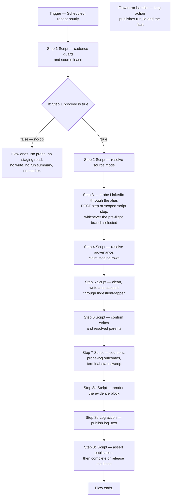

# Manual build 03 — LinkedIn ingestion flow — `x_bst_startuptrk`

This guide builds the LinkedIn ingestion flow of the ServiceNow scoped application `x_bst_startuptrk` by hand, on the instance, in Flow Designer. It specifies **one** scheduled flow built from **eight** numbered steps, and for each step it states the step type, every input to set, every data pill consumed, every output produced and the branch behaviour on each outcome. It also states exactly what LinkedIn's API does and does not expose, and what this flow can therefore acquire live — which is nothing. It also states the trigger configuration, the activation procedure, the single manual run that confirms each step, how to read the flow execution log, and the completion criteria to satisfy before this guide is signed off.

**Authority.** The frozen prompt and the Agent Action Plan are authoritative for all application content. The Update Set XML at [`../../update-set/x_bst_startuptrk_boston_startup_tracker_update_set.xml`](../../update-set/x_bst_startuptrk_boston_startup_tracker_update_set.xml) is the authoritative source for every table name, column name, choice value, Script Include class name, method name and system-property key cited below; the identifiers used here match those records character for character, and the same identifiers appear in [`../data-model.md`](../data-model.md) and [`../api-reference.md`](../api-reference.md). No variant spelling of any identifier is valid. Where this guide and those records disagree, the records are checked against the prompt and the plan first; where the records match the specification, this guide is corrected to them.

This document carries **no rationale**. It states what to build and how to build it. Every decision behind this flow, every alternative considered and every risk it carries is recorded in [`../../../docs/decisions/DECISION_LOG.md`](../../../docs/decisions/DECISION_LOG.md), which is the single source of truth for "why". Six points in this guide depart from a literal reading of the requirements. Each is stated below as a build mechanic and cross-referenced to that log. None is argued here.

| # | Departure | Stated in |
| --- | --- | --- |
| 1 | An hourly trigger paired with an elapsed-time guard, in place of a trigger interval read from a property. | [1.1](#11--what-the-guard-compares), [The trigger](#the-trigger) |
| 2 | The split that assigns Founder, Executive and JobPosting to LinkedIn while Startup, Investor and FundingRound go to Crunchbase. | [6.1](#61--the-tables-this-flow-writes) |
| 3 | LinkedIn's move from a static bearer token to OAuth 2.0, plus two mandatory versioning headers the platform does not supply. | [3.2](#32--the-one-entitled-read), [3.8](#38--oauth-20-token-handling-belongs-to-the-credential-record) |
| 4 | The `record_type` discriminator that decides whether a person becomes a Founder or an Executive, in place of a title heuristic. | [6.3](#63--the-record_type-discriminator) |
| 5 | **LinkedIn publishes no read API for any of this flow's three record types**, so the live call is an entitlement probe and every row comes from the sanctioned fallback dataset. A LinkedIn run can never be `live validated`. | [3.1](#31--what-linkedin-exposes-and-what-this-flow-can-therefore-acquire-live) |
| 6 | Cleaning rule 3's `Other` mapping is not applied to two choice columns whose binding lists declare no `Other` member. The deviation is logged, counted and flagged rather than resolved. | [5.4](#54--the-no-other-conflict-and-why-it-is-flagged-rather-than-resolved) |

Operational warnings **are** in scope for this guide and are marked as such. The four warnings under [Operational warnings](#operational-warnings) are load-bearing and must not be skipped: one describes a failure that surfaces at run time rather than at build time, one describes a failure that is silent, one describes a retry loop visible only in the execution detail, and one describes a failure that corrupts company identity across both flows. [3.1](#31--what-linkedin-exposes-and-what-this-flow-can-therefore-acquire-live) carries a fourth that is not a failure at all but a provider limitation, and it changes what this flow's evidence can claim.

## Referenced documents

This guide is executable on its own. All eight steps, every property read, every table written, every cleaning rule, every log write, the trigger, the activation and the verification are stated here in full. An operator needs no other file to build the flow.

**Every document linked from this guide is delivered and readable**, so no link is a forward reference; each one is an in-scope artifact of this deliverable package. Nothing in this guide depends on reading another document first, with the single exception recorded in precondition 7.

| Document | What this guide takes from it |
| --- | --- |
| [`01-connection-credential-aliases.md`](01-connection-credential-aliases.md) | The alias name `x_bst_startuptrk.linkedin_oauth` this flow binds to, [the provider wire contract](01-connection-credential-aliases.md#the-provider-wire-contract) with its two mandatory versioning headers, and [the credential posture](01-connection-credential-aliases.md#credential-posture) that decides how this flow's results may be labelled. |
| [`02-flow-crunchbase-ingestion.md`](02-flow-crunchbase-ingestion.md) | The companion flow. It is the same eight-step skeleton; steps 1, 2, 4, 5, 6, 7 and 8 are the same in both guides, and **step 3 differs materially**. It also builds the Startup records this flow's parent references resolve against, through the **shared Startup upsert path** of [6.2](#62--the-shared-startup-upsert-path). |
| [`06-staging-table-csv-import.md`](06-staging-table-csv-import.md) | The load that puts rows into `x_bst_startuptrk_ingest_staging`, which step 4 reads. |
| [`05-atf-test-suites.md`](05-atf-test-suites.md) | The Automated Test Framework test that exercises this flow. Its label for this flow is always `fallback validated`. |
| [`../manual-build-instructions.md`](../manual-build-instructions.md) | The split rule for the package as a whole: which artifacts ship as Update Set XML and which are built by hand. |
| [`../data-model.md`](../data-model.md) | The Founder and Executive column sets with their two **different** `title` choice lists, JobPosting's three choice lists, the cascade rules, and the staging table's forty-one columns. |
| [`../access-control.md`](../access-control.md) | The role and ACL posture of the tables this flow writes, including the two `contact_email` premium fields they carry. |
| [`../validation-checklist.md`](../validation-checklist.md) | Success criterion 4, which reads the run-summary evidence step 8 publishes. |
| [`../validation-gates.md`](../validation-gates.md) | The eleven post-commit gates of precondition 4. |
| [`../deployment-runbook.md`](../deployment-runbook.md) | The definition of a scheduled run, under [What counts as a scheduled run](../deployment-runbook.md#what-counts-as-a-scheduled-run). |
| [`../gaps-and-flags.md`](../gaps-and-flags.md) | The requirements with no clean equivalent, including the runtime-configurable schedule interval, **LinkedIn's absent read API for people and third-party job postings**, and the flagged cleaning-rule-3 conflict. |
| [`../../update-set/x_bst_startuptrk_boston_startup_tracker_update_set.xml`](../../update-set/x_bst_startuptrk_boston_startup_tracker_update_set.xml) | **Authoritative** for every identifier this guide cites. |
| [`../../sample-data/README.md`](../../sample-data/README.md) | The column contract of the fallback dataset step 4 reads, and the three LinkedIn files that carry it. |
| [`../../../docs/decisions/DECISION_LOG.md`](../../../docs/decisions/DECISION_LOG.md) | The single destination for every "why". |

## Position in the build order

This is **guide 03 of six**, and it is **step 3** of the execution order below. It runs immediately after guide 02, because this flow binds guide 01's second alias **by name** and resolves its parent Startup references against records guide 02's flow writes. The order is stated in full in [`../manual-build-instructions.md`](../manual-build-instructions.md); it is repeated here so this guide can be run without it. The execution order is not the filename order: guide **06** runs before guide **05**.

| Step | Guide | What it builds, and what it depends on |
| --- | --- | --- |
| 1 | [`01-connection-credential-aliases.md`](01-connection-credential-aliases.md) | The two Connection & Credential Aliases the ingestion flows bind to by name. Nothing downstream can authenticate without them. |
| 2 | [`02-flow-crunchbase-ingestion.md`](02-flow-crunchbase-ingestion.md) | The Crunchbase ingestion flow, which references `x_bst_startuptrk.crunchbase_api` by name. **Build it before this guide**, because it owns the Startup upsert path this flow shares. |
| **3** | **This guide** | **The LinkedIn ingestion flow, which references `x_bst_startuptrk.linkedin_oauth` by name. The identical skeleton.** |
| 4 | [`04-service-portal-pages-and-widgets.md`](04-service-portal-pages-and-widgets.md) | The portal, theme, five pages and eight widgets. |
| 5 | [`06-staging-table-csv-import.md`](06-staging-table-csv-import.md) | The staging-table CSV load. |
| 6 | [`05-atf-test-suites.md`](05-atf-test-suites.md) | The Automated Test Framework suites, **last**, because they exercise everything the five preceding guides build. |

Guide **02** precedes this one and is built from the same skeleton. A reader comparing the two guides must find **no discrepancy** in steps 1, 2, 4, 5, 7 and 8, which means:

- **Steps 1, 2, 7 and 8 are identical**, word for word in substance. The cadence guard, the source-mode resolution, the log-skip-continue contract and the run summary carry the same mechanics, the same properties and the same log events in both guides.
- **Steps 4 and 5 are identical in semantics**, with the source-system token substituted: this guide filters the staging table on `linkedin` rather than `crunchbase` and passes that token to the mapper, and the per-source translation table of pass one is the LinkedIn one. The three fallback triggers, the staging query shape, the four cleaning rules and the no-`Other` behaviour do not differ at all.
- **Only steps 3 and 6 differ substantively**: step 3 names a different alias and base URL and calls different resources, and step 6 writes `x_bst_startuptrk_founder`, `x_bst_startuptrk_executive` and `x_bst_startuptrk_jobposting` instead of guide 02's four tables.

Each of the eight steps is stated here in full rather than deferred to guide 02. Every step, every table, every cleaning rule, every property and every log write appears in both guides, so either guide alone is buildable and the traceability matrix in [`../../../docs/decisions/DECISION_LOG.md`](../../../docs/decisions/DECISION_LOG.md) has no gap at this flow.

The staging load of step 5 in the order above sits **after** this guide, which means the fallback branch of [Step 4](#step-4--fall-back-to-the-staging-table) will find no rows until guide 06 has run. That is expected. Build the flow now and re-run the fallback branch after guide 06.

## Preconditions

Do not begin this guide until every item below holds.

| # | Precondition | How to confirm |
| --- | --- | --- |
| 1 | The Update Set has been uploaded and has reached the `loaded` state. | The `sys_remote_update_set` record shows `state` `loaded`. |
| 2 | The preview has completed with an **empty error-type problem set**. | A read of `sys_update_preview_problem` filtered to this remote update set and `type=error` returns an empty `result` array. Warnings are logged and do not block. |
| 3 | The Update Set has **committed**. | The `sys_remote_update_set` record shows `state` `committed`. |
| 4 | **All eleven post-commit gates have passed.** | Run every gate in [`../validation-gates.md`](../validation-gates.md) and record `pass` for all eleven in that document's evidence record. The aggregate pass condition is 11 of 11; there is no partial pass. |
| 5 | The eleven are the seven entity-table gates `GATE-TBL-01` through `GATE-TBL-07`, the three role-record gates `GATE-ROLE-01` through `GATE-ROLE-03`, and the one scope-record gate `GATE-SCOPE-01`. | Each of the eleven reads a **platform metadata** record, not a row of an application table: the seven table gates read each table's own `sys_db_object` record within the scope and assert `name`, `access` `package_private`, `read_access` `false` and `ws_access` `false`. Every one of the eleven must return `HTTP 200` with **exactly one** record; **an empty `result` array is a failure**, because each gate asserts that a named record exists. Any failure triggers the rollback of [`../deployment-runbook.md`](../deployment-runbook.md), with no exception. |
| 6 | **Guide 01 is complete and the credential posture is recorded.** | [`01-connection-credential-aliases.md`](01-connection-credential-aliases.md) has been run to completion and its [Step 0](01-connection-credential-aliases.md#step-0--establish-the-credential-posture) posture row for `x_bst_startuptrk.linkedin_oauth` is recorded. **Either posture satisfies this precondition** — see [Credential posture](01-connection-credential-aliases.md#credential-posture). Copy the alias name from the propagation table of [Step 4](01-connection-credential-aliases.md#step-4--propagate-both-alias-names-into-guides-02-and-03) rather than typing it; see [Operational warnings](#operational-warnings). |
| 7 | **Guide 02 is complete and its flow is activated.** | The `Crunchbase Ingestion` flow exists and is active, per the build verification of [`02-flow-crunchbase-ingestion.md`](02-flow-crunchbase-ingestion.md#build-verification). This flow resolves its parent Startup references against records that flow writes; without them, every person and job row is rejected with `no startup carries the name`. See [6.2](#62--the-shared-startup-upsert-path). |
| 8 | The three Script Includes this flow calls into are on the instance. | `sys_script_include` carries `AppProperties`, `IngestionMapper` and `IngestionLogger`, all in the `x_bst_startuptrk` scope. |
| 9 | The five scoped system properties this flow reads or writes are on the instance. | `sys_properties` carries `x_bst_startuptrk.ingestion.cadence_hours`, `x_bst_startuptrk.ingestion.source_mode`, `x_bst_startuptrk.ingestion.last_run_provenance`, `x_bst_startuptrk.linkedin.base_url` and `x_bst_startuptrk.logging.level` — the last read by `IngestionLogger` rather than by a step directly. **The third is this flow's durable cadence marker and its source lease in one**: it carries one entry per source system, it ships empty, and this source's entry is claimed by step 1 and settled by step `8c`. Its format is stated in [The source lease](#the-source-lease). The mandatory `LinkedIn-Version` header of [3.2](#32--the-one-entitled-read) is **not** a property — it is the `AppProperties.LINKEDIN_API_VERSION` constant. |
| 10 | The three tables this flow writes are on the instance, and the one it reads references against. | `x_bst_startuptrk_founder`, `x_bst_startuptrk_executive` and `x_bst_startuptrk_jobposting` all open in the list view, as does `x_bst_startuptrk_startup`. Gates `GATE-TBL-02`, `GATE-TBL-03`, `GATE-TBL-06` and `GATE-TBL-01` cover all four. |
| 11 | The staging table this flow reads on the fallback branch is on the instance. | `x_bst_startuptrk_ingest_staging` opens in the list view. It ships with `ws_access` **false**, so confirm it in the list view and not over the Table API. |
| 12 | The business rule that maintains the Startup trim-and-validate contract is on the instance and **active**. | `sys_script` carries `Trim and validate startup`, `active` true, in the `x_bst_startuptrk` scope. This flow writes no Startup record, so the two portfolio-count rules do not fire on its writes; they remain active for guide 02. |
| 13 | You are working in the `x_bst_startuptrk` application scope. | The application picker reads **Boston Startup Tracker**. Every record this guide creates must carry that scope. |
| 14 | You hold a role that can create and publish a flow. | You can open Flow Designer, create a flow in the `x_bst_startuptrk` scope, and see the **Activate** control on a saved flow. |
| 15 | You have access to the **System OAuth** module. | The **System OAuth** application appears in the navigator with its **Application Registry** and **Manage Tokens** modules, so the token state behind this flow's alias can be read when a run resolves to `fallback`. Both modules require the `oauth_admin` role, which `admin` contains. |

### What is not captured into the Update Set

Only tables carrying the update-synch attribute are captured into `sys_update_xml` records, and adding that attribute to a table that lacks it out of the box is unsupported. The Flow Designer tables are outside the captured set, so this flow is built through the platform interface instead — which is why the delivered Update Set contains **zero** flow records. [`../manual-build-instructions.md`](../manual-build-instructions.md) owns the split rule for the package as a whole.

## Platform constraint

**IntegrationHub spokes are forbidden.** Prompt section 4.0 binds this absolutely. Do **not** install, activate, reference or open any spoke content set, and do not use a spoke action anywhere in this flow. A generic REST step is not a spoke. This flow uses a generic REST step bound to the alias established in guide 01, or the scoped script step of [3.7](#37--the-script-step-path) where that step is unavailable.

**No credential material appears anywhere in this flow.** Not in the flow record, not in a flow input, not in a step input, not in a script step, not in a test payload, and not in the Update Set. The alias is referenced by name and the platform resolves the secret at run time. Guide 01 holds the credential records; this guide never reads their values and never prints them. LinkedIn's secret material is an OAuth 2.0 client identifier, a client secret and a refresh token, and **no access token is ever held by, returned from or logged by this flow** — see [3.8](#38--oauth-20-token-handling-belongs-to-the-credential-record).

**Read [3.1](#31--what-linkedin-exposes-and-what-this-flow-can-therefore-acquire-live) before building step 3.** LinkedIn publishes no read API for any of this flow's three record types, so the live call is an entitlement probe and every row this flow ingests comes from the sanctioned fallback dataset. That is a provider limitation, it is flagged under prompt section 11.0 in [`../gaps-and-flags.md`](../gaps-and-flags.md), and it means a LinkedIn run can never be labelled `live validated`.

## Which route to build

**This flow is built either way, and one of two routes is selected by what guide 01 recorded for LinkedIn.** Neither route is a degraded mode; both produce a complete run with a run summary, a provenance marker and criterion-4 evidence.

**LinkedIn's live route carries a second gate that Crunchbase's does not.** A working alias is necessary but not sufficient: the live route also needs the recorded product contract of precondition 16, because without it there is no documented resource path to call, no documented response envelope to parse and no permitted retention for person data a call would return. **Both gates must read `pass`.**

| Guide 01 recorded | Contract table of Step 2.0 | Route | What you build | What you do **not** build |
| --- | --- | --- | --- | --- |
| `pass` | complete and signed off | **Live-first** | Every step of this guide, including step 3's script call and step 4's fallback on failure | — |
| `pass` | **any row unfilled** | **Forced fallback** | Steps 1, 2, 4, 5, 6, 7 and 8 exactly as written | **Step 3 in full.** No outbound call, no alias reference, no credential resolution |
| `fail`, or `n/a — unprovisioned, fallback only` | either | **Forced fallback** | Steps 1, 2, 4, 5, 6, 7 and 8 exactly as written | **Step 3 in full** |

### The forced-fallback route, in five instructions

1. **Set the property.** `x_bst_startuptrk.ingestion.source_mode` to `fallback`. Step 2 reads it and resolves the provenance to `fallback` before anything else happens.
2. **Omit step 3 entirely.** Do not add the script step. Do not type the alias name anywhere in the flow. There is nothing to resolve and nothing that can fail, and no provider body ever reaches the instance.
3. **Wire step 4 as the first data step.** Its `live_ok` input is a literal `false` rather than a data pill from step 3, and its `provenance` output is `fallback`. Everything downstream is unchanged: step 4 resolves the provenance, step 5 cleans, step 6 writes, step 7 logs, step 8 summarises.
4. **Load the staging table first.** The route's input is the pending LinkedIn rows loaded by [`06-staging-table-csv-import.md`](06-staging-table-csv-import.md) — `linkedin_founders_sample.csv`, `linkedin_executives_sample.csv` and `linkedin_job_postings_sample.csv`. A forced-fallback run over an empty staging table is a valid run that ingests nothing, which is not the evidence criterion 4 needs.
5. **Label every result `fallback validated`.** Never `live validated`, whatever the run appears to show. Success criterion 4 of [`../validation-checklist.md`](../validation-checklist.md) explicitly accepts the sample-dataset substitute on exactly this condition, and [`../gaps-and-flags.md`](../gaps-and-flags.md) records the provider-contract blocker that makes it the shipped route.

### Switching to live later — what the flow needs, and what it does not cover

When the alias is provisioned, the contract is recorded and the connection tests green, the **flow** does not need rebuilding — the flow is not what blocks live acquisition here. Add step 3 as the single script step of [3a](#31--what-linkedin-exposes-and-what-this-flow-can-therefore-acquire-live), repoint step 4's `live_ok` input at its output, and set `source_mode` back to `live`, which is the value the branch rule then requires. `source_mode` is **one shared setting for both flows**, so the branch rule reaches `live` only when **both** aliases are provisioned with a passing connection test; see [`06-staging-table-csv-import.md#restoring-source_mode-is-readiness-determined-not-a-return-to-live`](06-staging-table-csv-import.md#restoring-source_mode-is-readiness-determined-not-a-return-to-live). The cadence guard, the write step, the log step and the summary step are untouched. **That is why the fallback route is documented as a first-class construction path rather than as a fork**: the live call is an addition to a working flow, not a precondition of building one. **This paragraph is about the flow only.** It does not mean live acquisition of founders, executives or job postings becomes available: that is blocked by the provider, is recorded permanently in [3.1](#31--what-linkedin-exposes-and-what-this-flow-can-therefore-acquire-live), and would additionally require the Script Include and fixture changes named under [The contract declaration the credential owner must supply](#the-contract-declaration-the-credential-owner-must-supply). The step 3 this paragraph adds is the **entitlement probe**, which acquires no rows.

### Capture rule for this artifact class

Only tables carrying the update-synch attribute are captured into `sys_update_xml` records, and adding that attribute to a table that lacks it out of the box is unsupported. The Flow Designer and Action Designer tables are outside the captured set, so the actions and the flow are built through the platform interface. The delivered Update Set therefore contains **zero** flow records and **zero** action records. [`../manual-build-instructions.md`](../manual-build-instructions.md) owns the split rule for the package as a whole, and the decision is recorded at `D-074`.


## What this guide builds

One record, containing eight steps.

| Artifact | Count | Table | Notes |
| --- | --- | --- | --- |
| Scheduled flow | 1 | `sys_hub_flow` | Built in Flow Designer, in the `x_bst_startuptrk` scope. |
| Flow trigger | 1 | Scheduled, **repeat hourly** | See [The trigger](#the-trigger). The hourly repeat is deliberate and is paired with the guard of step 1. |
| Flow steps | 8 | — | Numbered 1 to 8 below. Step 8 is built as three consecutive parts — `8a` a Script step that renders, `8b` the Log action, `8c` a Script step that asserts and completes the run. **Every step from 2 to 8c sits inside the single `If` block controlled by step 1.** [The flow graph](#the-flow-graph) is the one authoritative statement of the structure. |
| Log action | 1 | Utilities → Log | Part `8b`. It is what puts the ingestion events into the flow execution log; see [8.5](#85--publishing-the-events-to-the-flow-execution-log). |
| Flow error handler | 1 | Utilities → Log | One handler on the flow, for a platform fault no step catches. See [The flow graph](#the-flow-graph). |

The flow reads **five** system properties — `x_bst_startuptrk.ingestion.cadence_hours`, `x_bst_startuptrk.ingestion.source_mode`, `x_bst_startuptrk.ingestion.last_run_provenance`, `x_bst_startuptrk.linkedin.base_url` and `x_bst_startuptrk.logging.level` — and writes exactly **one**, `x_bst_startuptrk.ingestion.last_run_provenance`, reads and writes **one** staging table, reads **one** entity table for reference resolution, writes **three** entity tables, calls **three** Script Includes, and emits **thirty-four** distinct kinds of log record — eleven `IngestionLogger` events, nine step lines it writes itself, and fourteen further step lines that appear only on a failure path. Each is enumerated in its own step, and they are inventoried together in [7.2](#72--every-log-record-this-flow-can-write), which also states the difference between the application log and the flow execution log.

### The flow graph

**This is the single authoritative statement of the flow's structure.** Where any other sentence in this guide appears to place a step differently, this graph governs. It is the same skeleton guide 02 builds, step for step, so the two flows can be read and maintained together.



Three structural rules follow from that graph, and each is enforced in the step that owns it.

| # | Rule | What follows from it |
| --- | --- | --- |
| 1 | **No step from 2 to 8c throws.** Each wraps its own body and records a failure in its own `step_error` output rather than raising. | Control therefore always reaches `8a`, `8b` and `8c`, so the evidence is published on a failed batch without needing a step outside the `If`. Placement outside the block would additionally make `8a` run on the roughly twenty-three no-op executions of every day, publishing an empty evidence block each time. |
| 2 | **A no-op publishes nothing at all.** When the guard sets `proceed` `false` the flow ends immediately after the `If`. | [1.5](#15--the-early-exit) states the same thing, and it is how a no-op is told apart from a scheduled run in the execution detail: a no-op carries exactly one log line, the guard's. |
| 3 | **The flow carries one error handler**, a single Log action publishing the run identifier and the platform fault. | It exists for a fault no step can catch — a transaction cancellation or a scripting engine failure. It is not part of the control flow and no step depends on it. |

## The flow record

Create the flow first, with no steps, then add the steps in order.

1. Set the application picker to **Boston Startup Tracker**.
2. Open **Flow Designer**, then **New**, then **Flow**.
3. Set the fields below.

| Field | Value | Notes |
| --- | --- | --- |
| **Flow name** | `LinkedIn Ingestion` | The internal name derives from this. Guide 02 uses `Crunchbase Ingestion`. |
| **Application** | `Boston Startup Tracker` | The `x_bst_startuptrk` scope. Confirm this before saving; a flow created in Global cannot be moved into the scope afterwards. |
| **Description** | `Ingests LinkedIn people and job-posting data into x_bst_startuptrk_founder, x_bst_startuptrk_executive and x_bst_startuptrk_jobposting on the configured cadence. Implements prompt section 4.0 scheduled ingestion.` | The description convention across this package is a **pointer**: it states what the artifact does and which requirement it implements. It never states why. |
| **Run As** | **System User** | A scheduled flow has no initiating user. This setting also governs whether the alias resolves; see [Operational warnings](#operational-warnings). |
| **Protection** | `None` | |
| **Run With Roles** | leave empty | The flow must not acquire roles beyond its run-as identity. |

4. Save the flow. Do not activate it yet — activation is [its own step](#activation), after all eight steps are built and one manual run has passed.

### The run identifier

Every step of this flow carries a **run identifier**, minted once by step 1 and passed as a data pill into steps 4, 5, 6, 7 and 8. Its format is the source-system token, a hyphen, a fourteen-digit timestamp, a hyphen, then **sixteen hexadecimal characters taken from a fresh platform GUID**:

```text
linkedin-20260807143000-9d31c7b0af6e4152
```

**The GUID suffix is not decorative and the timestamp alone is not sufficient.** A fourteen-digit timestamp has one-second resolution, so two executions that start within the same second mint the identical identifier — which a retried execution, a manual test run beside a scheduled one, or two clones sharing an instance can all produce. Every per-record log line, every staging-row claim and the run-completion marker are keyed on this value, so a collision merges two runs' evidence into one indistinguishable set and lets one run settle the other's claimed rows. The GUID suffix makes the identifier unique per execution regardless of timing.

The **prefix is equally load-bearing**: `IngestionLogger.sourceOfRun()` falls back to the text before the first hyphen when a caller names no source, and `AppProperties` accepts only `crunchbase` and `linkedin` as source tokens. Guide 02 mints `crunchbase-<yyyyMMddHHmmss>-<16 hex>` by the same rule, which is what keeps the two flows' cadences independent of one another. Do not shorten the identifier, do not omit the prefix, do not drop the GUID suffix, and do not reuse an identifier across executions.

`AppProperties._runToken()` accepts word characters, dots and hyphens up to 64 characters and strips everything else, so this form passes through the run-state marker unaltered. Strip the hyphens out of the GUID before appending it; a raw `gs.generateGUID()` is 32 characters with no separators on this platform, and taking its first 16 keeps the identifier inside the token budget with room to spare.

### The source lease

**Two concurrent executions of this flow must not ingest the same source at the same time.** They would claim each other's staging rows, interleave their entity writes, and each settle the other's run-completion marker. Nothing in a scheduled trigger prevents it: an execution that overruns its hour is still running when the next hourly trigger fires, and a manual test run can start beside a scheduled one at any moment.

Step 1 therefore takes a **named lease on the source** before the flow does any work, through `AppProperties.acquireRunLease('linkedin', run_id)`. The lease is a guarded write plus a read-back on the single run-state property `x_bst_startuptrk.ingestion.last_run_provenance`: the method reads the property's current value, then writes the new marker set with **one guarded conditional update** whose condition is that the property record still carries the value it read, so an execution whose prior value has already been superseded matches nothing and is told which condition it met. The value is then read back **from the property record** rather than through the cached property API, and the method reports whether the run identifier that came back is this run's. The result also carries an `atomic` member: `false` means the guarded write applied nothing and the property API was used instead — logged at warn — which is one condition under which two runs could both proceed.

**The guarantee is stated as it is rather than as a database compare-and-set, because that is not available here.** A scoped script has no single-statement compare-and-set: the guarded update is a conditional *select* followed by a write, so two executions that both select before either writes can both write, and each then reads back its own marker. What the lease removes is the ordinary case — an execution arriving after another has already claimed the source is refused, and so is one whose prior value has been superseded — and what remains is the window between one execution's write and its read-back. The residual window is accepted under prompt section 6.0's prototype focus, exactly as the fixed-window rate-limit counter's read-increment-write race is; the cadence guard is what bounds its consequences, since an execution that loses the race still finds the source's cadence unexpired only inside that same window. Do not build a second exclusion mechanism on top of it; record `atomic` in the run evidence and rely on the cadence guard.

**The two flows share this one property and do not contend for it.** Each source keeps its own marker segment, and `AppProperties` merges the other segment from a read issued inside the write rather than from the caller's snapshot, then reapplies the merge once if the segment it wrote did not read back — so a Crunchbase claim landing between this flow's read and its write restores rather than erases this source's segment.

| Lease outcome | `acquireRunLease` returns | What step 1 does |
| --- | --- | --- |
| No marker, or a marker already held by this run | `ok` `true` | Proceed. This execution owns the source. |
| A `running` marker held by another run, younger than the cadence | `ok` `false` with `holder` naming it | **Do not proceed.** Record the holder and end as a no-op. The other run is still working. |
| A `running` marker held by another run, older than the cadence | `ok` `true` — the stale claim is taken over | Proceed. A run interrupted by a platform fault cannot block the source forever. |
| A `succeeded` marker from an earlier completed run | `ok` `true` | Proceed. The cadence guard has already decided the interval elapsed. |
| Another run won the guarded update | `ok` `false`, `reason` `another run took this source` | **Do not proceed.** Record the holder and end as a no-op. |
| The claim could not be written at all, or the method threw | `ok` `false` with the reason and no holder | **Do not proceed.** Record the reason and end as a no-op with `outcome` `lease_unavailable`. Step 1 wraps the call, so a lease fault ends the execution as a no-op rather than as an unhandled flow error. |
| The claim was written but not atomically | `ok` `true`, `atomic` `false` | Proceed, and **record `atomic` in the run evidence**. The property record was not writable through the record API on this instance, so exclusion rests on the cadence guard alone for this run. |

**The lease is per source, and the two flows never contend.** The marker property carries one entry per source system, so a Crunchbase run holding `crunchbase` does not block a LinkedIn run taking `linkedin`. The two flows can run at the same time; two executions of *this* flow cannot.

**The lease is released exactly once, by step `8c`.** A healthy run calls `IngestionLogger.markRunComplete()`, which turns the `running` marker into the `succeeded` marker the cadence guard reads. A run that is not healthy calls `AppProperties.releaseRunLease()`, which drops the claim without recording a success, so the next hourly trigger may retry immediately. [8.6](#86--part-8c--assert-publication-then-complete-or-release-the-lease) states both paths. A run that dies hard leaves a `running` marker, which the cadence-aged takeover above clears.

**The completion is refused unless this run holds a `running` claim on the source, and that is why the lease is not optional.** `AppProperties.completeRun(source, run, provenance)` — the call behind `IngestionLogger.markRunComplete()` — tests the run-state marker before it writes and reads it back after, and refuses with `this run does not hold this source` when the marker names a different run **or when there is no marker at all**, with `this source has already completed` when the marker this run holds already reads `succeeded`, and with `another run took this source` when the marker changed between its write and its read-back. **Ownership is a positive test, not the absence of a contrary one**, and a completion is **one-way**: `running` becomes `succeeded` exactly once, so a recorded provenance can never be rewritten by a second call. Four consequences follow, and each is a build rule rather than a caution:

| Condition | What `completeRun` does | What the flow must therefore do |
| --- | --- | --- |
| Step 1 acquired the lease and no other run intervened | Writes the `succeeded` marker and reads it back | Nothing further. This is the normal path. |
| Step 1 never acquired the lease — the `If` was bypassed, the guard's `proceed` was ignored, or the action was reordered | **Refuses.** No marker is written | Never call `markRunComplete()` on a run that did not acquire the lease. A build that reorders step `8c` before step 1, or that runs the ingestion outside the `If`, produces `run_completion_refused` on every execution and never advances the cadence. |
| A stale claim was taken over by a later run while this one was still working | **Refuses**, naming the run that took it | Accept the refusal. `8c` marks the run unhealthy with `completion_refused` and releases nothing, because the source no longer belongs to this run. |
| `8c` runs a second time for the same run — a re-execution, a manual re-run of the action, or a retry after the marker was already stamped | **Refuses** with `this source has already completed`, and returns the provenance on record | Accept the refusal. The first completion is the evidence; a second call cannot change its provenance or its timestamp. `8c` marks this pass unhealthy with `completion_refused` rather than re-stamping, so criterion 4's three qualifying runs are three distinct completions rather than one completion recorded three times. |

**A refusal is never silent and never partial.** It writes `run_completion_refused` at `error` with the reason, `8c` sets `healthy` `false`, the cadence marker is left as it was, and the next hourly trigger re-runs the source. What it does **not** do is stamp a `succeeded` marker for work another run owns — which is the outcome the read-back exists to prevent, because a marker written by the wrong run advances the cadence gate for a window in which nothing was ingested.

**The lease is taken after the cadence check, never before.** With the shipped 24-hour cadence roughly twenty-three of every twenty-four executions are no-ops, and a lease taken before the cadence check would have every one of them write the run-state property.

## The action records

Build all seven actions **before** creating the flow. A flow cannot reference an unpublished action, and an action's inputs and outputs are not offered to a flow until it is published.

**The Action Designer procedure is identical to the one in guide 02.** Follow [The Action Designer procedure, applied to every action](02-flow-crunchbase-ingestion.md#the-action-designer-procedure-applied-to-every-action) item for item, substituting this guide's action names, inputs, outputs and steps.

### The seven actions, and the steps each one implements

**Every numbered step of this guide lives in exactly one action, and every value a later action consumes is a declared output of an earlier one.** That is the whole rule, and it is what makes the flow assemblable from published actions with no step on the flow itself.

| # | Action name | Internal name | Step types it contains | Numbered sections it implements |
| --- | --- | --- | --- | --- |
| **A1** | `Cadence Guard LinkedIn` | `cadence_guard_linkedin` | 1 Script | [Step 1](#step-1--cadence-guard) |
| **A2** | `Resolve Source Mode LinkedIn` | `resolve_source_mode_linkedin` | 1 Script | [Step 2](#step-2--resolve-the-source-mode) |
| **A3** | `Fetch LinkedIn Payload` | `fetch_linkedin_payload` | **The live-call arm, then 1 Script step.** The arm is either the three parts of [3.6](#36--the-rest-step-path) — a Script step, a For Each block with a REST step inside it, and a normaliser Script step — or the single script step of [3.7](#37--the-script-step-path). [3.5](#35--the-pre-flight-check-that-chooses-the-path) chooses; exactly one arm is built. | [Step 3](#step-3--probe-linkedin-through-the-alias) is its live-call arm, [Step 4](#step-4--fall-back-to-the-staging-table) its trailing Script step |
| **A4** | `Ingest LinkedIn Batch` | `ingest_linkedin_batch` | 1 Script | [Step 5](#step-5--clean-write-and-account-for-every-record-through-ingestionmapper) |
| **A5** | `Confirm LinkedIn Writes` | `confirm_linkedin_writes` | 1 Script | [Step 6](#step-6--confirm-the-writes-and-the-resolved-parents) |
| **A6** | `Reconcile LinkedIn Batch Counters` | `reconcile_linkedin_batch_counters` | 1 Script | [Step 7](#step-7--log-skip-the-record-continue-the-run) |
| **A7** | `Publish LinkedIn Run Evidence` | `publish_linkedin_run_evidence` | **3 steps**: 1 Script, then 1 **Log** action step, then 1 Script | [Step 8](#step-8--publish-the-run-evidence-and-close-the-run), as its three parts `8a`, `8b` and `8c` |

**All seven are mandatory and all seven are called by the flow.** There is no published-but-unwired action, and no diagnostic action.

**The action names carry a source suffix** on A1, A2, A5, A6 and A7, because guide 02's actions already occupy `cadence_guard`, `resolve_source_mode`, `confirm_crunchbase_writes`, `reconcile_batch_counters` and `publish_run_evidence` in the same scope, and two actions in one scope cannot share an internal name. A3 and A4 already name their source. Confirm each generated internal name matches the table before saving.

### Each action's inputs and outputs are its steps' inputs and outputs

**An action declares exactly the inputs and outputs its steps declare, with the same names and the same types.** Those declarations are stated once, in the numbered step that owns them, and are not restated here — restating them is how the two drifted apart in an earlier build. Read each action's signature from the section named in the table below, and declare on the action every output variable that section lists.

Contains one Script step, specified in [2.4](#24--the-step-script). **Error handling:** an unreadable or unrecognised property value resolves to `fallback`.

### A3 — `Fetch LinkedIn Payload`

**Description:** `Fetches LinkedIn person and job payloads through the x_bst_startuptrk.linkedin_oauth alias, and falls back to x_bst_startuptrk_ingest_staging on an authentication failure, a timeout or a malformed response. Implements prompt section 4.0 live-with-fallback acquisition.`

| Direction | Name | Type | Mandatory | Meaning |
| --- | --- | --- | --- | --- |
| Input | `run_id` | String | Yes | From A1's `run_id`. |
| Input | `source_mode` | String | Yes | From A2's `source_mode`. |
| Output | `provenance` | String | — | `live` or `fallback`. The value A4 stamps on every record and on the run summary. |
| Output | `rows` | String | — | The row set as a JSON array string, and **the row set A4 ingests**: one `{ record_type, staging_id }` envelope per **claimed** staging row. This flow has no live read route, so this is its only shape. |
| Output | `row_count` | Integer | — | The number of rows in `rows`. |
| Output | `staged_ids` | String | — | A JSON array of the `sys_id` values of the staging rows this run **claimed**, in the order read. Step 7 sweeps it. |
| Output | `claimed_count` | Integer | — | How many staging rows this run claimed, so a corrupted `staged_ids` string is detectable rather than silently empty. |
| Output | `probe_recorded` | True/False | — | `true` when the probe outcome was recorded as a step line. |
| Output | `step_error` | String | — | Empty on success. Set when the staging read could not complete, which is a failure of this step rather than of the provider. |
| Output | `fallback_reason` | String | — | Empty on the live branch; otherwise `auth_failure`, `timeout`, `malformed_response`, `source_mode` or `contract_undeclared`. The first three are the fallback triggers guide 02 also carries; **`contract_undeclared` is this flow's fourth, LinkedIn-only trigger**, declared at [3a](#31--what-linkedin-exposes-and-what-this-flow-can-therefore-acquire-live). |

**The base URL is not an action input.** The property `x_bst_startuptrk.linkedin.base_url` is the **single endpoint authority**, read through `AppProperties.getLinkedinBaseUrl()`. The alias's connection record must carry the **same** value — the platform requires a URL on a connection record — and that record is the property's required mirror, not a second authority. Precondition 9 confirms the property is present, and criterion 4 of [`01-connection-credential-aliases.md`](01-connection-credential-aliases.md) confirms the two are equal.

Contains **two** steps, in this order:

| # | Step | Specified in | Produces |
| --- | --- | --- | --- |
| **A1** | [1.2](#12--step-inputs) | [1.3](#13--step-outputs) | 7 |
| **A2** | [2.2](#22--step-inputs) | [2.3](#23--step-outputs) | 2 |
| **A3** | [3.3](#33--step-inputs) for its live-call arm and [4.2](#42--step-inputs) for its trailing step; the action's own inputs are `run_id` and `source_mode` | [3.4](#34--step-outputs) **and** [4.3](#43--step-outputs) | 12 + 8 = 20 |
| **A4** | [5.1](#51--step-inputs) | [5.2](#52--step-outputs) | 13 |
| **A5** | [6.6](#66--step-inputs) | [6.7](#67--step-outputs) | 8 |
| **A6** | [7.6](#76--step-inputs) | [7.7](#77--step-outputs) | 14 |
| **A7** | [8.3](#83--part-8a--the-step-inputs-and-outputs) for `8a` and [8.6](#86--part-8c--assert-publication-then-complete-or-release-the-lease) for `8c` | [8.3](#83--part-8a--the-step-inputs-and-outputs) **and** [8.6](#86--part-8c--assert-publication-then-complete-or-release-the-lease) | 8 + 7 = 15 |

**Error handling:** every failure mode is caught inside the action and converted into a `fallback_reason` plus a `provenance` of `fallback`. The action never throws.

### A4 — `Ingest LinkedIn Batch`

**Description:** `Cleans, deduplicates, upserts and links one LinkedIn batch through IngestionMapper on a single IngestionLogger instance, and writes the run summary and provenance marker. Implements prompt section 4.0 cleaning rules and section 8.0 skip-and-continue error handling.`

| Direction | Name | Type | Mandatory | Meaning |
| --- | --- | --- | --- | --- |
| Input | `run_id` | String | Yes | From A1's `run_id`. |
| Input | `provenance` | String | Yes | From A3's `provenance`. |
| Input | `rows` | String | No | From A3's `rows` — the claimed staging envelopes. A4 ingests it. This flow has no live branch. |
| Output | `processed` | Integer | — | Records written. |
| Output | `rejected` | Integer | — | Records rejected for a missing mandatory field or an unresolvable parent Startup. |
| Output | `skipped` | Integer | — | Operational failures of either kind. |
| Output | `errors` | Integer | — | Of those, incoming rows whose own write failed. |
| Output | `duplicates` | Integer | — | Records collapsed by the deduplication rule. |
| Output | `unmatched` | Integer | — | Choice values normalised to `Other`. |
| Output | `recorded` | True/False | — | `true` when the run summary was written. |

Contains one Script step, specified in [8.6](#88--one-ingestion-call-site-and-the-two-entry-points-it-may-use). **Error handling:** the orchestrator applies the skip-the-record-and-continue-the-run contract of [7.1](#71--the-contract-every-step-must-honour) per record, and wraps the whole batch so that a batch-level fault still writes a run summary carrying the counters accumulated up to that point.

### A5 — `Reconcile LinkedIn Batch Counters`

**Description:** `Sums per-phase ingestion counters into run totals and writes one reconciliation line. Diagnostic action; not called by the delivered flow. Implements prompt section 8.0 flow-execution-log reporting.`

Its seven inputs and six outputs are the same as guide 02's A5: inputs `run_id`, `row_count`, `accepted_count`, `rejected_count`, `duplicate_count`, `written_count` and `skipped_count`; outputs `processed`, `rejected`, `skipped`, `duplicates`, `unmatched` and `reconciled`. Contains one Script step, specified in [7.7](#78--the-step-script). It is published and **not** called by the flow, for the reason of [7.4](#74--the-counters-come-from-the-logger-never-from-arithmetic).

1. **A3 and A7 each publish the union of their steps' outputs.** A3 carries step 3's twelve and step 4's eight, because step 7 consumes `call_log`, `failed_calls`, `truncated` and `budget_hit` from step 3 while step 5 consumes `rows` and `provenance` from step 4 — both sets have to leave the action. A7 carries `8a`'s eight and `8c`'s seven. Where the two steps of A3 both declare a name — `rows` appears in both [3.4](#34--step-outputs) and [4.3](#43--step-outputs) — **the later step's value is the one the action publishes**, because step 4 resolves the provenance and rewrites it for the branch actually taken.
2. **An output the script assigns but the action does not declare is invisible**, to the flow and to the ATF suite. After publishing each action, open the flow's data panel and confirm every output in the table above appears under it.
3. **Nothing is declared that no script assigns.** Each step's `### x.y — Step outputs` table is the authority in both directions.

### Assembling the flow from the published actions

The flow contains **eight builder elements and nothing else**: seven action calls and one `If` block. There is no REST step, no Script step and no Log step on the flow itself — every one of those lives inside an action, including the For Each block and REST step of Arm A. Position 1 sits outside the `If`; positions 3 to 8 sit inside it.

| Position | Flow item | What to add | Inputs to map |
| --- | --- | --- | --- |
| 1 | **Action** | **Action** → `Cadence Guard LinkedIn` (A1). | `source_system` = the literal `linkedin`. |
| 2 | **Flow logic** | **If**, with the condition **A1 → `proceed`** `is` `true`. Positions 3 to 8 sit **inside** this block. | — |
| 3 | **Action**, inside the `If` | **Action** → `Resolve Source Mode LinkedIn` (A2). | `run_id` = **A1 → `run_id`**. |
| 4 | **Action**, inside the `If` | **Action** → `Fetch LinkedIn Payload` (A3). | `run_id` = **A1 → `run_id`**; `source_mode` = **A2 → `source_mode`**. |
| 5 | **Action**, inside the `If` | **Action** → `Ingest LinkedIn Batch` (A4). | `run_id` = **A1 → `run_id`**; and every pill [5.1](#51--step-inputs) names, from A3. |
| 6 | **Action**, inside the `If` | **Action** → `Confirm LinkedIn Writes` (A5). | `run_id` = **A1 → `run_id`**; and every pill [6.6](#66--step-inputs) names, from A4. |
| 7 | **Action**, inside the `If` | **Action** → `Reconcile LinkedIn Batch Counters` (A6). | `run_id` = **A1 → `run_id`**; and every pill [7.6](#76--step-inputs) names, from A3 and A4. |
| 8 | **Action**, inside the `If` | **Action** → `Publish LinkedIn Run Evidence` (A7). | `run_id` = **A1 → `run_id`**; and every pill [8.3](#83--part-8a--the-step-inputs-and-outputs) and [8.6](#86--part-8c--assert-publication-then-complete-or-release-the-lease) name, from A3, A4, A5 and A6. |

Three rules govern the mapping, and each is a build step:

1. **Map data pills; never retype a value.** Pick each pill from the data panel. A typed literal in place of a pill compiles and then carries a stale or empty value at run time.
2. **`source_system` at position 1 is the only literal on the flow.** Everything else is a pill from an earlier action's output.
3. **If an action's output does not appear in the data panel, the action is not published.** Publish it; do not work around it by adding a step to the flow.

`Fetch LinkedIn Payload` through `Publish LinkedIn Run Evidence` all run unconditionally inside the `If`. None needs a further condition: A3 resolves its own live-or-fallback branch internally and always emits a `provenance`, and each later action acts on whatever it receives and records a fault in its own `step_error` rather than raising.

## Step 1 — Cadence guard

**Step type:** Script (Utilities → Script), followed by one `If` flow-logic block.

This is the **first action after the trigger** and it runs on every execution, including the many that do no work. It decides whether this execution is a scheduled run or a no-op.

### 1.1 — What the guard compares

The guard compares the **elapsed time since the last completed run of this source** against the cadence, in hours.

The cadence is the scoped property `x_bst_startuptrk.ingestion.cadence_hours`. Its shipped value is **24**. It is **clamped to the range 6 to 48**. The clamp is owned by the `AppProperties` Script Include, which exposes it as `AppProperties.getCadenceHours()`. **Do not re-implement the clamp in the flow.** Read the value through that method and use whatever it returns: a stored value below 6 returns 6, a stored value above 48 returns 48, and a stored value that is absent or not an integer returns the default of 24. Changing the cadence at run time is done by editing that one property and nothing else — no flow edit, no re-publish.

The last-run marker lives inside the single scoped property **`x_bst_startuptrk.ingestion.last_run_provenance`**, which carries one entry per source system in the form `source=provenance|state|stamp|run`, entries separated by semicolons. The guard reads this source's entry through `AppProperties.getLastSuccessAt('linkedin')`, which returns the entry's `yyyy-MM-dd HH:mm:ss` stamp when the entry's state is `succeeded`, and the empty string otherwise — including when the entry exists but is still `running`. **An in-flight claim therefore never satisfies the cadence.**

The entry is written twice per run at most: step 1 claims the source with a `running` entry, and step `8c` settles it with a `succeeded` entry once every health check has passed. **No other step writes a property.** A no-op writes none, so consecutive no-ops never move the marker forward, and a run that failed leaves the previous `succeeded` stamp untouched so the next trigger retries.

**The marker is a property, not a log record.** The property is durable, is unaffected by `x_bst_startuptrk.logging.level`, and is not subject to log rotation, so the cadence guard reads the same value whatever the log severity threshold and whatever has been pruned. **Nothing in this flow reads the application log to establish cadence or provenance.** Guide 02 reads and writes its own `crunchbase` entry in the same property by the same rule, so the two flows' cadences are independent.

### 1.2 — Step inputs

None. The guard takes no data pill; it reads two scoped properties and nothing else.

### 1.3 — Step outputs

Declare seven output variables on the step.

| Output variable | Type | Meaning |
| --- | --- | --- |
| `run_id` | String | The run identifier for this execution, in the format given above. Consumed by steps 4, 5, 6, 7 and 8. |
| `cadence_hours` | Integer | The clamped cadence, as returned by `AppProperties.getCadenceHours()`. Recorded in the log line so the operator can see which value was in force. |
| `hours_elapsed` | Integer | Whole hours since the last completed run of this source. `-1` when no `succeeded` marker is on record. |
| `lease_ok` | True/False | `true` when this execution holds the source lease. Consumed by step `8c`, which releases the lease only if this run took it. |
| `lease_holder` | String | The run identifier holding the lease when this run could not take it. Empty when the lease was taken. |
| `outcome` | String | One of `proceed`, `no_op`, `lease_held_elsewhere` or `lease_unavailable`. The single value that says why this execution did or did not work. `lease_held_elsewhere` names another execution as the holder; `lease_unavailable` means the claim itself could not be taken and no holder is known. |
| `proceed` | True/False | `true` when this execution is a scheduled run that holds the lease. `false` for both a cadence no-op and a lease refusal. |

### 1.4 — The guard script

Set the script body to the following. It calls `AppProperties` by bare class name, which is correct inside the `x_bst_startuptrk` scope; the fully qualified form is `x_bst_startuptrk.AppProperties`.

```javascript
(function execute(inputs, outputs) {

    var SOURCE = 'linkedin';
    var props = new AppProperties();
    var cadence = props.getCadenceHours();          // clamped 6..48, default 24

    var stamp = new GlideDateTime();
    var digits = stamp.getValue().replace(/[^0-9]/g, '').substring(0, 14);
    var unique = String(gs.generateGUID()).replace(/-/g, '').substring(0, 16);
    outputs.run_id = SOURCE + '-' + digits + '-' + unique;
    outputs.cadence_hours = cadence;
    outputs.hours_elapsed = -1;
    outputs.lease_ok = false;
    outputs.lease_holder = '';
    outputs.outcome = 'no_op';
    outputs.proceed = false;

    // Marker for this source, stamped by step 8c only on a healthy run. An
    // in-flight claim reads as no marker, so it never satisfies the cadence.
    var marker = props.getLastSuccessAt(SOURCE);
    var elapsed = true;

    if (marker) {
        var last = new GlideDateTime(marker);
        var elapsedMs = new GlideDateTime().getNumericValue() - last.getNumericValue();
        var whole = Math.floor(elapsedMs / 3600000);
        outputs.hours_elapsed = whole;
        elapsed = (whole >= cadence);
    }

    if (!elapsed) {
        props.log('info', '[x_bst_startuptrk.ingestion] event="cadence_guard" run="' +
            outputs.run_id + '" cadence_hours="' + cadence +
            '" hours_elapsed="' + outputs.hours_elapsed + '" outcome="no_op"');
        return;
    }

    // The cadence has elapsed. Take the source lease before doing any work. A lease that
    // cannot be evaluated ends this execution as a no-op rather than as an unhandled error:
    // the next hourly trigger re-evaluates the cadence and the source is still claimable.
    var lease = { ok: false, holder: '', reason: '' };
    try {
        lease = props.acquireRunLease(SOURCE, outputs.run_id);
    } catch (leaseError) {
        lease = { ok: false, holder: '',
            reason: 'the lease could not be evaluated: ' + props.safeText(leaseError, 120) };
    }
    outputs.lease_ok = (lease.ok === true);
    outputs.lease_holder = lease.ok ? '' : String(lease.holder || '');

    if (!outputs.lease_ok) {
        // A named holder means another execution owns the source. No holder means the claim
        // itself could not be taken. They are different operational facts and the run
        // evidence must not conflate them.
        outputs.outcome = (outputs.lease_holder === '')
            ? 'lease_unavailable' : 'lease_held_elsewhere';
        props.log('warn', '[x_bst_startuptrk.ingestion] event="cadence_guard" run="' +
            outputs.run_id + '" cadence_hours="' + cadence +
            '" hours_elapsed="' + outputs.hours_elapsed +
            '" outcome="' + outputs.outcome + '" holder="' + outputs.lease_holder +
            '" reason="' + String(lease.reason || '') + '"');
        return;
    }

    outputs.outcome = 'proceed';
    outputs.proceed = true;

    props.log('info', '[x_bst_startuptrk.ingestion] event="cadence_guard" run="' +
        outputs.run_id + '" cadence_hours="' + cadence +
        '" hours_elapsed="' +
        (outputs.hours_elapsed === -1 ? 'none' : outputs.hours_elapsed) +
        '" outcome="proceed" lease="held"');

})(inputs, outputs);
```

**`hours_elapsed` reads `-1` on the first run of a source and on a run that follows an interrupted one**, because both leave no `succeeded` marker. The log line prints `none` in that case so the two are not read as a negative interval.

### 1.5 — The early exit

Add one **`If`** flow-logic block immediately after the guard. Set its condition to the guard's `proceed` output **is** `true`. **Every step from 2 to `8c` sits inside that block**, exactly as [the flow graph](#the-flow-graph) shows.

When `proceed` is `false` the flow reaches its end having done no work: it makes no outbound call, reads no staging row, claims no staging row, writes no entity record, writes no run summary, publishes no evidence block and takes no lease it must release. That is the intended behaviour and it is not an error. It covers every reason the guard can refuse — the cadence has not elapsed, another execution holds the source lease, or the lease could not be taken at all — and the guard's `outcome` output says which.

### 1.6 — The hourly trigger interval

A Flow Designer scheduled trigger takes a fixed interval and **cannot read a system property at run time**. The trigger is therefore set to repeat **hourly**, and this guard supplies the configurable cadence. The mechanic is stated here; the decision is recorded in [`../../../docs/decisions/DECISION_LOG.md`](../../../docs/decisions/DECISION_LOG.md), and the requirement is listed as having no clean platform equivalent in [`../gaps-and-flags.md`](../gaps-and-flags.md).

### 1.7 — What a scheduled run is

This definition is hard, and the acceptance evidence depends on it.

> A **scheduled run** is a flow execution that passed this guard and went on to do work. An execution that started, found the configured cadence had not yet elapsed and exited without ingesting is a **no-op**: it is not a scheduled run, it does not count towards the three consecutive runs, and it is not evidence of anything.

With the shipped cadence of 24 hours and an hourly trigger, roughly twenty-three of every twenty-four executions are no-ops. Those executions **must never appear** in the acceptance evidence for criterion 4 in [`../validation-checklist.md`](../validation-checklist.md). Collect evidence only from executions that passed this guard. The same definition is stated in [`../deployment-runbook.md`](../deployment-runbook.md#what-counts-as-a-scheduled-run) and in [`../../sample-data/README.md`](../../sample-data/README.md), and how to tell the two apart in the log is under [Reading the flow execution log](#reading-the-flow-execution-log).

## Step 2 — Resolve the source mode

**Step type:** Script (Utilities → Script).

### 2.1 — What it reads

One property: `x_bst_startuptrk.ingestion.source_mode`. It is a choice-list property whose only valid values are `live` and `fallback`, and its shipped value is **`live`**. Read it through `AppProperties.getSourceMode()`, which **fails closed**: it returns `live` only for the exact value `live` after trimming and lower-casing, and `fallback` for everything else — an empty property, a missing property, a typo, any other value — warning `ingestion.source_mode carries "<value>", which is neither live nor fallback; the run resolves to fallback` when the value is neither of the two. That is the safe direction: an unreadable mode must not send a credential to a provider.

**It is one property, and the Crunchbase flow reads the same one.** There is no per-flow source mode and no flow input carries one, so setting this property for this flow sets it for [`02-flow-crunchbase-ingestion.md`](02-flow-crunchbase-ingestion.md) in the same act. Two consequences bind every procedure in this guide that touches it: **live-first applies only while the property reads `live`** — in `fallback` mode the `If` around step 3 is false and no outbound call is attempted at all — and **a temporary change captures the observed value and restores that value**, because the end state is branch-determined rather than a return to `live`. The rule, its branch table and the value required on this instance are in [`06-staging-table-csv-import.md#restoring-source_mode-is-readiness-determined-not-a-return-to-live`](06-staging-table-csv-import.md#restoring-source_mode-is-readiness-determined-not-a-return-to-live), which is the single normative statement; `D-111` carries the decision.

### 2.2 — Step inputs

| Input | Value |
| --- | --- |
| `run_id` | Data pill: **Step 1 → run_id**. |

### 2.3 — Step outputs

| Output variable | Type | Meaning |
| --- | --- | --- |
| `source_mode` | String | `live` or `fallback`. |
| `attempt_live` | True/False | `true` when `source_mode` is `live`. Controls the `If` block around step 3. |

### 2.4 — The step script

```javascript
(function execute(inputs, outputs) {

    // Every application log line in this step goes through the one gate,
    // AppProperties.log(severity, text), so x_bst_startuptrk.logging.level governs this
    // step exactly as it governs the Script Includes. See 7.2a.
    var LOG = new AppProperties();

    var mode = LOG.getSourceMode();                   // 'live' | 'fallback'

    outputs.source_mode = mode;
    outputs.attempt_live = (mode === 'live');

    LOG.log('info', '[x_bst_startuptrk.ingestion] event="source_mode" run="' +
        inputs.run_id + '" mode="' + mode + '"');

})(inputs, outputs);
```

### 2.5 — What each value does

| Value | Behaviour |
| --- | --- |
| `live` | **The default, and what every real run attempts first.** The flow proceeds to step 3 and calls LinkedIn through the alias. If that call fails in one of the three ways listed in [Step 4](#step-4--fall-back-to-the-staging-table), the flow falls back to the staging table for that run. |
| `fallback` | The flow **skips the live attempt altogether** and goes straight to the staging read of step 4. Set this value to make a test deterministic without touching a credential. **Capture the value you observed before setting it, and restore that value** — the end state is branch-determined rather than a return to `live`, and the property is shared with guide 02's flow; see [`06-staging-table-csv-import.md#restoring-source_mode-is-readiness-determined-not-a-return-to-live`](06-staging-table-csv-import.md#restoring-source_mode-is-readiness-determined-not-a-return-to-live). |

Setting the property to `fallback` is the procedure [`../../sample-data/README.md`](../../sample-data/README.md) refers to as forcing the fallback path, and it is how the flow test in [`05-atf-test-suites.md`](05-atf-test-suites.md) reaches a repeatable result. The difference between `live` and `fallback` is only whether the live call is attempted: a run left on `live` also reads the staging dataset whenever the live call fails.

**Restoring `live` is readiness-determined, and on this flow it is further gated by the contract declaration.** The property's **final state on this delivery is `fallback`**, because both aliases are on Path B and neither partner credential is provisioned — guide 01's [Readiness paths](01-connection-credential-aliases.md#readiness-paths--live-and-sanctioned-fallback) records that, and criterion B5 of that guide requires it. For this source there is a second condition on top of the credential: [3.1](#31--what-linkedin-exposes-and-what-this-flow-can-therefore-acquire-live) establishes that no declared LinkedIn product contract yields person or job rows, so `live` acquires **no rows** even with a working credential. Set the property to `live` only once the credential owner has declared a contract that returns them **and** the probe has read `code=ok` at status `200`. Until both hold, `fallback` is the correct end state and a run left on `live` merely fails its probe on every guard-passing execution.

Wrap step 3 in an **`If`** block whose condition is step 2's `attempt_live` output **is** `true`. Steps 4 through 8 sit outside that inner block and run on both paths.

## Step 3 — Probe LinkedIn through the alias

**Step type:** either a REST step or a Script step, decided by the pre-flight check of [3.5](#35--the-pre-flight-check-that-chooses-the-path). **One step, one entitled read, and no row acquisition.**

Whichever path you build **references the alias `x_bst_startuptrk.linkedin_oauth` by name**, uses no IntegrationHub spoke, and puts no key, secret, token or password into the flow, a step input, a script body or the Update Set.

### 3.1 — What LinkedIn exposes, and what this flow can therefore acquire live

**This is the most consequential statement in this guide, and it is a provider limitation rather than a build decision.** This flow's three record types are `founder`, `executive` and `job_posting`. **LinkedIn publishes no read API for any of them.**

| Record type | Is there a LinkedIn read API for it? | What exists instead |
| --- | --- | --- |
| `founder` | **No.** | No endpoint enumerates the people associated with a company. The profile APIs return the **authenticated member's own** profile and require that member's consent; there is no roster call, at any product tier available without a partner agreement. |
| `executive` | **No.** | The same. A person's relationship to a company is not exposed as a queryable collection. |
| `job_posting` | **No.** | The Job Posting API is a **write** API through which an employer publishes and manages **its own** vacancies. It is not a read route over a third party's vacancies, and there is no public search over LinkedIn job postings. |

**Therefore this step acquires no rows, and this flow ingests entirely from the sanctioned fallback dataset in every credential posture.** That is stated plainly rather than worked around, and three things follow from it.

1. **The live call this step makes is an entitlement probe, not an acquisition.** `GET /rest/organizationsLookup` is the one read the alias's entitlement covers, and its outcome is used for exactly two things: to decide the run's provenance label, and to produce evidence that the credential and its scope are working. It writes no entity record and emits no row.
2. **`x_bst_startuptrk.ingestion.source_mode` should read `fallback` while this flow is exercised**, in both credential postures, because a live attempt cannot produce rows either way. Leaving it on `live` is not wrong — it makes the probe run and records the entitlement evidence — but it must not be mistaken for row acquisition. **The property is shared with guide 02's flow**, so this is one value for the pair rather than a per-flow setting, and on this instance the branch rule requires `fallback` for both; see [`06-staging-table-csv-import.md#restoring-source_mode-is-readiness-determined-not-a-return-to-live`](06-staging-table-csv-import.md#restoring-source_mode-is-readiness-determined-not-a-return-to-live).
3. **A LinkedIn run can never be labelled `live validated` for these three record types.** Even with a fully provisioned, fully entitled credential, the rows came from the staging table. Labelling such a run `live validated` would be false. Criterion 4 of [`../validation-checklist.md`](../validation-checklist.md) explicitly accepts the sample-dataset substitute, so three clean labelled `fallback` runs satisfy it.

This is flagged under prompt section 11.0 in [`../gaps-and-flags.md`](../gaps-and-flags.md) as a requirement with no clean platform equivalent — the platform is not the constraint, the provider is — and the decision to probe rather than fabricate an endpoint is recorded in [`../../../docs/decisions/DECISION_LOG.md`](../../../docs/decisions/DECISION_LOG.md).

**Three endpoint shapes must never appear in this flow.** They are the legacy integrator's, they were never LinkedIn API paths, and re-introducing one would produce a `404` that reads as a connectivity fault.

| Legacy shape | What makes it invalid |
| --- | --- |
| `/companies?q=name&name={company_name}` | Not a LinkedIn API path. Organisation lookup is `GET /rest/organizationsLookup?ids=List(...)` or `GET /rest/organizations/{id}`, and there is no name-search parameter. |
| `/companies/{company_id}/employees` | No such collection exists at any tier. |
| `/companies/{company_id}/jobs` | No such read collection exists. |

Nor is `https://api.linkedin.com/v2` a valid base. The versioned base is `https://api.linkedin.com/rest`, held in `x_bst_startuptrk.linkedin.base_url`; the `/v2` marketing paths the legacy constant pinned are sunset.

#### The contract declaration the credential owner must supply

**This table is a prerequisite for a future change, not a switch on this build.** Live ingestion for these three record types is **not** in scope for this delivery, and completing the rows below does not by itself make it buildable — see the paragraph after the table for what else would have to change. Until the rows are completed the question cannot even be asked, so `fallback` is the supported mode and this table is the thing that is missing. Every row must be completed **for the product actually provisioned**, by the party that owns the LinkedIn credential.

| # | What must be declared | What the build reads it for |
| --- | --- | --- |
| 1 | The **developer product or partner programme** granted, by name. | It determines which resources exist at all. |
| 2 | The **API version** value and the exact **request header name** that carries it. | A versioned surface rejects a request that omits it. |
| 3 | The **base URL** to place on the alias's connection record. | It is the value `x_bst_startuptrk.linkedin.base_url` must hold. |
| 4 | The **OAuth 2.0 scopes** granted to the client. | They decide which resources the token may read. |
| 5 | The **exact resource path and query shape** for each of the three record types — founder, executive and job posting — or a statement that a given record type has no available resource. | Each becomes one call site, or is dropped from live ingestion. |
| 6 | The **response envelope** each resource returns: the collection member name and the field names of each record. | `IngestionMapper.unwrapLive()` and the field mapping are written against it. |
| 7 | The **pagination contract**, if the resource paginates. | It decides whether one call per record type suffices. |
| 8 | Any **rate limit** the product imposes. | It bounds how often the cadence may be set. |

**When rows 1 to 7 are declared, substituting them is necessary and not sufficient.** The values go into the live-call step of [3c](#37--the-script-step-path) — the declared base URL, the version header, the resource paths and the envelope member — but three things beyond substitution have to change, and a plan that budgets only for configuration will be wrong. **First**, `IngestionMapper.unwrapLive()` expects a `data.elements` envelope and `IngestionMapper.LIVE_ALIASES` carries `linkedin.founder`, `linkedin.executive` and `linkedin.job_posting` alias chains written against a **synthetic** member shape; a real product's collection member name and field names would require editing that Script Include, which is a record **inside the Update Set** and therefore a code change with its own preview and commit. **Second**, the fallback fixtures under [`../../sample-data/`](../../sample-data/) are synthetic for this source and are not captured responses, so the flow tests would need new fixtures built from the real envelope before any result could be labelled `live validated`. **Third**, row 5 permits a declaration that a record type has **no** available resource, and on the evidence of [3.1](#31--what-linkedin-exposes-and-what-this-flow-can-therefore-acquire-live) that is the expected answer for all three — in which case the declaration closes the question by confirming the limitation rather than lifting it. **Live LinkedIn acquisition is out of scope for this delivery and is not enabled by configuration.**

Record the declaration state here before signing off:

| Row | Declared? | Value or `undeclared` |
| --- | --- | --- |
| 1 product or programme | | |
| 2 API version header and value | | |
| 3 base URL | | |
| 4 granted scopes | | |
| 5 resource path per record type | | |
| 6 response envelope | | |
| 7 pagination contract | | |
| 8 rate limit | | |

**On the instance recorded for this delivery every row reads `undeclared`**, because no LinkedIn credential is provisioned at all — the alias is in Path B of guide 01. `x_bst_startuptrk.ingestion.source_mode` is therefore `fallback`, A3's live-call step returns `failure_reason` `contract_undeclared` without issuing a request, and every result is labelled `fallback validated`.


### 3.2 — The one entitled read

| Property | Value |
| --- | --- |
| Method and path | `GET /rest/organizationsLookup?ids=List({id},{id},…)` |
| Base URL | `x_bst_startuptrk.linkedin.base_url`, holding `https://api.linkedin.com/rest`, carried on the alias's connection record |
| Authentication | `Authorization: Bearer <access token>`, **assembled by the platform** from the OAuth 2.0 credential behind the alias. Never hand-assembled; see [3.8](#38--oauth-20-token-handling-belongs-to-the-credential-record). |
| Mandatory header 1 | `X-Restli-Protocol-Version: 2.0.0` — a fixed literal. **Not platform-assembled.** |
| Mandatory header 2 | `LinkedIn-Version: <YYYYMM>` — read through `AppProperties.getLinkedinApiVersion()`, which returns the `AppProperties.LINKEDIN_API_VERSION` constant, shipped as `202606`. **Not platform-assembled**, and **not a system property**: the eleven-property inventory of [`../api-reference.md`](../api-reference.md) is closed, so the version lives in the Script Include beside the accessor that reads it. |
| Response envelope | `{ "elements": [ … ], "paging": { "count": n, "start": n, "total": n, "links": [ … ] } }` |
| Pagination | Offset-style: `start` and `count` query parameters. A page shorter than `count`, or an empty `elements` array, ends the read. |

**Both versioning headers are mandatory and neither is supplied by the platform.** A request missing either is rejected regardless of how valid the token is, and the rejection does not name the missing header clearly. This is the single most common cause of a LinkedIn call that fails while the credential is perfectly good. [The provider wire contract](01-connection-credential-aliases.md#the-provider-wire-contract) in guide 01 is authoritative for it.

The organisation identifiers the probe looks up are the numeric identifiers the credential owner supplies, held in an `ORGANIZATIONS` constant in the step. They are not secret, they are not discoverable through the API without an entitlement, and they are specific to what the developer application is allowed to read — which is why guide 01's [Step 3.2](01-connection-credential-aliases.md#step-32--probe-linkedin-with-all-three-required-headers) asks the credential owner for one and this step asks for the same list.

### 3.3 — Step inputs

| Input | Type | Value |
| --- | --- | --- |
| `run_id` | String | Data pill: **Step 1 → run_id**. Carried through so every log line and call-log entry correlates to this execution. |

No other input exists, and in particular **no credential, no token, no endpoint and no header value is passed in as an input.**

### 3.4 — Step outputs

Declare **eleven** output variables. Step 4 consumes `rows`, `probe_ok`, `status_code`, `error_code`, `truncated` and `budget_hit`; step 7 consumes `call_log`, `failed_calls`, `truncated` and `budget_hit`; `organizations_seen`, `pages_read` and `error_detail` are reported in the execution detail and in this step's own log line and are consumed by no later step.

| Output variable | Type | Meaning |
| --- | --- | --- |
| `rows` | String | **Always `[]`.** Declared so this step is drop-in compatible with guide 02's step 3 and so step 4's contract is identical in both flows. See [3.1](#31--what-linkedin-exposes-and-what-this-flow-can-therefore-acquire-live) for why it is always empty. |
| `envelope_ok` | True/False | `true` when **every call this step attempted** completed with a 2xx status and a body that parsed, and no budget was exceeded. **It says nothing about how many organisations came back.** |
| `probe_ok` | True/False | The entitlement decision step 4 reads. It equals `envelope_ok`. **A successful probe that legitimately matched no organisation sets it `true`.** This is entitlement evidence, not an acquisition result. |
| `organizations_seen` | Integer | How many organisation objects the probe read. **Zero is a valid outcome and is not a failure**; see the note below. |
| `truncated` | True/False | `true` when a budget of [3.4a](#34a--the-budgets-and-the-closed-error-codes) stopped the probe before it had read what it set out to read. A truncated probe is not a completed probe: it clears `envelope_ok`. |
| `budget_hit` | String | The name of the first budget reached — one of `pages`, `calls`, `organizations`, `elapsed` — or empty. |
| `status_code` | Integer | The status of the **first** non-2xx response, or of the last successful one. `0` when no request completed. |
| `error_code` | String | The **closed code** of the first failure, from the table in [3.4a](#34a--the-budgets-and-the-closed-error-codes). Empty when every call succeeded. **No provider text appears in it**, and step 4 switches on this value rather than on any message. |
| `error_detail` | String | A **redacted, length-bounded** diagnostic for the first failure. Never a token, never a header value, never a response body, and never provider or exception message text: a transport failure is recorded as one closed reason and an exception as its class name. |
| `failed_calls` | Integer | How many individual HTTP calls failed. |
| `pages_read` | Integer | Pages read successfully. |
| `call_log` | String | A JSON array of one **bounded** entry per HTTP call: page, status, element count, closed error code and a redacted bounded detail. Step 7 consumes it; see [7.9](#79--the-probe-log-is-read-not-just-carried). |

**`probe_ok` does not require organisations, and that separation is deliberate.** A `2xx` response whose `elements` array is empty means the credential, the scope and both versioning headers all worked and the identifier list simply matched nothing — an entitlement success. Treating it as a failure would report a working credential as broken and would replace `no_live_read_api` with a spurious fault reason in the criterion-4 evidence. Transport success and result cardinality are separate facts: `envelope_ok` reports whether the provider was reached and understood, `organizations_seen` reports how much came back, and step 4 labels the run from the former.

**A partial probe is a failed probe, and so is a truncated one.** `envelope_ok` is `false` when any single call failed, and `false` when a budget stopped the read, because a probe that did not finish proves nothing about the entitlement. `failed_calls`, `budget_hit` and `call_log` preserve exactly what did and did not arrive.

### 3.4a — The budgets and the closed error codes

**This step is a probe, not an acquisition, so it is bounded to a handful of calls rather than paginated to exhaustion.** [3.1](#31--what-linkedin-exposes-and-what-this-flow-can-therefore-acquire-live) establishes that no row can ever come from it; reading page after page would spend the flow's synchronous budget proving something the second page already proved. An earlier build looped to twenty pages inside a single action, which on a slow provider is twenty sequential outbound calls holding one transaction open.

Declare all seven constants at the top of the step, whichever arm is built. **They are this application's limits, not the provider's**, and they are named so a change is one edit in one place.

| Constant | Value | What it bounds |
| --- | --- | --- |
| `MAX_ORGANIZATIONS` | `10` | How many identifiers the probe looks up. Enough to prove the entitlement; more is not more proof. |
| `PAGE_SIZE` | `10` | The `count` query parameter. |
| `MAX_PAGES` | `2` | Pages read. One proves the read, the second proves pagination. |
| `MAX_CALLS` | `2` | HTTP calls in total, across every page. The hard ceiling on synchronous work. |
| `MAX_ELAPSED_MS` | `30000` | Wall-clock time. Checked before each call, so the step yields rather than holding the transaction open on a slow provider. |
| `TIMEOUT_MS` | `15000` | Per-call timeout, set on the request. |
| `DETAIL_LIMIT` | `120` | The `limit` passed to `AppProperties.safeText()`, so the maximum length of any `error_detail` or call-log detail after redaction, before the `...(truncated)` marker the sanitiser appends when it cuts. |

**When a budget is reached the step stops, sets `truncated` `true`, names the budget in `budget_hit` and sets `error_code` to `budget_reached`.** It does not silently return what it has: an unfinished probe reported as finished is the fault this budget set exists to make impossible.

**Every failure resolves to one of these nine codes and nothing else.** `error_code` is a closed set, which is what lets step 4 branch on it and step 7 tally it without parsing prose.

| `error_code` | Raised when |
| --- | --- |
| `alias_unresolved` | The alias **API ID** matched no `sys_alias` record. |
| `alias_ambiguous` | The alias **API ID** matched more than one record. |
| `connection_unresolved` | The alias resolved but supplied no active connection, **or** the endpoint it supplied is not approved — see [3.5a](#35a--the-endpoint-authority-and-why-it-is-checked-before-the-credential). |
| `organizations_unconfigured` | The step's `ORGANIZATIONS` constant holds no numeric organisation identifier, so **no call was made** — see [3.4b](#34b--the-organisation-identifiers-are-a-build-input-and-a-placeholder-is-refused). |
| `http_status` | A response carried a non-2xx status other than `426`. |
| `api_version_retired` | A response carried `426`, or the provider reported a version fault. |
| `transport` | A call did not complete — a timeout, a DNS failure, a reset. |
| `malformed` | A body did not parse, was not an object, or carried neither an `elements` array nor a `results` object. |
| `budget_reached` | A budget above stopped the probe. |

**No provider text, exception message, header value or response body is ever assigned to `error_code`.** The redacted bounded detail goes to `error_detail` and to the call-log entry, through the one application sanitiser, `AppProperties.safeText(value, limit)`, called as `SAFE.safeText(detail, DETAIL_LIMIT)`. That call is the only route by which any provider-originated text leaves this step, and it is the same call guide 01's probes and guide 02's step 3 make — one implementation, not three copies.

**There is exactly one sanitiser in this application, and every diagnostic in this package passes through it.** It is `AppProperties.safeText(value, limit)`, a method of the Script Include that ships in the Update Set, and every probe script and every flow script calls it rather than carrying a copy of it. It replaces control, zero-width and bidirectional-override characters; redacts web tokens, credential-shaped assignments — `key`, `token`, `secret`, `password`, `authorization` and their siblings, **whatever delimiter separates a label from its value, a plain space included** — bare authentication scheme words together with the value that follows them, addresses, locators, opaque runs of 20 or more characters other than the two diagnostic shapes it deliberately keeps, and quoted runs of 24 or more; turns a double quote into a single quote so a value cannot break a quoted field; collapses whitespace; and caps the result at the limit it is given, appending `...(truncated)` so a truncation is visible rather than silent. The delivered pattern set and its order are in the `SANITISERS` member of that Script Include, which is the one place they exist.

### 3.4b — The organisation identifiers are a build input, and a placeholder is refused

**The step ships with `var ORGANIZATIONS = ['<ORGANIZATION_ID>'];`, and that placeholder is not a value the provider can be asked about.** [3.4](#34--step-outputs) explains why the identifiers live in the step rather than in a property: they are what the developer application is entitled to read, they are supplied by the credential owner alongside the credential, and they are not secret. The consequence is that publishing the flow before the credential owner answers leaves a literal `<ORGANIZATION_ID>` in the request, and both arms would send it.

**Both arms therefore refuse the call rather than make it, and they refuse identically.**

| Arm | How the placeholder is detected | What happens |
| --- | --- | --- |
| Arm B, the single script | Every entry of `ORGANIZATIONS` is tested against `^[0-9]{1,20}$` after trimming, immediately after the endpoint checks pass and **before** `setAuthenticationProfile` is reached. | Nothing valid remains: the step records `organizations_unconfigured` in the call log and `error_code`, and returns. **Zero outbound calls, and no OAuth profile applied.** |
| Arm A, the three-part action | Part 1 applies the same test. With nothing valid it emits an **empty** `page_offsets`, `max_calls` `0`, `organization_count` `0` and an empty `ids_parameter`, and logs `probe_not_attempted`. | The For Each block iterates an empty list, so **zero outbound calls**. Part 3 reads `organization_count` and records `organizations_unconfigured`. |

**A refusal costs nothing and says exactly what is wrong.** The alternative — calling `/organizationsLookup` with the placeholder — spends one of the entitled requests to be told the identifier is invalid, and returns a provider message the operator then has to recognise as their own placeholder. The closed code names the constant instead.

**This is not the empty-result case, and the two must not be conflated.** [4.1](#41--the-three-fallback-triggers) establishes that a `2xx` response carrying an empty `elements` array is a **healthy** probe: `probe_ok` `true`, `organizations_seen` `0`, reason `no_live_read_api`, and `no_organizations` is deliberately not a fallback reason. `organizations_unconfigured` is the opposite situation — the build was never finished, so no request was made at all — and it is a configuration fault reported against the step, not against the credential.

**Both arms bound the list to `MAX_ORGANIZATIONS` after filtering, not before**, so ten valid identifiers following a placeholder still yield ten lookups rather than nine.

### 3.5a — The endpoint authority, and why it is checked before the credential

**No OAuth material is used until the endpoint it would authenticate against has been approved.** A connection record is editable by any administrator, so `connection_url` is operator-supplied input as far as this step is concerned. `setAuthenticationProfile('oauth2', …)` makes the platform attach a live access token to whatever endpoint the request carries, so a step that set the endpoint first and validated it second would already have sent a LinkedIn access token to a look-alike host. The order in the script is fixed, and it is a build requirement rather than a style preference.

| # | Check | Source of truth | Failure behaviour |
| --- | --- | --- | --- |
| 1 | The **declared** endpoint is the non-secret property `x_bst_startuptrk.linkedin.base_url`, read through `AppProperties.getLinkedinBaseUrl()`. This property, not the connection record, is the authority. | The property | `connection_unresolved` with detail `endpoint_untrusted: the base-URL property is not an https api.linkedin.com root` |
| 2 | The declared endpoint begins `https://api.linkedin.com/` — scheme **and** host on an allowlist of one — and carries no `@`, `?`, `#` or whitespace, so no userinfo, query or fragment can ride on the base. | `AppProperties.PROVIDER_ORIGINS.linkedin`, read by the step into `APPROVED_ROOT` and `APPROVED_HOST` rather than restated as literals, so the step and the Script Include cannot disagree | As above |
| 3 | The connection's `connection_url` satisfies checks 1 and 2 **and is equal to the declared endpoint**, compared after trailing slashes are trimmed. | The property, compared against the connection | `connection_unresolved` with detail `endpoint_untrusted: the connection URL does not equal the base-URL property` |
| 4 | Only now is `setAuthenticationProfile('oauth2', info.getCredentialAttribute('oauth_entity_profile'))` called and the request executed. | The alias | Not reached unless 1 to 3 pass |

Three properties follow:

1. **The failure is fail-closed and typed.** No request is constructed, no authentication profile is attached, and the run degrades to the fallback branch through step 4 exactly as any other typed fault does.
2. **There is no unvalidated fallback to the property.** An earlier build preferred `connection_url` and fell back to the property when it was empty, which meant a drifted connection was used in preference to the value the package documents. The property is now the authority and the connection must agree with it.
3. **Neither detail string contains a URL.** The detail names which check failed, not what the value was.

The paired check for Crunchbase is [3.5a of guide 02](02-flow-crunchbase-ingestion.md#35a--the-provider-origin-allowlist-and-why-the-endpoint-is-fixed-first), and it uses the same rule against `api.crunchbase.com`. The values both properties ship with, and the probe that establishes them, are in [`01-connection-credential-aliases.md`](01-connection-credential-aliases.md#updating-the-non-secret-base-url).

### 3.5 — The pre-flight check that chooses the path

**Unlike guide 02, this flow has a genuine choice**, because LinkedIn's `Authorization` header **is** platform-assembled from an OAuth 2.0 credential, and the two versioning headers carry no secret and may therefore be typed into a REST step's **Request headers** field as a literal and a data pill. Run this check before adding any step, and record the answer.

1. Open Flow Designer in the `x_bst_startuptrk` scope, create a scratch flow, and attempt to add the **REST** step from the **Integration** category.
2. If the step is offered **and** its **Connection Alias** field populates with `x_bst_startuptrk.linkedin_oauth` when you search for it, the instance supports the REST-step path. Delete the scratch flow and build **[3.6](#36--the-rest-step-path)**.
3. If the step is not offered, or it is offered but the **Connection Alias** dropdown does not populate, build **[3.7](#37--the-script-step-path)** instead.

Record the outcome in row 4 of [Build verification](#build-verification), because the flow test in [`05-atf-test-suites.md`](05-atf-test-suites.md) needs to know which step type it is asserting against. The mechanic is stated here; the decision is recorded in [`../../../docs/decisions/DECISION_LOG.md`](../../../docs/decisions/DECISION_LOG.md).

**Both arms produce the same twelve step outputs — the twelve of [3.4](#34--step-outputs) — honour the same six budgets and use the same eight closed error codes.** Whichever arm is built, step 4's inputs are bound identically and the flow test of [`05-atf-test-suites.md`](05-atf-test-suites.md) asserts the same values. The two arms differ only in *how* the HTTP call is issued.

| Concern | Arm A — the REST step | Arm B — the scoped script step |
| --- | --- | --- |
| Where the loop lives | A **For Each** flow-logic block over a fixed two-element page list built by a preceding Script step. | A `for` loop inside the script. |
| Where the budgets are enforced | The page list is **built** already bounded, and the trailing normaliser re-asserts every budget against what actually came back. | Inline, checked before each call. |
| Where the call log is assembled | The trailing normaliser Script step, from the REST step's per-iteration outputs. | Inline. |
| Where redaction happens | The trailing normaliser's `SAFE.safeText()` call. | The script's `SAFE.safeText()` call. Both reach the same `AppProperties` method. |
| `Authorization` header | Assembled by the platform from the alias. | Assembled by the platform from the authentication profile. |

**Neither arm may make a single unpaginated call and treat its response as the whole result**, and neither may loop without a ceiling.

### 3.6 — The REST step path

Add the **REST** step from the **Integration** category and set the fields below.

| Field | Value | Notes |
| --- | --- | --- |
| **Connection type** | **Use Connection Alias** | Not an inline connection. An inline connection would require the endpoint and credential to be typed into the step, which this build forbids. |
| **Connection Alias** | `x_bst_startuptrk.linkedin_oauth` | **Copy this value from guide 01; never retype it.** Watch the two separators: a dot after the scope, an underscore inside the alias name. |
| **Base URL** | resolved from the alias | The alias's connection record carries it, from `x_bst_startuptrk.linkedin.base_url`. Leave the step's own base URL empty. |
| **HTTP method** | `GET` | |
| **Resource path** | `/organizationsLookup` | The one entitled read of [3.2](#32--the-one-entitled-read). No other path. |
| **Query parameters** | `ids` = `List({id},{id},…)`; `start` = the page offset; `count` = the page size | `start` is bound to the For Each block's iteration value. **No credential travels as a query parameter.** |
| **Request headers** | `Accept: application/json`; `X-Restli-Protocol-Version: 2.0.0`; `LinkedIn-Version` bound to a data pill carrying `AppProperties.getLinkedinApiVersion()` | **All three are required.** Do **not** add an `Authorization` header — the alias and its OAuth 2.0 credential supply it, and a hand-assembled header is the legacy anti-pattern this build removes. |
| **Request body** | empty | |
| **Connection timeout / Retry policy** | leave at the step defaults | A timeout is one of the fallback triggers in step 4. |

Arm A is therefore **three** platform artifacts in sequence, not one, and all three are required. Build them in this order.

#### Part 1 — the preparation Script step

Its job is to produce everything the REST step must be handed as a pill, already bounded, so the REST step itself carries no literal that would need editing when LinkedIn retires a version and no loop that could run away.

**Its seven assignments are step output variables of this part, not action outputs of A3.** `page_offsets`, `page_size`, `ids_parameter`, `api_version`, `max_calls`, `organization_count` and `started_at` are declared on **this step**, consumed by Part 2's pills and Part 3's script inside the same action, and **must not be added to A3's output list** — A3 declares exactly the twelve of [3.4](#34--step-outputs) plus the eight of [4.3](#43--step-outputs), and nothing else. Arm B has no equivalent, because its single script holds the same values in local variables.

```javascript
(function execute(inputs, outputs) {

    // Every application log line in this step goes through the one gate,
    // AppProperties.log(severity, text), so x_bst_startuptrk.logging.level governs this
    // step exactly as it governs the Script Includes. See 7.2a.
    var LOG = new AppProperties();

    var MAX_ORGANIZATIONS = 10;
    var PAGE_SIZE = 10;
    var MAX_PAGES = 2;
    // Organisation identifiers the credential owner supplied. Not secret. Replace the
    // placeholder with the numeric identifiers before publishing: this step produces an
    // empty page list while a placeholder is still here, so no call is made. See 3.4b.
    var ORGANIZATIONS = ['<ORGANIZATION_ID>'];

    // A provider identifier is numeric. Anything else is an unfinished build, and it must
    // not reach the REST step: the pill would carry the placeholder into the request.
    var ids = [];
    var candidate = 0;
    for (candidate = 0; candidate < ORGANIZATIONS.length &&
            ids.length < MAX_ORGANIZATIONS; candidate++) {
        if (/^[0-9]{1,20}$/.test(String(ORGANIZATIONS[candidate]).trim())) {
            ids.push(String(ORGANIZATIONS[candidate]).trim());
        }
    }
    outputs.api_version = LOG.getLinkedinApiVersion();
    outputs.ids_parameter = ids.length === 0 ? '' : 'List(' + ids.join(',') + ')';
    outputs.organization_count = ids.length;
    outputs.page_size = PAGE_SIZE;
    outputs.started_at = new GlideDateTime().getNumericValue();

    // A bounded, explicit page list. The For Each block iterates THIS, so the
    // number of outbound calls is fixed before the first one is made -- and it is
    // deliberately empty when nothing is configured, which is what makes the refusal
    // cost zero outbound calls. Part 3 turns that into organizations_unconfigured.
    var offsets = [];
    var page = 0;
    if (ids.length > 0) {
        for (page = 0; page < MAX_PAGES; page++) {
            offsets.push(page * PAGE_SIZE);
        }
    } else {
        LOG.log('warn', '[x_bst_startuptrk.ingestion] event="probe_not_attempted" source=' +
            '"linkedin" reason="organizations_unconfigured" outcome="the ORGANIZATIONS' +
            ' constant in step 3 holds no numeric organisation identifier, so no' +
            ' outbound call was made"');
    }
    outputs.page_offsets = JSON.stringify(offsets);
    outputs.max_calls = offsets.length;

})(inputs, outputs);
```

#### Part 2 — the For Each block and the REST step inside it

| Field | Value |
| --- | --- |
| **For Each — Items** | Data pill: **Part 1 → page_offsets**. Parse it to a list with the block's own list input, or declare `page_offsets` as an Array output variable on Part 1 if the instance offers that type. |
| **REST step — `start` query parameter** | The For Each block's **current item**. |
| **REST step — `count` query parameter** | Data pill: **Part 1 → page_size**. |
| **REST step — `ids` query parameter** | Data pill: **Part 1 → ids_parameter**. |
| **REST step — `LinkedIn-Version` header** | Data pill: **Part 1 → api_version**. |
| **REST step — error handling** | Leave the step's **on-error** behaviour at *continue*, so a failing page is captured by Part 3 rather than ending the flow. If the instance offers no continue-on-error setting, wrap the REST step in a **Try / Catch** flow-logic block whose catch branch does nothing; A3 detects the missing response. |

**The block iterates a list that Part 1 already bounded, which is what enforces `MAX_PAGES` and `MAX_CALLS` on this arm.** Do not replace it with a `Do Until` over a provider-supplied cursor: that reintroduces an unbounded loop, and this arm has no place to check the elapsed budget between iterations.

#### Part 3 — the normaliser Script step

**This step is not optional and it is not a formality.** It is what makes Arm A produce the same twelve outputs as Arm B. Without it the REST step's raw per-iteration response is the flow's only record of the probe, step 4's pills are unbound, and the run reports a forced fallback on an instance whose credential is working perfectly.

Bind its `responses` input to the For Each block's collected REST-step **response body** outputs and its `statuses` input to the collected **status code** outputs, each as a JSON array; where the instance exposes only the last iteration's outputs, add a one-line Script step **inside** the block that appends the iteration's status and body to a flow variable, and bind that variable here instead. Bind its third input, `organization_count`, to the data pill **Part 1 → organization_count**: that is what lets this step tell an unconfigured build apart from a provider that did not answer, since both arrive here as an empty `statuses` array. See [3.4b](#34b--the-organisation-identifiers-are-a-build-input-and-a-placeholder-is-refused).

```javascript
(function execute(inputs, outputs) {

    var MAX_CALLS = 2;
    var MAX_ORGANIZATIONS = 10;
    var MAX_ELAPSED_MS = 30000;
    var DETAIL_LIMIT = 120;

    var calls = [];
    var seen = 0;
    var pagesRead = 0;
    var failed = 0;
    var firstStatus = 0;
    var firstCode = '';
    var firstDetail = '';

    outputs.rows = '[]';                       // Always empty. See 3.1.
    outputs.envelope_ok = false;
    outputs.probe_ok = false;
    outputs.organizations_seen = 0;
    outputs.truncated = false;
    outputs.budget_hit = '';
    outputs.status_code = 0;
    outputs.error_code = '';
    outputs.error_detail = '';
    outputs.failed_calls = 0;
    outputs.pages_read = 0;
    outputs.call_log = '[]';

    // The one application sanitiser, the same call guide 02's step 3 makes. Applied to every
    // detail before it is recorded. See 3.4a.
    var SAFE = new AppProperties();

    var note = function (page, status, count, code, detail) {
        calls.push({ page: page, status: status, elements: count,
                     code: code || '',
                     detail: code ? SAFE.safeText(detail, DETAIL_LIMIT) : '' });
        if (code) {
            failed = failed + 1;
            if (firstCode === '') {
                firstCode = code;
                firstStatus = status;
                firstDetail = SAFE.safeText(detail, DETAIL_LIMIT);
            }
        } else {
            pagesRead = pagesRead + 1;
            if (firstCode === '') {
                firstStatus = status;
            }
        }
    };

    var statuses = [];
    var bodies = [];
    var parseFailed = false;
    try {
        statuses = JSON.parse(inputs.statuses || '[]');
        bodies = JSON.parse(inputs.responses || '[]');
        if (!Array.isArray(statuses) || !Array.isArray(bodies)) {
            throw new Error('not_an_array');
        }
    } catch (collectionError) {
        parseFailed = true;
    }

    if (parseFailed) {
        note(0, 0, 0, 'malformed', 'the collected REST step outputs are not' +
            ' parseable JSON arrays');
    } else if ((parseInt(inputs.organization_count, 10) || 0) === 0) {
        // Part 1 produced no page list, so the For Each block made no call. This is an
        // unfinished build, not a provider fault, and it is reported as its own code so
        // the operator is sent to the step constant rather than to the credential owner.
        // Distinct from an empty `elements` array, which is not a fault at all. See 3.4b.
        note(0, 0, 0, 'organizations_unconfigured',
            'the ORGANIZATIONS constant in this step holds no numeric organisation' +
            ' identifier');
    } else if (statuses.length === 0) {
        note(0, 0, 0, 'transport', 'the REST step produced no response');
    } else {
        var i = 0;
        for (i = 0; i < statuses.length && i < MAX_CALLS; i++) {
            var status = parseInt(statuses[i], 10) || 0;
            if (status === 426) {
                note(i, status, 0, 'api_version_retired', 'provider reported a' +
                    ' retired LinkedIn-Version');
                break;
            }
            if (status === 0) {
                note(i, status, 0, 'transport', 'no status was returned for' +
                    ' this page');
                break;
            }
            if (status < 200 || status >= 300) {
                note(i, status, 0, 'http_status', 'page ' + i);
                break;
            }
            var elements = null;
            try {
                var parsed = JSON.parse(bodies[i] || '{}');
                if (!parsed || typeof parsed !== 'object') {
                    throw new Error('not_an_object');
                }
                elements = parsed.elements;
                if (!elements && parsed.results) {
                    elements = [];
                    var key = '';
                    for (key in parsed.results) {
                        if (parsed.results.hasOwnProperty(key)) {
                            elements.push(parsed.results[key]);
                        }
                    }
                }
                if (!elements) {
                    throw new Error('no_elements_member');
                }
            } catch (bodyError) {
                note(i, status, 0, 'malformed', bodyError.name || bodyError.message);
                break;
            }
            seen = seen + elements.length;
            note(i, status, elements.length, '', '');
            if (seen >= MAX_ORGANIZATIONS) {
                break;                       // enough to prove the entitlement
            }
            if (elements.length < (parseInt(inputs.page_size, 10) || 10)) {
                break;                       // short page ends the read
            }
        }
        if (statuses.length > MAX_CALLS) {
            outputs.truncated = true;
            outputs.budget_hit = 'calls';
            note(MAX_CALLS, 0, 0, 'budget_reached', 'more pages were attempted' +
                ' than MAX_CALLS permits');
        }
    }

    var started = parseInt(inputs.started_at, 10) || 0;
    if (started && (new GlideDateTime().getNumericValue() - started) > MAX_ELAPSED_MS) {
        outputs.truncated = true;
        outputs.budget_hit = outputs.budget_hit || 'elapsed';
        if (firstCode === '') {
            note(pagesRead, firstStatus, 0, 'budget_reached',
                'the probe exceeded MAX_ELAPSED_MS');
        }
    }

    outputs.organizations_seen = seen;
    outputs.status_code = firstStatus;
    outputs.error_code = firstCode;
    outputs.error_detail = firstDetail;
    outputs.failed_calls = failed;
    outputs.pages_read = pagesRead;
    outputs.call_log = JSON.stringify(calls);
    outputs.envelope_ok = (firstCode === '') && (outputs.truncated === false);
    outputs.probe_ok = outputs.envelope_ok;

    SAFE.log('info', '[x_bst_startuptrk.ingestion] event="live_probe" run="' + inputs.run_id +
        '" source="linkedin" arm="rest_step" pages="' + pagesRead +
        '" organizations="' + seen +
        '" failed_calls="' + failed +
        '" truncated="' + outputs.truncated +
        '" budget_hit="' + (outputs.budget_hit || 'none') +
        '" error_code="' + (firstCode || 'none') +
        '" probe_ok="' + outputs.probe_ok +
        '" rows="0" note="linkedin exposes no read API for founder, executive' +
        ' or job_posting; rows come from the fallback dataset"');

})(inputs, outputs);
```

Part 3 takes `run_id` from action **A1**, and `statuses`, `responses`, `page_size`, `started_at` and `organization_count` from the collection described above and from Part 1 — six inputs in all. `organization_count` is what distinguishes an unconfigured build from an unanswered call, per [3.4b](#34b--the-organisation-identifiers-are-a-build-input-and-a-placeholder-is-refused). **It declares the same twelve step outputs as Arm B**, which are the twelve of [3.4](#34--step-outputs), so step 4 binds identically whichever arm was built. Those twelve are declared **on action A3**, which is what contains this arm; the three parts are steps inside it and declare no action outputs of their own.

### 3.7 — The script step path

**Step type:** Script (Utilities → Script).

This path resolves the connection and credential **at run time, by the alias's API ID**, and executes the call through the scoped outbound REST message API. It references the alias by its generated API ID exactly as the REST step's Connection Alias field does, uses no spoke, and keeps every secret out of the flow, the script body and the Update Set — the script never contains a credential value, it asks the platform for one and hands it straight to the request.

#### Resolving the alias correctly

`ConnectionInfoProvider.getConnectionInfo()` takes the **`sys_id` of the alias record**, not the alias's dotted API ID. Passing the API ID returns `null`, and because the method answers `null` rather than raising, a flow given the name fails as though the alias did not exist — and reports it as a connectivity fault rather than the programming fault it is.

**The identifier the query must match is the alias's API ID, held in the `sys_alias.id` column — the dotted, scope-prefixed form `x_bst_startuptrk.<alias>`.** It is **not** `sys_alias.name`, which holds the unprefixed label. A query that matches the dotted value against `name` returns zero rows on a correctly built alias, so the step reports `alias_unresolved` and falls back on every run while the alias is present and healthy. Guide 01's [Three identifiers, and which is which](01-connection-credential-aliases.md#three-identifiers-and-which-is-which) is the authority for the three identifiers and their columns.

| Rows found for the API ID | Interpretation | Behaviour |
| --- | --- | --- |
| Exactly `1` | The alias resolves. | Pass its `sys_id` to `getConnectionInfo()`. |
| `0` | The alias is absent or misnamed. | **Fail closed** with `alias_unresolved`. Do not construct a request. |
| More than `1` | A duplicate API-ID condition. | **Fail closed** with `alias_ambiguous`. Guide 01's [Step 0](01-connection-credential-aliases.md#step-0--establish-the-credential-posture) covers the escalation. |

#### The step script

```javascript
(function execute(inputs, outputs) {

    var ALIAS = 'x_bst_startuptrk.linkedin_oauth';
    // Organisation identifiers the credential owner supplied. Not secret. Replace the
    // placeholder with the numeric identifiers before publishing: the step refuses to call
    // the provider while a placeholder is still here. See 3.4b.
    var ORGANIZATIONS = ['<ORGANIZATION_ID>'];

    // Budgets. This application's limits, not the provider's. See 3.4a.
    var MAX_ORGANIZATIONS = 10;
    var PAGE_SIZE = 10;
    var MAX_PAGES = 2;
    var MAX_CALLS = 2;
    var MAX_ELAPSED_MS = 30000;
    var TIMEOUT_MS = 15000;
    var DETAIL_LIMIT = 120;

    var calls = [];
    var seen = 0;
    var pagesRead = 0;
    var callsMade = 0;
    var failed = 0;
    var firstStatus = 0;
    var firstCode = '';
    var firstDetail = '';
    var startedAt = new GlideDateTime().getNumericValue();

    outputs.rows = '[]';                       // Always empty. See 3.1.
    outputs.envelope_ok = false;
    outputs.probe_ok = false;
    outputs.organizations_seen = 0;
    outputs.truncated = false;
    outputs.budget_hit = '';
    outputs.status_code = 0;
    outputs.error_code = '';
    outputs.error_detail = '';
    outputs.failed_calls = 0;
    outputs.pages_read = 0;
    outputs.call_log = '[]';

    // The one application sanitiser. Applied to every detail before it is recorded. See 3.4a.
    var SAFE = new AppProperties();

    // Classifies a transport failure into one closed reason, so no provider, platform or
    // exception message text is ever recorded as a detail.
    function faultReason(text) {
        var value = String(text === null || text === undefined ? '' : text).toLowerCase();
        if (value.indexOf('time') !== -1) {
            return 'reason=timeout';
        }
        if (value.indexOf('unknown host') !== -1 || value.indexOf('unknownhost') !== -1) {
            return 'reason=dns';
        }
        if (value.indexOf('ssl') !== -1 || value.indexOf('tls') !== -1
                || value.indexOf('certificate') !== -1) {
            return 'reason=tls';
        }
        if (value.indexOf('connect') !== -1 || value.indexOf('refused') !== -1
                || value.indexOf('reset') !== -1) {
            return 'reason=connect';
        }
        return 'reason=other';
    }

    function note(page, status, count, code, detail) {
        calls.push({
            page: page, status: status, elements: count,
            code: code || '', detail: code ? SAFE.safeText(detail, DETAIL_LIMIT) : ''
        });
        if (code) {
            failed = failed + 1;
            if (firstCode === '') {
                firstCode = code;
                firstStatus = status;
                firstDetail = SAFE.safeText(detail, DETAIL_LIMIT);
            }
        } else {
            pagesRead = pagesRead + 1;
            if (firstCode === '') {
                firstStatus = status;
            }
        }
    }

    // Returns the name of the first budget reached, or an empty string.
    function budget(nextPage) {
        if (nextPage >= MAX_PAGES) {
            return 'pages';
        }
        if (callsMade >= MAX_CALLS) {
            return 'calls';
        }
        if (seen >= MAX_ORGANIZATIONS) {
            return 'organizations';
        }
        if ((new GlideDateTime().getNumericValue() - startedAt) >= MAX_ELAPSED_MS) {
            return 'elapsed';
        }
        return '';
    }

    function budgetReached(name, page) {
        outputs.truncated = true;
        outputs.budget_hit = name;
        note(page, firstStatus, 0, 'budget_reached',
            'the probe stopped at the ' + name + ' budget');
    }

    // ---- Resolve the alias by its API ID to exactly one sys_id, then to its connection. ----
    var alias = new GlideRecord('sys_alias');
    // The scoped API ID lives in `id`; `name` holds the unprefixed label, so querying
    // `name` with a dotted value matches nothing and the probe would report
    // `alias_unresolved` for a reason that is not the alias state. Guide 01's
    // "Three identifiers" table is authoritative.
    alias.addQuery('id', ALIAS);
    alias.query();
    var aliasRows = alias.getRowCount();
    if (aliasRows !== 1) {
        note(0, 0, 0, aliasRows === 0 ? 'alias_unresolved' : 'alias_ambiguous',
            'the alias API ID matched ' + aliasRows + ' sys_alias records');
        outputs.error_code = firstCode;
        outputs.error_detail = firstDetail;
        outputs.failed_calls = failed;
        outputs.call_log = JSON.stringify(calls);
        return;
    }
    alias.next();

    var info = new sn_cc.ConnectionInfoProvider()
        .getConnectionInfo(alias.getUniqueValue());
    if (!info) {
        note(0, 0, 0, 'connection_unresolved',
            'the alias supplied no active connection');
        outputs.error_code = firstCode;
        outputs.error_detail = firstDetail;
        outputs.failed_calls = failed;
        outputs.call_log = JSON.stringify(calls);
        return;
    }

    // ---- The endpoint is fixed BEFORE any credential is attached to a request. ----
    // providerBaseUrl() classifies the configured property against the provider origin
    // allowlist and returns the pinned origin when it is refused, so the OAuth profile
    // below can only ever be applied to a request against an allowed origin. The
    // connection record's URL is a mirror of that property, never the authority. See 3.9.
    var props = new AppProperties();
    var base = props.getLinkedinBaseUrl();
    var endpoint = props.providerBaseUrlState('linkedin');
    var configured = String(info.getAttribute('connection_url') || '');
    if (!endpoint.allowed) {
        // The refused value is never printed: a base URL can carry a token in its query
        // string. Only the closed reason and the origin actually used are reported.
        SAFE.log('warn', '[x_bst_startuptrk.ingestion] event="endpoint_refused" run="' +
            inputs.run_id + '" source="linkedin" reason="' + endpoint.reason +
            '" outcome="calling the pinned origin ' + endpoint.origin + ' instead"');
    }
    if (configured !== '' && configured !== base) {
        SAFE.log('warn', '[x_bst_startuptrk.ingestion] event="connection_url_divergent" run="' +
            inputs.run_id + '" source="linkedin" outcome="the connection record does not' +
            ' mirror the base-URL property; the property is authoritative and was used.' +
            ' Correct the connection record per guide 01 step 2.3"');
    }

    // Removes trailing slashes, so a root that differs from the approved one only by a
    // trailing slash is not read as a different origin.
    function trimSlash(value) {
        return String(value === null || value === undefined ? '' : value)
            .replace(/\/+$/, '');
    }

    // The approved root and host are the PINNED allowlist entry, taken from
    // AppProperties.PROVIDER_ORIGINS rather than restated as a literal here, so this step
    // and the Script Include cannot disagree about which origin may be called. They are
    // deliberately not the configured value: a property that failed classification degrades
    // to the pinned origin, and the checks below must still refuse it. See 3.9.
    var PINNED = props.PROVIDER_ORIGINS.linkedin || {};
    var APPROVED_ROOT = trimSlash(PINNED.fallback || endpoint.origin + '/rest');
    var APPROVED_HOST = String(PINNED.origin || endpoint.origin)
        .replace(/^https:\/\//, '');

    function approvedEndpoint(value) {
        var text = trimSlash(value);
        if (text.indexOf(APPROVED_ROOT) !== 0) {
            return '';
        }
        // No credentials, no userinfo and no query on the base.
        if (/[@?#\s]/.test(text)) {
            return '';
        }
        return text;
    }

    var declared = approvedEndpoint(base);
    var connected = approvedEndpoint(info.getAttribute('connection_url'));
    if (declared === '') {
        note(0, 0, 0, 'connection_unresolved',
            'endpoint_untrusted: the base-URL property is not an https ' +
            APPROVED_HOST + ' root');
        outputs.error_code = firstCode;
        outputs.error_detail = firstDetail;
        outputs.failed_calls = failed;
        outputs.call_log = JSON.stringify(calls);
        return;
    }
    if (connected !== declared) {
        note(0, 0, 0, 'connection_unresolved',
            'endpoint_untrusted: the connection URL does not equal the base-URL' +
            ' property');
        outputs.error_code = firstCode;
        outputs.error_detail = firstDetail;
        outputs.failed_calls = failed;
        outputs.call_log = JSON.stringify(calls);
        return;
    }
    // Every request below uses the approved, trimmed root. This is an assignment, not a
    // second declaration of `base`: the value the divergence check compared against above
    // is the property as configured, and from here on it is the approved form of it.
    base = declared;
    var version = props.getLinkedinApiVersion();

    // ---- No call is made while ORGANIZATIONS still holds a placeholder. See 3.4b. ----
    // A provider identifier is numeric. Anything else in the constant is an unfinished
    // build, and calling the provider with it would spend an entitled request to be told
    // so, in a request the operator would then have to recognise as their own placeholder.
    var configuredIds = [];
    var candidate = 0;
    for (candidate = 0; candidate < ORGANIZATIONS.length; candidate++) {
        if (/^[0-9]{1,20}$/.test(String(ORGANIZATIONS[candidate]).trim())) {
            configuredIds.push(String(ORGANIZATIONS[candidate]).trim());
        }
    }
    if (configuredIds.length === 0) {
        note(0, 0, 0, 'organizations_unconfigured',
            'the ORGANIZATIONS constant in this step holds no numeric organisation' +
            ' identifier');
        outputs.error_code = firstCode;
        outputs.error_detail = firstDetail;
        outputs.failed_calls = failed;
        outputs.call_log = JSON.stringify(calls);
        return;
    }
    var ids = 'List(' + configuredIds.slice(0, MAX_ORGANIZATIONS).join(',') + ')';

    // ---- The one entitled read, bounded by every budget above. ----
    var stop = false;
    for (var page = 0; page < MAX_PAGES && !stop; page++) {
        var reached = budget(page);
        if (reached !== '') {
            budgetReached(reached, page);
            break;
        }

        var status = 0;
        var elements = null;
        callsMade = callsMade + 1;
        try {
            var request = new sn_ws.RESTMessageV2();
            request.setHttpMethod('get');
            request.setEndpoint(base + '/organizationsLookup?ids=' + ids +
                '&start=' + (page * PAGE_SIZE) + '&count=' + PAGE_SIZE);

            // OAuth 2.0: the profile behind the alias supplies and renews the
            // token. Nothing here reads, stores, returns or logs a token value.
            request.setAuthenticationProfile('oauth2',
                info.getCredentialAttribute('oauth_entity_profile'));

            // Both mandatory and neither platform-assembled. See 3.2.
            request.setRequestHeader('X-Restli-Protocol-Version', '2.0.0');
            request.setRequestHeader('LinkedIn-Version', version);
            request.setRequestHeader('Accept', 'application/json');
            request.setHttpTimeout(TIMEOUT_MS);

            var response = request.execute();
            status = parseInt(response.getStatusCode(), 10) || 0;

            if (response.haveError()) {
                note(page, status, 0, 'transport',
                     faultReason(response.getErrorMessage()));
                break;
            }
            if (status === 426) {
                note(page, status, 0, 'api_version_retired',
                    'provider reported a retired LinkedIn-Version');
                break;
            }
            if (status < 200 || status >= 300) {
                note(page, status, 0, 'http_status', 'page ' + page);
                break;
            }

            var parsed = JSON.parse(response.getBody() || '{}');
            if (!parsed || typeof parsed !== 'object') {
                throw new Error('the response body is not an object');
            }
            elements = parsed.elements;
            if (!elements && parsed.results) {
                // organizationsLookup may key its results by identifier.
                elements = [];
                var key = '';
                for (key in parsed.results) {
                    if (parsed.results.hasOwnProperty(key)) {
                        elements.push(parsed.results[key]);
                    }
                }
            }
            if (!elements) {
                throw new Error('the response carries no elements member');
            }
        } catch (e) {
            note(page, status, 0, 'malformed', e.name || e.message);
            break;
        }

        // An empty page is a COMPLETE read of nothing, not a failure. See 3.4.
        seen = seen + elements.length;
        note(page, status, elements.length, '', '');
        if (elements.length < PAGE_SIZE) {
            stop = true;                        // short page ends the read
        }
    }

    outputs.organizations_seen = seen;
    outputs.status_code = firstStatus;
    outputs.error_code = firstCode;
    outputs.error_detail = firstDetail;
    outputs.failed_calls = failed;
    outputs.pages_read = pagesRead;
    outputs.call_log = JSON.stringify(calls);

    // Transport and envelope success only. Cardinality is organizations_seen.
    outputs.envelope_ok = (firstCode === '') && (outputs.truncated === false);
    outputs.probe_ok = outputs.envelope_ok;

    SAFE.log('info', '[x_bst_startuptrk.ingestion] event="live_probe" run="' + inputs.run_id +
        '" source="linkedin" arm="script_step" pages="' + pagesRead +
        '" calls="' + callsMade +
        '" organizations="' + seen +
        '" failed_calls="' + failed +
        '" truncated="' + outputs.truncated +
        '" budget_hit="' + (outputs.budget_hit || 'none') +
        '" error_code="' + (firstCode || 'none') +
        '" probe_ok="' + outputs.probe_ok +
        '" rows="0" note="linkedin exposes no read API for founder, executive' +
        ' or job_posting; rows come from the fallback dataset"');

})(inputs, outputs);
```

`info.getAttribute('connection_url')` returns the base URL the alias's connection record carries, and the step reads it **only to compare it against the authoritative property** — never to call it. See [3.9](#39--the-provider-origin-allowlist-and-why-the-endpoint-is-fixed-first). The credential attribute read is the **OAuth entity profile identifier**, not a secret: it is handed straight to `setAuthenticationProfile` without being assigned to a named variable, logged, or returned as a step output. **Never add a credential attribute, an access token or a refresh token to an output variable, a log line or a flow input.**

The profile identifier is the value guide 01 confirms on the credential record's **OAuth Entity Profile** field in [Step 2.4](01-connection-credential-aliases.md#step-24--confirm-the-oauth-20-credential-record-fields). If the instance does not expose it under that attribute name, resolve it once from the credential record the connection's **Credential** field names and pass that identifier instead — the profile it points at is the same record either way, and the substitution changes nothing else in this step. Confirm the call succeeds against guide 01's [Step 3.2](01-connection-credential-aliases.md#step-32--probe-linkedin-with-all-three-required-headers) probe before saving the flow.

The differences from guide 02's step 3 are exactly five: the alias name, an OAuth 2.0 authentication profile in place of a custom credential header, the two mandatory versioning headers, offset pagination in place of a keyset cursor, and a far smaller budget set because this is a probe rather than an acquisition. Everything else — the singular alias resolution, the closed error codes, the `SAFE.safeText()` call into the one application sanitiser, the bounded per-call log, the budget guard before every call, and the separation of envelope success from result cardinality — is the same, character for character where it can be.

### 3.9 — The provider origin allowlist, and why the endpoint is fixed first

**The endpoint is fixed before any credential is attached to a request, and it is fixed from an allowlist rather than from configuration.** A credential travels to whatever host the endpoint names. Two values on the instance name a host — the system property ``x_bst_startuptrk.linkedin.base_url`` and the alias's connection record's **Connection URL** — and both are editable by an administrator. If either can steer the request, then editing one row sends the LinkedIn access token the platform mints from the refresh token to a host of the editor's choosing, and the platform will do it willingly because the alias, the connection and the credential all still resolve.

`AppProperties` closes that path. It carries a **provider origin allowlist**, and every base-URL read passes through it:

| Member | What it does |
| --- | --- |
| `providerBaseUrl(sourceSystem)` | Returns the URL to call. The configured property value when the allowlist accepts it, and the **pinned origin** ``https://api.linkedin.com/rest`` when it does not. It cannot return anything else, so a refused value degrades to the real provider rather than to an attacker's host. |
| `providerBaseUrlState(sourceSystem)` | Returns `{ allowed, reason, effective, origin }` — the same decision, with the reason exposed so the step can report it. |
| `PROVIDER_ORIGINS` | The allowlist itself: one `origin`, `prefix` and pinned `fallback` per source system. **The step reads its own `APPROVED_ROOT` and `APPROVED_HOST` from this member rather than restating them as literals**, so moving the allowlist moves what the step will call, and the two cannot drift apart. |

The allowlist accepts a value only when **all** of these hold. Each failure has its own closed `reason`, and none of them ever prints the refused value.

| Requirement | `reason` when it fails |
| --- | --- |
| The source system is one this application ingests | `unknown_source` |
| The value is not empty | `empty` |
| The value parses as an absolute URL | `malformed` |
| The scheme is `https` | `scheme_not_https` |
| The authority carries no `user:password@` prefix | `userinfo_present` |
| The port is the scheme default | `port_not_default` |
| The host is exactly ``api.linkedin.com`` | `host_not_allowed` |
| The path is exactly ``/rest`` | `path_not_allowed` |

**Why the reason is reported and the value is not.** A base URL is a place a credential can hide: `?user_key=…` in a query string is a credential in a URL. A step that logged the refused value in order to explain itself would publish the very thing the refusal exists to protect. The closed reason says what was wrong; the pinned origin says what was called instead; neither discloses what was configured.

**The connection record is a mirror, not an authority.** This step reads `connection_url` only to compare it against the property, and logs `connection_url_divergent` when the two differ. The property is what the request uses. [`01-connection-credential-aliases.md`](01-connection-credential-aliases.md#step-23--build-or-confirm-the-connection-record-fields) is where the two are brought into line at build time; this check is what detects a later edit to one of them.

**The pinned origin is code, not configuration. `PROVIDER_ORIGINS` is a member of the `AppProperties` Script Include and travels in the Update Set, so changing it is a scoped code change that goes through an update set like any other — not a property edit an operator can make at run time.**

### 3.8 — OAuth 2.0 token handling belongs to the credential record

**Token refresh is handled by the credential record, not by the flow.** The OAuth entity profile behind `x_bst_startuptrk.linkedin_oauth` exchanges the stored refresh token for a short-lived access token and renews it without operator involvement, on both the [3.6](#36--the-rest-step-path) and the [3.7](#37--the-script-step-path) path. Guide 01 confirms those records: the provider record holds the client identifier and client secret, the entity profile pins the grant type and the scopes, and the token store holds the refresh token.

Four rules follow, and all four are absolute:

1. **The flow never holds a token.** No step input, step output, flow variable or data pill carries an access token or a refresh token.
2. **The flow never logs a token.** No `gs.info`, `gs.warn`, `gs.error` or `IngestionLogger` call takes a token value as an argument. `IngestionLogger` scrubs free-text values, but the correct build does not hand it one to scrub.
3. **The flow never refreshes a token itself.** Do not add a step that calls the LinkedIn token endpoint, and do not add a step that writes `oauth_credential`.
4. **The flow never hand-assembles an `Authorization` header.** That is the legacy pattern at `src/data_collection/api_integrators/linkedin_integrator.py:L23`, repeated at `:L42` and `:L61`, and it is removed rather than carried forward. The two versioning headers **are** set explicitly, because the platform does not supply them; that is not the same thing.

**Three failure statuses that look alike and are not.** Distinguishing them is what keeps a configuration fault from being escalated as a credential fault.

| Status | Meaning | Where the fix is |
| --- | --- | --- |
| `401` | The access token could not be obtained from the refresh token, or the refresh token has expired or been revoked. | The credential owner re-issues the refresh token. Guide 01 [Step 2.7](01-connection-credential-aliases.md#step-27--confirm-the-refresh-token-is-on-file-and-refresh-works). |
| `403` | The token is valid, but its scope does not cover an organisation read. | The credential owner re-consents under a wider scope. **Editing the profile's scope list does not widen an already-issued token.** |
| `426`, or a version error | `LinkedIn-Version` is retired or malformed, and `error_code` reads `api_version_retired`. | Correct `AppProperties.LINKEDIN_API_VERSION` to a currently supported `YYYYMM` and re-publish the Script Include. **No credential change is needed**, and escalating this to the credential owner wastes their time. |

A token that has expired and has not refreshed presents to this flow as an **authentication failure**, which trigger 1 of [4.1](#41--the-three-fallback-triggers) routes down the fallback branch. That routing is silent by design and is the subject of the second [operational warning](#operational-warnings).

## Step 4 — Fall back to the staging table

**Step type:** Script (Utilities → Script).

This step decides the run's **provenance** and produces the row set the rest of the flow works on. It runs on both paths and always produces a provenance value.

### 4.1 — The three fallback triggers

**On this flow the fallback branch is taken on every guard-passing run**, because the live probe of [3.1](#31--what-linkedin-exposes-and-what-this-flow-can-therefore-acquire-live) acquires no rows. The triggers below still apply and are still detected, because the probe's outcome decides how the run is *labelled* and what is recorded as entitlement evidence.

**Every trigger is carried by step 3's closed `error_code` output**, from the eight-value set of [3.4a](#34a--the-budgets-and-the-closed-error-codes). This step switches on that value and never parses a message, so no provider text reaches a branch decision.

| # | Trigger | `error_code` | Other outputs that carry it |
| --- | --- | --- | --- |
| 1 | **Authentication or authorisation failure** | `http_status` | `status_code` `401` or `403`. Any other non-2xx status resolves to the same code. |
| 2 | **Timeout or transport failure** | `transport` | `status_code` `0` |
| 3 | **Malformed response** | `malformed` | The body did not parse, was not an object, or carried neither an `elements` array nor a `results` object. |
| 4 | **A budget stopped the probe** | `budget_reached` | `truncated` `true`, with `budget_hit` naming the budget. |

Five further conditions reach the same branch, each with its own closed code.

| Condition | `error_code` | Meaning |
| --- | --- | --- |
| The alias **API ID** matched no `sys_alias` record | `alias_unresolved` | The alias is absent or misnamed. Guide 01's [Step 0](01-connection-credential-aliases.md#step-0--establish-the-credential-posture) posture will read `unprovisioned`. |
| The alias **API ID** matched more than one | `alias_ambiguous` | A duplicate-name condition. |
| The alias resolved but had no active connection | `connection_unresolved` | The connection record is missing or inactive. |
| The step's `ORGANIZATIONS` constant still holds a placeholder | `organizations_unconfigured` | **No call was made.** The build was published before the credential owner supplied the identifiers; see [3.4b](#34b--the-organisation-identifiers-are-a-build-input-and-a-placeholder-is-refused). A configuration fault, not a credential fault. |
| The API version is retired | `api_version_retired` | `AppProperties.LINKEDIN_API_VERSION` needs correcting. **A configuration fault, not a credential fault**; see [3.8](#38--oauth-20-token-handling-belongs-to-the-credential-record). |

**An empty probe result is not a trigger.** A `2xx` response with an empty `elements` array sets `probe_ok` `true` with `organizations_seen` `0`, and the run's reason is `no_live_read_api` exactly as it is for a probe that read ten organisations. Treating an empty result as a fault would report a working credential as broken and would put a spurious fault code into the criterion-4 evidence. `no_organizations` is therefore not a member of the `fallback_reason` set.

**Provenance on this flow is always `fallback`**, and the probe outcome is recorded alongside it rather than instead of it.

| Probe outcome | Provenance | `fallback_reason` | What it means |
| --- | --- | --- | --- |
| `probe_ok` `true`, any `organizations_seen` including `0` | `fallback` | `no_live_read_api` | The credential, its scope and both versioning headers work. The rows still came from the staging table, because no read API exists for them. **This is the healthiest possible outcome for this flow.** |
| `probe_ok` `false` | `fallback` | step 3's `error_code`, carried through unchanged | The rows came from the staging table, and the credential or configuration also needs attention. |
| Step 2 resolved `source_mode` to `fallback` | `fallback` | `forced` | No probe was attempted. There is no failure to log. |

**A run must never be labelled `live validated`, whatever the probe returns.** `probe_ok` `true` is entitlement evidence, not acquisition evidence. [3.1](#31--what-linkedin-exposes-and-what-this-flow-can-therefore-acquire-live) states why, and [`../gaps-and-flags.md`](../gaps-and-flags.md) carries the flag.

### 4.2 — Step inputs

| Input | Type | Value |
| --- | --- | --- |
| `run_id` | String | Data pill: **Step 1 → run_id**. |
| `attempt_live` | True/False | Data pill: **Step 2 → attempt_live**. |
| `probe_ok` | True/False | Data pill: **Step 3 → probe_ok**. Leave empty when step 3 did not run. |
| `status_code` | Integer | Data pill: **Step 3 → status_code**. |
| `error_code` | String | Data pill: **Step 3 → error_code**. The closed code, never provider text. |
| `truncated` | True/False | Data pill: **Step 3 → truncated**. |
| `budget_hit` | String | Data pill: **Step 3 → budget_hit**. |
| `organizations_seen` | Integer | Data pill: **Step 3 → organizations_seen**. Recorded as entitlement evidence. |

**Bind every pill explicitly.** An unbound pill arrives as the empty string, which this step reads as "step 3 did not run" — so a mis-bound `probe_ok` on a fully entitled instance silently records `forced` and loses the entitlement evidence the probe exists to produce.

**There is no `error_message` input.** Step 3 emits a closed `error_code` and a separate redacted `error_detail`; this step reads only the code. Binding a message pill here and matching on its prefix is the earlier build's pattern and it fails the moment a provider changes its wording.

**There is no `envelopes` input and no `response_body` input.** Step 3 emits no rows, so there is nothing for this step to expand. A build that carries a payload pill into this step is building the acquisition path that [3.1](#31--what-linkedin-exposes-and-what-this-flow-can-therefore-acquire-live) explains does not exist.

### 4.3 — Step outputs

| Output variable | Type | Meaning |
| --- | --- | --- |
| `provenance` | String | Always `fallback` on this flow. Step 5 rejects any value other than `live` or `fallback`. |
| `rows` | String | The row set to ingest, as a JSON array of typed envelopes. Empty array when there is nothing to do. |
| `row_count` | Integer | The number of rows in `rows`. |
| `staged_ids` | String | A JSON array of the `sys_id` values of the staging rows this run **claimed**, in read order. Step 7 uses it to stamp a terminal state on every claimed row even when the run fails partway. |
| `claimed_count` | Integer | How many staging rows this run claimed. Step 7 compares it against what it recovers, so a corrupted `staged_ids` string is detectable rather than silently empty. |
| `fallback_reason` | String | One of `no_live_read_api`, `forced`, `alias_unresolved`, `alias_ambiguous`, `connection_unresolved`, `organizations_unconfigured`, `api_version_retired`, `http_status`, `transport`, `malformed`, `budget_reached`. **`no_organizations` is not a member of that set**; see [4.1](#41--the-three-fallback-triggers). `organizations_unconfigured` is a different thing and is a member: it means no call was made because the step's identifier constant was never filled in, per [3.4b](#34b--the-organisation-identifiers-are-a-build-input-and-a-placeholder-is-refused). |
| `probe_recorded` | True/False | `true` when the probe ran and its outcome was logged. `false` on a forced fallback. |
| `step_error` | String | Empty on success. Set when the staging read could not complete, which is a failure of this step rather than of the provider. |

### 4.4 — The staging query

**This step** reads `x_bst_startuptrk_ingest_staging` with exactly these conditions, which are also the conditions `IngestionMapper.ingestStaging()` applies — the two agree deliberately, so a row selected here is a row that method would have selected. The flow does not call that method: it claims the rows it reads and hands them to `IngestionMapper.ingest()`, which is why the claim and the ingestion cannot disagree about which rows belong to this run. See [8.8](#88--one-ingestion-call-site-and-the-two-entry-points-it-may-use).

| Condition | Value | Notes |
| --- | --- | --- |
| `source_system` | `linkedin` | Lower-cased before the query is added. This is what keeps the two flows from reading each other's rows. |
| `import_state` | `pending` | Rows already `processed`, `rejected` or `error` are never re-read. A `pending` row carrying another run's `run:` lease is returned by the query and skipped in the loop. |
| `import_run` | not a query condition | The query does not filter on it; the loop reads it to decide whether another run holds the row, and this step **writes** it as the claim. See [The staging-row claim](#the-staging-row-claim). |
| order | `orderBy('sys_id')` | Deterministic ordering, which is what makes the batch-level deduplication of step 5 reproducible. |
| limit | `setLimit(STAGING_BATCH_LIMIT)` — `200` | The batch bound. A run takes at most one batch of pending rows and leaves any remainder `pending` for the next run, and a run that filled its batch reports `claim_batch_bounded`. Do not remove it: without it one run's transaction is the size of whatever an operator loaded into the table. |

**`record_type` is not a query condition.** The query returns the pending LinkedIn rows the batch takes and the mapper **reads `record_type` off each row**. The restriction to this flow's three record types is enforced inside the mapper by its source-to-type map, which allows `founder`, `executive` and `job_posting` for `linkedin` and rejects anything else on that source. Do not add a `record_type` filter to the query.

The effective record-type set on this branch is therefore exactly three, and a row of any other type that carries `source_system` `linkedin` is rejected before any value is read:

| `record_type` on a `linkedin` row | Outcome |
| --- | --- |
| `founder` | Accepted. Becomes an `x_bst_startuptrk_founder` record. |
| `executive` | Accepted. Becomes an `x_bst_startuptrk_executive` record. |
| `job_posting` | Accepted. Becomes an `x_bst_startuptrk_jobposting` record. |
| `startup`, `investor` or `funding_round` | **Rejected** by `IngestionMapper.prepareOne()` with the reason `linkedin does not supply record type <type>`, logged by `IngestionLogger.rejectRecord()`. Those three belong to [`02-flow-crunchbase-ingestion.md`](02-flow-crunchbase-ingestion.md). |
| blank or unrecognised | **Rejected** by the same route and reason. |

#### The staging-row claim

**Every staging row this step reads is claimed before it is emitted, and the claim is a lease on `import_run` rather than a state change.** The lease value is the reserved prefix `run:` followed by this run's identifier. The claim writes it and reads it back; a row already carrying **another** run's lease is left alone, and a row whose read-back names another run is dropped from the batch. `import_state` stays `pending` for the whole time the row is held. Only claimed rows enter `rows` and `staged_ids`.

| Property of the claim | Value |
| --- | --- |
| What it writes | `import_run` = `run:` + `run_id`. **`import_state` is not written by the claim** |
| What it reads back | `import_run`, on the same record, before the row is emitted |
| Which rows it considers | `source_system` = `linkedin` **and** `import_state` = `pending` |
| Which of those it skips | Any row whose `import_run` already carries a `run:` lease naming another run |
| What settles it | `IngestionMapper.writeStagingState()` on the normal path, and step 7's sweep for any row the batch never reached |

**`import_state` carries exactly four values** — `pending`, `processed`, `rejected` and `error` — and the Update Set ships no fifth. [`../data-model.md`](../data-model.md) lists all four and specifies the lease under [The `import_run` run lease](../data-model.md#the-import_run-run-lease). `IngestionMapper` owns the mechanism: `leaseValue(runId)` composes the value, `leaseHolder(importRun)` reads the run a value names — the empty string for a CSV batch token — and `claimStagingRows(runId, sourceSystem)` is the **one implementation** of the claim loop, which this step calls rather than repeating. It returns `claimed`, the envelopes to ingest; `notes`, one closed diagnostic per row it did not claim; and `lease`, the value it wrote. The diagnostics are returned rather than logged because `ingest()` resets the `IngestionLogger` at the start of the batch. **The claim is bounded at `STAGING_BATCH_LIMIT` — `200` rows.** A run therefore takes at most one batch of pending rows for this source and leaves any remainder pending for the next run, and a run that filled its batch carries a `claim_batch_bounded` note that this step renders like any other. Expect it whenever more than 200 rows were loaded for one source: it is a bounded run, not a failed one, and the remainder needs no operator action because the next guard-passing run claims it.

Three things follow, and each closes a failure this flow could otherwise reach.

1. **Two runs cannot ingest the same row.** The guarded update is what makes this a fact rather than a race. The source lease of [The source lease](#the-source-lease) already makes concurrent runs of this source impossible; the claim is defence in depth, and it is what makes the guarantee hold for a manual invocation that bypasses the trigger. **It matters more on this flow than on guide 02**, because the fallback branch is the *only* branch here, so every row of every run comes through this claim.
2. **A row is never read twice within a run.** The lease is read back before the row is emitted, and any row already carrying another run's `run:` lease is skipped, so a second pass over the `pending` query cannot pick this run's rows up again.
3. **A run that dies hard leaves its rows visible.** They stay `pending` carrying the `run:` lease of the run that abandoned them, which is exactly the diagnostic an operator needs. Return them to the queue by clearing `import_run` in the list view; [`06-staging-table-csv-import.md`](06-staging-table-csv-import.md) states the procedure. **They are not re-read automatically**, because a row that killed one run will kill the next.

`import_state` carries exactly four members in the shipped choice list — `pending`, `processed`, `rejected` and `error` — and the claim adds no fifth, which is why it lives in `import_run`. [`../data-model.md`](../data-model.md) lists all four.

The staging table ships with `ws_access` **false**. Read it with `GlideRecord` from the script step, and inspect it by eye in the **list view** — not over the Table API.

**[`06-staging-table-csv-import.md`](06-staging-table-csv-import.md) must have loaded that table for this branch to yield rows.** Until it has run, the fallback branch completes correctly with a row count of zero. The column contract of the loaded rows is in [`../../sample-data/README.md`](../../sample-data/README.md); the three files that carry this flow's rows are `linkedin_founders_sample.csv`, `linkedin_executives_sample.csv` and `linkedin_job_postings_sample.csv`.

### 4.5 — The fallback row envelope

**A fallback row must carry its own `record_type` and its `staging_id`.** This is the single most consequential correction in this step, because the shape a staging read produces and the shape `IngestionMapper.prepareOne()` requires are not the same shape.

`IngestionMapper.mapStagingRow(runId, staging)` returns `{ data, invalid }` — the *mapped field values* of one staging record. It deliberately carries **no** `record_type` and **no** `staging_id`, because it is the mapping helper, not the envelope builder. Pushing its return value straight into the row array produces a row with no `record_type`, and `prepareOne()` then rejects **every fallback row** with `linkedin does not supply record type undefined`. On this flow, where the fallback path is the *only* path, that means the flow ingests nothing at all — while reporting a clean run with a zero processed count.

The step therefore builds the envelope itself, from the staging record:

```json
{
  "record_type": "founder",
  "staging_id": "6b1f…c2a4"
}
```

| Member | Type | Required | Source | What reads it |
| --- | --- | --- | --- | --- |
| `record_type` | String | **Yes** | The staging row's `record_type` column. | `prepareOne()` checks it against `SOURCE_TYPES.linkedin` before doing anything else, and it is what [6.3](#63--the-record_type-discriminator) turns into a target table. |
| `staging_id` | String | **Yes** | The staging row's `sys_id`. | `mapRow()` dispatches on its presence to `mapStagingRow()`, which is the correct transformation path for a staged row. And `writeStagingState()` needs it to stamp the outcome back onto the row, which is what makes per-record evidence possible. |

**`mapStagingRow` is not called by this step.** The mapper calls it, from `mapRow()`, once it has the envelope. Calling it here as well would map every row twice and would discard the `record_type` the envelope exists to carry.

Rows whose `record_type` is empty, or is not one of this source's three types, are **still emitted with whatever `record_type` the row carries**, and the mapper rejects them — `prepareOne()` refuses the type, `rejectRecord()` counts it, and `writeStagingState()` stamps the row `rejected`. Filtering them out here would leave them at `pending` to be re-read on every future run, and duplicating the type check in the flow would put the same policy in two places.

### 4.6 — Every claimed staging row reaches a terminal state

A staging row moves from `pending` to `processed`, `rejected` or `error`. **A row that is read and then left at `pending` with no lease is re-read by the next run**, which is how a poison row becomes a permanent duplicate source; a row left `pending` under this run's lease is stranded instead — no future run will take it, because the lease names a run that is over. Two guarantees prevent both.

| Guarantee | Where it is enforced |
| --- | --- |
| Every row this step claims carries this run's `run:` lease in `import_run`, and is recorded in `staged_ids` and counted in `claimed_count`, in read order. `import_state` stays `pending` while the lease is held. | This step. |
| Every claimed row carries a terminal state by the time the run ends, whether the run succeeded, failed partway, or threw — **and the claimed set is recovered from the database as well as from the pill**, so a corrupted `staged_ids` cannot strand a row. | Step 7's sweep. See [7.5](#75--the-terminal-state-sweep). |

The mapper stamps the normal outcomes itself, inside `ingest()`, in a `finally` so a per-record exception still leaves a state behind. Step 7's sweep is the backstop for the rows the mapper never reached.

### 4.7 — The step script

```javascript
(function execute(inputs, outputs) {

    // Every application log line in this step goes through the one gate,
    // AppProperties.log(severity, text), so x_bst_startuptrk.logging.level governs this
    // step exactly as it governs the Script Includes. See 7.2a.
    var LOG = new AppProperties();

    var CLOSED_CODES = {
        alias_unresolved: true, alias_ambiguous: true, connection_unresolved: true,
        organizations_unconfigured: true, api_version_retired: true,
        http_status: true, transport: true, malformed: true, budget_reached: true
    };

    var rows = [];
    var stagedIds = [];
    var reason = '';

    outputs.provenance = 'fallback';
    outputs.rows = '[]';
    outputs.row_count = 0;
    outputs.staged_ids = '[]';
    outputs.claimed_count = 0;
    outputs.fallback_reason = '';
    outputs.probe_recorded = false;
    outputs.step_error = '';

    var attempted = (inputs.attempt_live === true || inputs.attempt_live === 'true');
    var probeOk = (inputs.probe_ok === true || inputs.probe_ok === 'true');

    if (!attempted) {
        reason = 'forced';
    } else if (probeOk) {
        // The credential works, whatever the organisation count. There is still
        // no read API for this flow's record types, so the rows come from the
        // staging table. See 3.1 and 4.1.
        reason = 'no_live_read_api';
        outputs.probe_recorded = true;
    } else {
        // Switch on the closed code. Never parse a message. See 4.1.
        var code = String(inputs.error_code || '');
        reason = CLOSED_CODES[code] ? code : 'http_status';
        outputs.probe_recorded = true;
    }

    if (outputs.probe_recorded) {
        // A step line, not an IngestionLogger event: the mapper resets that
        // logger's events and counters when step 5 calls ingest(). See 7.4.
        var severity = (reason === 'no_live_read_api') ? 'info' : 'warn';
        var line = '[x_bst_startuptrk.ingestion] event="probe_outcome" run="' +
            inputs.run_id + '" source="linkedin" reason="' + reason +
            '" status="' + (parseInt(inputs.status_code, 10) || 0) +
            '" organizations="' + (parseInt(inputs.organizations_seen, 10) || 0) +
            '" truncated="' + (inputs.truncated === true) +
            '" budget_hit="' + (String(inputs.budget_hit || '') || 'none') +
            '" outcome="reading the staging table for every row"';
        if (severity === 'info') {
            LOG.log('info', line);
        } else {
            LOG.log('warn', line);
        }
    }

    // ---- Claim every row before emitting it. See the staging-row claim in 4.4.
    try {
        // ONE implementation of the claim-and-lease rule, in IngestionMapper, shared with
        // step 4 of guide 02. It writes this run's lease into import_run, reads the claim
        // back, leaves a row another run holds alone, and leaves import_state pending until
        // the row is settled. See the staging-row claim in 4.4.
        var claim = new IngestionMapper().claimStagingRows(inputs.run_id, 'linkedin');
        var c = 0;

        // Its diagnostics are RETURNED, not logged, and are rendered here as step lines: the
        // mapper resets the IngestionLogger when step 5 calls ingest(), so an event recorded
        // inside the claim would be discarded before the evidence block is assembled.
        for (c = 0; c !== claim.notes.length; c++) {
            LOG.log('warn', '[x_bst_startuptrk.ingestion] event="' + claim.notes[c].event +
                '" run="' + inputs.run_id + '" staging="staging:' +
                claim.notes[c].staging_id + '" outcome="' + claim.notes[c].outcome + '"');
        }

        for (c = 0; c !== claim.claimed.length; c++) {
            stagedIds.push(claim.claimed[c].staging_id);
            // The envelope, NOT mapStagingRow's return value. See 4.5.
            rows.push(claim.claimed[c]);
        }
    } catch (stagingError) {
        outputs.step_error = 'the staging read could not complete';
        LOG.log('error', '[x_bst_startuptrk.ingestion] event="staging_read_failed" run="' +
            inputs.run_id + '" claimed="' + stagedIds.length + '"');
    }

    outputs.rows = JSON.stringify(rows);
    outputs.row_count = rows.length;
    outputs.staged_ids = JSON.stringify(stagedIds);
    outputs.claimed_count = stagedIds.length;
    outputs.fallback_reason = reason;

    LOG.log('info', '[x_bst_startuptrk.ingestion] event="source_resolved" run="' +
        inputs.run_id + '" provenance="fallback' +
        '" rows="' + rows.length + '" staged="' + stagedIds.length +
        '" reason="' + reason + '"');

})(inputs, outputs);
```

**`unwrapLive()` is not called on this flow.** There is no live payload to unwrap. It remains the right helper for a flow whose live step emits one whole response body per call, and guide 02's step 3 documents why that flow does not use it either.

**`provenance` is a constant on this flow, and the script does not compute it.** Setting it from the probe outcome would be the mistake this whole step exists to prevent: a successful probe would then produce `live`, and the run would be labelled `live validated` on the strength of a call that returned no rows.

## Step 5 — Clean, write and account for every record through `IngestionMapper`

**Step type:** Script (Utilities → Script). **One step, one logger, one accounted batch.**

Every record passes through the `IngestionMapper` Script Include. The four cleaning rules live there and **nowhere else**, which is what keeps this flow and the Crunchbase flow from diverging. Do not re-implement any rule in the flow.

This step calls **`IngestionMapper.ingest(runId, sourceSystem, provenance, rows)`**, the delivered orchestrator. It performs the whole batch — expand, prepare, de-duplicate, resolve references, write, stamp staging state — on **one** `IngestionLogger` instance, and writes the run summary in a `finally` so a summary exists even when the batch fails partway. [5.5](#55--one-logger-per-run-and-why-that-decides-the-build) explains why that single-instance property is the reason this is one step rather than three.

### 5.1 — Step inputs

| Input | Type | Value |
| --- | --- | --- |
| `run_id` | String | Data pill: **Step 1 → run_id**. |
| `rows` | String | Data pill: **Step 4 → rows**. |
| `provenance` | String | Data pill: **Step 4 → provenance**. Always `fallback` on this flow; `ingest()` needs it because it writes the run summary itself. |

### 5.2 — Step outputs

| Output variable | Type | Meaning |
| --- | --- | --- |
| `entries` | String | A **redacted projection** of every entry the batch produced, as a JSON array. Step 6 reads it. See [5.9](#59--the-entry-projection-carries-no-record-values). |
| `events` | String | The structured events `IngestionLogger.drainEvents()` returned, as a JSON array. **Step 8's Log action writes these to the flow execution log.** See [8.5](#85--publishing-the-events-to-the-flow-execution-log). |
| `accepted_count` | Integer | Records written. `counters().processed`. |
| `rejected_count` | Integer | Records rejected by rule 4, by a refused or over-length value, or by an unresolvable `startup` reference. `counters().rejected`. |
| `skipped_count` | Integer | Operational failures of either kind — a row whose write did not complete, a reference that would not set, a staging state that would not record. `counters().skipped`. |
| `error_count` | Integer | Of those, the incoming rows whose **own** write did not complete. `counters().errors`, a subset of `skipped_count`. Step 7 reconciles the batch on this figure and step 8c reports it as `write_failures`. See [7.3](#73--cleaning-rule-outcomes-are-expected-behaviour-not-errors). |
| `duplicate_count` | Integer | `counters().duplicates`. Zero on this flow, because rule 2 applies to the `startup` record type only and this flow writes none. |
| `unmatched_count` | Integer | `choice_unmatched` events raised on this batch, taken **directly** from `counters().unmatched` and never derived by subtraction. |
| `deviation_count` | Integer | Of those, how many were the flagged rule-3 deviation of [5.4](#54--the-no-other-conflict-and-why-it-is-flagged-rather-than-resolved). `counters().rule3_deviations`. |
| `summary_logged` | True/False | The summary's `logged` member: whether `writeRunSummary()` accepted the provenance and recorded the `run_summary` event. `false` means the provenance value was not `live` or `fallback` and the summary was refused. |
| `events_dropped` | Integer | The summary's `events_dropped` member: how many events the logger's buffer ceiling discarded. **Any value above zero is required-data loss and fails the run's health**; see [8.4](#84--what-can-go-wrong-silently-and-the-outputs-that-catch-it). |
| `provenance` | String | The provenance the summary was written under, echoed back so step `8c` asserts the value that was actually used rather than the value that was intended. |
| `parse_ok` | True/False | `false` when the incoming row array could not be parsed. See [5.8](#58--the-batch-parse-is-guarded). |
| `step_error` | String | Empty on success. On a failure, a **closed code**, an opaque diagnostic reference and the caught text's length — never the caught text. See [5.10](#510--a-thrown-orchestrator-reports-a-code-not-its-message). |

**This step writes no property and stamps no marker.** `IngestionLogger.writeRunSummary()` records the `run_summary` event and returns the counters; it does **not** touch `x_bst_startuptrk.ingestion.last_run_provenance`. The run-completion marker is stamped by `IngestionLogger.markRunComplete()`, which step `8c` calls **after** the evidence has been published and every health check has passed. [8.6](#86--part-8c--assert-publication-then-complete-or-release-the-lease) states why the order matters: a marker stamped here would advance the cadence for a run whose evidence never reached the flow execution log, and the next twenty-three hourly executions would then no-op on the strength of a run nobody can audit.

**Every counter above is read from the logger that did the work.** None is computed by subtracting one step's output from another's.

### 5.3 — The four cleaning rules

These are applied in the order below, which is the order the delivered `IngestionMapper.clean()` and the batch pass in the orchestrator apply them.

**Rule 1 — trim whitespace on all string fields.** `IngestionMapper.trimStrings()` applies `trim()` to every string-typed value on the record before anything else looks at it.

**Rule 2 — deduplicate incoming Startup records on `name` + `headquarters_location`, case-insensitively.** `IngestionMapper.startupKey()` forms the key as the lower-cased name, a pipe, then the lower-cased headquarters location. `IngestionMapper.dedupeBatch()` applies it at **batch scope**, after each record has been prepared and before any reference is resolved: one entry per key is kept and every other entry carrying that key is rejected, logged by `IngestionLogger.duplicateRecord()` with the reason text `duplicate startup in the same batch`, and settled on its staging row with the controlled outcome code `duplicate_in_batch` — the reason text reaches the run log, and `error_message` carries that same closed reason string and nothing else — never provider text, never exception text and never a personal datum. The rule applies to the `startup` record type only. **Which entry is kept is decided from the records, not from the order the rows were read in**: `_preferredDuplicate()` keeps the entry populating more fields, settles an exact tie on the canonical form of the mapped values, and only for two byte-identical records falls through to the staging row identifier, where the choice cannot change what is stored. Staging rows are read in `sys_id` order, which is not the order a CSV was written in and differs when the same data are staged again, so a positional rule would store different values on two runs over equivalent data.

This is the **shared deduplication key**. This flow ingests no `startup` record type, so rule 2 rejects nothing here — but the key is the same one this flow resolves company identity through in [6.2](#62--the-shared-startup-upsert-path), which is what lets a founder ingested from LinkedIn attach to a startup ingested from Crunchbase.

**Rule 3 — normalise `funding_stage` and `round_type` to the enumerated choice values, mapping unmatched values to `Other` and logging them.** This is two passes in sequence, and both live in the mapper.

*Pass one, source-vocabulary translation.* A live LinkedIn payload states its values in LinkedIn's own code vocabulary — `eng`, `mid_senior_level`, `on_site`, `listed` — not in the target choice values. `IngestionMapper` carries a translation table per source system and field, keyed on the lower-cased source code, and applies it **first**. A known code becomes its target value. An unknown code passes through untouched to pass two. A code known to have no target member at all resolves to nothing and is logged as a recognised source code with no target member, left unwritten. The LinkedIn side of that table covers `title` from the spelled-out officer and founder titles for both person record types, `department` from the job-function codes, `remote_type` from the workplace-type codes, `seniority` from the experience-level codes, and `active` from the job-state codes.

*Pass two, `IngestionMapper.normaliseChoice()`.* An exact match against the choice list is stored as supplied. A case-insensitive match is stored with the choice list's **own** spelling. A value that matches nothing is stored as `Other` **where the list declares an `Other` member**, and where the list declares none the field is **left unwritten** and the event is additionally counted as a **flagged deviation from rule 3**. Either way `IngestionLogger.unmatchedChoice()` records a `choice_unmatched` event naming the column, the supplied value, which outcome applied, and a `deviation` member that is `true` only in the second case. The deviation count is reported separately as `rule3_deviations` in the run summary.

A recognised source code that pass one resolves to no target member takes **the same** rule-3 outcome as an unrecognised value: `Other` where the list declares one, and the flagged deviation where it does not. It is not a third, silent case.

"Left unwritten" is precise and is not the same as "emptied": the mapper removes the field from the record it is about to write, so on an **insert** the column is simply empty, while on an **update** whatever the column already stores survives untouched.

**No value outside a column's choice list is ever stored.** The complete outcome table for the choice columns this flow writes, and the reason the second case is a flagged deviation rather than a design choice, is in [5.4](#54--the-no-other-conflict-and-why-it-is-flagged-rather-than-resolved).

**Rule 4 — reject records missing mandatory fields rather than inserting partial rows.** `IngestionMapper.missingMandatory()` checks the record type's mandatory set and, when anything is absent, rejects the whole record with the reason `missing mandatory` followed by the field names, logged by `IngestionLogger.rejectRecord()`. Nothing partial is ever inserted. The mandatory sets for this flow's three record types are:

| Record type | Mandatory fields |
| --- | --- |
| `founder` | `name`, `startup` |
| `executive` | `name`, `startup` |
| `job_posting` | `startup`, `title` |

Two further refusals sit alongside rule 4 in the same pass and reject by the same route: a value that does not match its declared type on a **mandatory** column is refused rather than repaired, and a value longer than its column's maximum length is rejected rather than truncated.

**There is no old-to-new mapping table for the legacy enumerations, and none is to be invented.** The choice lists of this application are replacements, not translations, of the legacy ones. Pass one above translates the **source system's** vocabulary, which is a different thing entirely.

### 5.4 — The no-`Other` conflict, and why it is flagged rather than resolved

**Two binding requirements collide across the application as a whole**, and the collision cannot be resolved in code.

| Requirement | What it says | Where |
| --- | --- | --- |
| Cleaning rule 3 | An unmatched `funding_stage` or `round_type` value is **mapped to `Other`** and logged. | Prompt section 4.0 |
| The field definitions | The choice list of every column is **binding and complete**. | Prompt section 1.0 |

Satisfying rule 3 literally on a list that declares no `Other` would mean adding a value to a frozen enumeration, which is a specification change no implementation may make on its own authority. The delivered behaviour therefore stores `Other` wherever the list declares one, and **where it does not, leaves the field unwritten, logs the event with `deviation="true"`, and counts it as `rule3_deviations`.**

The columns this flow writes:

| Choice column | Declares `Other` | Outcome for an unmatched value | Counted as a rule-3 deviation |
| --- | --- | --- | --- |
| `x_bst_startuptrk_founder.title` | Yes | Stored as `Other`, logged. **Rule 3 satisfied.** | No |
| `x_bst_startuptrk_executive.title` | Yes | Stored as `Other`, logged. **Rule 3 satisfied.** | No |
| `x_bst_startuptrk_jobposting.department` | Yes | Stored as `Other`, logged. **Rule 3 satisfied.** | No |
| `x_bst_startuptrk_jobposting.remote_type` | **No** | **Left unwritten**, logged with `outcome` naming the conflict. | **Yes** |
| `x_bst_startuptrk_jobposting.seniority` | **No** | **Left unwritten**, logged with `outcome` naming the conflict. | **Yes** |

Where the list declares no `Other`, the `choice_unmatched` event carries `deviation="true"` and an `outcome` reading:

```text
left unwritten: the prompt 1.0 choice list declares no Other member (flagged deviation from cleaning rule 3)
```

and the run summary reports the total as **`rule3_deviations`**. That count is the observable, greppable evidence that rule 3 was not fully satisfiable on this run. **The deviation is not silent and is not presented as compliance.** It is recorded in [`../gaps-and-flags.md`](../gaps-and-flags.md) and [`../../../docs/decisions/DECISION_LOG.md`](../../../docs/decisions/DECISION_LOG.md), and [`../../../docs/decisions/TRACEABILITY_MATRIX.md`](../../../docs/decisions/TRACEABILITY_MATRIX.md) records cleaning rule 3 as **partially** satisfied rather than met. Guide 02's [5.4](02-flow-crunchbase-ingestion.md#54--the-no-other-conflict-and-why-it-is-flagged-rather-than-resolved) states the same conflict for the four columns that flow writes; it is one conflict with six affected columns across the two flows, not two conflicts.

**Founder titles and Executive titles are two different choice lists**, and the difference is the only difference between the two tables:

| Table | `title` choice list |
| --- | --- |
| `x_bst_startuptrk_founder` | `CEO`, `CTO`, `COO`, `Co-Founder`, `Other` |
| `x_bst_startuptrk_executive` | `CFO`, `VP Engineering`, `VP Sales`, `VP Marketing`, `Head of Product`, `Other` |

Both carry `Other`, so an unmatched title on either table coerces to `Other` and is logged; it never rejects the record, because `title` is not mandatory on either table, and it never raises a rule-3 deviation. The two lists share no member other than `Other`: `CFO` is an Executive title and not a Founder title, and `Co-Founder` is a Founder title and not an Executive title. A title valid on one table is therefore an unmatched value on the other, and normalisation happens **after** the target table has been decided by [6.3](#63--the-record_type-discriminator). Do not reuse one list for both tables and do not merge them; prompt section 1.3 requires the two tables to stay separate, and [`../data-model.md`](../data-model.md) is authoritative for both lists.

**Do not add an `Other` member to any list that lacks one to make the deviation count go away.** Doing so would breach prompt section 1.0 and would replace a visible, counted deviation with an invisible specification change. Resolving the conflict properly requires a human decision on which requirement yields.

### 5.5 — One logger per run, and why that decides the build

`IngestionLogger` holds its counters and its event buffer as **instance state**. A script step that constructs `new IngestionLogger()` starts from zero, and `IngestionMapper.ingest()` calls `reset()` on the logger it is given before it begins. Three consequences follow, and together they decide the shape of this step.

| Consequence | Effect if the batch is split across steps |
| --- | --- |
| Each step's `new IngestionLogger()` counts only that step's own work. | Step 6 cannot see what step 5 counted, and step 7 has to sum step **outputs** rather than read counters — a second accounting path that can disagree with the first. |
| `writeRunSummary()` reports the counters of the instance it is called on. | A summary written from a fresh instance carries **zeros** for every counter while still carrying a correct `run` and `provenance`. The run looks clean and empty, which is indistinguishable from a run that genuinely did nothing. |
| `drainEvents()` returns and clears the buffer of the instance it is called on. | Events recorded on one step's instance are unreachable from another's, so the flow execution log can only ever receive a fragment. |

**Therefore: one logger instance performs the whole batch, and this step is where it lives.** `ingest()` does the work on that instance, its `finally` writes the summary from that instance's accumulated counters, and `drainEvents()` on the same instance yields the complete event set for step 8's Log action.

**This is the acceptance path.** A build that splits cleaning and writing across separate steps, each with its own logger, is not acceptable for the criterion-4 evidence of [`../validation-checklist.md`](../validation-checklist.md), because its run summary cannot carry the counters that evidence is read from. If you want each phase's figures visible separately in the execution detail, read them from **this step's outputs** — they are all declared in [5.2](#52--step-outputs).

### 5.6 — The step script

```javascript
(function execute(inputs, outputs) {

    // Every application log line in this step goes through the one gate,
    // AppProperties.log(severity, text), so x_bst_startuptrk.logging.level governs this
    // step exactly as it governs the Script Includes. See 7.2a.
    var LOG = new AppProperties();

    outputs.entries = '[]';
    outputs.events = '[]';
    outputs.accepted_count = 0;
    outputs.rejected_count = 0;
    outputs.skipped_count = 0;
    outputs.error_count = 0;
    outputs.duplicate_count = 0;
    outputs.unmatched_count = 0;
    outputs.deviation_count = 0;
    outputs.summary_logged = false;
    outputs.events_dropped = 0;
    outputs.provenance = '';
    outputs.parse_ok = false;
    outputs.step_error = '';

    var incoming = null;
    try {
        incoming = JSON.parse(inputs.rows || '[]');
    } catch (parseError) {
        outputs.step_error = 'the row batch is not parseable JSON';
        LOG.log('error', '[x_bst_startuptrk.ingestion] event="batch_unreadable" run="' +
            inputs.run_id + '" source="linkedin" outcome="' +
            outputs.step_error + '"');
        return;                    // Step 7 sweeps the claimed staging rows.
    }
    outputs.parse_ok = true;

    // ONE logger for the whole batch. See 5.5.
    var logger = new IngestionLogger();
    var mapper = new IngestionMapper();
    mapper.useLogger(logger);

    var outcome = null;
    try {
        outcome = mapper.ingest(inputs.run_id, 'linkedin',
            inputs.provenance, incoming);
    } catch (ingestError) {
        // A closed code and an opaque diagnostic reference, never the caught text. An
        // exception message is upstream text of unknown content: it can quote the request
        // that produced it. The text reaches the application log only through safeText,
        // and reaches no flow output at all. See 5.10.
        var props = new AppProperties();
        var caught = String(ingestError && ingestError.message !== undefined &&
            ingestError.message !== null ? ingestError.message : ingestError);
        var diagnostic = props.fingerprint(caught);
        outputs.step_error = 'unexpected_fault (diagnostic ' + diagnostic + ', ' +
            caught.length + ' characters, text withheld)';
        LOG.log('error', '[x_bst_startuptrk.ingestion] event="batch_failed" run="' +
            inputs.run_id + '" source="linkedin" code="unexpected_fault"' +
            ' diagnostic="' + diagnostic + '" characters="' + caught.length +
            '" detail="' + props.safeText(caught, 400) + '"');
    }

    var counts = logger.counters();
    outputs.accepted_count = counts.processed;
    outputs.rejected_count = counts.rejected;
    outputs.skipped_count = counts.skipped;
    outputs.error_count = counts.errors;
    outputs.duplicate_count = counts.duplicates;
    outputs.unmatched_count = counts.unmatched;
    outputs.deviation_count = counts.rule3_deviations;

    if (outcome) {
        // A redacted projection only. No record value leaves this step. See 5.9.
        var projected = [];
        var e = 0;
        for (e = 0; e < outcome.entries.length; e++) {
            var entry = outcome.entries[e];
            projected.push({
                record_type: String(entry.record_type || ''),
                state: String(entry.state || ''),
                identifier: String(entry.identifier || ''),
                staging_id: String(entry.staging_id || ''),
                sys_id: String(entry.sys_id || ''),
                duplicate: entry.duplicate === true,
                reason: String(entry.reason || '').substring(0, 200)
            });
        }
        outputs.entries = JSON.stringify(projected);
        if (outcome.summary) {
            outputs.summary_logged = outcome.summary.logged === true;
            outputs.events_dropped =
                parseInt(outcome.summary.events_dropped, 10) || 0;
            outputs.provenance = String(outcome.summary.provenance || '');
        }
    }

    // Drained LAST, so the run_summary event ingest() wrote is included.
    outputs.events = JSON.stringify(logger.drainEvents());

    LOG.log('info', '[x_bst_startuptrk.ingestion] event="batch_ingested" run="' +
        inputs.run_id + '" processed="' + counts.processed +
        '" rejected="' + counts.rejected +
        '" skipped="' + counts.skipped +
        '" errors="' + counts.errors +
        '" unmatched="' + counts.unmatched +
        '" rule3_deviations="' + counts.rule3_deviations +
        '" summary_logged="' + outputs.summary_logged +
        '" events_dropped="' + outputs.events_dropped + '"');

})(inputs, outputs);
```

**`drainEvents()` is called after the counters are read and after `ingest()` has returned**, in that order and for a reason: `ingest()`'s `finally` writes the `run_summary` event, so draining earlier would publish every event *except* the summary — the one record the criterion-4 evidence is read from.

**The source system passed to `ingest()` is the literal `linkedin`.** It selects the `linkedin.*` alias and translation tables and it is what restricts the acceptable record types to `founder`, `executive` and `job_posting`. Passing `crunchbase` here would accept the wrong three types and translate through the wrong vocabulary.

### 5.9 — The entry projection carries no record values

**`outputs.entries` is a projection, not the mapper's own entries.** `IngestionMapper` returns each entry with a `data` member holding the whole cleaned record, and on this flow that content is the most sensitive in the application: a Founder or an Executive carries `name`, `bio`, `linkedin_url` and the **premium-gated `contact_email`**. A flow variable is persisted with the flow's execution context and is readable by anyone who can open that context, so emitting `data` would put personal data and a premium-gated field on a surface the field-level access controls of [`../access-control.md`](../access-control.md) do not reach.

This step therefore copies exactly the members step 6 and step 7 need, and no others.

| Member | Type | What it carries, and what reads it |
| --- | --- | --- |
| `record_type` | String | Closed vocabulary — `founder`, `executive` or `job_posting`. Step 6 counts by type. |
| `state` | String | One of `processed`, `rejected`, `error`. Step 6 counts written entries. |
| `identifier` | String | The logger's **opaque** row reference — a staging row `sys_id` or a per-run arrival ordinal. Derived from nothing the row carries. |
| `staging_id` | String | A platform `sys_id`. Step 7's sweep needs it. |
| `sys_id` | String | The written record's platform identifier. Step 6 reads the record back with it. |
| `duplicate` | True/False | A rule-2 outcome flag. Always `false` on this flow, because rule 2 applies to the `startup` record type only. |
| `reason` | String | The mapper's own failure text, capped at 200 characters. It is built from closed vocabulary and opaque references only — no natural key and no field value appears in it. |

**`data` is absent, and no member of it is copied. In particular `contact_email`, `name`, `bio` and `linkedin_url` never appear in a flow output, a log line or the execution context.** Step 6 and step 7 need identity and outcome, never content; the content is already in the entity tables, where the access controls govern it.

### 5.7 — URL and address validation at the ingestion boundary

**Four of the columns this flow writes carry a URL or an email address, and every one is validated here rather than trusted.** `IngestionMapper.TARGET_FIELDS` declares each with a `kind`, and `coerceField()` delegates to `RestQueryHelper.isHttpsUrl()` and `RestQueryHelper.isEmailAddress()` — the **same** two predicates the REST layer applies to an inbound request body, so a value the API would reject cannot enter through ingestion instead.

| Column | `kind` | Accepted | Refused |
| --- | --- | --- | --- |
| `founder.linkedin_url`, `executive.linkedin_url`, `jobposting.url` | `url` | An absolute `https://` URL with a host, no whitespace and no control characters, at most 255 characters. | An `http://` URL, a scheme-relative or relative reference, a `javascript:` or `data:` URI, a bare slug or hostname, anything over 255 characters. |
| `founder.contact_email`, `executive.contact_email` | `email` | A single address with one `@`, a non-empty local part, a dotted domain and no whitespace, at most 254 characters — then held to the column's own 100-character maximum. | Multiple addresses, a display-name form such as `Name <a@b.com>`, a missing domain dot, anything over the column length. |

A refused value is **not** stored, **not** repaired and **not** truncated into shape. `IngestionLogger.invalidEncoding()` records a `value_undecodable` event naming the column and the reason, and **the value itself is replaced with `(redacted)`** rather than printed — the offending text is exactly the text that must not reach a log record. **None of these columns is mandatory**, so the record is still written without that field.

The two `contact_email` columns deserve a note: both are **premium-gated**, so an address that reaches the table is readable only by `x_bst_startuptrk.admin` and `x_bst_startuptrk.premium_user`. [`../access-control.md`](../access-control.md) is authoritative for the gate; validation here does not depend on it and does not relax for it.

### 5.8 — The batch parse is guarded

`inputs.rows` arrives as a string. `JSON.parse` on it can throw for three reasons that all have the same effect if unguarded — the pill was not bound, step 4 returned an error, or the payload was truncated — and an unguarded throw ends the flow **before** step 8, so no run evidence is published and the run leaves no trace that it happened at all.

The script therefore parses inside a `try`, and on failure it sets `parse_ok` `false`, writes a `batch_unreadable` line and returns cleanly so the remaining steps still run. Step 7 then sweeps the staging rows step 4 claimed to a terminal state, and step 8 still publishes what evidence exists.

**Four guards, four different failure scopes.** The outer two are in this step; the inner two are inside `ingest()`.

| Guard | Where | Scope | On failure |
| --- | --- | --- | --- |
| The parse `try` | This step | The whole batch | `parse_ok` `false`, `step_error` set, zero counters, the run continues to steps 6, 7 and 8. |
| The `ingest()` `try` | This step | The whole batch | `step_error` set. The summary is still written, because `ingest()`'s own `finally` wrote it before the exception left the method. |
| The per-row guard in `_prepareGuarded()` | `IngestionMapper` | One row | The row is rejected with a reason, `rejectRecord` counts it, and the batch continues with the next row. |
| The per-entry guard in `_applyEntry()` | `IngestionMapper` | One record's write | The entry is marked `error`, `skipRecord` counts it, its staging row is stamped, and the batch continues. |

The property all four preserve is the same: **the run reaches step 8 and leaves published evidence behind**, whatever went wrong.

### 5.10 — A thrown orchestrator reports a code, not its message

**No caught exception text is ever assigned to a flow output, a step output, a staging column or a flow variable.** An exception message is upstream text of unknown content and unknown length: `ingest()` calls the provider mapping, the dictionary, the reference resolver and the record write, so a message can quote the row that produced it, and a row assembled from a provider response can quote the provider's response. Once that text is on a flow output it is in the flow execution history, which no retention sweep and no erasure request can reach.

`step_error` therefore carries three things and nothing else:

| Part | Example | What it is |
| --- | --- | --- |
| The closed code | `unexpected_fault` | A member of `IngestionMapper.FAULT_CODES`, which is the closed vocabulary shipped in the Update Set: `batch_expand_failed`, `batch_dedupe_failed`, `row_prepare_failed`, `record_write_failed`, `staging_state_write_failed` and `unexpected_fault`. A code the set does not contain resolves to `unexpected_fault`. |
| An opaque diagnostic reference | `diagnostic 3f9a1c04` | `AppProperties.fingerprint()` of the caught text: eight hexadecimal characters, stable, non-reversible. Two runs that failed the same way carry the same reference, which is what makes them recognisably the same fault. |
| The caught text's length | `412 characters, text withheld` | Enough to see that the text was long, and not enough to disclose any of it. |

**The caught text itself reaches exactly one place: the application log, through `AppProperties.safeText(caught, 400)`.** That is the same sanitiser every other diagnostic in this package passes through, and the same construction `IngestionMapper._fault()` uses for the four per-row and per-batch faults it raises inside `ingest()` — so a fault raised inside the mapper and a fault raised by this step read alike in the log and are correlated by the same kind of reference.

**Do not widen this.** A build that writes `ingestError.message` into `step_error` puts provider and record text into the flow execution history on every failure, and a debug flag that turns raw text back on is a flag that will be left on.

## Step 6 — Confirm the writes and the resolved parents

**Step type:** Script (Utilities → Script).

### 6.1 — The tables this flow writes

Exhaustively, this flow writes **three** tables and no others.

| # | Table | What this flow writes to it |
| --- | --- | --- |
| 1 | `x_bst_startuptrk_founder` | Founder records from the LinkedIn employees payload, on the pass that declared `founder`. |
| 2 | `x_bst_startuptrk_executive` | Executive records from the LinkedIn employees payload, on the pass that declared `executive`. |
| 3 | `x_bst_startuptrk_jobposting` | Job-posting records from the LinkedIn jobs payload. |

It **reads** a fourth table, `x_bst_startuptrk_startup`, to resolve each record's mandatory `startup` reference. **It never writes that table**; see [6.2](#62--the-shared-startup-upsert-path).

**This flow does not write `x_bst_startuptrk_newsarticle`.** Automated NewsArticle ingestion is out of scope: no flow ingests it, there is no NewsArticle sample CSV, and the staging table's `record_type` choice list contains no `news_article` member. NewsArticle records are created by manual entry or by a REST write only. The exclusion is recorded in [`../gaps-and-flags.md`](../gaps-and-flags.md).

Nor does this flow write `x_bst_startuptrk_startup`, `x_bst_startuptrk_investor`, `x_bst_startuptrk_fundinground` or `x_bst_startuptrk_m2m_round_investor`. Those four belong to [`02-flow-crunchbase-ingestion.md`](02-flow-crunchbase-ingestion.md). The split is stated here as a build mechanic; the decision is recorded in [`../../../docs/decisions/DECISION_LOG.md`](../../../docs/decisions/DECISION_LOG.md).

Two of the columns this flow writes are **premium-gated**: `x_bst_startuptrk_founder.contact_email` and `x_bst_startuptrk_executive.contact_email` each carry a field-level read access control granting `x_bst_startuptrk.admin` and `x_bst_startuptrk.premium_user` only. The flow writes them exactly as it writes any other column; the gate applies on read, not on write. [`../access-control.md`](../access-control.md) is authoritative for both.

### 6.2 — The shared Startup upsert path

**This flow shares guide 02's Startup upsert path, and it shares it by resolving against it rather than by duplicating it.** Both flows resolve company identity through the **same deduplication key** — `name` plus `headquarters_location`, case-insensitively, formed by `IngestionMapper.startupKey()` as the lower-cased name, a pipe, then the lower-cased headquarters location. That single key is what lets a founder ingested from LinkedIn attach to the startup ingested from Crunchbase.

How this flow resolves a company reference:

1. Each row arrives carrying its parent company as a **natural key** — the company name, taken from the live payload's company field or from the staging row's `startup_name` column.
2. `IngestionMapper.resolveReferences()` calls `IngestionMapper.resolveStartupKey(name, headquarters)` for every one of this flow's three record types, because all three declare a mandatory `startup` reference.
3. `resolveStartupKey()` matches the incoming `startup_name` and `startup_headquarters_location` pair against `x_bst_startuptrk_startup.name` and `headquarters_location`, **trimming and lowering both sides**, and resolves only when **exactly one** startup carries it. Trimming happens before the match, so a name with surrounding whitespace still resolves.
4. On success the resolved record identifier replaces the natural key and the row is written.

**What it does when no match exists.** It does **not** create a Startup. Every outcome is deterministic and none is approximate:

| Startups carrying the name | Outcome |
| --- | --- |
| Exactly one | **Resolved.** The `startup` reference is set to that record and the row proceeds to the write. |
| **None** | **The row is rejected**, with the reason `no startup carries the name`. `IngestionLogger.rejectRecord()` logs it, `IngestionMapper.writeStagingState()` stamps the staging row `rejected` with that reason, and the run continues to the next row. **No Startup is created and no partial record is written.** |
| **More than one** | **The row is rejected**, with the reason `the name is ambiguous across <n> startups`. **No candidate is chosen.** Logged and stamped by the same route. |
| Blank | Rejected — but cleaning rule 4 has already rejected the row for a missing mandatory `startup`, so this is the rule 4 outcome rather than a resolution failure. |

This is why precondition 7 requires guide 02's flow to have run first: a LinkedIn person or job row whose company has not yet been ingested is rejected, not queued. Re-run this flow after the Startup records exist and the row is picked up — on the fallback branch it is still `pending` only if it was never read, so re-load or re-stamp the staging row when re-running. The load order in [`../../sample-data/README.md`](../../sample-data/README.md) places the Crunchbase startups file before the three LinkedIn files for exactly this reason.

**Do not add a Startup insert to this flow.** If this flow creates its own Startup records instead of resolving against guide 02's, the two flows produce duplicate companies; that is the third [operational warning](#operational-warnings).

### 6.3 — The `record_type` discriminator

**The `record_type` value on the row decides the target table. Nothing else does.**

| `record_type` | Target table |
| --- | --- |
| `founder` | `x_bst_startuptrk_founder` |
| `executive` | `x_bst_startuptrk_executive` |
| `job_posting` | `x_bst_startuptrk_jobposting` |

`IngestionMapper.TABLES` holds that mapping, and `IngestionMapper.upsert()` reads the target table from it. Where the value comes from:

| Path | Source of `record_type` |
| --- | --- |
| Live | **Not applicable.** The live probe of [3.1](#31--what-linkedin-exposes-and-what-this-flow-can-therefore-acquire-live) acquires no rows, so no record type is declared on that path. |
| Fallback — **every row on this flow** | Read from the staging row's `record_type` column, which the CSV load sets per file: `linkedin_founders_sample.csv` sets `founder`, `linkedin_executives_sample.csv` sets `executive`, and `linkedin_job_postings_sample.csv` sets `job_posting`. [`06-staging-table-csv-import.md`](06-staging-table-csv-import.md) owns the mapping and [`../../sample-data/README.md`](../../sample-data/README.md) is authoritative for the column contract. |

**The discriminator is therefore the CSV file a row came from, and nothing else.** It is not derived from any value inside the row.

**No title-substring heuristic is used.** A person's `title` value plays no part in choosing the table. It is normalised against the target table's own choice list **after** the table has been decided, under rule 3, and an unmatched title coerces to `Other` because both title lists carry that member — see [5.4](#54--the-no-other-conflict-and-why-it-is-flagged-rather-than-resolved). A person therefore never changes table on account of what the payload calls them, and a record whose title is unrecognisable still lands on the table its declared record type named.

The consequence to check for is a **mis-declared** record type rather than a mis-read title: because the two title lists share no member other than `Other`, a person declared on the wrong file lands on the wrong table and their title silently normalises to `Other` rather than raising anything. Step 6's `cross_table_clean` output and row 24 of [Build verification](#build-verification) are the checks.

The legacy implementation decided this by title substring, at `src/data_collection/api_integrators/linkedin_integrator.py:L119-L120`. That is named in [Legacy provenance](#legacy-provenance) as the pattern being replaced, and it is not carried forward. The replacement is recorded in [`../../../docs/decisions/DECISION_LOG.md`](../../../docs/decisions/DECISION_LOG.md).

### 6.4 — The upsert key per entity

**Every record type this flow writes has a natural key, and every write is an upsert on it.** Replaying the same batch updates the same records rather than inserting a second copy.

| Entity | Natural key | Lookup | Behaviour |
| --- | --- | --- | --- |
| **Founder** | `startup` + `name` | `IngestionMapper.findExistingByKey('founder', data)` | Exactly one match updates it. No match inserts. **More than one match is an ambiguity failure**: the record is not written, and the reason logged ends `is ambiguous`. |
| **Executive** | `startup` + `name` | `IngestionMapper.findExistingByKey('executive', data)` | As above. The two tables are keyed identically and searched separately, so the same person may legitimately hold a row on each. |
| **JobPosting** | `startup` + `url`, falling back to `startup` + `title` + `posted_date` | `IngestionMapper.findExistingByKey('job_posting', data)` | Exactly one match updates it. No match inserts. More than one match is an ambiguity failure. The fallback key exists because `url` is optional and may also be refused by the boundary validation of [5.7](#57--url-and-address-validation-at-the-ingestion-boundary). |
| **Startup** | `name` + `headquarters_location` | `IngestionMapper.resolveStartupKey(name, headquarters)`, case-insensitively, as set out in [6.2](#62--the-shared-startup-upsert-path). | **Read-only for this flow.** Exactly one match resolves the reference. No match or more than one match rejects the row. **No insert.** |

`IngestionMapper.IDENTITY_KEYS` declares these keys, and each is a **list** of candidate keys tried in order. **Every candidate applies the same exactly-one-match policy**: one match updates, no match inserts, more than one refuses to write and logs an ambiguity. A key whose components are not all present is skipped rather than queried, so a partial key never matches the wrong record.

**Replay is therefore idempotent.** On the fallback path — which is every path on this flow — the `import_state` transition already prevented a re-read, and the natural keys are the second guarantee: re-staging and re-running the same rows updates the same records and inserts nothing new. The ATF flow test of [`05-atf-test-suites.md`](05-atf-test-suites.md) asserts this by running the same batch twice and comparing table counts.

Two limits are worth stating rather than discovering.

| Limit | Consequence |
| --- | --- |
| A person who moves from one company to another presents as a **new** record against the new startup, and the old row remains. | Correct, and intended: the key is the person *at* a company. There is no leaver signal in the schema and none is invented. |
| A person who legitimately changes their name presents as a new record. | Inherent to a natural key over mutable text. The provider exposes no stable person identifier this schema stores. Recorded in [`../gaps-and-flags.md`](../gaps-and-flags.md). |

### 6.5 — Business rules must run

**Every write this step makes to an entity table must run business rules.** Use ordinary `GlideRecord` `insert()` and `update()`. **No entity write this flow makes calls `setWorkflow(false)`, and no import path this flow uses disables business rules.** The single suppressed write on this flow's own path is the staging-row claim of [4.4](#44--the-staging-query), which `IngestionMapper.claimStagingRows()` performs with `setWorkflow(false)` on `x_bst_startuptrk_ingest_staging`; that table carries no business rule, so the suppression changes no derived value and exists only to keep the claim from cascading.

| Business rule | Table | When | Relevance to this flow |
| --- | --- | --- | --- |
| `Trim and validate startup` | `x_bst_startuptrk_startup` | Before insert and update. | Does not fire on this flow's writes, because this flow writes no Startup record. It governs the records this flow resolves against. |
| `Recalculate investor portfolio on funding round` | `x_bst_startuptrk_fundinground` | After insert, update and delete. | Does not fire on this flow's writes. |
| `Recalculate investor portfolio on round investor link` | `x_bst_startuptrk_m2m_round_investor` | After insert, update and delete. | Does not fire on this flow's writes. |

None of this flow's three tables carries a derived column, so no recalculation follows its writes. The rule still binds every entity write on the shared code path, because suppressing rules on a write to `x_bst_startuptrk_fundinground` or `x_bst_startuptrk_m2m_round_investor` without a paired convergence is what lets `x_bst_startuptrk_investor.portfolio_count` drift for guide 02 — see that guide's operational warnings, and [`../data-model.md`](../data-model.md) for the derivation.

**One family of writes in the application does call `setWorkflow(false)`, and none of them is a flow write.** `IngestionMapper.linkParticipants()` suppresses the join table's business rule on every participant row it inserts or deletes, and the batch then closes with one explicit convergence step that recalculates each affected investor exactly once. It touches neither this flow's tables nor its code path, because this flow writes no funding round. The assertion to make when verifying this flow is therefore precise: **no write this flow's own steps make suppresses business rules.** The decision is recorded at `D-185` in [`../../../docs/decisions/DECISION_LOG.md`](../../../docs/decisions/DECISION_LOG.md).

### 6.6 — Step inputs

| Input | Type | Value |
| --- | --- | --- |
| `run_id` | String | Data pill: **Step 1 → run_id**. |
| `entries` | String | Data pill: **Step 5 → entries**. |

### 6.7 — Step outputs

| Output variable | Type | Meaning |
| --- | --- | --- |
| `written_count` | Integer | Entries whose state is `processed`, counted from `entries`. |
| `by_type` | String | A JSON object of written counts per record type, for the execution detail. |
| `unresolved_count` | Integer | Entries rejected because their parent Startup did not resolve to exactly one record. |
| `parents_confirmed` | Integer | Written records whose `startup` reference points at a Startup that exists. |
| `parents_consistent` | True/False | `true` when every written record's `startup` reference resolves. |
| `cross_table_clean` | True/False | `true` when no person appears on **both** `x_bst_startuptrk_founder` and `x_bst_startuptrk_executive` for the same startup. |
| `entries_parse_ok` | True/False | `false` when the entry projection could not be parsed. **Fails the run's health**; see [8.6](#86--part-8c--assert-publication-then-complete-or-release-the-lease). |
| `step_error` | String | Empty on success. |

### 6.8 — The step script

**This step writes no entity record.** Step 5's `ingest()` already inserted or updated every accepted record and stamped every staging row. This step reads back what that produced, confirms every parent reference resolves, and performs the cross-table check row 12 of [Build verification](#build-verification) requires.

```javascript
(function execute(inputs, outputs) {

    // Every application log line in this step goes through the one gate,
    // AppProperties.log(severity, text), so x_bst_startuptrk.logging.level governs this
    // step exactly as it governs the Script Includes. See 7.2a.
    var LOG = new AppProperties();

    var TABLES = {
        founder: 'x_bst_startuptrk_founder',
        executive: 'x_bst_startuptrk_executive',
        job_posting: 'x_bst_startuptrk_jobposting'
    };

    outputs.written_count = 0;
    outputs.by_type = '{}';
    outputs.unresolved_count = 0;
    outputs.parents_confirmed = 0;
    outputs.parents_consistent = true;
    outputs.cross_table_clean = true;
    outputs.entries_parse_ok = false;
    outputs.step_error = '';

    var entries = [];
    try {
        var parsed = JSON.parse(inputs.entries || '[]');
        if (!Array.isArray(parsed)) {
            throw new Error('not_an_array');
        }
        entries = parsed;
        outputs.entries_parse_ok = true;
    } catch (parseError) {
        outputs.step_error = 'the entry list is not parseable JSON';
        LOG.log('error', '[x_bst_startuptrk.ingestion] event="entries_unreadable" run="' +
            inputs.run_id + '" outcome="' + outputs.step_error + '"');
        return;
    }

    var byType = {};
    var written = { founder: [], executive: [], job_posting: [] };
    var i = 0;
    for (i = 0; i < entries.length; i++) {
        var entry = entries[i];
        var type = String(entry.record_type || 'unknown');
        if (entry.state === 'processed') {
            outputs.written_count = outputs.written_count + 1;
            byType[type] = (byType[type] || 0) + 1;
            if (written[type] && entry.sys_id) {
                written[type].push(entry.sys_id);
            }
        } else if (String(entry.reason || '').indexOf('no startup carries') === 0) {
            outputs.unresolved_count = outputs.unresolved_count + 1;
        }
    }
    outputs.by_type = JSON.stringify(byType);

    // Every written record must carry a startup reference that resolves.
    var type2 = '';
    for (type2 in written) {
        if (!written.hasOwnProperty(type2) || !written[type2].length) {
            continue;
        }
        var row = new GlideRecord(TABLES[type2]);
        row.addQuery('sys_id', 'IN', written[type2].join(','));
        row.query();
        while (row.next()) {
            var parent = new GlideRecord('x_bst_startuptrk_startup');
            if (parent.get(String(row.getValue('startup')))) {
                outputs.parents_confirmed = outputs.parents_confirmed + 1;
            } else {
                outputs.parents_consistent = false;
            }
        }
    }

    // No person may hold a row on both person tables for the same startup.
    if (written.founder.length && written.executive.length) {
        var founder = new GlideRecord('x_bst_startuptrk_founder');
        founder.addQuery('sys_id', 'IN', written.founder.join(','));
        founder.query();
        while (founder.next()) {
            var clash = new GlideRecord('x_bst_startuptrk_executive');
            clash.addQuery('name', founder.getValue('name'));
            clash.addQuery('startup', founder.getValue('startup'));
            clash.query();
            if (clash.hasNext()) {
                outputs.cross_table_clean = false;
            }
        }
    }

    LOG.log('info', '[x_bst_startuptrk.ingestion] event="writes_confirmed" run="' +
        inputs.run_id + '" written="' + outputs.written_count +
        '" by_type="' + outputs.by_type +
        '" unresolved="' + outputs.unresolved_count +
        '" parents_confirmed="' + outputs.parents_confirmed +
        '" parents_consistent="' + outputs.parents_consistent +
        '" cross_table_clean="' + outputs.cross_table_clean +
        '" entries_parse_ok="' + outputs.entries_parse_ok + '"');

})(inputs, outputs);
```

**`unresolved_count` is expected to be non-zero on a first run against an empty Startup table**, and that is not a fault: precondition 7 requires guide 02's flow to have run first, and until it has, every person and job row is correctly rejected with `no startup carries the name`. It becomes a fault only once the parent records exist.

**`cross_table_clean` false is always a fault.** It means the same person was declared `founder` on one row and `executive` on another for the same company, which the `record_type` discriminator of [6.3](#63--the-record_type-discriminator) exists to prevent. Trace it to the staging data: two rows for one person with different `record_type` values.

## Step 7 — Log, skip the record, continue the run

**Step type:** Script (Utilities → Script), plus the `try`/`catch` contract applied to steps 5, 6 and 8.

This is the error-handling contract of the whole flow: **log the failure, skip the affected record, continue the run.** A scheduled run is never halted by a bad record. The semantics are implemented once, in the `IngestionLogger` Script Include; the flow **calls** it and does not re-implement it.

### 7.1 — The contract every step must honour

- Each of steps 3 through `8c` wraps its work in `try`/`catch`, exactly as shown in their scripts.
- A caught failure calls the matching `IngestionLogger` method, or writes a step line, and then **continues**.
- No step re-raises. Nothing in this flow throws out of a step.
- A whole-batch failure — an unparseable `rows` payload, for instance — still reaches steps 7, `8a`, `8b` and `8c`, so the run is accounted for, every claimed staging row is settled, the evidence is published and the source lease is released.
- **The per-record semantics are implemented once**, inside `IngestionMapper`, in `_prepareGuarded()` and `_applyEntry()`. The flow calls them and does not re-implement them.

### 7.2 — Every log record this flow can write

**Two surfaces, and they are not interchangeable.** Getting this distinction wrong is what makes criterion 4's evidence unreadable.

| Surface | Table | Written by | Read by |
| --- | --- | --- | --- |
| **The application log** | `syslog` | `IngestionLogger._emit()`, and the flow's own step lines, both through the one gate `AppProperties.log(severity, text)` — see [7.2a](#72a--one-log-gate-and-what-logginglevel-actually-governs). | An operator filtering `syslog` on the `[x_bst_startuptrk.ingestion]` prefix. Subject to `x_bst_startuptrk.logging.level` and to log retention. |
| **The flow execution log** | `sys_flow_log`, reachable from the flow's own execution detail | **Step 8's Log action**, and nothing else. It writes the events `IngestionLogger.drainEvents()` returned. | An operator opening the flow execution in Flow Designer. Not subject to the logging-level threshold, and retained with the execution. |

Prompt section 8.0 requires ingestion failures to be logged **to the flow execution log**. `IngestionLogger` alone does not satisfy that: it writes to the application log and *buffers* the same events for retrieval. **The buffer is only published if something drains it and writes it out** — which is what step 8's Log action of [8.5](#85--publishing-the-events-to-the-flow-execution-log) exists to do. A build without that action logs to `syslog` only, and the flow execution shows a clean run with no detail.

#### The `IngestionLogger` events

**Eleven** event kinds, at the severity shown. Every one appears on **both** surfaces: in `syslog` when the severity meets the threshold, and in the flow execution log unconditionally.

| Method called | Event name | Severity | Counter incremented |
| --- | --- | --- | --- |
| `info()` | `info` | info | — |
| `warn()` | `warning` | warn | — |
| `skipRecord()` | `record_skipped` | **error** | `skipped` |
| `failRecord()` | `record_failed` | **error** | `skipped` **and** `errors` |
| `rejectRecord()` | `record_rejected` | warn | `rejected` |
| `duplicateRecord()` | `record_duplicate` | warn | `duplicates` |
| `unmatchedChoice()` | `choice_unmatched` | warn | `unmatched`, and `rule3_deviations` when its `deviation` member is `true` |
| `invalidEncoding()` | `value_undecodable` | warn | — |
| `writeRunSummary()`, valid provenance | `run_summary` | info | — |
| `writeRunSummary()`, invalid provenance | `run_summary_provenance_invalid` | **error** | — |
| `markRunComplete()`, marker written | `run_completed` | info | — |
| `markRunComplete()`, refused | `run_completion_refused` | **error** | — |

The `run_summary` event carries `provenance`, `source_system`, `processed`, `rejected`, `skipped`, `errors`, `duplicates`, `unmatched`, `rule3_deviations` and `events_dropped`. **It carries no marker outcome, because `writeRunSummary()` writes no property.** The completion marker of [1.1](#11--what-the-guard-compares) is stamped by `IngestionLogger.markRunComplete()`, called only from part `8c` and only on a healthy run, and it reports its own outcome in the separate `run_completed` event.

`run_completed` carries `source_system`, `provenance`, `stamp` and `verified`; `run_completion_refused` carries the source and the reason. **A run with neither was not healthy and step 1's guard will not advance**, so the flow retries on the next hourly trigger — which is the intended direction; see [8.6](#86--part-8c--assert-publication-then-complete-or-release-the-lease).

#### The step lines the flow writes itself

Nine lines, one or two per step that produces them. All are prefixed `[x_bst_startuptrk.ingestion]` and go to the application log only.

| Step | Event name | Severity | Members carried |
| --- | --- | --- | --- |
| 1 | `cadence_guard` | info on `proceed` and `no_op`, **warn** on either lease refusal | `run`, `cadence_hours`, `hours_elapsed`, `outcome` — where `outcome` is `proceed`, `no_op`, `lease_held_elsewhere` or `lease_unavailable`. The two lease refusals also carry `holder` and `reason`. |
| 2 | `source_mode` | info | `run`, `mode`. |
| 3 | `live_probe` | info | `run`, `source`, `arm`, `pages`, `calls`, `organizations`, `failed_calls`, `truncated`, `budget_hit`, `error_code`, `probe_ok`, `rows`, `note`. |
| 4 | `probe_outcome` | info on `no_live_read_api`, **warn** otherwise | `run`, `source`, `reason`, `status`, `organizations`, `truncated`, `budget_hit`, `outcome`. Written whenever a probe ran, not on a forced fallback. |
| 4 | `source_resolved` | info | `run`, `provenance`, `rows`, `staged`, `reason`. |
| 5 | `batch_ingested` | info | `run`, `processed`, `rejected`, `skipped`, `errors`, `unmatched`, `rule3_deviations`, `summary_logged`, `events_dropped`. |
| 6 | `writes_confirmed` | info | `run`, `written`, `by_type`, `unresolved`, `parents_confirmed`, `parents_consistent`, `cross_table_clean`, `entries_parse_ok`. |
| 7 | `batch_reconciled` | info | `run`, `incoming`, `processed`, `rejected`, `skipped`, `errors`, `duplicates`, `unmatched`, `rule3_deviations`, `settled`, `swept`, `claim_parse_ok`, `claim_shortfall`, `call_failures`, `call_log_ok`, `reconciled`. |
| 8c | `run_closed` | info | `run`, `source`, `published`, `healthy`, `faults`, `marker_stamped`, `marker_verified`, `stamp`, `lease_released`. **The last line of every guard-passing execution.** |

**Sixteen** further event names exist only on a failure path, grouped into nine rows below.

| Step | Event name | Severity | When |
| --- | --- | --- | --- |
| 4 | `claim_held_elsewhere`, `claim_refused`, `claim_lost`, `claim_unreadable` | warn | One line per staging row this run did **not** claim, rendered from the notes `IngestionMapper.claimStagingRows()` returns: another run already holds the row; the row would not take this run's claim; the claim did not read back; or the row's payload could not be read. Each carries `staging` and a closed `outcome`. |
| 4 | `claim_batch_bounded` | warn | **At most one line per run**, and only when the run filled its `STAGING_BATCH_LIMIT` batch of `200` rows. It carries an empty `staging` and an `outcome` naming the batch size, and it says the remainder stayed pending for the next run. It is not a row-level refusal and it is not an error. |
| 4 | `staging_read_failed` | error | The staging read could not complete. |
| 5 | `batch_unreadable` | error | The incoming row array would not parse. |
| 5 | `batch_failed` | error | `ingest()` raised. |
| 6 | `entries_unreadable` | error | The entry projection would not parse. |
| 7 | `claim_pill_unreadable`, `claim_shortfall`, `call_log_unreadable`, `call_log_disagrees` | error | The four reconciliation faults of [7.8](#78--the-step-script) and [7.9](#79--the-probe-log-is-read-not-just-carried). |
| 8a | `events_unreadable`, `run_summary_absent` | error | The evidence could not be assembled; see [8.4](#84--what-can-go-wrong-silently-and-the-outputs-that-catch-it). |
| 8a | `evidence_truncated` | warn | Events were left out of the published block. |
| 8c | `run_incomplete` | error | The run is not healthy. It names the faults and whether the lease was released. |

**Only `8b`'s Log action reaches the flow execution log.** Every line above goes to the application log; the `run_summary` event and the events around it reach the flow execution log through the Log action of [8.5](#85--publishing-the-events-to-the-flow-execution-log), and nowhere else.

`IngestionLogger` scrubs person and free-text values out of every event it records, so a record is identified by an opaque reference rather than by name, address or URL. **Do not add your own `gs.log` calls carrying record values** to work around that, and do not add step lines beyond those listed — the `run` member is the only correlation key any of them needs.

### 7.2a — One log gate, and what `logging.level` actually governs

**Every application log line this flow writes goes through `AppProperties.log(severity, text)`, and no step calls `gs.info`, `gs.warn`, `gs.error` or `gs.debug` directly.** That method resolves the severity through `normaliseSeverity()`, compares it against `x_bst_startuptrk.logging.level` through `isLogLevelEnabled()`, and writes only when the level admits it — returning `true` when it wrote and `false` when the level suppressed the line.

**Why it is a gate and not a convenience.** `logging.level` is a property of the application, not of a class, and an operator who sets it to `error` is asking this application to stop writing informational lines. Before this gate, the Script Includes honoured that and the flow steps did not: `IngestionLogger`, `IngestionMapper`, `RestQueryHelper`, `RestResponseBuilder` and the pruning job all tested the level, while every step script wrote unconditionally. The result was a level that half worked — `record_skipped` suppressed while `batch_ingested` was still written — which is worse than a level that does nothing, because the log then looks complete and is not.

| Severity | Written when `logging.level` is | Used for |
| --- | --- | --- |
| `debug` | `debug` | Nothing in the delivered steps. Available to a build that adds a trace line. |
| `info` | `debug`, `info` | Step outcomes — `cadence_guard`, `source_mode`, `live_call`, `source_resolved`, `batch_ingested`, `writes_confirmed`, `batch_reconciled`, `run_closed`. |
| `warn` | `debug`, `info`, `warn` | Recoverable conditions — `live_call_failed`, `endpoint_refused`, `connection_url_divergent`, the claim notes, `evidence_truncated`. |
| `error` | any level | Faults — `batch_unreadable`, `batch_failed`, `participation_mismatch`, `claim_shortfall`, `run_incomplete`. |

**An unrecognised severity resolves to `error`, so it is never suppressed.** A diagnostic must not be lost to a typo in its own severity argument.

**Three things `logging.level` does not govern, and it matters that they are separate.** The run-state marker is a **property**, so the cadence guard reads it whatever the level. The flow execution log is written by step `8b`'s **Log action**, so the criterion-4 evidence survives a level of `error`. And a step's **outputs** are flow data rather than log lines, so the health assertions of `8c` are unaffected. What a level of `error` does cost is the human-readable narrative in `syslog`: set it to `info` before running the three counted runs, as the pre-run checks require.

### 7.3 — Cleaning-rule outcomes are expected behaviour, not errors

This distinction is what makes the criterion-4 evidence readable.

- A record **rejected** by rule 4 for a missing mandatory field, **rejected** for a refused or over-length value, or **rejected** because its parent Startup did not resolve, is the cleaning rules and the reference contract working as specified. It increments `rejected` or `duplicates`. **It is not an unhandled error and does not count as one.**
- A value **left unwritten** by rule 3 increments `unmatched`, and additionally `rule3_deviations` where the choice list declares no `Other`. **Neither is an error**, and the record it belongs to is still written. `rule3_deviations` is a *specification-conflict* count, not a failure count; see [5.4](#54--the-no-other-conflict-and-why-it-is-flagged-rather-than-resolved).
- A URL or address **refused** by the boundary validation of [5.7](#57--url-and-address-validation-at-the-ingestion-boundary) raises a `value_undecodable` event and increments no counter. The record is still written without that field. **Not an error.**
- A record **skipped** by `skipRecord()` is an operational failure — a reference that would not set, a staging state that would not record, a row another run holds. It increments `skipped` and is emitted at **error** severity. **This is the counter criterion 4 is read against**, and it still counts every failure of either kind.
- A record **failed** by `failRecord()` is an incoming row whose own write did not complete. It increments **both** `skipped` and `errors`, and is emitted at **error** severity as `record_failed`. `errors` is therefore a subset of `skipped`: the part of it that is a row missing from its table, as distinct from a join row or a staging state that would not write. Two consequences follow, and both matter to the evidence. `processed` plus `rejected` plus `duplicates` plus **`errors`** is the number of rows the batch carried — which is the identity step 7 reconciles on, and it stays true when a secondary failure occurs alongside. And step 8c names the fault `write_failures` rather than `operational_skips`, so the run's reason says a row did not reach its table rather than leaving an operator to work out which kind of skip they are looking at.

Criterion 4 requires **zero unhandled errors** across three consecutive scheduled runs. A run whose `rejected`, `duplicates`, `unmatched` and `rule3_deviations` counters are non-zero while `skipped` is zero and nothing escaped a `try`/`catch` still satisfies that criterion. `skipped` zero implies `errors` zero, because the one contains the other, so the criterion is read against the same counter it always was. Report every counter separately and never fold them together.

### 7.4 — The counters come from the logger, never from arithmetic

`IngestionLogger` holds its counters as instance state and step 5 owns the one instance that does the work, as [5.5](#55--one-logger-per-run-and-why-that-decides-the-build) sets out. **This step therefore reads step 5's counter outputs and adds nothing up.**

The rule is worth stating as a prohibition, because the arithmetic looks plausible and is wrong:

| Figure | Correct source | An incorrect derivation, and what it actually measures |
| --- | --- | --- |
| `processed` | `counters().processed`, via step 5's `accepted_count`. | — |
| `rejected` | `counters().rejected`. | — |
| `skipped` | `counters().skipped`. | — |
| `errors` | `counters().errors`, via step 5's `error_count`. | **Not** `skipped` minus anything, and not a count of `record_failed` log lines. The logger counts it; this step carries it. |
| `duplicates` | `counters().duplicates`. Zero on this flow. | — |
| `unmatched` | `counters().unmatched`. | `accepted_count - processed` measures **accepted records that were not written**, which is a write-failure count. It is unrelated to how many choice values matched nothing, and on a healthy run it is zero while `unmatched` may be large. |
| `rule3_deviations` | `counters().rule3_deviations`. | No derivation exists. It is a strict subset of `unmatched` and cannot be recovered from any other figure. |

**A run summary whose counters are all zero on a batch that did work is a build fault, not a quiet run.** It means the summary was written from a logger instance that did not perform the batch. Check that step 5 is the single ingest step and that its `provenance` pill is bound.

### 7.5 — The terminal-state sweep

Every staging row step 4 claimed must carry `processed`, `rejected` or `error` by the time the run ends. `IngestionMapper._applyEntry()` stamps the rows the batch reached, in a `try` of its own, so a per-record exception still leaves a state behind. **This sweep is the backstop for the rows the batch never reached** — because the parse failed, because `ingest()` threw before the loop, or because the flow failed between steps.

A row left at `pending` with **no** lease is re-read by the next run. On a poison row that is a permanent, silent duplicate source, and it is the failure mode this sweep exists to close. A row left at `pending` still carrying **this** run's `run:` lease is stranded instead — never re-read, because the next run skips a lease naming another run, and never accounted for. **The sweep closes both by stamping a terminal state, whatever the lease says.**

| Row state when the sweep runs | Action |
| --- | --- |
| `processed`, `rejected` or `error` | Left alone. Counted as `settled`. |
| Still `pending`, whether it carries this run's `run:` lease or none | Stamped `error` carrying `code=run_abandoned ref=staging:<sys_id>`, so the next run does not re-read it. **The run identifier is not written to the column**: it is already on the row's `import_run`, and the sweep's own `row_abandoned` log line names the run, the row and whether it was leased. Counted as `swept`. |

The sweep runs on **every** execution that passed the cadence guard, including a failed one, which is why it is its own step rather than a branch of step 5.

#### The claimed set is recovered from the database, not from the pill

**The `staged_ids` pill is one of two independent recoveries, and it is the fragile one.** An earlier build parsed it inside a bare `try` and set the claimed set to `[]` on any failure — so an unbound pill, a truncated string or a payload that was valid JSON but not an array produced a sweep over nothing, reported `reconciled` `true`, and left every claimed row stranded at `pending` under a dead lease for nobody to find. On this flow that is the whole batch, every time, because the fallback branch is the only branch.

This step therefore recovers the claimed set twice and unions the results.

| # | Recovery | Mechanism | What it survives |
| --- | --- | --- | --- |
| 1 | **The pill.** | Parse `staged_ids`, requiring a JSON array. | Nothing — but a failure is now **reported**: `claim_parse_ok` goes `false` and a `claim_pill_unreadable` line names the run. The run's health then fails; see [8.4](#84--what-can-go-wrong-silently-and-the-outputs-that-catch-it). |
| 2 | **The durable lease on the row itself.** | Query the staging table for `import_run` equal to `run:` followed by this run's identifier. | An unbound pill, a corrupt pill, a truncated pill, and a flow that lost the pill between steps. The claim is written on the row by step 4, so it cannot be lost with a variable. |

The union is swept. `claim_shortfall` then reports any claimed row that **neither** recovery could find, compared against step 4's own `claimed_count`, and any value above zero is a fault in its own right.

### 7.6 — Step inputs

| Input | Type | Value |
| --- | --- | --- |
| `run_id` | String | Data pill: **Step 1 → run_id**. |
| `row_count` | Integer | Data pill: **Step 4 → row_count**. |
| `staged_ids` | String | Data pill: **Step 4 → staged_ids**. |
| `claimed_count` | Integer | Data pill: **Step 4 → claimed_count**. |
| `call_log` | String | Data pill: **Step 3 → call_log**. **Bind this pill.** [7.9](#79--the-probe-log-is-read-not-just-carried) states what this step does with it and what is lost when it is left unbound. |
| `failed_calls` | Integer | Data pill: **Step 3 → failed_calls**. |
| `truncated` | True/False | Data pill: **Step 3 → truncated**. |
| `budget_hit` | String | Data pill: **Step 3 → budget_hit**. |
| `accepted_count` | Integer | Data pill: **Step 5 → accepted_count**. |
| `rejected_count` | Integer | Data pill: **Step 5 → rejected_count**. |
| `skipped_count` | Integer | Data pill: **Step 5 → skipped_count**. |
| `error_count` | Integer | Data pill: **Step 5 → error_count**. **Bind this pill:** it is the figure this step reconciles the batch on. |
| `duplicate_count` | Integer | Data pill: **Step 5 → duplicate_count**. |
| `unmatched_count` | Integer | Data pill: **Step 5 → unmatched_count**. |
| `deviation_count` | Integer | Data pill: **Step 5 → deviation_count**. |

### 7.7 — Step outputs

| Output variable | Type | Meaning |
| --- | --- | --- |
| `processed` | Integer | Records written. |
| `rejected` | Integer | Rule-4, refusal, over-length and unresolved-parent rejections. |
| `skipped` | Integer | Operational failures of either kind. **The criterion-4 figure.** |
| `errors` | Integer | Of those, the incoming rows whose own write failed. `processed` plus `rejected` plus `duplicates` plus this figure is `row_count` when the batch reconciles. |
| `duplicates` | Integer | Rule-2 within-batch duplicates. Zero on this flow, because rule 2 applies to the `startup` record type only. |
| `unmatched` | Integer | Rule-3 values that matched no choice member. |
| `rule3_deviations` | Integer | Of those, the flagged deviations. |
| `settled` | Integer | Claimed staging rows that already carried a terminal state. |
| `swept` | Integer | Claimed staging rows this sweep had to stamp `error`. |
| `claim_parse_ok` | True/False | `false` when `staged_ids` was not a parseable JSON array. The sweep still runs, from the durable claim. |
| `claim_shortfall` | Integer | Claimed rows step 4 reported that neither recovery could find. Any value above zero is a fault. |
| `call_failures` | Integer | Failing entries counted from `call_log`. Compared against step 3's `failed_calls`. |
| `call_log_ok` | True/False | `true` when `call_log` parsed **and** its failing-entry count agrees with `failed_calls`. `false` when the pill was unbound, unparseable, or disagrees. |
| `call_failure_codes` | String | A JSON object of closed error code to count, taken from `call_log`. The whole per-call error surface of the probe, in one publishable value. |
| `reconciled` | True/False | `true` when every incoming row is accounted for, every claimed staging row is settled or swept, the claimed set had no shortfall, and the probe log agrees with step 3. |

### 7.8 — The step script

```javascript
(function execute(inputs, outputs) {

    // Every application log line in this step goes through the one gate,
    // AppProperties.log(severity, text), so x_bst_startuptrk.logging.level governs this
    // step exactly as it governs the Script Includes. See 7.2a.
    var LOG = new AppProperties();

    var STAGING = 'x_bst_startuptrk_ingest_staging';
    var toInt = function (value) { return parseInt(value, 10) || 0; };

    // Read from the logger that did the work. Never derived. See 7.4.
    outputs.processed = toInt(inputs.accepted_count);
    outputs.rejected = toInt(inputs.rejected_count);
    outputs.skipped = toInt(inputs.skipped_count);
    outputs.errors = toInt(inputs.error_count);
    outputs.duplicates = toInt(inputs.duplicate_count);
    outputs.unmatched = toInt(inputs.unmatched_count);
    outputs.rule3_deviations = toInt(inputs.deviation_count);
    outputs.settled = 0;
    outputs.swept = 0;
    outputs.claim_parse_ok = false;
    outputs.claim_shortfall = 0;
    outputs.call_failures = 0;
    outputs.call_log_ok = false;
    outputs.call_failure_codes = '{}';
    outputs.reconciled = false;

    // ---- Recovery 1: the pill. A parse failure is reported, not absorbed. ----
    var claimed = {};
    try {
        var parsed = JSON.parse(inputs.staged_ids || '[]');
        if (!Array.isArray(parsed)) {
            throw new Error('not_an_array');
        }
        for (var i = 0; i < parsed.length; i++) {
            var id = String(parsed[i] || '');
            if (id !== '') {
                claimed[id] = true;
            }
        }
        outputs.claim_parse_ok = true;
    } catch (parseError) {
        LOG.log('error', '[x_bst_startuptrk.ingestion] event="claim_pill_unreadable" run="' +
            inputs.run_id + '" outcome="staged_ids is not a parseable JSON array;' +
            ' recovering the claim from the staging table"');
    }

    // ---- Recovery 2: the durable claim on the row itself. ----
    var durable = new GlideRecord(STAGING);
    durable.addQuery('import_run', inputs.run_id);
    durable.query();
    while (durable.next()) {
        claimed[durable.getUniqueValue()] = true;
    }

    var claimedIds = [];
    var key = '';
    for (key in claimed) {
        if (claimed.hasOwnProperty(key)) {
            claimedIds.push(key);
        }
    }

    // ---- The sweep. Every claimed row leaves this step in a terminal state. ----
    if (claimedIds.length) {
        var staging = new GlideRecord(STAGING);
        staging.addQuery('sys_id', 'IN', claimedIds.join(','));
        staging.query();
        var seen = 0;
        while (staging.next()) {
            seen = seen + 1;
            var state = String(staging.getValue('import_state'));
            if (state !== 'pending') {
                outputs.settled = outputs.settled + 1;
                continue;
            }
            staging.setValue('import_state', 'error');
            // The controlled vocabulary only. The run identifier, the row and the
            // reason live in the log line below, never in the column. See 7.5.
            staging.setValue('error_message',
                'code=run_abandoned ref=staging:' + staging.getUniqueValue());
            if (staging.update()) {
                outputs.swept = outputs.swept + 1;
                LOG.log('warn', '[x_bst_startuptrk.ingestion] event="row_abandoned" run="' +
                    inputs.run_id + '" staging="' + staging.getUniqueValue() +
                    '" was="' + state + '"');
            }
        }
        outputs.claim_shortfall = claimedIds.length - seen;
    }

    var reportedClaims = toInt(inputs.claimed_count);
    if (reportedClaims > claimedIds.length) {
        outputs.claim_shortfall =
            outputs.claim_shortfall + (reportedClaims - claimedIds.length);
    }
    if (outputs.claim_shortfall !== 0) {
        LOG.log('error', '[x_bst_startuptrk.ingestion] event="claim_shortfall" run="' +
            inputs.run_id + '" reported="' + reportedClaims +
            '" recovered="' + claimedIds.length +
            '" shortfall="' + outputs.claim_shortfall + '"');
    }

    // ---- The probe log. Read it, count it, agree with step 3. See 7.9. ----
    var codes = {};
    try {
        var log = JSON.parse(inputs.call_log || '[]');
        if (!Array.isArray(log)) {
            throw new Error('not_an_array');
        }
        for (var c = 0; c < log.length; c++) {
            var code = String((log[c] || {}).code || '');
            if (code === '') {
                continue;
            }
            outputs.call_failures = outputs.call_failures + 1;
            codes[code] = (codes[code] || 0) + 1;
        }
        outputs.call_log_ok =
            (outputs.call_failures === toInt(inputs.failed_calls));
        if (!outputs.call_log_ok) {
            LOG.log('error', '[x_bst_startuptrk.ingestion] event="call_log_disagrees" run="' +
                inputs.run_id + '" entries_failing="' + outputs.call_failures +
                '" failed_calls="' + toInt(inputs.failed_calls) + '"');
        }
    } catch (logError) {
        LOG.log('error', '[x_bst_startuptrk.ingestion] event="call_log_unreadable" run="' +
            inputs.run_id + '" outcome="the call_log pill is unbound or not a' +
            ' parseable JSON array"');
    }
    outputs.call_failure_codes = JSON.stringify(codes);

    if (outputs.call_failures !== 0) {
        LOG.log('warn', '[x_bst_startuptrk.ingestion] event="call_failures" run="' +
            inputs.run_id + '" source="linkedin" failures="' +
            outputs.call_failures + '" codes="' + outputs.call_failure_codes +
            '" truncated="' + (inputs.truncated === true) +
            '" budget_hit="' + String(inputs.budget_hit || 'none') + '"');
    }

    var incoming = toInt(inputs.row_count);
    /* Reconciled on errors, not on skipped: errors counts the incoming rows whose own
       write failed, while skipped is the wider operational-failure count that also carries a
       join row or a staging state that would not write. Summing skipped here would exceed the
       incoming count on a run whose only extra failure was secondary, and would report a
       reconciliation fault where the arithmetic is sound. See 7.3. */
    var accounted = outputs.processed + outputs.rejected +
                    outputs.errors + outputs.duplicates;

    outputs.reconciled = (accounted === incoming) &&
        (outputs.settled + outputs.swept === claimedIds.length) &&
        (outputs.claim_shortfall === 0) &&
        (outputs.call_log_ok === true);

    LOG.log('info', '[x_bst_startuptrk.ingestion] event="batch_reconciled" run="' +
        inputs.run_id + '" incoming="' + incoming +
        '" processed="' + outputs.processed +
        '" rejected="' + outputs.rejected +
        '" skipped="' + outputs.skipped +
        '" errors="' + outputs.errors +
        '" duplicates="' + outputs.duplicates +
        '" unmatched="' + outputs.unmatched +
        '" rule3_deviations="' + outputs.rule3_deviations +
        '" settled="' + outputs.settled +
        '" swept="' + outputs.swept +
        '" claim_parse_ok="' + outputs.claim_parse_ok +
        '" claim_shortfall="' + outputs.claim_shortfall +
        '" call_failures="' + outputs.call_failures +
        '" call_log_ok="' + outputs.call_log_ok +
        '" reconciled="' + outputs.reconciled + '"');

})(inputs, outputs);
```

**`unmatched` and `rule3_deviations` are deliberately absent from the reconciliation arithmetic.** They count *values*, not *records*, and a single record can raise several. Adding them to `accounted` would make a perfectly reconciled run report as unreconciled. `reconciled` false means a row genuinely went missing, a claimed staging row is neither settled nor swept, a claimed row could not be found at all, or the probe log disagrees with the step that wrote it — every one of them a real fault worth investigating.

### 7.9 — The probe log is read, not just carried

Step 3 records one entry per HTTP call, and every failing entry carries a **closed error code** and a bounded, redacted detail. That is the per-call error capture prompt section 8.0 requires, and it is worth nothing if nobody reads it.

An earlier build listed `call_log` as an input of this step and then never bound the pill or parsed the string. On this flow the consequence was sharper than on guide 02: the probe **is** the only live evidence the flow produces, so discarding its per-call detail left `probe_ok` `false` with nothing to say why — and `probe_ok` `false` is exactly the state an operator needs to diagnose, because it is the difference between a retired API version, an unconsented scope and a revoked refresh token.

This step therefore does three things with it, and each has an output.

| # | What it does | Output | What it catches |
| --- | --- | --- | --- |
| 1 | Parses the array and counts the entries carrying a code. | `call_failures` | A pill that is unbound or corrupt: the parse fails, `call_log_ok` goes `false`, and the failure is logged with the run identifier. |
| 2 | Tallies the codes into an object of code to count. | `call_failure_codes` | The whole error surface of the probe in one publishable value — `{"api_version_retired":1}` sends the operator to the Script Include constant, `{"http_status":1}` sends them to the credential owner. |
| 3 | Compares its own failing count against step 3's `failed_calls`. | `call_log_ok` | A wiring fault: the two figures come from the same step by different routes, so a disagreement means one of the pills is bound to the wrong output. |

`call_log_ok` is a member of `reconciled`, and `reconciled` is a member of the run's health, so an unbound `call_log` pill now **fails the run** rather than passing silently. Every value published from the probe log is a closed code or an integer; the redacted details stay in the pill and are read from the execution context when an operator needs them.

## Step 8 — Publish the run evidence and close the run

**Step type:** three consecutive parts — `8a` a **Script** step, `8b` a **Log** action (Utilities → Log), `8c` a **Script** step. All three sit inside step 1's `If` block; [The flow graph](#the-flow-graph) is authoritative for the placement.

Step 5 recorded the `run_summary` event into the logger's buffer and returned the counters. **It wrote no property, stamped no marker and published nothing.** Two things are therefore outstanding when control reaches here, and they must happen in this order: the evidence has to reach the flow execution log, and only then may the run be recorded as complete and the source lease given up.

This is the surface criterion 4 in [`../validation-checklist.md`](../validation-checklist.md) reads for each of the **three consecutive guard-passing runs** it requires. It runs on every guard-passing execution and on a failed one. **This part of the build is identical to guide 02's**, deliberately: the two flows publish and close their runs through the same three parts with the same health predicate, so an operator reads one execution detail the same way as the other.

### 8.1 — The three parts, and what each sets

| Part | What it does | What it sets |
| --- | --- | --- |
| `8a` | Renders the evidence block, the `run_summary` event **first**, before any other event. | `rendered`, never `published`. It reports parse loss and required-data truncation as their own outputs. |
| `8b` | Publishes the rendered block through the Log action. | Nothing. |
| `8c` | Runs the health check, then calls `IngestionLogger.markRunComplete()`. | `published`, and only once every health check has passed. It fails the run's health check on either of `8a`'s loss outputs. |

Step 5 writes no property at all; the completion marker is stamped from `8c` alone.

**The ordering is the mechanism.** Flow Designer runs the three parts in sequence and does not run a step whose predecessor failed. `8c` executing at all is therefore the platform's own guarantee that `8b` completed. Two consequences follow and both are safe directions: a failed Log action leaves `8c` unexecuted, so no completion marker is stamped and the run is retried; and a `running` claim left behind that way is cleared by the cadence-aged takeover of [The source lease](#the-source-lease). The split and the three faults of the single-step build it replaced are recorded at `D-281`, `D-282` and `D-283`.

### 8.2 — What step 5 already wrote, and what it deliberately did not

`IngestionLogger.writeRunSummary(run_id, provenance, source_system)`, called from `ingest()`'s `finally`, does exactly two things. **This step repeats neither** — calling `writeRunSummary()` again from a fresh logger would write a second summary carrying zero counters, which is precisely the defect [7.4](#74--the-counters-come-from-the-logger-never-from-arithmetic) warns about.

1. It validates the provenance against the only two valid values, `live` and `fallback`. **Any other value is refused**: the method records a `run_summary_provenance_invalid` event at **error** severity, returns a summary whose `logged` member is `false`, and writes nothing else. On this flow the value is always `fallback`, so a refusal means the `provenance` pill is unbound.
2. On a valid provenance it records the `run_summary` event at **info** severity carrying `provenance`, `source_system`, `processed`, `rejected`, `skipped`, `duplicates`, `unmatched`, `rule3_deviations` and `events_dropped`, and returns the summary with `logged` `true`.

**It writes no system property.** The completion marker step 1's guard reads is written by `IngestionLogger.markRunComplete()`, and that method is called from exactly one place in the whole flow: part `8c`. A marker written inside `writeRunSummary()` would advance the cadence at the moment the counters are totalled, several steps before anyone knows whether the run is fit to count; `D-281` records the separation.

**The run writes that one property at most twice, and this is the second of the two.** Step 1 wrote the first, claiming the source with a `running` marker, through `AppProperties.acquireRunLease()` — see [The source lease](#the-source-lease). Here `markRunComplete()` **settles** it, turning this source's `running` marker in `x_bst_startuptrk.ingestion.last_run_provenance` into a `succeeded` marker carrying the provenance and the completion stamp; an unhealthy run instead calls `AppProperties.releaseRunLease()`, which clears the claim and stamps no `succeeded` marker. Exactly one of those two happens, so a guard-passing run writes the property once at acquire and once at settle, and **no step other than 1 and `8c` writes any property at all**. [1.1](#11--what-the-guard-compares) records why the cadence marker is a property rather than a log record, and [The source lease](#the-source-lease) records the marker format.

### 8.3 — Part `8a` — the step inputs and outputs

Every input is a data pill. Bind them; do not retype a value.

| Input | Type | Value |
| --- | --- | --- |
| `run_id` | String | **Step 1 → run_id**. |
| `provenance` | String | **Step 5 → provenance** — the provenance the summary was actually written under, not step 4's intent. |
| `fallback_reason` | String | **Step 4 → fallback_reason**. |
| `events` | String | **Step 5 → events**. |
| `summary_logged` | True/False | **Step 5 → summary_logged**. |
| `events_dropped` | Integer | **Step 5 → events_dropped**. |
| `skipped` | Integer | **Step 7 → skipped**. |
| `errors` | Integer | **Step 7 → errors**. |
| `reconciled` | True/False | **Step 7 → reconciled**. |

| Output variable | Type | Meaning |
| --- | --- | --- |
| `log_text` | String | The rendered evidence block `8b` writes. |
| `event_count` | Integer | How many events the `events` pill carried. |
| `events_rendered` | Integer | How many of them reached `log_text`. |
| `events_omitted` | Integer | How many the block ceiling left out. **Any value above zero is required-data truncation.** |
| `events_parsed` | True/False | `false` when `events` was unbound or not a parseable JSON array. |
| `summary_present` | True/False | `true` when the drained event set carried a `run_summary` event. **The single most important output of this part** — without it criterion 4 has nothing to read. |
| `evidence_complete` | True/False | `true` when the events parsed **and** the summary is present — the **substance** of the evidence. Deliberately not a length test: see `evidence_truncated` below and [8.4](#84--what-can-go-wrong-silently-and-the-outputs-that-catch-it). This is the member `8c` folds into the run's health. |
| `evidence_truncated` | True/False | `true` when the ceiling left an event out of the block. Documented inside the block, counted by severity, and logged at **warn** — **not** a health fault, because a run that correctly rejected three hundred rows did nothing wrong. |
| `events_omitted_error` | Integer | Of the omissions, how many were `error` severity. **Zero by construction on any block that fits its faults**, because the remainder is filled error first. |
| `events_omitted_warn` | Integer | Of the omissions, how many were `warn` severity. |
| `rendered` | True/False | `true` when a non-empty block was produced. **Not `published`** — see [8.1](#81--the-three-parts-and-what-each-sets). |

### 8.4 — What can go wrong silently, and the outputs that catch it

Each row is a failure that leaves a working-looking execution behind. Each has an output, and every output in the table is a member of `8c`'s health predicate.

| Symptom | What it means | Which output reveals it |
| --- | --- | --- |
| The `events` pill is unbound, or step 5 returned a truncated payload | `JSON.parse` throws. The earlier build absorbed this and published an empty block, so the execution looked clean and carried no evidence at all. | `events_parsed` `false` |
| The block carries the header line and nothing else | Same cause as above, or step 5 drained the buffer before `ingest()` wrote the summary. | `summary_present` `false` |
| A long run's evidence exceeds the block ceiling | The events that did not fit are omitted. The mandatory summary is never among them, because it is rendered first, and neither is a fault line, because the remainder is filled `error` then `warn` then `info`. Room is reserved for the omission note, so the note that documents the truncation cannot itself be cut. | `evidence_truncated` `true`, with `events_omitted`, `events_omitted_error` and `events_omitted_warn` counting it. **`evidence_complete` stays `true`**: the evidence is shorter than the run, not missing. |
| The logger's event buffer overflowed during the batch | Events were discarded before they ever reached this step, so no renderer can recover them. | `events_dropped` above zero, from step 5 |
| `writeRunSummary()` refused the provenance | The value was neither `live` nor `fallback`, so no summary event exists to publish. On this flow that means the `provenance` pill is unbound. | `summary_logged` `false`, from step 5 |
| A write would not complete, or a reference would not set | An operational skip. Distinct from a cleaning-rule rejection or an unresolved parent, both of which are expected behaviour; [7.3](#73--cleaning-rule-outcomes-are-expected-behaviour-not-errors) draws the line. | `skipped` above zero, from step 7 |
| The `staged_ids` pill or the `call_log` pill is unbound | The claimed set or the probe log could not be read from the pill. | `claim_parse_ok` or `call_log_ok` `false`, from step 7 |
| The Log action failed | `8c` never runs, so nothing reports `published` `true` and no marker is stamped. | The absence of `8c` in the execution detail |

`8c` folds all of them into one boolean. **A run whose `healthy` output is `false` must not be counted as one of criterion 4's three**, and it stamps no completion marker, so the source is retried on the next hourly trigger.

### 8.5 — Publishing the events to the flow execution log

Prompt section 8.0 requires ingestion failures to reach the **flow execution log**. `IngestionLogger` writes to the application log and *buffers* the same events; publication needs an action. Build both parts.

**Part one — `8a`, the Script step that renders the evidence block.** It is guide 02's `8a` with one word changed, the source token in the header line.

```javascript
(function execute(inputs, outputs) {

    // Every application log line in this step goes through the one gate,
    // AppProperties.log(severity, text), so x_bst_startuptrk.logging.level governs this
    // step exactly as it governs the Script Includes. See 7.2a.
    var LOG = new AppProperties();

    var BLOCK_LIMIT = 4000;
    // Reserved for the omission note, so a truncation is always documented in full.
    var NOTE_RESERVE = 220;
    var SUMMARY_EVENT = 'run_summary';
    var toInt = function (value) { return parseInt(value, 10) || 0; };

    outputs.log_text = '';
    outputs.event_count = 0;
    outputs.events_rendered = 0;
    outputs.events_omitted = 0;
    outputs.events_omitted_error = 0;
    outputs.events_omitted_warn = 0;
    outputs.evidence_truncated = false;
    outputs.events_parsed = false;
    outputs.summary_present = false;
    outputs.evidence_complete = false;
    outputs.rendered = false;

    var render = function (event) {
        var parts = [];
        var key = '';
        for (key in event) {
            if (Object.prototype.hasOwnProperty.call(event, key)) {
                parts.push(key + '="' + event[key] + '"');
            }
        }
        return '  ' + parts.join(' ');
    };

    var events = [];
    try {
        var parsed = JSON.parse(inputs.events || '[]');
        if (!Array.isArray(parsed)) {
            throw new Error('not_an_array');
        }
        events = parsed;
        outputs.events_parsed = true;
    } catch (parseError) {
        LOG.log('error', '[x_bst_startuptrk.ingestion] event="events_unreadable" run="' +
            inputs.run_id + '" outcome="the events pill is unbound or is not a' +
            ' parseable JSON array; the evidence block carries its header only"');
    }
    outputs.event_count = events.length;

    // Header, then the mandatory run summary, then everything else. Truncation can
    // only ever remove a member of the third group. Implements prompt 8.0 evidence.
    var text = 'run=' + inputs.run_id +
        ' source=linkedin provenance=' + inputs.provenance +
        ' fallback_reason=' + (inputs.fallback_reason || 'none') +
        ' summary_logged=' + (inputs.summary_logged === true) +
        ' events_dropped=' + toInt(inputs.events_dropped) +
        ' skipped=' + toInt(inputs.skipped) +
        ' errors=' + toInt(inputs.errors) +
        ' reconciled=' + (inputs.reconciled === true) +
        ' events=' + events.length;

    // The remainder is ordered by severity before it is filled, so a block that cannot
    // carry everything carries the faults rather than the first informational lines to
    // arrive. A run that rejected three hundred rows for a missing mandatory field is
    // behaving exactly as cleaning rule 4 specifies -- see 7.3 -- and its one genuine
    // fault must not be the line that fell off the end. Implements prompt 8.0 evidence.
    var mandatory = [];
    var errorLines = [];
    var warnLines = [];
    var infoLines = [];
    var i = 0;
    for (i = 0; i < events.length; i++) {
        var event = events[i] || {};
        if (String(event.event) === SUMMARY_EVENT) {
            outputs.summary_present = true;
            mandatory.push(render(event));
        } else {
            var severity = String(event.severity === undefined ||
                event.severity === null ? 'info' : event.severity).toLowerCase();
            if (severity === 'error') {
                errorLines.push({ severity: 'error', line: render(event) });
            } else if (severity === 'warn') {
                warnLines.push({ severity: 'warn', line: render(event) });
            } else {
                infoLines.push({ severity: 'info', line: render(event) });
            }
        }
    }
    var remainder = errorLines.concat(warnLines).concat(infoLines);

    for (i = 0; i < mandatory.length; i++) {
        text = text + '\n' + mandatory[i];
        outputs.events_rendered = outputs.events_rendered + 1;
    }

    // Room is reserved for the omission note, so the note that documents a truncation is
    // never itself the thing the ceiling cuts.
    var ceiling = BLOCK_LIMIT - NOTE_RESERVE;
    var overrun = (text.length > ceiling);
    var omitted = { error: 0, warn: 0, info: 0 };
    for (i = 0; i < remainder.length; i++) {
        if (overrun || text.length + 1 + remainder[i].line.length > ceiling) {
            omitted[remainder[i].severity] = omitted[remainder[i].severity] + 1;
            continue;
        }
        text = text + '\n' + remainder[i].line;
        outputs.events_rendered = outputs.events_rendered + 1;
    }

    outputs.events_omitted = events.length - outputs.events_rendered;
    outputs.events_omitted_error = omitted.error;
    outputs.events_omitted_warn = omitted.warn;
    outputs.evidence_truncated = (outputs.events_omitted > 0) || (overrun === true);
    if (outputs.evidence_truncated) {
        text = text + '\n  omitted="' + outputs.events_omitted +
            '" omitted_error="' + omitted.error +
            '" omitted_warn="' + omitted.warn +
            '" omitted_info="' + omitted.info +
            '" order="error, then warn, then info"' +
            ' reason="evidence block ceiling of ' + BLOCK_LIMIT + ' characters"';
    }

    outputs.log_text = text;
    outputs.rendered = (text.length > 0);
    /* Completeness is the SUBSTANCE of the evidence -- the events were readable and the run
       summary is present -- and not whether every line fitted. A truncation is reported
       separately, counted by severity, documented inside the block and logged at warn, so it
       is visible without failing the health of a run in which nothing went wrong. Before
       this split, a run that correctly rejected three hundred rows was reported unhealthy
       for the sole reason that its evidence did not fit in four thousand characters. */
    outputs.evidence_complete = (outputs.events_parsed === true) &&
        (outputs.summary_present === true);

    if (!outputs.summary_present) {
        LOG.log('error', '[x_bst_startuptrk.ingestion] event="run_summary_absent" run="' +
            inputs.run_id + '" outcome="the drained event set carries no run_summary' +
            ' event; criterion 4 has nothing to read for this run"');
    }
    if (outputs.evidence_truncated) {
        LOG.log('warn', '[x_bst_startuptrk.ingestion] event="evidence_truncated" run="' +
            inputs.run_id + '" rendered="' + outputs.events_rendered +
            '" omitted="' + outputs.events_omitted +
            '" omitted_error="' + outputs.events_omitted_error +
            '" omitted_warn="' + outputs.events_omitted_warn +
            '" outcome="the run summary and every fault line are in the block; the' +
            ' omission is documented inside it and counted by severity"');
    }

})(inputs, outputs);
```

**The mandatory summary is rendered before the loop that can run out of room.** That single ordering is what makes the block safe to truncate: the header and the `run_summary` line are written unconditionally, and only the remaining events compete for what is left of the ceiling. When something is left out the block says so, in its own `omitted=` line, and `events_omitted` carries the figure into the health predicate rather than leaving it to be inferred from a trailing ellipsis.

**Each event renders as its own `key="value"` line**, built from the members the event carries and in the order `IngestionLogger` recorded them — `severity`, `source`, `run`, `event`, then the event's own detail members. That is the same shape the application log carries for the same event, so a value read from the flow execution log and a value read from `syslog` are byte-identical and can be compared directly:

```text
run=linkedin-20260807143000-9d31c7b0af6e4152 source=linkedin provenance=fallback fallback_reason=no_live_read_api summary_logged=true events_dropped=0 skipped=0 reconciled=true events=5
  severity="info" source="x_bst_startuptrk.ingestion" run="linkedin-20260807143000-9d31c7b0af6e4152" event="run_summary" provenance="fallback" source_system="linkedin" processed="9" rejected="2" skipped="0" duplicates="0" unmatched="1" rule3_deviations="1" events_dropped="0"
  severity="warn" source="x_bst_startuptrk.ingestion" run="linkedin-20260807143000-9d31c7b0af6e4152" event="choice_unmatched" record_type="executive" field="title" value="Chief Revenue Officer" outcome="left unwritten: the prompt 1.0 choice list declares no Other member (flagged deviation from cleaning rule 3)" deviation="true"
```

**Render the event's own members; do not read a `line` member off it.** `drainEvents()` returns the structured entries, which carry no pre-rendered `line`. A renderer that reads one publishes the severity and the event name with an empty detail, which looks like a working Log action and carries none of the evidence prompt section 8.0 requires. The detail's presence is asserted by **this guide's own manual run** — the execution detail of the first data-bearing run must show the `run=` header with the `run_summary` event on the line directly beneath it — because no Automated Test Framework test starts a flow and so none can read a flow execution's published block; see [`05-atf-test-suites.md`](05-atf-test-suites.md#what-half-a-cannot-assert-and-where-that-evidence-lives-instead).

**Part two — `8b`, the Log action itself.**

| Field | Value |
| --- | --- |
| **Action** | **Log**, from the **Utilities** category. |
| **Level** | `Info`. |
| **Message** | Data pill: **Step 8a → log_text**. Bind the pill; do not retype the text. |

Place it immediately after `8a` and immediately before `8c`, **inside** step 1's `If` block. The block placement is deliberate: a no-op execution must publish nothing at all, and [The flow graph](#the-flow-graph) explains why placing it outside would publish an empty evidence block on each of the roughly twenty-three no-op executions a day.

**Verify the publication, do not assume it.** After the manual run of [Verification — one manual run](#verification--one-manual-run), open the flow's execution detail and confirm the Log action's output carries the `run=` header line and the `run_summary` event. If it shows the Log action ran with an empty message, the `log_text` pill is not bound — which is the one wiring mistake that leaves the application log complete and the flow execution log empty.

### 8.6 — Part `8c` — assert publication, then complete or release the lease

This part exists to make two claims that no earlier part is in a position to make: that the evidence was published, and that the run is fit to be recorded as a success.

**Step inputs.** All are data pills.

| Input | Type | Value |
| --- | --- | --- |
| `run_id` | String | **Step 1 → run_id**. |
| `provenance` | String | **Step 5 → provenance**. |
| `log_text` | String | **Step 8a → log_text** — the same value `8b` was handed. |
| `rendered` | True/False | **Step 8a → rendered**. |
| `events_parsed` | True/False | **Step 8a → events_parsed**. |
| `summary_present` | True/False | **Step 8a → summary_present**. |
| `evidence_complete` | True/False | **Step 8a → evidence_complete**. |
| `parse_ok` | True/False | **Step 5 → parse_ok**. |
| `summary_logged` | True/False | **Step 5 → summary_logged**. |
| `events_dropped` | Integer | **Step 5 → events_dropped**. |
| `parents_consistent` | True/False | **Step 6 → parents_consistent**. |
| `cross_table_clean` | True/False | **Step 6 → cross_table_clean**. |
| `entries_parse_ok` | True/False | **Step 6 → entries_parse_ok**. |
| `skipped` | Integer | **Step 7 → skipped**. |
| `errors` | Integer | **Step 7 → errors**. |
| `claim_parse_ok` | True/False | **Step 7 → claim_parse_ok**. |
| `call_log_ok` | True/False | **Step 7 → call_log_ok**. |
| `reconciled` | True/False | **Step 7 → reconciled**. |

**Step outputs.**

| Output variable | Type | Meaning |
| --- | --- | --- |
| `published` | True/False | `true` when `8b` completed **and** the text it was handed carries the header line and the `run_summary` event. |
| `healthy` | True/False | `true` only when every member of the predicate below holds. **The criterion-4 gate.** |
| `unhealthy_reason` | String | A comma-separated list of closed fault tokens, empty when `healthy`. |
| `marker_stamped` | True/False | `true` when the completion marker was written. `false` on every unhealthy run, by design. |
| `marker_verified` | True/False | `true` when the marker read back with the provenance and stamp just written. |
| `completion_stamp` | String | The timestamp the marker carries, which is what step 1's guard compares on the next execution. |
| `lease_released` | True/False | `true` when an unhealthy run gave its source claim back, so the next hourly trigger may retry immediately. |

**The health predicate.** Thirteen members, every one of them a fault that a passing-looking execution could otherwise hide. Each maps to a closed token in `unhealthy_reason`. Two further tokens, `completion_refused` and `completion_unverified`, can only be raised after the predicate has already passed; the script below states when.

| Token | Member | Source |
| --- | --- | --- |
| `publication` | The evidence reached `8b` and carries the header and the summary. | This part |
| `event_parse` | `events_parsed` | `8a` |
| `evidence_incomplete` | `evidence_complete` — the events parsed and the summary is present | `8a` |
| `batch_parse` | `parse_ok` | Step 5 |
| `summary_refused` | `summary_logged` | Step 5 |
| `events_dropped` | `events_dropped` is `0` | Step 5 |
| `entry_parse` | `entries_parse_ok` | Step 6 |
| `parent_inconsistent` | `parents_consistent` | Step 6 |
| `cross_table_clash` | `cross_table_clean` | Step 6 |
| `write_failures` | `errors` is `0` | Step 7 |
| `operational_skips` | `skipped` minus `errors` is `0` | Step 7 |
| `claim_parse` | `claim_parse_ok` | Step 7 |
| `call_log` | `call_log_ok` | Step 7 |
| `reconciliation` | `reconciled` | Step 7 |

**`skipped` being zero is a health requirement; rejections and unresolved parents are not.** The distinction is the one [7.3](#73--cleaning-rule-outcomes-are-expected-behaviour-not-errors) draws. A record rejected by cleaning rule 4, by a refused or over-length value, or because its parent Startup does not yet exist, is the specified behaviour working correctly, and a run with rejections is healthy. An *operational* skip is a write the platform would not complete or a reference that would not set — a genuine fault, and a run carrying one is not fit to count towards criterion 4.

**`probe_ok` is deliberately not a member of the predicate.** A failed probe is a credential or configuration fault worth acting on, and step 4 records it in `fallback_reason` and step 7 tallies its codes — but it does not make the *ingestion* unhealthy, because on this flow no row was ever going to come from the probe. Making it a health member would put every unprovisioned instance into the hourly retry loop of [Operational warnings](#operational-warnings) for a fault that retrying cannot fix.

**The script.** It is guide 02's `8c` with the source token changed and step 6's two LinkedIn-specific assertions in place of guide 02's participation check.

```javascript
(function execute(inputs, outputs) {

    // Every application log line in this step goes through the one gate,
    // AppProperties.log(severity, text), so x_bst_startuptrk.logging.level governs this
    // step exactly as it governs the Script Includes. See 7.2a.
    var LOG = new AppProperties();

    var SOURCE = 'linkedin';
    var toInt = function (value) { return parseInt(value, 10) || 0; };

    outputs.published = false;
    outputs.healthy = false;
    outputs.unhealthy_reason = '';
    outputs.marker_stamped = false;
    outputs.marker_verified = false;
    outputs.completion_stamp = '';
    outputs.lease_released = false;

    // Flow Designer runs this step only after 8b completed. The content check
    // confirms what 8b was handed. Implements prompt 8.0 evidence publication.
    var text = String(inputs.log_text || '');
    outputs.published = (inputs.rendered === true) &&
        (text.indexOf('run=' + inputs.run_id) === 0) &&
        (text.indexOf('event="run_summary"') !== -1);

    var faults = [];
    if (!outputs.published) { faults.push('publication'); }
    if (inputs.events_parsed !== true) { faults.push('event_parse'); }
    /* The substance of the evidence, not its length: 8a reports a ceiling truncation
       separately in evidence_truncated, which is logged and documented rather than fatal.
       See 8.4. */
    if (inputs.evidence_complete !== true) { faults.push('evidence_incomplete'); }
    if (inputs.parse_ok !== true) { faults.push('batch_parse'); }
    if (inputs.summary_logged !== true) { faults.push('summary_refused'); }
    if (toInt(inputs.events_dropped) !== 0) { faults.push('events_dropped'); }
    if (inputs.entries_parse_ok !== true) { faults.push('entry_parse'); }
    if (inputs.parents_consistent !== true) { faults.push('parent_inconsistent'); }
    if (inputs.cross_table_clean !== true) { faults.push('cross_table_clash'); }
    /* Two distinct faults, so the reason names which one occurred. errors counts the
       incoming rows whose write failed; the remainder of skipped is a secondary failure --
       a join row or a staging state. Both fail the run's health, exactly as before. See 7.3. */
    if (toInt(inputs.errors) !== 0) { faults.push('write_failures'); }
    if (toInt(inputs.skipped) - toInt(inputs.errors) !== 0) {
        faults.push('operational_skips');
    }
    if (inputs.claim_parse_ok !== true) { faults.push('claim_parse'); }
    if (inputs.call_log_ok !== true) { faults.push('call_log'); }
    if (inputs.reconciled !== true) { faults.push('reconciliation'); }

    outputs.healthy = (faults.length === 0);

    var logger = new IngestionLogger();
    logger.useRun(inputs.run_id);

    if (outputs.healthy) {
        var completed = logger.markRunComplete(inputs.run_id, inputs.provenance, SOURCE);
        outputs.marker_stamped = (completed.ok === true);
        outputs.marker_verified = (completed.verified === true);
        outputs.completion_stamp = String(completed.stamp || '');
        if (!outputs.marker_stamped) {
            outputs.healthy = false;
            faults.push('completion_refused');
        } else if (!outputs.marker_verified) {
            outputs.healthy = false;
            faults.push('completion_unverified');
        }
    }

    if (!outputs.healthy) {
        outputs.lease_released =
            LOG.releaseRunLease(SOURCE, inputs.run_id) === true;
    }

    outputs.unhealthy_reason = faults.join(',');

    if (!outputs.healthy) {
        LOG.log('error', '[x_bst_startuptrk.ingestion] event="run_incomplete" run="' +
            inputs.run_id + '" source="' + SOURCE +
            '" faults="' + outputs.unhealthy_reason +
            '" lease_released="' + outputs.lease_released +
            '" outcome="no completion marker was stamped; the next hourly trigger' +
            ' may retry this source immediately"');
    }

    LOG.log('info', '[x_bst_startuptrk.ingestion] event="run_closed" run="' + inputs.run_id +
        '" source="' + SOURCE +
        '" published="' + outputs.published +
        '" healthy="' + outputs.healthy +
        '" faults="' + (outputs.unhealthy_reason || 'none') +
        '" marker_stamped="' + outputs.marker_stamped +
        '" marker_verified="' + outputs.marker_verified +
        '" stamp="' + outputs.completion_stamp +
        '" lease_released="' + outputs.lease_released + '"');

})(inputs, outputs);
```

**A `completion_refused` or `completion_unverified` fault turns a healthy run unhealthy after the fact**, and the lease is then released rather than left held. That is the only path on which the predicate is evaluated twice, and it is deliberate: `markRunComplete()` can refuse — an unknown provenance, or a lease this run no longer holds — and a run whose completion was refused has not completed.

**The marker and the lease are mutually exclusive, and exactly one of them happens.** A healthy run turns its `running` marker into a `succeeded` marker, which is what advances the cadence. An unhealthy run drops the claim without recording a success, so the next hourly trigger may take the source again immediately. Neither path leaves a claim behind; a run that dies before `8c` does, and the cadence-aged takeover of [The source lease](#the-source-lease) clears it.

**A source with a persistent fault therefore retries every hour, and that is intended.** The `run_incomplete` line names the faults each time, so the condition is visible rather than silent. See [Operational warnings](#operational-warnings) for the two ways to stop the retry loop while the underlying fault is investigated.

### 8.7 — This is not the same evidence surface as the ATF label

There are **two** provenance surfaces in this package and they must never be confused.

| Surface | Written by | Survives? | Read by |
| --- | --- | --- | --- |
| **Scheduled-run provenance** | `8c`'s `markRunComplete()` on a real scheduled execution, with the `run_summary` event `8b` published as its detail. | **Yes.** It is outside any test transaction. | Criterion 4. |
| **ATF result label** | The test setup step in [`05-atf-test-suites.md`](05-atf-test-suites.md), which labels the result `fallback validated` or `live validated`. | **No.** The Automated Test Framework rolls back the data a test creates, so a marker or property written inside a test does not persist. | The test report. |

Criterion 4 therefore reads **this** flow's published run summary and not the test label. Record the provenance of each of the three consecutive scheduled runs from the `run_summary` event of that run.

**On this flow the provenance is always `fallback`, in every credential posture.** That is not a credential limitation and it does not change when the alias is provisioned: LinkedIn publishes no read API for `founder`, `executive` or `job_posting`, so every row comes from the staging table however good the credential is. [3.1](#31--what-linkedin-exposes-and-what-this-flow-can-therefore-acquire-live) states it and [`../gaps-and-flags.md`](../gaps-and-flags.md) flags it under prompt section 11.0.

**A LinkedIn run must therefore never be labelled `live validated`.** A `probe_ok` of `true` is evidence that the credential and its scope work — worth recording, and recorded — but it is not evidence that any row was acquired live. Criterion 4 explicitly accepts the sample-dataset substitute, so three clean labelled `fallback` runs satisfy it, **provided each run's `8c` `healthy` output is `true`.** [Credential posture](01-connection-credential-aliases.md#credential-posture) in guide 01 is the one factual statement of readiness for this package; do not restate it here.

### 8.8 — One ingestion call site, and the two entry points it may use

**Step 5 is the only place in this flow that calls `IngestionMapper`, and its script in [5.6](#56--the-step-script) is the only ingestion call site.** Steps 6, 7 and 8 read what step 5 published and write no entity record. Nothing in the flow calls the mapper twice, and no action wraps steps 5 through 8 into one call — that construction was tried and removed, because `8b` is a **Log** action step and steps 6, 7, `8a` and `8c` each declare their own inputs and outputs, so folding them into one script would discard the sweep of [7.5](#75--the-terminal-state-sweep), the published evidence of [8.5](#85--publishing-the-events-to-the-flow-execution-log) and the completion marker of [8.6](#86--part-8c--assert-publication-then-complete-or-release-the-lease). `D-102` in [`../../../docs/decisions/DECISION_LOG.md`](../../../docs/decisions/DECISION_LOG.md) carries the decision.

`IngestionMapper` ships two orchestrator methods that perform phases 5 through 8 in one call, in exactly the order the four numbered sections specify. **A4 calls the first of them and never the second.**

| Method | Use |
| --- | --- |
| `IngestionMapper.ingest(runId, sourceSystem, provenance, rows)` | The live branch. Expands each declared-record-type envelope, cleans, deduplicates at batch scope, resolves the parent Startup reference, upserts, stamps staging state, and finishes by calling `IngestionLogger.writeRunSummary()`. |
| `IngestionMapper.ingestStaging(runId, sourceSystem, importRun, provenance)` | **Not called by this flow.** It runs its own staging query — `source_system`, `import_state` `pending`, optionally `import_run` — and then does everything `ingest()` does. Because A3 has already written this run's `run:` lease onto every row it claimed, this method would re-select the very same rows if A4 called it after the claim, and would ingest them a second time. It is the entry point for an **unclaimed** invocation: an operator running the fallback by hand from a background script, and the ATF ingestion test. |

**A4 therefore has one ingestion call, not two.** The branch that used to exist here was the defect: it claimed rows in A3 and then asked `ingestStaging()` for `pending` rows, so the fallback path ingested zero rows on every run while reporting a clean summary. The row set A3 publishes is the row set A4 ingests, which is the single row-ownership model this flow uses end to end.

Because the call runs on the **one** `IngestionLogger` instance A4 constructs, the run summary carries the complete batch counters — which is the property [7.4](#74--the-counters-come-from-the-logger-never-from-arithmetic) shows the per-phase alternative cannot have. **Phases 5, 6, 7 and 8 all still happen**, each still observable in the log through the events of [7.2](#72--every-log-record-this-flow-can-write), and every statement in those four sections still applies exactly as written.

#### The A4 script

**A4's script step is the one specified at [5.6](#56--the-step-script), and there is no second version of it.** That script performs the whole batch on one `IngestionLogger` instance and assigns the fourteen step outputs declared at [5.2](#52--step-outputs) — this flow writes no participant rows, so it declares neither `links_written` nor `links_failed`. Transcribe it there; nothing is repeated here, because two copies of one script are two things to keep in step.

    var SOURCE = 'linkedin';

    outputs.processed = 0;
    outputs.rejected = 0;
    outputs.skipped = 0;
    outputs.duplicates = 0;
    outputs.unmatched = 0;
    outputs.recorded = false;

    // ONE logger for the whole batch. See [7.4](#74--the-counters-come-from-the-logger-never-from-arithmetic).
    var logger = new IngestionLogger();
    var mapper = new IngestionMapper();
    mapper.useLogger(logger);

    // A3 emits one { record_type, staging_id } envelope per staging row it CLAIMED. This
    // flow has no live read route, so there is no second branch and provenance is always
    // fallback. ingestStaging() is NOT called here: it runs its own pending query and would
    // re-select the very rows A3 has already leased to this run.
    var rows = [];
    try {
        var parsed = JSON.parse(inputs.rows || '[]');
        if (parsed && Array.isArray(parsed)) {
            rows = parsed;
        }
    } catch (parseError) {
        gs.error('[x_bst_startuptrk.ingestion] event="batch_unreadable" run="' +
            inputs.run_id + '" source="' + SOURCE + '" outcome="the row batch is not' +
            ' parseable JSON; step 7 sweeps every claimed staging row"');
    }

    // ---- Exactly A4's six declared outputs, and nothing else. ----
    // An output the script assigns but the action does not declare is invisible to the
    // flow and to the ATF suite, so seven assignments an earlier revision made here
    // have been removed rather than left as dead code: `partial`, `errors`,
    // `links_written`, `links_removed`, `succeeded`, `cadence_recorded` and
    // `cadence_success`. Five of them also read members `IngestionMapper.ingest()`
    // does not return — it answers exactly { run, source_system, accepted, rejected,
    // entries, summary } — so they evaluated to undefined or to a constant false.
    // Where that information is needed it is already published elsewhere: the
    // per-record participation diff is on each entry and in the run_summary event, and
    // the cadence marker is written and verified by 8c, whose `marker_stamped` and
    // `marker_verified` outputs are the assertion for it.
    var outcome = null;
    try {
        // Expand, prepare, de-duplicate, resolve, write, link, stamp staging state, and
        // write the run summary in a finally. All on the one logger above.
        outcome = mapper.ingest(inputs.run_id, SOURCE, inputs.provenance, rows);
    } catch (ingestError) {
        // A closed code and an opaque diagnostic reference. The caught text never reaches
        // a flow output; it reaches the application log only through safeText.
        var props = new AppProperties();
        var caught = String(ingestError && ingestError.message !== undefined &&
            ingestError.message !== null ? ingestError.message : ingestError);
        gs.error('[x_bst_startuptrk.ingestion] event="batch_failed" run="' +
            inputs.run_id + '" source="' + SOURCE + '" code="unexpected_fault"' +
            ' diagnostic="' + props.fingerprint(caught) + '" characters="' +
            caught.length + '" detail="' + props.safeText(caught, 400) + '"');
    }

    // Every counter is read from the logger that did the work, never by arithmetic.
    var counts = logger.counters();
    outputs.processed = counts.processed;
    outputs.rejected = counts.rejected;
    outputs.skipped = counts.skipped;
    outputs.duplicates = counts.duplicates;
    outputs.unmatched = counts.unmatched;
    // writeRunSummary() reports the emission of the run_summary event as `logged`. It
    // writes no property, so there is no `recorded` member on the summary to read;
    // markRunComplete(), called by 8c, is the write that moves the provenance marker.
    outputs.recorded = (outcome && outcome.summary &&
                        outcome.summary.logged === true);

**Read no member off a return value that does not carry it.** The two objects this script reads are exact: `IngestionLogger.counters()` answers `run`, `processed`, `rejected`, `skipped`, `duplicates`, `unmatched` and `rule3_deviations`; and the summary `writeRunSummary()` returns is those seven plus `source_system`, `provenance`, `events_dropped` and `logged`. The batch outcome `ingest()` returns carries `run`, `source_system`, `accepted`, `succeeded`, `rejected`, `partial`, `errors`, `links`, `links_removed`, `entries` and `summary` — `partial` counting the rows written whose declared relationships did not all reach the database — on this flow that is a child row whose parent Startup resolved but whose write left a declared reference unset, and the participation counters `links` and `links_removed` are always `0` because this flow writes no funding round. [6.4](#64--the-upsert-key-per-entity) states which references each record type declares. Anything not in those three lists does not exist, and reading it publishes `undefined`.

#### The diagnostic variant, and the rule that governs it

The alternative is to publish the four phases as four further actions — cleaning, upsert, reconciliation (A5) and run summary — and call them in sequence inside the `If`. **It is a diagnostic construction only.**

| | **A4, the delivered orchestrator** | **The per-phase diagnostic variant** |
| --- | --- | --- |
| `ingest(runId, sourceSystem, provenance, rows)` | **Step 5, on both branches.** | Expands each declared-record-type envelope, cleans, deduplicates at batch scope, resolves the parent Startup reference, upserts, stamps staging state on every row that carries a `staging_id`, and finishes by calling `IngestionLogger.writeRunSummary()` in a `finally`. |
| `ingestStaging(runId, sourceSystem, importRun, provenance)` | **Not the flow.** The manual and ATF entry point. | Applies the staging query of [4.4](#44--the-staging-query) itself for the rows carrying `importRun` — the run lease of [4.3](#43--step-outputs) — then does everything `ingest()` does. |

**The fallback branch does not use `ingestStaging()`, and that is deliberate.** Step 4 has already claimed the rows and already knows their identifiers, so it hands step 5 the `{ record_type, staging_id }` envelopes and step 5 calls `ingest()` with them. Calling `ingestStaging()` from step 5 as well would re-query the table and ingest the batch a second time. **On this delivery every run takes the fallback branch**, for the contract reason of [3.1](#31--what-linkedin-exposes-and-what-this-flow-can-therefore-acquire-live) — and it still reaches the mapper through `ingest()`, at this one call site.

**One logger serves the whole batch.** Step 5 constructs the single `IngestionLogger`, injects it with `useLogger()`, reads `counters()` off it after `ingest()` returns and drains its events last, which is the property [5.5](#55--one-logger-per-run-and-why-that-decides-the-build) establishes and [7.4](#74--the-counters-come-from-the-logger-never-from-arithmetic) depends on. Steps 6, 7 and 8 construct no logger and recompute no counter.

**What `ingest()` returns, exactly.** The batch outcome is `{ run, source_system, accepted, rejected, entries, summary }` and has **no other member**. Its `summary` is what `writeRunSummary()` returned: `{ run, processed, rejected, skipped, duplicates, unmatched, rule3_deviations, source_system, provenance, events_dropped, logged }`. There is **no `partial`, no `errors`, no `links`, no `links_removed`, no `succeeded`, no `recorded`, no `cadence_recorded`, no `cadence_success` and no `last_success`** on either object — a script reading any of those reads `undefined`, and an output derived from it publishes `false` or an empty value on every run. Step 5's script reads `outcome.summary.logged`, `outcome.summary.events_dropped` and `outcome.summary.provenance`, and nothing else off the summary.

**The cadence marker is not written here.** `writeRunSummary()` writes no property. The marker is written once per run, by part `8c`, through `IngestionLogger.markRunComplete()`, and only when every member of the health predicate of [8.6](#86--part-8c--assert-publication-then-complete-or-release-the-lease) holds. A run whose summary was written but whose evidence did not publish therefore leaves the cadence where it was.

**A run summary of all zeros on a batch that did work is a build fault**, not a quiet run: it means the summary was written from a logger instance other than the one the mapper wrote through. [7.4](#74--the-counters-come-from-the-logger-never-from-arithmetic) states the check, and [Build verification](#build-verification) fails on it.

## The trigger

Add the trigger last, after all eight steps are built.

1. Open the flow and click the **trigger** area at the top.
2. Choose the **Scheduled** trigger type.
3. Set the fields below.

| Field | Value | Notes |
| --- | --- | --- |
| **Run** | `Repeat` | Not `Daily`, not `Weekly`, not `Once`. |
| **Repeat interval** | `0` days, `1` hour, `0` minutes | **Hourly.** This is deliberate. |
| **Starting on** | any time on or after today | Pick a whole hour so the executions are easy to find in the log. Offset it from guide 02's start time by thirty minutes so the two flows' executions are easy to tell apart in the log. |
| **Time zone** | the instance default | The guard compares elapsed hours, so the zone does not affect the cadence. |

4. Click **Done**.

The hourly repeat is **not** the ingestion cadence. The ingestion cadence is the property `x_bst_startuptrk.ingestion.cadence_hours`, enforced by the guard of step 1. With the shipped cadence of 24 hours, the flow executes roughly twenty-four times a day and does work roughly once. **Every one of those executions must exit before doing any work unless it passes the guard** — that is what step 1's `If` block guarantees, and it is why the runbook defines a scheduled run as a guard-passing execution.

To change the cadence, edit the property. Do not edit the trigger, and do not edit the guard. The property is shared by both flows, so changing it changes the cadence of guide 02's flow at the same time; the two guards remain independent of one another because each reads **its own entry** in `x_bst_startuptrk.ingestion.last_run_provenance` — the `linkedin` entry here and the `crunchbase` entry there.

## Activation

1. Confirm every precondition in [Preconditions](#preconditions) still holds, including precondition 6 — **guide 01 complete and the credential posture recorded**, in either posture — and precondition 7, **guide 02's flow built and activated**.
2. Confirm the flow matches [The flow graph](#the-flow-graph) exactly: eight numbered steps, with step 8 built as the three parts `8a`, `8b` and `8c`, and **every one of them from step 2 to `8c` inside the single `If` block** controlled by step 1's `proceed` output.
3. Confirm you recorded the [3.5](#35--the-pre-flight-check-that-chooses-the-path) outcome and built exactly one arm — either all three parts of [3.6](#36--the-rest-step-path) or the single script step of [3.7](#37--the-script-step-path). **Record which arm was built**; a later reader cannot tell the two apart from the flow alone.
4. Confirm the Log action `8b` of [8.5](#85--publishing-the-events-to-the-flow-execution-log) sits between `8a` and `8c`, with its **Message** bound to `8a`'s `log_text` pill.
5. **Set this flow's logging level to the least verbose setting that still records step outcomes**, in the flow's own properties, and record the value you set. This is required by [What the execution context retains](#what-the-execution-context-retains), and it is done **before** activation so no execution is ever recorded at a more verbose setting than intended.
6. Run the manual verification below **before** activating.
7. Click **Activate**.
8. Confirm the platform owner has been given the flow-execution-data retention and access procedure recorded under **Flow execution context retention** in [`../gaps-and-flags.md`](../gaps-and-flags.md). That obligation sits outside this application's scope and outside its staging retention posture.

A flow saved and activated before its alias has tested green will fail on its first execution, on Path A. See [Operational warnings](#operational-warnings).

**Activation does not depend on the credential posture.** Set `x_bst_startuptrk.ingestion.source_mode` to `fallback` in either posture, because the live probe of [3.1](#31--what-linkedin-exposes-and-what-this-flow-can-therefore-acquire-live) acquires no rows either way. See [Operational warnings](#operational-warnings).

## Verification — one manual run

Run the flow once by hand and confirm each step in turn. In Flow Designer use **Test**, then open the execution detail from the link the test returns.

Before the run, force a deterministic path so the result is repeatable:

1. Set `x_bst_startuptrk.ingestion.source_mode` to **`fallback`**. This skips the live probe. It is also the correct steady-state value **for the pair of flows on this instance**, because the property is shared and the branch rule requires `fallback` while either alias is unprovisioned; see [3.1](#31--what-linkedin-exposes-and-what-this-flow-can-therefore-acquire-live) and [`06-staging-table-csv-import.md#restoring-source_mode-is-readiness-determined-not-a-return-to-live`](06-staging-table-csv-import.md#restoring-source_mode-is-readiness-determined-not-a-return-to-live). Capture the value you observed before changing it.
2. Confirm `x_bst_startuptrk.logging.level` is **`info`** or `debug`, so the run summary reaches the application log as well as the flow execution log. **The cadence marker no longer depends on it** — [1.1](#11--what-the-guard-compares) records why.
3. Confirm [`06-staging-table-csv-import.md`](06-staging-table-csv-import.md) has loaded the staging table, so step 4 has rows to return. If it has not, the run still passes with a row count of zero, but steps 5 through 7 have nothing to demonstrate.
4. Confirm `x_bst_startuptrk_startup` holds the companies the LinkedIn rows name, which guide 02's flow or the Crunchbase startups file supplies. Without them every row is rejected with `no startup carries the name and headquarters location` and the run demonstrates only the rejection path. Both halves of the parent key must be present on the child row: `resolveStartupKey()` refuses a row carrying only `startup_name` before it queries at all, which is why the three shipped LinkedIn CSVs each carry `startup_headquarters_location`.

Then check each step against the table below.

| Step | What to confirm in the execution detail |
| --- | --- |
| 1 | `run_id` begins `linkedin-`. `cadence_hours` is between 6 and 48. `proceed` is `true`. A `cadence_guard` line appears in the log. |
| 2 | `source_mode` is `fallback` and `attempt_live` is `false`. |
| 3 | **Skipped**, because it sits inside the `If attempt_live` block. Step 3 is always present — it is the live-call arm of action **A3** — but neither arm executes on the fallback path. |
| 4 | `provenance` is `fallback`. `row_count` and `claimed_count` both match the number of rows that were `pending` **and unleased** on `x_bst_startuptrk_ingest_staging` with `source_system` `linkedin` before the run. Open the table and confirm **every one of those rows still reads `import_state` `pending` and carries `run:` followed by this run's identifier in `import_run`** — that is the claim of [4.4](#44--the-staging-query). A `source_resolved` line appears. |
| 5 | `parse_ok` is `true`. `accepted_count` plus `rejected_count` plus `duplicate_count` plus `error_count` accounts for every incoming row, and `error_count` is `0` on a clean run. **`accepted_count` is greater than zero and the counters are not all zero** — an all-zero set on a non-empty batch is the build fault of [7.4](#74--the-counters-come-from-the-logger-never-from-arithmetic). `summary_logged` is `true`, `events_dropped` is `0`, and `provenance` reads `fallback`. **No property has been written yet.** A `batch_ingested` line appears. Any unmatched choice value has produced a `choice_unmatched` line — the fallback dataset carries one unmatched `title` on each person file and one unmatched `department`, `remote_type` and `seniority` on the job-postings file, so both outcomes of [5.4](#54--the-no-other-conflict-and-why-it-is-flagged-rather-than-resolved) are exercised in a single run and `rule3_deviations` is non-zero. |
| 6 | `written_count` is greater than zero. Open `x_bst_startuptrk_founder`, `x_bst_startuptrk_executive` and `x_bst_startuptrk_jobposting` and confirm the records exist and that each carries a populated `startup` reference. `parents_consistent`, `cross_table_clean` and `entries_parse_ok` are all `true`. Confirm `unresolved_count` matches the number of rows whose company is not on `x_bst_startuptrk_startup`. Confirm **no new Startup record was created** by this run. A `writes_confirmed` line appears. |
| 7 | Every counter is reported separately, never folded together. `swept` is `0` and `settled` equals the staging rows step 4 claimed. `claim_parse_ok` is `true`, `claim_shortfall` is `0` and `call_log_ok` is `true`. A `batch_reconciled` line appears and `reconciled` is `true`. |
| 8a | `events_parsed` is `true`, **`summary_present` is `true`**, `evidence_complete` is `true`, and `rendered` is `true`. On a small dataset `events_omitted` is `0` and `evidence_truncated` is `false`; on a batch large enough to exceed the ceiling both may be non-zero, which is **not** a fault — the block documents the omission and counts it by severity, and `events_omitted_error` must read `0`. There is no output named `published` on this part. |
| 8b | The Log action ran. **Open the flow execution detail and confirm its message carries the `run=linkedin-` header line and, on the line directly beneath it, `event="run_summary"`** — an empty message means the `log_text` pill is not bound, and a header with no summary beneath it means `8a`'s `events` pill is not bound. |
| 8c | `published` is `true`, **`healthy` is `true`**, `unhealthy_reason` is empty, `marker_stamped` and `marker_verified` are both `true`, `completion_stamp` carries a timestamp and `lease_released` is `false`. Read `x_bst_startuptrk.ingestion.last_run_provenance`: it now carries a `linkedin=fallback\|succeeded\|<stamp>\|<run>` entry, **alongside whatever entry guide 02's flow left for `crunchbase`**. A `run_closed` line appears and is the run's last. |

Then replay the batch to confirm idempotence: reset the staging rows you just processed to `import_state` `pending`, run the flow again, and confirm the three entity table row counts are **unchanged** while `written_count` is again greater than zero. Every write was an update, which is what the natural keys of [6.4](#64--the-upsert-key-per-entity) guarantee.

Then confirm the two behaviours that only a second look reveals:

1. **The guard works in the other direction.** Run the flow a second time immediately. Step 1 must return `proceed` `false`, every step from 2 to `8c` must not run, and no second `run_summary` event must appear.
2. **Founder and Executive records did not cross tables.** Query both tables for the same person name. No person may appear on both for the same startup — step 6's `cross_table_clean` output asserts this, and confirming it by eye is the belt to that brace. Confirm each Founder's `title` is a member of the Founder list and each Executive's `title` is a member of the Executive list, or is `Other`; a Founder carrying `Other` where the source said `CFO` means the row was declared on the wrong pass. See [6.3](#63--the-record_type-discriminator).

Then confirm the unhealthy path once, because it is the path that protects the cadence. Force a fault the flow can detect without corrupting anything — unbind `8a`'s `events` pill, save, and run again. `8a` must report `summary_present` `false`, `8c` must report `published` `false`, `healthy` `false` and `unhealthy_reason` carrying `publication`, `marker_stamped` must be `false`, `lease_released` must be `true`, and **`x_bst_startuptrk.ingestion.last_run_provenance` must carry no `succeeded` entry for `linkedin` from this run** while its `crunchbase` entry is untouched. Re-bind the pill and run once more to confirm the healthy path returns.

**Leave `x_bst_startuptrk.ingestion.source_mode` set to `fallback`.** The property is one shared setting rather than a per-flow one, so this is a decision for the pair of flows. Unlike guide 02, there is nothing to gain by returning it to `live`: the probe acquires no rows in either mode. Set it to `live` only when you specifically want the entitlement evidence of [3.2](#32--the-one-entitled-read) recorded on a scheduled run. Note that the property is **shared by both flows**, so its value is a single decision for the pair; if guide 02's flow needs `live`, this flow's probe will run too, which is harmless and produces the `probe_outcome` line of [4.1](#41--the-three-fallback-triggers).

### The data-bearing pass, with exact expected counters

**Two hard preconditions:**

1. All three LinkedIn files are loaded and the staging table holds exactly **32** `pending` rows with `source_system` `linkedin` — 10 founders + 10 executives + 12 job postings, per [`../../sample-data/README.md`](../../sample-data/README.md).
2. `x_bst_startuptrk_startup` holds the companies those rows name. Either guide 02's flow has run its own pass 2, or `crunchbase_startups_sample.csv` has been loaded and ingested. Without them the run rejects every row for an unresolved parent and still reports success.

| Section | What to confirm in the execution detail |
| --- | --- |
| 4 | `row_count` is **exactly 32**. |
| 5 | `accepted_count` plus `rejected_count` plus `duplicate_count` accounts for all 32 rows. A `batch_cleaned` line appears. **Exactly 5** `choice_unmatched` lines appear — one unmatched `title` on each person file and one unmatched `department`, `remote_type` and `seniority` on the job-postings file, so all four outcomes of [5.4](#54--the-no-other-conflict-and-why-it-is-flagged-rather-than-resolved) are exercised in a single run. |
| 6 | `written_count` is **26**. Open `x_bst_startuptrk_founder`, `x_bst_startuptrk_executive` and `x_bst_startuptrk_jobposting` and confirm the records exist and that each carries a populated `startup` reference. `unresolved_count` is **0**: every non-rule-4 row resolves, and the rule 4 rows are refused before resolution is attempted. Confirm **no new Startup record was created** by this run. |
| 7 | Action **A6**'s five counters read **exactly** the values in the table below. A `batch_reconciled` line appears and `reconciled` is `true`. |
| 8 | `8a` reports `summary_present` `true` and `evidence_complete` `true`; `8c` reports `published`, `healthy`, `marker_stamped` and `marker_verified` all `true`, and `completion_stamp` carries a timestamp. `x_bst_startuptrk.ingestion.last_run_provenance` now carries a `linkedin` marker whose `provenance` is `fallback` and whose `state` is `succeeded`. The published `run_summary` line's counter members **equal A6's counters**. |

**The five counters, exactly.** Every value is derived from the designed defects catalogued in [`../../sample-data/README.md`](../../sample-data/README.md), so each is checkable against the files rather than asserted here.

| Counter | Expected | Made up of | If it differs |
| --- | --: | --- | --- |
| `processed` | **26** | 32 rows less the 6 blank-mandatory fixtures | A much lower number, with a matching rise in `rejected`, is the signature of missing parent startups rather than of a cleaning defect — check precondition 2 before anything else |
| `rejected` | **6** | Two blank-mandatory rows in each of the three files: a blank `name` and a blank `startup_name` on founders and on executives, a blank `startup_name` and a blank `title` on job postings | A higher number means rows failed parent resolution |
| `duplicates` | **0** | Nothing. `dedupeBatch()` inspects only entries whose `record_type` is `startup`, and this flow ingests none | **A non-zero value is impossible for this source** and means the batch carried a record type it should not have |
| `unmatched` | **5** | `Founding Engineer` on founder row 8, `Chief Revenue Officer` on executive row 8, `Customer Success`, `Flexible` and `Principal` on job-posting rows 10, 11 and 12 | A lower number means a value was silently coerced without being logged |
| `skipped` | **0** | Nothing. `skipped` counts an **upsert failure** — a row that passed every cleaning rule and then could not be written | **Any non-zero value is a defect**, not a fixture. Read the `skip` lines in the log and fix the cause before recording this pass |

**Two of the five are expected to be exactly zero on a correct run.** An oracle of the form "all five counters are non-zero" is therefore **unsatisfiable against a correct LinkedIn run** — it would fail on both `skipped` and `duplicates` every time, and `duplicates` cannot be non-zero here at all. Such an oracle would have to be waived on every run, which is how a check stops being read.

Two reconciliation identities hold regardless of the fixture, and both must be checked, because they catch a mismapped transform that the individual counters can survive:

| Identity | Expected for this pass |
| --- | --- |
| `row_count` equals `processed` + `rejected` + `duplicates` + `errors` | 32 = 26 + 6 + 0 + 0 |
| Staging rows in state `rejected` equal `rejected` + `duplicates` | 6 |

Then confirm the staging table reconciles: **26 `processed`, 6 `rejected`, 0 `error`, 0 `pending`** among the rows whose `source_system` is `linkedin`. A remaining `pending` row means the run did not reach it.

Finally confirm the behaviour that only a second look reveals: **Founder and Executive records did not cross tables.** Query both tables for the same person name. No person may appear on both. Confirm each Founder's `title` is a member of the Founder list and each Executive's `title` is a member of the Executive list, or is `Other`; a Founder carrying `Other` where the source said `CFO` means the row was declared on the wrong pass. See [6.3](#63--the-record_type-discriminator).

Leave `x_bst_startuptrk.ingestion.source_mode` at **`fallback`**. It is the correct end state while live LinkedIn ingestion is declared unavailable by [3a](#31--what-linkedin-exposes-and-what-this-flow-can-therefore-acquire-live), and it is the state the acceptance evidence of this delivery is collected under. It is also what the branch rule of [`06-staging-table-csv-import.md#restoring-source_mode-is-readiness-determined-not-a-return-to-live`](06-staging-table-csv-import.md#restoring-source_mode-is-readiness-determined-not-a-return-to-live) requires on this instance, and the property is shared with guide 02's flow, so this is one value for the pair rather than a per-flow setting.


## Reading the flow execution log

The operator must be able to tell a no-op from a scheduled run at a glance, because criterion 4 counts only the latter.

| | No-op | Scheduled run |
| --- | --- | --- |
| **First action after the trigger** | Step 1, the cadence guard. | Step 1, the cadence guard. |
| **Guard outcome in the log** | `event="cadence_guard" ... outcome="no_op"` | `event="cadence_guard" ... outcome="proceed"` |
| **Steps that ran** | Step 1 only. The `If` block is not entered. | Every step from 2 to `8c`, less step 3 on the fallback path. |
| **Outbound call** | None. | Attempted on the live path. |
| **Staging read** | None. | On the fallback path. |
| **Entity writes** | None. | Present. |
| **Run summary** | **None written.** | **`event="run_summary"` present, carrying the provenance.** |
| **Completion marker** | None. The `linkedin` entry in `x_bst_startuptrk.ingestion.last_run_provenance` is untouched. | Written by `8c` on a healthy run only, as a `succeeded` entry for `linkedin`. |
| **Duration** | A fraction of a second. | Proportional to the batch. |

The single decisive test is the **run summary**: a no-op writes none.

**Two places to read it, and criterion 4 accepts either.**

| Surface | How to find the three runs |
| --- | --- |
| **The flow execution log** — preferred, because it is not subject to the logging threshold or to log retention | Open the flow in Flow Designer, open **Executions**, and take the three most recent executions whose Log action message carries a `run_summary` event. The `run=` header line of each carries the provenance, the probe outcome and the health flags directly. |
| **The application log** | Filter `syslog` to the source `x_bst_startuptrk`, search for `event="run_summary"` together with `run="linkedin-`, and take the three most recent records. This requires `x_bst_startuptrk.logging.level` to have been `info` or `debug` throughout. |

Each record is one scheduled run. Ignore the `cadence_guard` lines whose outcome is `no_op` entirely. **A run whose published `healthy` flag is `false` does not count as one of the three**; see [8.4](#84--what-can-go-wrong-silently-and-the-outputs-that-catch-it) and the fault tokens of [8.6](#86--part-8c--assert-publication-then-complete-or-release-the-lease).

The `run="linkedin-` term is what separates this flow's evidence from guide 02's. Both flows write `run_summary` events with the same log source, and both settle their own entry in the shared `x_bst_startuptrk.ingestion.last_run_provenance` property, so **the run-identifier prefix is the only reliable discriminator on the application log**. The property does distinguish the two — it carries one entry per source — but read this flow's provenance from its own `run_summary` event rather than from the property, because the property holds only the *last* completed run of each source and criterion 4 needs three. On the flow execution log the discriminator is easier still: each flow has its own executions.

The same rule is stated in [`../deployment-runbook.md`](../deployment-runbook.md#what-counts-as-a-scheduled-run), which is authoritative for it.

## What the execution context retains

**This section is an operational obligation, not a caution.** Flow Designer persists each execution's step inputs and outputs in the platform's own flow execution records — the execution context the **Flow Executions** module lists and the execution detail renders, together with the per-step operation and flow-log records it parents. **Where that data resides, precisely:**

| Property of the residency | The delivered fact |
| --- | --- |
| Owning application | The platform, in the **Global** scope. None of it is `x_bst_startuptrk`. |
| Travels in the Update Set | **No.** No flow execution record is captured, and this delivery creates none of these tables. |
| Covered by this delivery's access control | **No.** The 49 access controls of [`../access-control.md`](../access-control.md) govern the ten application tables and nothing else. Read access to an execution context is whatever the platform grants, which on a personal developer instance is every holder of `admin`. |
| Covered by the staging retention posture | **No.** The posture recorded under `OB-1` in [`../gaps-and-flags.md`](../gaps-and-flags.md) governs `x_bst_startuptrk_ingest_staging` only. |
| Governed instead by | The platform's own flow-execution-data retention configuration and cleanup schedule, which is obligation `OB-2` in [`../gaps-and-flags.md`](../gaps-and-flags.md). |
| Who must record the exact table names and window | The platform owner, as item 1 of that obligation, **as observed values on this instance with the date observed** — they are release-dependent and this guide does not assert them. |

Two of this flow's step outputs carry upstream content into that surface by necessity, and everything else must be kept out.

### The data-path values, and why neither carries content

| Output | Step | What it carries | Why it exists |
| --- | --- | --- | --- |
| `rows` | 3 | **Always the empty array `[]`.** Step 3 of this flow is a probe, not a read: it emits an outcome, a status, a closed code, counters and a bounded call log, and no row set at all. Build-verification criterion 7 asserts the empty array. | Nothing consumes content from it; step 4 supplies the row set. |
| `rows` | 4 | One `{ record_type, staging_id }` envelope per claimed staging row. A record type and a platform identifier — **no content of any kind**. | Step 5 resolves each identifier against the staging table inside its own call. |

**No output of this flow carries a personal value, and that is a property of its construction rather than of its configuration.** The person-bearing record types — `founder`, `executive` and `job_posting` — are supplied only by LinkedIn (`IngestionMapper.SOURCE_TYPES`), LinkedIn has **no live read route** (`F15`), and the values therefore move from the staging table into the entity tables **inside one script step call**, never across a step boundary. No step declares a `response_body` output and none ever publishes an upstream response body; [4.2](#42--step-inputs) states this in terms for step 4's inputs. An earlier description of this section named a `response_body` output and a `rows` output carrying normalised personal values; neither exists, and adding either is forbidden by rule 3 below.

Both are **data-path values, not log values**, and neither carries content today. Four rules bind them, and each names the failure it prevents — they hold so that the property above stays true if a live route is ever licensed:

1. **Never copy either into a third output, a flow variable, an annotation or a Log step.** Every copy is a second residency with the same lifetime and no additional purpose.
2. **Never pass either to `gs.info`, `gs.warn`, `gs.error` or `IngestionLogger`.** The logger **redacts** personal values on the paths it owns — it replaces them with the literal `(redacted)` and does not encode, hash or fingerprint them, so a redacted value cannot be recovered or correlated afterwards. A raw body handed to it as free text defeats that on the one path it cannot inspect.
3. **Never widen either.** Do not add a `response_headers`, a `first_record` or a `sample` output "for diagnostics": each would be a new residency carrying the same content.
4. **Keep every per-record intermediate value inside step 5.** Cleaning, reference resolution and the upsert all happen within the single `ingest()` call of [8.8](#88--one-ingestion-call-site-and-the-two-entry-points-it-may-use), so no cleaned record, resolved reference or upsert result ever crosses a step boundary and none of them enters the execution context at all. Steps 6 and 7 read counters and opaque identifiers, never record values.

### What the application itself logs

Everything this flow logs, whether through `gs.*` or through `IngestionLogger`, is restricted to the **five** value classes below, and no sixth is permitted. They are the same five guide 02 lists, with this flow's own examples:

| # | Class | Example from this flow |
| --- | --- | --- |
| 1 | Run identifiers | `run="linkedin-20260807143000-9d31c7b0af6e4152"`, in the format of [The run identifier](#the-run-identifier) |
| 2 | Opaque record references | `identifier="founder:9f2c…"`, `flow="linkedin"` |
| 3 | Per-run arrival ordinals | `identifier="staging:3"`, allocated by `IngestionLogger.ordinal(kind)` where no platform identifier exists yet |
| 4 | Bounded codes and counters | `outcome="no_op"`, `error_code="transport_error"`, `processed="26"` |
| 5 | Redacted or blank placeholders | The literal `(redacted)` in place of a dropped value, or `(blank)` for an empty one |

`IngestionLogger` enforces this on every path it owns: a value from a field that can carry personal data is replaced by the literal `(redacted)` rather than encoded, a value that is not a platform record identifier or a `<kind>:<token>` opaque reference is replaced the same way, an unmatched choice value is emitted verbatim only when it has the shape of a short enumeration label on a field that cannot carry personal data, and a row that has no platform identifier yet is named by a per-run arrival ordinal. **No pseudonym, hash, digest or fingerprint of a field value is computed on any surface: a value the logger may not repeat is `(redacted)`, an absent one is `(blank)`, and correlation is by reference.**

### The operator obligation

Two actions, both required, neither owned by this package's code:

1. **Set this flow's logging level to the least verbose setting that still records step outcomes**, in the flow's own properties, and record the value set. A verbose setting multiplies what the execution context retains.
2. **Have the platform owner apply the flow-execution-data retention and access procedure** recorded under **Flow execution context retention** in [`../gaps-and-flags.md`](../gaps-and-flags.md). It is a platform-owner obligation because the flow execution tables are outside this application's scope and prompt section 6.0 forbids this delivery from modifying them.


## Operational warnings

These four are not rationale. They describe failures that are easy to cause and hard to see.

### The alias binding is by name, and a mismatch fails at run time

**A name mismatch does not fail at build time.** A flow that names an alias which does not exist, or names it with a typographic error, saves without complaint and activates without complaint. Nothing in the Flow Designer interface reports the fault. It surfaces only when the flow executes — and because this is a scheduled flow, it can fail silently on its cadence until someone reads the flow execution log.

Three consequences:

1. **Copy the alias name from guide 01; never retype it.**
2. **Watch the two separators.** It is `x_bst_startuptrk.linkedin_oauth` — a dot after the scope, an underscore inside the alias name. Not `x_bst_startuptrk_linkedin_oauth`, and not `x_bst_startuptrk.linkedin-oauth`.
3. **Two silent failure modes, and step 3 tests for both explicitly.** `getConnectionInfo()` returns `null` rather than raising when the alias resolves to no active connection, so the script tests for `null` and reports `connection_unresolved`. And **`getConnectionInfo()` takes the alias `sys_id`, not the alias name** — passing the name also returns `null`, which presents as a missing alias rather than the programming fault it is. [3.7](#37--the-script-step-path) resolves the name to exactly one record first and asserts singularity. The same `null` is returned when the alias exists but the flow's **Run As** identity cannot read it, which is why the flow runs as **System User**.

**A failed probe does not block this flow and does not change its output.** Precondition 6 asks only that the credential posture be recorded, in either state. [Credential posture](01-connection-credential-aliases.md#credential-posture) in guide 01 governs; this guide does not restate the instance's readiness. What is fixed, in every posture, is the labelling: **every result of this flow is `fallback validated` and never `live validated`**, for the provider reason in [3.1](#31--what-linkedin-exposes-and-what-this-flow-can-therefore-acquire-live).

### An expired OAuth 2.0 token routes the run down the fallback branch silently

This is the warning specific to this flow, and it is the one most likely to produce a false pass.

An access token that has expired and a refresh token that has expired, been revoked or was never issued all present to this flow in exactly the same way: **an authentication failure**, which is trigger 1 of [4.1](#41--the-three-fallback-triggers). The flow does what it is specified to do — it logs a warning, sets the provenance to `fallback`, reads the staging table, cleans, writes and completes. **The run is green.** No step fails, no unhandled error is raised, and the flow execution log shows a successful execution.

A green run is therefore **not** evidence of live integration. Two obligations follow:

1. **Read the provenance marker on every run.** The authoritative value is the `provenance` member of the `run_summary` record whose `run` begins `linkedin-`. `live` means the LinkedIn call succeeded; `fallback` means it did not, or was never attempted. Never infer the mode from the run completing.
2. **When the provenance is `fallback` on a run that expected `live`, read the `warning` line that precedes it.** It names which of the three triggers fired. For an authentication failure, check the token state through **System OAuth > Manage Tokens** as guide 01's [Step 2.7](01-connection-credential-aliases.md#step-27--confirm-the-refresh-token-is-on-file-and-refresh-works) specifies — confirm a `Refresh Token` record exists for the provider and note its **Expires** value. Do not open the token fields, and do not place a token value. Follow guide 01's escalation route if the refresh token is absent or expired.

The refresh token's own lifespan is recorded on the provider record and it does expire. When it does, unattended access stops and the credential owner must re-issue it; every run in the meantime completes on the fallback dataset and must be labelled `fallback validated`.

### An unhealthy run retries every hour until the fault is fixed

Part `8c` stamps the completion marker **only** on a healthy run, so an unhealthy run leaves the cadence where it was and releases the source claim. The next hourly trigger therefore passes the guard and runs the whole batch again. That is the correct direction — the alternative advances the cadence on a run nobody can audit, which is fault 2 of [8.1](#81--the-three-parts-and-what-each-sets) — but a **persistent** fault turns it into an hourly retry loop.

**A failed probe is not such a fault**, deliberately: `probe_ok` is not a member of the health predicate, so an unprovisioned credential does not put this flow into a retry loop it could never escape. What does is a real ingestion fault — an unbound pill, an unresolvable parent set, a cross-table clash, a staging row that will not settle.

It is not silent: every attempt writes a `run_incomplete` line at **error** severity naming the fault tokens, and `8c`'s `unhealthy_reason` output carries the same list in the execution detail. Read the tokens first; they say which part failed.

Two ways to stop the loop while the fault is investigated, and one that must never be used.

| | What to do | Effect |
| --- | --- | --- |
| **Preferred** | **Deactivate the flow.** | No execution at all. Nothing is half-done, no claim is taken, and the cadence marker is left exactly as the last healthy run left it. Guide 02's flow is unaffected, because the lease and the marker are per source. |
| **Acceptable** | Fix the fault the tokens name — re-bind a pill, load the missing Startup records, correct a staging row — and let the next trigger run. | The retry succeeds and stamps the marker. |
| **Never** | Hand-edit the `linkedin` entry in `x_bst_startuptrk.ingestion.last_run_provenance` to fake a `succeeded` state. | The cadence advances for a run that did not happen, and criterion 4's evidence becomes a fabrication. The property is the run's audit record, not a switch. |

### If this flow creates its own Startup records, the two flows produce duplicate companies

`x_bst_startuptrk_startup` has an upsert key — `name` plus `headquarters_location`, case-insensitively — and **only guide 02's flow writes through it**. This flow resolves against that table and never inserts into it, as specified in [6.2](#62--the-shared-startup-upsert-path).

Adding a Startup insert to this flow breaks that in a way nothing reports:

- A LinkedIn payload carries a company **name** but no `headquarters_location`. A Startup inserted from it would carry a blank headquarters location, so its deduplication key would be the name followed by a pipe and nothing — which never equals the key of the same company ingested from Crunchbase. **Two Startup records for one company.**
- With two records carrying the same name **and the same headquarters location**, `IngestionMapper.resolveStartupKey()` stops resolving: it requires **exactly one** match, so from that point every person and job row for that company is rejected with `the name is ambiguous across 2 startups`. The failure appears one run later than the cause, on rows that were previously fine.
- A blank `headquarters_location` is a missing mandatory value on `x_bst_startuptrk_startup`, so the `Trim and validate startup` business rule aborts the insert — which means the corruption may present as an unexplained skip rather than as a duplicate, depending on the write path used.
- The startup inclusion criteria test `headquarters_location`, so a company inserted without one is absent from the Service Portal search results regardless of the rest of its data. See [`../data-model.md`](../data-model.md).

The rule is therefore absolute: **this flow reads `x_bst_startuptrk_startup` and never writes it.** If a company is missing, ingest it through guide 02's flow or load it from `crunchbase_startups_sample.csv`, then re-run this flow.

## Legacy provenance

This flow replaces the following legacy constructs. **Nothing below is ported.** The four cleaning rules of [step 5](#53--the-four-cleaning-rules) come from the prompt alone, and **there is no legacy pandas code to replicate** — the legacy implementation contradicts every one of the four rules. Note also that none of the legacy endpoints is carried forward: they were not LinkedIn API paths, and [3.1](#31--what-linkedin-exposes-and-what-this-flow-can-therefore-acquire-live) states what the provider actually exposes.

### The scheduler

| Citation | What is there | What replaces it |
| --- | --- | --- |
| [`src/data_collection/scheduler.py:L13-L17`](../../../src/data_collection/scheduler.py) | **Five hard-coded hour intervals: 24, 24, 12, 6, 48.** Their minimum and maximum are exactly the cadence bounds this application enforces. | All five collapse into the single clamped property `x_bst_startuptrk.ingestion.cadence_hours`, read through `AppProperties.getCadenceHours()`. |

### The LinkedIn integrator

| Citation | What is there | What replaces it |
| --- | --- | --- |
| [`src/data_collection/api_integrators/linkedin_integrator.py:L11`](../../../src/data_collection/api_integrators/linkedin_integrator.py) | The base URL as a module constant. | The property `x_bst_startuptrk.linkedin.base_url`, carried on the alias's connection record. **Carried forward as non-secret endpoint configuration.** |
| `:L12` | A module-level `API_KEY` constant holding the credential in source. | The OAuth 2.0 client identifier, client secret and refresh token behind `x_bst_startuptrk.linkedin_oauth`, resolved at run time and never present in the flow, a step input, a script body or the Update Set. |
| `:L23`, repeated at `:L42` and `:L61` | That constant sent as a **static bearer `Authorization` header** on every call, at all three call sites. | Platform-managed OAuth 2.0 token exchange behind the alias. **LinkedIn's move to OAuth 2.0 is an authentication-model change, not a port.** No `Authorization` header is hand-assembled; see [3.8](#38--oauth-20-token-handling-belongs-to-the-credential-record). The two **versioning** headers `X-Restli-Protocol-Version` and `LinkedIn-Version` are set explicitly, because the platform does not supply them and the provider rejects a request without them; the legacy integrator sent neither, which is a second reason its calls would not resolve today. |
| `:L119-L120` | The founder-versus-executive decision made by a **title-substring heuristic** — `"Founder" in title`, then any of `CEO`, `CTO`, `CFO`, `COO`. | The explicit `record_type` discriminator of [6.3](#63--the-record_type-discriminator), which is what preserves prompt section 1.3's binding separate-tables directive. A title never selects a table. |

**None of those three call sites has a surviving endpoint.** `/companies?q=name&name=…`, `/companies/{company_id}/employees` and `/companies/{company_id}/jobs` are not LinkedIn API paths, and no public equivalent exists for the second or the third. [3.1](#31--what-linkedin-exposes-and-what-this-flow-can-therefore-acquire-live) records this as the provider limitation it is, and it is flagged under prompt section 11.0 in [`../gaps-and-flags.md`](../gaps-and-flags.md). The one entitled read this flow makes is `GET /rest/organizationsLookup`, and it acquires no rows.

The heuristic at `:L119-L120` is worth naming precisely, because the target replaces two distinct faults in it and not one. It tests `"Founder" in title` first, so a chief financial officer whose title happens to contain the word *Founder* becomes a Founder record; and its executive test admits `CEO`, `CTO`, `CFO` and `COO` alike, so a chief executive not caught by the first test becomes an Executive — even though `CEO`, `CTO` and `COO` are members of the **Founder** title list in this application and only `CFO` is a member of the Executive list. Both faults disappear once the target table is decided by a declared record type rather than by reading the title.

### The cleaner

Every one of these contradicts a rule this flow enforces, which is why none is carried forward.

| Citation | What is there | The rule it contradicts |
| --- | --- | --- |
| [`src/data_collection/data_cleaning/startup_cleaner.py:L57`](../../../src/data_collection/data_cleaning/startup_cleaner.py) and `:L60` | Deduplication on **`company_name` + `website`**. | Rule 2, which deduplicates on `name` + `headquarters_location`, case-insensitively — the key this flow resolves company identity through. |
| `:L86` | Missing values filled with the string **`"Unknown"`**. | Rule 4, which rejects a record missing a mandatory field rather than inventing a value for it. |
| `:L90` | **Median imputation of missing numeric values** — the exact opposite of rejecting records that lack mandatory fields. | Rule 4. |
| `:L171-L176` with `:L183-L184` | A **four-entry placeholder industry dictionary** whose values match **none** of the binding choice lists, with everything else coerced to `"Other"`. | Rule 3, whose targets are the choice values of [`../data-model.md`](../data-model.md), reached through the two passes of [5.3](#53--the-four-cleaning-rules). |

The legacy enumerations are **replaced, not translated**, so no old-to-new mapping table exists and none is to be created. The per-source translation of pass one maps **LinkedIn's** vocabulary onto the target choice values, which is a different mechanism serving a different purpose.

## Build verification

Do not sign this guide off until every line below is true.

| # | Check |
| --- | --- |
| 1 | One flow named `LinkedIn Ingestion` exists in the `x_bst_startuptrk` scope, with **Run As** `System User`. |
| 2 | The trigger is **Scheduled**, set to **repeat hourly**. |
| 3 | All **eight** steps are present and in order, step 8 is built as the three parts `8a`, `8b` and `8c`, and **every step from 2 to `8c` is inside the `If` block** controlled by step 1's `proceed` output. The build matches [The flow graph](#the-flow-graph) exactly, and the flow itself carries the **eight builder elements** of [Assembling the flow from the published actions](#assembling-the-flow-from-the-published-actions) — seven action calls and one `If`, with all **seven** actions reading `Published`. |
| 4 | Exactly **one** arm is built inside action **A3** — either all three parts, `Part 1`, `Part 2` and `Part 3`, of [3.6](#36--the-rest-step-path), or the single script step of [3.7](#37--the-script-step-path) — and the [3.5](#35--the-pre-flight-check-that-chooses-the-path) outcome is recorded here: `______`. On the REST arm, **`Part 3` the normaliser is present**; without it step 4's pills are unbound and every run reports a forced fallback. |
| 5 | Step 3 calls **`GET /organizationsLookup` and nothing else**. None of the three legacy shapes `/companies?q=name`, `/companies/{id}/employees` or `/companies/{id}/jobs` appears anywhere in the flow. Per [3.1](#31--what-linkedin-exposes-and-what-this-flow-can-therefore-acquire-live). |
| 6 | Step 3 sends **`X-Restli-Protocol-Version: 2.0.0`** and **`LinkedIn-Version`** from `AppProperties.getLinkedinApiVersion()`, on every call. Both are mandatory and neither is platform-assembled. |
| 7 | Step 3's `rows` output is **always `[]`**, and step 4 has **no** `envelopes` or `response_body` input. LinkedIn acquires no rows; see [3.1](#31--what-linkedin-exposes-and-what-this-flow-can-therefore-acquire-live). |
| 8 | On the script path, step 3 resolves the alias **API ID (`sys_alias.id`, queried with `addQuery('id', ALIAS)`) to exactly one `sys_alias` record** and passes that record's `sys_id` to `getConnectionInfo()`. It never passes the name. |
| 9 | Step 3 paginates with `start` and `count` until a short page **or a budget**, records one bounded call-log entry per HTTP call, and declares all seven constants of [3.4a](#34a--the-budgets-and-the-closed-error-codes) — `MAX_ORGANIZATIONS`, `PAGE_SIZE`, `MAX_PAGES`, `MAX_CALLS`, `MAX_ELAPSED_MS`, `TIMEOUT_MS` and `DETAIL_LIMIT`. **There is no unbounded loop and no twenty-page ceiling.** |
| 9a | Step 3's `error_code` output is one of the **nine closed codes** of [3.4a](#34a--the-budgets-and-the-closed-error-codes) or empty, and **no provider text, exception message, header value or response body is ever assigned to it**. Every diagnostic passes through `AppProperties.safeText()` and is capped at `DETAIL_LIMIT`. |
| 9b | Step 3 separates envelope success from result cardinality: a `2xx` with an empty `elements` array sets `probe_ok` `true` with `organizations_seen` `0`. **`no_organizations` is not a fallback reason.** Per [3.4](#34--step-outputs) and [4.1](#41--the-three-fallback-triggers). |
| 10 | The alias name reads `x_bst_startuptrk.linkedin_oauth` exactly, at every occurrence in the flow, and appears in exactly one place on the script path — the `ALIAS` constant. |
| 11 | No IntegrationHub spoke is installed, activated, referenced or used. |
| 12 | **No key, secret, token or password appears** in the flow record, any flow input, any step input, any script body or any test payload. No step holds, returns or logs an access token or a refresh token, and no step assembles an `Authorization` header. |
| 13 | Every fallback row step 4 emits carries a `record_type` **and** a `staging_id`, per [4.5](#45--the-fallback-row-envelope). Step 4 does **not** call `mapStagingRow()`. |
| 13a | Step 4 **claims** every row it reads: it writes the `run:` lease into `import_run`, reads it back, and skips any row whose lease names another run. `import_state` stays `pending` under the lease. Only claimed rows enter `rows` and `staged_ids`. Per [4.4](#44--the-staging-query). |
| 13b | Step 4 switches on step 3's closed `error_code` and **has no `error_message` input**. No branch decision is made by matching a message prefix. |
| 14 | Step 4's `provenance` output is the constant `fallback`, and is **not** computed from the probe outcome. |
| 15 | Step 4 records every staging row it claims in `staged_ids` and counts it in `claimed_count`, and step 7's sweep leaves none at `pending`, leased or unleased. |
| 15a | Step 5 ingests **the row set step 4 published** and **never calls `IngestionMapper.ingestStaging()`**. That method runs its own `import_state` `pending` query, and step 4 has already leased every row to this run, so a build that calls it after the claim re-ingests the same rows and double-counts them in the summary. Per [8.8](#88--one-ingestion-call-site-and-the-two-entry-points-it-may-use). |
| 15b | Action A4 assigns **exactly its seven declared outputs** — `processed`, `rejected`, `skipped`, `errors`, `duplicates`, `unmatched`, `recorded` — and every value it reads exists on the object it reads it from: the five counters from `IngestionLogger.counters()`, and `recorded` from `outcome.summary.logged`. A4 declares **no** live branch, because this flow has no live read route and its `provenance` is the constant `fallback`. |
| 15a | Step 7 recovers the claimed set **twice** — from the `staged_ids` pill and from a query on `import_run` — reports a pill parse failure through `claim_parse_ok` rather than absorbing it, and reports any unfound claim through `claim_shortfall`. Per [7.5](#75--the-terminal-state-sweep). |
| 15b | Step 7's `call_log` pill is **bound**, and the step parses it, counts its failing entries, tallies their codes into `call_failure_codes` and cross-checks the count against step 3's `failed_calls`. Per [7.9](#79--the-probe-log-is-read-not-just-carried). |
| 16 | Step 5 is the **only** step that writes an entity record, constructs exactly **one** `IngestionLogger`, and calls `IngestionMapper.ingest()` with the source system `linkedin`. Per [5.5](#55--one-logger-per-run-and-why-that-decides-the-build). |
| 17 | Step 5's counter outputs are read from `IngestionLogger.counters()` and **none is derived by subtraction**, per [7.4](#74--the-counters-come-from-the-logger-never-from-arithmetic). |
| 17a | Step 5 emits a **redacted projection** in `entries`, with `data` absent. **`contact_email`, `name`, `bio` and `linkedin_url` appear in no flow output, no log line and no execution context.** Per [5.9](#59--the-entry-projection-carries-no-record-values). |
| 18 | Part `8b`'s **Log action** exists, sits between `8a` and `8c`, and its **Message** is bound to `8a`'s `log_text` pill. A manual run's execution detail shows the `run=linkedin-` header line and, beneath it, the `run_summary` event. Per [8.5](#85--publishing-the-events-to-the-flow-execution-log). |
| 18a | Part `8a` has an output named **`rendered`** and **no output named `published`**. `published` exists only on `8c`. Per [8.1](#81--the-three-parts-and-what-each-sets). |
| 18b | Part `8a` renders the `run_summary` event **before** any other event, so truncation can never remove it, and reports `events_omitted` when it removes anything. Per [8.5](#85--publishing-the-events-to-the-flow-execution-log). |
| 18c | Part `8c` is the **only** place in the flow that calls `IngestionLogger.markRunComplete()`, and it calls it only when all thirteen members of the health predicate hold. No other step writes a property. Per [8.6](#86--part-8c--assert-publication-then-complete-or-release-the-lease). |
| 18d | Part `8c`'s health predicate includes **`skipped` equal to zero** and every parse and publication check of [8.6](#86--part-8c--assert-publication-then-complete-or-release-the-lease), and **excludes `probe_ok`**. |
| 18e | An unhealthy run calls `AppProperties.releaseRunLease()` and stamps no marker; a healthy run stamps the marker and releases nothing. Exactly one of the two happens. |
| 19 | The flow reads `x_bst_startuptrk.ingestion.cadence_hours`, `x_bst_startuptrk.ingestion.source_mode`, `x_bst_startuptrk.ingestion.last_run_provenance`, `x_bst_startuptrk.linkedin.base_url` and `x_bst_startuptrk.logging.level` — five in all — and **writes exactly one property, `x_bst_startuptrk.ingestion.last_run_provenance`, at most twice per run** — once when step 1 claims the source and once when `8c` settles it. It touches only that property's `linkedin` entry, and only through `AppProperties.acquireRunLease()`, `AppProperties.releaseRunLease()` and `IngestionLogger.markRunComplete()` — never with a direct `setProperty`. It reads no property beyond the five, and `x_bst_startuptrk.logging.level` is read by `IngestionLogger` rather than by a step. |
| 20 | Step 1's cadence guard reads **`AppProperties.getLastSuccessAt('linkedin')`**, which resolves this source's entry inside `x_bst_startuptrk.ingestion.last_run_provenance`, and does **not** query `syslog`, per [1.1](#11--what-the-guard-compares). |
| 20a | Step 1's `run_id` carries the **sixteen-hex GUID suffix** of [The run identifier](#the-run-identifier), and step 1 takes the **source lease** through `AppProperties.acquireRunLease('linkedin', run_id)` **after** the cadence check, exposing `lease_ok`, `lease_holder` and `outcome`. Per [The source lease](#the-source-lease). |
| 21 | The flow writes `x_bst_startuptrk_founder`, `x_bst_startuptrk_executive` and `x_bst_startuptrk_jobposting`, and **no other table**. It does not write `x_bst_startuptrk_newsarticle`, and it does not write `x_bst_startuptrk_startup`. |
| 22 | The flow **reads** `x_bst_startuptrk_startup` to resolve each row's mandatory `startup` reference, through the shared key of [6.2](#62--the-shared-startup-upsert-path), and inserts no record into it. The manual run created no new Startup, and step 6's `parents_consistent` is `true`. |
| 23 | The flow reads `x_bst_startuptrk_ingest_staging` on the fallback branch, with the query of [4.4](#44--the-staging-query) and **no `record_type` condition**. |
| 24 | Every person record carries the `record_type` its staging row declared. **No person appears on both `x_bst_startuptrk_founder` and `x_bst_startuptrk_executive` for the same startup** — step 6's `cross_table_clean` is `true` — and no step reads a `title` value to choose a table. |
| 25 | The flow calls `AppProperties`, `IngestionMapper` and `IngestionLogger`, and re-implements none of their logic — not the cadence clamp, not a cleaning rule, not a log severity decision. |
| 26 | **No flow-originated write uses `setWorkflow(false)`**, and the `Trim and validate startup` business rule of [6.5](#65--business-rules-must-run) is active. The suppressed writes in the application are the participant join rows `IngestionMapper.linkParticipants()` reconciles on the Crunchbase flow, which touch none of this flow's tables; [6.5](#65--business-rules-must-run) states the scope of the assertion. |
| 27 | The manual run of [Verification](#verification--one-manual-run) passed every row of its table, the replay left the three entity row counts unchanged, and the immediate second run returned `proceed` `false` with no run summary. |
| 28 | `x_bst_startuptrk.ingestion.source_mode` is set deliberately, per [Verification](#verification--one-manual-run), and its value is recorded. |
| 29 | The flow is **activated**. |
| 30 | **Record the arm built for step 3** — `Arm A — the REST step` or `Arm B — the scoped script step` — and the [3.5](#35--the-pre-flight-check-that-chooses-the-path) outcome that selected it, in the build record for this guide. |

Criterion 4 in [`../validation-checklist.md`](../validation-checklist.md) is satisfied separately, by three consecutive guard-passing runs with zero unhandled errors, **each run's `8c` `healthy` output `true` and `unhealthy_reason` empty**, and the provenance of each one recorded as `fallback` from its own `run_summary` event. **A LinkedIn run is never `live validated`**; see [3.1](#31--what-linkedin-exposes-and-what-this-flow-can-therefore-acquire-live).

## Related documents

| Document | Relationship |
| --- | --- |
| [`01-connection-credential-aliases.md`](01-connection-credential-aliases.md) | Establishes `x_bst_startuptrk.linkedin_oauth`, which [step 3](#step-3--probe-linkedin-through-the-alias) binds to by name, together with the OAuth 2.0 provider, entity profile and refresh-token records behind it. Must be complete first. **Authoritative** for [the provider wire contract](01-connection-credential-aliases.md#the-provider-wire-contract) and for [credential posture](01-connection-credential-aliases.md#credential-posture). |
| [`02-flow-crunchbase-ingestion.md`](02-flow-crunchbase-ingestion.md) | The same eight-step skeleton for Crunchbase, including the same source lease, the same staging-row claim, the same `8a`/`8b`/`8c` publication split and the same health predicate less two members. Steps 1, 2, 4, 5, 6, 7 and 8 match this guide; **step 3 differs materially**, because Crunchbase needs a custom credential header and does acquire rows. It also owns the **shared Startup upsert path** of [6.2](#62--the-shared-startup-upsert-path) and writes the Startup records this flow resolves against. Must be complete first. |
| [`04-service-portal-pages-and-widgets.md`](04-service-portal-pages-and-widgets.md) | The portal that reads the records this flow writes, including the People tab of the company profile. |
| [`06-staging-table-csv-import.md`](06-staging-table-csv-import.md) | Loads `x_bst_startuptrk_ingest_staging`, which [step 4](#step-4--fall-back-to-the-staging-table) reads, from `linkedin_founders_sample.csv`, `linkedin_executives_sample.csv` and `linkedin_job_postings_sample.csv`. |
| [`05-atf-test-suites.md`](05-atf-test-suites.md) | The flow test that exercises this flow. Its label for this flow is always `fallback validated`; see [3.1](#31--what-linkedin-exposes-and-what-this-flow-can-therefore-acquire-live). |
| [`../manual-build-instructions.md`](../manual-build-instructions.md) | The build order and the Update Set versus manual-build split rule. |
| [`../data-model.md`](../data-model.md) | The Founder and Executive column sets with their two different `title` choice lists, JobPosting's three choice lists, the staging table's forty-one columns, and the cascade rules on the `startup` reference. |
| [`../access-control.md`](../access-control.md) | The role and ACL posture of the three tables this flow writes, including the `contact_email` field-level read controls on Founder and Executive. |
| [`../api-reference.md`](../api-reference.md) | The Script Include call graph, the full property inventory, and the nested `GET /founders/{startup_id}/executives` sub-resource that serves the Executive records this flow writes. |
| [`../validation-checklist.md`](../validation-checklist.md) | Criterion 4, which reads [step 8](#step-8--publish-the-run-evidence-and-close-the-run). |
| [`../validation-gates.md`](../validation-gates.md) | The eleven post-commit gates of precondition 4. |
| [`../deployment-runbook.md`](../deployment-runbook.md) | Authoritative for [what counts as a scheduled run](../deployment-runbook.md#what-counts-as-a-scheduled-run). |
| [`../gaps-and-flags.md`](../gaps-and-flags.md) | Records the runtime-configurable schedule interval and the NewsArticle ingestion exclusion. |
| [`../../update-set/x_bst_startuptrk_boston_startup_tracker_update_set.xml`](../../update-set/x_bst_startuptrk_boston_startup_tracker_update_set.xml) | **Authoritative** for every identifier cited in this guide. |
| [`../../sample-data/README.md`](../../sample-data/README.md) | The column contract of the fallback dataset, the `data.elements` envelope, the load order that places the Crunchbase startups file first, and the procedure for forcing the fallback path. |
| [`../../../docs/decisions/DECISION_LOG.md`](../../../docs/decisions/DECISION_LOG.md) | Every "why" behind this flow, including the six deviations named at the top of this guide. |
